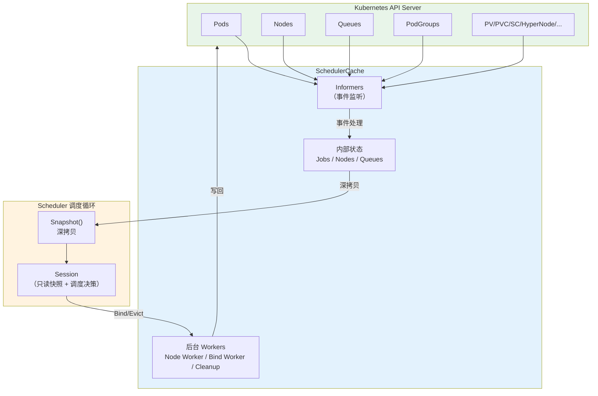
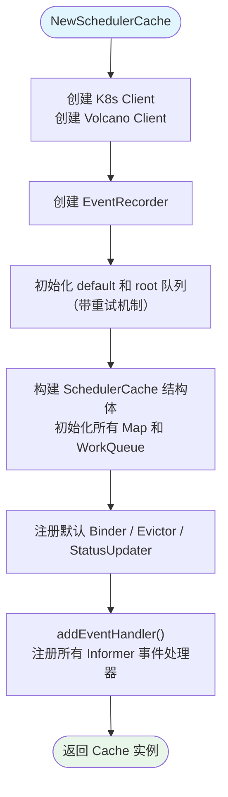
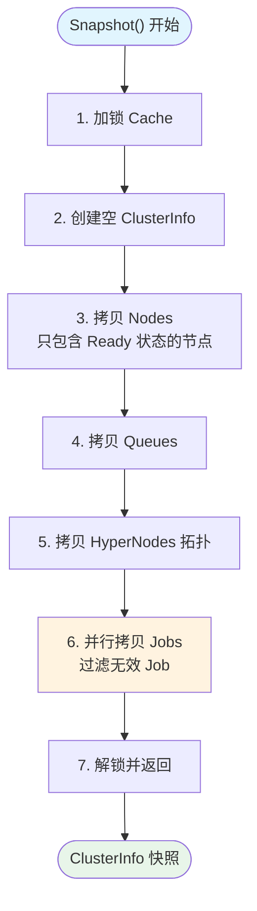
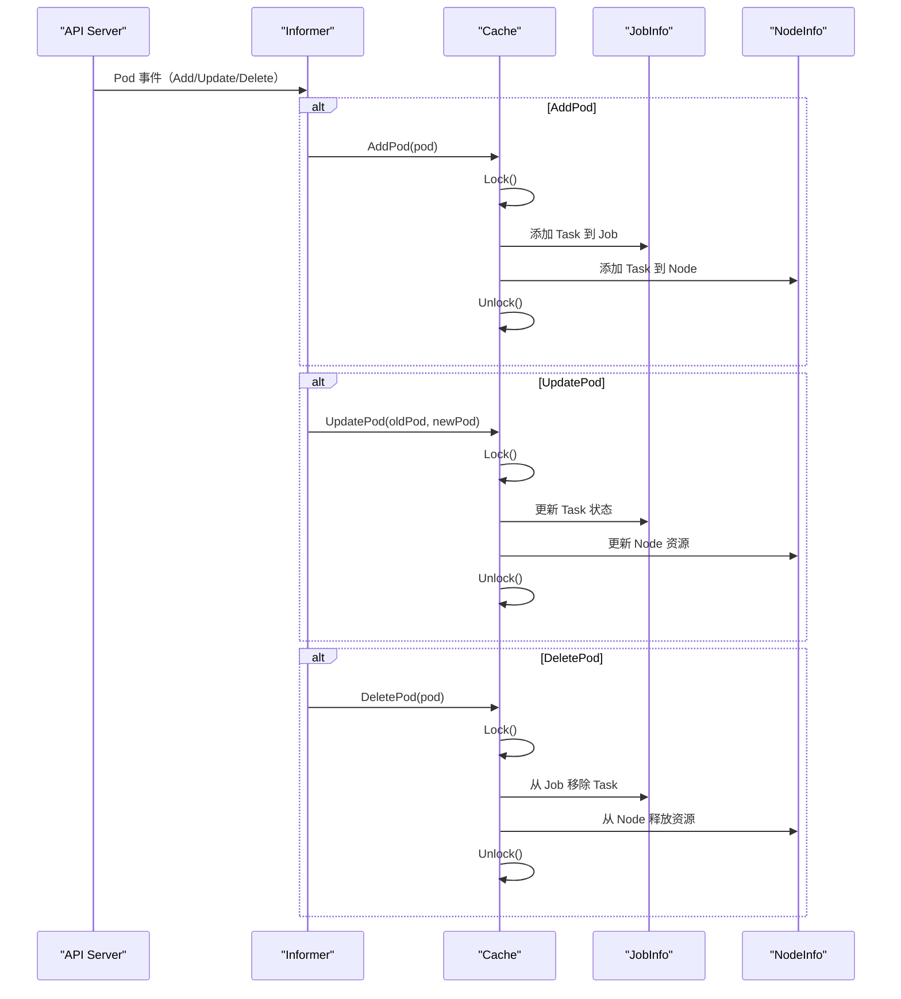
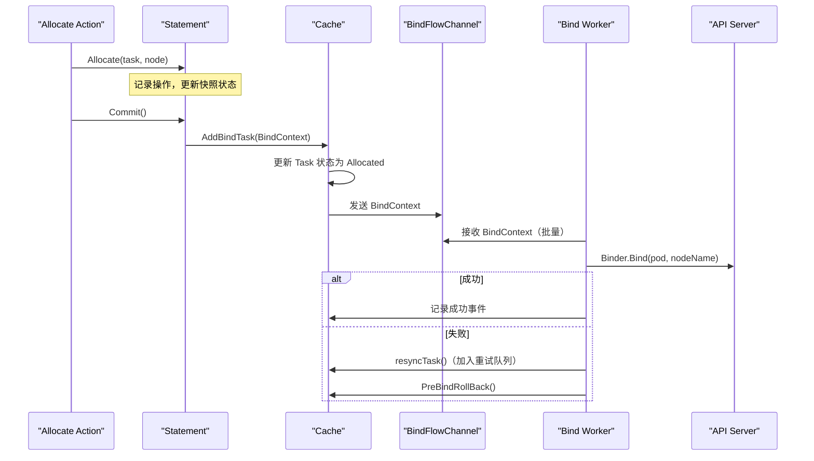

## 概述

SchedulerCache 是 Volcano 调度器的数据中枢，负责监听 Kubernetes API Server 的资源变更，维护集群的最新状态（Pod、Node、Queue、PodGroup 等），并在每个调度周期通过 Snapshot 提供一致性快照供调度决策使用。Cache 还承担了 Bind（绑定）、Evict（驱逐）和 Status Update（状态更新）的执行职责。

## 架构总览



---

## SchedulerCache 接口

> **源码参考**：`pkg/scheduler/cache/interface.go`

```go
type Cache interface {
    // 生命周期
    Run(stopCh <-chan struct{})
    WaitForCacheSync(stopCh <-chan struct{})

    // 快照
    Snapshot() *api.ClusterInfo

    // 绑定与驱逐
    AddBindTask(bindCtx *BindContext) error
    Evict(task *api.TaskInfo, reason string) error

    // 状态更新
    RecordJobStatusEvent(job *api.JobInfo, updatePG bool)
    UpdateJobStatus(job *api.JobInfo, ...) (*api.JobInfo, error)
    UpdateQueueStatus(queue *api.QueueInfo) error

    // 客户端
    Client() kubernetes.Interface
    VCClient() vcclient.Interface
    SharedInformerFactory() informers.SharedInformerFactory
    EventRecorder() record.EventRecorder

    // 会话钩子
    OnSessionOpen()
    OnSessionClose()

    // ... 其他方法
}
```

---

## 核心数据结构

> **源码参考**：`pkg/scheduler/cache/cache.go`

### 状态 Map

```go
// 核心状态（Mutex 保护）
Jobs   map[JobID]*JobInfo       // 所有 Job 及其 Task
Nodes  map[string]*NodeInfo     // 所有节点
Queues map[QueueID]*QueueInfo   // 所有队列

// 辅助数据
NodeList         []string                          // 有序节点名列表
PriorityClasses  map[string]*PriorityClass         // 优先级类
HyperNodesInfo   *HyperNodesInfo                   // 网络拓扑
CSINodesStatus   map[string]*CSINodeStatusInfo      // CSI 驱动状态
imageStates      map[string]*imageState             // 镜像可用性缓存
```

### 工作队列

```go
errTasks       workqueue.RateLimitingInterface  // 需要重试的 Task
nodeQueue      workqueue.RateLimitingInterface  // 待同步的 Node
DeletedJobs    workqueue.RateLimitingInterface  // 待清理的 Job
hyperNodesQueue workqueue.Interface              // HyperNode 同步
BindFlowChannel chan *BindContext                // 绑定请求通道
```

### 执行器

```go
Binder        Binder         // Pod 绑定到 Node（调用 API Server）
Evictor       Evictor        // Pod 驱逐（删除 Pod）
StatusUpdater StatusUpdater  // 更新 Pod/PodGroup/Queue 状态
```

---

## 初始化流程

### newSchedulerCache



### Informer 注册

`addEventHandler()` 注册以下 Informer 和事件处理器：

| Informer | 资源 | 事件处理方法 |
|----------|------|-------------|
| podInformer | Pod | AddPod / UpdatePod / DeletePod |
| nodeInformer | Node | AddNode / UpdateNode / DeleteNode |
| pvInformer | PersistentVolume | Add/Update/Delete |
| pvcInformer | PersistentVolumeClaim | Add/Update/Delete |
| scInformer | StorageClass | Add/Update/Delete |
| csiNodeInformer | CSINode | Add/Update/Delete |
| pcInformer | PriorityClass | Add/Update/Delete |
| podGroupInformer | PodGroup (v1beta1) | Add/Update/Delete |
| queueInformer | Queue (v1beta1) | Add/Update/Delete |
| hyperNodeInformer | HyperNode | Add/Update/Delete |
| nodeShardInformer | NodeShard | Add/Update/Delete |

**Pod 过滤**：只监听 `schedulerName` 匹配的 Pod。

**Node 处理**：Node 事件不直接处理，而是加入 `nodeQueue`，由后台 Worker 异步处理（`SyncNode()`）。

---

## Cache.Run() 启动

```go
func (sc *SchedulerCache) Run(stopCh <-chan struct{}) {
    // 1. 启动 Informer Factory
    sc.informerFactory.Start(stopCh)
    sc.vcInformerFactory.Start(stopCh)

    // 2. 等待所有 Informer 同步完成
    sc.WaitForCacheSync(stopCh)

    // 3. 启动 Node Worker（默认 20 个）
    for i := 0; i < sc.nodeWorkers; i++ {
        go wait.Until(sc.runNodeWorker, 0, stopCh)
    }

    // 4. 启动 HyperNode 同步
    go sc.runHyperNodeSyncWorker(stopCh)

    // 5. 启动错误 Task 重试
    go sc.runProcessResyncTask(stopCh)

    // 6. 启动 Job 清理
    go sc.runProcessCleanupJob(stopCh)

    // 7. 启动 Bind Worker（20ms 间隔批处理）
    go wait.Until(sc.processBindTask, 20*time.Millisecond, stopCh)

    // 8. 启动 Metrics 采集
    go wait.Until(sc.GetMetricsData, metricsInterval, stopCh)
}
```

---

## Snapshot 机制

### Snapshot() 方法

> **源码参考**：`pkg/scheduler/cache/cache.go` Snapshot 方法

Snapshot 创建 Cache 的深拷贝，供调度周期使用：



### 详细步骤

**1. 加锁**：获取 Cache 的全局 Mutex

**2. 创建空 ClusterInfo**：初始化所有 Map 字段

**3. 拷贝 Nodes**：
- 刷新 NUMA 调度信息
- 只拷贝 Ready 状态的节点（过滤 NotReady 节点）
- 标记 Revocable Node（可回收节点）
- 同时拷贝 CSI 节点状态

**4. 拷贝 Queues**：
- Clone 每个 QueueInfo

**5. 拷贝 HyperNodes**：
- 锁定 HyperNodesInfo（独立锁）
- 获取 HyperNode 数据和 Tier 信息
- 获取就绪状态

**6. 并行拷贝 Jobs**（性能优化的关键）：
- 过滤掉没有有效 PodGroup 的 Job
- 过滤掉队列不存在的 Job
- 使用 goroutine 并行 Clone 每个 Job
- 为每个 Job 设置 Priority（从 PriorityClass 获取）
- 使用独立的 Mutex 保护并发写入 snapshot Map

**7. 解锁并返回**

### 深拷贝的重要性

快照使用深拷贝有两个关键原因：

1. **隔离性**：调度周期对快照的修改（如资源分配）不会影响 Cache 中的真实状态
2. **并发安全**：Cache 可以继续接收 Informer 事件更新，而调度周期在独立的快照上操作

---

## 事件处理

### Pod 事件



### Node 事件

Node 事件采用异步处理模式：

1. **事件到达**：AddNode/UpdateNode/DeleteNode 将节点名加入 `nodeQueue`
2. **Worker 处理**：`runNodeWorker()` 从队列取出节点名，调用 `SyncNode()`
3. **SyncNode**：
   - 从 Informer Lister 获取最新 Node 对象
   - 如果 Node 不存在 → `RemoveNode()`
   - 如果存在 → `AddOrUpdateNode()`（更新资源信息、镜像状态等）

**为什么异步处理？** 节点更新可能触发大量资源重算，异步处理避免阻塞 Informer。

### Queue / PodGroup 事件

- **Queue 事件**：直接更新 Cache 中的 QueueInfo
- **PodGroup 事件**：更新或创建对应的 JobInfo，将 PodGroup 关联到 Job

---

## Bind 流水线

Bind 是将调度决策落实到 Kubernetes API 的过程：



### AddBindTask

1. 加锁 Cache
2. 找到对应的 Job 和 Task
3. 更新 Task 状态为 `Allocated`
4. 更新 Node 资源信息
5. 发送 `BindContext` 到 `BindFlowChannel`（异步）
6. 立即返回

### processBindTask

- 每 20ms 执行一次
- 从 `BindFlowChannel` 批量取出 BindContext（批大小通过 `BATCH_BIND_NUM` 环境变量配置）
- 调用 `Binder.Bind()` 发送到 API Server
- 失败的 Task 通过 `errTasks` 队列重试

### BindContext 扩展

```go
type BindContext struct {
    TaskInfo   *api.TaskInfo                    // 待绑定的 Pod
    Extensions map[string]BindContextExtension  // Plugin 扩展数据
}
```

Plugin 可以通过实现 `BindContextHandler` 接口在绑定时注入自定义数据（如拓扑约束、设备分配信息等）。

---

## Evict 流水线

```go
func (sc *SchedulerCache) Evict(task *api.TaskInfo, reason string) error {
    // 1. Lock
    // 2. 找到 Job 和 Task
    // 3. 验证 PodGroup 存在
    // 4. 更新 Task 状态为 Releasing
    // 5. 更新 Node 任务列表
    // 6. 异步执行 Evictor.Evict()
    // 7. 记录事件
}
```

默认 Evictor 的操作：
1. 更新 Pod 的 Condition（PodReady=False, DisruptionTarget=True）
2. 调用 `Pods().UpdateStatus()` 更新 Pod 状态
3. 调用 `Pods().Delete()` 删除 Pod
4. 记录驱逐事件

---

## 错误重试机制

Cache 维护了多个重试队列：

| 队列 | 内容 | 重试策略 |
|------|------|---------|
| `errTasks` | 绑定失败的 Task | RateLimited（退避重试） |
| `DeletedJobs` | 待清理的已终止 Job | RateLimited |
| `nodeQueue` | 待同步的 Node | 即时处理 |

`errTasks` 处理流程：
1. 从队列取出 Task Key
2. 解析 Job ID 和 Task ID
3. 从 Cache 中查找 Task
4. 调用 `resyncTask()` 重新同步状态
5. 失败则重新入队

---

## Shard 模式

Volcano 支持多调度器 Shard 部署，每个调度器负责一部分节点：

- `NodeShard` CRD 定义节点的 Shard 归属
- `ShardUpdateCoordinator` 协调多个 Shard 之间的状态
- Cache 根据 Shard 过滤节点，只处理属于自己的节点

---

## 常见问题

### Q: Snapshot 的深拷贝会不会影响性能？

Job 的深拷贝采用了并行策略，可以有效利用多核。对于大规模集群（万级 Pod），Snapshot 耗时通常在毫秒级别。可以通过调度器日志中的时间记录来评估。

### Q: Cache 中的数据和 API Server 不一致怎么办？

Informer 使用 Watch + List 机制保证最终一致性。如果出现短暂不一致，调度器的决策可能基于过时数据，但通过以下机制保证安全：
- Bind 操作最终由 API Server 验证
- 失败的 Bind 会触发重试
- 下一个调度周期会使用最新快照

---

## 下一步

- [Session 框架](./03-session-framework.md) -- 理解 Session 如何使用快照进行调度
- [Statement 与绑定](./06-statement-and-binding.md) -- 深入理解事务式调度和 Bind 流程
- [资源模型](./07-resource-model.md) -- 节点资源追踪（Idle/Used/Releasing/Pipelined）
