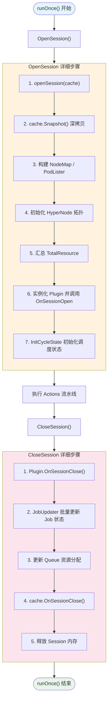
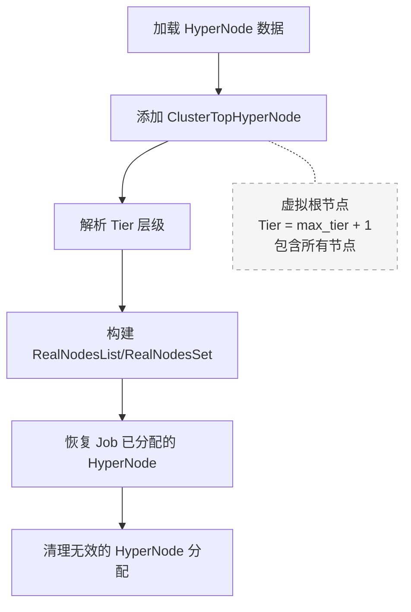
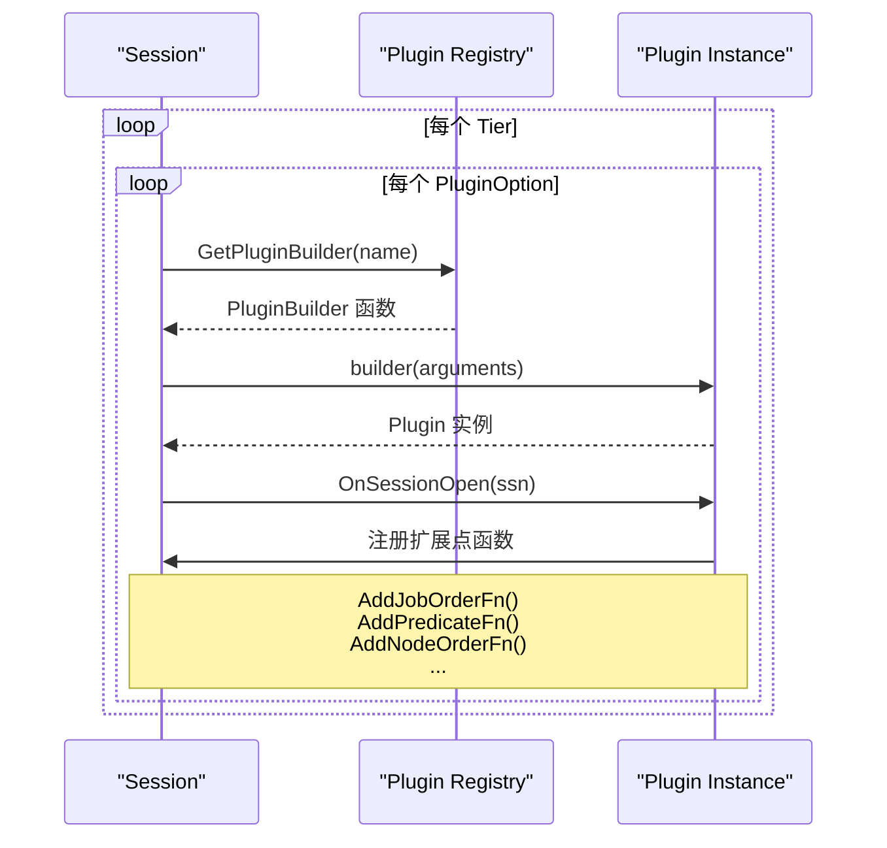
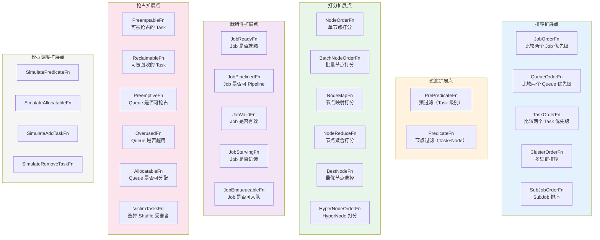
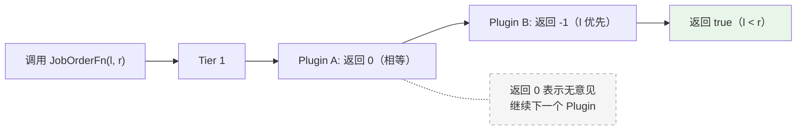
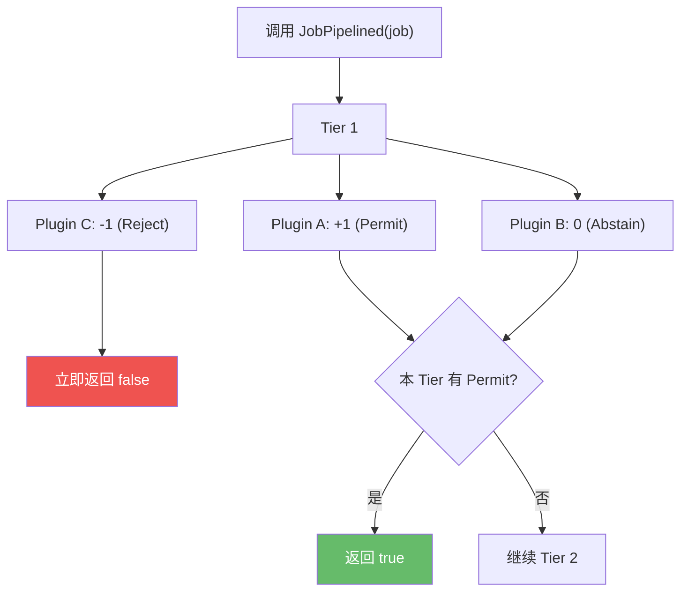
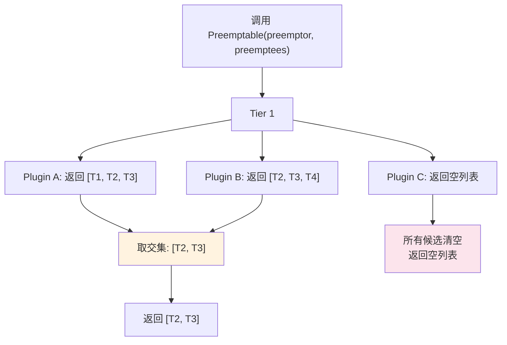
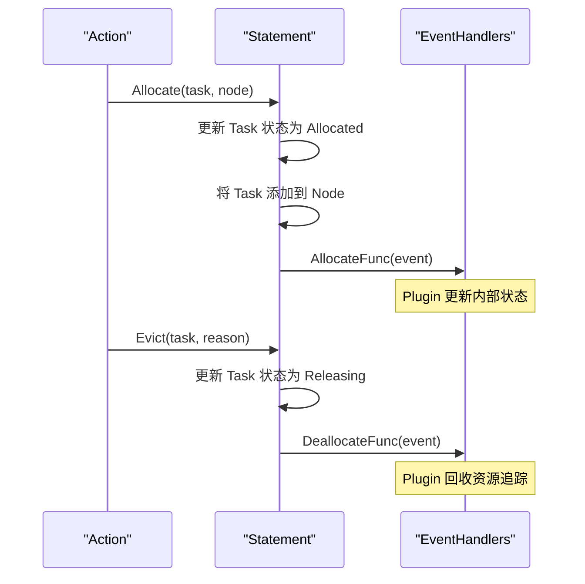
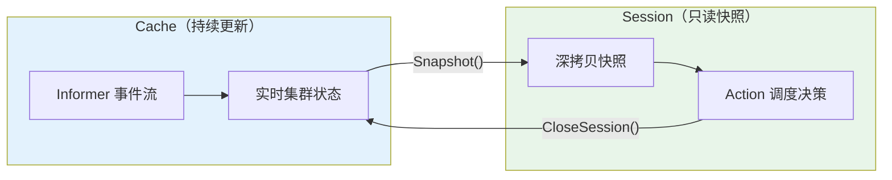

## 概述

Session 是 Volcano 调度器每个调度周期的核心工作上下文。每次 `runOnce()` 执行时，调度器通过 `OpenSession()` 从 Cache 创建一份集群状态的深拷贝快照，并在快照之上初始化所有 Plugin 扩展点，形成一个完整的 Session 对象。所有 Action 在同一个 Session 上执行调度决策，Session 关闭时将决策结果提交回 Cache。

Session 的设计核心理念：**快照隔离 + 扩展点驱动**。快照隔离确保调度过程不受外部事件干扰；扩展点驱动允许 Plugin 灵活注入调度逻辑。

## Session 结构体

> **源码参考**：`pkg/scheduler/framework/session.go`

```go
type Session struct {
    UID types.UID

    // Kubernetes 客户端
    kubeClient      kubernetes.Interface
    vcClient        vcclient.Interface
    recorder        record.EventRecorder
    cache           cache.Cache
    restConfig      *rest.Config
    informerFactory informers.SharedInformerFactory

    // 资源统计
    TotalResource  *api.Resource          // 集群总资源
    TotalGuarantee *api.Resource          // 队列总 Guarantee
    TotalDeserved  *api.Resource          // 队列总 Deserved
    PodGroupOldState *api.PodGroupOldState // PodGroup 历史状态（不可修改）
    DirtyJobs sets.Set[api.JobID]         // 需要刷新到 Cache 的 Job

    // 快照数据
    Jobs           map[api.JobID]*api.JobInfo
    Nodes          map[string]*api.NodeInfo
    CSINodesStatus map[string]*api.CSINodeStatusInfo
    RevocableNodes map[string]*api.NodeInfo
    Queues         map[api.QueueID]*api.QueueInfo
    NamespaceInfo  map[api.NamespaceName]*api.NamespaceInfo

    // K8s 兼容层
    NodeMap   map[string]fwk.NodeInfo    // K8s Framework 兼容的 NodeInfo
    PodLister *PodLister                  // Pod 列表查询器

    // 配置
    Tiers          []conf.Tier
    Configurations []conf.Configuration
    NodeList       []*api.NodeInfo

    // HyperNode 拓扑
    HyperNodes           api.HyperNodeInfoMap
    HyperNodeTierNameMap api.HyperNodeTierNameMap
    HyperNodesSetByTier  map[int]sets.Set[string]
    HyperNodesTiers      []int
    RealNodesList        map[string][]*api.NodeInfo
    RealNodesSet         map[string]sets.Set[string]
    HyperNodesReadyToSchedule bool

    // Plugin 管理
    plugins       map[string]Plugin
    eventHandlers []*EventHandler

    // 扩展点函数映射（30+ 扩展点）
    jobOrderFns, queueOrderFns, taskOrderFns, clusterOrderFns       ...CompareFn
    victimQueueOrderFns                                              ...VictimCompareFn
    predicateFns, prePredicateFns                                    ...PredicateFn
    bestNodeFns, nodeOrderFns, batchNodeOrderFns                     ...NodeOrderFn
    nodeMapFns, nodeReduceFns, hyperNodeOrderFns                     ...NodeMapFn
    preemptableFns, reclaimableFns                                   ...EvictableFn
    overusedFns, allocatableFns                                      ...ValidateFn
    preemptiveFns                                                    ...ValidateWithCandidateFn
    jobReadyFns, jobPipelinedFns, jobValidFns                        ...ValidateFn/VoteFn
    jobEnqueueableFns, jobEnqueuedFns                                ...VoteFn/JobEnqueuedFn
    targetJobFns, reservedNodesFns, victimTasksFns, jobStarvingFns   ...各类函数
    // 模拟调度扩展点
    simulateRemoveTaskFns, simulateAddTaskFns                        ...SimulateFn
    simulatePredicateFns, simulateAllocatableFns                     ...SimulateFn
    // SubJob 扩展点
    subJobReadyFns, subJobPipelinedFns, subJobOrderFns               ...各类函数
    // HyperNode 梯度扩展点
    hyperNodeGradientForJobFns, hyperNodeGradientForSubJobFns        ...GradientFn

    // CycleState 缓存
    cycleStatesMap sync.Map              // TaskID -> CycleState
    NodesInShard   sets.Set[string]      // 分片节点集合
}
```

---

## Session 生命周期

### 整体流程



### OpenSession 详解

> **源码参考**：`pkg/scheduler/framework/framework.go::OpenSession()`

`OpenSession()` 是每个调度周期的核心准备阶段：

#### 步骤 1：创建空 Session

```go
ssn := openSession(cache)
```

`openSession()` 初始化 Session 的基本字段：
- 生成唯一 UID
- 获取 K8s/Volcano 客户端引用
- 初始化空的 Map 数据结构（Jobs、Nodes、Queues 等）
- 初始化所有扩展点函数映射为空 Map
- 调用 `cache.OnSessionOpen()` 通知 Cache

#### 步骤 2：加载快照

```go
snapshot := cache.Snapshot()
```

从 Cache 深拷贝当前集群状态（详见 [Cache 与快照](./02-cache-and-snapshot.md)），将 Jobs、Nodes、Queues 等数据填充到 Session 中。

#### 步骤 3：构建 K8s 兼容层

为了兼容 K8s 原生调度框架的 Predicate 和 NodeOrder 接口：
- 构建 `NodeMap`：将 Volcano 的 `NodeInfo` 转换为 K8s `framework.NodeInfo`
- 构建 `PodLister`：支持 K8s 调度框架的 Pod 查询接口

#### 步骤 4：初始化 HyperNode 拓扑



- **ClusterTopHyperNode**：创建一个虚拟的集群顶层 HyperNode，Tier 值为最大 Tier + 1。即使没有真实 HyperNode，也会创建这个虚拟节点包含所有 Node
- **Tier 层级**：HyperNode 按 Tier 分层，Tier 越低表示拓扑距离越近、通信性能越好

#### 步骤 5：汇总集群资源

遍历所有 Node，累加 `TotalResource`，用于后续调度决策中的全局资源感知。

#### 步骤 6：实例化 Plugin



按 Tier 配置顺序，依次：
1. 从全局 Registry 获取 PluginBuilder
2. 用配置参数实例化 Plugin
3. 调用 `OnSessionOpen(ssn)`，Plugin 在此注册自己的扩展点函数
4. 记录每个 Plugin 初始化耗时（Metrics）

#### 步骤 7：初始化 CycleState

为每个待调度的 Pending Pod 创建 `CycleState`，存储到 `cycleStatesMap` 中。`CycleState` 是 K8s 调度框架的状态传递机制，允许在 PreFilter → Filter → Score 等扩展点之间传递中间数据。

### CloseSession 详解

> **源码参考**：`pkg/scheduler/framework/framework.go::CloseSession()`

`CloseSession()` 通过 `defer` 确保在 `runOnce()` 结束时执行：

1. **Plugin 清理**：逆序调用每个 Plugin 的 `OnSessionClose(ssn)`
2. **Job 状态更新**：通过 `JobUpdater.UpdateAll()` 批量提交 Job/PodGroup 状态变更到 API Server
3. **Queue 状态更新**：更新各队列的已分配资源
4. **Cache 通知**：调用 `cache.OnSessionClose()` 同步状态
5. **内存释放**：将 Session 中的大数据结构置为 nil，辅助 GC

---

## 扩展点体系

扩展点是 Session 框架的核心机制，Plugin 通过注册扩展点函数来参与调度决策。

### 扩展点分类



### 扩展点注册 API

> **源码参考**：`pkg/scheduler/framework/session_plugins.go`

Plugin 在 `OnSessionOpen()` 中通过 `Add*Fn()` 方法注册扩展点：

| 注册方法 | 函数签名 | 用途 |
|---------|----------|------|
| `AddJobOrderFn` | `CompareFn` | Job 排序 |
| `AddQueueOrderFn` | `CompareFn` | Queue 排序 |
| `AddTaskOrderFn` | `CompareFn` | Task 排序 |
| `AddPredicateFn` | `PredicateFn` | 节点过滤 |
| `AddPrePredicateFn` | `PrePredicateFn` | 预过滤 |
| `AddNodeOrderFn` | `NodeOrderFn` | 节点打分 |
| `AddBatchNodeOrderFn` | `BatchNodeOrderFn` | 批量节点打分 |
| `AddBestNodeFn` | `BestNodeFn` | 最优节点选择 |
| `AddPreemptableFn` | `EvictableFn` | 标识可抢占 Task |
| `AddReclaimableFn` | `EvictableFn` | 标识可回收 Task |
| `AddJobReadyFn` | `ValidateFn` | Job 就绪检查 |
| `AddJobPipelinedFn` | `VoteFn` | Job Pipeline 投票 |
| `AddJobValidFn` | `ValidateExFn` | Job 有效性校验 |
| `AddOverusedFn` | `ValidateFn` | Queue 超用检查 |
| `AddAllocatableFn` | `AllocatableFn` | Queue 可分配检查 |
| `AddJobEnqueueableFn` | `VoteFn` | Job 入队投票 |
| `AddVictimTasksFn` | `VictimTasksFn` | Shuffle 受害者选择 |

---

## 扩展点调用模式

Session 框架定义了三种扩展点调用模式，决定了多个 Plugin 的结果如何合并。

### 模式一：链式短路（CompareFn）

用于排序类扩展点（JobOrder、QueueOrder、TaskOrder）。



```go
func (ssn *Session) JobOrderFn(l, r interface{}) bool {
    for _, tier := range ssn.Tiers {
        for _, plugin := range tier.Plugins {
            if !isEnabled(plugin.EnabledJobOrder) { continue }
            fn, found := ssn.jobOrderFns[plugin.Name]
            if !found { continue }
            if result := fn(l, r); result != 0 {
                return result < 0  // 第一个非零结果即返回
            }
        }
    }
    // 所有 Plugin 都返回 0，使用默认排序
    return defaultJobOrder(l, r)
}
```

**特点**：按 Tier 顺序遍历 Plugin，第一个返回非零结果的 Plugin 决定排序。

### 模式二：投票机制（VoteFn）

用于决策类扩展点（JobPipelined、JobEnqueueable）。



```go
// VoteFn 返回值：-1 = Reject, 0 = Abstain, +1 = Permit
func (ssn *Session) JobPipelined(obj interface{}) bool {
    var hasFound bool
    for _, tier := range ssn.Tiers {
        for _, plugin := range tier.Plugins {
            res := fn(obj)
            if res < 0 { return false }   // Reject 立即生效
            if res > 0 { hasFound = true } // Permit 标记
        }
        if hasFound { return true }        // Tier 级别的 Permit
    }
    return true // 默认允许
}
```

**特点**：
- **Reject (-1)**：任何 Plugin 返回 Reject，立即否决
- **Permit (+1)**：本 Tier 内有 Permit 且无 Reject，在 Tier 结束时生效
- **Abstain (0)**：弃权，不影响结果

### 模式三：交集投票（EvictableFn）

用于抢占和回收类扩展点（Preemptable、Reclaimable）。



```go
func (ssn *Session) Preemptable(preemptor *api.TaskInfo, preemptees []*api.TaskInfo) []*api.TaskInfo {
    var victims []*api.TaskInfo
    for _, tier := range ssn.Tiers {
        for _, plugin := range tier.Plugins {
            candidates, abstain := fn(preemptor, preemptees)
            if abstain == 0 { continue }     // 弃权
            if len(candidates) == 0 {
                victims = nil; break          // 空列表 = 否决
            }
            if victims == nil {
                victims = candidates           // 第一票
            } else {
                victims = intersect(victims, candidates) // 取交集
            }
        }
        if victims != nil { return victims }
    }
    return victims
}
```

**特点**：多个 Plugin 的候选受害者列表取**交集**，确保所有 Plugin 都同意的 Task 才会被抢占/回收。

---

## Session 核心方法

### 资源分配方法

| 方法 | 说明 |
|------|------|
| `Allocate(task, node)` | 将 Task 分配到 Node（通过 Statement） |
| `Pipeline(task, hostname)` | 将 Task 标记为 Pipeline 状态（预分配） |
| `Evict(task, reason)` | 驱逐 Task（释放资源） |

### 查询方法

| 方法 | 说明 |
|------|------|
| `JobOrderFn(l, r)` | 比较两个 Job 的优先级 |
| `TaskOrderFn(l, r)` | 比较两个 Task 的优先级 |
| `PredicateFn(task, node)` | 检查 Task 是否能放置到 Node |
| `NodeOrderFn(task, node)` | 为 Node 打分 |
| `JobReady(job)` | 检查 Job 是否就绪 |
| `JobPipelined(job)` | 检查 Job 是否可以 Pipeline |
| `JobValid(job)` | 验证 Job 是否有效 |
| `Allocatable(queue, task)` | 检查 Queue 是否有资源分配 |

### 抢占方法

| 方法 | 说明 |
|------|------|
| `Preemptable(preemptor, preemptees)` | 从候选列表中选择可抢占的 Task |
| `Reclaimable(reclaimer, reclaimees)` | 从候选列表中选择可回收的 Task |
| `VictimTasks(tasks)` | 选择 Shuffle 操作的受害者 |
| `BuildVictimsPriorityQueue(...)` | 按优先级排列受害者 |

---

## EventHandler 机制

Session 支持事件处理器，允许 Plugin 监听资源分配和释放事件：

```go
type EventHandler struct {
    AllocateFunc   func(event *Event)  // Task 分配到 Node 时触发
    DeallocateFunc func(event *Event)  // Task 从 Node 释放时触发
}
```

Plugin 通过 `ssn.AddEventHandler(handler)` 注册事件处理器。事件处理器在以下时机被调用：



---

## CycleState 管理

CycleState 是 K8s 调度框架中的状态传递机制，用于在同一个 Pod 的不同调度扩展点之间传递中间数据。

```go
// 存储：TaskID -> CycleState
cycleStatesMap sync.Map
```

### 生命周期

1. **创建**：`InitCycleState()` 在 OpenSession 时为每个 Pending Pod 创建
2. **使用**：PreFilter 写入 → Filter/Score 读取
3. **销毁**：Session 关闭时随 Session 一起释放

### 使用示例

```go
// PreFilter 阶段：计算并存储中间结果
state := ssn.GetCycleState(taskUID)
state.Write("nodeaffinity", &NodeAffinityState{...})

// Filter 阶段：读取中间结果
data, _ := state.Read("nodeaffinity")
affinityState := data.(*NodeAffinityState)
```

---

## 关键设计模式

### 快照隔离



- Cache 持续接收 Informer 事件更新实时状态
- Session 在创建时获取快照，此后不再受 Cache 更新影响
- Action 在快照上执行调度决策
- Session 关闭时将决策结果批量提交回 Cache

### Tier 优先级

Plugin 按 Tier 分层，高 Tier 的 Plugin 优先生效：

```yaml
tiers:
  - plugins:
      - name: gang        # Tier 1（最高优先级）
      - name: priority
  - plugins:
      - name: drf         # Tier 2
      - name: proportion
  - plugins:
      - name: predicates  # Tier 3
      - name: nodeorder
```

在扩展点调用时，Tier 1 的 Plugin 先于 Tier 2 执行。对于排序类扩展点，高 Tier Plugin 的结果覆盖低 Tier；对于投票类扩展点，高 Tier 的 Reject 立即否决，无需等待低 Tier。

### 扩展点开关

每个 Plugin 可以通过配置选择性启用或禁用特定扩展点：

```yaml
plugins:
  - name: gang
    enabledJobOrder: true
    enabledJobReady: true
    enabledJobPipelined: true
    enabledPreemptable: true
    # 其他扩展点默认启用
```

未显式设置的扩展点默认启用（`nil` 被视为 `true`）。这允许精细控制每个 Plugin 参与哪些调度决策。

---

## 常见问题

### Q: 为什么需要 Tier 机制？

Tier 机制实现了 Plugin 的优先级分层。例如，Gang 调度约束（必须全部满足 minMember）比 DRF 公平性更重要，所以 Gang Plugin 应该放在更高的 Tier。当 Gang Plugin 对 JobOrder 给出明确意见时，DRF 的意见不再需要考虑。

### Q: Session 中修改 Job/Node 状态会影响 Cache 吗？

不会。Session 中的 Job/Node/Queue 都是深拷贝，对它们的修改不会影响 Cache。只有在 `CloseSession()` 时，通过 `JobUpdater` 显式提交的变更才会更新到 API Server。

### Q: 一个调度周期内如何保证一致性？

通过快照隔离。调度周期开始时 `Snapshot()` 创建一致性快照，即使在调度过程中有新的 Pod 创建或 Node 状态变化，当前周期的决策不受影响。新事件会在下一个调度周期被处理。

---

## 下一步

- [Action 流水线](./04-action-pipeline.md) -- 各 Action 如何使用 Session 进行调度决策
- [Plugin 系统](./05-plugin-system.md) -- Plugin 如何注册扩展点、内置 Plugin 详解
- [Statement 与绑定](./06-statement-and-binding.md) -- Statement 事务模型与 Commit/Discard 机制
