## 概述

Action 流水线是 Volcano 调度器每个调度周期的执行引擎。在 `runOnce()` 中，调度器按配置顺序依次执行每个 Action，每个 Action 在 Session 快照上进行特定类型的调度决策。默认的 Action 执行顺序为：

```
enqueue → allocate → backfill → reclaim → preempt → shuffle
```

每个 Action 实现不同的调度策略：入队控制、资源分配、空隙填充、资源回收、抢占调度、随机重调度。

## Action 接口

> **源码参考**：`pkg/scheduler/framework/interface.go`

```go
type Action interface {
    Name() string           // Action 唯一名称
    Initialize()            // 初始化（一次性）
    Execute(ssn *Session)   // 执行调度逻辑
    UnInitialize()          // 清理
}
```

所有 Action 在 `pkg/scheduler/actions/factory.go` 中注册：

```go
func init() {
    framework.RegisterAction(enqueue.New())
    framework.RegisterAction(allocate.New())
    framework.RegisterAction(backfill.New())
    framework.RegisterAction(preempt.New())
    framework.RegisterAction(reclaim.New())
    framework.RegisterAction(shuffle.New())
}
```

---

## Action 执行流程总览

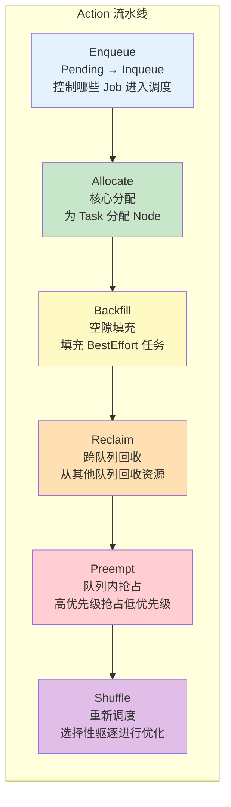

---

## Enqueue Action

> **源码参考**：`pkg/scheduler/actions/enqueue/enqueue.go`

### 职责

控制 Job 从 `Pending` 状态转为 `Inqueue` 状态。只有 Inqueue 的 Job 才会进入后续的 Allocate 流程。Enqueue 通过检查队列资源和 Plugin 投票来决定哪些 Job 可以入队。

### 算法流程

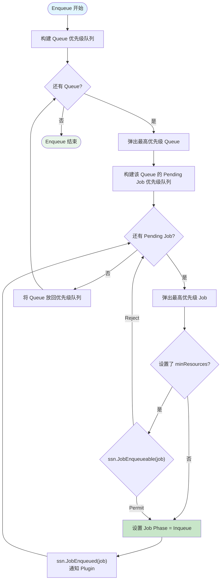

### 关键机制

- **Queue 排序**：通过 `ssn.QueueOrderFn()` 确定队列优先级
- **Job 排序**：通过 `ssn.JobOrderFn()` 确定 Job 优先级
- **入队投票**：`ssn.JobEnqueueable(job)` 使用 VoteFn 模式，Plugin 可以 Permit/Reject/Abstain
- **通知机制**：`ssn.JobEnqueued(job)` 通知所有 Plugin 某个 Job 已入队（如 Proportion Plugin 用此更新队列已分配资源）

---

## Allocate Action

> **源码参考**：`pkg/scheduler/actions/allocate/allocate.go`

### 职责

Allocate 是最核心的 Action，负责为 Inqueue 状态的 Job 的 Pending Task 分配节点。它实现了完整的 Gang Scheduling 语义：要么 Job 的 minMember 个 Task 都能分配，要么一个都不分配。

### 算法流程

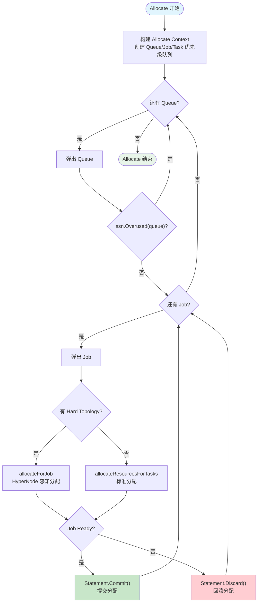

### 核心分配循环：allocateResourcesForTasks

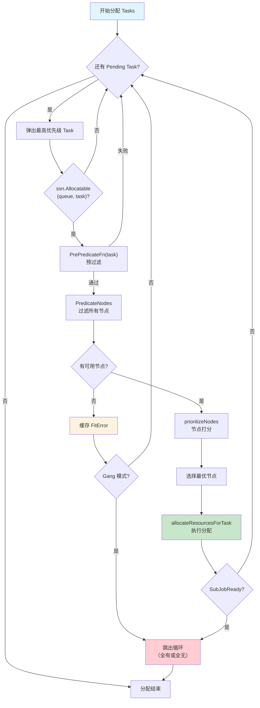

### 节点选择过程

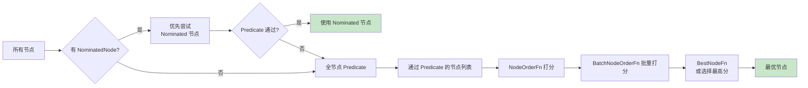

### HyperNode 感知分配

对于设置了 Hard Topology 的 Job，Allocate 使用 HyperNode 梯度搜索：

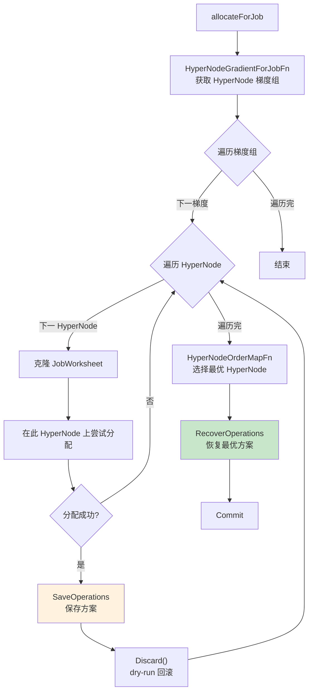

### 关键特性

- **Predicate 缓存**：可以缓存节点不满足条件的错误，避免重复计算
- **Statement 事务**：每个 Job 的分配在 Statement 中执行，支持原子 Commit/Discard
- **Gang Scheduling**：如果某个 Task 无法分配，Gang 模式下整个 Job 的分配回滚

---

## Backfill Action

> **源码参考**：`pkg/scheduler/actions/backfill/backfill.go`

### 职责

在 Allocate 之后填充剩余的节点空隙。主要处理 BestEffort 类型的 Task（不参与 Gang 调度的任务）。

### 算法流程

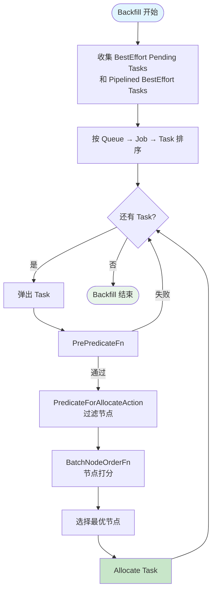

### 特点

- **轻量级**：不涉及 Gang 语义，逐个 Task 独立分配
- **填充角色**：利用 Gang 调度后的剩余资源
- **低优先级**：只处理 BestEffort 任务

---

## Reclaim Action

> **源码参考**：`pkg/scheduler/actions/reclaim/reclaim.go`

### 职责

跨队列资源回收。当某个队列的 Job 处于饥饿状态时，从其他使用了超额资源的队列中回收资源。

### 算法流程

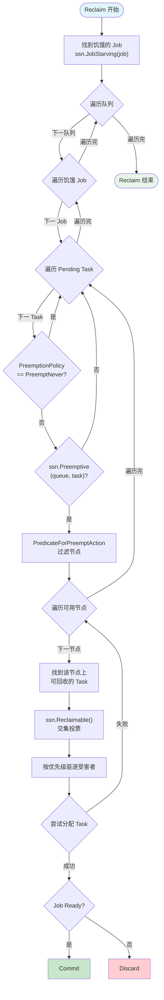

### 受害者选择条件

一个 Task 可以被回收必须同时满足：
1. 状态为 `Running` 且标记为 `Preemptable`
2. 属于**不同队列**且该队列是 `Reclaimable`，或属于**同一队列**但优先级更低
3. 通过 `ssn.Reclaimable()` 交集投票

---

## Preempt Action

> **源码参考**：`pkg/scheduler/actions/preempt/preempt.go`

### 职责

队列内抢占。高优先级的饥饿 Job 可以抢占同队列中低优先级 Job 的 Task。

### 算法流程

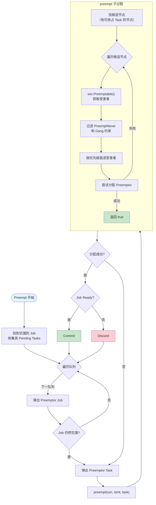

### 拓扑感知抢占

Preempt 支持拓扑感知模式，通过配置启用：

```yaml
configurations:
  - name: preempt
    arguments:
      enableTopologyAwarePreemption: true
      topologyAwarePreemptWorkerNum: 16
      minCandidateNodesPercentage: 10
      maxCandidateNodesAbsolute: 100
```

拓扑感知抢占使用 Worker Pool 并行评估候选节点，减少抢占决策延迟。

---

## Shuffle Action

> **源码参考**：`pkg/scheduler/actions/shuffle/shuffle.go`

### 职责

Shuffle 是最简单的 Action，通过 Plugin 选择性驱逐部分运行中的 Task，使其重新调度到更优的节点。

### 算法流程

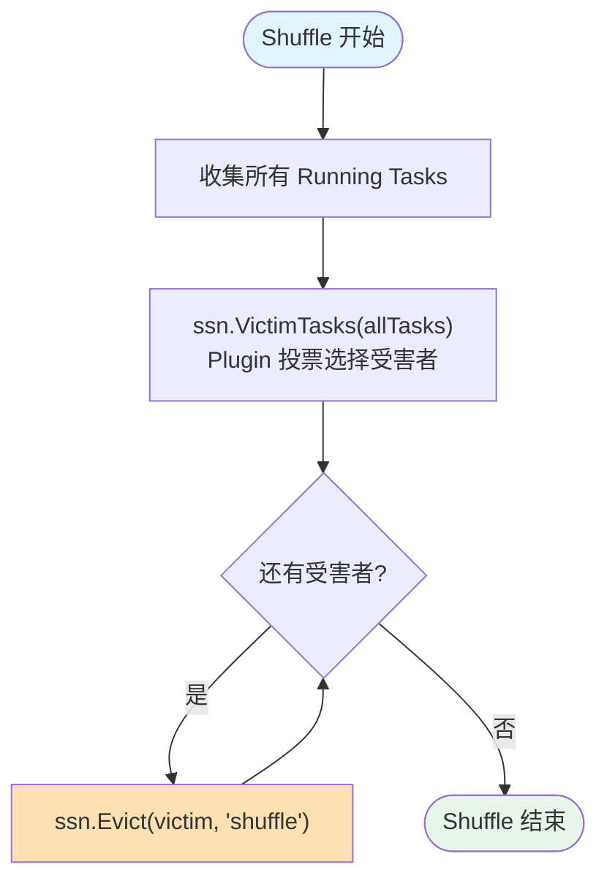

### 使用场景

- **负载均衡**：将 Task 从负载高的节点迁移到负载低的节点
- **节点整合**：将分散的 Task 聚集到少数节点，释放空闲节点
- **NUMA 优化**：将 Task 迁移到 NUMA 拓扑更优的节点
- **自定义策略**：通过 Plugin 实现任意驱逐策略

---

## Action 间的协作

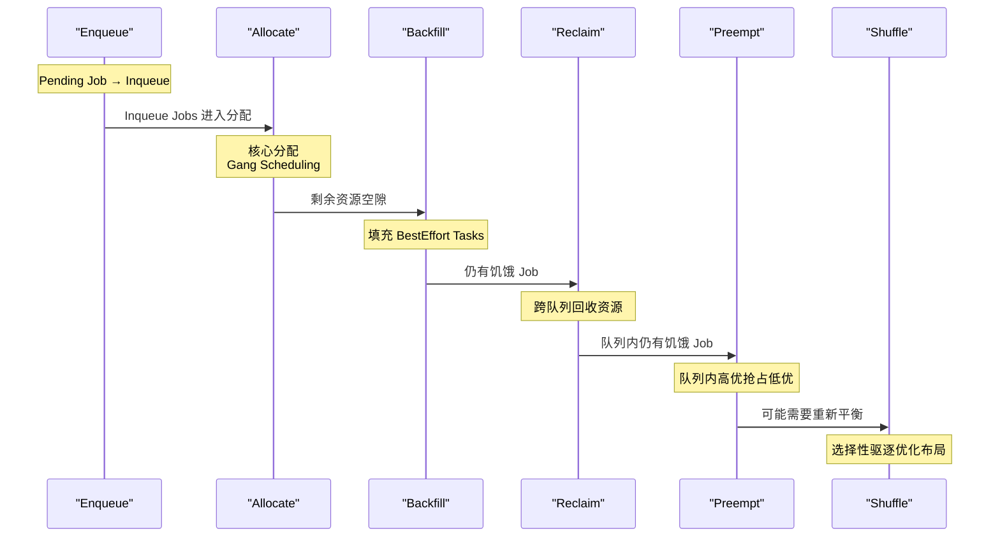

### 资源流动模型

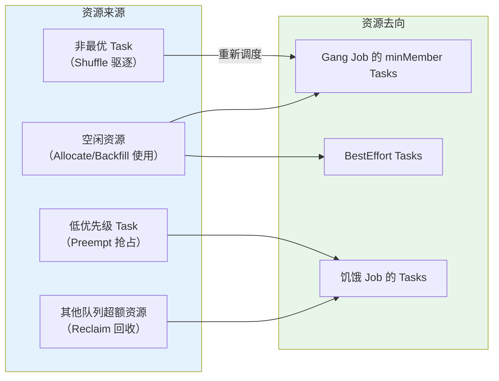

---

## 配置与定制

### Action 执行顺序

通过调度器配置文件指定 Action 执行顺序：

```yaml
actions: "enqueue, allocate, backfill, reclaim, preempt, shuffle"
```

可以根据场景调整顺序或移除不需要的 Action：

| 场景 | 推荐配置 |
|------|---------|
| 基础调度 | `enqueue, allocate, backfill` |
| 多队列公平共享 | `enqueue, allocate, backfill, reclaim` |
| 完整功能 | `enqueue, allocate, backfill, reclaim, preempt, shuffle` |
| 高优先级调度 | `enqueue, allocate, preempt, backfill` |

### 注册自定义 Action

```go
// 实现 Action 接口
type myAction struct{}
func (a *myAction) Name() string         { return "myaction" }
func (a *myAction) Initialize()          { }
func (a *myAction) Execute(ssn *Session) { /* 调度逻辑 */ }
func (a *myAction) UnInitialize()        { }

// 注册
framework.RegisterAction(&myAction{})
```

在配置中启用：
```yaml
actions: "enqueue, allocate, myaction, backfill"
```

---

## 常见问题

### Q: Action 的执行顺序重要吗？

非常重要。Enqueue 必须在 Allocate 之前（否则没有 Inqueue 的 Job）。Allocate 通常在 Reclaim/Preempt 之前（先尝试用空闲资源，不够再回收/抢占）。Shuffle 通常最后执行（在其他分配完成后优化布局）。

### Q: Allocate 失败的 Job 会重试吗？

当前周期失败的 Job 不会立即重试。它会保持 Inqueue 状态，在下一个调度周期重新尝试分配。如果连续多个周期都失败，PodGroup 的 Condition 会记录 `Unschedulable` 原因。

### Q: Reclaim 和 Preempt 的区别是什么？

- **Reclaim**：跨队列回收。队列 A 的 Job 从队列 B 回收超额使用的资源
- **Preempt**：队列内抢占。同一队列内高优先级 Job 抢占低优先级 Job 的资源

---

## 下一步

- [Plugin 系统](./05-plugin-system.md) -- Plugin 如何为 Action 提供决策支持
- [Statement 与绑定](./06-statement-and-binding.md) -- Action 中的事务机制
- [资源模型](./07-resource-model.md) -- 资源的多维度表示与计算
