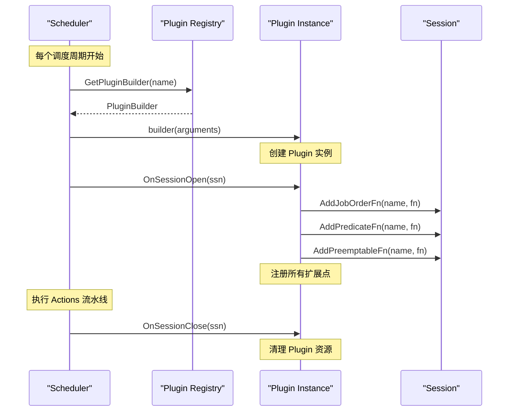
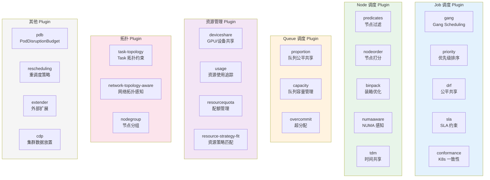
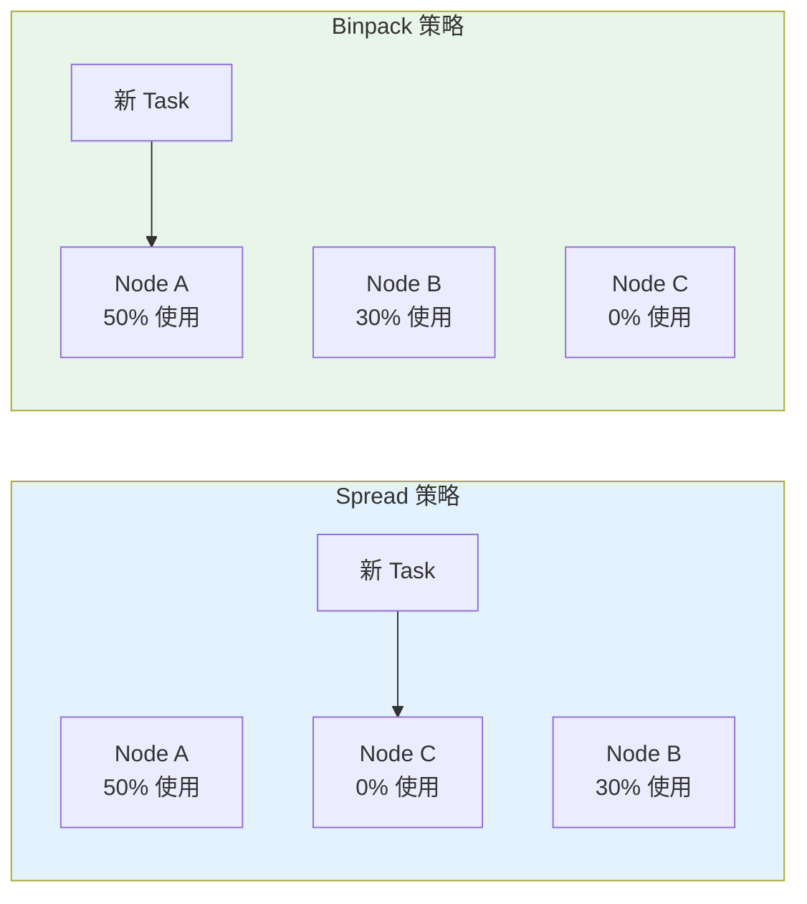
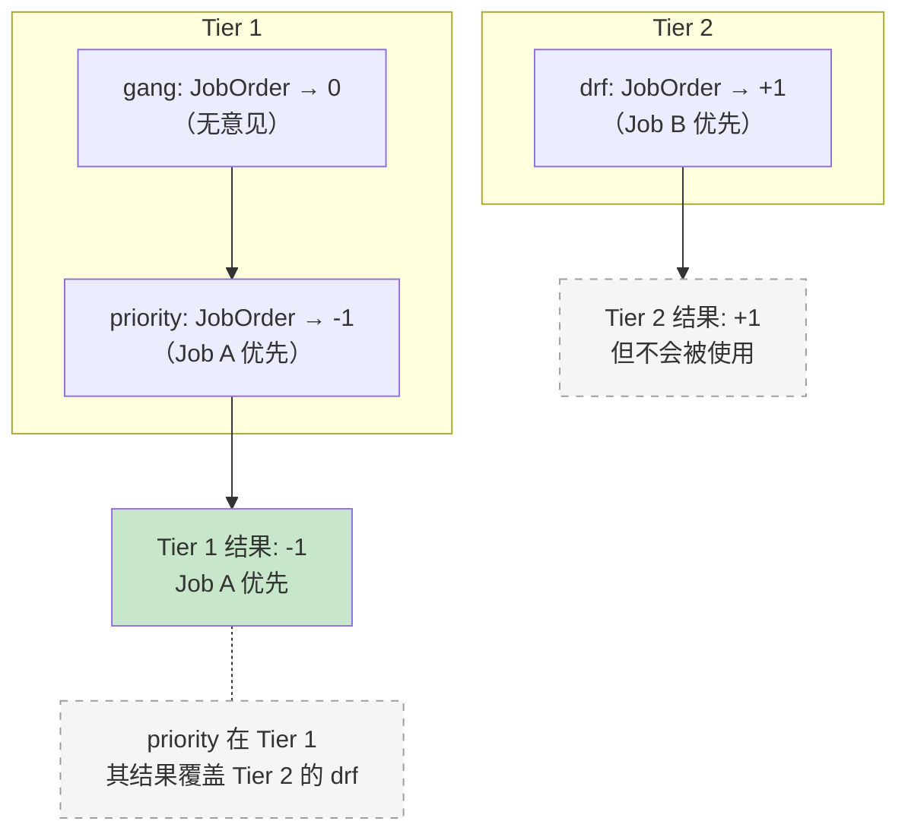

## 概述

Plugin 系统是 Volcano 调度器的可扩展性核心。通过 Plugin，用户可以在不修改调度器主逻辑的情况下注入自定义的排序、过滤、打分、抢占等调度策略。Volcano 内置了 20+ 个 Plugin，涵盖 Gang Scheduling、公平共享、资源装箱、拓扑感知等典型调度策略。

Plugin 在每个调度周期的 `OpenSession()` 阶段被实例化，通过注册扩展点函数来参与调度决策，在 `CloseSession()` 阶段执行清理。

## Plugin 接口

> **源码参考**：`pkg/scheduler/framework/interface.go`

```go
type Plugin interface {
    Name() string                    // Plugin 唯一名称
    OnSessionOpen(ssn *Session)      // Session 打开时调用，注册扩展点
    OnSessionClose(ssn *Session)     // Session 关闭时调用，清理资源
}

// 可选接口：支持绑定上下文扩展
type BindContextHandler interface {
    SetupBindContextExtension(state *k8sframework.CycleState, bindCtx *cache.BindContext)
}
```

---

## Plugin 注册与加载

### 注册机制

> **源码参考**：`pkg/scheduler/framework/plugins.go`

```go
type PluginBuilder = func(Arguments) Plugin

var pluginBuilders = map[string]PluginBuilder{}

// 注册 Plugin
func RegisterPluginBuilder(name string, pc PluginBuilder) {
    pluginBuilders[name] = pc
}

// 查找 Plugin
func GetPluginBuilder(name string) (PluginBuilder, bool) {
    pb, found := pluginBuilders[name]
    return pb, found
}
```

### 内置 Plugin 注册

> **源码参考**：`pkg/scheduler/plugins/factory.go`

所有内置 Plugin 通过 `init()` 函数注册：

```go
func init() {
    framework.RegisterPluginBuilder("drf", drf.New)
    framework.RegisterPluginBuilder("gang", gang.New)
    framework.RegisterPluginBuilder("predicates", predicates.New)
    framework.RegisterPluginBuilder("nodeorder", nodeorder.New)
    framework.RegisterPluginBuilder("proportion", proportion.New)
    framework.RegisterPluginBuilder("binpack", binpack.New)
    // ... 更多 Plugin
}
```

### 自定义 Plugin 加载

支持通过动态链接库（`.so` 文件）加载自定义 Plugin：

```go
func LoadCustomPlugins(pluginsDir string) {
    // 扫描 pluginsDir 下所有 .so 文件
    // 动态加载并注册
}
```

---

## Plugin 生命周期



### 关键点

- Plugin 在**每个调度周期**重新创建实例
- `OnSessionOpen()` 是 Plugin 的核心方法，负责注册扩展点
- Plugin 不应该在扩展点函数之间维护状态（除非使用 Session 字段）
- `OnSessionClose()` 用于清理临时资源

---

## 内置 Plugin 一览

### Plugin 分类



### 核心 Plugin 详解

#### gang -- Gang Scheduling

最核心的 Plugin，实现"全有或全无"调度语义。

**注册的扩展点**：

| 扩展点 | 实现逻辑 |
|--------|---------|
| `JobValidFn` | 检查 Pod 数量是否满足 minMember |
| `JobReadyFn` | 检查已分配 Task 数 >= minMember |
| `JobPipelinedFn` | 检查已分配 + Pipelined 的 Task 数 >= minMember |
| `JobOrderFn` | 就绪的 Job 优先于未就绪的 |
| `PreemptableFn` | 保护 minMember 个 Task 不被抢占 |
| `JobStarvingFn` | 已分配 Task 数 < minMember 则为饥饿 |

**示例 -- PreemptableFn 实现**：

```go
func (gp *gangPlugin) preemptableFn(preemptor *api.TaskInfo, preemptees []*api.TaskInfo) ([]*api.TaskInfo, int) {
    var victims []*api.TaskInfo
    occupiedMap := make(map[api.JobID]int32)

    for _, preemptee := range preemptees {
        job := ssn.Jobs[preemptee.Job]
        occupiedMap[job.UID]++
        // 只有超过 minMember 的 Task 才可以被抢占
        if occupiedMap[job.UID] > job.MinAvailable {
            victims = append(victims, preemptee)
        }
    }
    return victims, Permit
}
```

#### proportion -- 队列公平共享

实现基于权重的队列资源公平分配。

**注册的扩展点**：

| 扩展点 | 实现逻辑 |
|--------|---------|
| `QueueOrderFn` | 按 share（已用/应得比例）升序排列 |
| `OverusedFn` | 已用资源 > Deserved 资源则超用 |
| `AllocatableFn` | 已用 + 请求 <= Deserved 则可分配 |
| `JobEnqueueableFn` | 检查队列是否有足够 Deserved 资源 |
| `JobEnqueuedFn` | 更新队列已分配资源 |
| `ReclaimableFn` | 超过 Deserved 的资源可回收 |
| `PreemptiveFn` | 队列是否有权从其他队列回收 |

**Deserved 资源计算**：
```
Deserved = min(Capability, max(Guarantee, weight/totalWeight × clusterResource))
```

#### predicates -- 节点过滤

包装 Kubernetes 原生的 Predicate 逻辑。

**注册的扩展点**：

| 扩展点 | 实现逻辑 |
|--------|---------|
| `PrePredicateFn` | K8s PreFilter 扩展点 |
| `PredicateFn` | 节点亲和性、污点容忍、资源可用性、端口冲突等 |

**内部调用的 K8s Filter Plugin**：
- NodeAffinity
- NodePorts
- NodeResourcesFit
- TaintToleration
- PodTopologySpread
- VolumeBinding
- InterPodAffinity

#### nodeorder -- 节点打分

基于多维度为节点打分，选择最优节点。

**注册的扩展点**：

| 扩展点 | 实现逻辑 |
|--------|---------|
| `BatchNodeOrderFn` | 调用 K8s Score Plugin 批量打分 |

**内部调用的 K8s Score Plugin**：
- NodeAffinity
- ImageLocality
- TaintToleration
- SelectorSpread
- PodTopologySpread
- InterPodAffinity
- NodeResourcesBalancedAllocation

每个打分 Plugin 有可配置的权重：
```yaml
plugins:
  - name: nodeorder
    arguments:
      nodeaffinity.weight: 10
      podaffinity.weight: 10
      tainttoleration.weight: 10
      leastrequested.weight: 1
```

#### binpack -- 装箱优化

将 Task 优先分配到已有负载的节点，提高资源利用率。



**打分公式**：
```
score = weight_cpu × (used_cpu / total_cpu) + weight_mem × (used_mem / total_mem) + ...
```

配置示例：
```yaml
plugins:
  - name: binpack
    arguments:
      binpack.weight: 10
      binpack.cpu: 1
      binpack.memory: 1
      binpack.resources: "nvidia.com/gpu"
      binpack.resources.nvidia.com/gpu: 2
```

#### drf -- Dominant Resource Fairness

实现 DRF 算法，确保 Job 之间资源使用的公平性。

**核心概念**：Dominant Resource 是 Job 使用比例最高的资源维度。

```
Job A: 请求 CPU=4/10, Memory=1/16  → Dominant share = 40%（CPU）
Job B: 请求 CPU=1/10, Memory=8/16  → Dominant share = 50%（Memory）
```

DRF 优先调度 Dominant share 更低的 Job。

**注册的扩展点**：

| 扩展点 | 实现逻辑 |
|--------|---------|
| `JobOrderFn` | Dominant share 低的 Job 优先 |
| `PreemptableFn` | Dominant share 高的 Task 可被抢占 |
| `EventHandler` | 跟踪资源分配/释放 |

---

## Tier 机制

### Tier 配置

Plugin 通过 Tier 分层，高 Tier 优先生效：

```yaml
tiers:
  - plugins:
      - name: gang          # Tier 1 - 最高优先级
        enabledJobOrder: true
        enabledJobReady: true
        enabledJobPipelined: true
      - name: priority
        enabledJobOrder: true
        enabledTaskOrder: true
  - plugins:
      - name: drf           # Tier 2
        enabledJobOrder: true
        enabledPreemptable: true
      - name: proportion
        enabledQueueOrder: true
        enabledReclaimable: true
  - plugins:
      - name: predicates    # Tier 3
        enabledPredicate: true
      - name: nodeorder
        enabledNodeOrder: true
      - name: binpack
        enabledNodeOrder: true
```

### Tier 执行语义



### 扩展点开关

每个 PluginOption 有 20+ 个扩展点开关：

| 开关 | 类型 | 说明 |
|------|------|------|
| `EnabledJobOrder` | *bool | 是否启用 JobOrderFn |
| `EnabledJobReady` | *bool | 是否启用 JobReadyFn |
| `EnabledJobPipelined` | *bool | 是否启用 JobPipelinedFn |
| `EnabledTaskOrder` | *bool | 是否启用 TaskOrderFn |
| `EnabledPreemptable` | *bool | 是否启用 PreemptableFn |
| `EnabledReclaimable` | *bool | 是否启用 ReclaimableFn |
| `EnabledQueueOrder` | *bool | 是否启用 QueueOrderFn |
| `EnabledPredicate` | *bool | 是否启用 PredicateFn |
| `EnabledNodeOrder` | *bool | 是否启用 NodeOrderFn |
| `EnabledBestNode` | *bool | 是否启用 BestNodeFn |
| `EnabledOverused` | *bool | 是否启用 OverusedFn |
| `EnabledAllocatable` | *bool | 是否启用 AllocatableFn |
| `EnabledHyperNodeOrder` | *bool | 是否启用 HyperNodeOrderFn |
| `EnabledSubJobReady` | *bool | 是否启用 SubJobReadyFn |

未显式设置（`nil`）默认视为启用。只有显式设置为 `false` 才会禁用。

---

## Plugin 完整列表

| Plugin | 核心功能 | 主要扩展点 |
|--------|---------|-----------|
| `gang` | 全有或全无调度 | JobValid/JobReady/JobPipelined/Preemptable |
| `priority` | 优先级排序 | JobOrder/TaskOrder |
| `drf` | 公平共享（DRF 算法） | JobOrder/Preemptable/EventHandler |
| `proportion` | 队列资源公平分配 | QueueOrder/Overused/Allocatable/Reclaimable |
| `capacity` | 队列容量管理 | QueueOrder/Overused/Allocatable/Reclaimable |
| `predicates` | K8s 节点过滤 | PrePredicate/Predicate |
| `nodeorder` | K8s 节点打分 | BatchNodeOrder |
| `binpack` | 装箱优化 | NodeOrder |
| `conformance` | K8s 一致性检查 | Overused |
| `overcommit` | 资源超分配 | JobEnqueueable/JobEnqueued |
| `deviceshare` | GPU/设备共享 | Predicate/NodeOrder |
| `numaaware` | NUMA 拓扑感知 | Predicate/NodeOrder |
| `tdm` | 时分复用 | Predicate/Preemptable/NodeOrder |
| `sla` | SLA 约束 | JobOrder/JobEnqueueable |
| `task-topology` | Task 拓扑约束 | Predicate/NodeOrder |
| `network-topology-aware` | 网络拓扑感知 | HyperNodeOrder/HyperNodeGradient |
| `nodegroup` | 节点分组 | Predicate |
| `pdb` | PodDisruptionBudget | VictimTasks |
| `rescheduling` | 重调度策略 | VictimTasks |
| `usage` | 资源使用追踪 | NodeOrder |
| `resourcequota` | 命名空间配额 | Overused |
| `resource-strategy-fit` | 资源策略匹配 | Predicate |
| `extender` | 外部扩展器 | Predicate/Preemptable |
| `cdp` | 集群数据放置 | Predicate/NodeOrder |

---

## 开发自定义 Plugin

### 基本结构

```go
package myplugin

import (
    "volcano.sh/volcano/pkg/scheduler/api"
    "volcano.sh/volcano/pkg/scheduler/framework"
)

const PluginName = "myplugin"

type myPlugin struct {
    arguments framework.Arguments
}

func New(arguments framework.Arguments) framework.Plugin {
    return &myPlugin{arguments: arguments}
}

func (mp *myPlugin) Name() string {
    return PluginName
}

func (mp *myPlugin) OnSessionOpen(ssn *framework.Session) {
    // 注册扩展点
    ssn.AddNodeOrderFn(mp.Name(), func(task *api.TaskInfo, node *api.NodeInfo) (float64, error) {
        // 自定义节点打分逻辑
        return score, nil
    })
}

func (mp *myPlugin) OnSessionClose(ssn *framework.Session) {
    // 清理
}
```

### 注册

在 `pkg/scheduler/plugins/factory.go` 中添加：

```go
import "volcano.sh/volcano/pkg/scheduler/plugins/myplugin"

func init() {
    // ...
    framework.RegisterPluginBuilder("myplugin", myplugin.New)
}
```

### 配置启用

```yaml
tiers:
  - plugins:
      - name: myplugin
        arguments:
          mykey: myvalue
        enabledNodeOrder: true
```

---

## 常见问题

### Q: 同一个扩展点多个 Plugin 注册了怎么办？

按 Tier 优先级和调用模式处理：
- **排序类**（CompareFn）：第一个返回非零结果的 Plugin 决定排序
- **投票类**（VoteFn）：任何 Plugin 的 Reject 立即否决
- **交集类**（EvictableFn）：多个 Plugin 候选取交集

### Q: Plugin 参数如何传递？

通过 `Arguments` 参数（`map[string]interface{}`）传递。Plugin 在 `OnSessionOpen()` 中从 `arguments` 读取配置：

```go
func (p *myPlugin) OnSessionOpen(ssn *framework.Session) {
    weight := 1.0
    if w, ok := p.arguments["weight"]; ok {
        weight = w.(float64)
    }
}
```

### Q: 如何在不重启调度器的情况下调整 Plugin 配置？

利用配置热加载机制（详见 [调度器生命周期](./01-scheduler-lifecycle.md)）。修改配置文件或 ConfigMap 后，FileWatcher 检测到变化，下一个调度周期会使用新配置重新实例化 Plugin。

---

## 下一步

- [Statement 与绑定](./06-statement-and-binding.md) -- 调度决策的事务提交机制
- [资源模型](./07-resource-model.md) -- 多维资源的表示与计算
- [配置参考](./08-scheduler-configuration-reference.md) -- 完整的 Plugin 参数配置手册
