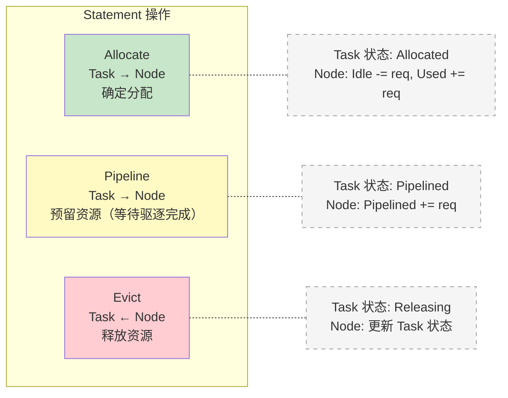
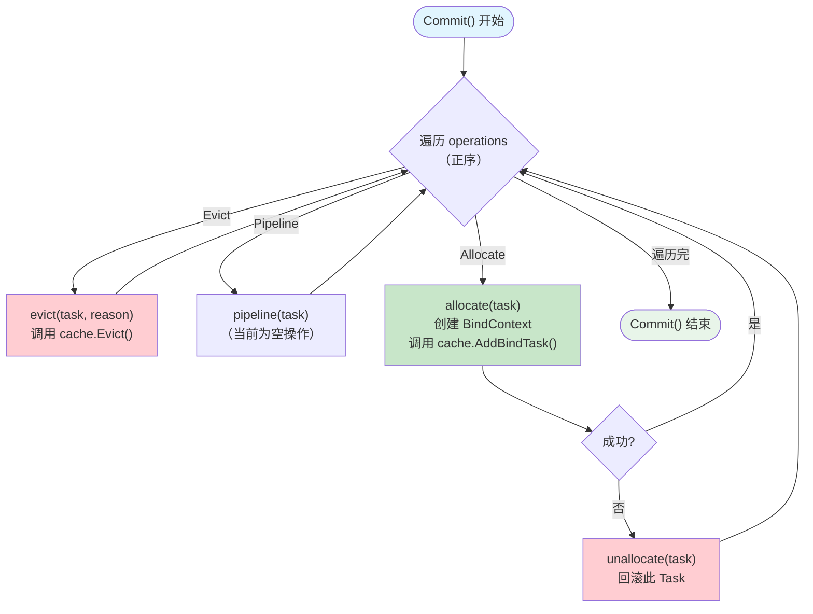
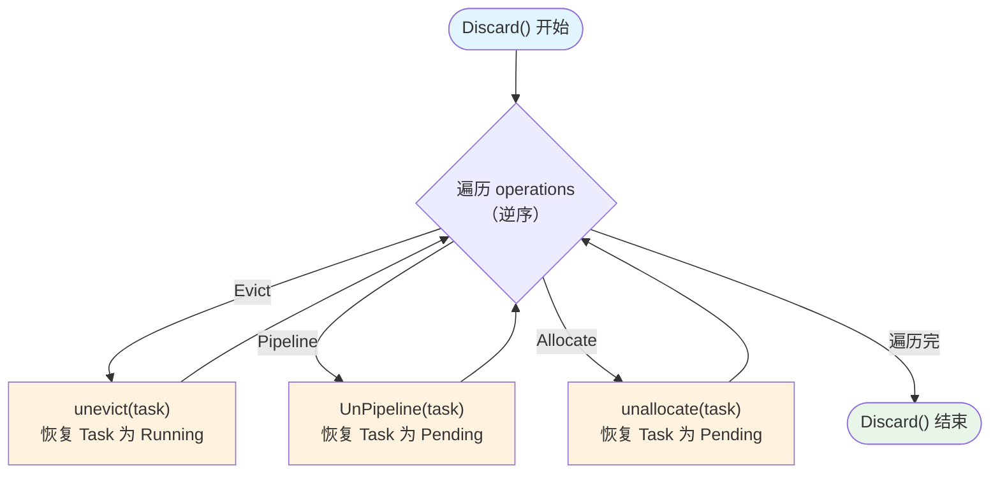
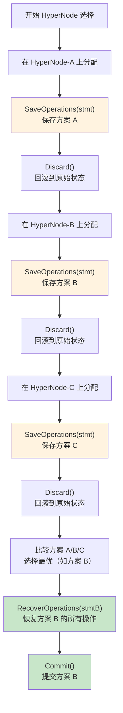
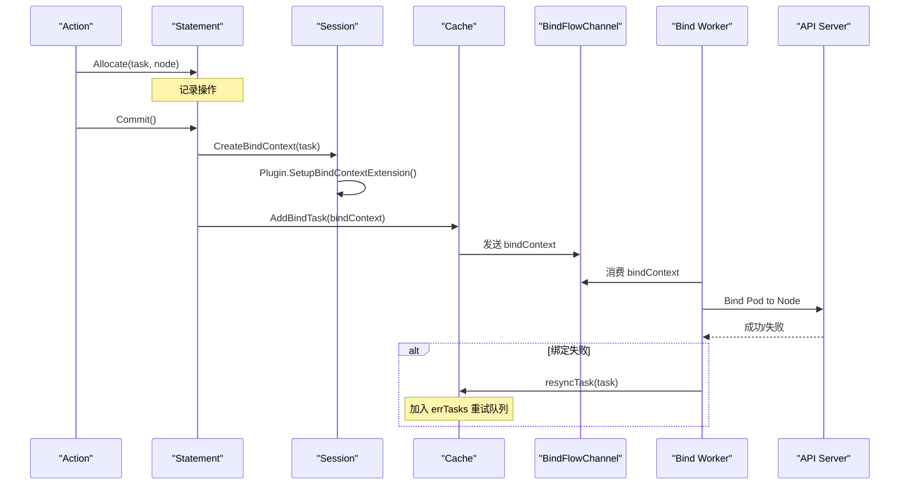
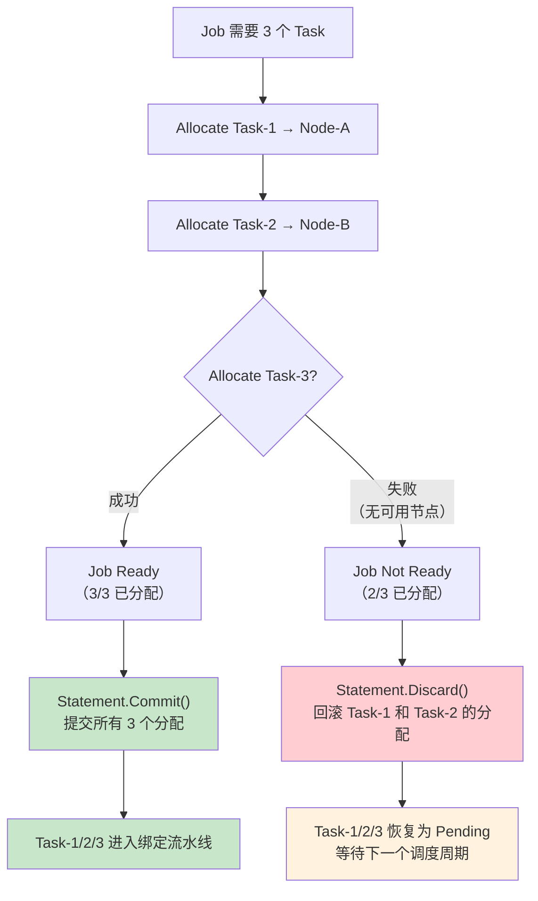
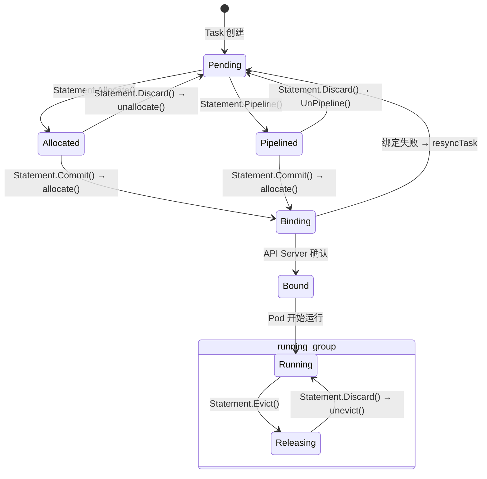

## 概述

Statement 是 Volcano 调度器的事务管理机制。在调度过程中，Action 对 Session 快照上的资源分配操作（Allocate、Pipeline、Evict）不是立即提交的，而是通过 Statement 记录为操作序列。当一个 Job 的所有 Task 都成功分配后，调用 `Commit()` 提交操作；如果分配失败，调用 `Discard()` 回滚所有操作。

这种设计是 Gang Scheduling 的基础：要么全部提交，要么全部回滚。同时，Statement 还支持 `SaveOperations/RecoverOperations` 机制，用于 HyperNode 拓扑感知调度中的 dry-run 和方案选择。

## Statement 结构

> **源码参考**：`pkg/scheduler/framework/statement.go`

```go
type Operation int8

const (
    Evict    Operation = iota  // 0: 驱逐操作
    Pipeline                    // 1: Pipeline（预分配）操作
    Allocate                    // 2: 分配操作
)

type operation struct {
    name   Operation        // 操作类型
    task   *api.TaskInfo    // 目标 Task
    reason string           // 原因（仅 Evict 使用）
}

type Statement struct {
    operations []operation  // 操作序列
    ssn        *Session     // 关联的 Session
}
```

---

## 操作类型

### 三种基本操作



### Allocate 操作

```go
func (s *Statement) Allocate(task *api.TaskInfo, nodeInfo *api.NodeInfo) error
```

**执行步骤**：
1. 更新 Task 状态为 `Allocated`
2. 设置 `task.Pod.Spec.NodeName = hostname`
3. 将 Task 添加到 Node（`node.AddTask(task)`）
4. 触发 `AllocateFunc` 事件处理器
5. 记录 Allocate 操作到 operations 序列

### Pipeline 操作

```go
func (s *Statement) Pipeline(task *api.TaskInfo, hostname string, evictionOccurred bool) error
```

**执行步骤**：
1. 更新 Task 状态为 `Pipelined`
2. 设置 `task.NodeName` 和 `task.EvictionOccurred`
3. 将 Task 添加到 Node（仅增加 `Pipelined` 资源计数）
4. 触发 `AllocateFunc` 事件处理器
5. 记录 Pipeline 操作

**与 Allocate 的区别**：Pipeline 不占用 `Idle` 资源，而是记录在 `Pipelined` 资源池中。这适用于抢占场景：先标记预分配，等受害者释放资源后再真正绑定。

### Evict 操作

```go
func (s *Statement) Evict(reclaimee *api.TaskInfo, reason string) error
```

**执行步骤**：
1. 更新 Task 状态为 `Releasing`
2. 在 Node 上更新 Task 信息
3. 触发 `DeallocateFunc` 事件处理器
4. 记录 Evict 操作及原因

---

## Commit 与 Discard

### Commit -- 提交操作



**Commit 的 allocate 子过程**：
1. 调用 `ssn.CreateBindContext(task)` 创建绑定上下文
2. 调用 `cache.AddBindTask(bindContext)` 将 Task 发送到绑定流水线
3. 更新 Task 状态为 `Binding`
4. 记录调度延迟 Metrics

### Discard -- 回滚操作



**关键设计**：Discard 按**逆序**遍历操作，确保回滚顺序正确（类似数据库事务的 undo log）。

### 回滚子过程

| 方法 | 作用 | 状态变化 |
|------|------|---------|
| `unevict(task)` | 撤销驱逐 | Releasing → Running |
| `UnPipeline(task)` | 撤销 Pipeline | Pipelined → Pending |
| `unallocate(task)` | 撤销分配 | Allocated → Pending |

每个回滚方法都会：
1. 恢复 Task 状态
2. 从 Node 移除/添加 Task
3. 清除 NodeName 和 HyperNode 信息
4. 触发相应的事件处理器

---

## SaveOperations / RecoverOperations

### 用途

在 HyperNode 拓扑感知调度中，Allocate Action 需要尝试多个 HyperNode 的分配方案，选择最优的一个。这需要：

1. **Dry-run**：在某个 HyperNode 上尝试分配
2. **保存方案**：如果成功，保存操作序列
3. **回滚**：Discard 恢复原始状态
4. **尝试下一个**：在另一个 HyperNode 上重复
5. **选择最优**：比较所有方案，恢复最优方案



### SaveOperations

```go
func SaveOperations(stmts ...*Statement) *Statement
```

**算法**：
1. 创建临时 Statement
2. 遍历每个输入 Statement 的操作序列
3. **深拷贝**每个操作（包括 `task.Clone()`）
4. 返回包含所有操作副本的 Statement

深拷贝至关重要：Discard 会修改原始 Task 的状态，保存的副本不受影响。

### RecoverOperations

```go
func (s *Statement) RecoverOperations(stmt *Statement) error
```

**算法**：
1. 遍历保存的操作序列
2. 按操作类型重放：
   - `Evict` → 调用 `s.Evict(task, reason)`
   - `Pipeline` → 调用 `s.Pipeline(task, nodeName, false)`
   - `Allocate` → 调用 `s.Allocate(task, node)`
3. 任何操作失败则返回错误

---

## 绑定流水线

### 从 Statement 到 API Server



### BindContext 扩展

Plugin 可以通过实现 `BindContextHandler` 接口向 BindContext 注入自定义数据：

```go
type BindContextHandler interface {
    SetupBindContextExtension(state *k8sframework.CycleState, bindCtx *cache.BindContext)
}
```

**使用场景**：
- 网络拓扑 Plugin 注入拓扑约束信息
- 设备共享 Plugin 注入设备分配信息
- NUMA Plugin 注入 NUMA 绑定信息

这些扩展信息随 BindContext 传递到 Bind Worker，在实际绑定时使用。

---

## 事务与 Gang Scheduling

Statement 的事务机制是 Gang Scheduling 的实现基础：



### 流程说明

1. **创建 Statement**：每个 Job 的分配过程创建一个 Statement
2. **累积操作**：逐个 Task 分配，操作记录到 Statement
3. **检查就绪**：调用 `ssn.JobReady(job)` 检查是否满足 minMember
4. **决策**：
   - 就绪 → `Commit()` 提交所有操作
   - 未就绪 → `Discard()` 回滚所有操作

---

## Task 状态转换

Statement 操作引起的 Task 状态转换：



### LastTransaction 上下文

每个 Task 有 `LastTransaction` 字段，记录最近一次事务操作的上下文信息：

```go
task.GenerateLastTxContext() // Discard 时保存上下文
task.ClearLastTxContext()    // Commit 时清除上下文
```

`LastTransaction` 用于错误报告和调试，帮助追踪 Task 在调度过程中经历的操作。

---

## 常见问题

### Q: Pipeline 和 Allocate 有什么区别？

- **Allocate**：直接占用 Node 的 `Idle` 资源，Task 进入 `Allocated` 状态
- **Pipeline**：仅在 Node 的 `Pipelined` 计数中预留，不占用 `Idle` 资源

Pipeline 用于抢占场景：先驱逐受害者（Evict），然后 Pipeline 预留空间，等受害者真正释放后 Task 才能绑定。

### Q: Commit 失败了怎么办？

`Commit()` 中的 `allocate()` 如果失败（如 `cache.AddBindTask()` 出错），会立即调用 `unallocate()` 回滚该 Task。其他已成功 Commit 的操作不受影响。

### Q: SaveOperations 为什么要深拷贝？

因为 `Discard()` 会修改原始 Task 的状态（如 `NodeName`、`Status`）。如果 SaveOperations 只保存引用，Discard 后保存的操作会变成无效数据。深拷贝确保保存的方案完整可恢复。

---

## 下一步

- [资源模型](./07-resource-model.md) -- Node 资源状态（Idle/Used/Releasing/Pipelined）的详细机制
- [配置参考](./08-scheduler-configuration-reference.md) -- 调度器完整配置手册
