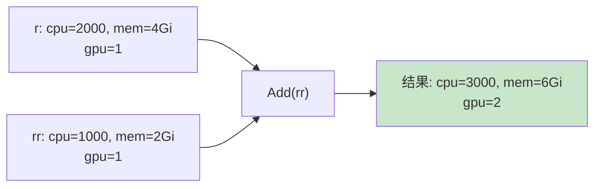
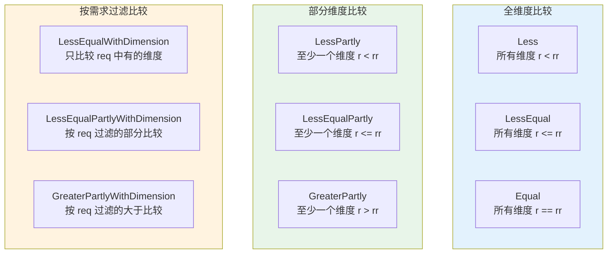
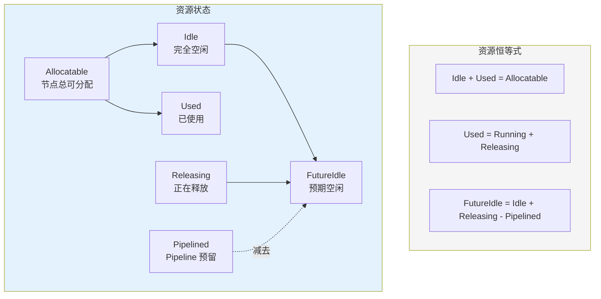
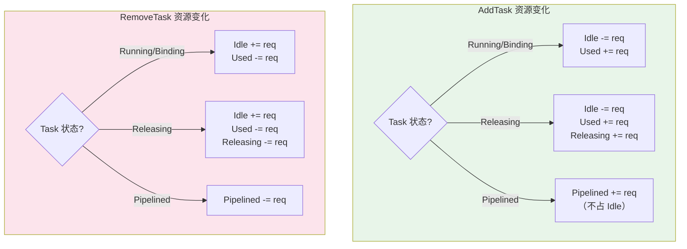
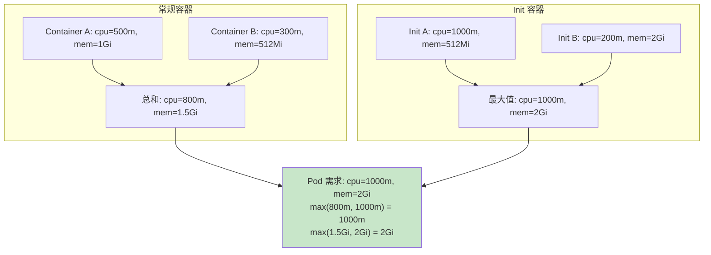
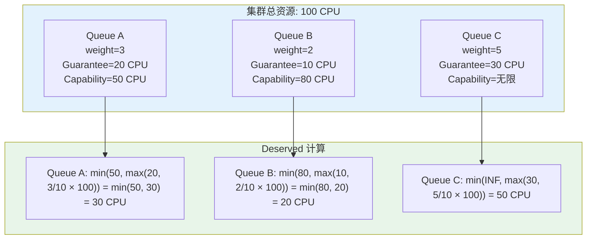

## 概述

Volcano 采用多维资源模型来表示和管理集群资源。资源不仅包含 CPU 和 Memory 两个基础维度，还支持 GPU、NPU 等 Scalar 类型的自定义扩展资源。资源模型贯穿调度器的每一个环节：Node 资源追踪、Task 资源需求、Queue 配额管理、Predicate 过滤、Score 打分等。

本文详细分析 `Resource` 结构体的设计、多维度比较算法、Node 资源状态模型，以及 Job/Task 的资源追踪机制。

## Resource 结构体

> **源码参考**：`pkg/scheduler/api/resource_info.go`

```go
type Resource struct {
    MilliCPU float64                           // CPU（毫核，1000 = 1 核）
    Memory   float64                           // 内存（字节）
    ScalarResources map[v1.ResourceName]float64 // 扩展资源（GPU、NPU 等）
    MaxTaskNum int                              // 仅 Predicate 使用，不参与算术运算
}

const minResource float64 = 0.1  // 浮点比较阈值
```

### DimensionDefaultValue

当两个 Resource 对象的 Scalar 维度集合不同时，缺失维度如何处理：

```go
type DimensionDefaultValue int

const (
    Zero     DimensionDefaultValue = 0   // 缺失维度视为 0
    Infinity DimensionDefaultValue = -1  // 缺失维度视为无穷大
)
```

| 场景 | 默认值 | 含义 |
|------|-------|------|
| 资源回收判断 | `Zero` | 缺失资源视为 0，不影响回收决策 |
| 资源充足性判断 | `Infinity` | 缺失资源视为无穷大，总是满足 |

---

## 资源算术运算

### 加法 Add

```go
func (r *Resource) Add(rr *Resource) *Resource
```



**逻辑**：逐维度相加，包括 CPU、Memory 和所有 ScalarResources。原地修改并返回 `r`。

### 减法 Sub / SubWithoutAssert

```go
func (r *Resource) Sub(rr *Resource) *Resource         // 带断言
func (r *Resource) SubWithoutAssert(rr *Resource) *Resource // 无断言
```

| 方法 | rr > r 时的行为 |
|------|----------------|
| `Sub` | **Panic**（断言 `rr.LessEqual(r, Zero)`） |
| `SubWithoutAssert` | 记录错误日志，允许产生负值 |

### 乘法 Multi

```go
func (r *Resource) Multi(ratio float64) *Resource
```

逐维度乘以比例系数。常用于 DRF 等按比例分配的场景。

---

## 资源比较运算

资源比较是调度决策的核心，Volcano 提供了丰富的多维度比较方法。

### 比较方法总览



### Less -- 严格小于

```go
func (r *Resource) Less(rr *Resource, defaultValue DimensionDefaultValue) bool
```

**语义**：r 的**所有**维度都严格小于 rr。

```
r  = {cpu: 1000, mem: 2Gi, gpu: 1}
rr = {cpu: 2000, mem: 4Gi, gpu: 2}
r.Less(rr, Zero) = true  // 所有维度都满足 <
```

### LessEqual -- 小于等于

```go
func (r *Resource) LessEqual(rr *Resource, defaultValue DimensionDefaultValue) bool
```

**语义**：r 的**所有**维度都小于等于 rr（带浮点容差 `minResource = 0.1`）。

**核心用途**：判断 Node 是否有足够资源容纳 Task。

```
taskReq.LessEqual(nodeIdle, Zero)  // Task 需求是否 <= Node 空闲
```

### LessPartly -- 部分小于

```go
func (r *Resource) LessPartly(rr *Resource, defaultValue DimensionDefaultValue) bool
```

**语义**：r 的**至少一个**维度小于 rr。

**用途**：检测是否存在瓶颈资源。

### LessEqualWithResourcesName -- 带资源名称的比较

```go
func (r *Resource) LessEqualWithResourcesName(rr *Resource, defaultValue DimensionDefaultValue) (bool, []string)
```

**返回值**：`(isLessEqual, insufficientResources)`

```
r  = {cpu: 3000, mem: 8Gi, gpu: 2}
rr = {cpu: 2000, mem: 4Gi, gpu: 4}
结果: (false, ["cpu", "memory"])  // CPU 和 Memory 不足
```

**用途**：详细的资源不足报告。

### LessEqualWithDimensionAndResourcesName -- 按需求过滤

```go
func (r *Resource) LessEqualWithDimensionAndResourcesName(rr, req *Resource) (bool, []string)
```

只比较 `req` 中有值（> 0）的维度。

```
r   = {cpu: 3000, mem: 8Gi}
rr  = {cpu: 2000, mem: 4Gi}
req = {gpu: 1}                 // 只关心 GPU
结果: (true, [])               // GPU 维度 r 没有不足
```

**用途**：Task 只请求 GPU，不需要比较 CPU 和 Memory。

### Diff -- 资源差异分析

```go
func (r *Resource) Diff(rr *Resource, defaultValue DimensionDefaultValue) (*Resource, *Resource)
```

**返回**：`(increased, decreased)` -- 增加的资源和减少的资源。

```
r  = {cpu: 3000, mem: 2Gi}
rr = {cpu: 2000, mem: 4Gi}
increased = {cpu: 1000}        // CPU 增加了
decreased = {mem: 2Gi}         // Memory 减少了
```

### MinDimensionResource -- 逐维度取最小值

```go
func (r *Resource) MinDimensionResource(rr *Resource, defaultValue DimensionDefaultValue) *Resource
```

每个维度取 r 和 rr 的最小值。用于约束资源不超过目标。

---

## Node 资源状态模型

> **源码参考**：`pkg/scheduler/api/node_info.go`

### NodeInfo 资源字段

```go
type NodeInfo struct {
    Allocatable *Resource   // 节点总可分配资源
    Capacity    *Resource   // 节点总容量
    Idle        *Resource   // 空闲资源
    Used        *Resource   // 已使用资源
    Releasing   *Resource   // 正在释放的资源
    Pipelined   *Resource   // Pipeline 预留的资源
    // ...
}
```

### 资源恒等关系



### FutureIdle

```go
func (ni *NodeInfo) FutureIdle() *Resource {
    return ni.Idle.Clone().Add(ni.Releasing).SubWithoutAssert(ni.Pipelined)
}
```

**含义**：预测受害者释放资源后节点将有多少空闲资源。

```
示例：
  Idle = 100m CPU
  Releasing = 500m CPU（正在被驱逐的 Task）
  Pipelined = 300m CPU（预留给 Pipeline 的 Task）
  FutureIdle = 100 + 500 - 300 = 300m CPU
```

### Task 添加/移除对资源的影响



### allocateIdleResource

```go
func (ni *NodeInfo) allocateIdleResource(ti *api.TaskInfo) {
    ok, resources := ti.Resreq.LessEqualWithResourcesName(ni.Idle, Zero)
    if !ok {
        klog.Errorf("Idle resources turn into negative: %v", resources)
    }
    ni.Idle.sub(ti.Resreq)
}
```

**特点**：即使资源不足也会执行减法（可能产生负值），通过日志记录异常。这种设计避免了分配中途的 panic，将问题延迟到后续检查环节处理。

---

## Task 资源需求

> **源码参考**：`pkg/scheduler/api/types.go`

```go
type TaskInfo struct {
    Resreq     *Resource   // 运行时资源需求
    InitResreq *Resource   // Init Container 资源需求
    // ...
}
```

### 资源计算规则

遵循 Kubernetes Pod 资源计算规则：

```
Pod 总资源 = max(sum(container.requests), max(initContainer.requests))
```



---

## Job 资源统计

> **源码参考**：`pkg/scheduler/api/job_info.go`

```go
type JobInfo struct {
    Allocated    *Resource   // 已分配资源总量
    TotalRequest *Resource   // 所有 Task 请求总量
    // ...
}
```

### TaskStatusIndex

Job 按状态维护 Task 索引：

```go
TaskStatusIndex map[TaskStatus]TasksMap
```

通过 TaskStatusIndex 可以快速查询特定状态的 Task 集合：

| 状态 | 说明 |
|------|------|
| `Pending` | 等待调度 |
| `Allocated` | 已分配节点，未绑定 |
| `Pipelined` | Pipeline 预留 |
| `Binding` | 正在绑定 |
| `Bound` | 已绑定 |
| `Running` | 运行中 |
| `Releasing` | 正在释放 |
| `Succeeded` | 已完成 |
| `Failed` | 失败 |

---

## Queue 资源管理

### Queue 资源字段

```go
type QueueInfo struct {
    Queue     *scheduling.Queue
    Allocated *Resource   // 已分配给该队列的资源
    Deserved  *Resource   // 应得资源
    Guarantee *Resource   // 保证资源
    // ...
}
```

### 资源分配模型



**Deserved 公式**：
```
Deserved = min(Capability, max(Guarantee, weight/totalWeight × clusterResource))
```

### 超用与可分配判断

- **Overused**：`Allocated > Deserved`（已分配超过应得，Allocate 跳过此队列）
- **Allocatable**：`Allocated + TaskRequest <= Deserved`（分配后不超过应得）
- **Reclaimable**：`Allocated > Deserved` 的部分可被其他队列回收

---

## 特殊资源操作

### FitDelta -- Predicate 资源检查

```go
func (r *Resource) FitDelta(rr *Resource) *Resource
```

计算分配请求后的剩余容量，结果为负数表示资源不足：

```
node.Idle.FitDelta(task.Resreq)
// 负值维度 = 资源不足的维度
```

### SetMaxResource -- 取最大值

```go
func (r *Resource) SetMaxResource(rr *Resource)
```

逐维度取最大值。用于计算 Init Container 的最大资源需求。

### IsEmpty -- 空资源检查

```go
func (r *Resource) IsEmpty() bool
```

所有维度都小于 `minResource (0.1)` 则为空。忽略 `v1.ResourcePods` 维度。

### Clone -- 深拷贝

```go
func (r *Resource) Clone() *Resource
```

深拷贝所有字段，包括 ScalarResources Map。在 Snapshot 和 Statement 操作中大量使用。

---

## 常见问题

### Q: 为什么用 float64 而不是 int64 表示资源？

Volcano 的 Resource 使用 `float64` 是为了支持 DRF 等需要精确比例计算的算法。`minResource = 0.1` 阈值用于处理浮点精度问题。Kubernetes 原生使用 `resource.Quantity`（基于整数），Volcano 在转换时将其转为 float64。

### Q: DimensionDefaultValue 的 Zero 和 Infinity 分别在什么场景使用？

- **Zero**：资源回收和分配场景。缺失的 Scalar 资源视为 0，不会因为缺失而影响判断
- **Infinity**：资源充足性检查。缺失的 Scalar 资源视为无穷大，确保不会误报不足

### Q: Node 资源出现负值怎么办？

`allocateIdleResource` 方法中使用 `sub()` 而非 `Sub()`（后者有断言），允许负值出现但记录错误日志。这种设计在极端并发场景下避免 panic，让调度器继续运行。负值通常会在下一个调度周期通过重新 Snapshot 修正。

### Q: Pipelined 资源如何最终释放？

当 Pipeline 的 Task 成功绑定（状态变为 Binding/Running），或被 Discard 回滚（状态变为 Pending），`Pipelined` 计数都会相应减少。Pipeline 是一个临时状态，不会长期存在。

---

## 下一步

- [配置参考](./08-scheduler-configuration-reference.md) -- 调度器完整配置参数手册
- [调度器生命周期](./01-scheduler-lifecycle.md) -- 回顾调度器如何使用资源模型
