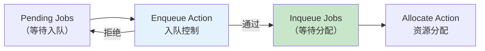
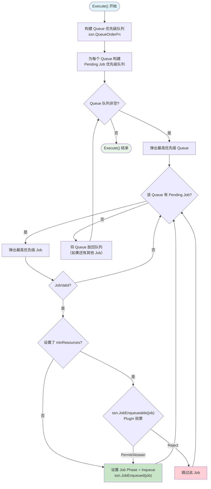
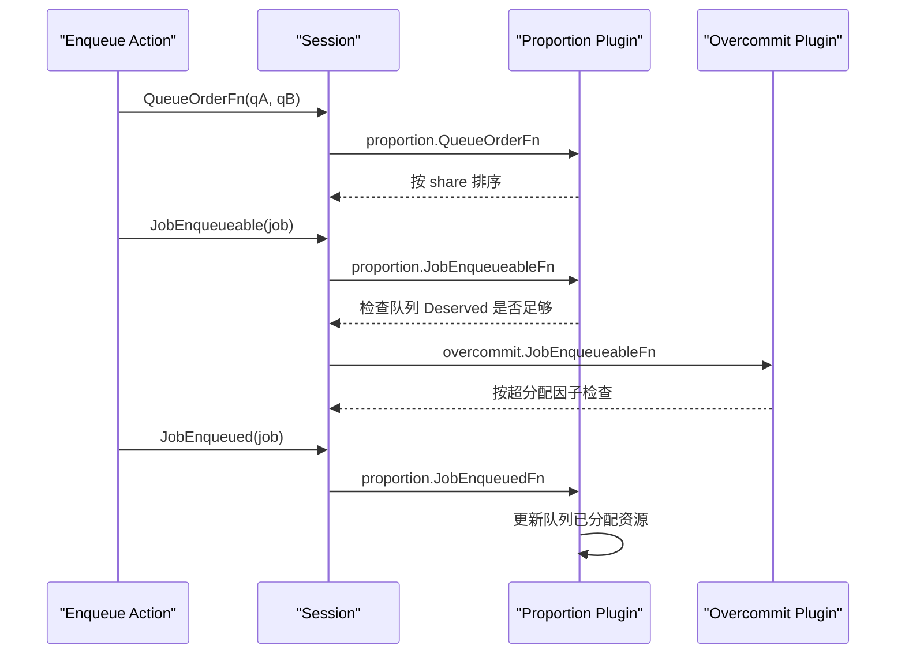
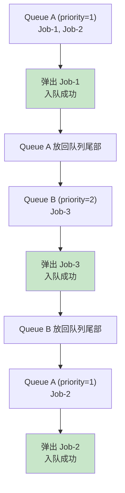
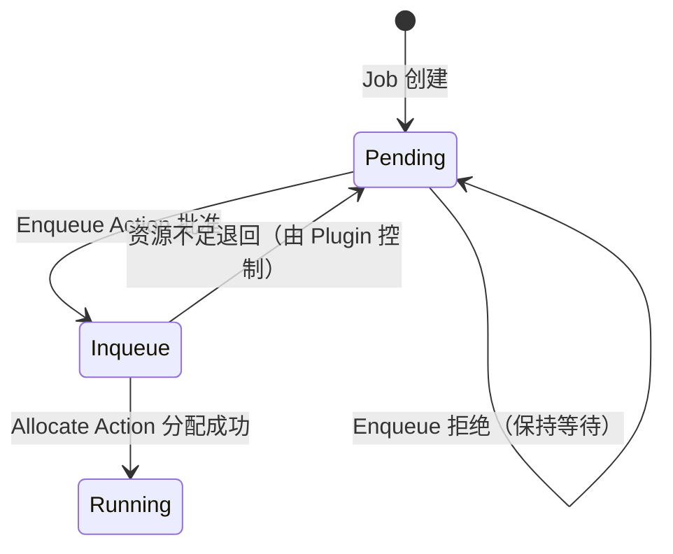

## 概述

Enqueue 是调度流水线的第一个 Action，负责控制 Job 从 `Pending` 状态进入 `Inqueue` 状态。只有进入 Inqueue 状态的 Job 才会被后续的 Allocate Action 处理。Enqueue 通过检查队列资源容量、Job 最小资源需求以及 Plugin 投票来决定哪些 Job 可以入队。

> **源码参考**：`pkg/scheduler/actions/enqueue/enqueue.go`

## 设计意图

Enqueue 的核心价值是**入队控制**（Admission Control）：



**为什么需要入队控制？**

- **避免无效调度**：如果队列资源明显不足，提前阻止 Job 进入调度流程，减少 Allocate 阶段的无效计算
- **队列公平性**：通过 Plugin 投票控制入队顺序，确保高优先级 Job 优先进入调度
- **资源预检**：通过 `minResources` 机制，在入队前检查最小资源需求是否可能满足

---

## 算法流程



### 详细步骤

#### 1. 构建优先级队列

```go
// Queue 排序由 proportion/capacity 等 Plugin 的 QueueOrderFn 决定
queues := util.NewPriorityQueue(ssn.QueueOrderFn)

// 为每个 Queue 构建 Job 优先级队列
jobsMap := map[api.QueueID]*util.PriorityQueue{}
```

按 Queue 优先级和 Job 优先级双重排序，确保高优先级队列中的高优先级 Job 最先被处理。

#### 2. 过滤条件

在将 Job 加入候选队列前进行过滤：

| 条件 | 说明 |
|------|------|
| `job.IsPending()` | 只处理 Pending 状态的 Job |
| `job.PodGroup.Status.Phase == Pending` | PodGroup 也必须是 Pending |
| `ssn.JobValid(job)` | Plugin 校验 Job 有效性 |

#### 3. 入队决策

对每个候选 Job，入队决策分两种情况：

**无 minResources**：直接入队。

**有 minResources**：调用 `ssn.JobEnqueueable(job)` 进行 Plugin 投票。

投票使用 VoteFn 模式：
- **Permit (+1)**：至少一个 Plugin 允许
- **Reject (-1)**：任何 Plugin 拒绝，立即否决
- **Abstain (0)**：弃权，不影响结果

#### 4. 入队通知

```go
job.PodGroup.Status.Phase = scheduling.PodGroupInqueue
ssn.JobEnqueued(job)
```

`ssn.JobEnqueued()` 通知所有注册了 `JobEnqueuedFn` 的 Plugin。例如 Proportion Plugin 在此更新队列的已分配资源追踪。

---

## 与 Plugin 的交互



### 关键 Plugin 行为

| Plugin | 扩展点 | 行为 |
|--------|--------|------|
| **proportion** | `JobEnqueueableFn` | 检查 `job.minResources <= queue.Deserved - queue.Allocated` |
| **proportion** | `JobEnqueuedFn` | `queue.Allocated += job.minResources` |
| **overcommit** | `JobEnqueueableFn` | 按超分配因子扩大可用资源 |
| **capacity** | `JobEnqueueableFn` | 检查层级队列的容量约束 |

---

## 循环调度机制

Enqueue 使用**循环调度**（Round-Robin）在多个 Queue 间交替处理：



每个 Queue 处理一个 Job 后，如果还有更多 Job，Queue 会被放回优先级队列。这确保了多个队列之间的公平轮转。

---

## 状态转换



---

## 常见问题

### Q: 没有设置 minResources 的 Job 一定能入队吗？

是的。如果 Job 的 PodGroup 没有设置 `minResources`，Enqueue 会跳过 `JobEnqueueable` 投票，直接将 Job 设为 Inqueue。

### Q: 入队后但 Allocate 失败的 Job 会怎样？

Job 保持 Inqueue 状态，在下一个调度周期重新尝试 Allocate。如果持续失败，PodGroup 的 Condition 会记录 `Unschedulable` 原因。

### Q: Queue 关闭（Closing/Closed）时 Job 还能入队吗？

Enqueue 本身不检查 Queue 状态，但 Proportion Plugin 的 `JobEnqueueableFn` 会检查队列的 Deserved 资源，关闭的队列 Deserved 为 0，因此 Job 无法入队。

---

## 下一步

- [Allocate Action](./02-allocate-action.md) -- 入队后的核心资源分配
- [Backfill Action](./03-backfill-action.md) -- BestEffort 任务的填充调度
