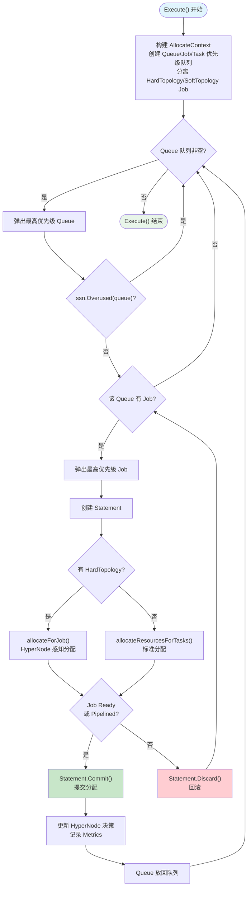
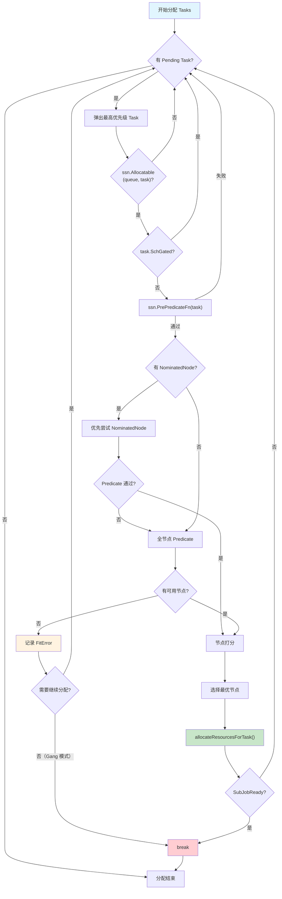
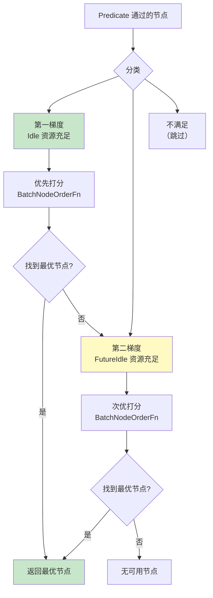
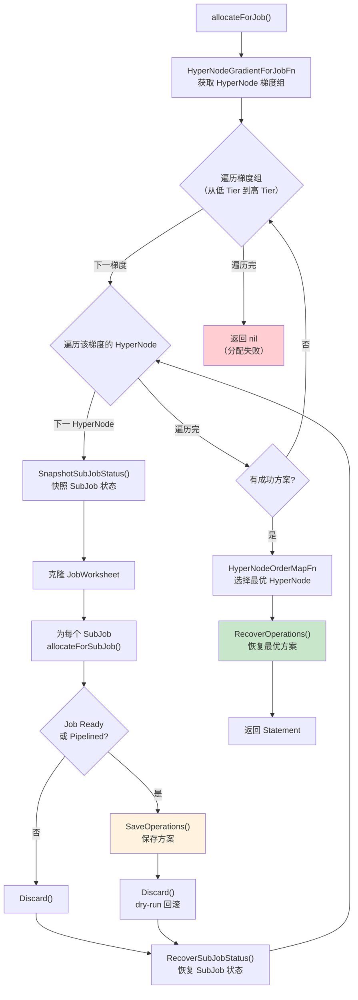
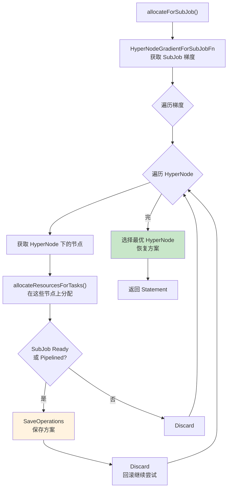
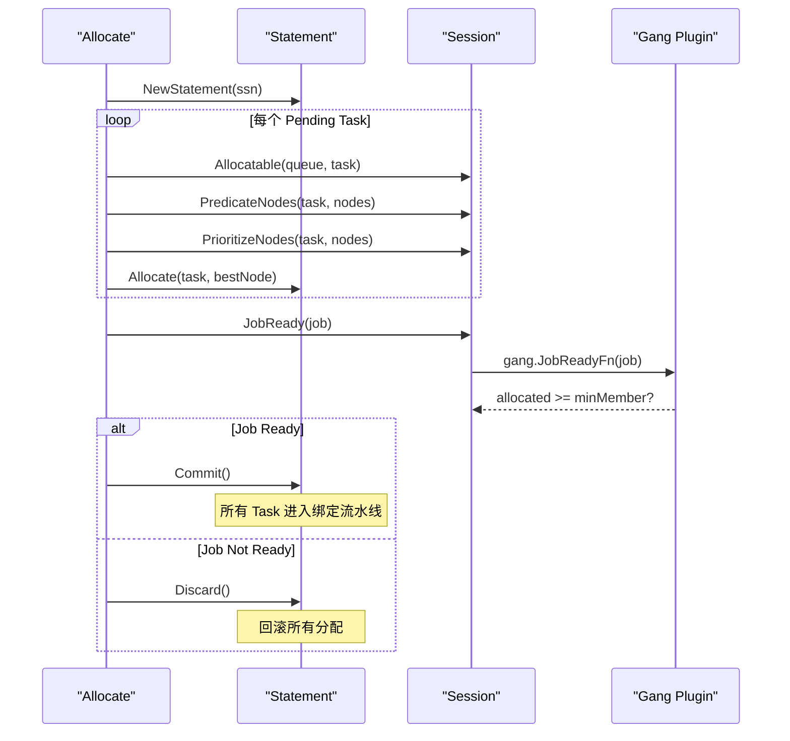
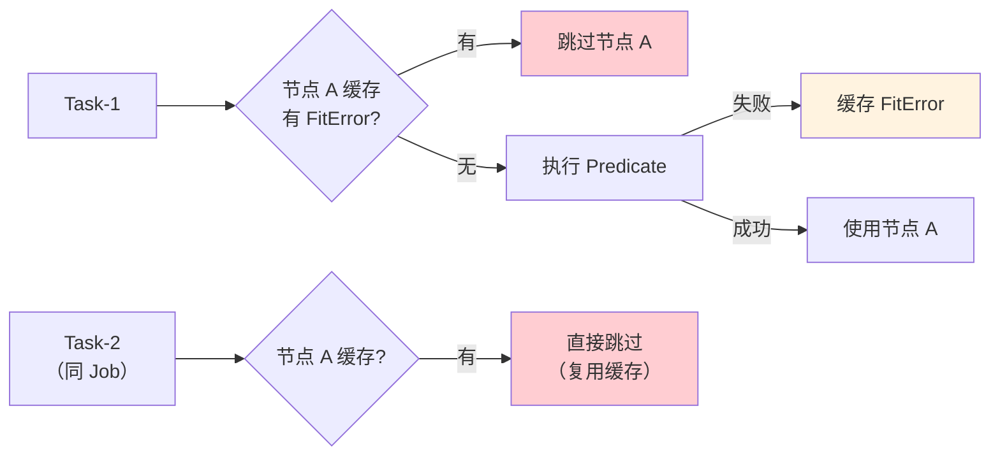

## 概述

Allocate 是 Volcano 调度器最核心、最复杂的 Action，负责为 Inqueue 状态 Job 的 Pending Task 分配节点。它实现了完整的 Gang Scheduling 语义、HyperNode 拓扑感知分配、节点梯度优选以及 Statement 事务控制。

> **源码参考**：`pkg/scheduler/actions/allocate/allocate.go`

## 核心结构

### Action 结构体

```go
type Action struct {
    session                   *framework.Session
    enablePredicateErrorCache bool      // 启用 Predicate 错误缓存
    recorder                  *Recorder // HyperNode 决策记录器
}
```

### 配置参数

| 参数 | 默认值 | 说明 |
|------|--------|------|
| `enablePredicateErrorCache` | `true` | 缓存 Predicate 失败结果，避免重复计算 |

---

## 整体执行流程



---

## 核心分配循环

### allocateResourcesForTasks

这是 Allocate 最核心的函数，实现了单个 SubJob 内 Task 的逐个分配。



### 节点选择：双梯度优选

Allocate 将 Predicate 通过的节点分为两个梯度：



**分片模式下**进一步细分为 4 个梯度：
1. Idle 资源充足 + 本分片节点
2. Idle 资源充足 + 其他分片节点
3. FutureIdle 资源充足 + 本分片节点
4. FutureIdle 资源充足 + 其他分片节点

### 资源分配决策

```go
func allocateResourcesForTask(stmt, task, node, job) error {
    if task.InitResreq.LessEqual(node.Idle, Zero) {
        // 空闲资源充足 → 直接 Allocate
        stmt.Allocate(task, node)
    } else if task.InitResreq.LessEqual(node.FutureIdle(), Zero) {
        // 未来空闲资源充足 → Pipeline（等待释放）
        stmt.Pipeline(task, node.Name, false)
    }
}
```

| 资源状态 | 操作 | Task 状态 |
|---------|------|----------|
| `Idle >= request` | `Allocate` | Allocated |
| `FutureIdle >= request` | `Pipeline` | Pipelined |
| 两者都不足 | 跳过此节点 | 不变 |

---

## HyperNode 拓扑感知分配

### Hard Topology 模式

对于设置了 Hard Topology 的 Job，Allocate 使用 HyperNode 梯度搜索：



### SubJob 分配

每个 SubJob 独立进行 HyperNode 选择：



### Recorder 决策记录

> **源码参考**：`pkg/scheduler/actions/allocate/recorder.go`

`Recorder` 记录每个 Job/SubJob 选择的 HyperNode，用于在 Commit 后更新 Job 的 `AllocatedHyperNode` 字段。

```go
type Recorder struct {
    jobDecisions    map[api.JobID]string                          // Job → 选择的 HyperNode
    subJobDecisions map[api.JobID]map[string]map[api.SubJobID]string // Job → HyperNode → SubJob 决策
    subJobStatusSnapshot map[api.JobID]map[api.SubJobID]*SubJobStatus
}
```

---

## Gang Scheduling 实现

Allocate 中的 Gang Scheduling 通过 Statement 事务实现：



### NeedContinueAllocating

当某个 Task 无法找到可用节点时，需要决定是否继续尝试其他 Task：

```go
func (job *JobInfo) NeedContinueAllocating(subJobUID SubJobID) bool
```

- **Gang 模式（minMember = totalTasks）**：返回 `false`，立即停止（一个失败全部失败）
- **弹性 Gang（minMember < totalTasks）**：返回 `true`，继续尝试其他 Task
- **无 Gang（minMember = 1）**：返回 `true`，逐个独立分配

---

## Predicate 与错误缓存

### Predicate 流程

```go
func (alloc *Action) predicate(task *api.TaskInfo, node *api.NodeInfo) error {
    // 1. 资源检查：FutureIdle >= request
    if ok, resources := task.InitResreq.LessEqualWithResourcesName(node.FutureIdle(), api.Zero); !ok {
        return NewFitErr("InsufficientResources", resources)
    }
    // 2. K8s Predicate：亲和性、污点、端口等
    return ssn.PredicateForAllocateAction(task, node)
}
```

### 错误缓存机制

启用 `enablePredicateErrorCache` 后：



同一个 Job 内相似的 Task 可以复用之前 Task 的 Predicate 失败结果，大幅减少重复计算。

---

## 调用的扩展点

| 扩展点 | 用途 |
|--------|------|
| `QueueOrderFn` | Queue 排序 |
| `JobOrderFn` | Job 排序 |
| `TaskOrderFn` | Task 排序 |
| `Overused` | 判断 Queue 是否超用 |
| `Allocatable` | 判断 Queue 是否可分配 |
| `JobValid` | 验证 Job 有效性 |
| `PrePredicateFn` | Task 预过滤 |
| `PredicateForAllocateAction` | 节点 Predicate |
| `BatchNodeOrderFn` | 批量节点打分 |
| `NodeOrderMapFn` / `NodeOrderReduceFn` | 节点映射/聚合打分 |
| `BestNodeFn` | 最优节点选择 |
| `JobReady` | Job 就绪检查（Gang） |
| `JobPipelined` | Job Pipeline 检查 |
| `SubJobReady` / `SubJobPipelined` | SubJob 就绪检查 |
| `HyperNodeGradientForJobFn` | HyperNode 梯度（Job 级） |
| `HyperNodeGradientForSubJobFn` | HyperNode 梯度（SubJob 级） |
| `HyperNodeOrderMapFn` | HyperNode 打分 |

---

## 常见问题

### Q: Queue 被标记为 Overused 意味着什么？

Queue 的已分配资源超过了 Deserved 资源。Allocate 会跳过 Overused 的 Queue，不再为其中的 Job 分配新资源。这确保了队列间的公平共享。

### Q: NominatedNode 是什么？

NominatedNode 是上一次 Preempt Action 为 Task 推荐的节点。Allocate 会优先尝试 NominatedNode，如果它的 FutureIdle 资源满足需求且 Predicate 通过，就直接使用，避免重新搜索所有节点。

### Q: Hard Topology 和 Soft Topology 的区别？

- **Hard Topology**：Job 必须分配到满足拓扑约束的 HyperNode，否则分配失败
- **Soft Topology**：优先选择拓扑最优的 HyperNode，但不满足时可以降级到更高 Tier

---

## 下一步

- [Backfill Action](./03-backfill-action.md) -- Allocate 后的空隙填充
- [Preempt Action](./04-preempt-action.md) -- 队列内优先级抢占
- [Statement 与绑定](../02-scheduler-deep-dive/06-statement-and-binding.md) -- Commit/Discard 事务机制
