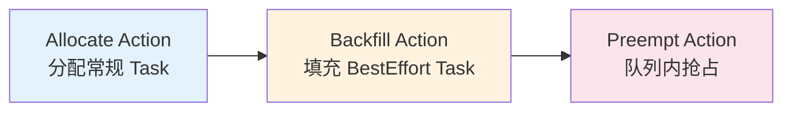
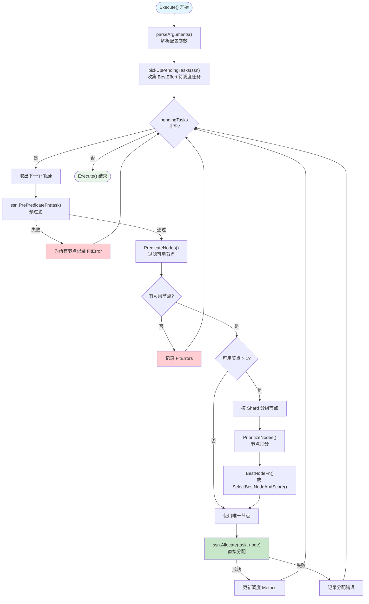
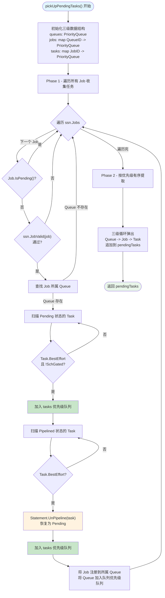
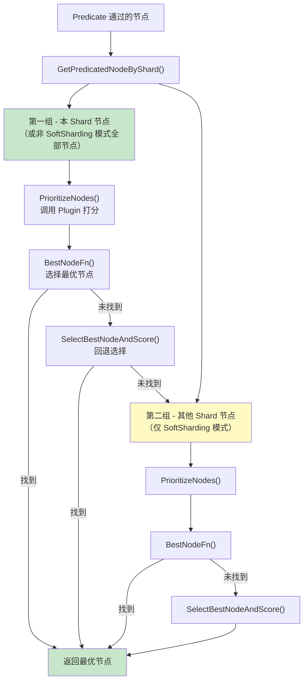

## 概述

Backfill 是 Volcano 调度流水线中的填充调度 Action，专门为 **BestEffort 任务**（即不声明资源请求的任务）寻找空闲节点进行分配。它运行在 Allocate 之后，利用集群中分配剩余的碎片资源，将轻量级任务"填充"到可用节点上。

与 Allocate 不同，Backfill 不使用 Statement 事务机制，也不涉及 Gang Scheduling 语义，而是采用**逐任务直接分配**的简单策略 -- 找到合适的节点后直接调用 `ssn.Allocate()` 绑定。

> **源码参考**：`pkg/scheduler/actions/backfill/backfill.go`

### 设计定位



**为什么需要 Backfill？**

- **碎片利用**：Allocate 为带资源请求的 Task 分配后，集群中通常存在大量零散空闲资源。BestEffort 任务不声明资源需求，可以充分利用这些碎片
- **简化流程**：BestEffort 任务无需 Gang Scheduling（一个任务即可独立运行），省去 Statement 事务的开销
- **优先级分离**：将 BestEffort 任务从 Allocate 中剥离，避免与常规任务竞争调度时间

---

## Action 结构体

```go
type Action struct {
    enablePredicateErrorCache bool  // 默认: true
}
```

| 参数 | 默认值 | 说明 |
|------|--------|------|
| `enablePredicateErrorCache` | `true` | 启用 Predicate 错误缓存，避免对同一 Job 内的相似 Task 重复执行失败的 Predicate |

通过 `parseArguments()` 从 Session 配置中读取参数：

```go
func (backfill *Action) parseArguments(ssn *framework.Session) {
    arguments := framework.GetArgOfActionFromConf(ssn.Configurations, backfill.Name())
    arguments.GetBool(&backfill.enablePredicateErrorCache, conf.EnablePredicateErrCacheKey)
}
```

---

## 整体执行流程



### 关键步骤说明

1. **收集任务**：调用 `pickUpPendingTasks()` 按 Queue - Job - Task 三级优先级收集所有 BestEffort 待调度任务
2. **预过滤**：对每个 Task 执行 `PrePredicateFn`，如果 Task 本身不满足基本条件（如 SchedulingGate 未解除），直接跳过
3. **节点过滤**：通过 `PredicateNodes()` 筛选满足约束的节点（亲和性、污点容忍等）
4. **节点打分**：若有多个可用节点，按 Shard 分组后执行 Plugin 打分，选择最优节点
5. **直接分配**：调用 `ssn.Allocate()` 将 Task 绑定到选中的节点

---

## pickUpPendingTasks 详解

`pickUpPendingTasks` 是 Backfill 的任务收集函数，采用**三级优先级队列**结构，确保任务按 Queue - Job - Task 的全局优先级有序提取。

### 收集流程



### Phase 1 - 任务收集

遍历 Session 中的所有 Job，对每个 Job 执行以下操作：

| 步骤 | 操作 | 说明 |
|------|------|------|
| 1 | 跳过 Pending Job | Job 尚未入队（Enqueue 未通过），不参与 Backfill |
| 2 | JobValid 校验 | 调用 Plugin 验证 Job 有效性 |
| 3 | 查找所属 Queue | Queue 不存在则跳过 |
| 4 | 扫描 Pending Task | 仅收集 `BestEffort && !SchGated` 的任务 |
| 5 | 扫描 Pipelined Task | BestEffort 的 Pipelined 任务先 UnPipeline 再收集 |
| 6 | 注册层级关系 | 将 Job 注册到所属 Queue 的优先级队列 |

**UnPipeline 恢复机制**：如果 BestEffort 任务在之前的 Allocate 中被 Pipeline 到某节点（等待资源释放），Backfill 会将其 UnPipeline，释放预占的资源位，重新参与调度。这是因为 BestEffort 任务不应该长期占据 Pipeline 位，它们更适合立即分配到有空闲资源的节点。

### Phase 2 - 优先级提取

```go
for !queues.Empty() {
    queue := queues.Pop().(*api.QueueInfo)
    for !jobs[queue.UID].Empty() {
        job := jobs[queue.UID].Pop().(*api.JobInfo)
        for !tasks[job.UID].Empty() {
            pendingTasks = append(pendingTasks, tasks[job.UID].Pop().(*api.TaskInfo))
        }
    }
}
```

按照 **Queue 优先级 > Job 优先级 > Task 优先级** 的全局顺序展开为一维列表。高优先级 Queue 中的 Job 的 Task 排在前面，确保重要任务优先获得 Backfill 机会。

---

## 节点选择与打分

### 节点过滤

Backfill 使用 `PredicateHelper.PredicateNodes()` 对所有候选节点执行 Predicate 过滤：

```go
predicateNodes, fitErrors := ph.PredicateNodes(
    task, ssn.NodeList,
    predicateFunc,                        // ssn.PredicateForAllocateAction
    backfill.enablePredicateErrorCache,   // 启用错误缓存
    ssn.NodesInShard,                     // 分片节点集合
)
```

`PredicateForAllocateAction` 会依次检查节点的亲和性、污点容忍、端口冲突等 K8s 原生约束。

### Shard 分组与打分

当存在多个候选节点时，Backfill 按 Shard 亲和性进行分组：



**Shard 分组策略**：

| Shard 模式 | 第一组 | 第二组 |
|-----------|--------|--------|
| 非 SoftSharding | 所有节点 | 空 |
| SoftSharding | 本 Shard 节点 | 其他 Shard 节点 |

优先在本 Shard 节点中选择，只有本 Shard 找不到合适节点时才溢出到其他 Shard。

### 打分与选择

节点打分由以下 Plugin 扩展点协作完成：

1. **BatchNodeOrderFn** - 批量预计算（如 binpack、nodeorder 插件）
2. **NodeOrderMapFn** - 单节点映射打分
3. **NodeOrderReduceFn** - 多维度分数聚合

选择最优节点时，优先调用 `BestNodeFn`（由 Plugin 提供自定义逻辑），如果返回 `nil` 则回退到 `SelectBestNodeAndScore()`（选择得分最高的节点，同分随机）。

---

## 直接分配机制

Backfill 与 Allocate 的关键区别在于分配方式：

```go
// Backfill: 直接分配，无事务
if err := ssn.Allocate(task, node); err != nil {
    klog.Errorf("Failed to bind Task %v on %v in Session %v", task.UID, node.Name, ssn.UID)
    fe.SetNodeError(node.Name, err)
    job.NodesFitErrors[task.UID] = fe
    continue
}
```

- **无 Statement**：不创建事务，不支持 Commit/Discard 回滚
- **逐任务独立**：每个 Task 的分配结果互不影响，一个 Task 分配失败不影响其他 Task
- **立即生效**：Allocate 成功后立即更新 Session 中的资源状态

这种设计与 BestEffort 任务的特性完美匹配 -- 它们没有 Gang 约束，无需"全部成功或全部回滚"的语义。

---

## 与 Allocate Action 的对比

| 维度 | Allocate Action | Backfill Action |
|------|----------------|-----------------|
| **目标任务** | 所有 Pending Task（带资源请求） | 仅 BestEffort Task（无资源请求） |
| **事务机制** | Statement (Commit/Discard) | 无，直接 `ssn.Allocate()` |
| **Gang Scheduling** | 支持，通过 JobReady 判断 | 不支持，逐任务独立分配 |
| **Queue 超用检查** | 检查 `ssn.Overused(queue)` | 不检查 |
| **Allocatable 检查** | 调用 `ssn.Allocatable()` | 不调用 |
| **HyperNode 拓扑** | 支持 Hard/Soft Topology | 不支持 |
| **节点梯度** | Idle / FutureIdle 双梯度 | 单梯度（Predicate 过滤） |
| **Pipeline** | 支持，资源不足时 Pipeline | 不支持，会 UnPipeline 已有的 |
| **NominatedNode** | 优先尝试 | 不使用 |
| **Shard 分组** | 4 梯度（Idle/FutureIdle x 本Shard/其他Shard） | 2 梯度（本Shard/其他Shard） |
| **复杂度** | 高（~800行，含 HyperNode 逻辑） | 低（~200行） |

---

## 调用的扩展点

| 扩展点 | 调用位置 | 用途 |
|--------|---------|------|
| `QueueOrderFn` | `pickUpPendingTasks` | Queue 优先级排序 |
| `JobOrderFn` | `pickUpPendingTasks` | Job 优先级排序 |
| `TaskOrderFn` | `pickUpPendingTasks` | Task 优先级排序 |
| `JobValid` | `pickUpPendingTasks` | 验证 Job 有效性 |
| `PrePredicateFn` | `Execute` | Task 预过滤（如 SchedulingGate 检查） |
| `PredicateForAllocateAction` | `Execute` | 节点 Predicate 过滤 |
| `BatchNodeOrderFn` | `Execute` | 批量节点打分预计算 |
| `NodeOrderMapFn` | `Execute` | 单节点映射打分 |
| `NodeOrderReduceFn` | `Execute` | 多维度分数聚合 |
| `BestNodeFn` | `Execute` | 最优节点选择（Plugin 自定义） |
| `ssn.Allocate` | `Execute` | 直接分配 Task 到 Node |

---

## 常见问题

### Q: 什么样的 Task 会被 Backfill 处理？

只有同时满足以下条件的 Task 才会被 Backfill 收集：

1. Task 所属 Job 不是 Pending 状态（已通过 Enqueue）
2. Job 通过 `JobValid` 校验
3. Job 所属 Queue 存在
4. Task 标记为 **BestEffort**（即不声明资源请求的 Pod）
5. Task 处于 **Pending** 或 **Pipelined** 状态
6. Task 未被 SchedulingGate 拦截（`!SchGated`）

### Q: Backfill 为什么不检查 Queue 的 Overused 状态？

BestEffort 任务不声明资源请求，因此不会消耗队列的资源配额。Overused 检查基于队列的 Deserved 资源与已分配资源的比较，对零资源请求的任务没有意义。

### Q: Pipelined 的 BestEffort 任务为什么要 UnPipeline？

Pipeline 机制是为等待资源释放而设计的 -- 当节点当前资源不足但 FutureIdle 资源足够时，Task 被 Pipeline 到该节点等待。但 BestEffort 任务不需要特定的资源量，它们应该被分配到当前有空闲资源的节点，而不是等待某个节点的资源释放。UnPipeline 释放预占位后，让 Backfill 重新选择最合适的节点。

### Q: Backfill 分配失败会有什么影响？

单个 Task 的 Allocate 失败只影响该 Task 本身，不会影响其他 Task 的分配。失败原因会记录在 `job.NodesFitErrors[task.UID]` 中，供 PodGroup Condition 展示。该 Task 会在下一个调度周期重新尝试。

### Q: 为什么 Backfill 不使用 Statement 事务？

Statement 事务的核心价值在于支持 Gang Scheduling 的"全部成功或全部回滚"语义。BestEffort 任务没有 Gang 约束（`minMember` 对它们无意义），每个任务独立分配互不依赖，因此不需要事务机制。直接 Allocate 减少了事务开销，提升了调度效率。

---

## 下一步

- [Preempt Action](./04-preempt-action.md) -- 队列内高优先级 Job 抢占低优先级 Job 的资源
- [Reclaim Action](./05-reclaim-action.md) -- 跨队列资源回收机制
