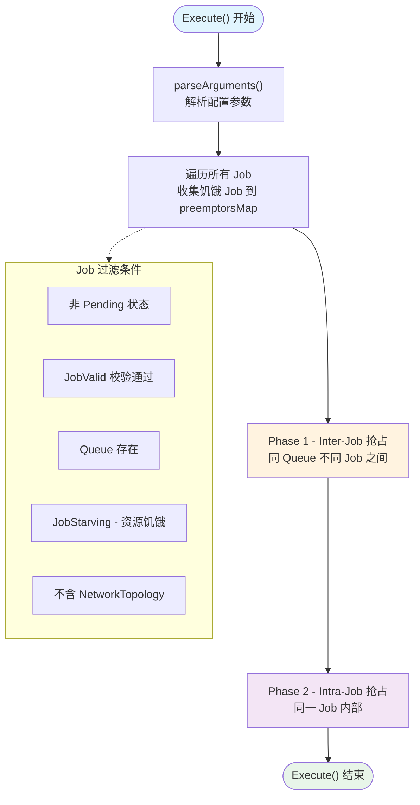
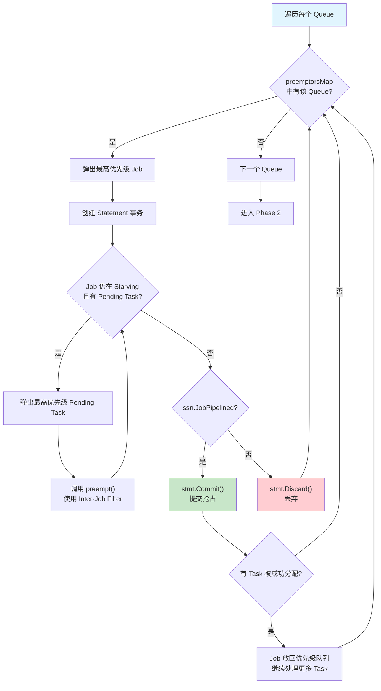
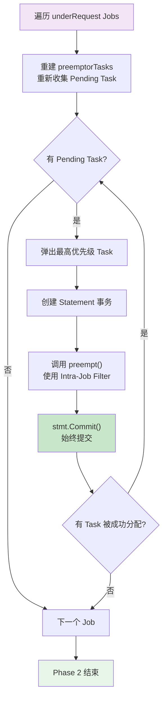
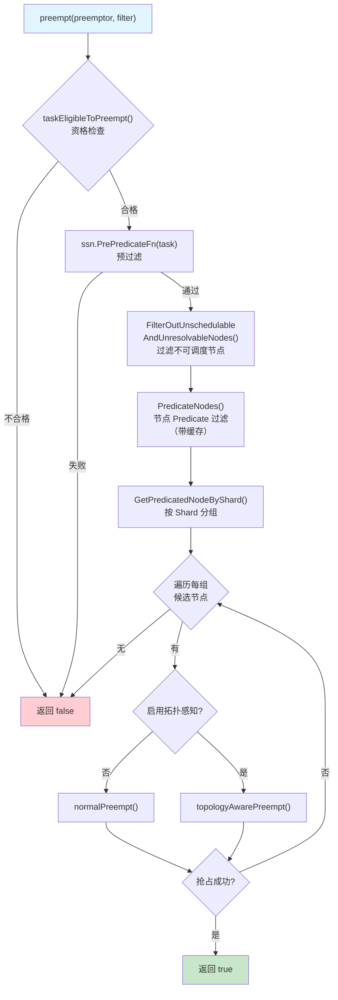
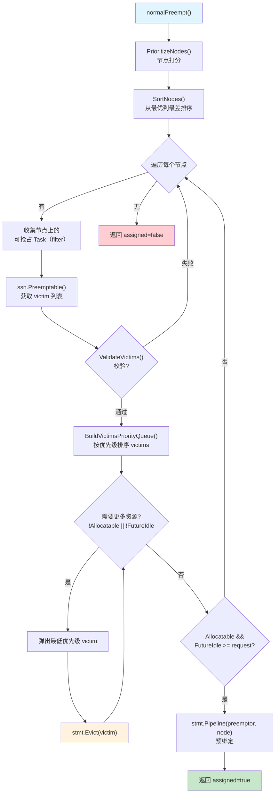
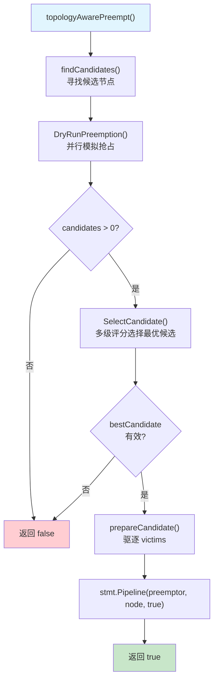
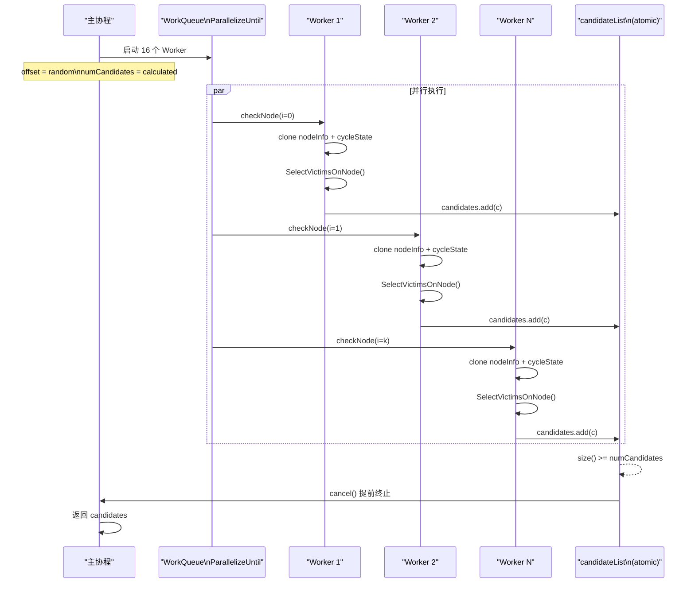
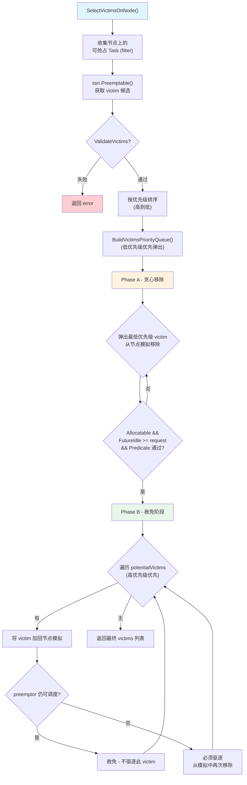
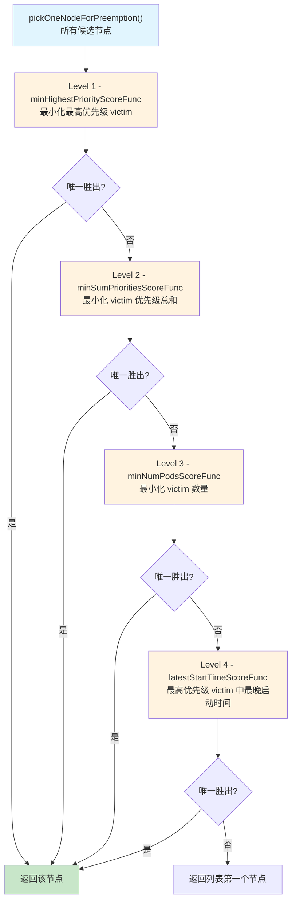
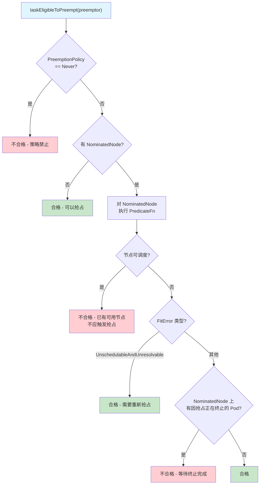

## 概述

Preempt 是 Volcano 调度器中**最复杂的 Action**，负责在同一个 Queue 内部进行抢占调度。当高优先级的 Job/Task 因资源不足而处于饥饿状态时，Preempt Action 会驱逐同 Queue 中低优先级的 Task，为高优先级任务腾出资源。

与 Reclaim（跨 Queue 资源回收）不同，Preempt 的抢占范围严格限定在**同一 Queue 内部**，包含两个层级：

- **Inter-Job 抢占** -- 同 Queue 不同 Job 之间，高优先级 Job 抢占低优先级 Job 的运行 Task
- **Intra-Job 抢占** -- 同一 Job 内部，高优先级 Task 抢占低优先级 Task

Preempt 还支持两种抢占策略：标准抢占（normalPreempt）和拓扑感知抢占（topologyAwarePreempt），后者通过并行 DryRun 模拟和多级评分算法选择最优抢占候选节点。

> **源码参考**：`pkg/scheduler/actions/preempt/preempt.go`（约 999 行）

---

## Action 结构体与配置参数

```go
type Action struct {
    ssn                          *framework.Session
    enablePredicateErrorCache    bool   // 启用 Predicate 错误缓存
    enableTopologyAwarePreemption bool  // 启用拓扑感知抢占
    topologyAwarePreemptWorkerNum int   // DryRun 并行 Worker 数
    minCandidateNodesPercentage   int   // 候选节点最小百分比
    minCandidateNodesAbsolute     int   // 候选节点最小绝对数
    maxCandidateNodesAbsolute     int   // 候选节点最大绝对数
}
```

### 配置参数说明

| 参数 | 默认值 | 说明 |
|------|--------|------|
| `enablePredicateErrorCache` | `true` | 缓存 Predicate 失败结果，避免对同一节点重复计算 |
| `enableTopologyAwarePreemption` | `false` | 启用拓扑感知抢占模式（使用 DryRun + 多级评分） |
| `topologyAwarePreemptWorkerNum` | `16` | 拓扑感知抢占时 DryRun 并行 Worker 数量 |
| `minCandidateNodesPercentage` | `10` | 候选节点数占总节点数的最小百分比 |
| `minCandidateNodesAbsolute` | `1` | 候选节点的最小绝对数量 |
| `maxCandidateNodesAbsolute` | `100` | 候选节点的最大绝对数量 |

候选节点数量的计算公式为：

```
numCandidates = clamp(numNodes * percentage / 100, minAbsolute, maxAbsolute)
numCandidates = min(numCandidates, numNodes)
```

---

## 整体执行流程

Execute() 方法分为两个主要阶段依次执行：



### Job 收集阶段

在进入抢占循环前，Execute() 遍历所有 Job 并进行过滤：

| 过滤条件 | 说明 |
|----------|------|
| `job.IsPending()` | 跳过 Pending 状态的 Job（尚未入队） |
| `ssn.JobValid(job)` | Plugin 校验 Job 有效性 |
| `ssn.Queues[job.Queue]` | Job 所属 Queue 必须存在 |
| `ssn.JobStarving(job)` | Job 必须处于饥饿状态（需要更多资源） |
| `job.ContainsNetworkTopology()` | 含 NetworkTopology 的 Job 暂不支持抢占 |

通过过滤的 Job 按 Queue 分组放入 `preemptorsMap`（按 `JobOrderFn` 排序），同时将每个 Job 的 Pending Task 放入 `preemptorTasks`（按 `TaskOrderFn` 排序）。

---

## Phase 1 - Inter-Job 抢占（同 Queue 不同 Job 之间）

Inter-Job 抢占是主抢占阶段，在同一 Queue 内部，高优先级 Job 可以抢占低优先级 Job 的运行 Task。



### Inter-Job Filter 规则

抢占目标（被抢占者）必须同时满足以下条件：

```go
func filter(task *api.TaskInfo) bool {
    // 1. Task 必须处于可抢占的运行状态
    api.PreemptableStatus(task.Status)
    // 2. BestEffort Task 不能抢占非 BestEffort Task
    !(preemptor.BestEffort && !task.BestEffort)
    // 3. Task 标记为可抢占
    task.Preemptable
    // 4. 同一 Queue 但不同 Job
    job.Queue == preemptorJob.Queue && preemptor.Job != task.Job
}
```

### 事务语义

Inter-Job 抢占使用 **JobPipelined** 作为提交条件：只有当 Job 的 Pipeline 条件满足（如 Gang 调度中的最小任务数已达到），Statement 才会被 Commit。否则回滚所有抢占操作，避免无效驱逐。

---

## Phase 2 - Intra-Job 抢占（同一 Job 内部）

当 Inter-Job 抢占完成后，对于仍然资源不足（underRequest）的 Job，执行 Intra-Job 抢占 -- 在同一 Job 内部，高优先级 Task 抢占低优先级 Task。



### Intra-Job Filter 规则

```go
func filter(task *api.TaskInfo) bool {
    api.PreemptableStatus(task.Status)             // 运行状态
    !(preemptor.BestEffort && !task.BestEffort)    // BestEffort 约束
    task.Preemptable                                // 可抢占标记
    preemptor.Job == task.Job                       // 同一 Job
}
```

### 与 Phase 1 的关键差异

| 特征 | Phase 1（Inter-Job） | Phase 2（Intra-Job） |
|------|---------------------|---------------------|
| 抢占范围 | 同 Queue 不同 Job | 同一 Job 内部 |
| 提交条件 | JobPipelined 才 Commit | 始终 Commit |
| Statement 粒度 | 整个 Job 一个 Statement | 每个 Task 一个 Statement |
| Pending Task 来源 | 初始收集 | 重新收集（修复计数丢失问题） |

Phase 2 始终 Commit 的原因是：即使部分抢占成功，Job 内部的任务重新分配也是有意义的（例如高优先级 Worker 替换低优先级 Worker）。

---

## 核心 preempt() 函数

preempt() 是 Phase 1 和 Phase 2 共用的抢占核心逻辑，负责为单个 Pending Task 寻找抢占机会。



### 函数签名

```go
func (pmpt *Action) preempt(
    ssn *framework.Session,
    stmt *framework.Statement,
    preemptor *api.TaskInfo,
    filter func(*api.TaskInfo) bool,
    predicateHelper util.PredicateHelper,
) (bool, error)
```

### 执行步骤

1. **资格检查** -- `taskEligibleToPreempt()` 检查 PreemptionPolicy 和 NominatedNode
2. **预过滤** -- `ssn.PrePredicateFn(task)` 运行 Plugin 的预过滤逻辑
3. **节点过滤** -- 过滤掉在 Allocate 阶段被标记为 UnschedulableAndUnresolvable 的节点
4. **Predicate** -- 对剩余节点运行 `PredicateForPreemptAction`（支持错误缓存）
5. **Shard 分组** -- 按 Shard 优先级分组，依次尝试每组节点
6. **抢占执行** -- 根据配置选择 `normalPreempt()` 或 `topologyAwarePreempt()`

---

## normalPreempt 标准抢占

normalPreempt 是默认的抢占策略，逐节点评估，按优先级驱逐最少数量的 victim 来满足抢占者需求。



### 资源释放判断

normalPreempt 在驱逐 victim 的循环中使用双重条件判断是否已释放足够资源：

```go
// 条件 1: Queue 对该 Task 可分配（不会导致 Queue 超额）
ssn.Allocatable(currentQueue, preemptor)
// 条件 2: 节点 FutureIdle 资源满足 Task 需求
preemptor.InitResreq.LessEqual(node.FutureIdle(), api.Zero)
```

只有两个条件同时满足，才停止驱逐并执行 Pipeline。这里区分了三种资源不足场景：

| 场景 | Queue 可分配 | 集群空闲资源 | Preempt 处理 |
|------|-------------|-------------|-------------|
| 队列不可分配，集群有空闲 | 否 | 是 | 继续驱逐同 Queue 低优先级 Task |
| 队列不可分配，集群无空闲 | 否 | 否 | 继续驱逐同 Queue 低优先级 Task |
| 队列可分配，集群无空闲 | 是 | 否 | 需要 Reclaim Action 从其他 Queue 回收 |

---

## topologyAwarePreempt 拓扑感知抢占

拓扑感知抢占是 Preempt Action 的高级模式，通过并行 DryRun 模拟找到最优抢占候选节点，适用于对节点拓扑有要求的工作负载。



### DryRunPreemption 并行模拟

DryRunPreemption 是拓扑感知抢占的核心，使用 Worker Pool 并行评估多个节点上的抢占可行性。



关键设计要点：

- **随机偏移**（Random Offset）：每次从随机位置开始遍历节点，避免始终从同一节点开始导致抢占分布不均
- **提前终止**：当收集到足够数量的候选节点后，通过 `context.Cancel()` 通知其他 Worker 停止
- **线程安全**：`candidateList` 使用 `atomic.AddInt32` 实现无锁并发添加
- **状态隔离**：每个 Worker 独立 clone `nodeInfo` 和 `cycleState`，互不干扰

### SelectVictimsOnNode - 节点级 Victim 选择

SelectVictimsOnNode 在单个节点上寻找最小驱逐集合，包含两个阶段：



**Phase A - 贪心移除**：从低优先级开始逐个移除 victim，直到抢占者可以调度到该节点。

**Phase B - 赦免阶段**：尝试将已移除的 victim 逐个加回（从高优先级开始），如果加回后抢占者仍然可以调度，则赦免该 victim（不需要实际驱逐）。这确保了**最小驱逐集合** -- 只驱逐真正必要的 Pod。

---

## 候选节点评分（Multi-level Scoring）

当拓扑感知抢占产生多个候选节点时，`pickOneNodeForPreemption` 使用四级评分函数依次打分，逐级淘汰直到选出唯一最优节点。



### 四级评分函数详解

| 级别 | 评分函数 | 目标 | 计算方式 |
|------|---------|------|---------|
| Level 1 | `minHighestPriorityScoreFunc` | 最小化对高优先级 Pod 的影响 | `-highestPriority`（优先级越低越好） |
| Level 2 | `minSumPrioritiesScoreFunc` | 最小化总体影响 | `-(sum(priority + MaxInt32 + 1))`（总优先级越低越好） |
| Level 3 | `minNumPodsScoreFunc` | 最少驱逐数量 | `-len(victims)`（数量越少越好） |
| Level 4 | `latestStartTimeScoreFunc` | 偏好驱逐新启动的 Pod | `earliestStartTime.UnixNano()`（启动时间越晚越好） |

设计哲学：**最小化抢占的负面影响**。优先选择驱逐优先级低、数量少、启动时间短的 Pod 的节点。

---

## taskEligibleToPreempt 资格检查

在执行抢占前，taskEligibleToPreempt 对抢占者进行资格校验：



### NominatedNode 校验逻辑

当 Task 已经有 NominatedNode（之前一轮抢占已选定的节点）时，需要判断是否需要重新抢占：

| 场景 | 结果 | 原因 |
|------|------|------|
| NominatedNode 可调度 | 不合格 | 节点已有空间，无需抢占 |
| NominatedNode UnschedulableAndUnresolvable | 合格 | 节点状态恶化，需重新抢占 |
| NominatedNode 上有因抢占正在终止的 Pod | 不合格 | 等待当前抢占完成 |
| NominatedNode 不存在 | 不合格 | 节点已离开集群 |

---

## 与 Reclaim Action 的对比

| 特征 | Preempt Action | Reclaim Action |
|------|---------------|----------------|
| **抢占范围** | 同一 Queue 内部 | 跨 Queue |
| **触发条件** | Job Starving（资源饥饿） | Queue Overused + Job Starving |
| **优先级依据** | Task/Job 优先级 | Queue 配额优先级 |
| **事务提交** | Inter-Job 需 JobPipelined；Intra-Job 始终提交 | 需 JobPipelined |
| **两阶段抢占** | 支持（Inter-Job + Intra-Job） | 仅跨 Queue 单阶段 |
| **拓扑感知** | 支持 topologyAwarePreempt | 不支持 |
| **DryRun 模拟** | 支持并行 DryRun | 不支持 |
| **多级评分** | 4 级评分选最优候选 | 无 |
| **典型场景** | 同 Queue 高低优先级任务竞争 | 不同 Queue 间资源再平衡 |

---

## 调用的扩展点

| 扩展点 | 调用位置 | 说明 |
|--------|---------|------|
| `JobOrderFn` | 构建 preemptorsMap | Job 优先级排序 |
| `TaskOrderFn` | 构建 preemptorTasks | Task 优先级排序 |
| `JobValid` | Job 过滤阶段 | 校验 Job 有效性 |
| `JobStarving` | Job 过滤阶段 | 判断 Job 是否资源饥饿 |
| `JobPipelined` | Phase 1 提交决策 | 判断 Job 是否可提交 |
| `PrePredicateFn` | preempt() | Task 预过滤 |
| `PredicateForPreemptAction` | preempt() | 节点 Predicate 过滤（抢占专用） |
| `Preemptable` | normalPreempt / SelectVictimsOnNode | 获取 victim 列表 |
| `BuildVictimsPriorityQueue` | normalPreempt / SelectVictimsOnNode | 构建 victim 优先级队列 |
| `ValidateVictims` | normalPreempt / SelectVictimsOnNode | 校验 victim 合法性 |
| `Allocatable` | normalPreempt / SelectVictimsOnNode | 判断 Queue 对 Task 是否可分配 |
| `BatchNodeOrderFn` | normalPreempt | 批量节点打分 |
| `NodeOrderMapFn / NodeOrderReduceFn` | normalPreempt | 节点打分 Map-Reduce |
| `SimulateRemoveTaskFn` | SelectVictimsOnNode | 模拟移除 Task |
| `SimulateAddTaskFn` | SelectVictimsOnNode | 模拟添加 Task |
| `SimulatePredicateFn` | SelectVictimsOnNode | 模拟 Predicate 检查 |
| `SimulateAllocatableFn` | SelectVictimsOnNode | 模拟 Allocatable 检查 |

---

## 常见问题

### Q: Preempt 和 Reclaim 应该如何选择？

Preempt 处理**同一 Queue 内部**的优先级抢占，Reclaim 处理**跨 Queue**的资源回收。两者互补：

- 如果高优先级 Job 与低优先级 Job 在同一 Queue，由 Preempt 处理
- 如果 Queue A 的资源被 Queue B 借用，需要回收，由 Reclaim 处理

在典型的调度配置中，两者通常同时启用：`actions: "enqueue, allocate, preempt, reclaim, backfill"`

### Q: BestEffort Task 为什么不能抢占非 BestEffort Task？

BestEffort Pod 没有设置资源 Request/Limit，属于最低资源保障等级。允许其抢占有明确资源需求的 Pod 会违反 Kubernetes 的 QoS 语义，因此 Preempt 做了显式限制。

### Q: topologyAwarePreemption 什么时候应该启用？

当工作负载对节点拓扑敏感（如 GPU 亲和性、NUMA 感知）且集群规模较大时，建议启用。拓扑感知抢占通过 DryRun 模拟和多级评分能更精准地选择最优抢占节点，但会带来额外的计算开销。小规模集群或对拓扑无要求的场景使用默认的 normalPreempt 即可。

### Q: 为什么 Phase 2（Intra-Job）要重新收集 Pending Task？

源码注释说明：`Fix: preemptor numbers lose when in same job`。Phase 1 的抢占可能改变 Job 内部的 Task 状态，导致之前收集的 Pending Task 列表不准确。重新收集确保 Phase 2 使用最新的 Task 状态。

### Q: 赦免阶段（Reprieve）的作用是什么？

赦免阶段确保**最小驱逐集合**。贪心移除阶段可能移除了过多的 victim。赦免阶段逆向尝试将 victim 加回，只保留真正必要的驱逐，最小化对集群的影响。这是 Kubernetes 调度器中经典的 "reprieve" 策略。

### Q: 如果抢占失败（Pipeline 后 rollback），会发生什么？

如果 `stmt.Pipeline()` 失败，会立即调用 `stmt.UnPipeline()` 回滚。被驱逐的 victim 不会被恢复（驱逐是不可逆的），但抢占者不会被分配到该节点。在下一个调度周期中，调度器会基于新的集群状态重新评估。

---

## 下一步

- [Reclaim Action](./05-reclaim-action.md) -- 跨 Queue 资源回收机制
- [Allocate Action](./02-allocate-action.md) -- 核心资源分配流程
- [Backfill Action](./03-backfill-action.md) -- BestEffort 任务填充
