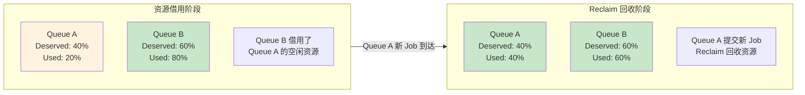
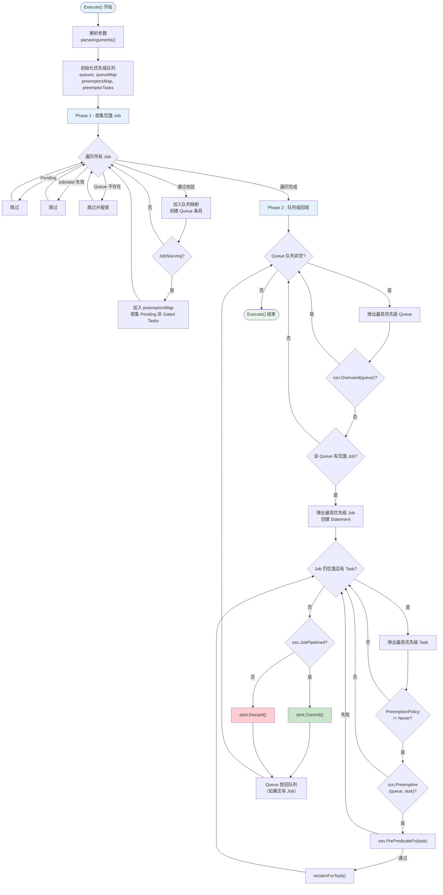
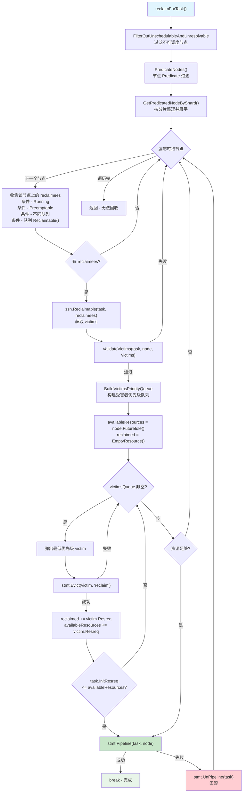
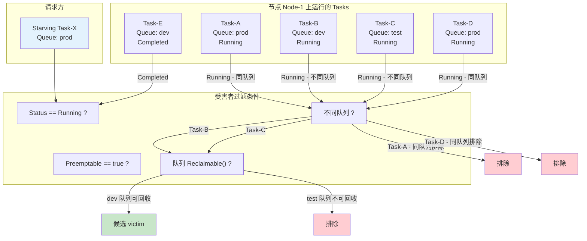
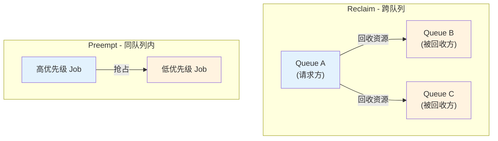

## 概述

Reclaim 是 Volcano 调度流水线中负责**跨队列资源回收**的 Action。当某个队列的 Job 因资源不足而处于饥饿状态（Starving）时，Reclaim 会从**其他队列**中运行的低优先级 Task 中回收资源，将其腾让给饥饿 Job。Reclaim 是实现队列间公平共享（Fair-Share）的关键机制，与 Proportion Plugin 配合，确保每个队列能获得其应得（Deserved）的资源份额。

> **源码参考**：`pkg/scheduler/actions/reclaim/reclaim.go`

---

## 设计意图

### 为什么需要 Reclaim

在多队列环境下，队列的资源使用存在动态波动。当某个队列暂时空闲时，其他队列可以借用这部分资源；但当空闲队列有新 Job 提交时，需要将借出的资源回收回来。Reclaim 正是处理这种跨队列资源归还的核心机制。



**核心价值**：

- **公平性保障**：确保队列能够拿回被借用的资源，不因资源借出而饿死
- **与 Proportion 联动**：Proportion Plugin 计算每个队列的 Deserved 份额，Reclaim 负责在运行时执行回收
- **精确回收**：只回收标记为 `Reclaimable` 的队列中的 Task，避免干扰不可回收的高优先级工作负载

---

## Action 结构体

```go
type Action struct {
    enablePredicateErrorCache bool  // 默认: true, 缓存 Predicate 失败结果
}
```

| 字段 | 默认值 | 说明 |
|------|--------|------|
| `enablePredicateErrorCache` | `true` | 启用 Predicate 错误缓存，避免对相似 Task 重复计算节点过滤 |

配置通过 `parseArguments()` 从 Session 配置中读取 `enablePredicateErrorCache` 参数。

---

## 整体执行流程

Reclaim 的执行分为两个阶段：收集饥饿 Job，然后按队列优先级依次执行资源回收。



### 阶段详解

#### Phase 1 - 收集饥饿 Job（lines 71-103）

遍历 Session 中的所有 Job，进行三级过滤：

1. **状态过滤**：跳过 Pending 状态的 Job（尚未入队，不参与回收）
2. **有效性校验**：`ssn.JobValid(job)` 检查 Job 是否有效
3. **饥饿检测**：`ssn.JobStarving(job)` 由 Gang Plugin 判断 Job 是否因资源不足无法满足最小成员数

对饥饿 Job，收集其所有 Pending 且未被 SchGated 的 Task 作为待调度候选。

#### Phase 2 - 队列级回收（lines 105-172）

按队列优先级循环处理。对每个队列中的每个饥饿 Job：

1. 创建 Statement 事务
2. 逐个处理 Pending Task，检查 PreemptionPolicy、Preemptive 权限、PrePredicate
3. 调用 `reclaimForTask()` 尝试从其他队列回收资源
4. 如果 Job 达到 Pipelined 状态则 Commit，否则 Discard

---

## reclaimForTask 详解

`reclaimForTask()` 是 Reclaim 的核心函数，负责在所有可行节点上寻找可回收的受害者（victims）并驱逐。



### 关键步骤说明

**节点过滤**：先通过 `FilterOutUnschedulableAndUnresolvableNodesForTask` 去除不可调度节点，再用 `PredicateNodes` 对剩余节点进行 Predicate 校验（复用 `PredicateForPreemptAction`），最后按分片整理。

**贪心驱逐**：在每个节点上，按优先级从低到高逐个驱逐 victim，直到释放的资源加上节点当前的 `FutureIdle()` 满足 Task 需求。这是一种贪心策略，尽可能少地驱逐 Task。

**Pipeline 与回滚**：驱逐足够资源后，通过 `stmt.Pipeline(task, node)` 将 Task 标记为 Pipelined。如果 Pipeline 失败，会尝试 `UnPipeline` 回滚。

---

## 跨队列受害者选择

Reclaim 与 Preempt 最大的区别在于受害者的选择范围。Reclaim 严格限制为跨队列回收，并且需要目标队列显式标记为可回收。



### 过滤规则详解

以下是每个节点上收集 reclaimees 的四重过滤条件：

| 序号 | 条件 | 代码 | 说明 |
|------|------|------|------|
| 1 | `Status == Running` | `taskOnNode.Status != api.Running` | 只驱逐正在运行的 Task |
| 2 | `Preemptable == true` | `!taskOnNode.Preemptable` | Task 必须标记为可抢占 |
| 3 | 不同队列 | `j.Queue != job.Queue` | 只回收其他队列的 Task（核心区别） |
| 4 | 队列可回收 | `q.Reclaimable()` | 目标队列必须标记为可回收 |

通过四重过滤后，候选 victims 被传入 `ssn.Reclaimable(task, reclaimees)`，由 Plugin（如 Proportion）进一步筛选，返回最终的受害者列表。

---

## 与 Preempt Action 的对比

Reclaim 和 Preempt 都涉及驱逐已运行的 Task 来腾出资源，但它们的设计目标和工作范围截然不同：

| 维度 | Reclaim | Preempt |
|------|---------|---------|
| **目标范围** | 跨队列（不同队列的 Task） | 同队列内（相同队列的 Task） |
| **设计意图** | 回收被借用的资源，恢复公平份额 | 队列内高优先级 Job 抢占低优先级 Job |
| **Overused 检查** | 跳过 Overused 队列 | 不检查 Overused |
| **Preemptive 检查** | `ssn.Preemptive(queue, task)` 检查请求方权限 | 无此检查 |
| **受害者钩子** | `ssn.Reclaimable()` | `ssn.Preemptable()` |
| **队列可回收检查** | `queue.Reclaimable()` 过滤目标队列 | 无此过滤 |
| **NominatedNode** | 不使用，直接 Pipeline | 支持设置 NominatedNode |
| **拓扑感知模式** | 不支持（顺序遍历） | 支持 Worker Pool 并发 |
| **Pipeline 回滚** | 失败时 UnPipeline 回滚 | 失败时 UnPipeline 回滚 |



---

## 调用的扩展点

| 扩展点 | 用途 | 典型 Plugin |
|--------|------|-------------|
| `QueueOrderFn` | Queue 优先级排序 | proportion, capacity |
| `JobOrderFn` | Job 优先级排序 | priority, gang |
| `TaskOrderFn` | Task 优先级排序 | priority |
| `JobValid` | Job 有效性校验 | gang |
| `JobStarving` | 判断 Job 是否资源饥饿 | gang |
| `Overused` | 判断 Queue 是否超用 | proportion, capacity |
| `Preemptive` | 判断 Queue/Task 是否有权回收 | proportion |
| `PrePredicateFn` | Task 预过滤 | predicates, numaaware |
| `FilterOutUnschedulableAndUnresolvableNodesForTask` | 过滤不可调度节点 | 内置 |
| `PredicateForPreemptAction` | 节点 Predicate（复用 Preempt 的） | predicates |
| `Reclaimable` | 筛选可回收受害者 | proportion, capacity |
| `BuildVictimsPriorityQueue` | 构建受害者优先级队列 | priority |
| `JobPipelined` | 判断 Job 是否达到 Pipeline 状态 | gang |
| `Evict`（via Statement） | 驱逐受害者 Task | 内置 |
| `Pipeline`（via Statement） | 将 Task 标记为 Pipelined | 内置 |

---

## 常见问题

### Q: Reclaim 和 Preempt 会冲突吗？

不会。两者作用范围不同：Reclaim 处理跨队列回收，Preempt 处理同队列内抢占。在调度流水线中，通常 Preempt 先执行（处理队列内优先级），Reclaim 后执行（处理队列间公平性）。两者使用不同的 Plugin Hook（`Preemptable` vs `Reclaimable`），互不干扰。

### Q: 什么决定了一个队列是否 Reclaimable？

`queue.Reclaimable()` 由 Queue 的配置决定。只有显式标记为可回收的队列中的 Task 才会被 Reclaim 驱逐。这允许管理员保护特定队列（如生产队列）不被回收。

### Q: 为什么 Reclaim 跳过 Overused 的队列？

Overused 意味着队列使用的资源已经超过了 Deserved 份额。如果一个队列本身就在超用，它不应该再去回收其他队列的资源。只有资源使用低于应得份额的队列才有资格发起回收。

### Q: Reclaim 的回收是精确到 Deserved 份额吗？

不是精确到份额的。Reclaim 是逐 Task 驱逐的贪心算法：对于每个 Pending Task，在节点上找到足够的 victims 释放资源即可。`ssn.Reclaimable()` 由 Proportion Plugin 实现，会综合考虑双方队列的 Deserved/Allocated 来决定哪些 Task 可以被回收。

### Q: Pipeline 失败后的 UnPipeline 回滚是如何工作的？

当 `stmt.Pipeline(task, node)` 失败时，Reclaim 会调用 `stmt.UnPipeline(task)` 尝试将 Task 状态恢复到 Pipeline 之前。如果回滚也失败，会记录错误日志但继续处理其他节点。已经通过 `stmt.Evict()` 驱逐的 victims 不会被回滚（它们已经在 Statement 中记录），最终由 Statement 的 Commit 或 Discard 统一处理。

---

## 下一步

- [Shuffle Action](./06-shuffle-action.md) -- 随机打散避免调度热点
- [Statement 与绑定](../02-scheduler-deep-dive/06-statement-and-binding.md) -- Commit/Discard 事务机制
