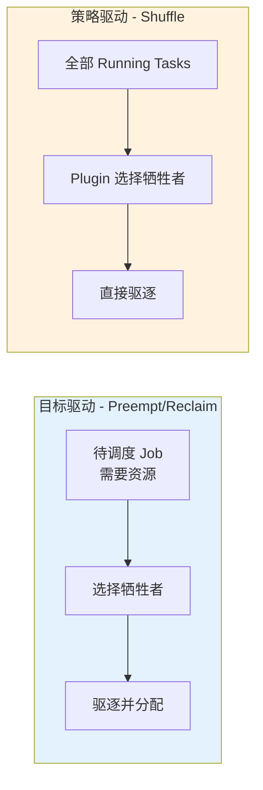
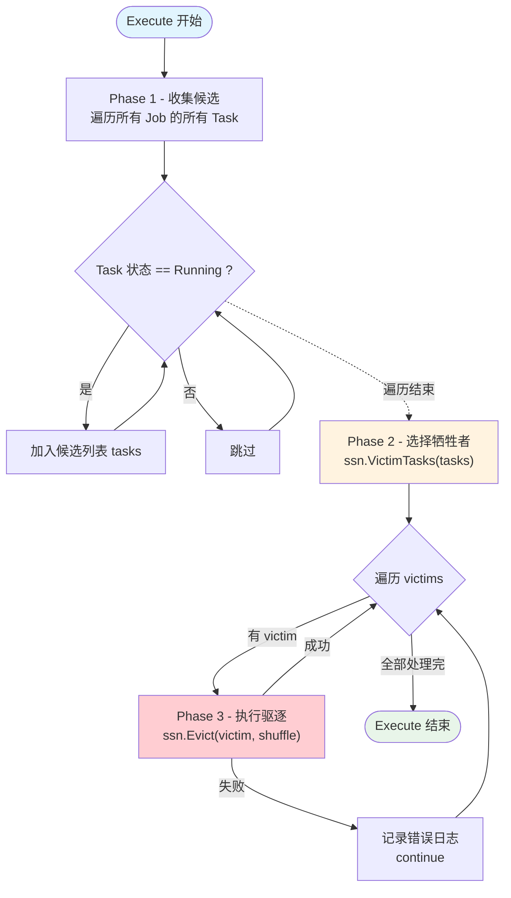
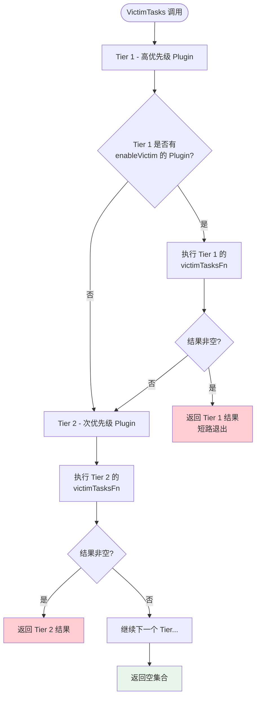

## 概述

Shuffle 是 Volcano 调度器六大 Action 中最简单的一个，全部源码仅约 75 行。与 Allocate、Preempt 等负责资源分配的 Action 不同，Shuffle **只做一件事 -- 驱逐**。它不进行任何资源分配、节点筛选或事务操作，而是将"选择谁被驱逐"的决策完全委托给 Plugin 的 `VictimTasks` 扩展点。

这种设计使 Shuffle 成为一个纯粹的**策略执行器** -- Action 本身无状态、无配置，所有业务逻辑由 Plugin 定义。

> **源码参考**：`pkg/scheduler/actions/shuffle/shuffle.go`

---

## 设计意图

### 为什么需要 Shuffle

Volcano 的其他驱逐机制（Preempt、Reclaim）都是**目标驱动**的 -- 它们为了给某个待调度的 Job 腾出资源而驱逐 Task。Shuffle 则完全不同，它是**策略驱动**的，驱逐行为不与任何新 Job 的分配绑定。



**Shuffle 存在的核心价值**：

- **负载均衡**：当节点负载不均时，通过驱逐高负载节点上的 Task，让调度器在后续周期重新分配到低负载节点
- **SLA 执行**：驱逐超时运行或违反策略的 Task
- **资源整理**：配合 rescheduling Plugin 实现集群资源碎片整理
- **分时复用**：配合 tdm（Time Division Multiplexing）Plugin 实现分时驱逐

---

## Action 结构体

```go
type Action struct{}

func New() *Action       { return &Action{} }
func (shuffle *Action) Name() string { return "shuffle" }
func (shuffle *Action) Initialize()   {}
func (shuffle *Action) UnInitialize() {}
```

结构体**没有任何字段** -- 无配置参数、无内部状态。`Initialize()` 和 `UnInitialize()` 均为空实现。这是所有 Action 中最轻量的设计，体现了 Shuffle 将全部策略逻辑外置到 Plugin 的哲学。

---

## 执行流程

### 整体流程



### 分阶段详解

#### Phase 1 - 收集候选 Task

```go
tasks := make([]*api.TaskInfo, 0)
for _, jobInfo := range ssn.Jobs {
    for _, taskInfo := range jobInfo.Tasks {
        if taskInfo.Status == api.Running {
            tasks = append(tasks, taskInfo)
        }
    }
}
```

遍历 Session 中**所有 Job 的所有 Task**，筛选出状态为 `Running` 的 Task。注意这里没有任何 Job 级别或 Queue 级别的过滤 -- 全量 Running Task 都是候选者。

#### Phase 2 - Plugin 选择牺牲者

```go
victims := ssn.VictimTasks(tasks)
```

将全部候选 Task 传递给 `VictimTasks` 扩展点，由 Plugin 决定哪些 Task 应被驱逐。返回的是一个 `map[*api.TaskInfo]bool` 去重集合。

#### Phase 3 - 执行驱逐

```go
for victim := range victims {
    if err := ssn.Evict(victim, "shuffle"); err != nil {
        klog.Errorf("Failed to evict Task <%s/%s>: %v", victim.Namespace, victim.Name, err)
        continue
    }
}
```

逐个驱逐牺牲者。驱逐失败时记录错误并继续处理下一个，不会回滚已驱逐的 Task。`ssn.Evict()` 内部会将 Task 状态更新为 `Releasing`，并通过 Cache 层触发实际的 Pod 删除。

---

## VictimTasks 扩展点

`VictimTasks` 是 Shuffle 唯一依赖的 Plugin 扩展点。其在 Session 中的实现采用了 **Tier 分层短路**机制：



关键特征：

1. **Tier 分层**：Plugin 按 Tier 分层配置，高 Tier 优先执行
2. **短路机制**：某个 Tier 返回非空结果后，低 Tier 的 Plugin 不再执行
3. **同 Tier 合并**：同一 Tier 内多个 Plugin 的结果取并集（去重）
4. **按需启用**：Plugin 需配置 `enabledVictim: true` 才参与

### 实现 VictimTasks 的 Plugin

| Plugin | 策略描述 |
|--------|----------|
| **tdm** | 分时复用 - 在非工作时段驱逐抢占任务，限制每个 Job 的最大驱逐数 |
| **rescheduling** | 重调度 - 基于 lowNodeUtilization 等策略选择牺牲者，实现负载均衡 |
| **pdb** | PodDisruptionBudget - 从候选集中过滤掉受 PDB 保护的 Task |

Plugin 通过 `ssn.AddVictimTasksFns(name, fns)` 注册牺牲者选择函数，函数签名为：

```go
type VictimTasksFn func(tasks []*api.TaskInfo) []*api.TaskInfo
```

接收全量 Running Task 列表，返回需要驱逐的 Task 子集。

---

## 与其他 Action 的对比

| 特性 | Enqueue | Allocate | Preempt | Reclaim | Backfill | **Shuffle** |
|------|---------|----------|---------|---------|----------|-------------|
| **核心职责** | 入队控制 | 资源分配 | 同 Queue 抢占 | 跨 Queue 回收 | BestEffort 填充 | **策略驱逐** |
| **是否分配资源** | 否 | 是 | 是 | 是 | 是 | **否** |
| **驱逐行为** | 无 | 无 | 有(为新 Job) | 有(为新 Job) | 无 | **有(策略驱动)** |
| **Statement 事务** | 无 | 有 | 有 | 有 | 有 | **无** |
| **代码复杂度** | 中 | 高 | 高 | 高 | 低 | **最低** |
| **依赖的扩展点数** | 4+ | 10+ | 8+ | 8+ | 3+ | **2** |
| **决策主体** | Action+Plugin | Action+Plugin | Action+Plugin | Action+Plugin | Action+Plugin | **Plugin** |

Shuffle 的独特之处在于：它是唯一一个**纯驱逐、无分配**的 Action，也是唯一一个将决策完全委托给 Plugin 的 Action。

---

## 使用场景

### 场景 1 - 集群负载均衡

配合 rescheduling Plugin，当集群中部分节点利用率过高而部分节点空闲时，Shuffle 驱逐高负载节点上的 Task，被驱逐的 Pod 重建后由调度器重新分配到低负载节点。

### 场景 2 - 分时复用

配合 tdm Plugin，在非工作时段自动驱逐占用离线资源的在线任务，或在工作时段驱逐低优先级的离线任务，实现集群资源的分时复用。

### 场景 3 - SLA 执行

自定义 Plugin 检测运行超时的 Task（例如超过 Job 的 maxRuntime），通过 VictimTasksFn 返回这些超时 Task，Shuffle 执行驱逐。

### 场景 4 - PDB 合规过滤

pdb Plugin 作为一个过滤层，确保被选为牺牲者的 Task 不会违反 PodDisruptionBudget 约束，保障服务可用性。

---

## 常见问题

### Q: 如果没有 Plugin 注册 VictimTasksFn，Shuffle 会发生什么？

`ssn.VictimTasks()` 返回空集合，Shuffle 不会驱逐任何 Task。Action 本身不会报错，只是静默完成。因此，如果没有配置相关 Plugin，Shuffle 相当于空操作。

### Q: Shuffle 驱逐的 Task 会立即被重新调度吗？

不一定。`ssn.Evict()` 将 Task 状态设为 `Releasing`，实际的 Pod 删除是异步的。Pod 被删除后，Job Controller 根据 Job 配置决定是否重建 Pod。重建的 Pod 在下一个调度周期由 Allocate Action 重新分配。

### Q: 多个 Plugin 的 VictimTasksFn 返回同一个 Task 怎么办？

Session 内部使用 `map[*api.TaskInfo]bool` 存储结果，自动去重。同一个 Task 不会被驱逐两次。

### Q: Shuffle 与 Preempt 的驱逐有什么本质区别？

Preempt 是**目的性驱逐** -- 先确定有饥饿的 Job 需要资源，再选择牺牲者驱逐并将资源分配给饥饿 Job，整个过程在一个 Statement 事务中完成。Shuffle 是**策略性驱逐** -- 不关联任何新的资源分配，驱逐后资源被释放回集群，等待后续调度周期重新分配。

### Q: Shuffle 在调度流水线中的推荐执行顺序是什么？

通常放在最后执行。典型配置为 `enqueue, allocate, preempt, reclaim, backfill, shuffle`，确保正常的分配和抢占先完成，最后再执行策略性驱逐。

---

## 下一步

- [Allocate Action](./02-allocate-action.md) -- 核心资源分配流程
- [Plugin 系统](../02-scheduler-deep-dive/05-plugin-system.md) -- 了解 VictimTasks 等扩展点的注册和调用机制
