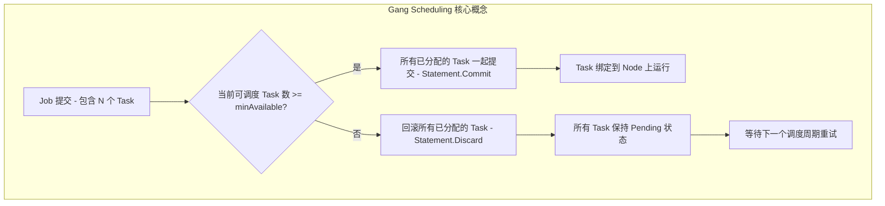
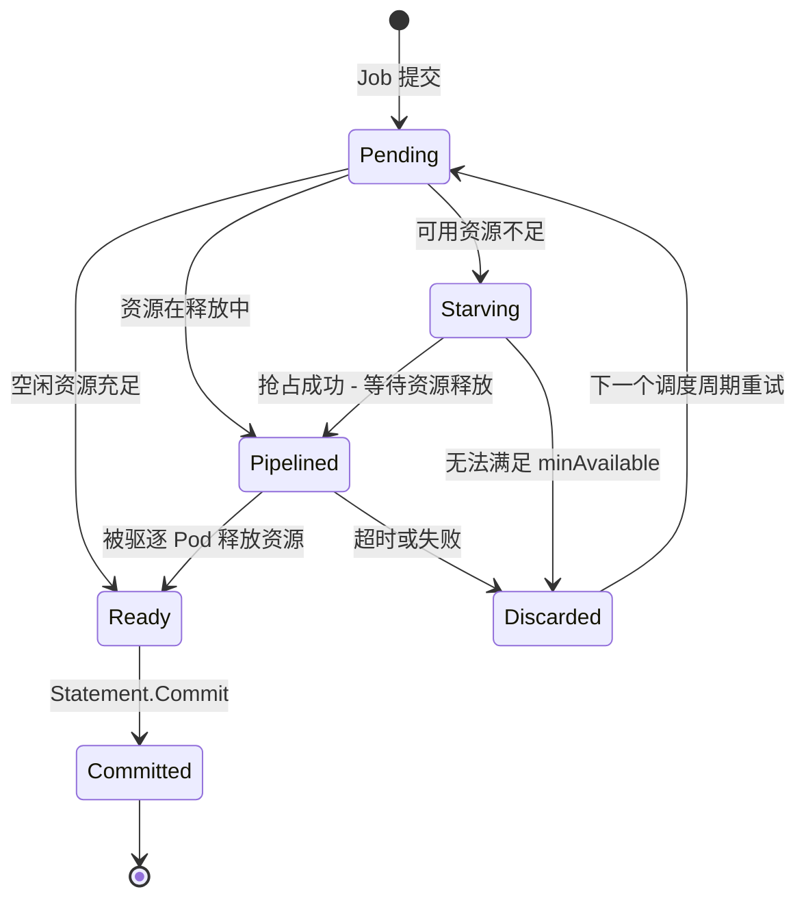
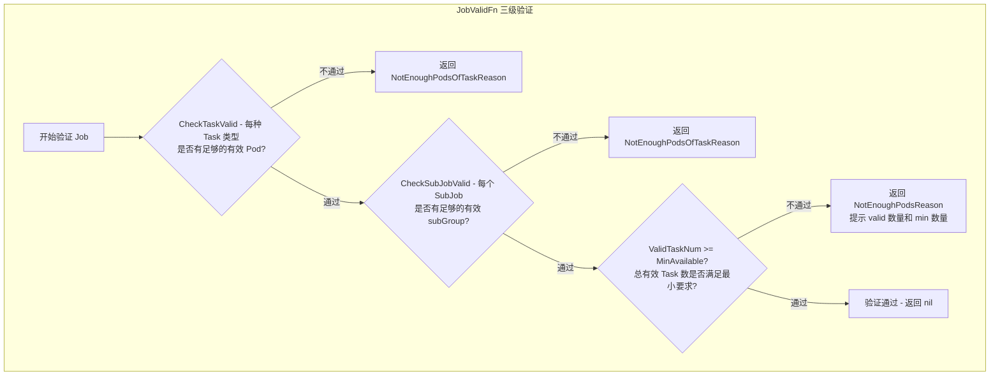
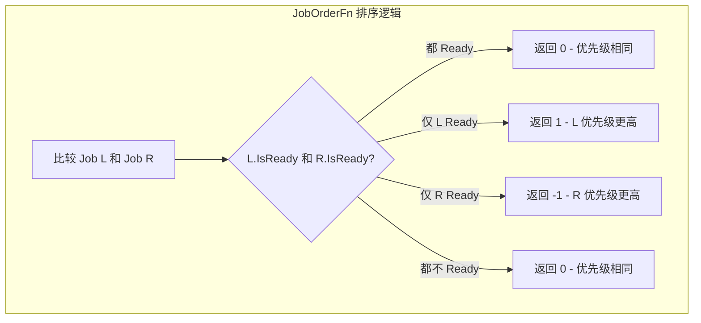
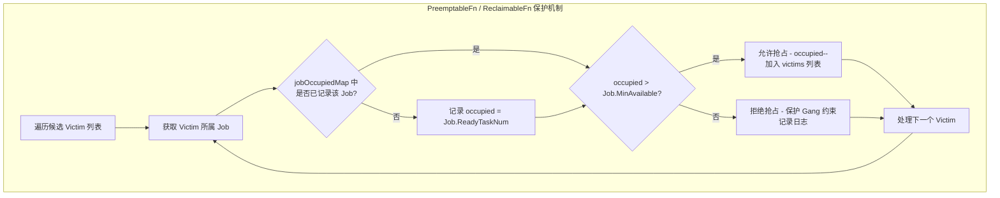
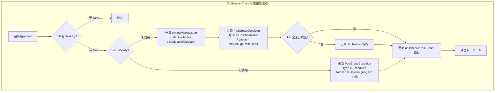

## 1. 概述

Gang Scheduling（组调度）是分布式计算领域中一种经典的调度策略，其核心思想是 **All-or-Nothing** -- 一组任务要么全部同时获得资源并启动，要么全部不调度。这种调度语义对于以下场景至关重要：

- **分布式深度学习训练**：多个 Worker 需要同时启动才能建立通信环（如 NCCL AllReduce），如果只启动部分 Worker，已启动的 Pod 会一直等待其余 Pod，造成资源浪费。
- **MPI 作业**：所有 Rank 必须同时就绪，MPI 程序才能正常初始化。
- **Spark/Flink 批处理**：Driver 和 Executor 之间存在强依赖关系，需要协同启动。

在 Volcano 调度器中，Gang Plugin 是实现这一语义的核心插件。它通过向调度框架注册多个扩展点函数，控制 Job 的验证、排序、就绪判断、抢占保护和状态上报等全流程。

> 源码位置：`pkg/scheduler/plugins/gang/gang.go`（约 283 行）

## 2. Plugin 结构体

```go
type gangPlugin struct {
    pluginArguments framework.Arguments
}
```

Gang Plugin 的结构体非常简洁，仅保留了 `pluginArguments` 字段。值得注意的是，该插件是 **无状态（Stateless）** 的 -- 它不维护任何跨调度周期的内部状态，所有决策都基于当前 Session 中 JobInfo 提供的实时数据。这种设计使得 Gang Plugin 天然具备幂等性，每个调度周期的行为完全独立。

## 3. Gang Scheduling 核心概念

### 3.1 MinAvailable 与 All-or-Nothing

Gang Scheduling 的核心参数是 `minAvailable`（又称 `minMember`），定义在 PodGroup 的 Spec 中。它表示 Job 至少需要多少个 Task 同时被调度，才能视为满足 Gang 约束。



### 3.2 Ready vs Pipelined 状态

Gang Plugin 区分两种 "就绪" 语义：

| 状态 | 判定条件 | 含义 |
|------|----------|------|
| **Ready** | `ReadyTaskNum + PendingBestEffortTaskNum >= MinAvailable` | Task 已被分配到空闲资源上，可以直接绑定 |
| **Pipelined** | `WaitingTaskNum + ReadyTaskNum + PendingBestEffortTaskNum >= MinAvailable` | 部分 Task 正等待被驱逐的 Pod 释放资源，资源在 "管道" 中 |
| **Starving** | `WaitingTaskNum + ReadyTaskNum < MinAvailable` | 即使算上等待中的资源也不够，需要抢占 |



## 4. 注册的扩展点详解

Gang Plugin 在 `OnSessionOpen` 中注册了 9 个扩展点函数，覆盖了调度决策的各个关键环节。

### 4.1 JobValidFn - Job 验证

JobValidFn 在调度开始前验证 Job 是否具备被调度的基本条件。它执行三级验证，任何一级不通过都会阻止 Job 进入调度流程。



核心代码逻辑：

```go
// 第一级：Task 类型级别验证
if valid := job.CheckTaskValid(); !valid {
    return &api.ValidateResult{Pass: false, Reason: NotEnoughPodsOfTaskReason}
}
// 第二级：SubJob 级别验证
if valid := job.CheckSubJobValid(); !valid {
    return &api.ValidateResult{Pass: false, Reason: NotEnoughPodsOfTaskReason}
}
// 第三级：Job 整体验证
if job.ValidTaskNum() < job.MinAvailable {
    return &api.ValidateResult{Pass: false, Reason: NotEnoughPodsReason}
}
```

### 4.2 JobOrderFn - Job 排序

JobOrderFn 实现了 **Ready-First** 排序策略：已经满足 Gang 约束的 Job 优先被调度。这样可以避免资源碎片化 -- 优先完成已接近就绪的 Job，而不是分散资源给多个未就绪的 Job。



**设计考量**：当两个 Job 都未 Ready 时返回 0（相等），表示 Gang Plugin 不对未就绪的 Job 做优先级区分，将排序权交给其他插件（如 Priority Plugin、DRF Plugin）。

### 4.3 PreemptableFn / ReclaimableFn - 抢占保护机制

Gang Plugin 对 Preemption 和 Reclaim 注册了同一个函数，实现 **Gang 保护** -- 只有当被抢占 Job 的已就绪 Task 数严格大于 `minAvailable` 时，才允许多出的 Task 被抢占。这确保了已满足 Gang 约束的 Job 不会因抢占而被破坏。



关键实现细节：

- 使用 `jobOccupiedMap` 跟踪每个 Job 在当前抢占过程中剩余的 Ready Task 数
- 每成功添加一个 Victim，对应 Job 的 `occupied` 计数减 1
- 始终返回 `util.Permit`，表示 Gang Plugin 不阻止整个抢占流程，只是过滤不安全的 Victim

### 4.4 JobReadyFn / JobPipelinedFn - 就绪与管道判断

**JobReadyFn** 综合三个维度判断 Job 是否真正就绪：

```go
ji.CheckTaskReady() && ji.CheckSubJobReady() && ji.IsReady()
```

- `CheckTaskReady()`：每种 Task 类型的就绪 Pod 数满足该类型的 minAvailable
- `CheckSubJobReady()`：每个 SubJob 的就绪状态满足其自身约束
- `IsReady()`：`ReadyTaskNum + PendingBestEffortTaskNum >= MinAvailable`

**JobPipelinedFn** 的判断逻辑类似，但包含了 Waiting 状态的 Task：

```go
ji.CheckTaskPipelined() && ji.CheckSubJobPipelined() && ji.IsPipelined()
```

`IsPipelined()` 的计算公式为 `WaitingTaskNum + ReadyTaskNum + PendingBestEffortTaskNum >= MinAvailable`，即考虑了正在等待资源释放的 Task。

### 4.5 JobStarvingFn - 饥饿检测

JobStarvingFn 判断 Job 是否处于 "饥饿" 状态，即需要通过抢占才能获得足够资源：

```go
func (ji *JobInfo) IsStarving() bool {
    return ji.WaitingTaskNum() + ji.ReadyTaskNum() < ji.MinAvailable
}
```

注意：JobStarvingFn **只关注 `jobMinAvailable`，不关注 `taskMinAvailable`**。这是因为在抢占场景中，决策粒度是 Job 级别的 -- 只要 Job 整体的可用 Task 数不足，就应该触发抢占尝试。

## 5. SubJob 支持

Volcano 支持在一个 Job 内部划分多个 SubJob，每个 SubJob 拥有独立的 minAvailable 约束。Gang Plugin 为 SubJob 提供了对应的扩展点：

| 扩展点 | 功能 | 实现逻辑 |
|--------|------|----------|
| **SubJobOrderFn** | SubJob 排序 | 与 JobOrderFn 相同的 Ready-First 策略 |
| **SubJobReadyFn** | SubJob 就绪判断 | `sji.IsReady()` |
| **SubJobPipelinedFn** | SubJob 管道判断 | `sji.IsPipelined()` 返回 Permit 或 Reject |

SubJob 机制使得更复杂的调度拓扑成为可能。例如，一个分布式训练 Job 可以包含多个 SubJob，每个 SubJob 对应一组参数服务器或一组 Worker，各自有独立的 Gang 约束。

## 6. OnSessionClose - 状态报告

每个调度周期结束时，Gang Plugin 在 `OnSessionClose` 中执行状态报告和指标更新：



`schedulableTaskNum` 的计算逻辑值得关注：它不仅统计已 Ready 的 Task，还会检查处于 Pending 状态但在当前事务中已被分配（`AllocatedStatus`）的 Task，确保指标的准确性。

```go
schedulableTaskNum := func() (num int32) {
    for _, task := range job.TaskStatusIndex[api.Pending] {
        ctx := task.GetTransactionContext()
        if task.LastTransaction != nil {
            ctx = *task.LastTransaction
        }
        if api.AllocatedStatus(ctx.Status) {
            num++
        }
    }
    return num + job.ReadyTaskNum()
}
```

## 7. 与 Statement 的协作 - 实现 All-or-Nothing

Gang Scheduling 的 All-or-Nothing 语义依赖 Gang Plugin 与调度框架的 Statement 机制紧密协作。Statement 充当 "事务" 角色，记录调度周期内的所有分配操作，支持原子性的提交或回滚。

### 7.1 协作流程

整个协作流程可概括如下：

1. **Allocate Action 开始**：为每个 Job 创建一个 Statement
2. **逐个分配 Task**：每次成功分配一个 Task，通过 `stmt.Allocate(task, node)` 记录到 Statement
3. **检查 Gang 约束**：调用 `ssn.JobReady(job)` -- 实际调用 Gang Plugin 的 JobReadyFn
4. **决策分支**：
   - 若 JobReady 返回 true：调用 `stmt.Commit()` 提交所有分配，Task 真正绑定到 Node
   - 若 JobPipelined 返回 true：保留 Statement，等待后续资源释放
   - 若两者都不满足：调用 `stmt.Discard()` 回滚所有已分配的 Task

### 7.2 Statement 的 Discard 操作

```go
func (s *Statement) Discard() {
    // 逆序回滚所有操作
    for i := len(s.operations) - 1; i >= 0; i-- {
        switch op.name {
        case Evict:    s.unevict(op.task)
        case Pipeline: s.UnPipeline(op.task)
        case Allocate: s.unallocate(op.task)
        }
    }
}
```

Discard 以 **逆序** 执行回滚，确保状态的一致性。这与 Gang Plugin 的 JobReadyFn 配合，共同实现了 "不满足 minAvailable 就全部释放" 的语义。

### 7.3 协作时序

```
Allocate Action                    Gang Plugin                 Statement
    |                                  |                           |
    |--- 创建 Statement -------------->|                           |
    |                                  |                           |
    |--- 分配 Task1 ------------------>|                     stmt.Allocate(T1)
    |--- 分配 Task2 ------------------>|                     stmt.Allocate(T2)
    |--- 分配 Task3 ------------------>|                     stmt.Allocate(T3)
    |                                  |                           |
    |--- ssn.JobReady(job) ----------->|                           |
    |                          JobReadyFn 检查                     |
    |                          CheckTaskReady &&                   |
    |                          CheckSubJobReady &&                 |
    |                          IsReady                             |
    |<--- true/false ------------------|                           |
    |                                  |                           |
    |--- [Ready]  stmt.Commit() ------>|                     提交所有分配
    |--- [!Ready] stmt.Discard() ----->|                     回滚所有分配
```

## 8. 常见问题

### Q1: minAvailable 应该设置为多少?

对于分布式训练任务，通常将 `minAvailable` 设置为 Worker 的总数。例如 8 卡训练设置为 8。如果 Job 包含 PS（Parameter Server）和 Worker 两种角色，`minAvailable` 应设为 PS 数 + Worker 数，确保所有角色都能启动。

### Q2: Gang Plugin 是否支持部分调度?

不支持。Gang 的语义就是 All-or-Nothing。如果需要弹性调度（允许部分 Task 先启动），应考虑设置 `minAvailable` 小于总 Task 数，或使用 Elastic 相关特性。

### Q3: 如果集群资源始终不足以满足 minAvailable 会怎样?

Job 会持续处于 Pending 状态。每个调度周期，OnSessionClose 会更新 PodGroupCondition 为 `Unschedulable`，并记录重试指标（`JobRetries`）。管理员可以通过监控 `unschedule_task_count` 和 `unschedule_job_count` 指标发现此类问题。

### Q4: Gang Plugin 如何与 Preemption 配合?

当一个高优先级 Job 处于 Starving 状态时（`JobStarvingFn` 返回 true），Preempt Action 会尝试驱逐低优先级 Job 的 Task。Gang Plugin 的 `PreemptableFn` 确保被抢占 Job 的 Ready Task 数不会低于其 `minAvailable`，防止连锁性的 Gang 约束破坏。

### Q5: Ready 和 Pipelined 的区别在实际调度中有什么影响?

- **Ready**：所有 Task 已分配到空闲资源上，Statement 可以立即 Commit。
- **Pipelined**：部分 Task 的资源来自将被驱逐的 Pod，需要等待这些 Pod 实际释放资源后才能绑定。Pipelined 状态下，Statement 不会被 Commit，但也不会被 Discard，而是保留等待后续处理。

### Q6: SubJob 与 Task 的 minAvailable 有什么区别?

Task 的 minAvailable 定义了每种角色类型需要的最小 Pod 数，而 SubJob 的 minAvailable 定义了 Job 内部一个逻辑分组的最小就绪子组数。SubJob 是更高层次的抽象，用于表达 Job 内部的结构化调度约束。

## 9. 下一步

在理解了 Gang Plugin 的 All-or-Nothing 调度语义后，建议继续阅读以下插件的分析：

- **Proportion Plugin**：实现 Queue 级别的资源公平分配，控制各 Queue 的资源份额，与 Gang 约束共同决定 Job 是否能获得足够资源。
- **DRF (Dominant Resource Fairness) Plugin**：基于主导资源公平性算法进行 Job 间的资源分配排序，与 Gang Plugin 的 JobOrderFn 协同决定调度顺序。
