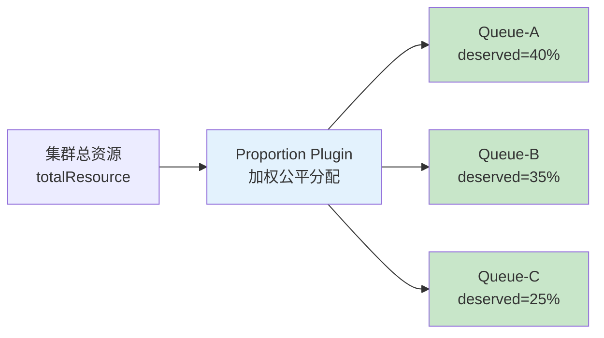
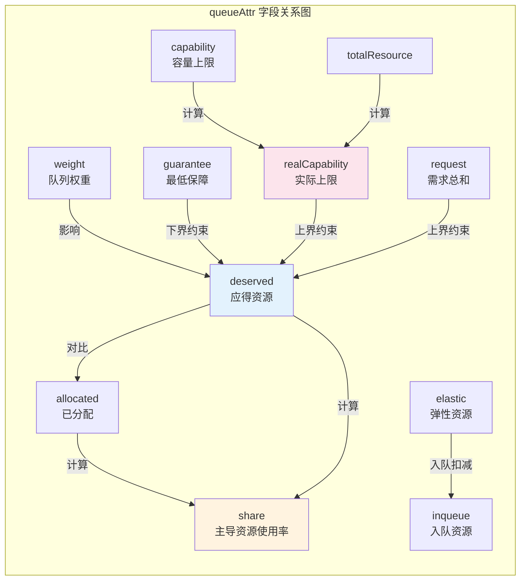
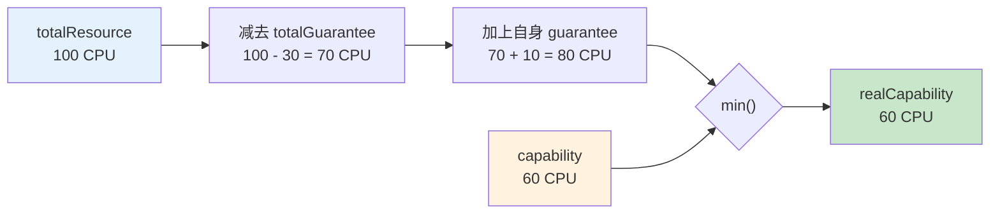
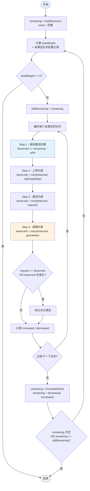
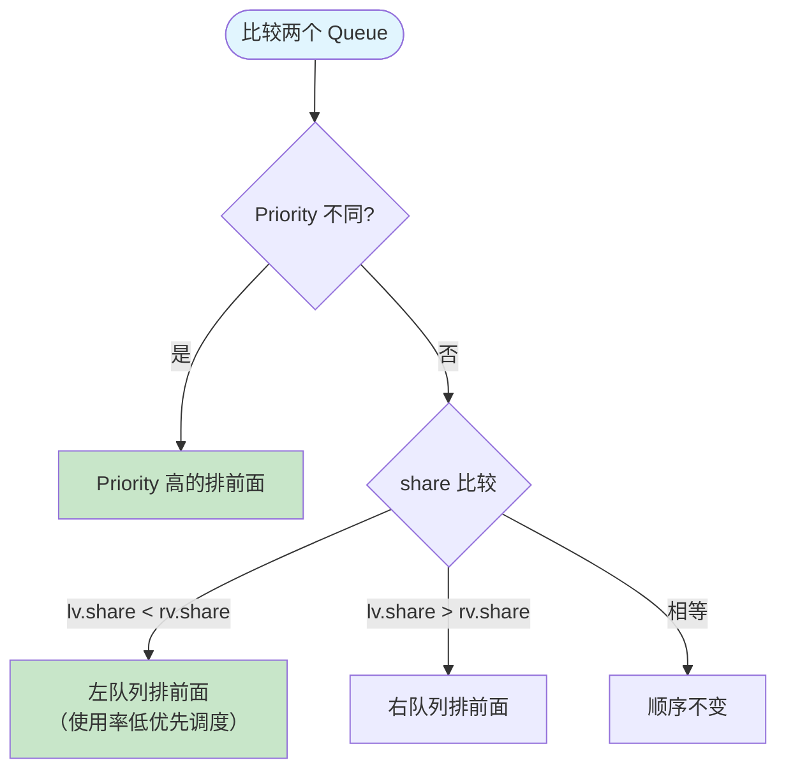
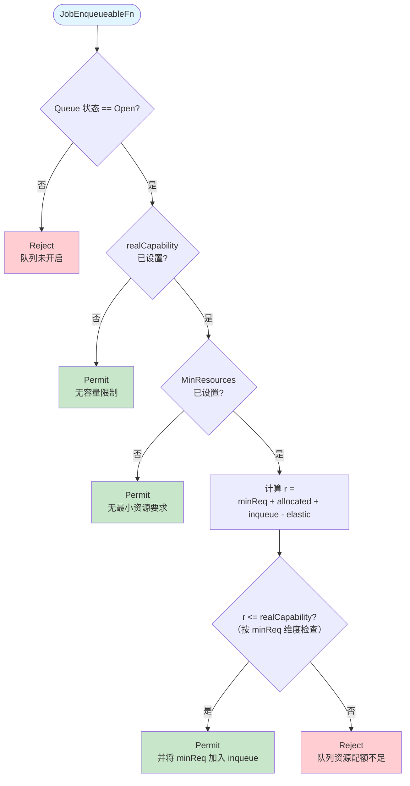
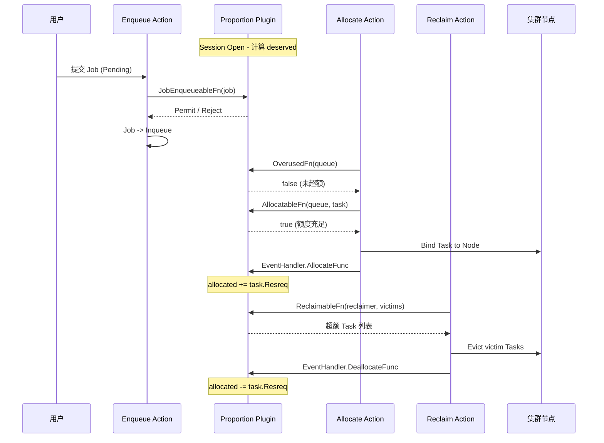
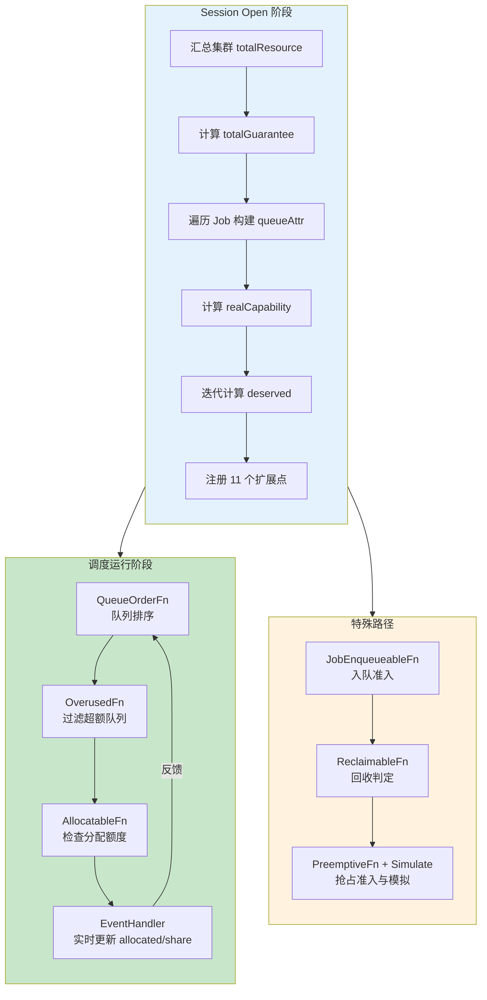

## 概述

Proportion 是 Volcano 调度器中**最核心的队列管理插件**，负责实现队列级别的**加权公平共享**（Weighted Fair-Share）资源分配。它决定了集群中每个 Queue 应该获得多少资源（deserved），以及在调度过程中如何控制资源的分配、回收和抢占。

几乎所有涉及队列资源管控的调度决策都经过 Proportion 插件 -- 它注册了多达 **11 个扩展点**，覆盖了入队、分配、抢占、回收和模拟等全部关键路径。

> **源码参考**：`pkg/scheduler/plugins/proportion/proportion.go`（557 行）



**核心职责**：Deserved 计算（加权迭代公平分配）、队列排序（Priority + share）、分配控制（不超 deserved）、回收判定（超额队列可回收）、入队准入（容量预检）、抢占模拟（CycleState 深拷贝）。

---

## Plugin 结构体与队列属性

### queueAttr - 队列运行时属性

每个参与调度的 Queue 在 Proportion 中维护一份 `queueAttr`，它是整个插件的数据核心：

```go
type queueAttr struct {
    queueID        api.QueueID
    name           string
    weight         int32       // 队列权重，决定资源分配比例
    share          float64     // 主导资源使用率
    deserved       *api.Resource   // 应得资源量（算法计算结果）
    allocated      *api.Resource   // 已分配资源量（实际使用中）
    request        *api.Resource   // 队列中所有 Job 的资源需求总和
    elastic        *api.Resource   // 弹性资源 = sum(job.allocated - job.minAvailable)
    inqueue        *api.Resource   // 已入队 Job 的资源需求
    capability     *api.Resource   // 队列容量上限（用户配置）
    realCapability *api.Resource   // 实际容量上限（受 guarantee 修正）
    guarantee      *api.Resource   // 最低保障资源（用户配置）
}
```



| 字段 | 来源 | 含义 |
|------|------|------|
| `weight` | Queue Spec | 调度权重，数值越大分配的资源比例越高 |
| `deserved` | 算法计算 | 队列应得的资源上限，由迭代算法每轮计算 |
| `allocated` | 实时追踪 | 队列中所有 Running Pod 实际占用的资源 |
| `request` | Job 聚合 | 队列中所有 Job（Allocated + Pending Task）的资源需求总和 |
| `elastic` | Job 聚合 | 各 Job 的弹性资源之和，即 `job.allocated - job.minAvailable` |
| `inqueue` | 入队追踪 | 已处于 Inqueue 或 Running 状态 Job 的最小资源需求 |
| `capability` | Queue Spec | 用户配置的队列资源硬上限 |
| `realCapability` | 算法计算 | 考虑 guarantee 后的实际上限，`<= capability` |
| `guarantee` | Queue Spec | 用户配置的队列最低保障资源 |
| `share` | 算法计算 | 主导资源使用率 = max(allocated[r]/deserved[r]) |

---

## realCapability 计算

`realCapability` 是对用户配置 `capability` 的修正，确保 guarantee 机制正确生效。

**公式**：`realCapability = min(capability, totalResource - totalGuarantee + guarantee)`

`totalResource - totalGuarantee` 是扣除所有队列保障资源后的**可竞争资源**。当前队列可用上限 = 可竞争资源 + 自己的保障资源，再与 `capability` 取较小值。



**数值示例**（集群 100 CPU，totalGuarantee = 30 CPU）：

| Queue | guarantee | capability | realCapability |
|-------|-----------|------------|----------------|
| A | 10 CPU | 60 CPU | min(60, 80) = **60 CPU** |
| B | 10 CPU | 无限制 | **80 CPU** |
| C | 10 CPU | 50 CPU | min(50, 80) = **50 CPU** |

> 当 Queue 未设置 `capability` 时，`realCapability` 直接等于 `totalResource - totalGuarantee + guarantee`。

---

## Deserved 计算算法

这是 Proportion 插件的**核心算法**，采用迭代式加权公平分配。每轮迭代将剩余资源按权重比例分配给尚未满足的队列，直到所有队列都被满足或资源耗尽。

### 算法流程图



每轮四步处理：**加权分配 -> 容量上界截断 -> 需求上界截断 -> 保障下界提升**。满足条件的队列退出迭代，其未消耗的资源在下一轮重新分配。

### 迭代示例

集群 **100 CPU**，三个队列（无 guarantee，realCapability = 100）：

| Queue | weight | request |
|-------|--------|---------|
| A | 2 | 80 CPU |
| B | 3 | 15 CPU |
| C | 5 | 200 CPU |

**第 1 轮**：remaining = 100, totalWeight = 10

| Queue | 加权份额 | req 约束后 | 满足? |
|-------|----------|-----------|-------|
| A | 20 | 20 | 否 |
| B | 30 | **15** | 是 |
| C | 50 | 50 | 否 |

increased = 85, remaining = ExceededPart(100, 85) = **15**

**第 2 轮**：remaining = 15, totalWeight = 7（仅 A=2, C=5）

| Queue | 加权份额 | 累加后 deserved |
|-------|----------|----------------|
| A | 15*2/7 = 4.29 | **24.29** |
| C | 15*5/7 = 10.71 | **60.71** |

remaining = 0，算法结束。最终：**A=24.29, B=15, C=60.71**。B 未使用的 15 CPU 按权重重新分配给了 A 和 C。

**关键设计点**：

1. **迭代收敛**：每轮至少有一个队列被标记为 meet 或 remaining 不变，保证算法必定终止
2. **按维度独立计算**：`MinDimensionResource` 和 `ExceededPart` 都是逐维度（CPU/Memory/GPU）操作，保证每种资源独立满足约束
3. **guarantee 是下界**：即使队列没有任何 request，deserved 也不会低于 guarantee
4. **剩余资源回收**：当一个队列被 request 或 capability 截断后，多余的资源通过 decreased 回流到 remaining 池，在下一轮迭代中重新分配

---

## Share 计算与队列排序

Share 代表队列的**主导资源使用率**：`share = max(allocated[r] / deserved[r])`，取所有资源维度中使用率最高的值。边界处理：`deserved=0 && allocated=0` 时 share=0；`deserved=0 && allocated>0` 时 share=1。

- **share < 1**：队列未用满额度，可继续分配
- **share >= 1**：队列已满或超额

**QueueOrderFn** 采用两级排序：



**在同等优先级下，资源使用率越低的队列越优先得到资源**，这是公平调度的核心保障。

---

## 注册的扩展点详解

### OverusedFn 与 AllocatableFn - 分配路径控制

**OverusedFn**（L300-312）：当 `deserved <= allocated` 时返回 true，Allocate Action 会跳过该队列中的所有 Job。

```go
overused := attr.deserved.LessEqual(attr.allocated, api.Zero)
```

**AllocatableFn**（L314-333）：检查两个条件 -- 队列处于 Open 状态，且 `allocated + task.Resreq <= deserved`：

```go
futureUsed := attr.allocated.Clone().Add(candidate.Resreq)
allocatable, _ := futureUsed.LessEqualWithDimensionAndResourcesName(attr.deserved, candidate.Resreq)
```

关键细节：`LessEqualWithDimensionAndResourcesName` 只检查 Task 请求的资源维度，避免不相关维度阻塞调度（如 GPU Task 不会因 Memory 超额被拒绝）。

### ReclaimableFn 与 PreemptiveFn - 回收/抢占路径

**ReclaimableFn**（L278-298）：遍历候选被回收 Task，只从 `allocated > deserved` 的队列中回收。每回收一个 Task 更新模拟 allocated，确保不会过度回收到 deserved 以下：

```go
if !allocated.LessEqual(attr.deserved, api.Zero) {
    allocated.Sub(reclaimee.Resreq)
    victims = append(victims, reclaimee)
}
```

**PreemptiveFn**（L357-361）：复用 `queueAllocatable` 逻辑，只有当队列还有 deserved 额度时才允许通过抢占获取资源。

### JobEnqueueableFn - 入队准入判定

决定 Pending Job 能否进入 Inqueue 状态，是最复杂的扩展点之一。



核心公式 `r = minReq + allocated + inqueue - elastic` 估算「如果这个 Job 入队，队列最终需要的最小资源总量」。减去 elastic 是因为已有 Job 的弹性部分可以收缩释放。

### EventHandler - 分配/释放事件追踪

每当 Allocate/Reclaim/Preempt 执行一个 Task 的分配或释放时，EventHandler 立刻更新对应队列的 `allocated` 和 `share`。这保证同一调度周期内后续决策基于最新状态。

```go
AllocateFunc:   attr.allocated.Add(event.Task.Resreq); pp.updateShare(attr)
DeallocateFunc: attr.allocated.Sub(event.Task.Resreq); pp.updateShare(attr)
```

### 模拟函数 - Simulate 系列

Preempt Action 需要**模拟**资源变化而不污染真实状态。Proportion 通过 CycleState 机制支持：

1. **PrePredicateFn**：将所有 queueAttr 深拷贝到 Task 的 CycleState
2. **SimulateAllocatableFn**：从 CycleState 克隆状态检查分配额度
3. **SimulateAddTaskFn / SimulateRemoveTaskFn**：在克隆状态上模拟 allocated 增减

每个待调度 Task 有独立的模拟空间，互不影响。这种设计使得 Preempt Action 可以安全地回答「如果抢占某些 Task，目标 Task 能否被调度」的问题。

---

## 资源流转全景图





---

## 常见问题

### Q1 - Deserved 和 Allocated 的区别？

**Deserved** 是算法计算的「应得额度」，**Allocated** 是实际占用量。`allocated < deserved` 可继续分配；`allocated > deserved` 可能被回收。

### Q2 - weight 如何影响资源分配？

weight 决定迭代算法中每轮分配比例。A(weight=1) 和 B(weight=3) 无其他约束时，B 的 deserved 是 A 的 3 倍。但如果 B 的 request 很小，多余的 deserved 会在后续迭代中重新分配给 A。

### Q3 - guarantee 和 capability 同时设置时的行为？

`guarantee` 是 deserved 的下界，`capability`（通过 realCapability）是上界。当 `guarantee > capability` 时 guarantee 生效（Step 4 后于 Step 2），但这属于不合理配置。

### Q4 - 为什么 AllocatableFn 只检查 Task 请求的资源维度？

避免不相关维度干扰。例如 GPU 训练任务只请求 GPU 和少量 CPU，即使队列 Memory 维度已超过 deserved，也不应阻止该任务调度。

### Q5 - elastic 资源在入队检查中的作用？

elastic 代表已运行 Job 中可弹性收缩的部分。入队公式减去 elastic 意味着这部分资源可被释放给新 Job，避免过于保守地拒绝入队。

### Q6 - 模拟函数为什么需要深拷贝？

Preempt Action 评估抢占方案时的「假设」不能污染真实状态。CycleState 深拷贝机制确保每个待调度 Task 有独立模拟空间。

### Q7 - 迭代算法为什么能保证收敛？

每轮至少有一个队列加入 meet 集合，或 remaining 不变/为空。队列数量有限且 remaining 单调不增，算法必在有限轮次内终止。

---

## 下一步

- [Gang Plugin 详解](./01-gang-plugin.md) - All-or-Nothing 成组调度
- [DRF Plugin 详解](./03-drf-plugin.md) - Job 级别的 Dominant Resource Fairness
- [Capacity Plugin 详解](./04-capacity-plugin.md) - 层级队列的容量管理
- [Allocate Action 详解](../03-actions-analysis/02-allocate-action.md) - Proportion 扩展点如何被 Action 调用
- [Reclaim Action 详解](../03-actions-analysis/05-reclaim-action.md) - 资源回收流程
