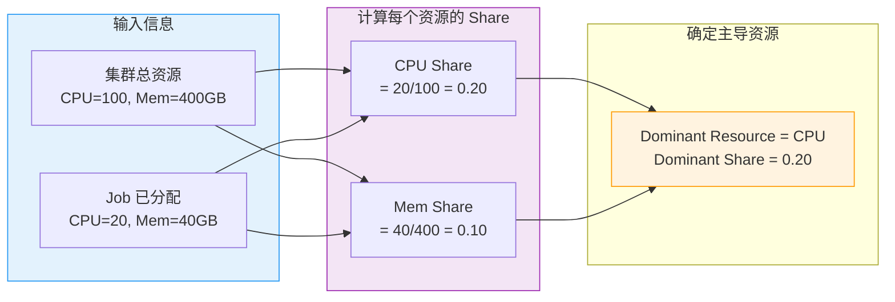
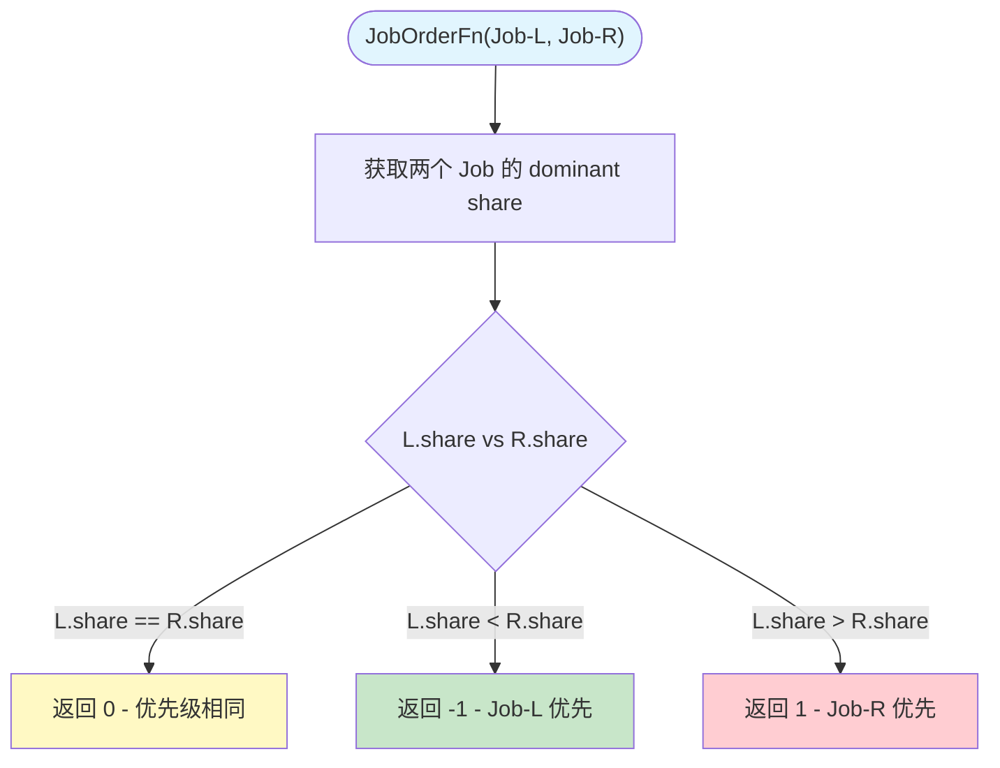
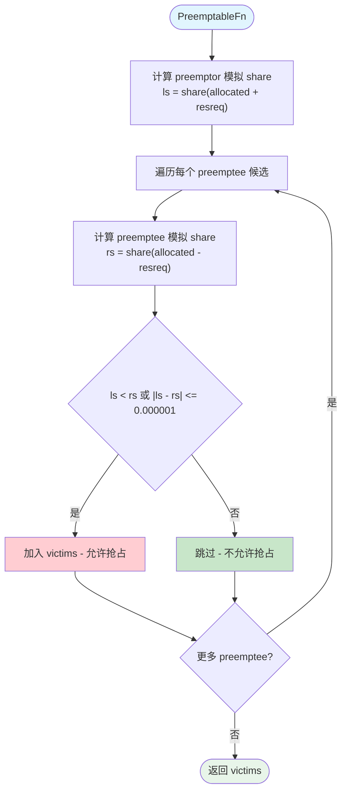
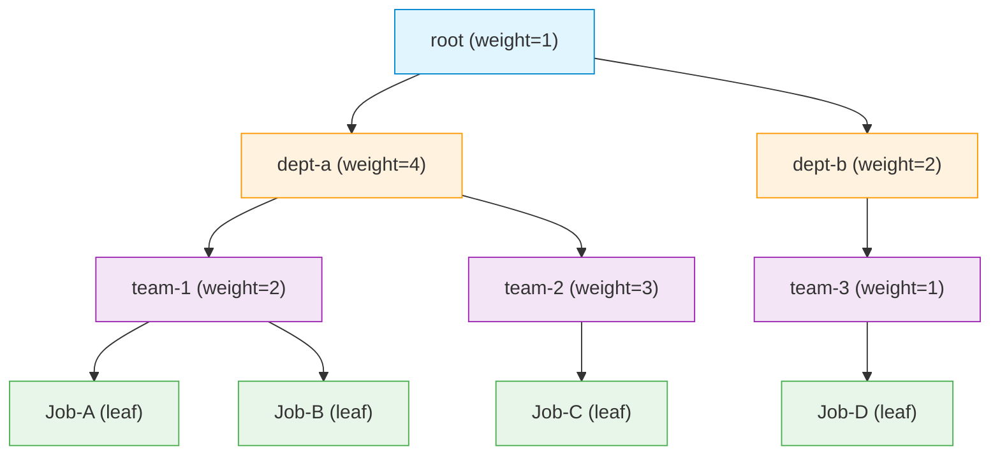
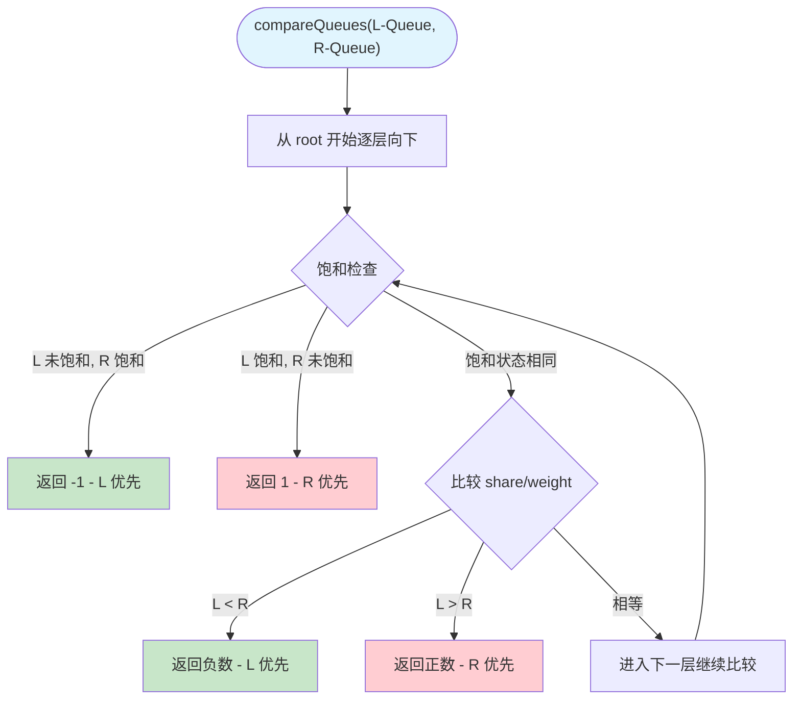
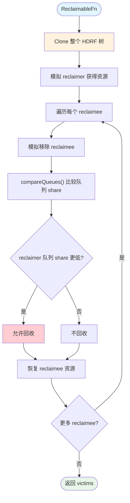
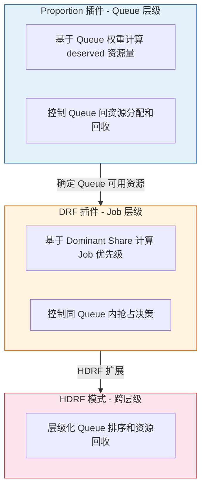

## 概述

DRF（Dominant Resource Fairness）是 Volcano 调度器中负责**多资源公平调度**的核心插件。其理论基础源自 UC Berkeley 在 NSDI 2011 发表的论文 *"Dominant Resource Fairness: Fair Allocation of Multiple Resource Types"*，由 Ali Ghodsi 等人提出。

在多维资源（CPU、Memory、GPU 等）共存的场景下，不同 Job 的资源需求模式差异巨大 -- 训练任务是 GPU 密集型、数据预处理是 CPU 密集型、ETL 任务是 Memory 密集型。DRF 的核心思想是：**识别每个 Job 的"主导资源"（dominant resource），即其在所有资源维度中占比最高的资源类型，然后基于主导资源份额进行公平调度。**

Volcano 的 DRF 插件在标准 DRF 基础上扩展支持 **HDRF（Hierarchical DRF）** 模式，将队列组织为层级树形结构，在多级队列间实现公平性。

> **源码参考**：`pkg/scheduler/plugins/drf/drf.go`（557 行）

---

## Plugin 结构体

```go
type drfPlugin struct {
    totalResource  *api.Resource       // 集群总可分配资源
    totalAllocated *api.Resource       // 集群总已分配资源（HDRF 模式下使用）
    jobAttrs       map[api.JobID]*drfAttr      // 每个 Job 的 DRF 属性
    namespaceOpts  map[string]*drfAttr          // 每个 Namespace 的 DRF 属性
    hierarchicalRoot *hierarchicalNode          // HDRF 层级树根节点
    pluginArguments  framework.Arguments        // 插件配置参数
}

type drfAttr struct {
    share            float64       // 主导资源份额（dominant share）
    dominantResource string        // 主导资源类型名称（如 "cpu"、"memory"）
    allocated        *api.Resource // 当前已分配的资源量
}
```

在每个调度周期的 `OnSessionOpen()` 中，插件遍历所有 Job，统计已处于 Allocated 状态的 Task 资源总量，计算初始 dominant share 并注册到 `jobAttrs`。

---

## DRF 算法原理

DRF 算法将多维资源公平性问题归结为单一指标比较：对每个 Job 计算各资源维度占用比例，取最大值作为 **主导份额（dominant share）**，调度时优先服务主导份额最低的 Job。



**具体示例** -- 集群总资源 CPU=100 核，Memory=400GB：

| Job | 已分配 CPU | 已分配 Memory | CPU Share | Mem Share | Dominant Resource | Dominant Share |
|-----|-----------|--------------|-----------|-----------|-------------------|---------------|
| Job-A | 30 | 40GB | 0.30 | 0.10 | CPU | **0.30** |
| Job-B | 10 | 200GB | 0.10 | 0.50 | Memory | **0.50** |
| Job-C | 20 | 80GB | 0.20 | 0.20 | CPU/Memory | **0.20** |

**调度优先级**：Job-C (0.20) > Job-A (0.30) > Job-B (0.50)。主导份额越低，获得资源越少，调度优先级越高。

---

## Dominant Share 计算

`calculateShare()` 是 DRF 插件的数学核心：

```go
func (drf *drfPlugin) calculateShare(allocated, totalResource *api.Resource) (string, float64) {
    res := float64(0)
    dominantResource := ""
    for _, rn := range totalResource.ResourceNames() {
        share := helpers.Share(allocated.Get(rn), totalResource.Get(rn))
        if share > res {
            res = share
            dominantResource = string(rn)
        }
    }
    return dominantResource, res
}
```

底层 `helpers.Share()` 处理除零保护：总量为 0 且分配为 0 时返回 0，否则返回 1（视为饱和）。

**计算公式**：

```
share(r) = allocated(r) / total(r)
dominant_share = max{ share(r) | r in all_resources }
```

---

## JobOrderFn - 基于 DRF 的 Job 排序

DRF 注册的 `JobOrderFn` 决定同一 Queue 中 Job 的调度优先级。**dominant share 越小的 Job 优先级越高**：

```go
jobOrderFn := func(l interface{}, r interface{}) int {
    lv := l.(*api.JobInfo)
    rv := r.(*api.JobInfo)
    if drf.jobAttrs[lv.UID].share == drf.jobAttrs[rv.UID].share { return 0 }
    if drf.jobAttrs[lv.UID].share < drf.jobAttrs[rv.UID].share { return -1 }
    return 1
}
```



排序是**动态的** -- 每次分配资源后 EventHandler 会更新 dominant share，下一轮排序结果可能变化。

---

## PreemptableFn - 基于 DRF 的抢占决策

核心原则：**只有当抢占者获得资源后的 dominant share 不超过被抢占者失去资源后的 dominant share 时，抢占才被允许。**

```go
// 模拟抢占者获得资源
lalloc := latt.allocated.Clone().Add(preemptor.Resreq)
_, ls := drf.calculateShare(lalloc, drf.totalResource)

// 模拟被抢占者失去资源
ralloc := allocations[preemptee.Job].Sub(preemptee.Resreq)
_, rs := drf.calculateShare(ralloc, drf.totalResource)

if ls < rs || math.Abs(ls-rs) <= shareDelta {  // shareDelta = 0.000001
    addVictim(preemptee)
}
```



`shareDelta = 0.000001` 是浮点数比较容差，避免精度问题导致的调度抖动。`allocations` map 中的 `Sub()` 是累积的 -- 同一 Job 的多个候选 Task 会基于前面 Task 已被移除后的状态计算。

---

## HDRF 层级调度

当配置 `plugin.EnabledHierarchy = true` 时，DRF 进入 HDRF 模式，将队列组织为树形层级结构。

### 树形结构



通过 Queue Annotation 配置层级路径和权重：

```yaml
apiVersion: scheduling.volcano.sh/v1beta1
kind: Queue
metadata:
  name: team-1-queue
  annotations:
    volcano.sh/hierarchy: "root/dept-a/team-1"
    volcano.sh/hierarchy-weights: "1/4/2"
```

`hierarchicalNode` 结构体中，`children == nil` 表示叶子节点（Job），内部节点代表队列层级。每个节点持有 `weight`（权重）、`saturated`（饱和标志）和 `attr`（DRF 属性）。

### updateHierarchicalShare - 递归更新份额

HDRF 核心计算逻辑，自底向上递归更新每个节点的 share：

- **叶子节点**：检查饱和状态（`allocated >= request` 对任意资源成立则饱和）
- **内部节点**：计算非饱和子节点中的最小主导资源份额（mdr），按 `mdr / child.share` 缩放子节点 allocated 后累加

```
mdr = min{ calculateShare(child.allocated) | non-saturated children }
parent.allocated = sum(child.allocated * mdr/child.share)  // 非饱和
                 + sum(child.allocated)                     // 饱和（不缩放）
```

缩放将不同份额的子节点归一化到同一基准，确保层级间公平性传递。

### compareQueues - 队列优先级比较

从根到叶逐层比较两个队列的 `share/weight` 比值：



除以权重后的 share 反映"相对于应得份额的实际使用率"，确保权重大的节点被允许使用更多资源。

### 饱和检测

`resourceSaturated()` 在两种情况下返回 true：

1. 某资源的分配量已达到或超过请求量（`allocated >= request`）
2. 集群中某资源已完全耗尽（不在 `demandingResources` 中），但该 Job 仍需要

饱和节点在 HDRF 比较中优先级降到最低，确保资源优先流向仍有需求的 Job。

### ReclaimableFn - HDRF 模式下的资源回收

仅在 HDRF 模式下注册，通过**克隆-模拟-比较**三步流程实现回收决策：



关键设计：深拷贝隔离保证模拟不影响真实状态；逐个模拟后立即恢复，不影响后续候选；比较的是**队列级别**的 HDRF share（区别于 PreemptableFn 的 Job 级别）。

---

## EventHandler 实时追踪

DRF 通过 `EventHandler` 实时追踪资源分配/释放，保持 dominant share 与实际状态一致：

- **AllocateFunc**：`attr.allocated.Add(resreq)` -> `updateShare()` -> 更新 Prometheus 指标 -> HDRF 树更新（如启用）
- **DeallocateFunc**：对称逆操作，`attr.allocated.Sub(resreq)` -> 更新 share 和指标

两者都包含**孤儿 Task 保护** -- 在 PodGroup 快速删除或 Controller 重启场景下，Task 的 Job 可能已不在 Session 中，EventHandler 会检测并安全跳过。

---

## 与 Proportion 插件的协作关系



| 维度 | Proportion | DRF |
|------|-----------|-----|
| **作用层级** | Queue 之间 | Job 之间 / Queue 之间（HDRF） |
| **公平性指标** | Queue 权重配额 | 主导资源份额 |
| **排序函数** | QueueOrderFn | JobOrderFn + QueueOrderFn（HDRF） |
| **抢占控制** | ReclaimableFn（跨 Queue） | PreemptableFn（同 Queue）+ ReclaimableFn（HDRF） |
| **典型场景** | 多租户资源隔离 | 同 Queue 多 Job 公平调度 |

**协作模式**：Proportion 负责 Queue 级别资源准入，DRF 负责 Queue 内部 Job 排序和抢占。两者共同构成两级公平性保障。

---

## 注册的扩展点总结

| 扩展点 | 注册条件 | 功能 |
|--------|---------|------|
| `JobOrderFn` | 始终注册 | 按 dominant share 升序排列 Job |
| `PreemptableFn` | 始终注册 | 基于 share 对比判定抢占合理性 |
| `QueueOrderFn` | 仅 HDRF 模式 | 按层级树 share/weight 排列 Queue |
| `ReclaimableFn` | 仅 HDRF 模式 | 基于 HDRF 树模拟判定回收合理性 |
| `EventHandler` | 始终注册 | 实时追踪资源分配/释放，更新 share |

---

## 常见问题

### Q1 - DRF 只考虑 CPU 和 Memory 吗？

不是。DRF 遍历 `totalResource.ResourceNames()` 返回的所有资源类型，包括 GPU（`nvidia.com/gpu`）及任何 Extended Resource。

### Q2 - shareDelta 为什么设置为 0.000001？

浮点数比较容差值。资源量除法可能产生精度误差，`shareDelta` 确保差距在百万分之一以内时视为相等，避免调度抖动。

### Q3 - HDRF 中权重最小值为什么是 1？

权重用作 `share/weight` 的除数，为 0 或负数会导致除零错误。`buildHierarchy()` 将小于 1 的权重强制设为 1 以保证数学安全性。

### Q4 - DRF 和 Gang 调度如何配合？

DRF 的 JobOrderFn 决定"先调度谁"，Gang 的 JobValidFn 决定"能否调度"。dominant share 低的 Job 先被尝试，但不满足 Gang 约束（minAvailable）仍会被跳过。两者互不冲突。

### Q5 - HDRF 模式下饱和节点为什么优先级最低？

饱和表示某资源维度已达上限或集群中已耗尽。继续为饱和 Job 分配不会带来有效收益，将其优先级降到最低确保资源优先流向有实际需求的 Job。

### Q6 - OnSessionClose 会清理哪些数据？

重置 `totalResource`、`totalAllocated`、`jobAttrs` 三个核心状态。`hierarchicalRoot` 未在此重置，会在下一周期的 `OnSessionOpen()` 中通过 `buildHierarchy()` 重建。

---

## 下一步

- 前一篇：[02 - Gang Plugin 详解](./02-gang-plugin.md) -- Gang 调度的全有或全无策略
- 后一篇：[04 - Proportion Plugin 详解](./04-proportion-plugin.md) -- Queue 级别的资源配额与公平分配
- 相关参考：[HDRF 设计文档](../hdrf.md) -- Hierarchical DRF 的原始设计提案
- 相关参考：[DRF 设计文档](../drf.md) -- DRF 的原始设计提案
