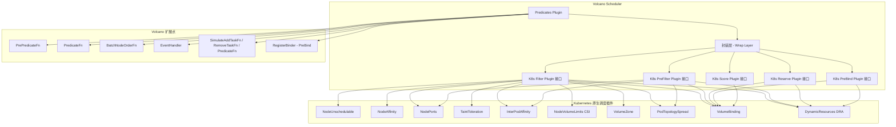
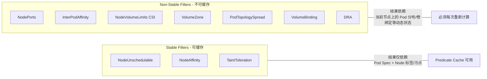
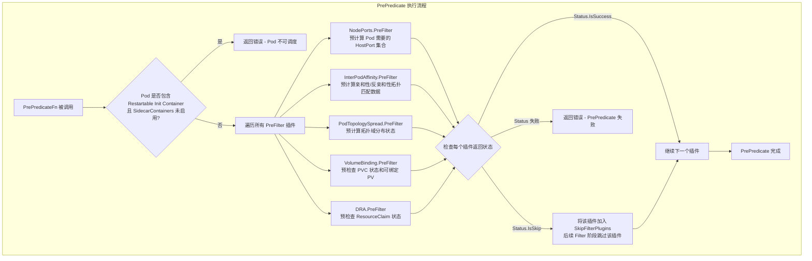
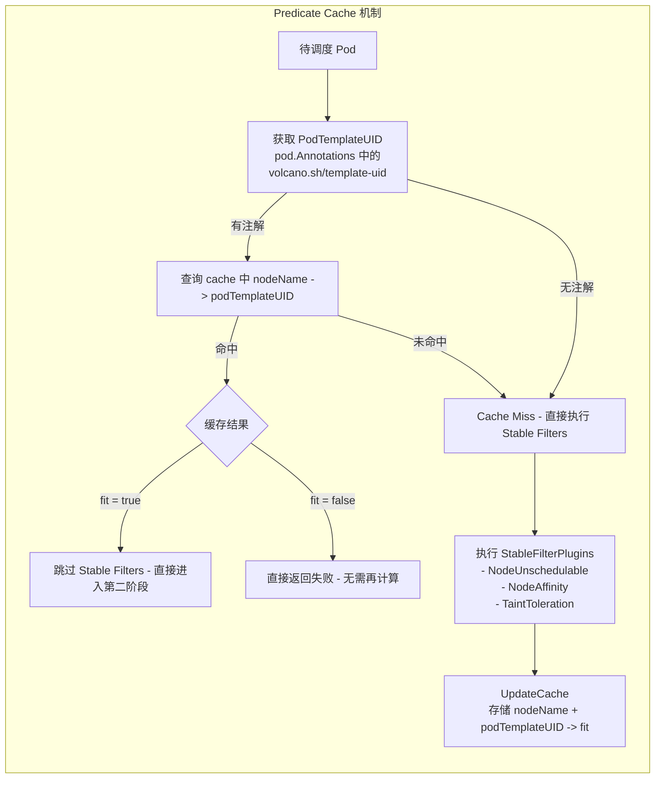
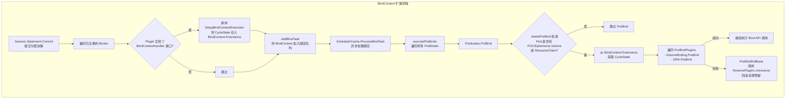

## 1. 概述

Predicates Plugin 是 Volcano 调度器中**最重要的节点过滤插件**，它的核心职责是将 Kubernetes 原生调度框架中的 Filter/PreFilter/Reserve/PreBind/Score 扩展点**封装（Wrap）**到 Volcano 的调度管线中，确保 Volcano 在进行批调度时仍然遵守 Kubernetes 的标准节点约束规则。

与 Gang Plugin（控制 Job 级别语义）、Proportion Plugin（控制 Queue 级别份额）不同，Predicates Plugin 工作在**节点-Pod 匹配层**，逐个判断每个 Task 能否被放置到某个 Node 上。它解决了一个关键问题：**如何让 Volcano 的自定义调度器与 Kubernetes 的原生调度能力保持兼容？**

### 1.1 设计动机

Kubernetes 默认调度器（kube-scheduler）内置了丰富的节点过滤逻辑：节点亲和性（Node Affinity）、污点容忍（Taint Toleration）、端口冲突检测（Node Ports）、卷绑定（Volume Binding）等。Volcano 作为独立的调度器，如果从零实现这些逻辑，不仅工作量巨大，还容易出现行为不一致。因此 Predicates Plugin 采取了**直接复用 K8s 调度框架插件**的策略：



> 源码位置：
> - 主文件：`pkg/scheduler/plugins/predicates/predicates.go`（约 815 行）
> - 缓存机制：`pkg/scheduler/plugins/predicates/cache.go`（约 89 行）
> - 参数辅助：`pkg/scheduler/plugins/predicates/helper.go`（约 134 行）

## 2. 核心结构体

### 2.1 PredicatesPlugin

```go
type PredicatesPlugin struct {
    pluginArguments framework.Arguments      // 从 Scheduler ConfigMap 传入的参数
    enabledPredicates predicateEnable         // 各 predicate 的开关控制
    features feature.Features                 // K8s Feature Gate 特性状态

    FilterPlugins       map[string]k8sframework.FilterPlugin      // 全部 Filter 插件
    StableFilterPlugins map[string]k8sframework.FilterPlugin      // 可缓存的 Stable Filter 子集
    PrefilterPlugins    map[string]k8sframework.PreFilterPlugin   // PreFilter 插件
    ReservePlugins      map[string]k8sframework.ReservePlugin     // Reserve 插件
    PreBindPlugins      map[string]k8sframework.PreBindPlugin     // PreBind 插件
    ScorePlugins        map[string]nodescore.BaseScorePlugin      // Score 插件
    ScoreWeights        map[string]int                            // Score 权重

    PredicateCache      *predicateCache                           // Predicate 缓存（可选）
    Handle              k8sframework.Handle                       // K8s Framework Handle
}
```

核心设计要点：

| 字段 | 用途 | 说明 |
|------|------|------|
| `FilterPlugins` | 存储所有已启用的 Filter 插件 | 每个调度周期逐节点运行 Filter 函数 |
| `StableFilterPlugins` | `FilterPlugins` 的子集 | 仅包含结果**只依赖 Pod Spec 和 Node 标签/污点**的插件，可安全缓存 |
| `PrefilterPlugins` | 存储需要 PreFilter 的插件 | 在遍历节点之前执行一次，预计算全局状态 |
| `ReservePlugins` | 存储 Reserve 插件 | 在 Task 分配到 Node 时执行资源预留 |
| `PreBindPlugins` | 存储 PreBind 插件 | 在实际 Bind 之前执行（如卷绑定、DRA 资源声明） |
| `ScorePlugins` | 存储 Score 插件 | 对节点进行评分排序 |
| `PredicateCache` | Predicate 结果缓存 | 利用 PodTemplate 等价类避免重复过滤计算 |
| `Handle` | K8s Framework Handle | 提供 NodeInfo 快照、SharedLister 等能力 |

### 2.2 predicateEnable -- 开关控制

```go
type predicateEnable struct {
    nodeAffinityEnable              bool  // 默认: true
    nodePortEnable                  bool  // 默认: true
    taintTolerationEnable           bool  // 默认: true
    podAffinityEnable               bool  // 默认: true
    nodeVolumeLimitsEnable          bool  // 默认: true
    volumeZoneEnable                bool  // 默认: true
    podTopologySpreadEnable         bool  // 默认: true
    cacheEnable                     bool  // 默认: false
    volumeBindingEnable             bool  // 默认: true
    dynamicResourceAllocationEnable bool  // 默认: false
}
```

### 2.3 BindContextExtension -- 绑定上下文扩展

```go
type BindContextExtension struct {
    State *k8sframework.CycleState
}
```

对于涉及 Volume 或 ResourceClaim 的 Pod，Predicates Plugin 需要将 `CycleState` 传递到 PreBind 阶段。`BindContextExtension` 就是承载这个状态的桥梁，它被存储在 `BindContext.Extensions` 中，Key 为插件名 `"predicates"`。

## 3. 插件初始化流程

### 3.1 InitPlugin -- 10 个 K8s 插件的初始化

`InitPlugin()` 方法在每次 `OnSessionOpen` 时调用，按编号顺序初始化 10 个 Kubernetes 原生调度插件：

```mermaid
flowchart TD
    subgraph init_flow["InitPlugin 初始化流程"]
        Start["InitPlugin 开始"] --> P1["1. NodeUnschedulable\n始终启用\nFilter + StableFilter"]
        P1 --> P2{"nodeAffinityEnable?"}
        P2 -->|"true"| P2Y["2. NodeAffinity\nFilter + StableFilter"]
        P2 -->|"false"| P3Check
        P2Y --> P3Check{"nodePortEnable?"}
        P3Check -->|"true"| P3["3. NodePorts\nFilter + PreFilter"]
        P3Check -->|"false"| P4Check
        P3 --> P4Check{"taintTolerationEnable?"}
        P4Check -->|"true"| P4["4. TaintToleration\nFilter + StableFilter"]
        P4Check -->|"false"| P5Check
        P4 --> P5Check{"podAffinityEnable?"}
        P5Check -->|"true"| P5["5. InterPodAffinity\nFilter + PreFilter"]
        P5Check -->|"false"| P6Check
        P5 --> P6Check{"nodeVolumeLimitsEnable?"}
        P6Check -->|"true"| P6["6. NodeVolumeLimits CSI\nFilter"]
        P6Check -->|"false"| P7Check
        P6 --> P7Check{"volumeZoneEnable?"}
        P7Check -->|"true"| P7["7. VolumeZone\nFilter"]
        P7Check -->|"false"| P8Check
        P7 --> P8Check{"podTopologySpreadEnable?"}
        P8Check -->|"true"| P8["8. PodTopologySpread\nFilter + PreFilter"]
        P8Check -->|"false"| P9Check
        P8 --> P9Check{"volumeBindingEnable?"}
        P9Check -->|"true"| P9["9. VolumeBinding\nFilter + PreFilter + Reserve\n+ PreBind + Score\nsync.Once 单例初始化"]
        P9Check -->|"false"| P10Check
        P9 --> P10Check{"dynamicResourceAllocationEnable?"}
        P10Check -->|"true"| P10["10. DRA DynamicResources\nFilter + PreFilter\n+ Reserve + PreBind"]
        P10Check -->|"false"| Done
        P10 --> Done["初始化完成 - 赋值到 Plugin 字段"]
    end
```



### 3.2 十大插件详解

| 编号 | 插件名 | 默认启用 | 注册的扩展点 | StableFilter | 核心功能 |
|------|--------|---------|-------------|:------------:|----------|
| 1 | **NodeUnschedulable** | 始终启用 | Filter | 是 | 检查节点是否标记为不可调度（`node.spec.unschedulable`） |
| 2 | **NodeAffinity** | true | Filter | 是 | 检查 Pod 的 `nodeSelector` 和 `nodeAffinity` 是否匹配目标节点 |
| 3 | **NodePorts** | true | Filter, PreFilter | 否 | 检查 Pod 请求的 HostPort 是否与节点上已占用的端口冲突 |
| 4 | **TaintToleration** | true | Filter | 是 | 检查 Pod 的 Tolerations 是否能容忍节点的 Taints |
| 5 | **InterPodAffinity** | true | Filter, PreFilter | 否 | 检查 Pod 间亲和性/反亲和性约束 |
| 6 | **NodeVolumeLimits (CSI)** | true | Filter | 否 | 检查节点上挂载的 CSI 卷数量是否超出限制 |
| 7 | **VolumeZone** | true | Filter | 否 | 检查 PV 的拓扑约束是否与节点所在可用区匹配 |
| 8 | **PodTopologySpread** | true | Filter, PreFilter | 否 | 检查 Pod 拓扑分布约束（`topologySpreadConstraints`） |
| 9 | **VolumeBinding** | true | Filter, PreFilter, Reserve, PreBind, Score | 否 | PVC 到 PV 的绑定调度，支持延迟绑定和容量评分 |
| 10 | **DRA (DynamicResources)** | **false** | Filter, PreFilter, Reserve, PreBind | 否 | Kubernetes Dynamic Resource Allocation，管理 ResourceClaim |

> **VolumeBinding 的特殊性**：该插件通过 `sync.Once` 保证全局单例初始化。因为 VolumeBinding 内部使用了 `AssumeCache`（含 EventHandler），多次初始化会导致 EventHandler 重复注册，引发内存泄漏。修改 VolumeBinding 参数后需要重启调度器。参见 [Issue #2554](https://github.com/volcano-sh/volcano/issues/2554)。

### 3.3 Stable Filter 与 Non-Stable Filter 分类



**分类依据**：Stable Filter 的过滤结果**只取决于 Pod 的 Spec 和 Node 的标签/污点**，与当前节点上运行了哪些其他 Pod 无关。因此，对于同一个 PodTemplate 的多个 Pod，其在同一个 Node 上的 Stable Filter 结果完全一致，可以安全缓存复用。

## 4. PrePredicate -- 预过滤阶段

### 4.1 执行流程

`PrePredicateFn` 在遍历节点之前执行一次，为每个待调度的 Task 预计算全局状态信息，存储在 `CycleState` 中供后续 Filter 使用。



### 4.2 Skip 机制

PreFilter 阶段引入了一个精妙的 **Skip 机制**：当某个 PreFilter 插件返回 `Skip` 状态时，表示当前 Pod 不需要该插件的检查（例如 Pod 没有声明任何 HostPort，则 NodePorts 的 Filter 可以跳过）。此时该插件名被加入 `CycleState.SkipFilterPlugins`，在后续 Predicate 阶段遍历时直接跳过。

```go
func handleSkipPrePredicatePlugin(status *fwk.Status, state *k8sframework.CycleState, task *api.TaskInfo, pluginName string) error {
    if state.GetSkipFilterPlugins() == nil {
        state.SetSkipFilterPlugins(sets.New[string]())
    }
    if status.IsSkip() {
        state.GetSkipFilterPlugins().Insert(pluginName)
        // 后续 Filter 阶段将跳过该插件
    } else if !status.IsSuccess() {
        return fmt.Errorf("plugin %s pre-predicates failed %s", pluginName, status.Message())
    }
    return nil
}
```

## 5. Predicate -- 两阶段过滤执行

### 5.1 执行流程

`PredicateFn` 是 Predicates Plugin 的核心过滤逻辑。它对每个 (Task, Node) 组合执行**两阶段过滤**：先执行可缓存的 Stable Filters，再执行依赖动态状态的 Non-Stable Filters。

```mermaid
flowchart TD
    subgraph predicate_flow["Predicate 两阶段过滤流程"]
        Start["Predicate 被调用\ntask + node + CycleState"] --> GetNodeInfo{"获取 K8s NodeInfo"}
        GetNodeInfo -->|"失败"| ErrNode["返回 FitError\nnode info not found"]
        GetNodeInfo -->|"成功"| CheckPodNum{"Pod 数量检查\nMaxTaskNum <= len(nodeInfo.GetPods)?"}

        CheckPodNum -->|"超限"| RecordPodNumErr["记录 NodePodNumberExceeded\n加入 predicateStatus"]
        CheckPodNum -->|"未超限"| Phase1
        RecordPodNumErr --> Phase1

        subgraph phase1["第一阶段 - Stable Filters"]
            direction TB
            Phase1["检查缓存是否启用"] -->|"cacheEnable = true"| CacheLookup{"PredicateCache 查询\n按 PodTemplateUID 查找"}
            Phase1 -->|"cacheEnable = false"| RunStable["直接运行 Stable Filters"]

            CacheLookup -->|"Cache Hit"| CacheResult{"缓存结果 fit?"}
            CacheLookup -->|"Cache Miss"| RunStable

            RunStable --> RunSF["遍历 StableFilterPlugins\n- NodeUnschedulable.Filter\n- NodeAffinity.Filter\n- TaintToleration.Filter"]
            RunSF --> UpdateCache["更新缓存结果"]

            CacheResult -->|"fit = true"| Phase2Start
            CacheResult -->|"fit = false"| StableFail["返回 FitError - 缓存命中不通过"]
            UpdateCache --> Phase2Start
        end

        subgraph phase2["第二阶段 - Non-Stable Filters"]
            direction TB
            Phase2Start["开始第二阶段过滤"] --> IterFilters["遍历 FilterPlugins"]
            IterFilters --> SkipStable{"是否属于 StableFilterPlugins?"}
            SkipStable -->|"是"| SkipIt["跳过 - 已在第一阶段处理"]
            SkipStable -->|"否"| SkipCheck{"是否在 SkipFilterPlugins 中?"}
            SkipCheck -->|"是"| SkipIt2["跳过 - PreFilter 标记为 Skip"]
            SkipCheck -->|"否"| RunFilter["执行 plugin.Filter"]
            RunFilter --> CheckAbort{"检查 Filter 结果"}
            CheckAbort -->|"成功"| NextFilter["下一个 Filter"]
            CheckAbort -->|"失败且 ShouldAbort"| AbortReturn["立即返回 FitError"]
            CheckAbort -->|"失败但可继续"| RecordFail["记录状态 - 继续下一个"]
            SkipIt & SkipIt2 --> NextFilter
            RecordFail --> NextFilter
            NextFilter --> IterFilters
        end

        Phase2Start --> IterFilters
        AbortReturn --> End["返回"]
        NextFilter -->|"遍历结束"| FinalCheck{"predicateStatus 是否为空?"}
        FinalCheck -->|"为空"| Success["返回 nil - 节点通过过滤"]
        FinalCheck -->|"不为空"| ReturnFit["返回 FitError - 附带所有失败状态"]
        Success & ReturnFit --> End
    end
```



### 5.2 Volcano 特有的 Pod 数量检查

在执行 K8s 原生 Filter 之前，Predicates Plugin 会先进行一个 **Volcano 特有的检查**：

```go
if node.Allocatable.MaxTaskNum <= len(nodeInfo.GetPods()) {
    // NodePodNumberExceeded
}
```

这里的 `MaxTaskNum` 是 Volcano 的 `Resource` 结构体中的字段，由 `pods` 资源类型计算得出。它确保节点上的 Pod 总数不超过节点的可分配上限，这是在 K8s 原生检查之外的额外保护。

### 5.3 错误收集与 FitError

Predicates Plugin 不会在第一个 Filter 失败时立即返回（除非 `ShouldAbort` 为 true），而是收集所有失败原因到 `predicateStatus` 切片中，最终通过 `api.NewFitErrWithStatus` 返回一个完整的 `FitError`。这样调度框架和用户可以了解**所有**不通过的原因，而不仅仅是第一个。

## 6. Predicate Cache 机制

### 6.1 核心数据结构

```go
type predicateCache struct {
    sync.RWMutex
    cache map[string]map[string]bool  // key_1: nodeName, key_2: podTemplateUID
}
```

Predicate Cache 利用 Volcano Job 的 `PodTemplateKey` 注解（`volcano.sh/template-uid`）来标识**等价 Pod 类**。同一个 Job 中使用相同 Task Spec 创建的 Pod 具有相同的 `PodTemplateUID`，它们在 Stable Filter 上的过滤结果完全一致。



### 6.2 为什么只缓存 Stable Filters?

| Filter 类型 | 输入依赖 | 结果稳定性 | 是否可缓存 |
|-------------|---------|-----------|:----------:|
| NodeUnschedulable | Node.Spec.Unschedulable | 同一节点结果不变 | 是 |
| NodeAffinity | Pod.Spec.NodeSelector + Node.Labels | 同一模板 Pod 结果不变 | 是 |
| TaintToleration | Pod.Spec.Tolerations + Node.Spec.Taints | 同一模板 Pod 结果不变 | 是 |
| NodePorts | Pod 请求的端口 + **节点已占用端口** | 随 Pod 调入/调出变化 | 否 |
| InterPodAffinity | Pod 亲和性 + **节点上的 Pod 集合** | 随 Pod 调入/调出变化 | 否 |
| PodTopologySpread | 拓扑约束 + **全局 Pod 分布** | 随 Pod 分布变化 | 否 |
| VolumeBinding | PVC/PV 状态 + **节点存储拓扑** | 随卷状态变化 | 否 |

Non-Stable Filters 的结果依赖于**当前节点上的运行时状态**（Pod 列表、已占用端口、PV 绑定情况等），每次调度决策都可能改变这些状态，因此不能缓存。

### 6.3 开启缓存

Predicate Cache 默认关闭（`cacheEnable: false`），需要在 Scheduler ConfigMap 中显式启用：

```yaml
arguments:
  predicate.CacheEnable: true
```

适用场景：当集群中存在大量使用相同 PodTemplate 的 Job（如分布式训练任务的多个 Worker），开启缓存可以显著减少重复的 Stable Filter 计算。

## 7. EventHandler -- 分配与释放事件处理

Predicates Plugin 注册了 `AllocateFunc` 和 `DeallocateFunc` 两个事件处理函数，在 Task 被分配到 Node 或从 Node 释放时，**同步更新** K8s Framework 的 NodeInfo 快照和设备分配状态。

```mermaid
flowchart TD
    subgraph allocate_flow["AllocateFunc 分配事件处理"]
        AE["Allocate 事件触发"] --> UpdatePL["PodLister.UpdateTask\n更新 Pod 的 NodeName"]
        UpdatePL --> GetNode["获取 K8s NodeInfo 快照"]
        GetNode --> GetVNode["获取 Volcano NodeInfo"]
        GetVNode --> RunReserve["运行 Reserve 插件\n- VolumeBinding.Reserve\n- DRA.Reserve"]
        RunReserve --> DeviceAlloc["遍历 RegisteredDevices\n执行 devices.Allocate\n如 GPU 共享分配"]
        DeviceAlloc --> AddPod["nodeInfo.AddPodInfo\n将 Pod 加入 K8s NodeInfo 快照"]
    end

    subgraph deallocate_flow["DeallocateFunc 释放事件处理"]
        DE["Deallocate 事件触发"] --> UpdatePL2["PodLister.UpdateTask\n清空 Pod 的 NodeName"]
        UpdatePL2 --> GetNode2["获取 K8s NodeInfo 快照"]
        GetNode2 --> GetVNode2["获取 Volcano NodeInfo"]
        GetVNode2 --> RunUnreserve["运行 Unreserve 插件\n- VolumeBinding.Unreserve\n- DRA.Unreserve"]
        RunUnreserve --> DeviceRelease["遍历 RegisteredDevices\n执行 devices.Release\n如 GPU 释放"]
        DeviceRelease --> RemovePod["nodeInfo.RemovePod\n从 K8s NodeInfo 快照移除 Pod"]
    end
```



**为什么需要 EventHandler?**

在 Volcano 的调度周期中，Allocate Action 会在内存中为 Task 分配 Node，但此时并未真正调用 K8s API 进行 Bind。EventHandler 确保每次分配/释放操作都会**立即反映到 K8s Framework 的 NodeInfo 快照中**，这样后续对同一 Node 的 Predicate 调用能看到最新的状态（例如已分配的端口、已使用的卷数量）。

## 8. BindContext 扩展与 PreBind 流程

### 8.1 BindContext 机制

对于涉及 Volume（PVC/PV）或 ResourceClaim（DRA）的 Pod，仅仅完成 Filter + Reserve 是不够的，还需要在实际 Bind 之前执行 PreBind 操作（如确认 PV 绑定、分配 DRA 设备）。Predicates Plugin 通过 `BindContextExtension` 将 `CycleState` 传递到 Bind 阶段。



### 8.2 needsPreBind 判断逻辑

```go
func (pp *PredicatesPlugin) needsPreBind(task *api.TaskInfo) bool {
    // 检查是否有需要绑定的 Volume
    if pp.enabledPredicates.volumeBindingEnable {
        for _, vol := range task.Pod.Spec.Volumes {
            if vol.PersistentVolumeClaim != nil || vol.Ephemeral != nil {
                return true
            }
        }
    }
    // 检查是否有 ResourceClaim
    if pp.enabledPredicates.dynamicResourceAllocationEnable {
        if len(task.Pod.Spec.ResourceClaims) > 0 {
            return true
        }
    }
    return false
}
```

只有当 Pod 确实需要 Volume 绑定或 DRA 资源声明时，才会执行 PreBind 流程，避免不必要的开销。

## 9. Simulate 扩展点 -- 抢占模拟

Predicates Plugin 注册了三个 Simulate 扩展点，用于 Preempt Action 中的**抢占模拟**（dry-run）。这些函数允许调度框架在不实际修改状态的情况下，模拟添加/移除 Pod 对 InterPodAffinity 过滤结果的影响。

| 扩展点 | 调用的 K8s 方法 | 用途 |
|--------|----------------|------|
| `SimulateAddTaskFn` | `InterPodAffinity.AddPod` | 模拟将一个 Pod 加入节点后对亲和性状态的影响 |
| `SimulateRemoveTaskFn` | `InterPodAffinity.RemovePod` | 模拟将一个 Pod 从节点移除后对亲和性状态的影响 |
| `SimulatePredicateFn` | `InterPodAffinity.Filter` | 在模拟状态下执行亲和性过滤检查 |

这些扩展点的工作原理：当 Preempt Action 考虑驱逐某个 Pod（victim）来为待调度的 Pod 腾出空间时，需要验证驱逐后目标 Pod 的亲和性约束是否仍然满足。Simulate 函数通过修改 `CycleState` 中的中间状态来完成这个验证，而不会影响全局快照。

## 10. BatchNodeOrderFn -- 节点评分

Predicates Plugin 通过 `BatchNodeOrderFn` 注册了节点评分逻辑，当前仅用于 **VolumeBinding** 插件的存储容量评分。

```go
func (pp *PredicatesPlugin) BatchNodeOrder(task *api.TaskInfo, nodes []fwk.NodeInfo, state *k8sframework.CycleState) (map[string]float64, error) {
    nodeScores := make(map[string]float64, len(nodes))
    for name, plugin := range pp.ScorePlugins {
        weight := pp.ScoreWeights[name]  // 默认为 1
        pluginScores, err := nodescore.CalculatePluginScore(name, plugin, normalizer, state, task.Pod, nodes, weight)
        // 累加各插件分数
        for _, node := range nodes {
            nodeScores[node.Node().Name] += pluginScores[node.Node().Name]
        }
    }
    return nodeScores, nil
}
```

> **与 NodeOrder Plugin 的关系**：源码注释中提到，未来计划将 NodeOrder 插件中的评分逻辑统一到 Predicates Plugin 中。当前 VolumeBinding 的 Score 扩展点放在 Predicates 而非 NodeOrder，是因为 VolumeBinding 涉及 `PreScore` + `Score` 两个阶段，且与 PreFilter/Reserve/PreBind 共享同一个插件实例（`sync.Once` 单例），跨插件初始化会增加内存开销。详见 `./05-nodeorder-plugin.md`。

## 11. 配置参数

### 11.1 Predicate 开关参数

| 参数 Key | 类型 | 默认值 | 说明 |
|----------|------|--------|------|
| `predicate.NodeAffinityEnable` | bool | `true` | 启用/禁用 NodeAffinity 过滤 |
| `predicate.NodePortsEnable` | bool | `true` | 启用/禁用 NodePorts 过滤 |
| `predicate.TaintTolerationEnable` | bool | `true` | 启用/禁用 TaintToleration 过滤 |
| `predicate.PodAffinityEnable` | bool | `true` | 启用/禁用 InterPodAffinity 过滤 |
| `predicate.NodeVolumeLimitsEnable` | bool | `true` | 启用/禁用 NodeVolumeLimits CSI 过滤 |
| `predicate.VolumeZoneEnable` | bool | `true` | 启用/禁用 VolumeZone 过滤 |
| `predicate.PodTopologySpreadEnable` | bool | `true` | 启用/禁用 PodTopologySpread 过滤 |
| `predicate.VolumeBindingEnable` | bool | `true` | 启用/禁用 VolumeBinding（含 Filter/PreFilter/Reserve/PreBind/Score） |
| `predicate.DynamicResourceAllocationEnable` | bool | `false` | 启用/禁用 DRA（需要 K8s DRA Feature Gate 同时开启） |
| `predicate.CacheEnable` | bool | `false` | 启用/禁用 Predicate Cache |

### 11.2 VolumeBinding 参数

| 参数 Key | 类型 | 默认值 | 说明 |
|----------|------|--------|------|
| `volumebinding.bindTimeoutSeconds` | int64 | `600` | PV 绑定超时时间（秒） |
| `volumebinding.weight` | int | `1` | VolumeBinding Score 权重 |
| `volumebinding.shape` | []UtilizationShapePoint | 见下方 | 存储容量评分曲线（需启用 StorageCapacityScoring Feature Gate） |

**默认 Shape 配置**（StorageCapacityScoring 启用时）：

```yaml
volumebinding.shape:
  - utilization: 0
    score: 10    # MaxCustomPriorityScore
  - utilization: 100
    score: 0
```

### 11.3 DRA 参数

| 参数 Key | 类型 | 默认值 | 说明 |
|----------|------|--------|------|
| `dynamicresources.filterTimeoutSeconds` | int | `10` | DRA Filter 操作超时时间（秒） |

### 11.4 完整配置示例

```yaml
apiVersion: v1
kind: ConfigMap
metadata:
  name: volcano-scheduler-configmap
  namespace: volcano-system
data:
  volcano-scheduler.conf: |
    actions: "enqueue, allocate, backfill"
    tiers:
    - plugins:
      - name: predicates
        arguments:
          predicate.NodeAffinityEnable: true
          predicate.NodePortsEnable: true
          predicate.TaintTolerationEnable: true
          predicate.PodAffinityEnable: true
          predicate.NodeVolumeLimitsEnable: true
          predicate.VolumeZoneEnable: true
          predicate.PodTopologySpreadEnable: true
          predicate.VolumeBindingEnable: true
          predicate.DynamicResourceAllocationEnable: false
          predicate.CacheEnable: false
          volumebinding.bindTimeoutSeconds: 600
          volumebinding.weight: 1
          volumebinding.shape:
          - utilization: 0
            score: 10
          - utilization: 40
            score: 8
          - utilization: 80
            score: 4
          - utilization: 100
            score: 0
```

## 12. 扩展点注册总结

下表汇总了 Predicates Plugin 在 `OnSessionOpen` 中注册的全部 Volcano 扩展点：

| 扩展点 | 注册方法 | 调用时机 | 调用的 K8s 插件 |
|--------|---------|---------|----------------|
| **PrePredicateFn** | `ssn.AddPrePredicateFn` | 每个 Task 遍历节点前执行一次 | NodePorts, InterPodAffinity, PodTopologySpread, VolumeBinding, DRA 的 PreFilter |
| **PredicateFn** | `ssn.AddPredicateFn` | 每个 (Task, Node) 组合执行 | 全部 10 个 Filter 插件，分两阶段 |
| **BatchNodeOrderFn** | `ssn.AddBatchNodeOrderFn` | 节点评分阶段 | VolumeBinding 的 Score |
| **EventHandler.AllocateFunc** | `ssn.AddEventHandler` | Task 被分配到 Node 时 | Reserve 插件 + 设备分配 + NodeInfo 更新 |
| **EventHandler.DeallocateFunc** | `ssn.AddEventHandler` | Task 从 Node 释放时 | Unreserve 插件 + 设备释放 + NodeInfo 更新 |
| **SimulateAddTaskFn** | `ssn.AddSimulateAddTaskFn` | 抢占模拟 - 添加 Pod | InterPodAffinity.AddPod |
| **SimulateRemoveTaskFn** | `ssn.AddSimulateRemoveTaskFn` | 抢占模拟 - 移除 Pod | InterPodAffinity.RemovePod |
| **SimulatePredicateFn** | `ssn.AddSimulatePredicateFn` | 抢占模拟 - 过滤检查 | InterPodAffinity.Filter |
| **RegisterBinder** | `ssn.RegisterBinder` | 绑定阶段 | VolumeBinding, DRA 的 PreBind |

## 13. 常见问题

### Q1: Predicates Plugin 与 kube-scheduler 的 Filter 有什么区别?

Predicates Plugin **直接复用**了 kube-scheduler 的 Filter 插件实现（如 `k8s.io/kubernetes/pkg/scheduler/framework/plugins/nodeaffinity`），并非重新实现。区别在于：
1. **调用方式不同**：kube-scheduler 通过 Framework 串行调用，Volcano 通过自己的 Action 管线调用
2. **额外检查**：Volcano 增加了 `MaxTaskNum` Pod 数量检查
3. **缓存优化**：Volcano 增加了基于 PodTemplate 等价类的 Predicate Cache
4. **状态同步**：通过 EventHandler 在调度周期内同步 NodeInfo 快照

### Q2: 为什么 VolumeBinding 用 sync.Once 初始化?

VolumeBinding 插件内部使用了 `AssumeCache`，其中包含 EventHandler（Informer 的事件回调）。如果每次 `OnSessionOpen` 都重新初始化 VolumeBinding，会导致 EventHandler 被重复注册，最终引发内存泄漏。使用 `sync.Once` 确保全局只初始化一次，但代价是修改 VolumeBinding 参数后需要重启 Scheduler。

### Q3: 何时应该开启 Predicate Cache?

Predicate Cache 适合以下场景：
- 集群中有大量 **同模板** 的 Pod（如分布式训练的 Worker Pods）
- Node 的标签和 Taint 在调度周期内**相对稳定**
- 调度性能是瓶颈，需要减少重复计算

不适合的场景：
- Pod 模板高度异构（不同 NodeSelector、不同 Tolerations）
- 缓存命中率低，反而增加了查询开销

### Q4: DRA (Dynamic Resource Allocation) 为什么默认关闭?

DRA 是 Kubernetes 较新的特性（从 v1.26 开始以 Alpha 引入），用于管理 GPU、FPGA 等非传统资源的动态分配。默认关闭的原因：
1. 需要 K8s 集群侧同时启用 `DynamicResourceAllocation` Feature Gate
2. 需要部署对应的 DRA Driver
3. 对于不使用 DRA 的集群，启用会增加不必要的初始化开销

### Q5: Predicate 阶段如果某个 Filter 失败，后续 Filter 还会执行吗?

取决于失败类型：
- **Unschedulable**（常规不通过）：记录状态后继续执行后续 Filter，收集所有失败原因
- **ShouldAbort**（严重错误）：立即终止，返回已收集的所有失败状态

这种设计使得 Pod Events 中可以展示完整的不可调度原因列表，方便用户排查问题。

### Q6: PrePredicate 的 Skip 状态和 Filter 的 Unschedulable 状态有什么区别?

- **Skip**：由 PreFilter 返回，表示"当前 Pod 不涉及这个维度的检查"（如 Pod 没有 HostPort，NodePorts 的 Filter 可以跳过），是一种**优化信号**
- **Unschedulable**：由 Filter 返回，表示"Pod 不能放在这个 Node 上"，是一种**拒绝信号**

### Q7: EventHandler 中的设备分配（如 GPU 共享）是什么?

Predicates Plugin 的 `AllocateFunc` 中会遍历 `api.RegisteredDevices`，对每种注册的设备类型执行 `devices.Allocate`。这是 Volcano 的设备共享机制（如 GPU 共享调度），允许在调度阶段精细分配设备资源（如 GPU 显存份额）。对应的 `DeallocateFunc` 执行 `devices.Release` 释放设备。

## 14. 下一步

在理解了 Predicates Plugin 如何将 Kubernetes 原生节点过滤能力集成到 Volcano 调度管线后，建议继续阅读以下内容：

- **[NodeOrder Plugin](./05-nodeorder-plugin.md)**：另一个重要的节点级插件，负责节点评分排序。与 Predicates Plugin 的 BatchNodeOrderFn 互补，未来可能统一。
- **[Statement 与 Binding 机制](../02-scheduler-deep-dive/06-statement-and-binding.md)**：深入了解 Predicates Plugin 的 BindContext/PreBind 在 Statement Commit 到实际 Bind 的完整链路中扮演的角色。
