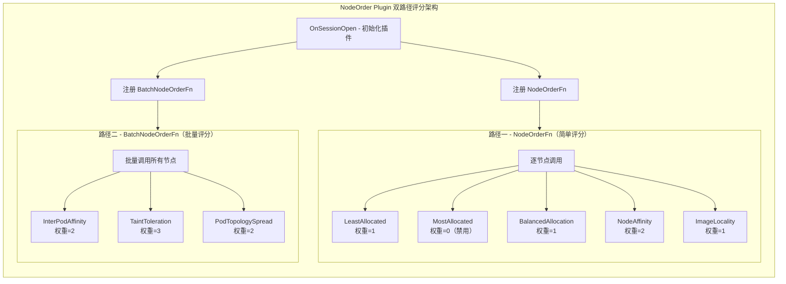
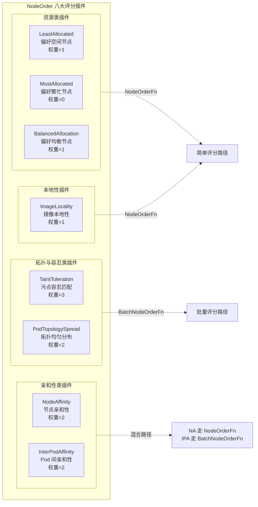
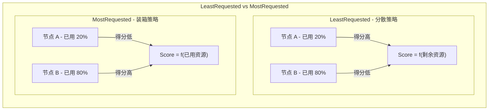
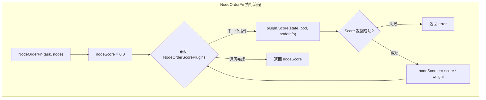
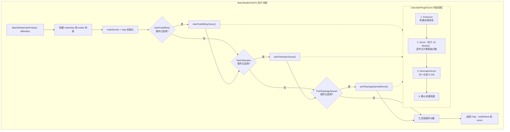
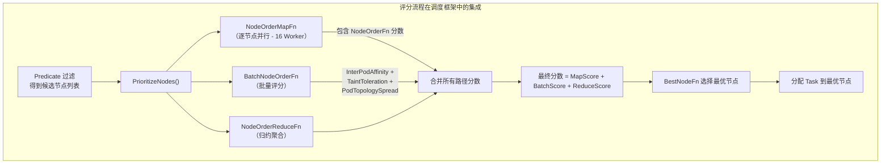
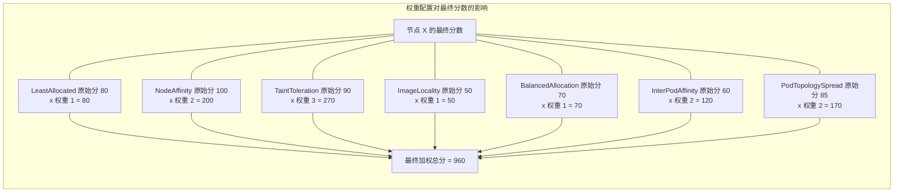

## 1. 概述

NodeOrder Plugin 是 Volcano 调度器中的 **节点评分插件**，负责在 Predicate（过滤）阶段之后，对候选节点进行打分排序，从而为 Task 选出最优的调度目标节点。它的核心设计思想是 **桥接 Kubernetes 原生评分能力** -- 通过封装 K8s 内置的 8 个 Score Plugin，并为每个插件配置独立的权重系数，使 Volcano 的批调度能力与 K8s 的节点评分逻辑无缝结合。

NodeOrder Plugin 适用于以下典型场景：

- **资源均衡分布**：通过 LeastRequested 策略将 Pod 分散到资源充裕的节点，避免热点
- **资源紧凑装箱**：通过 MostRequested 策略将 Pod 集中到已部分使用的节点，提高利用率
- **亲和性调度**：尊重 Pod 的 NodeAffinity、InterPodAffinity、TaintToleration 等亲和性规则
- **拓扑均匀分布**：通过 PodTopologySpread 实现跨故障域的均匀分布

与 K8s 默认调度器逐个 Pod 评分不同，NodeOrder Plugin 在 Volcano 的批调度上下文中运行，为同一 Job 的多个 Task 统一评分排序。

> 源码位置：`pkg/scheduler/plugins/nodeorder/nodeorder.go`（421 行）

## 2. 核心结构

### 2.1 Plugin 主结构

```go
type NodeOrderPlugin struct {
    pluginArguments       framework.Arguments   // 用户配置的权重参数
    weight                priorityWeight         // 解析后的权重结构
    Handle                k8sframework.Handle    // K8s 调度框架 Handle
    ScorePlugins          map[string]nodescore.BaseScorePlugin     // 批量评分插件（需要 PreScore）
    NodeOrderScorePlugins map[string]ScorePluginWithWeight         // 简单评分插件（仅需 Score）
}
```

`NodeOrderPlugin` 维护两个独立的插件集合：`NodeOrderScorePlugins` 和 `ScorePlugins`，分别对应两条不同的评分路径。这种双路径设计是理解 NodeOrder Plugin 的关键。

### 2.2 权重配置结构

```go
type priorityWeight struct {
    leastReqWeight          int  // 默认: 1
    mostReqWeight           int  // 默认: 0（禁用）
    nodeAffinityWeight      int  // 默认: 2
    podAffinityWeight       int  // 默认: 2
    balancedResourceWeight  int  // 默认: 1
    taintTolerationWeight   int  // 默认: 3
    imageLocalityWeight     int  // 默认: 1
    podTopologySpreadWeight int  // 默认: 2
}
```

### 2.3 带权重的评分插件包装

```go
type ScorePluginWithWeight struct {
    plugin k8sframework.ScorePlugin  // K8s 原生 ScorePlugin 接口
    weight int                        // 该插件的权重系数
}
```

## 3. 双路径评分架构

NodeOrder Plugin 最核心的设计是将 8 个 K8s 原生评分插件分为两组，走不同的评分路径。这样做的原因在于 K8s 评分插件的接口差异 -- 有些插件只需要逐节点计算分数（Score），而另一些需要在评分前执行全局预处理（PreScore），并在评分后对所有节点的分数进行归一化（NormalizeScore）。



### 3.1 为什么需要双路径?

| 特征 | NodeOrderFn（路径一） | BatchNodeOrderFn（路径二） |
|------|----------------------|--------------------------|
| **调用方式** | 逐节点调用，每次传入单个 Node | 一次传入所有候选 Node |
| **接口要求** | 仅需 `Score(pod, nodeInfo)` | 需要 `PreScore` + `Score` + `NormalizeScore` |
| **适用插件** | 评分逻辑独立于其他节点 | 评分需要跨节点全局信息 |
| **并行策略** | 由调度框架外层并行调用 | 内部使用 `ParallelizeUntil` 并行打分（16 Worker） |
| **分数范围** | 直接返回加权后的 float64 | 先归一化到 [0,100]，再乘以权重 |

路径二的插件（如 InterPodAffinity）需要在 `PreScore` 阶段扫描集群中所有已有 Pod 的亲和性规则，建立全局状态后才能对每个节点打分。`TaintToleration` 需要在 `NormalizeScore` 阶段将分数反转（匹配度越低分数越高），`PodTopologySpread` 同样需要全局的拓扑分布信息。这些插件无法简单地逐节点独立计算。

## 4. 八大评分插件分类



### 4.1 各插件详细说明

| 编号 | 插件名称 | 评分路径 | 默认权重 | 评分逻辑 | 初始化参数 |
|------|---------|---------|---------|---------|-----------|
| 1 | **NodeResourcesLeastAllocated** | NodeOrderFn | 1 | 偏好剩余资源多的节点，实现 Pod 分散 | cpu:50, memory:50 |
| 2 | **NodeResourcesMostAllocated** | NodeOrderFn | 0（禁用） | 偏好剩余资源少的节点，实现 Pod 装箱 | cpu:1, memory:1 |
| 3 | **NodeResourcesBalancedAllocation** | NodeOrderFn | 1 | 偏好 CPU/内存/GPU 使用率均衡的节点 | cpu:1, memory:1, nvidia.com/gpu:1 |
| 4 | **NodeAffinity** | NodeOrderFn | 2 | 根据 `preferredDuringScheduling` 节点亲和规则评分 | AddedAffinity: 空 |
| 5 | **ImageLocality** | NodeOrderFn | 1 | 容器镜像已存在于节点上时给予加分 | 无参数 |
| 6 | **InterPodAffinity** | BatchNodeOrderFn | 2 | 根据 Pod 间亲和/反亲和规则评分 | 空 InterPodAffinityArgs |
| 7 | **TaintToleration** | BatchNodeOrderFn | 3（最高） | 无法容忍的 Taint 越少，分数越高 | 无参数 |
| 8 | **PodTopologySpread** | BatchNodeOrderFn | 2 | 根据拓扑分布约束评分，偏好分布更均匀的节点 | DefaultingType: SystemDefaulting |

> **注意**：TaintToleration 拥有最高的默认权重（3），反映了污点容忍在生产环境中的重要性 -- 将 Pod 调度到带有不可容忍污点的节点上往往会导致严重问题。

### 4.2 LeastRequested vs MostRequested

这两个插件是互补的策略选择，底层都使用 `noderesources.Fit`，仅 `ScoringStrategy.Type` 不同：



| 对比项 | LeastRequested | MostRequested |
|--------|---------------|---------------|
| 默认状态 | **启用**（权重=1） | **禁用**（权重=0） |
| 策略目标 | 分散 Pod，避免热点 | 集中 Pod，提高装箱率 |
| 适用场景 | 在线服务、高可用要求 | 成本优化、离线批处理 |
| 资源参数 | cpu:50, memory:50（等权重） | cpu:1, memory:1（等权重） |
| 与 binpack 关系 | 互补（与 binpack 插件目标相反） | 协同（与 binpack 插件目标一致） |

## 5. 插件初始化流程

`InitPlugin()` 方法在每个调度 Session 开始时被调用，根据权重配置动态创建 K8s 原生评分插件实例。**权重为 0 的插件完全不会被创建**，从而避免不必要的计算开销。

```go
func (pp *NodeOrderPlugin) InitPlugin() {
    scorePlugins := map[string]nodescore.BaseScorePlugin{}
    nodeOrderScorePlugins := map[string]ScorePluginWithWeight{}

    // 只有权重 != 0 时才初始化对应插件
    if pp.weight.leastReqWeight != 0 {
        // 创建 LeastAllocated 实例...
        nodeOrderScorePlugins[name+"_LeastAllocated"] = ScorePluginWithWeight{plugin, weight}
    }
    // ... 其余 7 个插件同理

    pp.NodeOrderScorePlugins = nodeOrderScorePlugins
    pp.ScorePlugins = scorePlugins
}
```

初始化过程的关键特征：

1. **条件创建**：每个插件都有 `if pp.weight.xxxWeight != 0` 守卫条件
2. **Feature Gates 传递**：通过 `feature.Features` 传递 K8s Feature Gate 状态（如 `NodeInclusionPolicyInPodTopologySpread`）
3. **Handle 共享**：所有 K8s 插件共享同一个 `k8sframework.Handle`（由 `k8s.NewFramework` 创建），包含节点快照、KubeClient、InformerFactory
4. **错误降级**：单个插件初始化失败不影响其他插件，仅记录错误日志

## 6. NodeOrderFn 执行流程

`NodeOrderFn` 处理简单评分插件，对单个节点进行逐插件打分并加权汇总。



核心代码解析：

```go
func (pp *NodeOrderPlugin) NodeOrderFn(task *api.TaskInfo, node *api.NodeInfo,
    k8sNodeInfo fwk.NodeInfo, state *k8sframework.CycleState) (float64, error) {
    var nodeScore = 0.0
    for name, p := range pp.NodeOrderScorePlugins {
        score, status := p.plugin.Score(context.TODO(), state, task.Pod, k8sNodeInfo)
        if !status.IsSuccess() {
            return 0, status.AsError()
        }
        // 每个插件的原始分数乘以其权重
        nodeScore += float64(score) * float64(p.weight)
    }
    return nodeScore, nil
}
```

**执行特点**：
- 每次调用处理 **一个 Task 在一个 Node 上的评分**
- 各插件 Score 调用之间无依赖，顺序遍历
- 最终分数是所有启用插件的 **加权总和**
- 调度框架在外层通过 `workqueue.ParallelizeUntil` 并行调用多个节点的 NodeOrderFn

## 7. BatchNodeOrderFn 执行流程

`BatchNodeOrderFn` 处理需要全局信息的复杂评分插件。它一次性接收所有候选节点，依次执行 **PreScore -> Score -> NormalizeScore** 三阶段流水线。



### 7.1 CalculatePluginScore 内部机制

三个批量评分插件都通过 `nodescore.CalculatePluginScore()` 函数执行，这是一个通用的三阶段评分流水线：

```go
func CalculatePluginScore(pluginName string, plugin BaseScorePlugin,
    normalizer k8sframework.ScoreExtensions, ...) (map[string]float64, error) {

    // 阶段一：PreScore - 构建全局状态
    preScoreStatus := plugin.PreScore(ctx, cycleState, pod, nodeInfos)
    if preScoreStatus.IsSkip() {
        return map[string]float64{}, nil  // 跳过该插件
    }

    // 阶段二：Score - 并行计算各节点分数
    workqueue.ParallelizeUntil(ctx, 16, len(nodeInfos), func(index int) {
        s, status := plugin.Score(ctx, cycleState, pod, nodeInfos[index])
        nodeScoreList[index] = NodeScore{Name: nodeName, Score: s}
    })

    // 阶段三：NormalizeScore - 归一化
    normalizer.NormalizeScore(ctx, cycleState, pod, nodeScoreList)

    // 阶段四：应用权重
    for i, nodeScore := range nodeScoreList {
        nodeScore.Score *= int64(weight)
    }
}
```

**关键设计细节**：
- 并行度固定为 **16 个 Worker**，通过 `workqueue.ParallelizeUntil` 控制
- 若任一节点评分失败，通过 `parallelizeCancel()` 取消所有剩余计算
- 归一化后的分数范围是 `[MinNodeScore, MaxNodeScore]`（即 `[0, 100]`），超出范围会返回错误
- `errCh` 的缓冲区大小等于 Worker 数量（16），避免 goroutine 阻塞

## 8. 整体调度评分流程集成

NodeOrder Plugin 的两条评分路径最终通过调度框架的 `PrioritizeNodes` 函数汇聚。该函数在 Allocate Action 中被调用，将所有评分结果合并为最终的节点排序。



分数合并逻辑（来自 `PrioritizeNodes`）：

```go
for _, node := range nodes {
    score := 0.0
    if reduceScore, ok := reduceScores[node.Name]; ok {
        score += reduceScore      // 来自 NodeOrderReduceFn
    }
    if orderScore, ok := nodeOrderScoreMap[node.Name]; ok {
        score += orderScore       // 来自 NodeOrderFn（简单评分路径）
    }
    if batchScore, ok := batchNodeScore[node.Name]; ok {
        score += batchScore       // 来自 BatchNodeOrderFn（批量评分路径）
    }
    nodeScores[score] = append(nodeScores[score], node)
}
```

## 9. 配置参数

### 9.1 配置格式

在 Volcano 调度器配置文件中，通过 `arguments` 字段为 NodeOrder Plugin 指定各评分插件的权重：

```yaml
actions: "enqueue, allocate, backfill, preempt"
tiers:
- plugins:
  - name: gang
  - name: predicates
  - name: proportion
  - name: nodeorder
    arguments:
      leastrequested.weight: 1
      mostrequested.weight: 0
      nodeaffinity.weight: 2
      podaffinity.weight: 2
      balancedresource.weight: 1
      tainttoleration.weight: 3
      imagelocality.weight: 1
      podtopologyspread.weight: 2
```

### 9.2 参数详解

| 配置键 | 对应字段 | 默认值 | 取值说明 |
|--------|---------|--------|---------|
| `leastrequested.weight` | `leastReqWeight` | 1 | 正整数启用，0 禁用 |
| `mostrequested.weight` | `mostReqWeight` | **0** | 默认禁用，启用时与 leastrequested 互斥使用更佳 |
| `nodeaffinity.weight` | `nodeAffinityWeight` | 2 | 节点亲和性权重 |
| `podaffinity.weight` | `podAffinityWeight` | 2 | Pod 间亲和性权重 |
| `balancedresource.weight` | `balancedResourceWeight` | 1 | 资源均衡分配权重 |
| `tainttoleration.weight` | `taintTolerationWeight` | **3** | 最高默认权重，反映其重要性 |
| `imagelocality.weight` | `imageLocalityWeight` | 1 | 镜像本地性权重 |
| `podtopologyspread.weight` | `podTopologySpreadWeight` | 2 | 与 K8s 默认设置一致 |

### 9.3 权重配置效果

权重直接作为各插件原始分数的乘法因子。设定不同权重可以显著改变节点排序结果：



### 9.4 典型配置方案

**方案一 - 分散优先（默认，适合在线服务）**：
```yaml
arguments:
  leastrequested.weight: 2
  mostrequested.weight: 0
  balancedresource.weight: 1
  tainttoleration.weight: 3
```

**方案二 - 装箱优先（适合离线批处理、成本优化）**：
```yaml
arguments:
  leastrequested.weight: 0
  mostrequested.weight: 2
  balancedresource.weight: 0
  tainttoleration.weight: 3
```

**方案三 - 亲和性优先（适合分布式训练、需要 co-location）**：
```yaml
arguments:
  podaffinity.weight: 5
  nodeaffinity.weight: 3
  tainttoleration.weight: 2
  leastrequested.weight: 1
```

**方案四 - 拓扑均衡优先（适合高可用部署）**：
```yaml
arguments:
  podtopologyspread.weight: 5
  leastrequested.weight: 1
  tainttoleration.weight: 3
```

## 10. 扩展点注册

NodeOrder Plugin 在调度框架中注册了两个扩展点：

| 扩展点 | 注册方式 | 触发时机 | 功能 |
|--------|---------|---------|------|
| `NodeOrderFn` | `ssn.AddNodeOrderFn()` | Allocate Action 中 Predicate 后 | 逐节点简单评分 |
| `BatchNodeOrderFn` | `ssn.AddBatchNodeOrderFn()` | Allocate Action 中 Predicate 后 | 批量评分（含 PreScore/NormalizeScore） |

注册代码：

```go
func (pp *NodeOrderPlugin) OnSessionOpen(ssn *framework.Session) {
    // 初始化 K8s 调度框架 Handle
    handle := k8s.NewFramework(nodeMap,
        k8s.WithClientSet(ssn.KubeClient()),
        k8s.WithInformerFactory(ssn.InformerFactory()),
    )
    pp.Handle = handle
    pp.InitPlugin()

    // 注册扩展点一：逐节点评分
    ssn.AddNodeOrderFn(pp.Name(), func(task *api.TaskInfo, node *api.NodeInfo) (float64, error) {
        nodeInfo := nodeMap[node.Name]
        state := k8sframework.NewCycleState()
        return pp.NodeOrderFn(task, node, nodeInfo, state)
    })

    // 注册扩展点二：批量评分
    ssn.AddBatchNodeOrderFn(pp.Name(), func(task *api.TaskInfo, nodeInfo []*api.NodeInfo) (map[string]float64, error) {
        state := k8sframework.NewCycleState()
        return pp.BatchNodeOrderFn(task, nodeInfo, state)
    })
}
```

**注意**：每次调用都会创建新的 `CycleState`，确保各评分调用之间的状态隔离。

## 11. 与 K8s Framework Handle 的集成

NodeOrder Plugin 通过 `k8s.NewFramework` 创建一个轻量级的 K8s 调度框架 Handle，为原生评分插件提供必要的运行环境：

```go
type Framework struct {
    snapshot         *Snapshot              // 节点快照
    kubeClient       kubernetes.Interface   // K8s API 客户端
    informerFactory  informers.SharedInformerFactory  // Informer 工厂
    sharedDRAManager framework.SharedDRAManager       // DRA 管理器
}
```

这个 Handle 实现了 `k8sframework.Handle` 接口的核心方法（`SnapshotSharedLister`、`ClientSet`、`SharedInformerFactory`），同时对不需要的方法（如 `IterateOverWaitingPods`、`HasFilterPlugins`）抛出 panic，确保只在评分场景下使用。

`Snapshot` 基于 Volcano Session 中的 `NodeMap` 构建，将 Volcano 的节点信息转换为 K8s 调度框架可以理解的格式。这种适配层设计使得 K8s 原生评分插件可以在 Volcano 的批调度上下文中无缝运行。

## 12. 常见问题

### Q1: LeastRequested 和 MostRequested 可以同时启用吗?

技术上可以同时启用（两者权重都非零），但不推荐。这两个策略的评分方向完全相反 -- LeastRequested 给资源充裕的节点高分，MostRequested 给资源紧张的节点高分。同时启用会导致两者的分数互相抵消，最终评分效果不可预测。建议根据业务场景选择其一，将另一个权重设为 0。

### Q2: 设置权重为 0 和完全不配置 nodeorder 插件有什么区别?

将某个评分维度的权重设为 0 只是禁用该特定评分器，其他评分器仍然正常工作。例如 `mostrequested.weight: 0` 只禁用 MostRequested，其余 6 个默认启用的评分器继续生效。如果完全不配置 nodeorder 插件，则所有 8 个评分器都不会运行，节点选择将依赖其他评分插件（如 binpack）或随机选择。

### Q3: NodeOrder Plugin 与 Binpack Plugin 有什么关系?

两者都参与节点评分，但关注的维度不同。NodeOrder 封装了 K8s 原生的多维评分逻辑（亲和性、污点、拓扑等），而 Binpack Plugin 专注于资源装箱优化。在实际使用中：

- 若启用 LeastRequested（默认），其效果与 Binpack 的装箱策略相反
- 若启用 MostRequested，其效果与 Binpack 目标一致
- 两个插件的分数会在 `PrioritizeNodes` 中叠加，因此需要注意权重的协调

详细的 Binpack 插件分析请参考 [Binpack Plugin 详解](./06-binpack-plugin.md)。

### Q4: 为什么 TaintToleration 的默认权重最高（3）?

TaintToleration 在生产环境中至关重要。Taint 通常用于标记节点的特殊状态（如 GPU 专用、维护中、资源预留等），将 Pod 调度到不匹配的节点上可能导致：
- Pod 无法正常运行
- 违反资源隔离策略
- 影响节点上的其他工作负载

较高的默认权重确保了 TaintToleration 的评分在最终结果中占据主导地位，降低误调度的风险。

### Q5: BatchNodeOrderFn 中的三个插件评分失败会如何影响结果?

如果某个插件（如 InterPodAffinity）的 `CalculatePluginScore` 返回错误，`BatchNodeOrderFn` 会立即返回该错误，导致当前 Task 的所有节点评分失败。调度框架会跳过该 Task 的节点选择。但这不会影响同一 Job 中其他 Task 的评分。

值得注意的是，`PreScore` 阶段返回 `IsSkip()` 状态时，该插件会被优雅跳过（返回空分数 map），不视为错误。

### Q6: 如何与 Predicates Plugin 配合使用?

NodeOrder Plugin 和 [Predicates Plugin](./04-predicates-plugin.md) 分别对应 K8s 调度的两个阶段：

- **Predicates（过滤）**：剔除不满足硬约束的节点（如 `requiredDuringScheduling` 亲和性、NoSchedule Taint）
- **NodeOrder（评分）**：对通过过滤的候选节点打分排序（如 `preferredDuringScheduling` 亲和性、PreferNoSchedule Taint）

两者是互补关系，Predicates 先执行，NodeOrder 在其筛选结果上进行评分。典型配置中两者同时启用：

```yaml
tiers:
- plugins:
  - name: predicates
  - name: nodeorder
```

### Q7: 每个调度周期都会重新初始化所有 K8s 插件吗?

是的。`OnSessionOpen` 在每个调度周期开始时被调用，会重新创建 `k8sframework.Handle` 和所有评分插件实例。这确保了每次评分都基于最新的集群状态（节点快照），但也意味着每个周期都有一定的初始化开销。对于大规模集群，这个开销通常远小于实际的评分计算时间。

## 13. 下一步

在理解了 NodeOrder Plugin 的节点评分机制后，建议继续阅读以下相关内容：

- **[Predicates Plugin 详解](./04-predicates-plugin.md)**：理解节点过滤阶段的实现，它与 NodeOrder 共同完成 K8s 的 Filter + Score 调度流程。
- **[Binpack Plugin 详解](./06-binpack-plugin.md)**：另一个重要的节点评分插件，专注于资源装箱优化，与 NodeOrder 的 MostRequested/LeastRequested 策略有密切关联。
