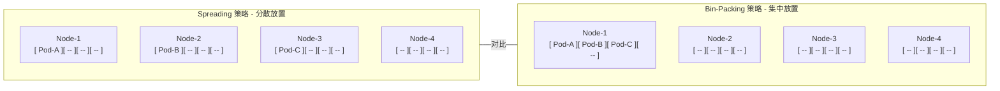
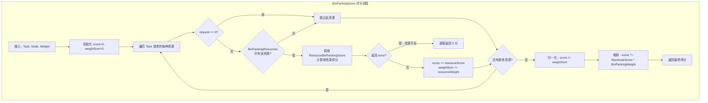
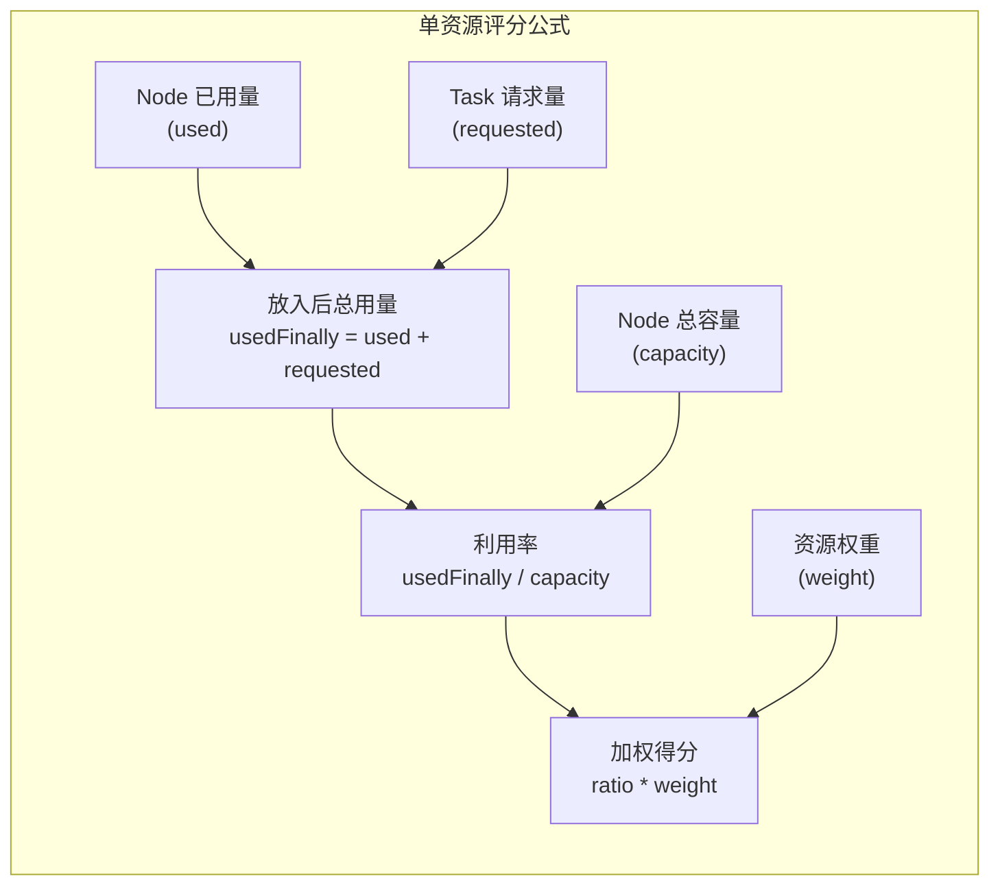
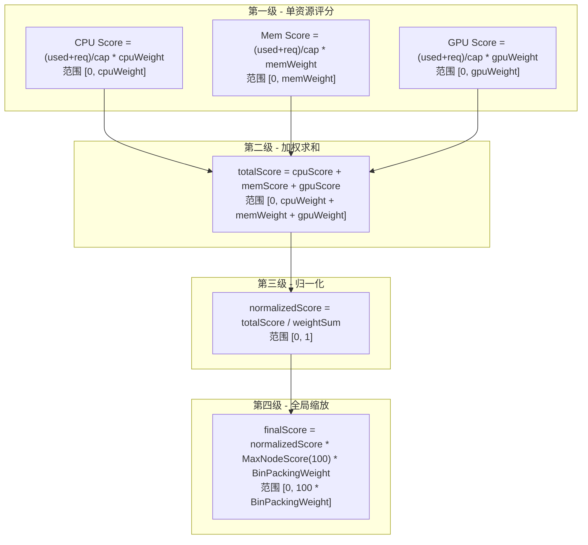
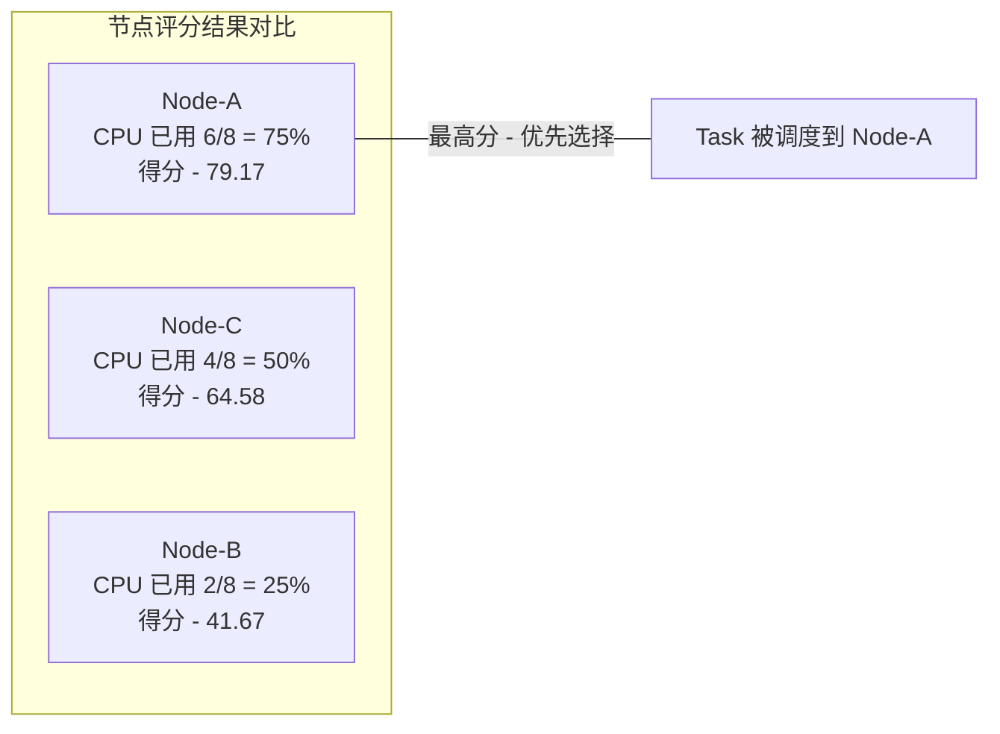

## 概述

Binpack Plugin 是 Volcano 调度器中实现 **Bin-Packing（装箱）** 策略的评分插件。与 Kubernetes 默认调度器倾向于将 Pod 均匀分散到各节点（Spread）的策略不同，Bin-Packing 的核心思想是：**将工作负载尽可能地集中放置到已有负载的节点上，减少活跃节点数量，从而提高资源利用率并降低基础设施成本。**

这种策略在以下场景中尤为重要：

- **云环境成本优化**：将负载集中到少量节点，使空闲节点可以被 Cluster Autoscaler 缩容回收，直接降低计费
- **GPU 碎片整理**：GPU 资源昂贵且稀缺，Bin-Packing 可以将 GPU 任务集中到少数节点，避免每个 GPU 节点只运行一个小任务而造成浪费
- **批处理/离线计算**：大量短生命周期任务在少量节点上紧密排列，提高吞吐量

Binpack Plugin 通过 `NodeOrderFn` 扩展点对节点进行打分，节点利用率越高（放入 Task 后），得分越高，调度器优先选择高分节点，实现工作负载的聚拢效果。

> **源码参考**：`pkg/scheduler/plugins/binpack/binpack.go`（262 行）

---

## Bin-Packing vs Spreading 概念对比



| 对比维度 | Spreading | Bin-Packing |
|---------|-----------|-------------|
| **节点利用率** | 低且均匀 | 高且集中 |
| **空闲节点数** | 少（几乎没有完全空闲的节点） | 多（便于缩容回收） |
| **高可用性** | 好（故障影响面分散） | 较差（故障可能影响大量 Pod） |
| **成本优化** | 较差 | 好（可配合 Autoscaler 缩容） |
| **适用场景** | 在线服务、高可用要求 | 批处理、离线计算、成本敏感型 |

---

## 核心结构体

```go
type binpackPlugin struct {
    weight priorityWeight
}

type priorityWeight struct {
    BinPackingWeight    int                         // 全局权重乘数，默认值: 1
    BinPackingCPU       int                         // CPU 资源权重，默认值: 1
    BinPackingMemory    int                         // Memory 资源权重，默认值: 1
    BinPackingResources map[v1.ResourceName]int     // 包含 CPU、Memory 及自定义资源的权重映射
}
```

`binpackPlugin` 是一个**无状态**插件 -- 所有配置在初始化时通过 `calculateWeight()` 从 Arguments 解析并固定，调度周期内不会变化。`priorityWeight` 结构体封装了所有资源维度的权重信息，`BinPackingResources` 是一个统一的 map，在初始化结束时会自动包含 CPU 和 Memory 条目。

---

## 配置参数

### 参数列表

| 参数键名 | 类型 | 默认值 | 说明 |
|----------|------|--------|------|
| `binpack.weight` | int | 1 | 全局权重乘数，作用于最终得分。设为 0 则完全禁用 Binpack 打分 |
| `binpack.cpu` | int | 1 | CPU 资源在打分中的权重。负值自动重置为 1 |
| `binpack.memory` | int | 1 | Memory 资源在打分中的权重。负值自动重置为 1 |
| `binpack.resources` | string | 空 | 逗号分隔的额外资源名，如 `nvidia.com/gpu, example.com/foo` |
| `binpack.resources.<name>` | int | 1 | 指定额外资源的权重，如 `binpack.resources.nvidia.com/gpu: 2` |

### 配置示例

```yaml
actions: "enqueue, reclaim, allocate, backfill, preempt"
tiers:
- plugins:
  - name: binpack
    arguments:
      binpack.weight: 10
      binpack.cpu: 5
      binpack.memory: 1
      binpack.resources: nvidia.com/gpu, example.com/foo
      binpack.resources.nvidia.com/gpu: 2
      binpack.resources.example.com/foo: 3
```

### 参数解析流程

```mermaid
flowchart TD
    subgraph init_flow["calculateWeight 参数解析流程"]
        Start["初始化默认值\nBinPackingWeight=1\nBinPackingCPU=1\nBinPackingMemory=1"] --> ParseWeight["解析 binpack.weight"]
        ParseWeight --> ParseCPU["解析 binpack.cpu"]
        ParseCPU --> ValidateCPU{"binpack.cpu < 0?"}
        ValidateCPU -->|"是"| ResetCPU["重置 binpack.cpu = 1"]
        ValidateCPU -->|"否"| ParseMemory["解析 binpack.memory"]
        ResetCPU --> ParseMemory
        ParseMemory --> ValidateMemory{"binpack.memory < 0?"}
        ValidateMemory -->|"是"| ResetMemory["重置 binpack.memory = 1"]
        ValidateMemory -->|"否"| ParseResources["解析 binpack.resources 字符串"]
        ResetMemory --> ParseResources
        ParseResources --> SplitCSV["按逗号分割，遍历每个资源名"]
        SplitCSV --> ParseEachWeight["解析 binpack.resources.NAME 权重"]
        ParseEachWeight --> ValidateEach{"资源权重 < 0?"}
        ValidateEach -->|"是"| ResetEach["重置该资源权重 = 1"]
        ValidateEach -->|"否"| AddToMap["加入 BinPackingResources map"]
        ResetEach --> AddToMap
        AddToMap --> MoreResources{"更多资源?"}
        MoreResources -->|"是"| ParseEachWeight
        MoreResources -->|"否"| Finalize["将 CPU 和 Memory\n写入 BinPackingResources map"]
    end
```



关键细节：

- `BinPackingResources` map 最终一定包含 `cpu` 和 `memory` 两个条目，对应 `BinPackingCPU` 和 `BinPackingMemory` 的值
- 不在 `binpack.resources` 中声明的自定义资源即使 Task 请求了也会被忽略（score 为 0）
- `binpack.weight` 没有负值校验 -- 设为 0 会跳过注册 `NodeOrderFn`，设为负值会导致分数为负

---

## 评分算法详解

### BinPackingScore 主函数

```go
func BinPackingScore(task *api.TaskInfo, node *api.NodeInfo, weight priorityWeight) float64 {
    score := 0.0
    weightSum := 0
    requested := task.Resreq
    allocatable := node.Allocatable
    used := node.Used

    for _, resource := range requested.ResourceNames() {
        request := requested.Get(resource)
        if request == 0 { continue }
        allocate := allocatable.Get(resource)
        nodeUsed := used.Get(resource)

        resourceWeight, found := weight.BinPackingResources[resource]
        if !found { continue }

        resourceScore, err := ResourceBinPackingScore(request, allocate, nodeUsed, resourceWeight)
        if err != nil { return 0 }  // 资源不足，直接返回 0 分

        score += resourceScore
        weightSum += resourceWeight
    }

    if weightSum > 0 { score /= float64(weightSum) }
    score *= float64(k8sFramework.MaxNodeScore * int64(weight.BinPackingWeight))
    return score
}
```

### 算法流程



### ResourceBinPackingScore 单资源评分

```go
func ResourceBinPackingScore(requested, capacity, used float64, weight int) (float64, error) {
    if capacity == 0 || weight == 0 { return 0, nil }
    usedFinally := requested + used
    if usedFinally > capacity { return 0, fmt.Errorf("not enough") }
    score := usedFinally * float64(weight) / capacity
    return score, nil
}
```

**核心公式**：

```
resourceScore = (used + requested) / capacity * weight
```



公式含义解读：

- 分子 `used + requested` 表示将该 Task 放到此 Node 后的**预期总使用量**
- 分母 `capacity` 是节点的可分配总量
- 比值越接近 1，说明节点越满，得分越高 -- **这正是 Bin-Packing 偏好满节点的核心机制**
- 乘以 `weight` 使不同资源维度具有不同影响力

---

## 分数归一化流程

评分经过三级变换，从多维资源的原始分数转化为最终的单一节点得分。



| 阶段 | 操作 | 分数范围 |
|------|------|---------|
| 单资源评分 | `(used + requested) / capacity * resourceWeight` | `[0, resourceWeight]` |
| 加权求和 | 累加所有资源评分 | `[0, sum_of_all_weights]` |
| 归一化 | 除以 `weightSum` | `[0, 1]` |
| 全局缩放 | 乘以 `MaxNodeScore(100) * BinPackingWeight` | `[0, 100 * BinPackingWeight]` |

---

## 具体数值计算示例

假设集群有 3 个节点，一个 Task 请求 1 CPU、2Gi Memory，Binpack 配置为 `binpack.weight=1, binpack.cpu=5, binpack.memory=1`。

### 集群状态

| 节点 | CPU 总量 | CPU 已用 | Memory 总量 | Memory 已用 |
|------|---------|---------|------------|------------|
| Node-A | 8 | 6 | 16Gi | 4Gi |
| Node-B | 8 | 2 | 16Gi | 8Gi |
| Node-C | 8 | 4 | 16Gi | 10Gi |

### 逐步计算

**Node-A**：
- CPU Score = (6 + 1) / 8 * 5 = 7/8 * 5 = **4.375**
- Memory Score = (4 + 2) / 16 * 1 = 6/16 * 1 = **0.375**
- totalScore = 4.375 + 0.375 = 4.75
- weightSum = 5 + 1 = 6
- normalizedScore = 4.75 / 6 = 0.7917
- finalScore = 0.7917 * 100 * 1 = **79.17**

**Node-B**：
- CPU Score = (2 + 1) / 8 * 5 = 3/8 * 5 = **1.875**
- Memory Score = (8 + 2) / 16 * 1 = 10/16 * 1 = **0.625**
- totalScore = 1.875 + 0.625 = 2.5
- weightSum = 5 + 1 = 6
- normalizedScore = 2.5 / 6 = 0.4167
- finalScore = 0.4167 * 100 * 1 = **41.67**

**Node-C**：
- CPU Score = (4 + 1) / 8 * 5 = 5/8 * 5 = **3.125**
- Memory Score = (10 + 2) / 16 * 1 = 12/16 * 1 = **0.75**
- totalScore = 3.125 + 0.75 = 3.875
- weightSum = 5 + 1 = 6
- normalizedScore = 3.875 / 6 = 0.6458
- finalScore = 0.6458 * 100 * 1 = **64.58**

### 计算结果对比



**结论**：Node-A 因为 CPU 利用率最高（75%），且 CPU 权重（5）远高于 Memory 权重（1），最终获得最高分 79.17。调度器将 Task 放置到 Node-A，进一步提高其利用率至 87.5%，体现了 Bin-Packing "填满再换下一个" 的策略。

### 权重对结果的影响

如果将配置改为 `binpack.cpu=1, binpack.memory=5`（Memory 权重更高）：

| 节点 | CPU Score | Memory Score | totalScore | normalized | final |
|------|-----------|-------------|-----------|------------|-------|
| Node-A | (7/8)*1 = 0.875 | (6/16)*5 = 1.875 | 2.75 | 0.4583 | **45.83** |
| Node-B | (3/8)*1 = 0.375 | (10/16)*5 = 3.125 | 3.5 | 0.5833 | **58.33** |
| Node-C | (5/8)*1 = 0.625 | (12/16)*5 = 3.75 | 4.375 | 0.7292 | **72.92** |

结果反转 -- Node-C 因 Memory 利用率最高而获得最高分。这说明通过调整资源权重，可以控制 Bin-Packing 偏好的资源维度。

---

## 注册的扩展点

| 扩展点 | 注册条件 | 功能 |
|--------|---------|------|
| `NodeOrderFn` | `BinPackingWeight != 0` | 对节点打分，利用率越高分数越高 |

Binpack Plugin 仅注册了一个扩展点 `NodeOrderFn`。当 `BinPackingWeight` 为 0 时，`NodeOrderFn` 不会被注册，插件相当于被静默禁用，并输出一条日志：

```go
if bp.weight.BinPackingWeight != 0 {
    ssn.AddNodeOrderFn(bp.Name(), nodeOrderFn)
} else {
    klog.Infof("binpack weight is zero, skip node order function")
}
```

注意：Binpack Plugin **没有注册** `BatchNodeOrderFn`，这意味着它不支持批量节点打分优化。每个 Task-Node 配对会独立调用一次 `NodeOrderFn`。

---

## 资源发现与警告日志

在 `OnSessionOpen` 中，当日志级别 >= V(4) 时，插件会遍历所有配置的资源权重，检查集群中是否有节点实际拥有该资源。如果某个配置了权重的资源在所有节点上都不存在（Allocatable 为 0），会输出一条警告日志：

```go
if klog.V(4).Enabled() {
    notFoundResource := []string{}
    for resource := range bp.weight.BinPackingResources {
        found := false
        for _, nodeInfo := range ssn.Nodes {
            if nodeInfo.Allocatable.Get(resource) > 0 {
                found = true
                break
            }
        }
        if !found {
            notFoundResource = append(notFoundResource, string(resource))
        }
    }
    klog.V(4).Infof("resources [%s] record in weight but not found on any node",
        strings.Join(notFoundResource, ", "))
}
```

这有助于排查配置错误 -- 例如配置了 `nvidia.com/gpu` 的权重但集群中实际没有 GPU 节点时，管理员可以通过提高日志级别发现此问题。

---

## 与 Nodeorder Plugin 的关系

Binpack Plugin 和 [Nodeorder Plugin](./05-nodeorder-plugin.md) 都通过 `NodeOrderFn` 对节点打分，但它们的定位和实现有本质区别：

| 对比维度 | Binpack Plugin | Nodeorder Plugin |
|---------|---------------|------------------|
| **定位** | 专注于 Bin-Packing 单一策略 | 集成 Kubernetes 原生多种打分策略 |
| **打分函数** | 自研 `ResourceBinPackingScore` | 封装 K8s `RequestedToCapacityRatio` 等 |
| **BatchNodeOrderFn** | 不支持 | 支持 |
| **配置复杂度** | 简单，仅权重参数 | 复杂，支持十余种打分策略组合 |
| **MostRequested 打分** | 原生实现（公式等价） | 通过 K8s `NodeResourcesMostAllocated` 实现 |
| **适用场景** | 需要简单、可控的 Bin-Packing | 需要与 K8s 原生调度策略兼容 |

Nodeorder Plugin 中的 `MostRequested` 策略与 Binpack 的目标相似（偏好高利用率节点），但实现路径不同。Binpack 提供了更直观的**分资源权重控制**和**全局权重乘数**，适合需要精细调控资源打包维度的场景。

---

## 常见问题

### Q1: Binpack Plugin 和 Nodeorder Plugin 的 MostRequested 有什么区别？

两者都偏好高利用率节点，但 Binpack Plugin 提供了更细粒度的资源维度控制：

- **Binpack Plugin**：每种资源可以独立设置权重（如 CPU:5, Memory:1, GPU:2），通过加权求和计算总分，还有全局 `BinPackingWeight` 乘数
- **Nodeorder MostRequested**：使用 Kubernetes 原生 `NodeResourcesMostAllocated` 实现，资源权重调整需要通过 Kubernetes 的 `RequestedToCapacityRatioArgs` 配置

如果只需要简单的 Bin-Packing 且希望精细控制各资源权重，推荐使用 Binpack Plugin；如果需要与 Kubernetes 原生调度策略生态兼容，推荐使用 Nodeorder Plugin。

### Q2: 如何优先按 GPU 进行 Bin-Packing？

将 GPU 权重设为最高，降低 CPU 和 Memory 的权重：

```yaml
plugins:
- name: binpack
  arguments:
    binpack.weight: 10
    binpack.cpu: 1
    binpack.memory: 1
    binpack.resources: nvidia.com/gpu
    binpack.resources.nvidia.com/gpu: 10
```

此配置下 GPU 的权重（10）远高于 CPU（1）和 Memory（1），评分将主要由 GPU 利用率驱动，Task 会优先被放到 GPU 已使用较多的节点上。

### Q3: BinPackingWeight 设为 0 会怎样？

`BinPackingWeight` 为 0 时，`NodeOrderFn` 不会被注册，Binpack Plugin 完全不参与节点打分。这等效于禁用了插件，但插件仍然会被加载。如果需要完全禁用，更推荐从配置中移除插件。

### Q4: 如果 Task 请求的资源类型不在权重 map 中会怎样？

该资源会被跳过，不参与评分。例如 Task 请求了 `hugepages-2Mi` 但未在 `binpack.resources` 中配置，那么 Hugepages 维度的利用率不会影响打分。只有 CPU、Memory 以及显式配置的自定义资源才会参与评分。

### Q5: 当节点资源不足以容纳 Task 时分数是多少？

如果任意一种已配置资源的 `used + requested > capacity`，`ResourceBinPackingScore` 返回 error，`BinPackingScore` 立即返回 **0 分** -- 该节点在此维度上不可用。注意这并不等同于过滤（Filter），节点是否可行的最终判断由 Predicates Plugin 完成；Binpack 的 0 分只是使该节点在打分排名中处于劣势。

### Q6: Binpack Plugin 是否会导致节点过载？

不会。Binpack Plugin 只负责打分（Scoring），不负责准入（Filtering）。节点的实际资源容量检查由 Predicates Plugin 的 Filter 阶段完成。Binpack 给高利用率节点更高分数，但如果节点剩余资源不足以满足 Task 请求，Predicates Plugin 会直接过滤掉该节点。

### Q7: 多个打分插件同时启用时 Binpack 分数如何生效？

Allocate Action 在调用 `ssn.NodeOrderFn` 时，会收集所有注册了 `NodeOrderFn` 的插件的分数并累加。Binpack 的分数只是最终总分的一部分。通过调整 `binpack.weight`（全局乘数）可以控制 Binpack 策略在总分中的影响力。例如 `binpack.weight=10` 会使 Binpack 的最大分数为 1000（100 * 10），相对于其他权重为 1 的插件影响力更大。

---

## 下一步

- 前一篇：[Nodeorder Plugin 详解](./05-nodeorder-plugin.md) -- Kubernetes 原生评分策略的集成，与 Binpack 形成互补
- 相关参考：[Allocate Action 详解](../03-actions-analysis/02-allocate-action.md) -- 了解 NodeOrderFn 在分配流程中如何被调用
- 相关参考：[DRF Plugin 详解](./03-drf-plugin.md) -- 基于主导资源公平性的 Job 排序，与 Binpack 的节点打分处于不同层级
