## 1. 概述

Capacity Plugin 是 Volcano 调度器中的**层级队列容量管理插件**，用于替代或增强 Proportion Plugin 在复杂多租户场景下的资源管控能力。与 Proportion 只支持扁平队列不同，Capacity Plugin 同时支持**扁平队列模式**和**层级（树形）队列模式**，能够表达组织级别的资源层级划分。

其核心价值在于：

- **Deserved-based 公平共享**：每个队列拥有明确的 Deserved 配额（来自 Queue Spec 配置），作为调度和抢占的基准线
- **Guarantee 保护**：队列的最低保障资源在回收时不可侵犯
- **Capability 上限控制**：队列资源使用不得超过其容量上限
- **层级继承与传播**：父队列的容量约束自动传播给子队列，子队列的资源使用聚合到父队列

适用场景包括：多团队共享集群（team-a / team-b 各有子队列）、GPU 训练与推理资源隔离、以及需要精确控制队列资源配额的生产环境。

> **源码参考**：`pkg/scheduler/plugins/capacity/capacity.go`（1121 行）

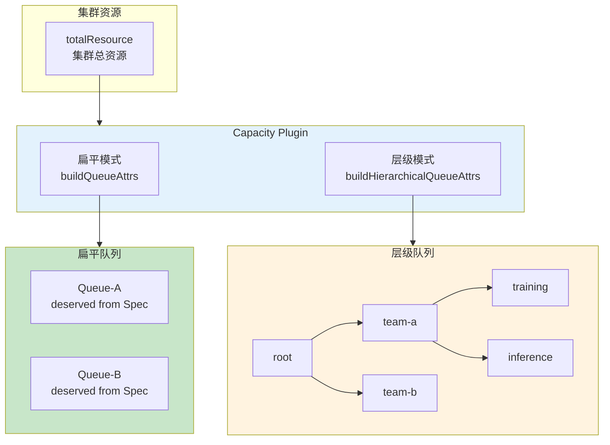

---

## 2. Plugin 结构体与核心数据

### 2.1 capacityPlugin 结构体

```go
type capacityPlugin struct {
    rootQueue      string           // 根队列名称（层级模式下为 "root"）
    totalResource  *api.Resource    // 集群总资源
    totalGuarantee *api.Resource    // 所有队列 guarantee 之和
    totalDeserved  *api.Resource    // 所有队列 deserved 之和

    queueOpts map[api.QueueID]*queueAttr  // 队列属性映射表
    pluginArguments framework.Arguments    // 插件参数
}
```

### 2.2 queueAttr 结构体

`queueAttr` 是 Capacity Plugin 的数据核心，每个参与调度的 Queue（包括层级模式下的非叶子节点）都维护一份：

```go
type queueAttr struct {
    queueID   api.QueueID
    name      string
    share     float64                    // 主导资源使用率
    ancestors []api.QueueID              // 祖先队列列表（从 root 到 parent）
    children  map[api.QueueID]*queueAttr // 子队列映射

    deserved       *api.Resource  // 应得资源（来自 Queue Spec）
    allocated      *api.Resource  // 已分配资源
    request        *api.Resource  // 资源需求总和
    elastic        *api.Resource  // 弹性资源（job.allocated - job.minAvailable 之和）
    inqueue        *api.Resource  // 已入队 Job 的资源需求
    capability     *api.Resource  // 用户配置的容量上限
    realCapability *api.Resource  // 实际容量上限（受 guarantee 修正）
    guarantee      *api.Resource  // 最低保障资源
}
```

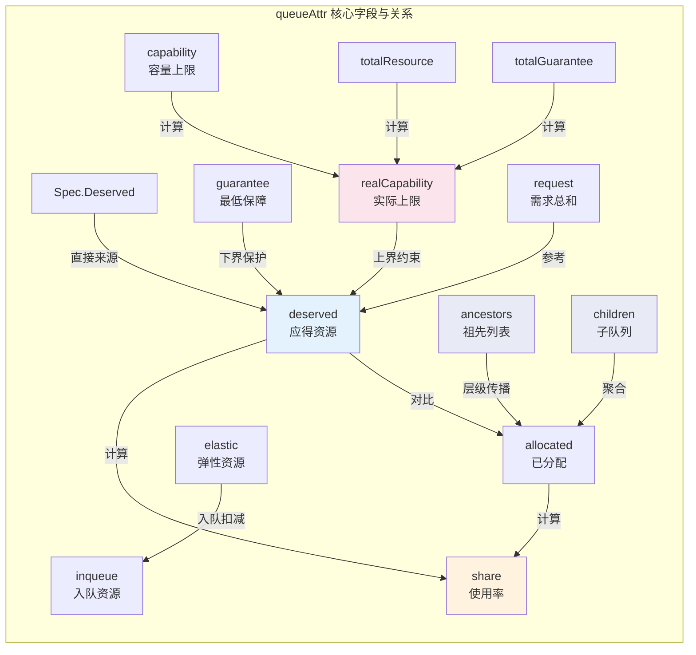

### 2.3 字段含义速查表

| 字段 | 来源 | 含义 |
|------|------|------|
| `queueID` | Queue UID | 队列唯一标识 |
| `name` | Queue Name | 队列名称 |
| `share` | 算法计算 | 主导资源使用率 = max(allocated[r] / deserved[r]) |
| `ancestors` | 层级构建 | 从 root 到 parent 的祖先队列 ID 列表（扁平模式为空） |
| `children` | 层级构建 | 直接子队列的映射（叶子队列为空） |
| `deserved` | Queue Spec | 队列应得资源，来自 `Queue.Spec.Deserved`（非算法计算） |
| `allocated` | 实时追踪 | 队列中所有 Running Pod 实际占用的资源总量 |
| `request` | Job 聚合 | 队列中所有 Job 的资源需求总和（Allocated + Pending） |
| `elastic` | Job 聚合 | 各 Job 弹性资源之和 |
| `inqueue` | 入队追踪 | 已入队 / 运行中 Job 的最小资源需求 |
| `capability` | Queue Spec | 用户配置的队列资源硬上限 |
| `realCapability` | 算法计算 | 考虑 guarantee 后的实际上限，`<= capability` |
| `guarantee` | Queue Spec | 队列最低保障资源，回收时受保护 |

---

## 3. 队列属性构建

Capacity Plugin 在 `OnSessionOpen` 中根据是否启用层级模式，选择不同的构建路径：

```go
hierarchyEnabled := ssn.HierarchyEnabled(cp.Name())
if hierarchyEnabled {
    readyToSchedule = cp.buildHierarchicalQueueAttrs(ssn)
} else {
    cp.buildQueueAttrs(ssn)
}
```

### 3.1 扁平模式 - buildQueueAttrs

扁平模式是 Capacity Plugin 的基础模式，处理逻辑如下：

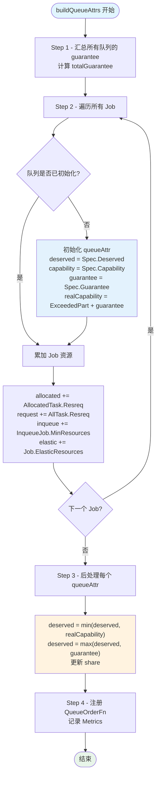

关键细节：

1. **Deserved 来源**：直接来自 `Queue.Spec.Deserved`，而非像 Proportion 那样通过权重迭代算法计算
2. **realCapability 计算公式**：`realCapability = min(capability, ExceededPart(totalResource, totalGuarantee) + guarantee)`。其中 `ExceededPart(totalResource, totalGuarantee)` 是集群总资源减去所有队列保障后的可竞争资源
3. **Deserved 约束**：先被 realCapability 截断为上界，再被 guarantee 提升为下界
4. **Inqueue 资源**：区分 `PodGroupInqueue` 和 `PodGroupRunning` 两种状态，Running 状态下还需检查 `allocatedTaskNum >= minMember`

### 3.2 层级模式 - buildHierarchicalQueueAttrs

层级模式构建一棵以 `root` 为根的队列树，处理过程更加复杂：

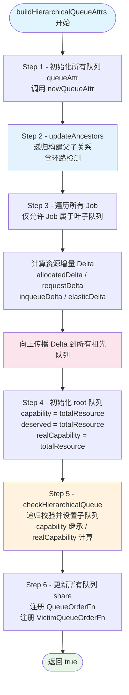

#### updateAncestors - 递归构建队列树

`updateAncestors` 从叶子队列出发，递归地向上构建父子关系：

```go
func (cp *capacityPlugin) updateAncestors(queue *api.QueueInfo, ssn *framework.Session, visited map[api.QueueID]struct{}) error {
    // 环路检测：如果 visited 中已存在当前队列，报错
    if _, exist := visited[queue.UID]; exist {
        return fmt.Errorf("cycle detected in queue hierarchy for queue %s", queue.Name)
    }
    visited[queue.UID] = struct{}{}
    defer delete(visited, queue.UID)
    // 确定父队列（默认为 root）
    parent := cp.rootQueue
    if queue.Queue.Spec.Parent != "" {
        parent = queue.Queue.Spec.Parent
    }
    // 递归处理父队列，建立 children 和 ancestors 关系
    ...
}
```

#### checkHierarchicalQueue - 递归校验

从 root 节点开始递归校验每个队列节点：

1. **Capability 继承**：子队列未设置 CPU/Memory 时继承父队列的值；Scalar 资源（如 GPU）同理
2. **realCapability 计算**：`realCapability = min(capability, ExceededPart(parent.realCapability, totalChildGuarantee) + childGuarantee)`
3. **一致性警告**：子队列 capability 超过父队列、子队列 deserved 之和超过父队列、子队列 guarantee 之和超过父队列 -- 只记录警告日志，不阻断调度

#### 层级队列树结构示例

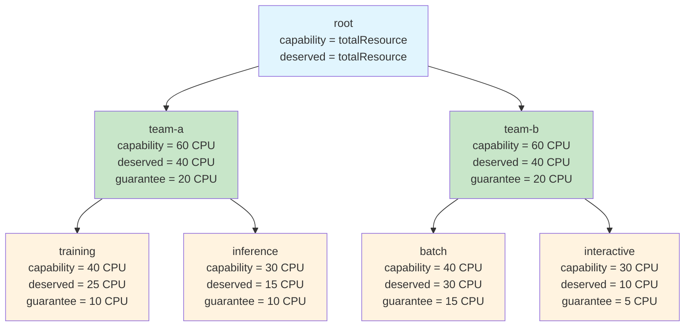

在此结构中，`training` 队列的 ancestors 为 `[root, team-a]`，当 training 分配资源时，delta 会同时传播到 `team-a` 和 `root`。

---

## 4. Share 计算与排序

### 4.1 updateQueueAttrShare

Share 是队列资源使用率的核心度量，计算公式为：

```go
func updateQueueAttrShare(attr *queueAttr) {
    // Best-effort 队列（无 deserved）：share 固定为 1
    if attr.deserved.IsEmpty() {
        attr.share = 1
        return
    }
    // 有 deserved 的队列：取所有资源维度的最大使用率
    res := float64(0)
    for _, rn := range attr.deserved.ResourceNames() {
        res = max(res, helpers.Share(attr.allocated.Get(rn), attr.deserved.Get(rn)))
    }
    attr.share = res
}
```

**设计语义**：

| 场景 | Share 值 | 含义 |
|------|----------|------|
| 无 deserved (Best-effort) | 固定 1.0 | 最低调度优先级，所有有 deserved 且 share < 1 的队列优先 |
| 有 deserved, 未分配 | 0.0 | 最高调度优先级 |
| 有 deserved, 部分分配 | 0 < share < 1 | 仍有额度可用 |
| 有 deserved, 恰好用满 | 1.0 | 与 best-effort 同等优先级 |
| 有 deserved, 超额使用 | > 1.0 | 可被回收 |

### 4.2 QueueOrderFn - 扁平模式排序

扁平模式下的排序逻辑：

1. **Priority 优先**：`rv.Priority - lv.Priority`，数值越大越优先
2. **Share 次之**：通过 `compareShareWithDeserved` 比较

```go
func (cp *capacityPlugin) compareShareWithDeserved(lattr, rattr *queueAttr) int {
    if lattr.share == rattr.share {
        // 打破平局：有 deserved 的队列优先于 best-effort 队列
        lHasDeserved := !lattr.deserved.IsEmpty()
        rHasDeserved := !rattr.deserved.IsEmpty()
        if lHasDeserved == rHasDeserved { return 0 }
        if lHasDeserved { return -1 }
        return 1
    }
    if lattr.share < rattr.share { return -1 }
    return 1
}
```

### 4.3 QueueOrderFn - 层级模式排序

层级模式下的排序逻辑更加复杂，需要在公共祖先层级进行比较：

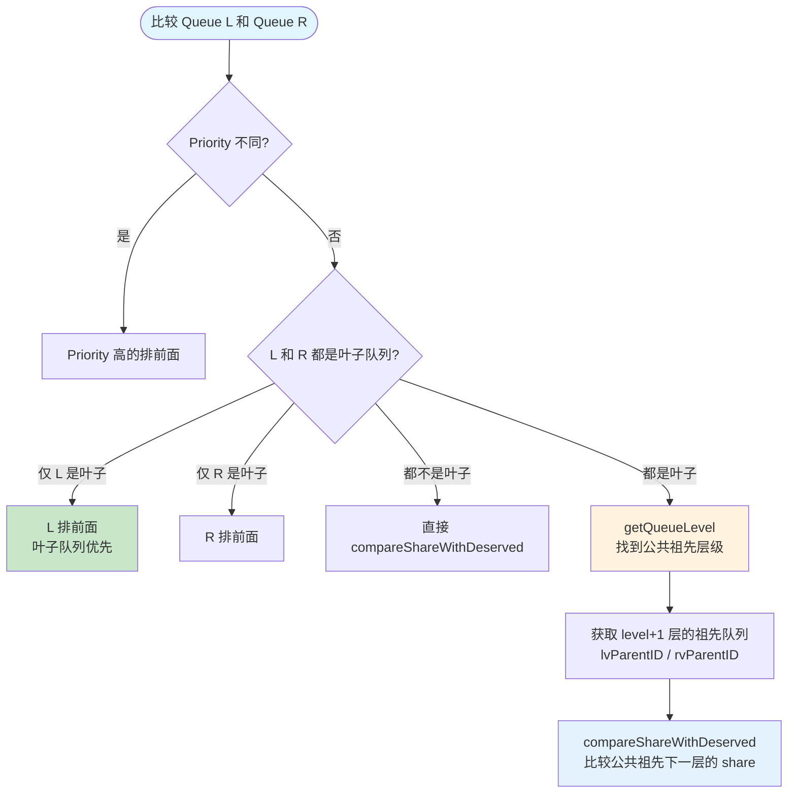

`getQueueLevel` 找到两个队列的**最低公共祖先层级**（即 ancestors 列表中最后一个相同元素的下标）。然后比较各自在该层级下一层的祖先队列的 share。

**示例**：假设 `training`（ancestors: [root, team-a]）和 `batch`（ancestors: [root, team-b]），公共祖先层级为 0（root），则比较 level+1 即 `team-a` 和 `team-b` 的 share。

---

## 5. 注册的扩展点函数

Capacity Plugin 注册了以下扩展点：

| 扩展点 | 注册方法 | 作用阶段 | 核心逻辑 |
|--------|----------|----------|----------|
| **ReclaimableFn** | `AddReclaimableFn` | Reclaim Action | 选择可回收的 victim task |
| **PreemptiveFn** | `AddPreemptiveFn` | Preempt Action | 判断队列能否通过抢占获取资源 |
| **AllocatableFn** | `AddAllocatableFn` | Allocate Action | 检查队列是否有分配额度 |
| **JobEnqueueableFn** | `AddJobEnqueueableFn` | Enqueue Action | 判断 Job 能否进入 Inqueue 状态 |
| **PrePredicateFn** | `AddPrePredicateFn` | Preempt Action | 创建 CycleState 快照 |
| **SimulateAddTaskFn** | `AddSimulateAddTaskFn` | Preempt Action | 在模拟状态上添加 Task |
| **SimulateRemoveTaskFn** | `AddSimulateRemoveTaskFn` | Preempt Action | 在模拟状态上移除 Task |
| **SimulateAllocatableFn** | `AddSimulateAllocatableFn` | Preempt Action | 在模拟状态上检查分配额度 |
| **QueueOrderFn** | `AddQueueOrderFn` | 所有 Action | 队列排序 |
| **VictimQueueOrderFn** | `AddVictimQueueOrderFn` | Preempt Action（仅层级） | Victim 队列排序 |
| **EventHandler** | `AddEventHandler` | 所有 Action | 分配/释放事件追踪 |

### 5.1 ReclaimableFn - 跨队列回收

ReclaimableFn 在 Reclaim Action 中被调用，用于从超额队列中选择可被回收的 task。它执行三重检查：

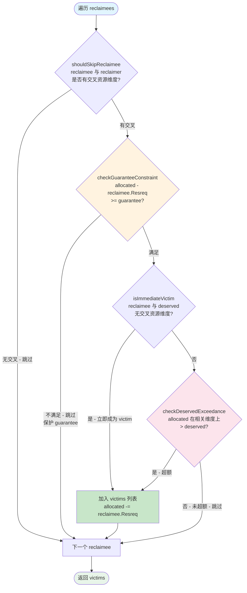

三重检查详解：

1. **shouldSkipReclaimee**：检查 reclaimee 和 reclaimer 的资源请求是否有交集（忽略 ignored scalar resources）。如果没有交集（例如一个请求 GPU 另一个请求 CPU），跳过该 reclaimee
2. **checkGuaranteeConstraint**：检查回收后队列的 allocated 是否仍然不低于 guarantee。guarantee 是队列的资源底线，不可被侵犯
3. **isImmediateVictim / checkDeservedExceedance**：如果 reclaimee 使用的资源维度与 deserved 没有交集，直接认定为 victim；否则需要检查队列在 reclaimee 相关资源维度上是否超出 deserved

关键实现：使用 `allocations` map 维护每个队列的模拟 allocated，每选定一个 victim 就扣减，保证后续 victim 选择基于最新状态。

### 5.2 PreemptiveFn - 抢占准入判断

PreemptiveFn 判断一个队列是否可以通过抢占来获取资源：

```go
futureUsed := attr.allocated.Clone().Add(task.Resreq)
isPreemptive, resourceNames := futureUsed.LessEqualPartlyWithDimensionZeroFiltered(attr.deserved, task.Resreq)
```

核心逻辑：只要**任意一个资源维度**的 `futureUsed <= deserved`，就允许抢占。这与 Proportion 的 `OverusedFn`（要求**所有维度**都满足）形成对比。

**设计原因**：一个队列可能在 CPU 维度超额但 GPU 维度仍有余额，此时仍应允许其为 GPU 任务发起抢占。

### 5.3 AllocatableFn - 分配额度检查

AllocatableFn 在 Allocate Action 中对每个待分配的 task 进行容量检查：

```go
// 三项前置检查
1. Queue 必须处于 Open 状态
2. 层级模式下 Queue 必须是叶子队列
3. checkQueueAllocatableHierarchically：从叶子到根逐层检查
```

`checkQueueAllocatableHierarchically` 从叶子队列向上遍历到 root，每一层都检查 `allocated + task.Resreq <= realCapability`。任何一层不满足则拒绝分配。

### 5.4 JobEnqueueableFn - 入队准入判定

JobEnqueueableFn 决定 Pending Job 能否进入 Inqueue 状态：

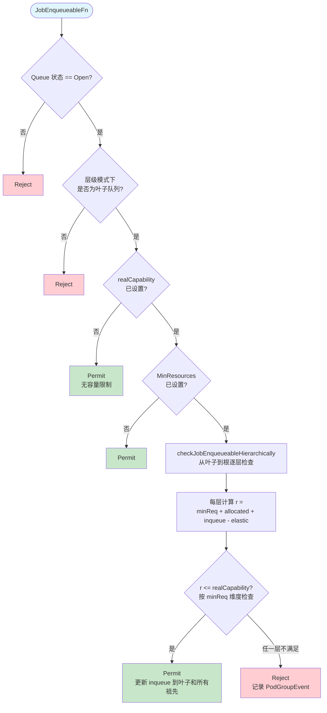

入队成功后，需要更新 inqueue 资源：

```go
attr.inqueue.Add(deductedResources)
// 层级模式下同步更新所有祖先
for _, ancestorID := range attr.ancestors {
    ancestorAttr := cp.queueOpts[ancestorID]
    ancestorAttr.inqueue.Add(deductedResources)
}
```

### 5.5 PrePredicateFn - CycleState 快照创建

PrePredicateFn 在 Preempt Action 的 PrePredicate 阶段被调用，为每个待调度 Task 创建一份所有 queueAttr 的深拷贝（Clone）并存入 CycleState：

```go
ssn.AddPrePredicateFn(cp.Name(), func(task *api.TaskInfo) error {
    state := &capacityState{
        queueAttrs: make(map[api.QueueID]*queueAttr),
    }
    for _, queue := range cp.queueOpts {
        state.queueAttrs[queue.queueID] = queue.Clone()
    }
    ssn.GetCycleState(task.UID).Write(capacityStateKey, state)
    return nil
})
```

### 5.6 SimulateAddTaskFn / SimulateRemoveTaskFn

这两个函数在 CycleState 的快照上操作，不影响真实状态：

- **SimulateAddTaskFn**：`attr.allocated.Add(taskToAdd.Resreq)`，然后更新 share，并向祖先传播
- **SimulateRemoveTaskFn**：`attr.allocated.Sub(taskToRemove.Resreq)`，然后更新 share，并向祖先传播

这使得 Preempt Action 可以安全地模拟"如果驱逐某些 task 并分配目标 task"后的队列状态。

### 5.7 SimulateAllocatableFn

与真实的 AllocatableFn 逻辑相同，但操作对象是 CycleState 中的快照 queueAttrs：

```go
// 从叶子到根逐层检查模拟状态
list := append(state.queueAttrs[queue.UID].ancestors, queue.UID)
for i := len(list) - 1; i >= 0; i-- {
    if !simulateQueueAllocatable(state, ssn.Queues[list[i]], candidate) {
        return false
    }
}
```

### 5.8 EventHandler - AllocateFunc / DeallocateFunc

EventHandler 在每次 task 分配或释放时实时更新队列状态：

```go
AllocateFunc: func(event *framework.Event) {
    attr.allocated.Add(event.Task.Resreq)     // 更新 allocated
    metrics.UpdateQueueAllocated(...)          // 更新指标
    cp.updateShare(attr)                       // 重新计算 share
    // 层级模式：向所有祖先传播
    for _, ancestorID := range attr.ancestors {
        ancestorAttr.allocated.Add(event.Task.Resreq)
    }
}

DeallocateFunc: func(event *framework.Event) {
    attr.allocated.Sub(event.Task.Resreq)      // 更新 allocated
    metrics.UpdateQueueAllocated(...)           // 更新指标
    cp.updateShare(attr)                        // 重新计算 share
    // 层级模式：向所有祖先传播
    for _, ancestorID := range attr.ancestors {
        ancestorAttr.allocated.Sub(event.Task.Resreq)
    }
}
```

这保证了同一调度周期内后续决策基于最新的队列状态。

---

## 6. CycleState 与 Simulate 机制

Preempt Action 需要评估"如果驱逐某些 victim task 并调度目标 task，是否可行"这样的假设性问题。为了不污染真实状态，Capacity Plugin 通过 CycleState 机制实现了独立的模拟空间。

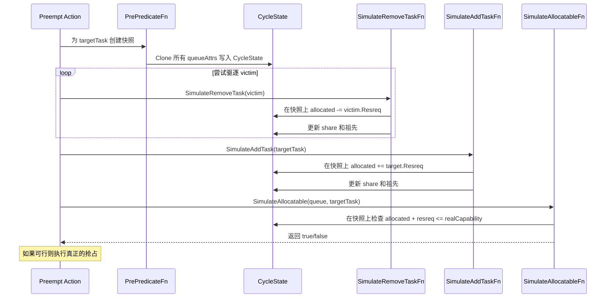

### capacityState 与 Clone 机制

```go
type capacityState struct {
    queueAttrs map[api.QueueID]*queueAttr
}

func (s *capacityState) Clone() fwk.StateData {
    newState := &capacityState{
        queueAttrs: make(map[api.QueueID]*queueAttr, len(s.queueAttrs)),
    }
    for qID, qa := range s.queueAttrs {
        newState.queueAttrs[qID] = qa.Clone()
    }
    return newState
}
```

`queueAttr.Clone()` 对所有 `*api.Resource` 字段执行深拷贝，并复制 ancestors 切片和 children map，确保模拟操作与真实状态完全隔离。

---

## 7. 层级队列示例

### 7.1 队列结构

假设集群总资源为 **100 CPU, 400 GB Memory**，队列层级如下：

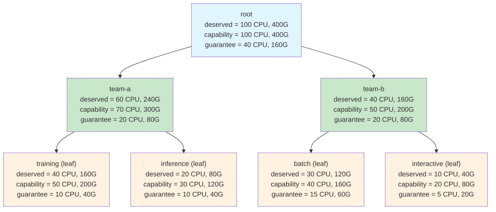

### 7.2 资源流转

当 `training` 队列分配一个 10 CPU 的 Task 时：

| 队列 | allocated (before) | allocated (after) | share (after) |
|------|-------------------|-------------------|---------------|
| training | 30 CPU | **40 CPU** | 40/40 = **1.0** |
| team-a | 45 CPU | **55 CPU** | 55/60 = **0.917** |
| root | 75 CPU | **85 CPU** | 85/100 = **0.85** |

此时 `training` 的 share 达到 1.0，后续调度中优先级降低。team-a 下的 `inference`（假设 share=0.5）将获得更高的调度优先级。

### 7.3 排序示例

比较 `training`（ancestors: [root, team-a]）和 `batch`（ancestors: [root, team-b]）的排序：

1. 两者都是叶子队列，进入公共祖先比较
2. `getQueueLevel` 找到公共祖先层级 = 0（root）
3. 比较 level+1 = 1 层的祖先：`team-a`（share=0.917）vs `team-b`（share=0.75）
4. `team-b` share 更小，因此 `batch` 排在 `training` 前面

---

## 8. Capacity vs Proportion

| 特性 | Proportion Plugin | Capacity Plugin |
|------|-------------------|-----------------|
| **队列模式** | 仅扁平队列 | 扁平队列 + 层级队列 |
| **Deserved 来源** | 加权迭代算法计算 | 直接来自 Queue Spec 配置 |
| **Share 公式** | `max(allocated[r] / deserved[r])` | 相同公式，但 best-effort 固定为 1 |
| **OverusedFn** | 有（所有维度 allocated >= deserved 视为超额） | 无（由 PreemptiveFn 替代） |
| **PreemptiveFn** | 基于 AllocatableFn（所有维度检查） | 基于 LessEqualPartly（单维度即可） |
| **回收保护** | 无 guarantee 保护 | guarantee 不可侵犯 |
| **Victim 选择** | 简单的 allocated > deserved 检查 | 三重检查（资源交集 + guarantee + deserved） |
| **层级传播** | 不支持 | 资源 delta 自动向上传播 |
| **VictimQueueOrderFn** | 不支持 | 基于公共祖先层级排序 |
| **适用场景** | 简单多租户、权重自动计算 | 复杂层级组织、精确配额控制 |

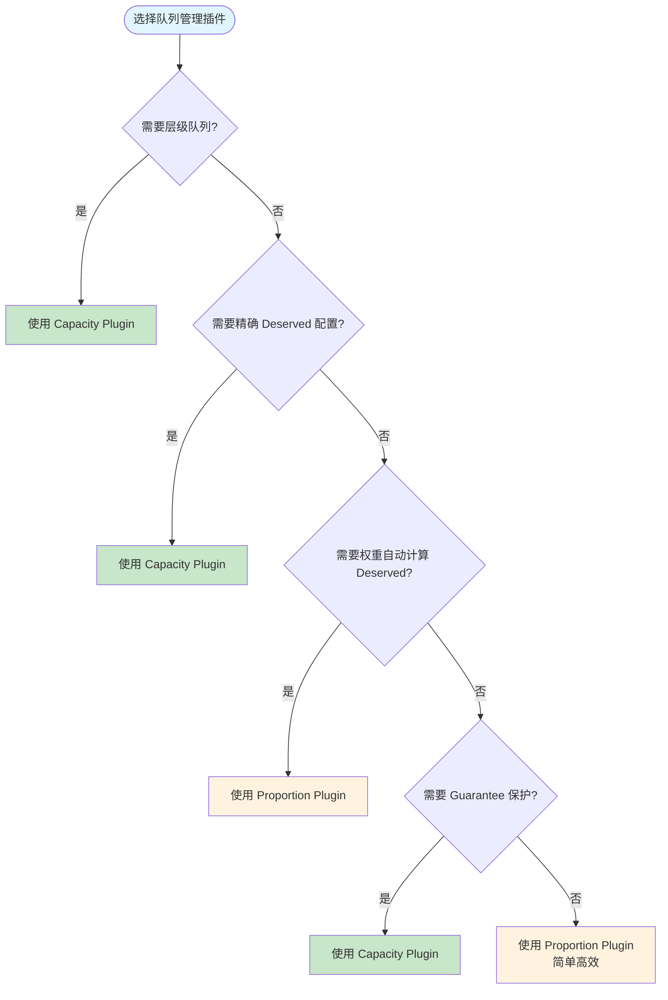

---

## 9. VictimQueueOrderFn（层级模式特有）

VictimQueueOrderFn 决定在 Preempt Action 中，多个可被抢占的队列的优先顺序。其核心逻辑基于 victim 队列与 preemptor 队列的**公共祖先层级**：

```go
ssn.AddVictimQueueOrderFn(cp.Name(), func(l, r, preemptor interface{}) int {
    lLevel := getQueueLevel(cp.queueOpts[lv.UID], cp.queueOpts[pv.UID])
    rLevel := getQueueLevel(cp.queueOpts[rv.UID], cp.queueOpts[pv.UID])
    // level 越大（公共祖先越深），表示与 preemptor 越 "亲近"
    // 亲近的队列排前面（优先被抢占）
    if lLevel > rLevel { return -1 }
    if lLevel < rLevel { return 1 }
    return 0
})
```

**设计原理**：优先从与 preemptor 同一子树下的队列回收资源，减少跨子树的资源调整，维护层级结构的局部性。

`getQueueLevel` 遍历两个队列的 ancestors 列表，找到最后一个相同元素的索引：

```go
func getQueueLevel(l *queueAttr, r *queueAttr) int {
    level := 0
    for i := 0; i < min(len(l.ancestors), len(r.ancestors)); i++ {
        if l.ancestors[i] == r.ancestors[i] {
            level = i
        } else {
            return level
        }
    }
    return level
}
```

---

## 10. 配置参考

### 10.1 Scheduler 配置启用 Capacity Plugin

```yaml
apiVersion: v1
kind: ConfigMap
metadata:
  name: volcano-scheduler-configmap
  namespace: volcano-system
data:
  volcano-scheduler.conf: |
    actions: "enqueue, allocate, reclaim, backfill, preempt"
    tiers:
    - plugins:
      - name: gang
      - name: capacity               # 使用 capacity 替代 proportion
        enabledHierarchy: true        # 启用层级模式（可选）
      - name: predicates
      - name: nodeorder
```

### 10.2 扁平队列配置示例

```yaml
apiVersion: scheduling.volcano.sh/v1beta1
kind: Queue
metadata:
  name: training-queue
spec:
  weight: 1
  deserved:                           # Capacity Plugin 使用 deserved 而非 weight 计算
    cpu: "40"
    memory: "160Gi"
  capability:                         # 资源上限
    cpu: "60"
    memory: "240Gi"
  guarantee:                          # 最低保障
    resource:
      cpu: "10"
      memory: "40Gi"
```

### 10.3 层级队列配置示例

```yaml
# 根队列
apiVersion: scheduling.volcano.sh/v1beta1
kind: Queue
metadata:
  name: root
spec:
  deserved:
    cpu: "100"
    memory: "400Gi"
---
# 中间队列
apiVersion: scheduling.volcano.sh/v1beta1
kind: Queue
metadata:
  name: team-a
spec:
  parent: root                        # 指定父队列
  deserved:
    cpu: "60"
    memory: "240Gi"
  capability:
    cpu: "70"
    memory: "300Gi"
  guarantee:
    resource:
      cpu: "20"
      memory: "80Gi"
---
# 叶子队列（Job 只能提交到叶子队列）
apiVersion: scheduling.volcano.sh/v1beta1
kind: Queue
metadata:
  name: training
spec:
  parent: team-a                      # 指定父队列
  deserved:
    cpu: "40"
    memory: "160Gi"
  capability:
    cpu: "50"
    memory: "200Gi"
  guarantee:
    resource:
      cpu: "10"
      memory: "40Gi"
```

---

## 11. 常见问题

### Q1: Best-effort 队列（无 deserved）如何工作?

当队列未配置 `Spec.Deserved` 时，Capacity Plugin 将其视为 best-effort 队列：
- **share 固定为 1.0**：确保所有有 deserved 且 share < 1 的队列优先调度
- **排序平局处理**：当 share 相同时，有 deserved 的队列优先于 best-effort 队列（通过 `compareShareWithDeserved` 的 tie-breaking 逻辑）
- **回收行为**：best-effort 队列的 task 在 Reclaim 中会被检查 `isImmediateVictim` -- 如果 reclaimee 的资源维度与 deserved 无交集，直接被认定为 victim

### Q2: 子队列 capability 超过父队列会怎样?

`checkHierarchicalQueue` 会检测此情况并记录警告日志，但**不会阻断调度**。实际运行时，子队列的 `realCapability` 受 `ExceededPart(parent.realCapability, totalChildGuarantee) + childGuarantee` 公式约束，因此即使配置了较大的 capability，实际可用资源仍受父队列限制。子队列不配置的 CPU / Memory capability 维度会自动继承父队列的值。

### Q3: realCapability 与 capability 有什么区别?

`capability` 是用户在 Queue Spec 中配置的硬上限。`realCapability` 是 Capacity Plugin 在运行时根据 guarantee 重新计算的实际上限，公式为：

```
realCapability = min(capability, ExceededPart(parentOrTotal, totalSiblingGuarantee) + myGuarantee)
```

`realCapability <= capability` 始终成立。当 guarantee 较小而其他队列 guarantee 总和较大时，realCapability 可能远小于 capability。

### Q4: Capacity Plugin 的 PreemptiveFn 为什么与 Proportion 的逻辑相反?

Proportion 使用 OverusedFn（所有维度都超额才视为超额），Capacity 使用 PreemptiveFn 且逻辑取反 -- **任意一个维度未超额即可抢占**。这是因为 Capacity Plugin 面向更复杂的多维资源场景，单维度的欠缺就应该允许通过抢占补齐。源码注释明确指出：

> PreemptiveFn is the opposite of OverusedFn in proportion plugin cause as long as there is a one-dimensional resource whose deserved is greater than allocated, current task can reclaim by preempt others.

### Q5: 层级模式下 Job 能否提交到非叶子队列?

不能。`buildHierarchicalQueueAttrs` 在遍历 Job 时会检查所属队列是否有 children，如果有（即非叶子队列）会报错并返回 false，导致 `readyToSchedule = false`，阻断整个调度周期。`AllocatableFn` 和 `JobEnqueueableFn` 中也有相同的叶子队列检查。

---

## 12. 下一步

在理解了 Capacity Plugin 的层级队列容量管理机制后，建议继续阅读以下相关内容：

- [Proportion Plugin 详解](./02-proportion-plugin.md) -- 了解 Capacity 所替代/增强的基础队列管理插件，对比两者的 Deserved 计算差异
- [Gang Plugin 详解](./01-gang-plugin.md) -- 理解 Gang 约束如何与 Capacity 的队列容量控制协同工作
- [DRF Plugin 详解](./03-drf-plugin.md) -- Job 级别的 Dominant Resource Fairness，与 Capacity 的 Queue 级别 share 计算互补
