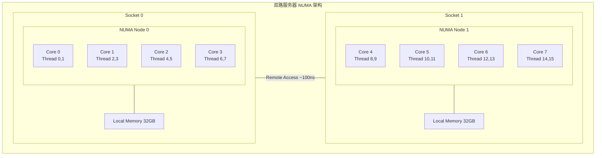
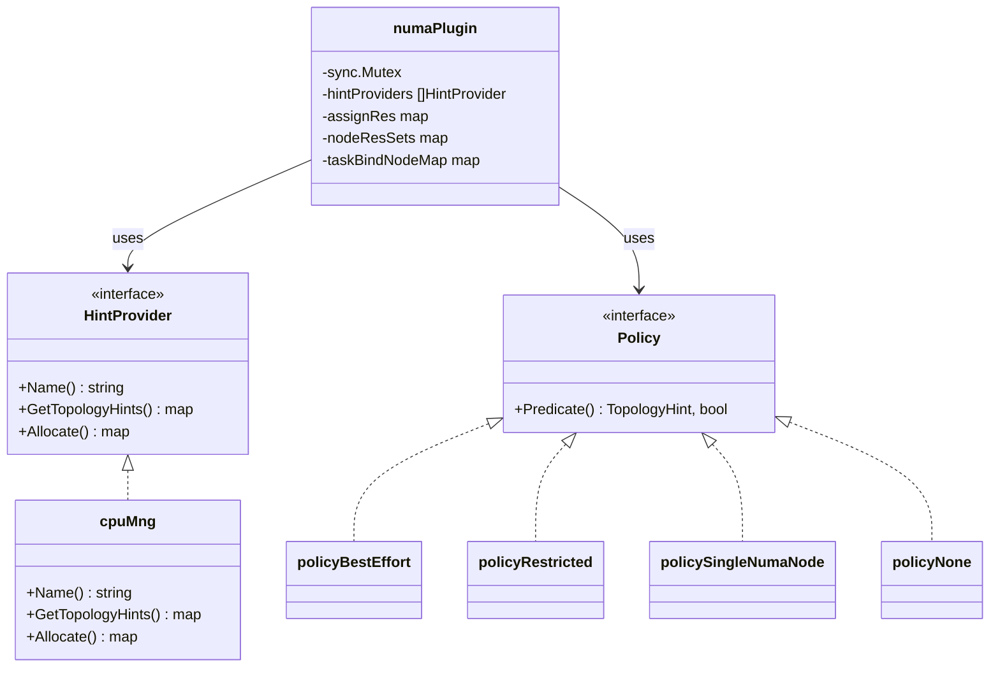
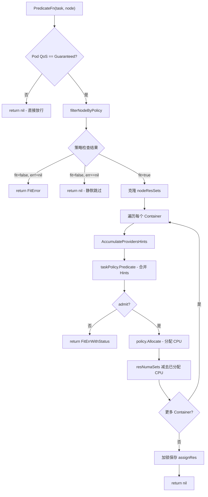
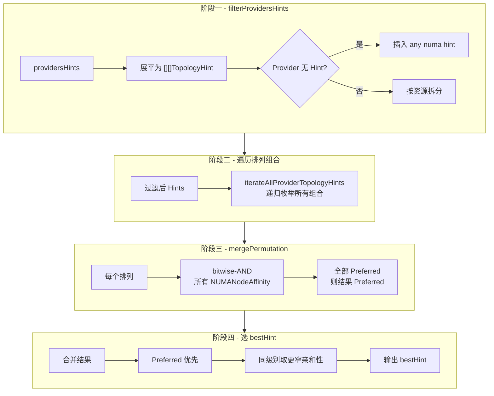
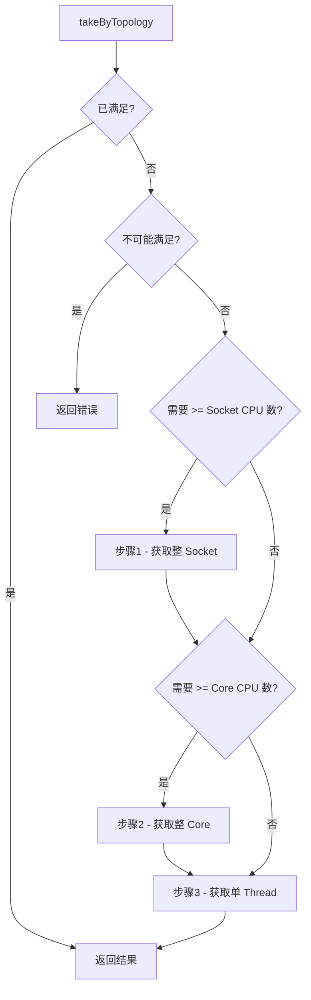
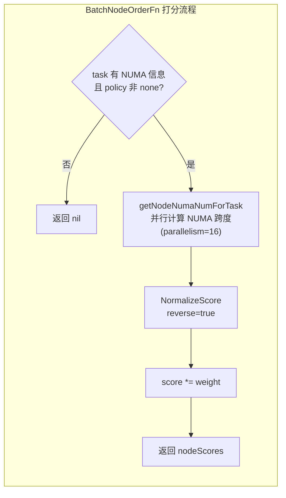
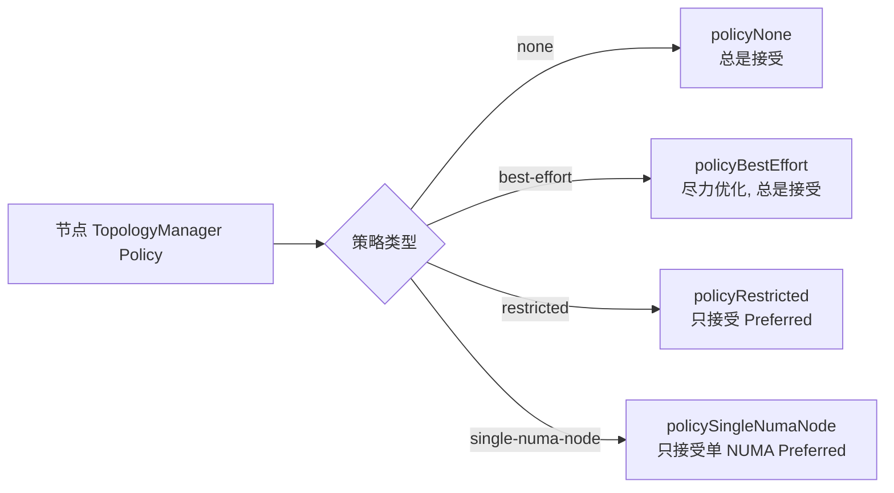
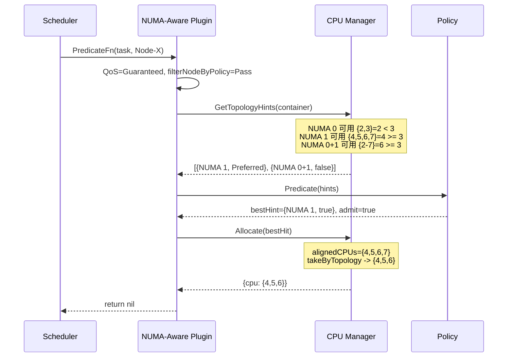

## 1. 概述

NUMA-Aware Plugin 是 Volcano 调度器中实现 **NUMA 拓扑感知调度** 的核心插件。在高性能计算（HPC）、AI/ML 训练等延迟敏感型工作负载中，CPU 与内存之间的物理拓扑关系对应用性能有显著影响。NUMA-Aware Plugin 的核心目标是：**确保 Guaranteed QoS 的 Pod 在调度时，其 CPU 分配尽可能集中在最少的 NUMA 节点上，从而获得最优的内存访问局部性。**

该插件的关键特性：

- **仅对 Guaranteed QoS Pod 生效**：通过 `v1qos.GetPodQOS` 检查，只有 requests == limits 且为整数 CPU 的 Pod 才会经过 NUMA 感知调度
- **Predicate 过滤**：根据 Topology Manager Policy 过滤不兼容的节点，并为每个容器执行 NUMA 亲和性检查
- **BatchNodeOrderFn 评分**：跨 NUMA 节点数量越少的分配方案得分越高
- **EventHandler 状态追踪**：通过 Allocate/Deallocate 事件维护运行时的 NUMA 资源占用状态

> **源码参考**：`pkg/scheduler/plugins/numaaware/numaaware.go`、`pkg/scheduler/plugins/numaaware/policy/`、`pkg/scheduler/plugins/numaaware/provider/cpumanager/`

---

## 2. NUMA 拓扑基础知识

NUMA（Non-Uniform Memory Access）是现代多处理器服务器的内存架构。每个 CPU Socket 拥有本地内存，访问本地内存约 70ns；跨 NUMA 访问约 100-140ns，延迟增加 40%-100%。



CPU 拓扑从高到低分为四个层级：**Socket -> NUMA Node -> Core -> Thread（HyperThread）**。跨 NUMA 访问带来的性能问题包括：内存延迟增大、互联总线带宽争抢、Cache 一致性开销增大、NUMA Balancing 抖动。

Kubernetes kubelet 的 Topology Manager 支持四种策略：

| 策略 | 值 | 行为 |
|------|------|------|
| **none** | `"none"` | 不做 NUMA 感知 |
| **best-effort** | `"best-effort"` | 尽力优化，不保证 |
| **restricted** | `"restricted"` | 只接受 Preferred Hint |
| **single-numa-node** | `"single-numa-node"` | 要求资源在单个 NUMA 节点内分配 |

---

## 3. Plugin 结构体

```go
type numaPlugin struct {
    sync.Mutex
    pluginArguments framework.Arguments
    hintProviders   []policy.HintProvider
    assignRes       map[api.TaskID]map[string]api.ResNumaSets  // map[taskUID]map[nodeName]ResNumaSets
    nodeResSets     map[string]api.ResNumaSets                 // map[nodeName]ResNumaSets
    taskBindNodeMap map[api.TaskID]string                       // map[taskUID]nodeName
}
```

| 字段 | 说明 |
|------|------|
| `sync.Mutex` | 保护 `assignRes` 的并发写入 |
| `hintProviders` | Topology Hint 提供者列表，默认只有 `cpumanager.NewProvider()` |
| `assignRes` | 每个 Task 在每个候选 Node 上的 CPU 分配结果（Predicate 阶段填充） |
| `nodeResSets` | 每个节点的空闲 NUMA 资源集合（CPU Set） |
| `taskBindNodeMap` | 最终绑定关系，由 EventHandler 的 AllocateFunc 写入 |



---

## 4. Session 初始化（OnSessionOpen）

`OnSessionOpen` 在每个调度周期开始时执行，完成以下工作：

1. **解析权重**：`calculateWeight` 从配置读取 `weight` 参数（默认 1）
2. **生成 NUMA 拓扑**：调用 `api.GenerateNumaNodes` 和 `api.GenerateNodeResNumaSets` 初始化节点 NUMA 信息
3. **注册 EventHandler**：AllocateFunc 从 `nodeResSets` 扣减 CPU 并写入 `taskBindNodeMap`；DeallocateFunc 归还 CPU 并清除绑定
4. **注册 PredicateFn**：NUMA 感知过滤与 CPU 分配
5. **注册 BatchNodeOrderFn**：基于 NUMA 跨度的节点评分

EventHandler 的核心作用是维护 `nodeResSets` 的实时状态：当 Statement 确认分配时扣减资源，回滚时归还资源，确保多个 Task 间的 NUMA 分配不冲突。

---

## 5. Predicate 函数 - 核心调度逻辑



### 5.1 filterNodeByPolicy

该函数根据 Task 和 Node 的拓扑策略配置过滤节点：

**Task 有 NUMA 策略（非 none/空）时**，必须满足：节点有 `NumaSchedulerInfo`、CPUManager Policy 为 `"static"`、TopologyManager Policy 与 Task 一致、CPU 可分配集合非空。不满足返回 `fit=false, err=具体原因`。

**Task 无 NUMA 策略时**，若节点条件不符返回 `fit=false, err=nil`（静默跳过）。

### 5.2 Per-Container NUMA 分配

对 Pod 中每个 Container 依次执行：
1. `AccumulateProvidersHints` 收集所有 HintProvider 的 Topology Hints
2. `taskPolicy.Predicate` 合并 Hints 选出最佳，判断是否可接受
3. `policy.Allocate` 根据 bestHint 选取具体 CPU ID
4. 从 `resNumaSets` 中减去已分配 CPU，保证下一个 Container 不冲突

---

## 6. Topology Hint 合并算法

### 6.1 TopologyHint 结构

```go
type TopologyHint struct {
    NUMANodeAffinity bitmask.BitMask  // 位掩码, 每位代表一个 NUMA 节点
    Preferred        bool              // 是否为优选方案
}
```

### 6.2 合并流程



### 6.3 位运算示例

假设 CPU Provider 生成 `{0b01, Preferred}` 和 `{0b11, false}`，GPU Provider 生成 `{0b01, Preferred}` 和 `{0b10, Preferred}`：

| 组合 | CPU Hint | GPU Hint | AND 结果 | Preferred | 说明 |
|------|----------|----------|---------|-----------|------|
| P1 | `0b01` | `0b01` | `0b01` | true | 全在 NUMA 0 |
| P2 | `0b01` | `0b10` | `0b00` | - | 交集为空, 丢弃 |
| P3 | `0b11` | `0b01` | `0b01` | false | CPU 非 Preferred |
| P4 | `0b11` | `0b10` | `0b10` | false | CPU 非 Preferred |

最终选择 P1（Preferred 且最窄）。选择规则：Preferred > Non-preferred > 更窄亲和性（更少 NUMA 节点）胜出。

---

## 7. CPU Manager - Hint 生成与 CPU 分配

### 7.1 Hint 生成

`generateCPUTopologyHints` 遍历所有 NUMA 节点子集组合（`bitmask.IterateBitMasks`），对每个子集检查可用 CPU 是否满足请求。满足则生成 TopologyHint，使用最少 NUMA 节点数的标记为 Preferred。

### 7.2 takeByTopology 拓扑感知 CPU 选取



三步贪心策略：先取整 Socket，再取整 Core，最后取单 Thread。优先填充同 Socket 已部分分配的 Core，最大化拓扑局部性。

### 7.3 Allocate 方法

根据 bestHint 的 `NUMANodeAffinity` 筛选对齐 CPU，使用 `takeByTopology` 选取所需数量。如果对齐 CPU 不够，从剩余可用 CPU 中补充。

---

## 8. BatchNodeOrderFn - 节点打分



`getNodeNumaNumForTask` 统计每个节点上已分配 CPU 横跨的 NUMA 节点数。`NormalizeScore` 使用 `reverse=true`，跨度越小得分越高：

| 节点 | CPU 分配 | NUMA 跨度 | 归一化后 |
|------|---------|----------|---------|
| Node-A | 全在 NUMA 0 | 1 | 最高分 |
| Node-B | 跨 NUMA 0+1 | 2 | 较低分 |

---

## 9. OnSessionClose - 状态更新

在调度周期结束时，将 `taskBindNodeMap` 中所有已绑定 Task 的 CPU 分配按节点聚合，调用 `ssn.UpdateSchedulerNumaInfo` 写回，供下一周期使用。若无 Task 被绑定则直接返回。

---

## 10. Policy 实现详解



| 策略 | canAdmitPodResult | 特殊处理 |
|------|-------------------|---------|
| **policyNone** | 始终 true | 不做 Hint 合并，直接返回空 Hint |
| **policyBestEffort** | 始终 true | 合并 Hints 选最优，non-preferred 也接受 |
| **policyRestricted** | `hint.Preferred` | 合并 Hints，无 Preferred Hint 则拒绝 |
| **policySingleNumaNode** | `hint.Preferred` | 额外 `filterSingleNumaHints` 只保留 Count==1 的 Hint |

`policySingleNumaNode` 的 `filterSingleNumaHints` 只保留 `NUMANodeAffinity.Count() == 1 && Preferred` 的 Hint，确保资源完全在单个 NUMA 节点内分配。

---

## 11. 完整调度流程示例

**场景**：Node-X 有 2 个 NUMA 节点各 4 CPU（NUMA 0: CPU 0-3, NUMA 1: CPU 4-7），CPU 0,1 已被占用，Task 请求 3 CPU，策略 best-effort。



3 个 CPU 全部在 NUMA 1 内，内存局部性最优。若 `single-numa-node` 策略下 NUMA 1 仅 2 个可用 CPU，该节点会被拒绝；`best-effort` 则接受跨 NUMA 方案。

---

## 12. 配置参考

```yaml
actions: "enqueue, allocate, preempt, backfill"
tiers:
- plugins:
  - name: numa-aware
    arguments:
      weight: 10
```

```yaml
apiVersion: batch.volcano.sh/v1alpha1
kind: Job
spec:
  tasks:
  - replicas: 1
    topologyPolicy: "best-effort"   # none | best-effort | restricted | single-numa-node
    template:
      spec:
        containers:
        - name: worker
          resources:
            requests:
              cpu: "4"              # 必须为整数
              memory: "8Gi"
            limits:
              cpu: "4"              # limits == requests -> Guaranteed QoS
              memory: "8Gi"
```

节点要求：kubelet `--cpu-manager-policy=static`、`--topology-manager-policy` 与 Task 策略一致、resource-exporter 上报 Numatopo CRD。

---

## 13. 与其他 Plugin 的协作

- **Predicates Plugin**：先执行基本过滤（资源充足性、NodeSelector 等），NUMA-Aware 再做拓扑兼容性检查
- **Binpack / Nodeorder Plugin**：Scoring 阶段分数累加，通过 `weight` 控制 NUMA 感知权重
- **EventHandler**：Statement Allocate/Discard 时触发 CPU 资源的扣减/归还

---

## 14. 常见问题

**Q1: 为什么只对 Guaranteed QoS Pod 生效？**
CPU 独占分配（Pinning）要求 kubelet CPU Manager Policy 为 static，该模式下仅 Guaranteed Pod（requests == limits 且 CPU 为整数）才获得独占 CPU。

**Q2: 没有单个 NUMA 节点能容纳请求怎么办？**
取决于策略：best-effort 接受跨 NUMA 方案；restricted 和 single-numa-node 拒绝该节点。

**Q3: 如何与 kubelet CPU Pinning 交互？**
调度阶段选最优 CPU 集合，`OnSessionClose` 通过 `UpdateSchedulerNumaInfo` 持久化。kubelet 的 CPU Manager 执行实际 Pinning，两者策略需一致。

**Q4: assignRes 为什么记录所有候选 Node 的分配？**
PredicateFn 对每个候选 Node 调用一次并模拟分配，结果用于 BatchNodeOrderFn 评分。Statement.Allocate 确认后 EventHandler 才实际扣减资源。

**Q5: 并发安全如何保障？**
`assignRes` 写入通过 `sync.Mutex` 保护。`nodeResSets` 在 Predicate 中使用 Clone 副本；EventHandler 回调在 Statement 提交时顺序执行。

---

## 15. 下一步

- 前一篇：[Binpack Plugin 详解](./06-binpack-plugin.md) -- 资源紧凑放置评分策略
- 相关参考：[Predicates Plugin 详解](./04-predicates-plugin.md) -- Kubernetes 原生过滤检查
- 相关参考：[Nodeorder Plugin 详解](./05-nodeorder-plugin.md) -- 其他维度的节点评分
