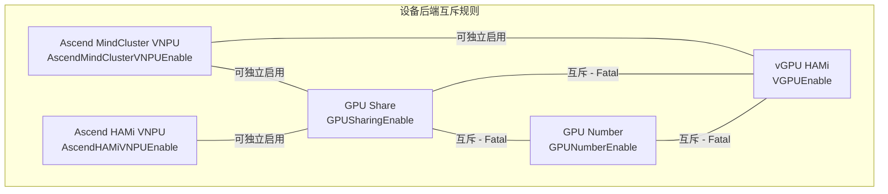
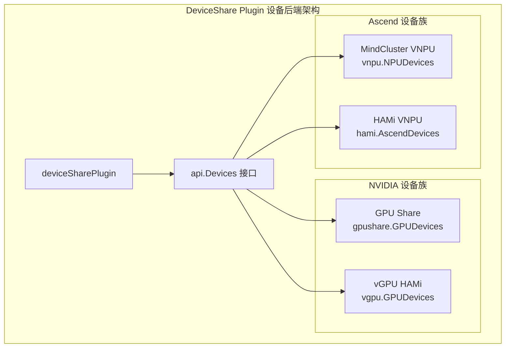
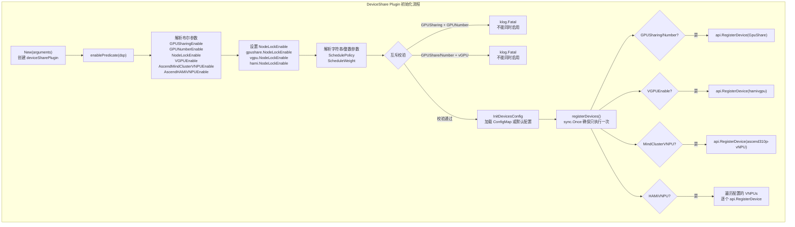
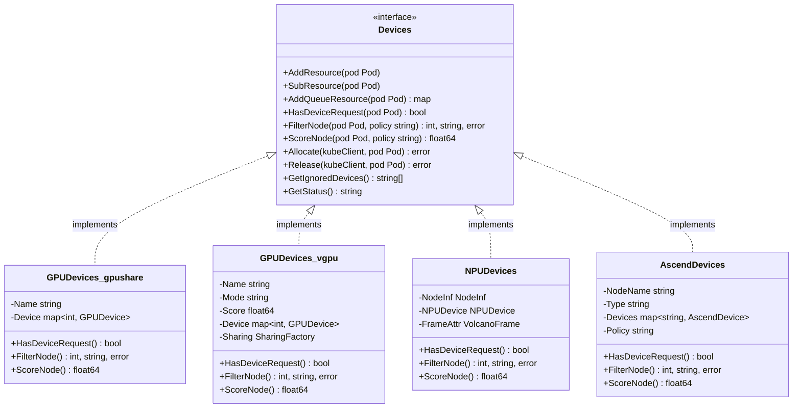
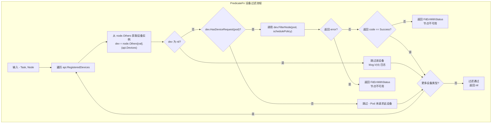
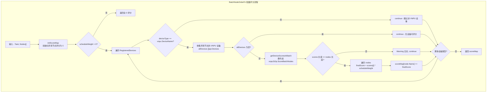
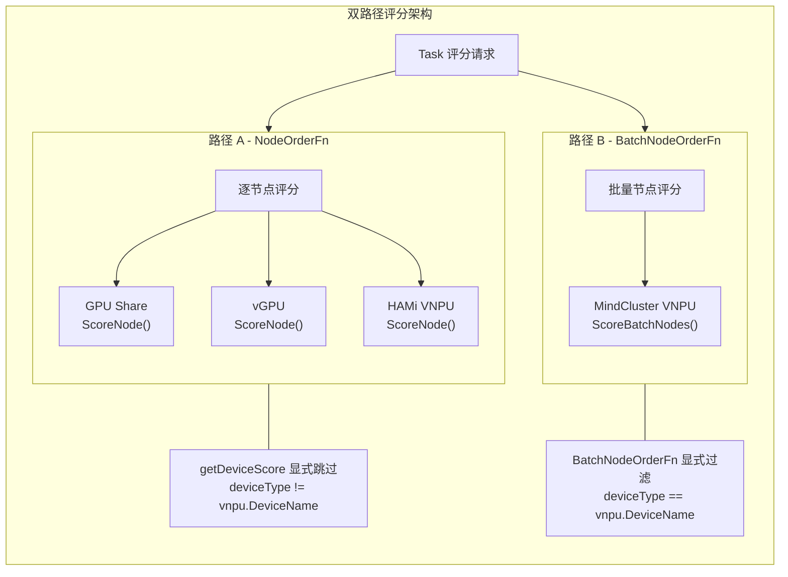
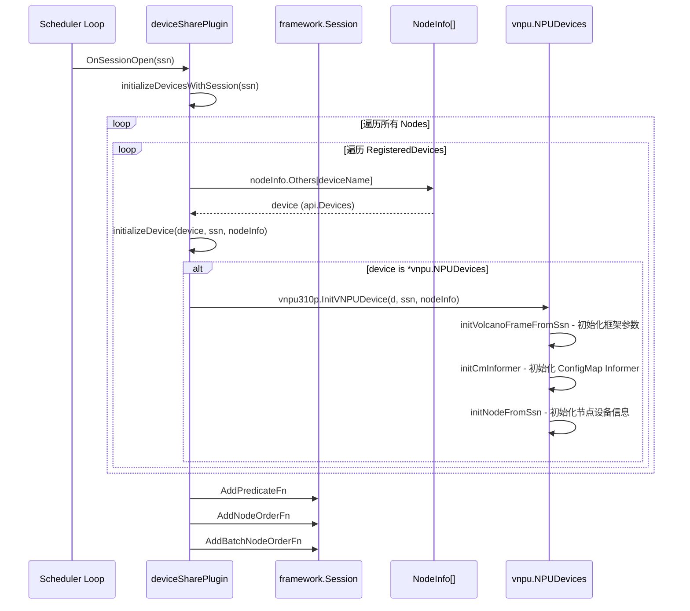
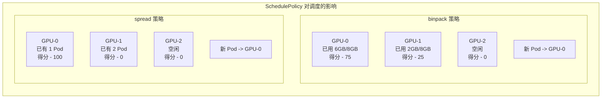
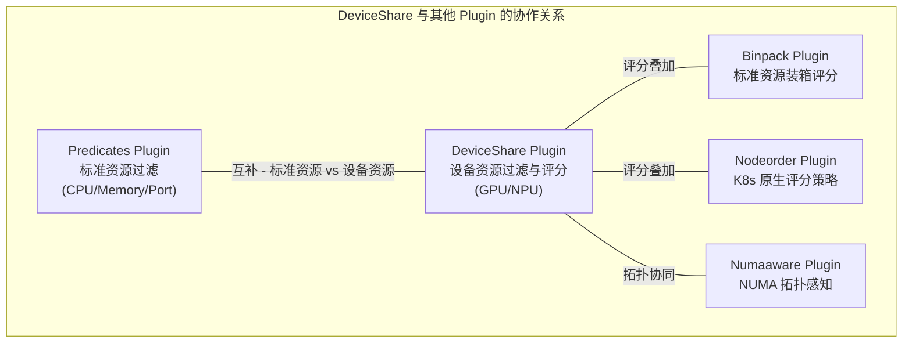

## 1. 概述

DeviceShare Plugin 是 Volcano 调度器中负责 **GPU/NPU 设备共享调度** 的核心插件。它使多个 Pod 能够共享同一块物理 GPU 或 NPU 设备，从而最大化昂贵异构计算硬件的利用率。在 AI/ML 推理、模型开发调试等场景中，单个任务往往无法充分利用整块 GPU 的算力和显存，DeviceShare Plugin 通过细粒度的设备资源切分与调度，让多个轻量级任务复用同一设备。

该插件支持多种设备后端：

- **NVIDIA GPU Share** -- 基于 GPU 显存切分的多 Pod 共享
- **NVIDIA GPU Number** -- 基于整卡数量的 GPU 分配
- **NVIDIA vGPU (HAMi)** -- 基于虚拟化的 GPU 隔离与共享
- **Ascend MindCluster VNPU** -- 华为昇腾 310P NPU 的虚拟化切分
- **Ascend HAMi VNPU** -- 基于 HAMi 框架的昇腾 NPU 共享

插件通过 `PredicateFn`、`NodeOrderFn` 和 `BatchNodeOrderFn` 三个扩展点参与调度决策，实现设备级别的过滤与评分。

> **源码参考**：`pkg/scheduler/plugins/deviceshare/deviceshare.go`（317 行）

---

## 2. 支持的设备后端

### 2.1 后端总览

| 后端名称 | 启用标志 | DeviceName | 实现类型 | 使用场景 |
|---------|---------|-----------|---------|---------|
| GPU Share | `GPUSharingEnable` | `GpuShare` | `gpushare.GPUDevices` | 多 Pod 按 GPU 显存共享 |
| GPU Number | `GPUNumberEnable` | `GpuShare` | `gpushare.GPUDevices` | 按整卡数量分配 GPU |
| vGPU (HAMi) | `VGPUEnable` | `hamivgpu` | `vgpu.GPUDevices` | 虚拟 GPU，支持显存和算力隔离 |
| Ascend MindCluster VNPU | `AscendMindClusterVNPUEnable` | `ascend310p-vNPU` | `vnpu.NPUDevices` | 华为昇腾 310P 虚拟 NPU 切分 |
| Ascend HAMi VNPU | `AscendHAMiVNPUEnable` | 动态（由配置决定） | `hami.AscendDevices` | HAMi 框架下的昇腾 NPU 共享 |

### 2.2 互斥规则

设备后端之间存在严格的互斥约束：



关键约束：
- `GPUSharingEnable` 和 `GPUNumberEnable` **不能同时为 true** -- 触发 `klog.Fatal`
- `GPUSharingEnable`/`GPUNumberEnable` 和 `VGPUEnable` **不能同时为 true** -- 触发 `klog.Fatal`
- Ascend VNPU 后端（MindCluster 和 HAMi）与 NVIDIA 后端可以并存

### 2.3 设备后端层级架构



---

## 3. Plugin 结构体与初始化

### 3.1 核心结构体

```go
type deviceSharePlugin struct {
    pluginArguments framework.Arguments  // 插件参数
    schedulePolicy  string               // 调度策略（binpack/spread）
    scheduleWeight  int                  // 设备评分权重乘数
}
```

`deviceSharePlugin` 是一个轻量级结构体，仅持有配置参数而不维护设备状态。设备状态由各后端的 `Devices` 实现自行管理，存储在 `NodeInfo.Others` 中。

### 3.2 初始化流程



关键细节：

- `registerDevices()` 使用 `sync.Once` 保护，即使 Plugin 被多次实例化也只注册一次
- `NodeLockEnable` 是一个共享标志，同时设置给 `gpushare`、`vgpu` 和 `hami` 三个包
- `InitDevicesConfig` 会尝试从 Kubernetes ConfigMap 加载设备配置；若失败则使用默认配置
- HAMi VNPU 的设备名称是动态的，由 ConfigMap 中的 `vnpus[].commonWord` 字段决定

### 3.3 ConfigMap 配置

设备配置通过名为 `volcano-vgpu-device-config`（默认）的 ConfigMap 加载，位于 `kube-system` 命名空间。其格式如下：

```yaml
# ConfigMap data key: device-config.yaml
nvidia:
  resourceCountName: "volcano.sh/vgpu"
  resourceMemoryName: "volcano.sh/vgpu-memory"
  resourceCoreName: "volcano.sh/vgpu-cores"
  deviceSplitCount: 10
  deviceMemoryScaling: 1
vnpus:
- chipName: 310P3
  commonWord: Ascend310P
  resourceName: huawei.com/Ascend310P
  resourceMemoryName: huawei.com/Ascend310P-memory
  memoryAllocatable: 21527
  memoryCapacity: 24576
  aiCore: 8
  aiCPU: 7
  templates:
    - name: vir01
      memory: 3072
      aiCore: 1
      aiCPU: 1
    - name: vir04
      memory: 12288
      aiCore: 4
      aiCPU: 4
```

---

## 4. Devices 接口

所有设备后端必须实现 `api.Devices` 接口，这是 DeviceShare Plugin 与具体设备实现之间的契约。

### 4.1 接口定义

```go
type Devices interface {
    // 缓存管理 -- 用于 NodeInfo 维护
    AddResource(pod *v1.Pod)                          // 将 Pod 设备使用量添加到缓存
    SubResource(pod *v1.Pod)                          // 从缓存中减去 Pod 设备使用量
    AddQueueResource(pod *v1.Pod) map[string]float64  // 将设备资源计入 Queue 已分配

    // 调度决策 -- 用于 Predicate 和 Score
    HasDeviceRequest(pod *v1.Pod) bool                              // 检查 Pod 是否请求此设备
    FilterNode(pod *v1.Pod, policy string) (int, string, error)     // 过滤节点
    ScoreNode(pod *v1.Pod, policy string) float64                   // 评分节点

    // 分配与释放 -- 用于 Bind 阶段
    Allocate(kubeClient kubernetes.Interface, pod *v1.Pod) error    // 分配设备
    Release(kubeClient kubernetes.Interface, pod *v1.Pod) error     // 释放设备

    // 辅助功能
    GetIgnoredDevices() []string  // 返回需要调度器忽略的设备资源名
    GetStatus() string            // 调试和监控
}
```

### 4.2 接口实现关系



### 4.3 FilterNode 返回码

| 返回码 | 常量名 | 含义 |
|-------|--------|------|
| 0 | `Success` | 插件检查通过，Pod 可调度到该节点 |
| 1 | `Error` | 插件内部错误或非预期输入 |
| 2 | `Unschedulable` | Pod 不可调度到该节点，但可通过抢占解决 |
| 3 | `UnschedulableAndUnresolvable` | Pod 不可调度且抢占也无法解决 |

---

## 5. PredicateFn - 设备过滤

DeviceShare Plugin 注册的 `PredicateFn` 负责检查候选节点上的设备是否满足 Pod 的设备请求。

### 5.1 过滤逻辑流程



关键行为：

- 遍历所有已注册的设备类型，而非仅检查 Pod 请求的设备
- **短路逻辑**：任何一种设备的 FilterNode 失败即立即返回，不继续检查其他设备类型
- `HasDeviceRequest` 是前置过滤 -- 如果 Pod 没有请求某种设备，则跳过该设备的 FilterNode
- `schedulePolicy` 参数透传给各设备后端，用于影响评分（某些后端在 Filter 阶段会缓存评分，如 vGPU）

### 5.2 各后端的 HasDeviceRequest 判定

| 后端 | 判定条件 |
|------|---------|
| GPU Share | Pod 容器 Limits 中包含 `volcano.sh/gpu-memory`（GpuSharingEnable）或 `volcano.sh/gpu-number`（GpuNumberEnable）|
| vGPU | Pod 容器 Limits 中包含 vGPU 相关资源（如 `volcano.sh/vgpu`）|
| Ascend MindCluster VNPU | Pod 容器 Limits 中包含 `huawei.com/Ascend310P` 等昇腾资源 |
| Ascend HAMi VNPU | Pod 容器 Limits 中包含配置的 `resourceName` 或 `resourceMemoryName` |

---

## 6. NodeOrderFn - 节点评分（单设备路径）

`NodeOrderFn` 负责为 **非 VNPU 设备**（GPU Share、vGPU、HAMi VNPU）进行逐节点评分。

### 6.1 评分逻辑

```go
func getDeviceScore(ctx context.Context, pod *v1.Pod, node *api.NodeInfo, schedulePolicy string) (int64, *fwk.Status) {
    s := float64(0)
    for deviceType, device := range node.Others {
        if device.(api.Devices).HasDeviceRequest(pod) {
            // 显式跳过 vnpu.DeviceName -- VNPU 使用 BatchNodeOrderFn
            if deviceType != vnpu.DeviceName {
                ns := device.(api.Devices).ScoreNode(pod, schedulePolicy)
                s += ns
            }
        }
    }
    return int64(math.Floor(s + 0.5)), nil  // 四舍五入
}
```

### 6.2 评分公式

```
最终得分 = deviceScore * scheduleWeight
```

其中 `deviceScore` 是各设备后端 `ScoreNode` 返回值的累加。

评分的具体含义取决于设备后端：

| 后端 | ScoreNode 行为 |
|------|---------------|
| GPU Share | 返回 0（未实现评分逻辑） |
| vGPU | 返回 Filter 阶段缓存的 `gs.Score`，避免重复计算 |
| HAMi VNPU | 根据 binpack/spread 策略计算设备利用率评分 |

### 6.3 重要细节

- 当 `scheduleWeight == 0` 时，`NodeOrderFn` 立即返回 0 分，不执行评分计算
- 评分使用 `math.Floor(s + 0.5)` 进行四舍五入取整
- vGPU 的 `ScoreNode` 直接返回缓存值，这是因为 vGPU 在 `FilterNode` 阶段已经完成了评分计算并缓存在 `gs.Score` 中

---

## 7. BatchNodeOrderFn - 批量评分（VNPU 路径）

`BatchNodeOrderFn` 专门为 **Ascend MindCluster VNPU** 设备提供批量节点评分能力。

### 7.1 为什么 VNPU 需要批量评分

VNPU 的调度需要进行 **跨节点比较** 来实现全局最优的 Geometry 分配。不同于 GPU Share 只需要在单节点维度判断显存是否充足，VNPU 需要：

1. 收集所有候选节点的设备状态
2. 按空闲资源排序找到最优节点
3. 考虑降级历史（DowngradeCache）避免重复降级
4. 基于全局视图计算评分

这种跨节点的全局优化无法在逐节点评分的 `NodeOrderFn` 中实现。

### 7.2 批量评分流程



### 7.3 ScoreBatchNodes 核心算法

`vnpu310p.ScoreBatchNodes` 的评分逻辑如下：

1. **收集邻居节点信息**：从所有候选设备中提取 `NodeInf` 和降级缓存
2. **按空闲资源排序**：调用 `orderVNodesByFreeResource` 将节点按 NPU Core 空闲量升序排列（空闲资源最少的排前面，体现 binpack 思想）
3. **评分逻辑**：
   - 若无降级历史：给排序后第一个节点（空闲资源最少）加 8 分
   - 若有降级历史：跳过已降级节点，给第一个未降级节点加 16 分，已降级节点加 8 分

---

## 8. 双路径评分架构

DeviceShare Plugin 采用双路径评分架构，将不同设备类型的评分逻辑分别路由到不同的扩展点。

### 8.1 路径分离规则



### 8.2 分离原因

| 维度 | NodeOrderFn（路径 A） | BatchNodeOrderFn（路径 B） |
|------|---------------------|-------------------------|
| **评分粒度** | 单节点独立评分 | 全局批量评分 |
| **设备类型** | GPU Share, vGPU, HAMi VNPU | MindCluster VNPU |
| **跨节点比较** | 不需要 | 需要（Geometry 优化） |
| **降级历史** | 不涉及 | 需要考虑 DowngradeCache |
| **调用方式** | 每个 Task-Node 配对调用一次 | 每个 Task 调用一次，传入所有候选 Nodes |

代码层面的关键分离点：
- `getDeviceScore` 函数中：`if deviceType != vnpu.DeviceName` -- 跳过 VNPU
- `BatchNodeOrderFn` 中：`if deviceType != vnpu.DeviceName { continue }` -- 只处理 VNPU

---

## 9. Session 初始化与设备初始化

### 9.1 OnSessionOpen 流程



### 9.2 initializeDevice 类型分发

`initializeDevice` 使用 type switch 进行设备类型分发，目前仅处理 `*vnpu.NPUDevices`：

```go
func initializeDevice(device api.Devices, ssn *framework.Session, nodeInfo *api.NodeInfo) error {
    switch d := device.(type) {
    case *vnpu.NPUDevices:
        if vnpu.AscendMindClusterVNPUEnable {
            return vnpu310p.InitVNPUDevice(d, ssn, nodeInfo)
        }
    }
    return nil
}
```

其他设备后端（GPU Share、vGPU、HAMi VNPU）不需要 Session 级别的初始化 -- 它们的状态完全由节点注解和 Pod 注解驱动。

### 9.3 OnSessionClose

`OnSessionClose` 为空实现 -- 插件是**每 Session 无状态**的，不需要清理工作。

---

## 10. Schedule Policy 配置

### 10.1 SchedulePolicy

`SchedulePolicy` 控制设备评分策略，目前支持两种：

| 策略 | 行为 | 适用场景 |
|------|------|---------|
| `binpack` | 偏好设备利用率高的节点，将 Pod 集中放置 | 减少设备碎片，提高单设备利用率 |
| `spread` | 偏好空闲设备的节点，将 Pod 分散放置 | 避免单设备过载，提高隔离性 |

### 10.2 评分策略在各后端的实现

以 HAMi VNPU（`hami.CalScore`）为例：

```go
func CalScore(schedulePolicy string, dev_usage *DeviceUsage, dev_info *DeviceInfo) float64 {
    switch schedulePolicy {
    case "binpack":
        // 已用显存占比越高，分数越高
        score = 100 * (dev_usage.Usedmem / dev_info.Devmem)
    case "spread":
        // 设备已被使用（正好 1 个任务）时得 100 分
        if dev_usage.Used == 1 { score = 100 }
    default:
        score = 0
    }
}
```

### 10.3 策略对调度的影响



### 10.4 ScheduleWeight

`ScheduleWeight` 是设备评分的全局乘数。最终设备得分 = 原始设备评分 * ScheduleWeight。设为 0 时等效于禁用设备评分。

---

## 11. 配置参考

### 11.1 完整配置示例

```yaml
actions: "enqueue, allocate, preempt, reclaim, backfill"
tiers:
- plugins:
  - name: deviceshare
    arguments:
      # NVIDIA GPU Share 模式
      deviceshare.GPUSharingEnable: "true"
      deviceshare.GPUNumberEnable: "false"
      # NVIDIA vGPU 模式（与 GPUSharing/GPUNumber 互斥）
      deviceshare.VGPUEnable: "false"
      # Ascend MindCluster VNPU
      deviceshare.AscendMindClusterVNPUEnable: "false"
      # Ascend HAMi VNPU
      deviceshare.AscendHAMiVNPUEnable: "false"
      # 通用配置
      deviceshare.NodeLockEnable: "true"
      deviceshare.SchedulePolicy: "binpack"
      deviceshare.ScheduleWeight: "10"
      # ConfigMap 配置（可选）
      deviceshare.KnownGeometriesCMName: "volcano-vgpu-device-config"
      deviceshare.KnownGeometriesCMNamespace: "kube-system"
```

### 11.2 参数详解

| 参数 | 类型 | 默认值 | 说明 |
|------|------|--------|------|
| `deviceshare.GPUSharingEnable` | bool | `false` | 启用基于 GPU 显存的多 Pod 共享 |
| `deviceshare.GPUNumberEnable` | bool | `false` | 启用基于整卡数量的 GPU 分配 |
| `deviceshare.VGPUEnable` | bool | `false` | 启用 HAMi vGPU 虚拟化共享 |
| `deviceshare.AscendMindClusterVNPUEnable` | bool | `false` | 启用华为昇腾 MindCluster VNPU |
| `deviceshare.AscendHAMiVNPUEnable` | bool | `false` | 启用华为昇腾 HAMi VNPU |
| `deviceshare.NodeLockEnable` | bool | `false` | 启用节点锁防止并发调度竞争 |
| `deviceshare.SchedulePolicy` | string | `""` | 调度策略：`binpack` 或 `spread` |
| `deviceshare.ScheduleWeight` | int | `0` | 设备评分权重乘数，0 则不评分 |
| `deviceshare.KnownGeometriesCMName` | string | `volcano-vgpu-device-config` | 设备配置 ConfigMap 名称 |
| `deviceshare.KnownGeometriesCMNamespace` | string | `kube-system` | 设备配置 ConfigMap 命名空间 |

---

## 12. GPU Share 工作原理

GPU Share 是最基础的设备共享模式，通过将 GPU 显存划分为可分配单元来实现多 Pod 共享。

### 12.1 资源模型

GPU Share 模式引入了两个扩展资源：

| 资源名 | 说明 | 示例值 |
|--------|------|--------|
| `volcano.sh/gpu-memory` | GPU 显存请求量（MB） | `4096`（4GB） |
| `volcano.sh/gpu-number` | GPU 整卡数量 | `2` |

### 12.2 FilterNode 逻辑

- **GPU Sharing 模式**：计算 Pod 请求的总 GPU 显存量，遍历节点上所有 GPU 卡，找到空闲显存 >= 请求量的卡
- **GPU Number 模式**：计算 Pod 请求的 GPU 卡数量，检查节点上完全空闲的 GPU 卡数是否满足

### 12.3 Allocate 流程

分配时通过 Pod Annotation 标记 GPU Index：

```go
// 添加注解：volcano.sh/gpu-index = "0,1"
patch := AddGPUIndexPatch([]int{id})
kubeClient.CoreV1().Pods(namespace).Patch(pod.Name, types.JSONPatchType, patch)
```

若启用 `NodeLockEnable`，分配前会先对节点加锁，防止并发调度将多个 Pod 分配到同一 GPU 导致超额。

---

## 13. 与其他 Plugin 的协作

### 13.1 协作关系



### 13.2 职责边界

| 维度 | DeviceShare Plugin | Predicates Plugin |
|------|-------------------|-------------------|
| **资源类型** | GPU 显存、GPU 算力、NPU Core 等设备资源 | CPU、Memory、Ephemeral Storage 等标准资源 |
| **过滤级别** | 设备级别 -- 检查具体 GPU 卡的可用状态 | 节点级别 -- 检查节点总可用资源 |
| **评分能力** | NodeOrderFn + BatchNodeOrderFn | 无（仅过滤） |
| **分配方式** | 通过 Pod Annotation 标记设备 ID | 通过 Kubernetes 标准 Bind 机制 |

### 13.3 注册的扩展点总结

| 扩展点 | 注册条件 | 功能 |
|--------|---------|------|
| `PredicateFn` | 始终注册 | 设备级节点过滤 |
| `NodeOrderFn` | 始终注册（但 weight=0 时返回 0 分） | 非 VNPU 设备的逐节点评分 |
| `BatchNodeOrderFn` | 始终注册（但 weight=0 时返回全 0） | VNPU 设备的批量节点评分 |

---

## 14. 常见问题

### Q1: GPU Share 和 vGPU 能同时使用吗？

**不能。** 代码中有显式的互斥校验：

```go
if (gpushare.GpuSharingEnable || gpushare.GpuNumberEnable) && vgpu.VGPUEnable {
    klog.Fatal("gpu-share and vgpu can't be used together")
}
```

同时启用会导致调度器启动时 Fatal 退出。这是因为两者对 GPU 设备的管理模型不兼容 -- GPU Share 基于显存软切分，vGPU 基于虚拟化硬隔离。

### Q2: NodeLockEnable 有什么作用？

`NodeLockEnable` 用于**防止并发调度竞争**。在多个调度周期并发执行时，两个 Pod 可能同时被判定可以使用同一 GPU 卡的剩余显存，但实际上显存不足以同时容纳两个 Pod。启用 NodeLock 后，分配设备前会先对节点加分布式锁，确保同一时刻只有一个 Pod 在进行设备分配。

NodeLock 同时设置给三个后端：`gpushare.NodeLockEnable`、`vgpu.NodeLockEnable`、`hami.NodeLockEnable`。

### Q3: SchedulePolicy 如何影响调度？

- **binpack**：偏好将 Pod 放到设备利用率已经较高的节点，效果是将多个小任务集中到少量 GPU 上，减少 GPU 碎片
- **spread**：偏好将 Pod 放到设备负载较低的节点，效果是分散 GPU 负载，提高单任务的可用算力
- **未设置**：评分为 0，设备评分不影响调度决策（但过滤仍然生效）

### Q4: 为什么 VNPU 使用 BatchNodeOrderFn 而不是 NodeOrderFn？

MindCluster VNPU 的调度需要 **跨节点全局视图** 来实现最优的虚拟设备 Geometry 分配。具体原因：

1. **Geometry 优化**：VNPU 的虚拟切分模板（vir01/vir02/vir04 等）需要根据全局设备状态选择最优组合
2. **降级感知**：需要知道哪些节点曾经对该 Pod 进行过降级，避免重复降级
3. **资源排序**：需要按所有候选节点的空闲 NPU Core 排序来选择最优节点

这些都需要一次性获取所有候选节点的信息，`NodeOrderFn` 的逐节点调用模式无法满足。

### Q5: ScheduleWeight 设为 0 会怎样？

设备评分全部返回 0，等效于**禁用设备评分但保留设备过滤**。PredicateFn 仍然会检查设备可用性，但不会通过评分影响节点选择顺序。这适用于只需要设备准入检查但不需要评分优化的场景。

### Q6: 如何为 Ascend HAMi VNPU 添加新的设备类型？

通过修改 ConfigMap 中的 `vnpus` 配置数组即可动态添加新设备类型。每个 VNPU 配置项会被注册为独立的设备类型，包含设备名称、资源名、显存模板等信息。配置示例：

```yaml
vnpus:
- chipName: 910B3
  commonWord: Ascend910B3
  resourceName: huawei.com/Ascend910B3
  resourceMemoryName: huawei.com/Ascend910B3-memory
  memoryAllocatable: 65536
  memoryCapacity: 65536
  templates:
    - name: vir05_1c_16g
      memory: 16384
    - name: vir10_3c_32g
      memory: 32768
```

---

## 15. 下一步

- 前一篇：[Binpack Plugin 详解](./06-binpack-plugin.md) -- 标准资源的装箱策略，与 DeviceShare 的设备评分形成互补
- 相关参考：[Predicates Plugin 详解](./04-predicates-plugin.md) -- 标准资源过滤，与 DeviceShare 的设备过滤处于不同资源维度
- 相关参考：[Nodeorder Plugin 详解](./05-nodeorder-plugin.md) -- Kubernetes 原生评分策略，与 DeviceShare 的评分在 Allocate Action 中叠加
