## 1. 概述

### 1.1 TDM 解决什么问题

在混合部署（Co-location）场景下，企业通常同时运行 Kubernetes 集群和 Yarn 集群，部分物理节点被两个集群共享。直接让两个调度系统同时管理同一节点会导致资源冲突和争抢。TDM 插件通过**时分复用**（Time-Division Multiplexing）机制解决这一问题 -- 为共享节点定义时间窗口，在窗口内允许 Kubernetes 使用该节点，窗口外自动驱逐工作负载，将资源归还给其他集群。

### 1.2 核心能力

- **时间窗口调度**: 基于 `volcano.sh/revocable-zone` 标签，定义节点可被 Kubernetes 使用的时间段
- **精细化过滤**: 仅允许标记为 Revocable 的 Pod 调度到回收区域节点
- **自动驱逐**: 时间窗口到期后，自动识别并驱逐回收区域上的可抢占 Pod
- **驱逐预算**: 类似 PodDisruptionBudget，通过 `MaxUnavailable` / `MinAvailable` 控制驱逐力度
- **抢占协作**: 非可抢占任务可以抢占运行在普通节点上的可抢占任务

> 源码路径: `pkg/scheduler/plugins/tdm/tdm.go` (378 行)

---

## 2. 时分复用概念解析

时分复用的核心思想是将节点资源按时间维度划分，不同时间段由不同的调度系统使用。

```mermaid
gantt
    title 节点时分复用 - 一天内的资源分配
    dateFormat HH:mm
    axisFormat %H:%M

    section Kubernetes
    Kubernetes 使用      :active, k8s1, 08:00, 21:00

    section Yarn
    Yarn 使用(凌晨)      :done, yarn1, 00:00, 08:00
    Yarn 使用(夜间)      :done, yarn2, 21:00, 24:00
```




**关键概念说明**:

| 概念 | 说明 |
|------|------|
| Revocable Zone | 回收区域，通过 Node Label `volcano.sh/revocable-zone` 标识 |
| Revocable Task | 可回收任务，Pod 上标注 `volcano.sh/revocable-zone` 注解 |
| Preemptable Task | 可抢占任务，Pod/PodGroup 上标注 `volcano.sh/preemptable: "true"` |
| 时间窗口 | 格式为 `HH:MM-HH:MM`，定义节点对 Kubernetes 可用的时间段 |

---

## 3. Plugin 结构体与初始化

### 3.1 核心数据结构

```go
// pkg/scheduler/plugins/tdm/tdm.go

type tdmPlugin struct {
    revocableZone map[string]string  // key: zone 名称, value: 时间区间(如 "10:00-21:00")
    evictPeriod   time.Duration      // 驱逐频率控制，默认 1 分钟
}
```

### 3.2 常量定义

```go
const (
    PluginName               = "tdm"
    revocableZoneLayout      = "15:04"           // Go 时间格式 (HH:MM)
    revocableZoneLabelPrefix = "tdm.revocable-zone."  // 配置前缀
    evictPeriodLabel         = "tdm.evict.period"     // 驱逐周期配置键
    defaultPodEvictNum       = 1                      // 默认每次驱逐 1 个 Pod
)
```

### 3.3 初始化流程

`New` 函数从 `framework.Arguments` 中解析配置。遍历所有参数，提取以 `tdm.revocable-zone.` 为前缀的键值对存入 `revocableZone` map（key 为 zone 名称，value 为时间区间字符串）；解析 `tdm.evict.period` 为 `time.Duration`，默认 `time.Minute`。

Plugin 在 `OnSessionOpen` 中注册了 7 个扩展点:

| 扩展点 | 作用 |
|--------|------|
| `PredicateFn` | 过滤不满足时间窗口条件的节点 |
| `NodeOrderFn` | 为回收区域节点打分 |
| `PreemptableFn` | 确定可被抢占的任务列表 |
| `VictimTasksFns` | 识别需要驱逐的超时任务 |
| `JobOrderFn` | 按 Preemptable 属性排序 Job |
| `JobPipelinedFn` | 判断 Job 是否已流水线化 |
| `JobStarvingFns` | 判断 Job 是否饥饿 |

---

## 4. PredicateFn - 时间窗口过滤

PredicateFn 是 TDM 插件最核心的过滤逻辑，决定一个 Task 能否被调度到某个 Node。


**关键逻辑**（源码 `OnSessionOpen` 中 `predicateFn` 闭包）:

1. **普通节点直接通过**: 如果 `node.RevocableZone == ""`，该节点不受 TDM 管控，任何 Task 都可以调度
2. **检查时间窗口**: 调用 `availableRevocableZone` 验证当前时间是否在该 Zone 配置的时间段内
3. **检查 Task 标记**: 只有带 `volcano.sh/revocable-zone` 注解的 Task 才能调度到回收节点

```go
// 源码简化
if node.RevocableZone == "" {
    return nil  // 普通节点，直接通过
}
if err := tp.availableRevocableZone(node.RevocableZone); err != nil {
    return api.NewFitErrWithStatus(...)  // 时间窗口外，拒绝
}
if len(task.RevocableZone) == 0 {
    return api.NewFitErrWithStatus(...)  // 普通任务，不能用回收节点
}
return nil  // 通过
```

---

## 5. NodeOrderFn - 时间敏感评分

NodeOrderFn 为通过过滤的节点打分，引导 Revocable Task 优先调度到回收区域节点。


**评分策略**（源码 `OnSessionOpen` 中 `nodeOrderFn` 闭包）:

- 普通节点得分为 0，不受 TDM 影响
- 回收节点在时间窗口激活且 Task 为 Revocable 时得分为 `MaxNodeScore`（100 分）
- 这使得 Revocable Task 在有回收节点可用时，会优先被调度到回收节点

```go
// 源码关键逻辑
score = float64(k8sFramework.MaxNodeScore)  // 100
```

---

## 6. PreemptableFn - 非回收任务抢占

当普通（非可抢占）任务需要资源时，TDM 允许它抢占运行在**普通节点**上的可抢占任务。


**关键设计决策**:

1. **可抢占/可回收任务不能发起抢占**: 如果 `preemptor.Preemptable` 或 `preemptor.RevocableZone` 不为空，直接返回 `Reject`
2. **只从普通节点抢占**: 回收节点上的任务由 VictimsFn 管理驱逐，PreemptableFn 只关注普通节点
3. **驱逐预算**: 通过 `maxVictims` 函数限制每个 Job 的最大被驱逐数量

---

## 7. VictimsFn - 超时驱逐机制

VictimsFn 是 TDM 的驱逐引擎，在时间窗口过期后自动识别需要驱逐的 Pod。

### 7.1 驱逐主流程


**驱逐频率控制**: 使用包级变量 `lastEvictAt` 记录上次驱逐时间，只有当 `lastEvictAt + evictPeriod < now` 时才执行驱逐，避免频繁驱逐导致系统抖动。

### 7.2 maxVictims 驱逐预算

`maxVictims` 函数实现了类似 PodDisruptionBudget 的驱逐预算机制，确保驱逐操作不会导致 Job 可用副本数低于安全阈值。


**Budget 计算逻辑**（源码 `getMaxPodEvictNum` 函数）:

| 配置字段 | 计算方式 | 示例 |
|---------|---------|------|
| `MaxUnavailable: "30%"` | `maxUnavailable - (total - final - running)` | 10 个 Task, 30% = 3, 已有 1 个 unavailable, 可再驱逐 2 个 |
| `MaxUnavailable: "3"` | 同上，绝对值 | 直接用 3 作为 maxUnavailable |
| `MinAvailable: "3"` | `running - minAvailable` | 5 个 running, 最少保留 3 个, 可驱逐 2 个 |
| `MinAvailable: "60%"` | 同上，百分比 | 10 个 Task, 60% = 6, 需要保留 6 个 |
| 均未配置 | 默认驱逐 1 个 | `defaultPodEvictNum = 1` |

`parseIntStr` 函数负责解析配置值，支持纯整数（如 `"3"`）和百分比（如 `"30%"`）两种格式，内部调用 `intstr.GetValueFromIntOrPercent` 实现百分比到绝对值的转换。

---

## 8. 时间窗口解析逻辑

### 8.1 parseRevocableZone

该函数将字符串格式的时间区间（如 `"10:00-21:00"`）解析为具体的 `time.Time` 对象。


**跨天支持**: 当 start 时间大于等于 end 时间时（如 `"22:00-06:00"`），end 自动设为次日，支持夜间跨天的时间窗口配置。

**特殊情况**: `"23:59-23:59"` 表示从今天 23:59 到明天 23:59，即近似全天可用（24 小时窗口）。

### 8.2 availableRevocableZone

该方法（`availableRevocableZone`）在 `parseRevocableZone` 基础上判断当前时刻是否在时间窗口内。首先检查 zone 是否已配置，然后解析时间区间，最后比较 `now.Unix()` 与 `start.Unix()` / `end.Unix()`。返回 `nil` 表示当前时间在窗口内，返回 `error` 表示窗口未激活或 zone 不存在。

---

## 9. 配置参考

### 9.1 调度器配置

```yaml
actions: "enqueue, allocate, preempt, reclaim"
tiers:
  - plugins:
    - name: tdm
      arguments:
        tdm.revocable-zone.rz1: "08:00-21:00"    # 回收区域 rz1 的可用时段
        tdm.revocable-zone.rz2: "10:00-18:00"    # 回收区域 rz2 的可用时段
        tdm.evict.period: "1m"                    # 驱逐检查频率，默认 1 分钟
```

| 参数 | 格式 | 默认值 | 说明 |
|------|------|--------|------|
| `tdm.revocable-zone.<name>` | `HH:MM-HH:MM` | 无 | 定义名为 `<name>` 的回收区域的可用时间段 |
| `tdm.evict.period` | Go Duration | `1m` | 两次驱逐操作之间的最小间隔 |

### 9.2 Node Label

```yaml
apiVersion: v1
kind: Node
metadata:
  labels:
    volcano.sh/revocable-zone: "rz1"    # 将节点加入 rz1 回收区域
```

### 9.3 Pod/PodGroup 注解

```yaml
# 标记 Pod 为可回收，允许调度到回收区域节点
metadata:
  annotations:
    volcano.sh/revocable-zone: "*"
    volcano.sh/preemptable: "true"

# PodGroup 驱逐预算 (二选一)
metadata:
  annotations:
    volcano.sh/job-disruption-budget-max-unavailable: "30%"    # 最大不可用比例
    # 或
    volcano.sh/job-disruption-budget-min-available: "3"        # 最小可用数量
```

---

## 10. 使用场景与最佳实践

### 10.1 典型场景

| 场景 | 说明 |
|------|------|
| **K8s + Yarn 混合部署** | 白天 K8s 在线服务使用共享节点，夜间 Yarn 离线计算使用 |
| **潮汐调度** | 高峰期纳入弹性任务，低谷期回收节点 |
| **测试/开发复用** | 工作时间开发测试，非工作时间 CI/CD 批量任务 |

### 10.2 最佳实践

1. **合理设置 evictPeriod**: 过短会导致频繁驱逐检查，增加调度器负载；过长则驱逐不及时。建议生产环境使用默认值 `1m` 或根据业务容忍度调整
2. **配置驱逐预算**: 务必为 PodGroup 设置 `MaxUnavailable` 或 `MinAvailable`，避免一次性驱逐过多 Pod 导致服务中断
3. **预留缓冲时间**: 时间窗口的结束时间建议预留 5-10 分钟缓冲，确保 Pod 有足够的优雅终止时间
4. **配合 preempt action**: TDM 的 PreemptableFn 需要 `preempt` action 才能生效，确保 actions 配置中包含 `preempt`
5. **避免 revocable-zone 配置缺失**: Node 上标记的 zone 名称必须在调度器配置中有对应的时间区间，否则该 zone 将被视为不支持

---

## 11. 与其他 Plugin 的协作


**协作要点**:

| 协作 Plugin | 关系说明 |
|------------|---------|
| **Predicates** | TDM 的 PredicateFn 与 Predicates 的 PredicateFn 链式执行，Node 需同时通过两者的过滤 |
| **NodeOrder** | TDM 的评分与 NodeOrder 的评分叠加，共同决定节点优先级 |
| **Gang** | TDM 驱逐时需考虑 Job 的 MinAvailable（Gang 语义），避免破坏 Gang 约束 |
| **Proportion** | Proportion 管理队列级别资源分配，TDM 管理节点时间维度的可用性，两者互补 |
| **Preempt Action** | TDM 的 PreemptableFn 和 VictimTasksFn 由 Preempt Action 调用触发 |

**JobOrderFn 与 JobStarvingFn**: TDM 还注册了 `jobOrderFn`（非 Preemptable Job 排序优先）和 `jobStarvingFn`（非 Preemptable Job 有 Pending Task 时视为饥饿），这两个函数确保在 Preempt Action 中，高优先级的普通任务能优先获得抢占机会。

---

## 12. 常见问题

### Q1 - Node 标记了 revocable-zone 但 Pod 无法调度

**可能原因**:
- 调度器配置中缺少对应 zone 的时间区间（如 Node 标记 `rz1` 但配置中没有 `tdm.revocable-zone.rz1`）
- 当前时间不在配置的时间窗口内
- Pod 未标注 `volcano.sh/revocable-zone` 注解

**排查方法**: 检查调度器日志中 `TDM filter` 相关输出（klog V(4) 级别）。

### Q2 - 时间窗口过期后 Pod 未被驱逐

**可能原因**:
- 未配置 `preempt` action（VictimTasksFn 依赖 preempt action 触发）
- `evictPeriod` 设置过长，驱逐尚在冷却期
- Pod 未标记 `volcano.sh/preemptable: "true"`
- Job 的驱逐预算为 0（`MaxUnavailable` 已用完或 `MinAvailable` 等于当前 Running 数）

### Q3 - 驱逐数量不符合预期

`maxVictims` 的计算逻辑:
- `MaxUnavailable` 优先级高于 `MinAvailable`，两者同时存在时只看 `MaxUnavailable`
- 百分比向上取整（`intstr.GetValueFromIntOrPercent` 的 `ceiling=true`）
- 未配置任何 Budget 时，默认每次每个 Job 只驱逐 1 个 Pod

### Q4 - 跨天时间窗口如何配置

配置格式为 `"22:00-06:00"`，当 start >= end 时，TDM 自动将 end 解释为次日，从而支持跨午夜的时间窗口。

### Q5 - evictPeriod 全局共享问题

`lastEvictAt` 是包级变量而非实例级变量，意味着所有 zone 共享同一个驱逐冷却计时器。如果一个 zone 刚执行了驱逐，其他 zone 在 `evictPeriod` 内也不会触发驱逐。这是当前实现的已知限制。
