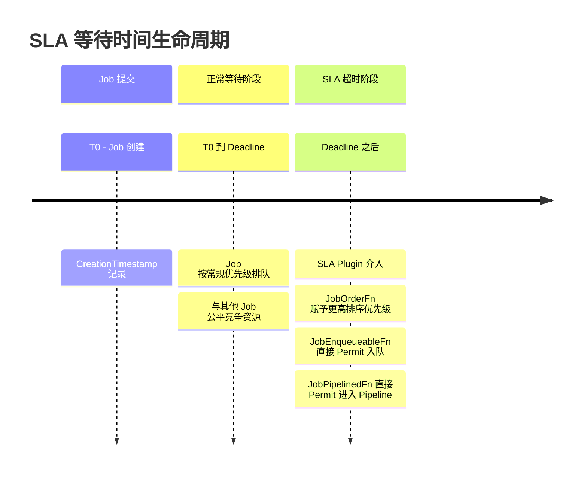
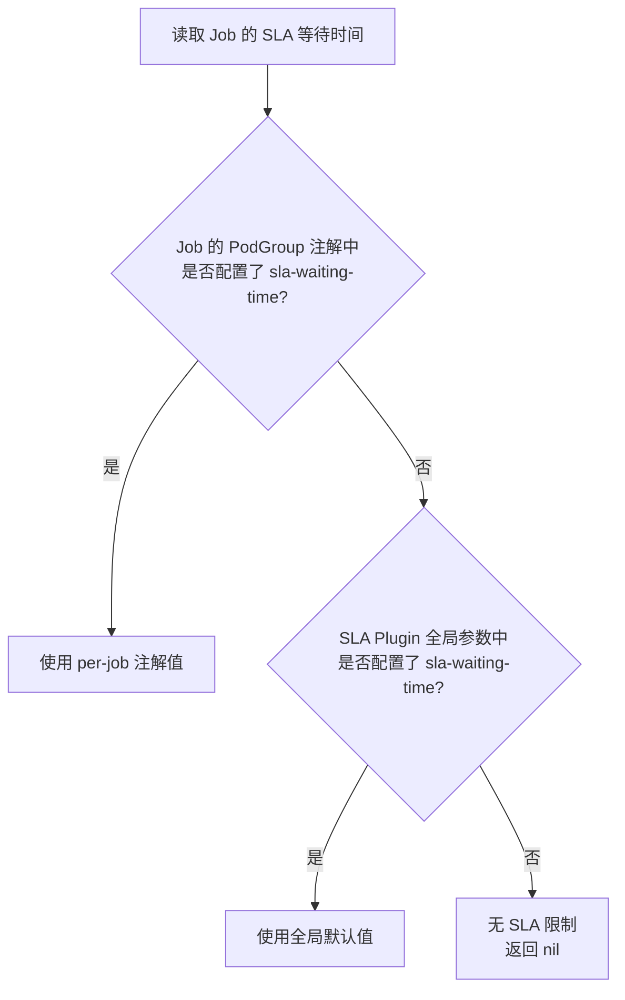
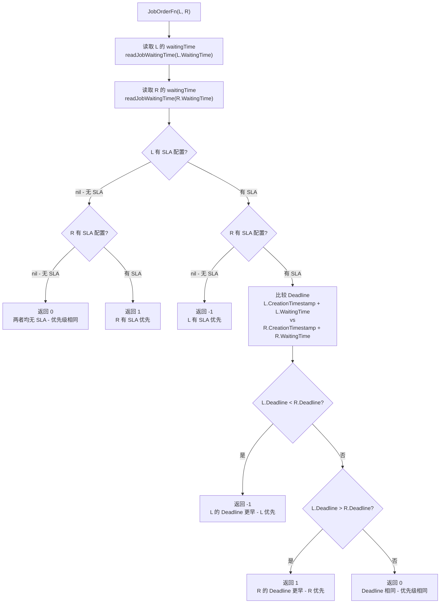
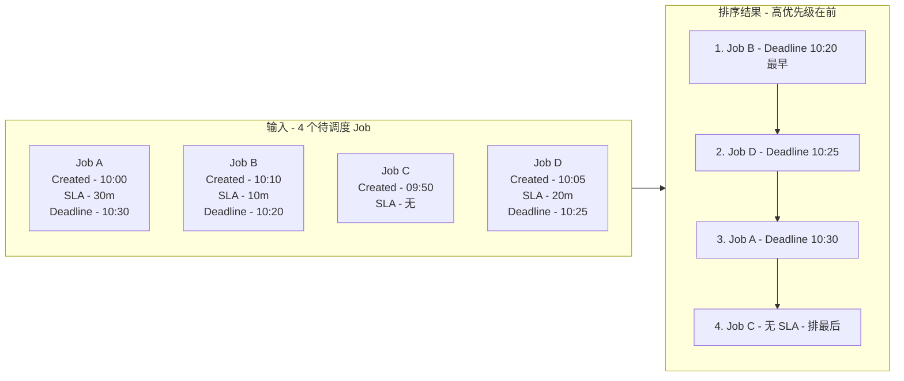
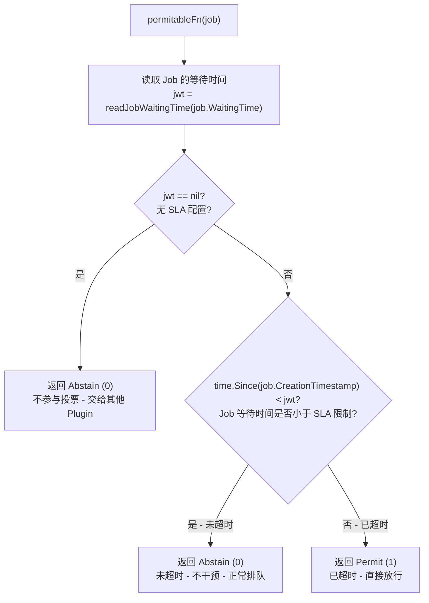
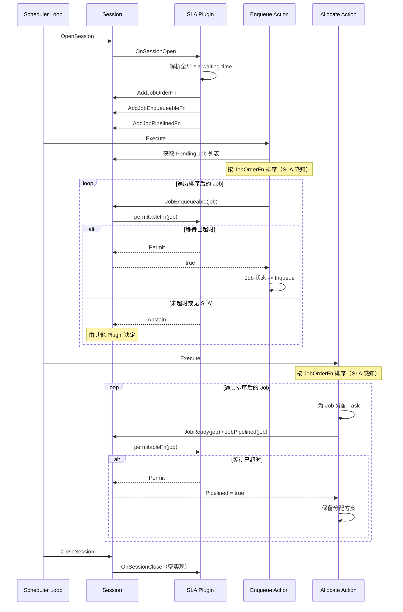

## 1. 概述

在批量调度场景中，当集群资源紧张时，低优先级或后提交的 Job 可能长时间处于 Pending 状态，导致用户体验下降甚至违反业务 SLA（Service Level Agreement）承诺。SLA Plugin 正是为解决这一问题而设计的 -- 它为 Job 引入了 **等待时间上限** 的概念，当 Job 的等待时间超过预设的 deadline 时，调度器会赋予该 Job 更高的调度优先级，使其能够优先获得资源。

SLA Plugin 的核心价值在于：

- **防止作业饥饿**：确保任何 Job 都不会无限期地等待调度
- **SLA 合规保障**：支持全局默认值和 per-job 精细化配置，满足不同业务场景的 SLA 要求
- **紧急通道机制**：等待超时的 Job 可以绕过常规排队逻辑，直接获得入队（Enqueue）和 Pipeline 许可

> 源码位置 - `pkg/scheduler/plugins/sla/sla.go`（157 行）

## 2. SLA 等待时间概念

SLA Plugin 的核心概念是 **等待时间（Waiting Time）** 和 **截止时间（Deadline）**。每个 Job 的 deadline 由其创建时间戳加上配置的等待时间计算得出。

```
Deadline = CreationTimestamp + WaitingTime
```

以下时间线展示了 SLA 等待时间的生命周期：



SLA 等待时间的配置存在两级优先级：



## 3. Plugin 结构体与配置解析

### 3.1 结构体定义

```go
// pkg/scheduler/plugins/sla/sla.go

type slaPlugin struct {
    pluginArguments framework.Arguments  // 插件参数
    jobWaitingTime  *time.Duration       // 全局默认等待时间（可为 nil）
}
```

`slaPlugin` 结构体包含两个字段：

| 字段 | 类型 | 说明 |
|------|------|------|
| `pluginArguments` | `framework.Arguments` | 调度器配置文件中传入的插件参数 |
| `jobWaitingTime` | `*time.Duration` | 解析后的全局等待时间，未配置时为 `nil` |

### 3.2 插件注册

SLA Plugin 在 `pkg/scheduler/plugins/factory.go` 中完成注册：

```go
framework.RegisterPluginBuilder(sla.PluginName, sla.New)
```

`New` 函数创建一个 `jobWaitingTime` 初始化为 `nil` 的实例：

```go
func New(arguments framework.Arguments) framework.Plugin {
    return &slaPlugin{
        pluginArguments: arguments,
        jobWaitingTime:  nil,
    }
}
```

### 3.3 OnSessionOpen - 配置解析与扩展点注册

在每个调度周期开始时，`OnSessionOpen` 完成两项工作：

**第一步 -- 解析全局等待时间**：从 `pluginArguments` 中读取 `sla-waiting-time` 参数，解析为 `time.Duration`。解析失败或值不大于 0 时，保持 `jobWaitingTime` 为 `nil`。

```go
if _, exist := sp.pluginArguments[JobWaitingTime]; exist {
    waitTime, ok := sp.pluginArguments[JobWaitingTime].(string)
    // ...
    jwt, err := time.ParseDuration(waitTime)
    // ...
    if jwt <= 0 {
        klog.Warningf("Invalid global waiting time setting: %s in sla plugin.", jwt.String())
    } else {
        sp.jobWaitingTime = &jwt
    }
}
```

**第二步 -- 注册三个扩展点函数**：`JobOrderFn`、`JobEnqueueableFn`、`JobPipelinedFn`。

### 3.4 readJobWaitingTime - 两级配置读取

`readJobWaitingTime` 方法实现了 per-job 优先、全局兜底的配置读取策略：

```go
func (sp *slaPlugin) readJobWaitingTime(jwt *time.Duration) *time.Duration {
    if jwt == nil {
        return sp.jobWaitingTime  // fallback 到全局配置
    }
    return jwt  // 使用 per-job 配置
}
```

其中 `jwt` 参数来自 `JobInfo.WaitingTime`，该字段在 `pkg/scheduler/api/job_info.go` 的 `SetPodGroup` 方法中从 PodGroup 注解解析而来。解析逻辑会先尝试 `scheduling.volcano.sh/sla-waiting-time` 注解，再尝试 `sla-waiting-time` 注解。

## 4. JobOrderFn - SLA 感知排序

`JobOrderFn` 是 SLA Plugin 的核心排序逻辑，决定了多个 Job 之间的调度顺序。该函数注册到 Session 后，会在 Allocate、Preempt 等 Action 对 Job 排序时被调用。

### 4.1 排序决策流程



### 4.2 排序规则总结

返回值遵循 `CompareFn` 约定 -- 返回 -1 表示左侧优先，返回 1 表示右侧优先，返回 0 表示相同。

| 场景 | L 的 SLA | R 的 SLA | 排序结果 |
|------|----------|----------|----------|
| 两者均无 SLA | nil | nil | 0（相同，由其他 Plugin 决定） |
| 仅 L 有 SLA | 有值 | nil | -1（L 优先） |
| 仅 R 有 SLA | nil | 有值 | 1（R 优先） |
| 两者都有，L 的 Deadline 更早 | 有值 | 有值 | -1（L 优先） |
| 两者都有，R 的 Deadline 更早 | 有值 | 有值 | 1（R 优先） |
| 两者都有，Deadline 相同 | 有值 | 有值 | 0（相同） |

### 4.3 多 Job 排序示例

以下示例展示了 4 个 Job 在 SLA Plugin 排序下的优先级关系：



**关键观察**：Job B 虽然创建时间最晚（10:10），但因为其 SLA 等待时间最短（10m），deadline（10:20）最早，所以排在第一位。Job C 虽然创建时间最早（09:50），但因为没有 SLA 配置，排在所有有 SLA 的 Job 之后。

## 5. JobEnqueueableFn / JobPipelinedFn - SLA 紧急通道

SLA Plugin 为 `JobEnqueueableFn` 和 `JobPipelinedFn` 注册了相同的 `permitableFn` 函数，构成了等待超时 Job 的"紧急通道"。

### 5.1 决策流程



### 5.2 投票机制

`permitableFn` 使用三值投票机制（定义在 `pkg/scheduler/plugins/util/util.go`）：

| 返回值 | 常量 | 含义 |
|--------|------|------|
| 1 | `Permit` | 允许 -- Job 超时，投赞成票 |
| 0 | `Abstain` | 弃权 -- 无 SLA 配置或未超时，不参与决策 |
| -1 | `Reject` | 拒绝 -- SLA Plugin 不使用此返回值 |

框架在 `Session.JobEnqueueable` 和 `Session.JobPipelined` 中采用如下投票聚合逻辑：只要同一 Tier 中有一个 Plugin 投 `Permit` 且没有 Plugin 投 `Reject`，即视为通过。

### 5.3 在 Enqueue 和 Allocate Action 中的作用

**Enqueue Action**（`pkg/scheduler/actions/enqueue/enqueue.go`）：

```go
if job.PodGroup.Spec.MinResources == nil || ssn.JobEnqueueable(job) {
    ssn.JobEnqueued(job)
    job.PodGroup.Status.Phase = scheduling.PodGroupInqueue
}
```

当 Job 等待时间超过 SLA 限制时，`ssn.JobEnqueueable(job)` 返回 `true`，Job 直接从 Pending 转为 Inqueue 状态，无需等待集群有足够空闲资源。

**Allocate Action**（`pkg/scheduler/actions/allocate/allocate.go`）：

```go
if ssn.JobReady(job) || ssn.JobPipelined(job) {
    // 保留分配方案
}
```

当 `ssn.JobPipelined(job)` 因 SLA Plugin 投 `Permit` 而返回 `true` 时，即使 Job 尚未完全满足 Gang 约束，其已分配的资源也不会被立即回滚，而是保留等待后续资源释放。

## 6. SLA Plugin 与 Action 的交互时序



## 7. 配置参考

### 7.1 全局配置

在调度器配置文件（volcano-scheduler-configmap）中配置全局默认等待时间：

```yaml
actions: "enqueue, allocate, backfill"
tiers:
- plugins:
  - name: sla
    arguments:
      sla-waiting-time: "1h"    # 全局默认：1 小时
    enabledJobOrder: true
    enabledJobEnqueued: true
    enabledJobPipelined: true
  - name: gang
    enabledJobOrder: true
    enabledJobReady: true
    enabledJobPipelined: true
  - name: proportion
    enabledQueueOrder: true
    enabledJobEnqueued: true
```

支持的时间单位：`ns`、`us`（或 `us`）、`ms`、`s`、`m`、`h`。可组合使用，如 `1h30m`、`2h45m30s`。

### 7.2 Per-Job 配置

通过 PodGroup 注解为单个 Job 设置独立的等待时间，优先级高于全局配置：

```yaml
apiVersion: batch.volcano.sh/v1alpha1
kind: Job
metadata:
  name: high-priority-training
  annotations:
    sla-waiting-time: "30m"    # 此 Job 最多等待 30 分钟
spec:
  minAvailable: 4
  tasks:
  - replicas: 4
    template:
      spec:
        containers:
        - name: worker
          image: training:latest
          resources:
            requests:
              nvidia.com/gpu: 1
```

也可直接在 PodGroup 上配置：

```yaml
apiVersion: scheduling.volcano.sh/v1beta1
kind: PodGroup
metadata:
  name: my-job-group
  annotations:
    sla-waiting-time: "15m"
spec:
  minMember: 3
  queue: default
```

## 8. 使用场景与最佳实践

### 8.1 典型使用场景

**场景一 -- 多租户集群的 SLA 分级保障**

为不同业务级别的 Job 设置不同的 SLA 等待时间：

- 核心业务训练任务：`sla-waiting-time: 10m`
- 常规批处理任务：`sla-waiting-time: 2h`
- 低优先级实验任务：不配置（无 SLA 限制）

**场景二 -- 防止大规模 Gang Job 饥饿**

一个需要 64 GPU 的大规模分布式训练 Job，在资源紧张时可能长时间无法满足 Gang 约束。配置 `sla-waiting-time: 1h` 后，等待超过 1 小时时，该 Job 会获得更高的调度优先级，调度器会优先为其分配资源。

### 8.2 最佳实践

1. **始终配置全局默认值**：作为安全兜底，防止任何 Job 无限期等待
2. **根据 Job 规模调整等待时间**：大规模 Job 可设置较长的等待时间，因为它们本身就需要更长的资源聚合时间
3. **与 Priority Plugin 配合**：SLA Plugin 处理等待超时的情况，Priority Plugin 处理正常情况下的优先级排序，两者互补
4. **监控 SLA 超时频率**：频繁的 SLA 超时可能意味着集群资源不足或 Queue 配额需要调整

## 9. 与 Gang/Priority 等 Plugin 的协作

SLA Plugin 不是孤立工作的，它与其他 Plugin 通过框架的多 Plugin 排序机制协作：

**与 Gang Plugin 的协作**：
- Gang Plugin 的 `JobOrderFn` 实现 Ready-First 策略（已满足 Gang 约束的 Job 优先）
- SLA Plugin 的 `JobOrderFn` 实现 Deadline-First 策略（deadline 更早的 Job 优先）
- 两者在同一 Tier 中时，框架会依次调用，第一个返回非 0 值的 Plugin 决定排序结果
- SLA Plugin 的 `JobPipelinedFn` 可以让超时 Job 获得 Pipeline 许可，与 Gang Plugin 的 `JobPipelinedFn` 共同决定 Job 是否进入 Pipeline 状态

**与 Priority Plugin 的协作**：
- Priority Plugin 基于 `PriorityClass` 进行排序，是静态优先级
- SLA Plugin 基于等待时间进行排序，是动态优先级（随时间变化）
- 当 Priority Plugin 判断两个 Job 优先级相同时（返回 0），SLA Plugin 的排序结果生效

**与 Proportion Plugin 的协作**：
- Proportion Plugin 的 `JobEnqueueableFn` 基于 Queue 资源配额决定 Job 是否可入队
- SLA Plugin 的 `JobEnqueueableFn` 基于等待超时决定 Job 是否可入队
- 两者都投 `Abstain` 时，Job 不会入队；SLA Plugin 投 `Permit` 且 Proportion 不投 `Reject` 时，Job 可入队

## 10. 常见问题

### Q1: 配置了 SLA 后，Job 是否一定能在 deadline 前被调度?

不一定。SLA Plugin 仅提高了超时 Job 的调度优先级和入队权限，但最终调度是否成功还取决于集群可用资源、Gang 约束是否满足、Node 过滤条件等多个因素。SLA Plugin 是 "尽力而为" 的优先级提升，不是资源预留。

### Q2: 多个 Job 同时超过 SLA deadline 时如何排序?

按 deadline 的绝对时间排序 -- deadline 更早（即更早创建或 SLA 时间更短）的 Job 优先。如果 deadline 完全相同，则返回 0，由其他 Plugin（如 Priority、DRF）进一步区分。

### Q3: 全局配置和 per-job 注解可以同时存在吗?

可以。SLA Plugin 的 `readJobWaitingTime` 方法优先使用 per-job 注解值，仅在 Job 没有注解配置时才使用全局默认值。这允许管理员设置一个宽松的全局默认值，同时为特定关键 Job 设置更紧迫的 SLA。

### Q4: SLA Plugin 的 OnSessionClose 为什么是空实现?

与 Gang Plugin 不同，SLA Plugin 是一个纯策略性插件 -- 它仅在排序和投票环节影响决策，不维护跨周期状态，也不需要在调度周期结束时上报指标或更新条件。每个周期的行为完全由当前时间和 Job 的创建时间戳决定。

### Q5: 如果误配置了无效的等待时间会怎样?

- **解析失败**（如 `sla-waiting-time: abc`）：打印 Error 日志，全局配置保持 nil，相当于未启用
- **值不大于 0**（如 `sla-waiting-time: -1s`）：打印 Warning 日志，全局配置保持 nil
- **per-job 注解解析失败**：在 `pkg/scheduler/api/job_info.go` 的 `extractWaitingTime` 中处理，`WaitingTime` 设为 nil，该 Job 无 SLA 限制

### Q6: SLA Plugin 对调度性能有影响吗?

影响极小。SLA Plugin 注册的三个函数均为 O(1) 时间复杂度 -- `JobOrderFn` 仅做两次时间比较，`permitableFn` 仅做一次时间差计算。无额外的内存分配或 API 调用。
