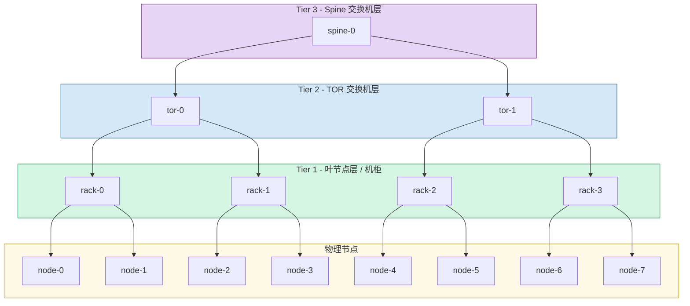
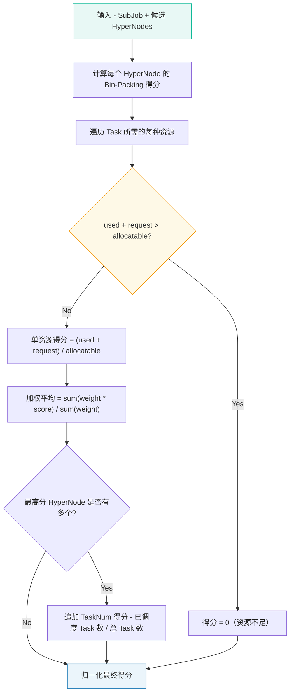
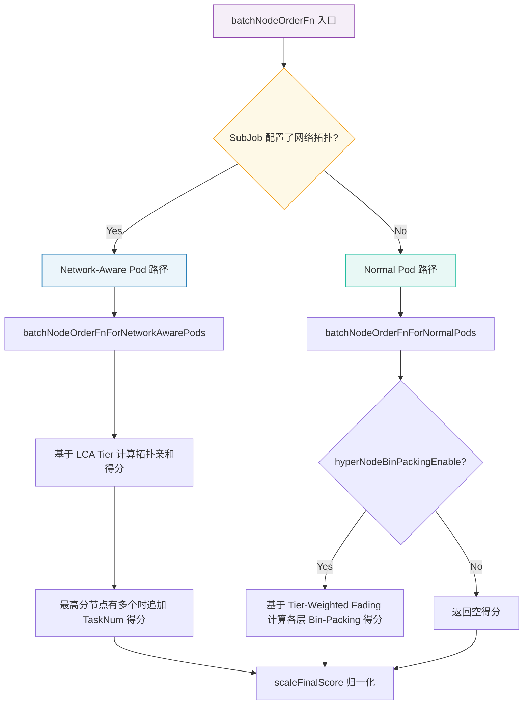
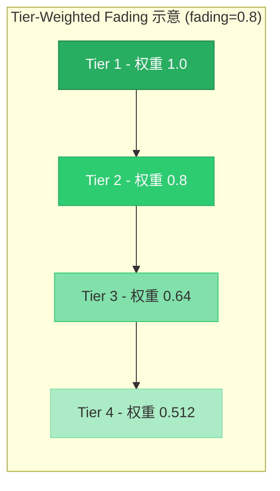
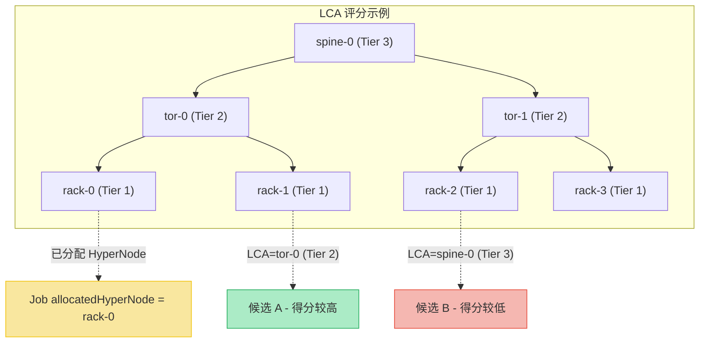
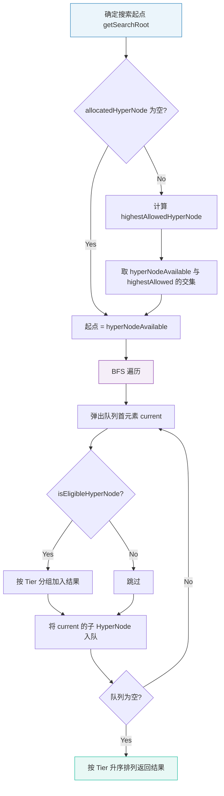
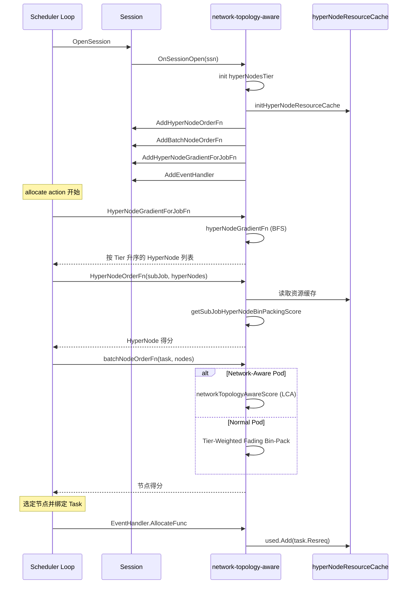

## 1. 概述

在大规模分布式训练场景中，GPU 集群的节点间通信带宽直接影响训练效率。同一 TOR（Top of Rack）交换机下的节点间通信延迟远低于跨 Spine 交换机通信。如果调度器不感知底层网络拓扑，可能将同一训练任务的 Pod 分散到网络距离较远的节点上，导致 AllReduce 等集合通信操作的性能大幅下降。

`network-topology-aware` 插件正是为解决这一问题而设计的。它利用 Volcano 的 HyperNode CRD 构建的拓扑层级结构，在调度决策时考虑节点间的网络距离，将需要高带宽互联的 Pod 尽可能调度到同一网络域内，从而最小化跨交换机的通信开销。

**核心能力：**

- 基于 HyperNode 层级的网络拓扑感知评分
- 双路径评分策略：Normal Pod 的 Tier-Weighted Fading 与 Network-Aware Pod 的 LCA 评分
- HyperNode 级别的 Bin-Packing 资源紧凑调度
- 梯度 BFS 搜索，按拓扑距离由近及远逐层查找可用 HyperNode
- 实时资源缓存，通过 EventHandler 跟踪分配/释放事件

**源码位置：** `pkg/scheduler/plugins/network-topology-aware/network_topology_aware.go`

---

## 2. HyperNode 拓扑模型

HyperNode 是 Volcano 定义的网络拓扑抽象 CRD（`topology.volcano.sh/v1alpha1`），通过多层级树状结构描述数据中心的网络拓扑关系。



**关键概念：**

| 概念 | 说明 |
|------|------|
| Tier 1 | 叶节点层，直接包含物理节点，通常对应一个机柜 |
| Tier 2 | TOR 交换机层，包含多个 Tier 1 HyperNode |
| Tier 3+ | Spine 交换机层及更高层级，覆盖范围更广 |
| `RealNodesSet` | 每个 HyperNode 下属的所有物理节点集合（递归展开） |
| LCA | 最低公共祖先（Lowest Common Ancestor），两个节点在拓扑树上的最近公共 HyperNode |

Tier 值越低表示网络距离越近，同一 Tier 1 HyperNode 下的节点通信延迟最低。

---

## 3. Plugin 结构体与初始化

### 3.1 核心结构体

插件在 `pkg/scheduler/plugins/factory.go` 中注册，入口函数为 `New()`。核心结构体定义如下：

```go
// network_topology_aware.go L64-L96
type networkTopologyAwarePlugin struct {
    pluginArguments        framework.Arguments
    weight                 *priorityWeight       // 全局及资源维度权重
    *normalPodConfig                              // Normal Pod 评分配置
    *hyperNodesTier                               // 拓扑层级范围 [minTier, maxTier]
    hyperNodeResourceCache map[string]*resourceStatus  // HyperNode 资源缓存
}

type priorityWeight struct {
    GlobalWeight                 int
    HyperNodeBinPackingCPU       int
    HyperNodeBinPackingMemory    int
    HyperNodeBinPackingResources map[corev1.ResourceName]int
}

type normalPodConfig struct {
    hyperNodeBinPackingEnable bool     // 是否对 Normal Pod 启用 HyperNode Bin-Packing
    hyperNodeBinPackingFading float64  // Tier 权重衰减系数
}

type resourceStatus struct {
    allocatable *api.Resource  // 可分配总量
    used        *api.Resource  // 已使用量
    idle        *api.Resource  // 空闲量
    futureIdle  *api.Resource  // 未来可释放量
}
```

### 3.2 初始化流程

`New()` 函数解析配置参数并构造插件实例。`OnSessionOpen()` 在每个调度周期开始时被调用，完成以下初始化：

1. 调用 `hyperNodesTier.init()` 解析拓扑层级范围（minTier / maxTier）
2. 调用 `initHyperNodeResourceCache()` 遍历所有 HyperNode 下的物理节点，汇总资源状态
3. 注册 `HyperNodeOrderFn`、`BatchNodeOrderFn`、`HyperNodeGradientForJobFn`、`HyperNodeGradientForSubJobFn` 四个回调
4. 注册 `EventHandler`，在 Task 分配/释放时实时更新 `hyperNodeResourceCache`

---

## 4. HyperNodeOrderFn - HyperNode 级 Bin-Packing

`HyperNodeOrderFn` 在 HyperNode 维度对候选 HyperNode 进行评分，目标是将 SubJob 的所有 Task 紧凑地放置到资源利用率更高的 HyperNode 中。



**评分公式：**

对于每种资源 `r` 及其权重 `w_r`：

```
单资源得分 = (used_r + request_r) / allocatable_r
总得分 = sum(w_r * 单资源得分) / sum(w_r)
```

当多个 HyperNode 得分相同时，使用 `scoreWithTaskNum` 进行二次排序，倾向于选择已有更多同 Job Task 的 HyperNode，促进 Task 集中放置。

**源码入口：** `HyperNodeOrderFn()` (L341) -> `getSubJobHyperNodeBinPackingScore()` (L367)

---

## 5. batchNodeOrderFn 双路径评分

`batchNodeOrderFn` 是节点级别评分的入口函数，根据 SubJob 是否配置了网络拓扑（`WithNetworkTopology()`），分为两条评分路径。



**源码入口：** `batchNodeOrderFn()` (L422)

### 5.1 Normal Pod - Tier-Weighted Fading

对于没有配置 `networkType` 注解的普通 Pod，插件使用 Tier-Weighted Fading 策略。核心思想是：低 Tier（近网络距离）的 HyperNode Bin-Packing 得分权重更高，随 Tier 增加权重指数衰减。



**权重计算公式：**

```
tierWeight(tier) = fading ^ (tier - 1)
```

其中 `fading` 默认值为 `0.8`。当 `fading = 0` 时，仅 Tier 1 有效（权重为 1，其余为 0）；当 `fading = 1` 时，所有 Tier 权重相等。

**节点最终得分：**

```
nodeScore = sum(tierWeight[t] * binPackScore[t]) / sum(tierWeight[t])
```

对每个 Tier，找到包含该节点的 HyperNode，计算其 Bin-Packing 得分。如果节点在某层不属于任何 HyperNode，该层得分为满分 `1.0`（倾向于调度到不被 HyperNode 管辖的节点，避免与拓扑感知任务竞争资源）。

**源码入口：** `batchNodeOrderFnForNormalPods()` (L442) -> `getPodHyperNodeBinPackingScore()` (L481)

### 5.2 Network-Aware Pod - LCA 评分

对于配置了网络拓扑的 Pod（SubJob 通过 PodGroup 的 `NetworkTopology` 字段标识），插件使用 LCA（最低公共祖先）拓扑评分。目标是将候选节点与 Job 已分配的 HyperNode（`allocatedHyperNode`）之间的 LCA 层级最小化。



**LCA 得分计算公式：**

```
tierScore = (maxTier - LCA.tier) / (maxTier - minTier)
```

- 当候选节点与 `allocatedHyperNode` 相同时，得分为满分 `1.0`
- LCA 层级越低（越近），得分越高
- LCA 层级越高（越远），得分越低

当多个节点得分相同时，同样追加 `scoreWithTaskNum` 进行二次排序。

**源码入口：** `batchNodeOrderFnForNetworkAwarePods()` (L522) -> `networkTopologyAwareScore()` (L691) -> `scoreHyperNodeWithTier()` (L720)

---

## 6. hyperNodeGradientFn - 梯度广度优先搜索

对于 Hard 模式的网络拓扑约束（`IsHardTopologyMode() == true`），插件通过梯度 BFS 搜索可用的 HyperNode。搜索从指定的起始 HyperNode 出发，逐层向下扩展，按 Tier 升序返回满足条件的 HyperNode 列表。



**资格判定（`isEligibleHyperNode`）：**

1. HyperNode 的 Tier 不超过 `highestAllowedTier`
2. 如果 `allocatedHyperNode` 非空（部分运行场景），跳过资源预过滤
3. 否则检查 HyperNode 的 `idle` 或 `futureIdle` 资源是否满足 Job 的最小资源需求

**搜索起点确定（`getSearchRoot`）：**

当 Job 已有部分 Task 被调度（`allocatedHyperNode != ""`）时，需要从 `allocatedHyperNode` 出发沿拓扑树向上找到 `highestAllowedTier` 对应的祖先节点，再与外部传入的 `hyperNodeAvailable` 取交集，确保同时满足 Job 的拓扑约束和调度器的可用范围约束。

**源码入口：** `hyperNodeGradientFn()` (L564) -> `getSearchRoot()` (L635) -> `isEligibleHyperNode()` (L611)

---

## 7. 资源缓存机制

插件维护 `hyperNodeResourceCache`，为每个 HyperNode 缓存四种资源维度：

| 字段 | 含义 | 来源 |
|------|------|------|
| `allocatable` | 可分配总量 | 该 HyperNode 下所有物理节点的 `Allocatable` 之和 |
| `used` | 已使用量 | 该 HyperNode 下所有物理节点的 `Used` 之和 |
| `idle` | 空闲量 | 该 HyperNode 下所有物理节点的 `Idle` 之和 |
| `futureIdle` | 未来可释放量 | 该 HyperNode 下所有物理节点的 `FutureIdle()` 之和 |

**初始化**在 `initHyperNodeResourceCache()` (L106) 中完成，遍历 `ssn.RealNodesSet` 汇总资源。

**实时更新**通过 `EventHandler` (L309-L338) 实现：
- `AllocateFunc`: Task 被分配到节点时，找到该节点所属的所有 HyperNode，增加其 `used` 值
- `DeallocateFunc`: Task 被释放时，减少对应 HyperNode 的 `used` 值

这种缓存机制避免了每次评分时重新遍历节点计算资源，显著提升了调度性能。

---

## 8. 配置参考

### 8.1 调度器配置示例

```yaml
tiers:
- plugins:
  - name: network-topology-aware
    arguments:
      weight: 10                                   # 全局插件权重
      hypernode.binpack.cpu: 5                     # CPU Bin-Packing 权重
      hypernode.binpack.memory: 1                  # Memory Bin-Packing 权重
      hypernode.binpack.resources: nvidia.com/gpu, example.com/foo  # 扩展资源列表
      hypernode.binpack.resources.nvidia.com/gpu: 2                # GPU 权重
      hypernode.binpack.resources.example.com/foo: 3               # 自定义资源权重
      hypernode.binpack.normal-pod.enable: true     # 是否对 Normal Pod 启用 HyperNode Bin-Packing
      hypernode.binpack.normal-pod.fading: 0.8      # Tier 权重衰减系数
```

### 8.2 参数说明

| 参数 | 类型 | 默认值 | 说明 |
|------|------|--------|------|
| `weight` | int | 1 | 插件全局权重，影响最终得分的缩放 |
| `hypernode.binpack.cpu` | int | 1 | CPU 资源在 Bin-Packing 计算中的权重 |
| `hypernode.binpack.memory` | int | 1 | Memory 资源在 Bin-Packing 计算中的权重 |
| `hypernode.binpack.resources` | string | "" | 逗号分隔的扩展资源名列表 |
| `hypernode.binpack.resources.<name>` | int | 1 | 指定扩展资源的权重 |
| `hypernode.binpack.normal-pod.enable` | bool | true | 是否对不带网络拓扑标识的 Pod 启用 HyperNode 级 Bin-Packing |
| `hypernode.binpack.normal-pod.fading` | float | 0.8 | Tier 权重衰减系数，范围 [0, +inf)。0 表示仅 Tier 1 有效 |

### 8.3 PodGroup 网络拓扑配置

在 PodGroup 的 Spec 中通过 `networkTopology` 字段配置：

```yaml
apiVersion: scheduling.volcano.sh/v1beta1
kind: PodGroup
metadata:
  name: training-job-pg
spec:
  minMember: 8
  networkTopology:
    mode: Hard                  # Hard 或 Soft
    highestTierAllowed: 2       # 允许的最高 Tier 层级
```

- **Hard 模式**：严格约束，Job 的所有 Pod 必须调度到 `highestTierAllowed` 范围内的同一 HyperNode 子树中
- **Soft 模式**：软约束，通过评分偏好将 Pod 调度到网络距离更近的节点，但不做强制限制

---

## 9. 使用场景

### 9.1 分布式训练

大规模分布式训练任务（如 PyTorch DDP、Megatron-LM）对节点间的通信带宽有极高要求。典型的 AllReduce 操作需要在所有 Worker 之间同步梯度，跨交换机的通信会成为显著瓶颈。

**推荐配置：**
- 使用 Hard 模式 + `highestTierAllowed: 2`，确保所有 Worker 在同一 TOR 交换机下
- 将 `hypernode.binpack.resources.nvidia.com/gpu` 权重设高，优先基于 GPU 利用率进行紧凑放置

### 9.2 MPI Job

MPI 作业的通信模式通常是点对点或集合通信，节点间延迟直接影响任务完成时间。

**推荐配置：**
- 小规模 MPI Job 使用 Hard 模式 + `highestTierAllowed: 1`，将所有进程限制在同一机柜
- 大规模 MPI Job 使用 Soft 模式，允许跨机柜但偏好近距离放置

### 9.3 普通在线服务

对于没有特殊网络拓扑需求的在线服务 Pod，插件通过 Tier-Weighted Fading 策略实现资源的紧凑放置，减少资源碎片，但不强制拓扑约束。可通过设置 `hypernode.binpack.normal-pod.enable: false` 关闭此行为。

---

## 10. 完整调度流程

以下时序图展示了一个 Network-Aware Job 在调度过程中与本插件的交互全流程：



---

## 11. 与其他 Plugin 的协作

`network-topology-aware` 不是独立工作的，它与调度器中的其他插件协同完成调度决策：

| 协作插件 | 协作方式 |
|----------|----------|
| `gang` | Gang 插件确保 Job 的所有 Pod 作为整体调度（All-or-Nothing），网络拓扑插件在此基础上优化放置位置 |
| `proportion` | Proportion 插件管理 Queue 级别的资源配额，网络拓扑插件在配额范围内优化拓扑亲和 |
| `binpack` | 节点级 Bin-Packing 与 HyperNode 级 Bin-Packing 互补，前者优化单节点利用率，后者优化拓扑域利用率 |
| `predicates` | Predicates 插件负责硬性过滤（资源、亲和性等），网络拓扑插件仅对通过过滤的候选节点评分 |
| `nodeorder` | 与网络拓扑插件的节点评分叠加，最终得分为所有插件评分的加权和 |
| `capacity` | Capacity 插件管理集群容量，网络拓扑插件的 `isEligibleHyperNode` 中的资源预过滤与之互补 |

---

## 12. 常见问题

### Q1: 如何判断一个 Pod 是否会走 Network-Aware 评分路径？

取决于 SubJob 是否配置了 `NetworkTopology`。具体逻辑在 `batchNodeOrderFn()` (L422) 中通过 `subJob.WithNetworkTopology()` 判断。该方法检查 SubJob 关联的 PodGroup Spec 中 `networkTopology` 字段是否非空。

### Q2: fading 参数设为 0 和 1 分别是什么效果？

- `fading = 0`：`math.Pow(0, 0) = 1`，仅 Tier 1 权重为 1，其余 Tier 权重为 0。效果是 Normal Pod 仅基于 Tier 1（叶节点 / 机柜级）的 Bin-Packing 评分
- `fading = 1`：所有 Tier 权重均为 1，各层对评分的贡献相同

### Q3: allocatedHyperNode 为空时，梯度搜索的行为是什么？

当 `allocatedHyperNode` 为空（Job 首次调度）时，`getSearchRoot()` 直接返回 `hyperNodeAvailable` 作为搜索起点，不做交集计算。同时 `isEligibleHyperNode()` 会进行完整的资源预过滤，只返回 idle 或 futureIdle 满足 Job 最小资源需求的 HyperNode。

### Q4: HyperNode 资源缓存何时会出现不一致？

正常情况下不会出现不一致。`hyperNodeResourceCache` 在 `OnSessionOpen` 时从集群快照初始化，之后通过 `EventHandler` 的 `AllocateFunc` 和 `DeallocateFunc` 保持实时同步。由于调度器是单线程调度循环，不存在并发更新问题。缓存仅在当前 Session 内有效，下一个调度周期会重新初始化。

### Q5: Hard 模式和 Soft 模式在插件中的实际差异是什么？

- **Hard 模式**：触发 `HyperNodeGradientForJobFn` / `HyperNodeGradientForSubJobFn`，通过梯度 BFS 严格限制候选 HyperNode 范围在 `highestTierAllowed` 以内
- **Soft 模式**：不触发梯度搜索（返回原始 HyperNode），仅通过 `batchNodeOrderFnForNetworkAwarePods` 的 LCA 评分进行偏好引导

### Q6: 多个 HyperNode 得分相同时如何打破平局？

在 `HyperNodeOrderFn` 和 `batchNodeOrderFnForNetworkAwarePods` 中，当最高得分对应多个 HyperNode/节点时，使用 `scoreWithTaskNum` 追加得分。该函数计算该 HyperNode 下已调度的同 Job Task 数占总 Task 数的比例，倾向于将新 Task 调度到已有更多同 Job Task 的 HyperNode，促进任务集中放置。
