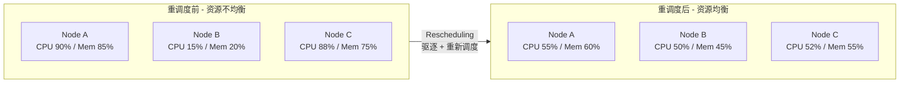
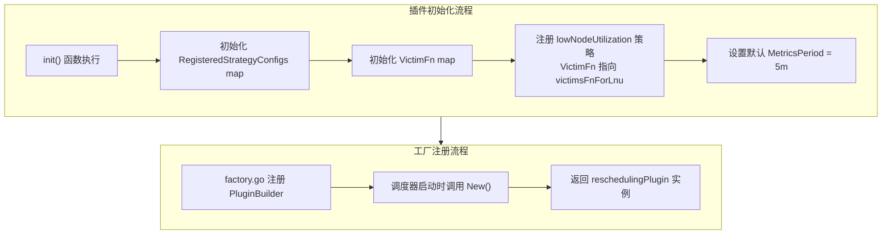
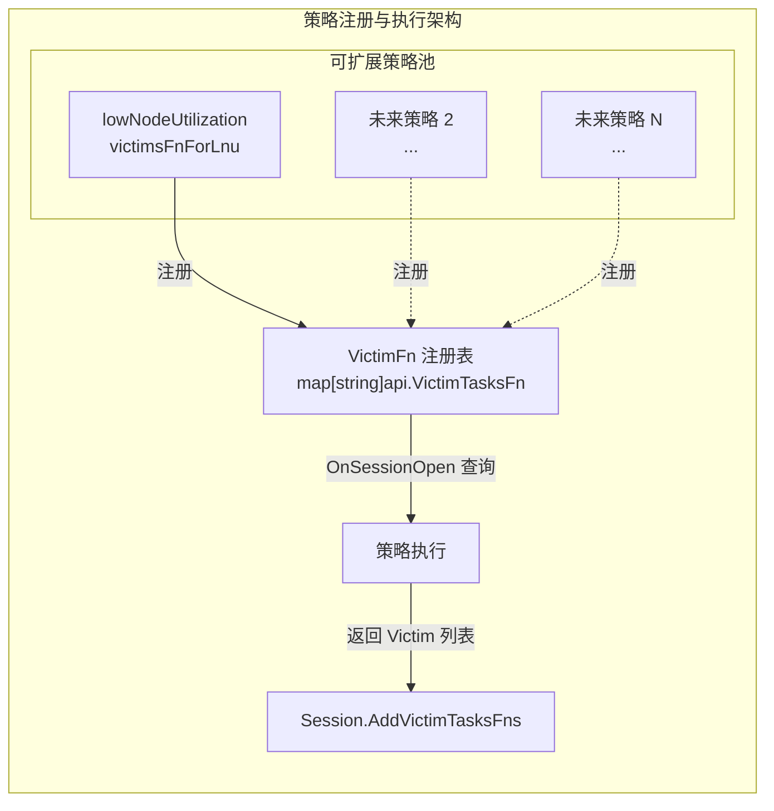
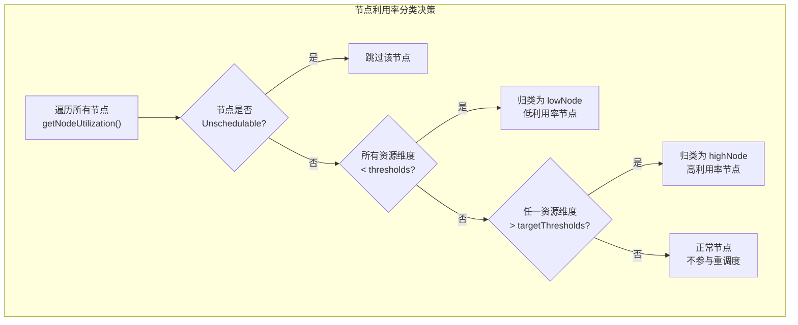
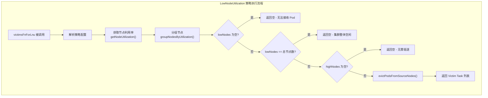
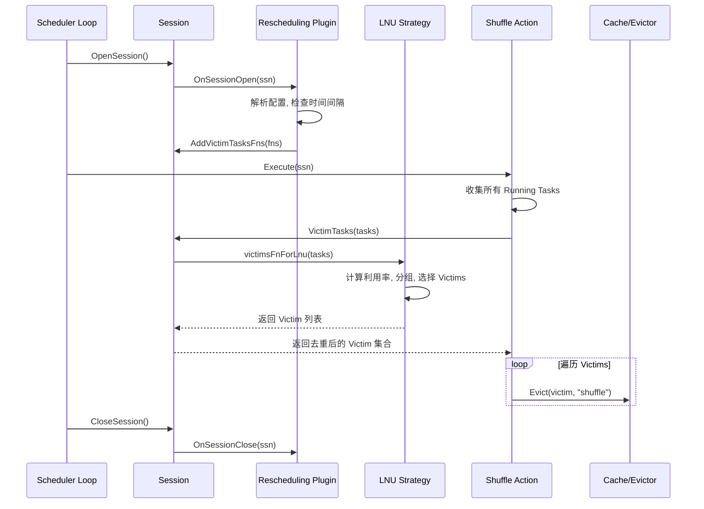
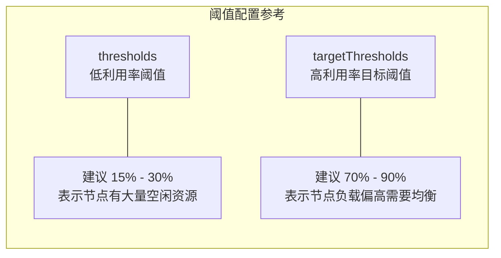
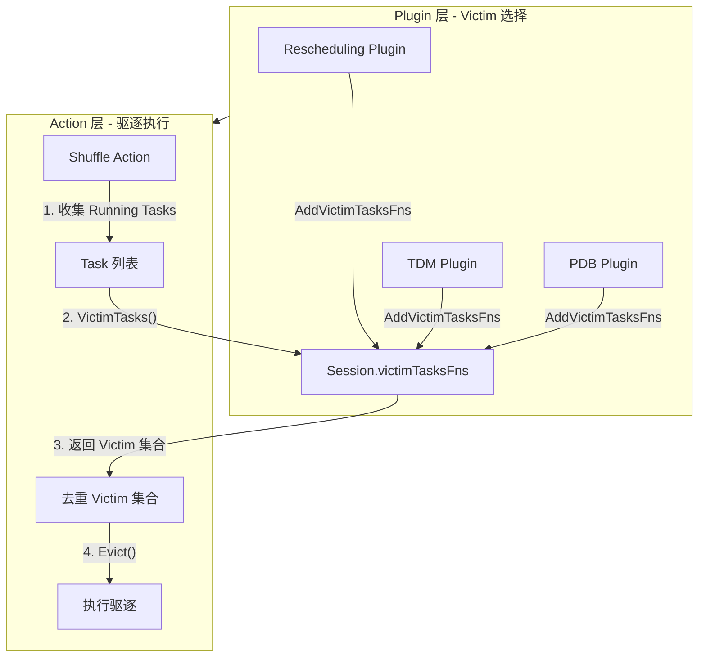

## 1. 概述

Rescheduling Plugin 是 Volcano 调度器中实现 **重调度（Rescheduling）** 功能的插件。在 Kubernetes 集群长期运行过程中，随着 Pod 的创建与销毁、节点的扩缩容以及工作负载的动态变化，集群中各节点的资源利用率往往会出现不均衡的问题。Rescheduling Plugin 通过策略化地选择 Victim Pod 进行驱逐，使得这些 Pod 被重新调度到更合适的节点上，实现集群资源的动态再平衡。

该插件内置的默认策略为 `lowNodeUtilization`（低节点利用率重平衡），核心思想是识别资源使用率低于阈值的"冷节点"和高于目标阈值的"热节点"，从热节点中选择合适的 Pod 驱逐，让调度器在后续周期中将其重新调度到冷节点上。

> **源码参考**：`pkg/scheduler/plugins/rescheduling/rescheduling.go`（192 行）

---

## 2. 重调度概念与触发条件

### 2.1 为什么需要重调度

Kubernetes 原生调度器只在 Pod 创建时做一次调度决策。随着时间推移，集群状态会因以下原因偏离最优分布：

- **节点扩缩容**：新节点加入时资源空闲，但已运行的 Pod 不会自动迁移
- **工作负载波动**：某些 Job 完成后释放资源，导致节点间利用率差异加大
- **资源碎片化**：多次调度/驱逐后，资源分布变得不均匀



### 2.2 触发条件

Rescheduling Plugin 并非每个调度周期都执行，而是通过 **时间间隔控制** 避免频繁驱逐。核心逻辑位于 `rescheduling_util.go` 中的 `timeToRun` 函数：全局变量 `lastRescheduleTime` 记录上次执行时间，仅当距离上次执行已超过配置的 `interval`（默认 **5 分钟**）时才执行。

---

## 3. Plugin 结构体与初始化

### 3.1 核心数据结构

插件本身结构简洁，仅持有参数配置。关键状态通过 **包级全局变量** 管理：

| 全局变量 | 类型 | 说明 |
|---------|------|------|
| `Session` | `*framework.Session` | 当前调度会话的引用，供策略函数访问集群状态 |
| `RegisteredStrategyConfigs` | `map[string]interface{}` | 已注册策略的配置映射表 |
| `VictimFn` | `map[string]api.VictimTasksFn` | 策略名到 Victim 选择函数的映射表 |
| `MetricsPeriod` | `string` | 监控指标的统计周期，默认 `"5m"` |

### 3.2 初始化流程

插件通过 `init()` 函数完成策略注册，通过 `New()` 工厂函数完成实例化，并在 `pkg/scheduler/plugins/factory.go` 中注册到框架。



---

## 4. 策略注册机制

### 4.1 策略架构

Rescheduling Plugin 采用 **策略模式**，将具体的 Victim 选择逻辑与插件框架解耦。每个策略通过 `VictimFn` 映射表注册一个 `api.VictimTasksFn` 类型的函数：

```go
// api/types.go
type VictimTasksFn func([]*TaskInfo) []*TaskInfo
```

该函数签名定义了策略接口的契约：接收一组候选 Task，返回被选为 Victim 的 Task 子集。



### 4.2 配置解析

策略通过 `Configs` 和 `Strategy` 结构体管理。`parseArguments` 方法从 `framework.Arguments` 中解析三类配置：

1. **`interval`**：重调度执行间隔（如 `"5m"`、`"10m"`），解析失败则回退到默认 5 分钟
2. **`metricsPeriod`**：监控指标统计周期，影响节点利用率数据的获取
3. **`strategies`**：策略数组，每个策略包含 `name` 和 `params`。若显式配置，则 **覆盖默认策略**

### 4.3 OnSessionOpen 注册流程

`OnSessionOpen` 是插件参与调度周期的入口，核心步骤为：

1. 设置全局 `Session` 引用
2. 创建默认配置并从 Tiers 中解析本插件的 Arguments
3. 检查时间间隔 -- 未到执行时间则直接返回
4. 收集所有配置策略的 VictimTasksFn 并通过 `ssn.AddVictimTasksFns()` 注册到 Session

`OnSessionClose` 负责清理全局状态，将 `Session` 置为 `nil` 并清空 `RegisteredStrategyConfigs`。

---

## 5. LowNodeUtilization 策略详解

### 5.1 核心思路

`lowNodeUtilization` 是目前唯一内置的重调度策略，目标是 **将高利用率节点上的 Pod 驱逐到低利用率节点，实现集群负载均衡**。策略通过两组阈值将节点分为三类：

| 节点分类 | 判断条件 | 含义 |
|---------|---------|------|
| **低利用率节点（lowNodes）** | 所有资源维度均低于 `thresholds` | 有充足空闲资源可接收新 Pod |
| **高利用率节点（highNodes）** | 至少一个资源维度超过 `targetThresholds` | 需要驱逐部分 Pod 来降低负载 |
| **正常节点** | 介于两者之间 | 不参与重调度 |

> **注意**：默认 `thresholds` 和 `targetThresholds` 均为 100%，策略不会实际执行。必须显式配置合理阈值。



### 5.2 策略执行流程

`victimsFnForLnu`（位于 `low_node_utilization.go`）是核心执行函数：



### 5.3 Victim Pod 选择算法

驱逐选择逻辑位于 `node_utilization_util.go` 的 `evictPodsFromSourceNodes` 函数中，分四步执行：

**步骤 1 - 计算目标节点可接收资源量**：遍历低利用率节点，计算 `targetThreshold% * Capacity - 当前使用量`，累加为 `totalAllocatableResource`。

**步骤 2 - 对高利用率节点排序**：`sortNodes` 按 CPU + Memory 利用率综合得分 **降序排序**，优先从最高负载节点驱逐。

**步骤 3 - 对节点内 Pod 排序**：`sortPods` 排序规则为 Priority 升序，相同 Priority 时按 QoS 排序（`BestEffort` < `Burstable` < `Guaranteed`），低优先级低 QoS 的 Pod 优先被驱逐。

**步骤 4 - 逐个选择 Victim**：`evict` 函数遍历排序后的 Pod 列表，每选择一个 Victim 就更新节点利用率和 `totalAllocatableResource`。停止条件（`isContinueEvictPods`）：节点利用率已降到 `targetThresholds` 以下，或目标节点无法再接收资源。

---

## 6. VictimTasksFns 执行流程

### 6.1 与 Shuffle Action 的交互时序

Rescheduling Plugin 产生的 Victim 列表通过 Shuffle Action（`pkg/scheduler/actions/shuffle/shuffle.go`）执行实际驱逐。



### 6.2 Session 中的 VictimTasks 聚合

`framework/session_plugins.go` 中的 `VictimTasks` 方法聚合所有插件的 VictimTasksFn：通过 `map[*api.TaskInfo]bool` 自动去重，遍历 Tiers 中配置了 `EnabledVictim` 的插件，支持一个插件注册多个 VictimTasksFn（对应多个策略）。

---

## 7. 配置参考

### 7.1 调度器配置示例

```yaml
actions: "enqueue, allocate, backfill, shuffle"
tiers:
  - plugins:
      - name: rescheduling
        enableVictim: true
        arguments:
          interval: "10m"
          metricsPeriod: "5m"
          strategies:
            - name: "lowNodeUtilization"
              params:
                thresholds:
                  cpu: 20
                  memory: 20
                targetThresholds:
                  cpu: 80
                  memory: 85
```

### 7.2 参数说明

| 参数 | 类型 | 默认值 | 说明 |
|------|------|--------|------|
| `interval` | `string` | `"5m"` | 两次重调度执行的最小时间间隔 |
| `metricsPeriod` | `string` | `"5m"` | 节点资源利用率的监控统计周期 |
| `strategies` | `[]Strategy` | `[{lowNodeUtilization}]` | 策略列表，显式配置会覆盖默认策略 |
| `strategies[].params.thresholds` | `map[string]int` | `{cpu:100, memory:100}` | 低利用率判断阈值（百分比） |
| `strategies[].params.targetThresholds` | `map[string]int` | `{cpu:100, memory:100}` | 高利用率目标阈值（百分比） |

### 7.3 阈值配置建议



**原则**：`thresholds` 不宜过高（避免误判），`targetThresholds` 不宜过低（避免频繁驱逐），二者之间应保持至少 20% 的缓冲区间。

---

## 8. 使用场景与最佳实践

### 8.1 典型使用场景

| 场景 | 描述 | 配置建议 |
|------|------|---------|
| **AI/ML 训练集群** | 训练任务完成后释放大量资源，利用率差异大 | `thresholds: {cpu:20, memory:20}`, `targetThresholds: {cpu:75, memory:80}` |
| **弹性伸缩集群** | 新节点加入后资源空闲，需均衡已有负载 | 设置较短 interval（如 `"3m"`） |
| **混合工作负载** | 批处理与在线服务混合，资源竞争导致不均衡 | 配合 Priority 机制，低优先级任务优先被驱逐 |
| **大数据处理** | 作业完成后留下碎片化资源 | 配合 `gang` 插件确保整组任务重新调度成功 |

### 8.2 最佳实践

1. **必须配置 Shuffle Action**：确保 `actions` 中包含 `shuffle`，否则 Victim 无法被驱逐
2. **启用 EnabledVictim**：设置 `enableVictim: true`，否则 VictimTasksFns 不会被调用
3. **合理设置 interval**：过短可能导致 thrashing（Pod 被反复驱逐），建议至少 5 分钟
4. **部署监控组件**：插件依赖 `nodeInfo.ResourceUsage` 中的 CPU/Memory 平均利用率数据
5. **理解 QoS 和 Priority**：驱逐顺序为低优先级、低 QoS 优先

---

## 9. 与 Shuffle Action 的协作

Shuffle Action 是 Rescheduling Plugin 的执行引擎，职责清晰：收集所有 Running 状态的 Task，调用 `ssn.VictimTasks(tasks)` 获取 Victim 集合，逐个执行 `ssn.Evict(victim, "shuffle")`。



多个插件（Rescheduling、TDM、PDB 等）可同时注册 VictimTasksFns，Session 通过 map 去重后统一交给 Shuffle Action 执行驱逐。

---

## 10. 常见问题

### Q1: 配置了 Rescheduling Plugin 但没有 Pod 被驱逐？

- 默认阈值均为 100%，必须显式设置合理阈值
- `actions` 列表中缺少 `shuffle`
- 插件未设置 `enableVictim: true`
- `interval` 未满，需等待下个执行周期
- `nodeInfo.ResourceUsage` 为空，监控数据未被采集

### Q2: Pod 被频繁驱逐和重建（Thrashing）？

- `interval` 设置过短，建议至少 5 分钟
- `thresholds` 和 `targetThresholds` 之间区间太窄，建议保持至少 20% 缓冲

### Q3: 如何扩展新的重调度策略？

1. 在 `pkg/scheduler/plugins/rescheduling/` 下创建策略文件
2. 实现 `api.VictimTasksFn` 类型的函数
3. 在 `init()` 中注册到 `VictimFn` 映射表：`VictimFn["myStrategy"] = myVictimFn`
4. 在配置的 `strategies` 中引用新策略名称

### Q4: 与 Kubernetes Descheduler 的区别？

| 对比维度 | Volcano Rescheduling | K8s Descheduler |
|---------|---------------------|-----------------|
| 集成方式 | Volcano 调度器内置插件 | 独立组件 |
| 调度感知 | 与调度器共享 Session 数据 | 独立于调度器运行 |
| 批处理支持 | 原生支持 Gang Scheduling | 不感知批处理语义 |
| 触发方式 | 调度循环内按 interval 触发 | 独立的 CronJob 或 Deployment |

### Q5: 节点利用率数据从哪里获取？

来源于 `Session.Nodes[].ResourceUsage` 中的 `CPUUsageAvg` 和 `MEMUsageAvg` 字段，按 `MetricsPeriod`（默认 `"5m"`）取平均值，由外部监控系统采集并回写到 Volcano Cache。

---

## 附录 - 源码文件索引

| 文件 | 行数 | 职责 |
|------|------|------|
| `pkg/scheduler/plugins/rescheduling/rescheduling.go` | 192 | 插件主体 - 初始化、配置解析、Session 生命周期 |
| `pkg/scheduler/plugins/rescheduling/low_node_utilization.go` | 208 | LowNodeUtilization 策略 - 阈值过滤、Victim 选择 |
| `pkg/scheduler/plugins/rescheduling/node_utilization_util.go` | 217 | 节点利用率工具 - 排序、驱逐、资源转换 |
| `pkg/scheduler/plugins/rescheduling/rescheduling_util.go` | 37 | 时间间隔控制工具 |
| `pkg/scheduler/actions/shuffle/shuffle.go` | 75 | Shuffle Action - 驱逐执行引擎 |
| `pkg/scheduler/framework/session_plugins.go` | - | VictimTasks 聚合与调度 |
| `pkg/scheduler/api/types.go` | - | VictimTasksFn 类型定义 |
