## 概述

Volcano 调度器除了前文详细分析的 13 个核心插件外，还提供了一系列功能各异的辅助插件，覆盖优先级排序、系统保护、资源超卖、Pod 干扰预算、节点分组、实时负载感知、资源配额、任务拓扑亲和、外部扩展、冷却保护以及资源策略适配等场景。本文将对这 11 个插件逐一进行源码级分析。

### 插件总览

| 插件名称 | 注册名 | 核心扩展点 | 主要用途 | 源码路径 |
|---------|--------|-----------|---------|---------|
| Priority | `priority` | JobOrderFn, TaskOrderFn, SubJobOrderFn, PreemptableFn, JobStarvingFn | 基于优先级的作业/任务排序与抢占 | `pkg/scheduler/plugins/priority/` |
| Conformance | `conformance` | PreemptableFn, ReclaimableFn | 保护系统关键 Pod 不被驱逐 | `pkg/scheduler/plugins/conformance/` |
| Overcommit | `overcommit` | JobEnqueueableFn, JobEnqueuedFn | 基于超卖因子控制入队 | `pkg/scheduler/plugins/overcommit/` |
| PDB | `pdb` | PreemptableFn, ReclaimableFn, VictimTasksFns | 遵守 PodDisruptionBudget 约束 | `pkg/scheduler/plugins/pdb/` |
| NodeGroup | `nodegroup` | PredicateFn, NodeOrderFn | 按节点分组约束调度范围 | `pkg/scheduler/plugins/nodegroup/` |
| Usage | `usage` | PredicateFn, NodeOrderFn | 基于实时负载的调度决策 | `pkg/scheduler/plugins/usage/` |
| ResourceQuota | `resourcequota` | JobEnqueueableFn | 入队前检查 K8s ResourceQuota | `pkg/scheduler/plugins/resourcequota/` |
| Task-Topology | `task-topology` | TaskOrderFn, NodeOrderFn, AllocateFunc | 任务间拓扑亲和/反亲和 | `pkg/scheduler/plugins/task-topology/` |
| Extender | `extender` | 所有扩展点 (HTTP Webhook) | 外部 HTTP 扩展机制 | `pkg/scheduler/plugins/extender/` |
| CDP | `cdp` | PreemptableFn, ReclaimableFn | 冷却保护，防止 Pod 频繁抢占 | `pkg/scheduler/plugins/cdp/` |
| Resource-Strategy-Fit | `resource-strategy-fit` | PredicateFn, NodeOrderFn | 统一资源评分与比例约束 | `pkg/scheduler/plugins/resource-strategy-fit/` |

### 扩展点注册全景图

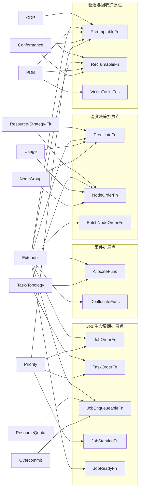

---

## 1. Priority Plugin - 优先级调度

### 1.1 概述

Priority 插件是 Volcano 调度器中最基础的排序插件之一，负责根据 Job 和 Task 的优先级数值对调度顺序进行排列。高优先级的作业和任务将被优先调度和分配资源，低优先级的作业则可能成为抢占的候选对象。

**源码路径**: `pkg/scheduler/plugins/priority/priority.go`

### 1.2 注册扩展点

| 扩展点 | 函数 | 作用 |
|-------|------|------|
| `JobOrderFn` | `jobOrderFn` | 按 Job 优先级排序 |
| `TaskOrderFn` | `taskOrderFn` | 按 Task 优先级排序 |
| `SubJobOrderFn` | `subJobOrderFn` | 按 SubJob 优先级排序 |
| `PreemptableFn` | `preemptableFn` | 基于优先级判断是否可抢占 |
| `JobStarvingFn` | `jobStarvingFn` | 判断 Job 是否处于饥饿状态 |

### 1.3 核心逻辑

#### 优先级来源

- **Job 优先级**: 来源于 `PodGroup.Spec.PriorityClassName` 对应的 `PriorityClass.Value`，存储在 `JobInfo.Priority` 中
- **Task 优先级**: 来源于 `Pod.Spec.Priority`，存储在 `TaskInfo.Priority` 中

#### 排序算法

排序函数遵循统一的比较逻辑，返回值 `-1` 表示左侧优先，`1` 表示右侧优先，`0` 表示相等:

```go
// JobOrderFn: 高优先级 Job 排在前面
if lv.Priority > rv.Priority {
    return -1
}
if lv.Priority < rv.Priority {
    return 1
}
return 0
```

#### 抢占逻辑

抢占判断区分了 **Job 间抢占** 和 **Job 内抢占** 两种场景:

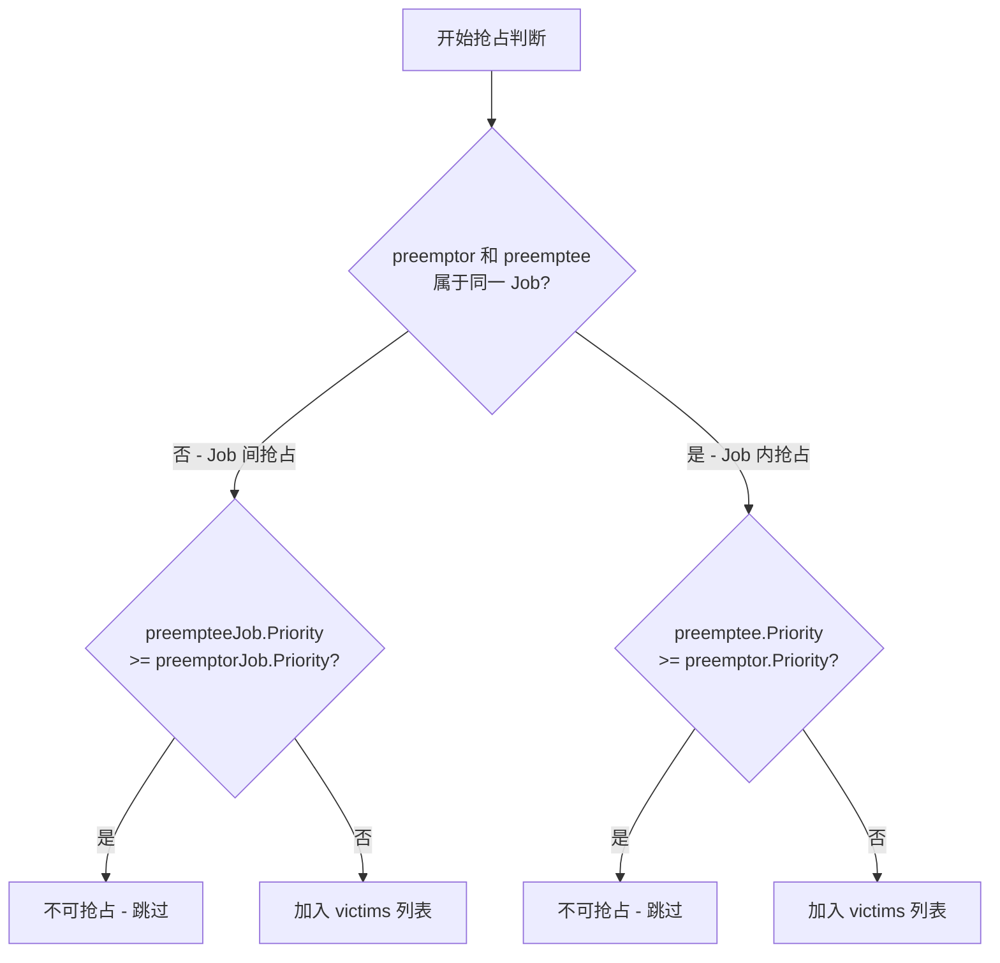

#### 饥饿检测

`JobStarvingFn` 通过比较已就绪和等待中的 Task 数量与总 Task 数量来判断 Job 是否处于饥饿状态:

```go
func jobStarvingFn(obj interface{}) bool {
    ji := obj.(*api.JobInfo)
    return ji.ReadyTaskNum()+ji.WaitingTaskNum() < int32(len(ji.Tasks))
}
```

### 1.4 配置示例

Priority 插件无需额外参数，直接启用即可:

```yaml
actions: "enqueue, allocate, backfill, preempt"
tiers:
- plugins:
  - name: priority
  - name: gang
```

优先级通过 Kubernetes PriorityClass 定义:

```yaml
apiVersion: scheduling.k8s.io/v1
kind: PriorityClass
metadata:
  name: high-priority
value: 1000
globalDefault: false
description: "High priority for critical jobs"
```

---

## 2. Conformance Plugin - 系统保护

### 2.1 概述

Conformance 插件是一个系统保护插件，其核心目的是确保 Kubernetes 系统关键 Pod 不会被 Volcano 调度器的抢占或回收机制驱逐。该插件保护的对象包括 `kube-system` 命名空间中的 Pod 以及带有 `system-cluster-critical` 或 `system-node-critical` PriorityClass 的 Pod。

**源码路径**: `pkg/scheduler/plugins/conformance/conformance.go`

### 2.2 注册扩展点

| 扩展点 | 函数 | 作用 |
|-------|------|------|
| `PreemptableFn` | `evictableFn` | 从抢占候选列表中过滤系统 Pod |
| `ReclaimableFn` | `evictableFn` | 从回收候选列表中过滤系统 Pod |

注意: Conformance 插件复用了同一个 `evictableFn` 同时注册到 `PreemptableFn` 和 `ReclaimableFn` 两个扩展点。

### 2.3 核心逻辑

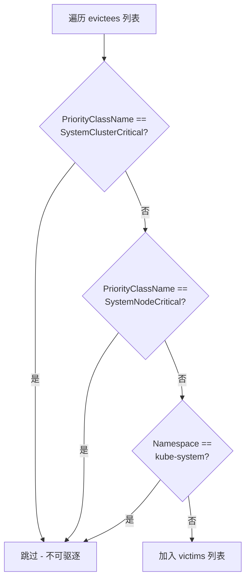

过滤逻辑的代码实现简洁明了:

```go
for _, evictee := range evictees {
    className := evictee.Pod.Spec.PriorityClassName
    if className == scheduling.SystemClusterCritical ||
        className == scheduling.SystemNodeCritical ||
        evictee.Namespace == v1.NamespaceSystem {
        continue
    }
    victims = append(victims, evictee)
}
```

保护范围涵盖三类关键 Pod:

| 保护条件 | 典型场景 |
|---------|---------|
| `PriorityClassName == system-cluster-critical` | 集群级关键组件 (如 kube-dns) |
| `PriorityClassName == system-node-critical` | 节点级关键组件 (如 kube-proxy) |
| `Namespace == kube-system` | 所有系统命名空间内的 Pod |

### 2.4 配置示例

Conformance 插件通常放在第一层 tier 中，确保在其他插件之前执行:

```yaml
actions: "reclaim, allocate, backfill, preempt"
tiers:
- plugins:
  - name: priority
  - name: gang
  - name: conformance
- plugins:
  - name: drf
  - name: predicates
  - name: proportion
```

---

## 3. Overcommit Plugin - 资源超卖

### 3.1 概述

Overcommit 插件通过引入 **超卖因子 (overcommit-factor)** 来控制 enqueue action 中 Job 的入队行为。它允许集群在逻辑上"放大"可用资源，使得更多的 Job 能够进入 Inqueue 状态创建 Pod，从而提升集群利用率。该插件适用于集群资源波动较大、存在突发性资源释放的场景。

**源码路径**: `pkg/scheduler/plugins/overcommit/overcommit.go`

### 3.2 注册扩展点

| 扩展点 | 函数 | 作用 |
|-------|------|------|
| `JobEnqueueableFn` | 匿名函数 | 判断 Job 是否可以入队 |
| `JobEnqueuedFn` | 匿名函数 | Job 入队后更新已入队资源统计 |

### 3.3 核心算法

#### 资源计算流程

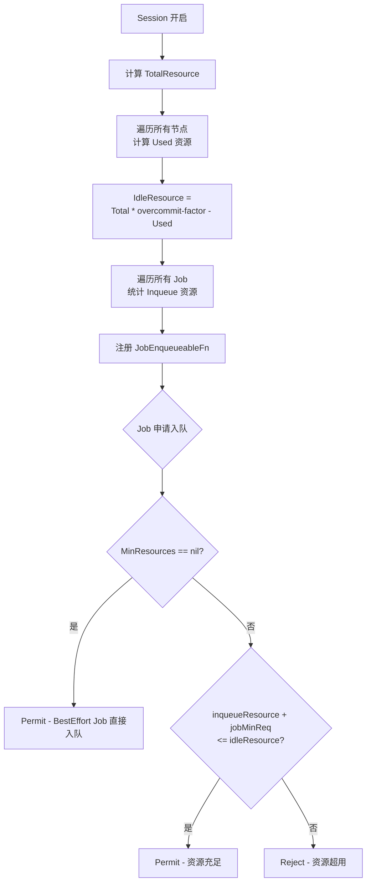

#### 关键公式

```
IdleResource = TotalResource * overcommit-factor - UsedResource
```

其中:
- `TotalResource`: 集群所有节点的总资源
- `overcommit-factor`: 超卖因子 (默认 1.2，最小为 1.0)
- `UsedResource`: 集群已使用的资源总量

#### Inqueue 资源统计

插件在 Session 开启时统计已入队和正在运行的 Job 的资源占用:

```go
// Inqueue 状态的 Job
if job.PodGroup.Status.Phase == scheduling.PodGroupInqueue &&
    job.PodGroup.Spec.MinResources != nil {
    op.inqueueResource.Add(job.DeductSchGatedResources(job.GetMinResources()))
}
// Running 状态且满足 MinMember 的 Job
if job.PodGroup.Status.Phase == scheduling.PodGroupRunning &&
    int32(util.CalculateAllocatedTaskNum(job)) >= job.PodGroup.Spec.MinMember {
    inqueued := util.GetInqueueResource(job, job.Allocated)
    op.inqueueResource.Add(job.DeductSchGatedResources(inqueued))
}
```

### 3.4 配置示例

```yaml
actions: "enqueue, allocate, backfill"
tiers:
- plugins:
  - name: overcommit
    arguments:
      overcommit-factor: 1.5  # 允许超卖 50% 的资源
```

| 参数 | 默认值 | 说明 |
|------|--------|------|
| `overcommit-factor` | 1.2 | 资源超卖因子，不能小于 1.0 |

---

## 4. PDB Plugin - Pod 干扰预算

### 4.1 概述

PDB 插件将 Kubernetes 原生的 PodDisruptionBudget (PDB) 机制集成到 Volcano 调度器的抢占和回收流程中。当调度器需要驱逐 Pod 时，PDB 插件会检查目标 Pod 是否受到 PDB 约束，确保驱逐操作不会违反用户定义的最小可用性保证。

**源码路径**: `pkg/scheduler/plugins/pdb/pdb.go`

### 4.2 注册扩展点

| 扩展点 | 函数 | 作用 |
|-------|------|------|
| `PreemptableFn` | `wrappedPdbFilterFn` | 抢占时检查 PDB 约束 |
| `ReclaimableFn` | `wrappedPdbFilterFn` | 回收时检查 PDB 约束 |
| `VictimTasksFns` | `pdbFilterFn` | 全局受害者过滤 |

### 4.3 核心算法

PDB 检查流程的核心是维护一个 `pdbsAllowed` 数组，跟踪每个 PDB 剩余的允许中断数:

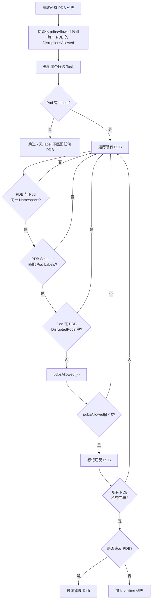

关键实现细节:
1. **全局扣减**: `pdbsAllowed` 数组在遍历所有 Task 的过程中持续扣减，因此前面的 Task 会影响后面的判断结果
2. **DisruptedPods 排除**: 已经在 `pdb.Status.DisruptedPods` 中的 Pod 不会再次扣减配额，防止重复计算
3. **空选择器跳过**: `selector.Empty()` 的 PDB 不匹配任何 Pod

### 4.4 配置示例

PDB 插件无需额外参数:

```yaml
actions: "reclaim, allocate, backfill, preempt"
tiers:
- plugins:
  - name: pdb
  - name: conformance
```

配合 Kubernetes PDB 资源使用:

```yaml
apiVersion: policy/v1
kind: PodDisruptionBudget
metadata:
  name: my-pdb
spec:
  minAvailable: 2
  selector:
    matchLabels:
      app: my-app
```

---

## 5. NodeGroup Plugin - 节点分组

### 5.1 概述

NodeGroup 插件提供了基于节点分组的调度约束能力。通过在 Queue 上定义 NodeGroup 亲和/反亲和规则，结合节点上的 `volcano.sh/nodegroup-name` 标签，可以实现将特定 Queue 的工作负载约束到特定的节点组上运行。该插件还支持层级 Queue 中亲和规则的继承。

**源码路径**: `pkg/scheduler/plugins/nodegroup/nodegroup.go`, `pkg/scheduler/plugins/nodegroup/errors.go`

### 5.2 注册扩展点

| 扩展点 | 函数 | 作用 |
|-------|------|------|
| `PredicateFn` | `predicateFn` | 检查节点是否满足 Queue 的 NodeGroup 约束 |
| `NodeOrderFn` | `nodeOrderFn` | 对满足条件的节点进行评分 |

### 5.3 核心逻辑

#### 亲和规则类型

NodeGroup 支持四种亲和/反亲和规则:

| 规则类型 | 字段 | 行为 |
|---------|------|------|
| Required Affinity | `queueGroupAffinityRequired` | **硬约束** - 必须调度到指定 NodeGroup |
| Preferred Affinity | `queueGroupAffinityPreferred` | **软约束** - 优先调度到指定 NodeGroup |
| Required Anti-Affinity | `queueGroupAntiAffinityRequired` | **硬约束** - 禁止调度到指定 NodeGroup |
| Preferred Anti-Affinity | `queueGroupAntiAffinityPreferred` | **软约束** - 尽量避免指定 NodeGroup |

#### Predicate 判断流程

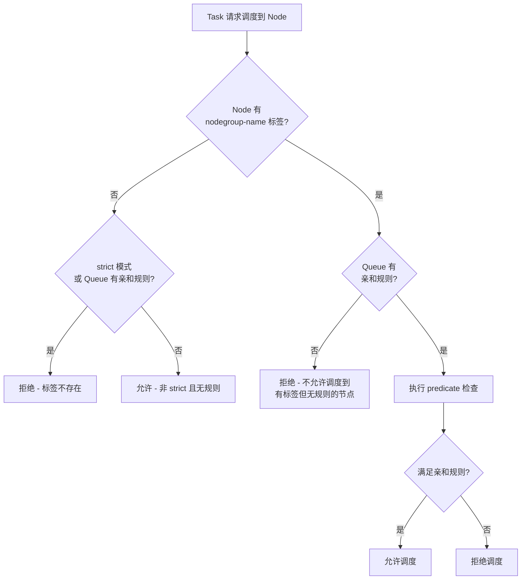

#### 评分机制

```go
func (q queueGroupAffinity) score(group string) float64 {
    nodeScore := 0.0
    if q.queueGroupAffinityRequired.Has(group) {
        nodeScore += BaseScore          // +100
    }
    if q.queueGroupAffinityPreferred.Has(group) {
        nodeScore += 0.5 * BaseScore    // +50
    }
    if q.queueGroupAntiAffinityPreferred.Has(group) {
        nodeScore = -1                  // -1 (软反亲和)
    }
    return nodeScore
}
```

#### 层级继承

当 `enableHierarchy: true` 时，没有亲和规则的子 Queue 会从最近的祖先 Queue 继承亲和规则:

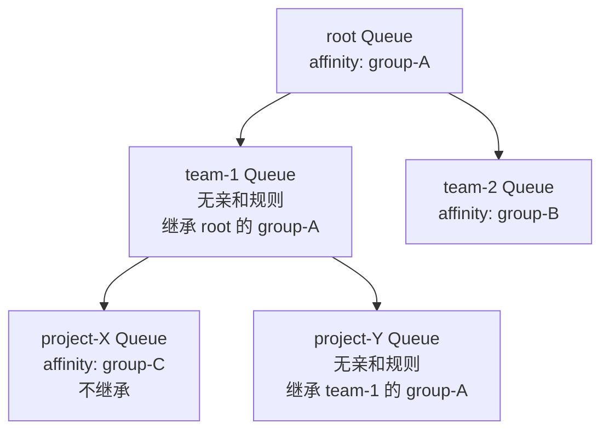

### 5.4 配置示例

```yaml
actions: "reclaim, allocate, backfill, preempt"
tiers:
- plugins:
  - name: nodegroup
    #enableHierarchy: true
    arguments:
      strict: true   # 默认 true，严格模式
```

Queue 资源中定义 NodeGroup 亲和:

```yaml
apiVersion: scheduling.volcano.sh/v1beta1
kind: Queue
metadata:
  name: gpu-queue
spec:
  affinity:
    nodeGroupAffinity:
      requiredDuringSchedulingIgnoredDuringExecution:
        - gpu-pool
      preferredDuringSchedulingIgnoredDuringExecution:
        - high-memory-pool
    nodeGroupAntiAffinity:
      requiredDuringSchedulingIgnoredDuringExecution:
        - cpu-only-pool
```

节点标签:

```bash
kubectl label node gpu-node-1 volcano.sh/nodegroup-name=gpu-pool
```

---

## 6. Usage Plugin - 实时负载感知

### 6.1 概述

Usage 插件基于节点的 **实时资源使用率** 进行调度决策，而非仅依赖 Kubernetes 的 Request/Limit 静态资源模型。它通过读取 metrics server 或 Prometheus 提供的监控数据，对节点进行过滤 (Predicate) 和评分 (NodeOrder)，将 Pod 优先调度到实际负载较低的节点上。

**源码路径**: `pkg/scheduler/plugins/usage/usage.go`

### 6.2 注册扩展点

| 扩展点 | 函数 | 作用 |
|-------|------|------|
| `PredicateFn` | `predicateFn` | 过滤掉负载超过阈值的节点 |
| `NodeOrderFn` | `nodeOrderFn` | 按实际负载给节点评分 |

### 6.3 核心算法

#### Predicate 过滤

当节点的 CPU 或内存使用率超过配置的阈值时，该节点将被过滤:

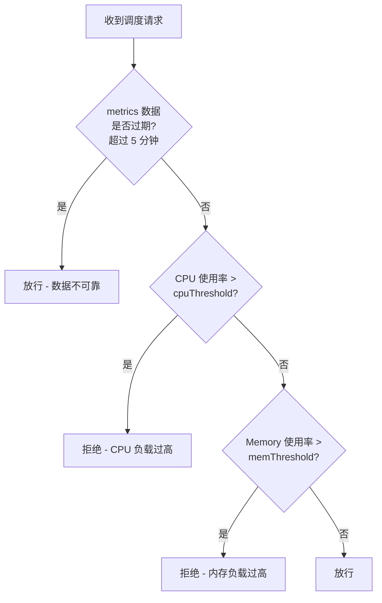

#### NodeOrder 评分

评分公式综合了 CPU 和内存的使用率，负载越低得分越高:

```
cpuScore = (100 - cpuUsage) / 100 * cpuWeight
memoryScore = (100 - memoryUsage) / 100 * memoryWeight
score = (cpuScore + memoryScore) / (cpuWeight + memoryWeight)
score *= MaxNodeScore * usageWeight
```

例如: 某节点 CPU 使用率 40%，内存使用率 60%，cpuWeight=1，memoryWeight=1，usageWeight=5:
- cpuScore = (100 - 40) / 100 * 1 = 0.6
- memoryScore = (100 - 60) / 100 * 1 = 0.4
- score = (0.6 + 0.4) / 2 = 0.5
- finalScore = 0.5 * 100 * 5 = 250

### 6.4 配置示例

```yaml
actions: "enqueue, allocate, backfill"
tiers:
- plugins:
  - name: usage
    enablePredicate: true   # 是否开启负载过滤
    arguments:
      usage.weight: 5       # 插件在 NodeOrder 中的权重
      cpu.weight: 1         # CPU 评分权重
      memory.weight: 1      # 内存评分权重
      thresholds:
        cpu: 80             # CPU 使用率阈值 (%)
        mem: 80             # 内存使用率阈值 (%)
```

| 参数 | 默认值 | 说明 |
|------|--------|------|
| `usage.weight` | 5 | NodeOrder 评分权重 |
| `cpu.weight` | 1 | CPU 维度评分权重 |
| `memory.weight` | 1 | Memory 维度评分权重 |
| `thresholds.cpu` | 80 | CPU 使用率阈值 |
| `thresholds.mem` | 80 | Memory 使用率阈值 |

---

## 7. ResourceQuota Plugin - 资源配额

### 7.1 概述

ResourceQuota 插件在 Job 入队阶段检查 Kubernetes 原生的 ResourceQuota 限制。当 Job 所在命名空间的资源配额不足以容纳该 Job 的 MinResources 请求时，插件会拒绝该 Job 入队，从而避免创建无法调度的 Pod 造成资源浪费。

**源码路径**: `pkg/scheduler/plugins/resourcequota/resourcequota.go`

### 7.2 注册扩展点

| 扩展点 | 函数 | 作用 |
|-------|------|------|
| `JobEnqueueableFn` | 匿名函数 | 入队前检查 ResourceQuota |

### 7.3 核心算法

ResourceQuota 插件维护了一个 `pendingResources` map，跟踪同一调度周期内已经通过检查但尚未真正消耗配额的 Job 资源:

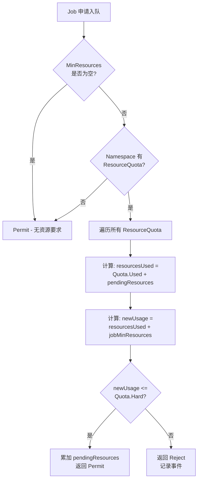

关键实现细节:

```go
// 累加同一 Namespace 中已通过检查的 pending 资源
if pendingUse, found := pendingResources[job.Namespace]; found {
    resourcesUsed = quotav1.Add(pendingUse, resourcesUsed)
}
newUsage := quotav1.Add(resourcesUsed, requestedUsage)

// 检查是否超出 Hard 限制
if allowed, exceeded := quotav1.LessThanOrEqual(maskedNewUsage, resourceQuota.Hard); !allowed {
    // Reject 并记录详细的超限信息
    return util.Reject
}

// 通过检查后累加到 pendingResources
pendingResources[job.Namespace] = quotav1.Add(pendingResources[job.Namespace], *resourcesRequests)
```

**pendingResources 的作用**: 假设 Namespace 配额为 8 CPU，已用 2 CPU。第一个 Job 请求 4 CPU 通过检查，此时 `pendingResources` 记录 4 CPU。第二个 Job 请求 4 CPU 时，Used(2) + Pending(4) + Requested(4) = 10 > Hard(8)，因此被拒绝。

### 7.4 配置示例

```yaml
actions: "enqueue, allocate, backfill"
tiers:
- plugins:
  - name: resourcequota
  - name: overcommit
```

配合 Kubernetes ResourceQuota:

```yaml
apiVersion: v1
kind: ResourceQuota
metadata:
  name: team-quota
  namespace: team-a
spec:
  hard:
    cpu: "100"
    memory: "200Gi"
    nvidia.com/gpu: "8"
```

---

## 8. Task-Topology Plugin - 任务拓扑亲和

### 8.1 概述

Task-Topology 插件允许用户在 Job 内部定义 Task 之间的拓扑亲和/反亲和关系。通过将具有亲和关系的 Task 调度到同一节点 (或尽可能近的位置)，以及将具有反亲和关系的 Task 调度到不同节点，来优化通信性能和资源隔离。该插件使用 **Bucket** 概念对 Task 进行分组管理。

**源码路径**: `pkg/scheduler/plugins/task-topology/`
- `topology.go` - 插件主体与扩展点注册
- `manager.go` - JobManager 管理亲和关系与 Bucket 构建
- `bucket.go` - Bucket 数据结构
- `util.go` - 常量定义与辅助函数

### 8.2 注册扩展点

| 扩展点 | 函数 | 作用 |
|-------|------|------|
| `TaskOrderFn` | `p.TaskOrderFn` | 根据拓扑约束排列 Task 调度顺序 |
| `NodeOrderFn` | `p.NodeOrderFn` | 根据 Bucket 亲和关系评分节点 |
| `AllocateFunc` (EventHandler) | `p.AllocateFunc` | Task 分配后更新 Bucket 状态 |

### 8.3 核心概念

#### Bucket 机制

Bucket 是一组具有亲和关系的 Task 的集合。插件通过分析 PodGroup annotations 中定义的拓扑规则，将 Task 分配到不同的 Bucket 中:

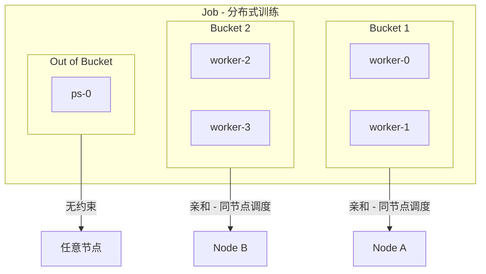

#### 四种拓扑关系

| 拓扑类型 | 优先级 | 说明 |
|---------|--------|------|
| `selfAntiAffinity` | 4 (最高) | 同名 Task 之间反亲和 |
| `interAffinity` | 3 | 不同名 Task 之间亲和 |
| `selfAffinity` | 2 | 同名 Task 之间亲和 |
| `interAntiAffinity` | 1 (最低) | 不同名 Task 之间反亲和 |

#### 注解定义方式

通过 PodGroup 的 annotations 定义拓扑规则:

| Annotation Key | 格式 | 示例 |
|---------------|------|------|
| `volcano.sh/task-topology-affinity` | `task1,task2;task3,task4` | `worker,ps` |
| `volcano.sh/task-topology-anti-affinity` | `task1,task2;task3` | `worker` |
| `volcano.sh/task-topology-task-order` | `task1,task2,task3` | `ps,worker` |

#### TaskOrder 排序

Bucket 内的 Task 优先于 Bucket 外的 Task 调度，大 Bucket 优先于小 Bucket:

```
排序优先级:
1. 有 Bucket 的 Task > 无 Bucket 的 Task
2. 大 Bucket 中的 Task > 小 Bucket 中的 Task
3. 旧 Bucket (index 小) > 新 Bucket (index 大)
4. 同 Bucket 内按 affinityOrder 排序
```

#### NodeOrder 评分

```go
// 基础分: 同 Bucket 中已绑定到该节点的 Task 数量
score := bucket.node[node.Name]
// 反亲和扣分
if affinityScore < 0 {
    score += affinityScore
}
// 同 Bucket 未绑定的 Task 数量
score += len(bucket.tasks)
// 归一化
fScore = float64(score * weight) * MaxNodeScore / float64(bucketMaxSize)
```

### 8.4 配置示例

```yaml
actions: "enqueue, reclaim, allocate, backfill, preempt"
tiers:
- plugins:
  - name: task-topology
    arguments:
      task-topology.weight: 10
```

PodGroup 注解配置:

```yaml
apiVersion: scheduling.volcano.sh/v1beta1
kind: PodGroup
metadata:
  name: distributed-training
  annotations:
    volcano.sh/task-topology-affinity: "worker,ps"
    volcano.sh/task-topology-anti-affinity: "worker"
    volcano.sh/task-topology-task-order: "ps,worker"
spec:
  minMember: 5
```

---

## 9. Extender Plugin - 外部扩展

### 9.1 概述

Extender 插件是 Volcano 调度器的 **HTTP Webhook 扩展机制**。它允许用户通过部署外部 HTTP 服务来实现自定义调度逻辑，而无需修改 Volcano 源码。Extender 支持几乎所有的调度器扩展点，通过 HTTP POST 请求将调度上下文发送到外部服务，并接收调度决策结果。

**源码路径**: `pkg/scheduler/plugins/extender/extender.go`, `pkg/scheduler/plugins/extender/argument.go`

### 9.2 支持的扩展点

| 扩展点 | 配置 Key | Request 类型 | Response 类型 |
|-------|----------|-------------|--------------|
| OnSessionOpen | `extender.onSessionOpenVerb` | `OnSessionOpenRequest` | - |
| OnSessionClose | `extender.onSessionCloseVerb` | `OnSessionCloseRequest` | - |
| PredicateFn | `extender.predicateVerb` | `PredicateRequest` | `PredicateResponse` |
| BatchNodeOrderFn | `extender.prioritizeVerb` | `PrioritizeRequest` | `PrioritizeResponse` |
| PreemptableFn | `extender.preemptableVerb` | `PreemptableRequest` | `PreemptableResponse` |
| ReclaimableFn | `extender.reclaimableVerb` | `ReclaimableRequest` | `ReclaimableResponse` |
| JobEnqueueableFn | `extender.jobEnqueueableVerb` | `JobEnqueueableRequest` | `JobEnqueueableResponse` |
| QueueOverusedFn | `extender.queueOverusedVerb` | `QueueOverusedRequest` | `QueueOverusedResponse` |
| JobReadyFn | `extender.jobReadyVerb` | `JobReadyRequest` | `JobReadyResponse` |
| AllocateFunc | `extender.allocateFuncVerb` | `EventHandlerRequest` | `EventHandlerResponse` |
| DeallocateFunc | `extender.deallocateFuncVerb` | `EventHandlerRequest` | `EventHandlerResponse` |

### 9.3 核心架构

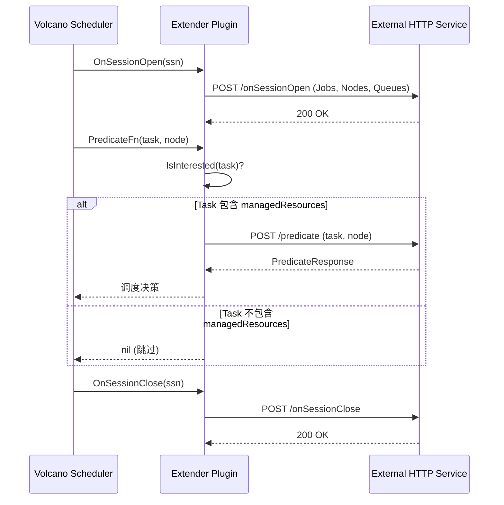

#### managedResources 过滤

Extender 插件支持通过 `managedResources` 配置只关注特定资源类型的 Task:

```go
func (ep *extenderPlugin) IsInterested(task *api.TaskInfo) bool {
    if ep.config.managedResources.Len() == 0 {
        return true  // 未配置则关注所有 Task
    }
    // 检查 containers 和 initContainers 的 Requests/Limits
    return ep.hasManagedResources(task.Pod.Spec.Containers) ||
           ep.hasManagedResources(task.Pod.Spec.InitContainers)
}
```

#### 错误处理策略

`ignorable` 参数决定了外部服务出错时的行为:

| `ignorable` | 外部服务出错时 |
|-------------|--------------|
| `true` | 忽略错误，让调度继续进行 |
| `false` | 返回错误，可能导致调度失败 |

#### HTTP 通信

所有请求均为 JSON 格式的 HTTP POST，响应体最大限制为 10MB:

```go
func (ep *extenderPlugin) send(action string, args interface{}, result interface{}) error {
    out, _ := json.Marshal(args)
    url := strings.TrimRight(ep.config.urlPrefix, "/") + "/" + action
    req, _ := http.NewRequest("POST", url, bytes.NewReader(out))
    req.Header.Set("Content-Type", "application/json")
    resp, _ := ep.client.Do(req)
    resp.Body = http.MaxBytesReader(nil, resp.Body, 10<<20) // 10MB limit
    return json.NewDecoder(resp.Body).Decode(result)
}
```

### 9.4 配置示例

```yaml
actions: "reclaim, allocate, backfill, preempt"
tiers:
- plugins:
  - name: extender
    arguments:
      extender.urlPrefix: http://my-extender-service:8080
      extender.httpTimeout: 100ms
      extender.onSessionOpenVerb: onSessionOpen
      extender.onSessionCloseVerb: onSessionClose
      extender.predicateVerb: predicate
      extender.prioritizeVerb: prioritize
      extender.preemptableVerb: preemptable
      extender.reclaimableVerb: reclaimable
      extender.queueOverusedVerb: queueOverused
      extender.jobEnqueueableVerb: jobEnqueueable
      extender.jobReadyVerb: jobReady
      extender.allocateFuncVerb: allocate
      extender.deallocateFuncVerb: deallocate
      extender.ignorable: true
      extender.managedResources:
        - nvidia.com/gpu
        - nvidia.com/gpumem
```

| 参数 | 默认值 | 说明 |
|------|--------|------|
| `extender.urlPrefix` | - | 外部服务地址 (必填) |
| `extender.httpTimeout` | 1s | HTTP 请求超时时间 |
| `extender.ignorable` | false | 是否忽略外部服务错误 |
| `extender.managedResources` | 空 (全部) | 关注的资源类型列表 |
| `extender.*Verb` | - | 各扩展点的 HTTP path |

---

## 10. CDP Plugin - 冷却保护

### 10.1 概述

CDP (Cooldown Protection) 插件用于弹性调度场景中的 Pod 冷却保护。在启用弹性训练或弹性服务时，可抢占的 Job 的 Pod 可能会被频繁抢占和恢复运行。如果没有冷却保护机制，刚启动的 Pod 可能立即再次被抢占，导致服务稳定性下降。CDP 插件确保 Pod 在启动后的冷却时间内不会被抢占或回收。

**源码路径**: `pkg/scheduler/plugins/cdp/cdp.go`

**背景 Issue**: [volcano-sh/volcano#2075](https://github.com/volcano-sh/volcano/issues/2075)

### 10.2 注册扩展点

| 扩展点 | 函数 | 作用 |
|-------|------|------|
| `PreemptableFn` | `filterVictimFn` | 从抢占候选中过滤冷却期内的 Pod |
| `ReclaimableFn` | `filterVictimFn` | 从回收候选中过滤冷却期内的 Pod |

### 10.3 核心逻辑

#### 冷却时间获取

冷却时间通过 Pod 的 label 或 annotation `volcano.sh/cooldown-time` 配置:

```go
func (sp *CooldownProtectionPlugin) podCooldownTime(pod *v1.Pod) (time.Duration, bool) {
    v, ok := pod.Labels[v1beta1.CooldownTime]      // 先检查 label
    if !ok {
        v, ok = pod.Annotations[v1beta1.CooldownTime]  // 再检查 annotation
    }
    return time.ParseDuration(v)  // 支持 "600s", "10m" 等格式
}
```

#### 冷却判断流程

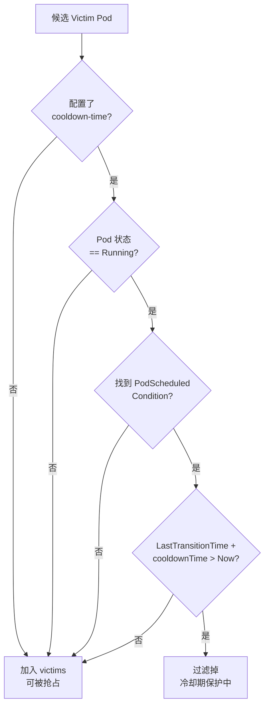

关键时间判断:

```go
for _, c := range pod.Status.Conditions {
    if c.Type == v1.PodScheduled && c.Status == v1.ConditionTrue {
        if c.LastTransitionTime.Add(cooldownTime).After(time.Now()) {
            stableFiltered = true  // 仍在冷却期内
        }
        break
    }
}
```

### 10.4 配置示例

CDP 插件本身无需参数:

```yaml
actions: "reclaim, allocate, backfill, preempt"
tiers:
- plugins:
  - name: cdp
  - name: conformance
  - name: priority
```

在 Pod 上配置冷却时间:

```yaml
apiVersion: v1
kind: Pod
metadata:
  labels:
    volcano.sh/cooldown-time: "10m"   # 10 分钟冷却保护
spec:
  containers:
  - name: worker
    image: training:latest
```

或通过 Volcano Job 的 Task 模板:

```yaml
apiVersion: batch.volcano.sh/v1alpha1
kind: Job
metadata:
  name: elastic-training
spec:
  tasks:
  - replicas: 4
    name: worker
    template:
      metadata:
        labels:
          volcano.sh/cooldown-time: "5m"
      spec:
        containers:
        - name: worker
          image: training:latest
```

---

## 11. Resource-Strategy-Fit Plugin - 资源策略适配

### 11.1 概述

Resource-Strategy-Fit 插件是一个功能丰富的 **统一资源评分插件**，提供了可配置的资源评分策略。它支持 MostAllocated (装箱优先) 和 LeastAllocated (分散优先) 两种评分策略，并且可以为不同的资源类型分别配置策略和权重。此外，该插件还包含两个子策略: **SRA (Specialized Resource Affinity)** 用于将任务调度到拥有特定资源的节点，以及 **Proportional** 用于强制资源比例约束。

**源码路径**: `pkg/scheduler/plugins/resource-strategy-fit/`
- `resource_strategy_fit.go` - 插件主体、评分逻辑与通配符匹配
- `sra.go` - SRA (Specialized Resource Affinity) 子策略
- `proportional.go` - Proportional (资源比例) 子策略

### 11.2 注册扩展点

| 扩展点 | 函数 | 条件 | 作用 |
|-------|------|------|------|
| `PredicateFn` | `predicateFn` | 仅当 Proportional 启用时 | 检查节点资源比例约束 |
| `NodeOrderFn` | `nodeOrderFn` | 权重 > 0 时 | 综合资源策略评分 |

### 11.3 核心逻辑

#### 资源评分策略

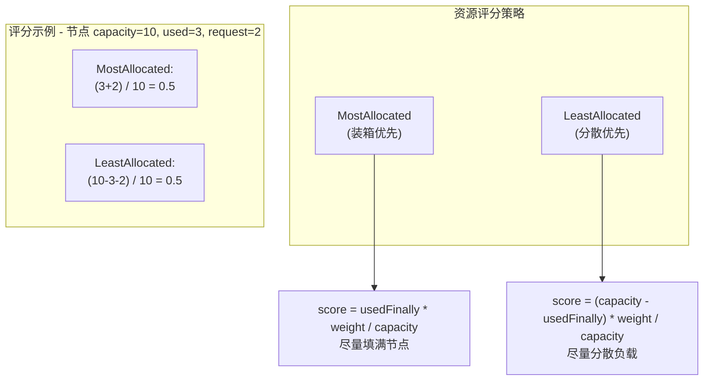

两种评分函数的实现:

```go
// MostAllocated: 使用率越高分越高 -> 装箱效果
func mostRequestedScore(requested, used, capacity, weight) float64 {
    usedFinally := requested + used
    return usedFinally * weight / capacity
}

// LeastAllocated: 使用率越低分越高 -> 分散效果
func leastRequestedScore(requested, used, capacity, weight) float64 {
    usedFinally := requested + used
    return (capacity - usedFinally) * weight / capacity
}
```

#### 通配符模式匹配

插件支持通配符模式，允许用户为一类资源统一配置策略:

```go
// 精确匹配优先级 > 通配符匹配
// 通配符匹配选择最长前缀
"nvidia.com/gpu"  -> 先精确匹配 "nvidia.com/gpu"
                  -> 再匹配 "nvidia.com/*"
                  -> 再匹配 "nvidia.*" (不支持，非尾部通配)
```

合法模式: `nvidia.com/*`, `cloudml.gpu/*`
非法模式: `*` (单独星号), `*.com/gpu` (星号不在尾部)

#### Pod 级别注解覆盖

Task 可通过 Pod 注解覆盖全局评分策略:

```yaml
annotations:
  volcano.sh/resource-strategy-scoring-type: "MostAllocated"
  volcano.sh/resource-strategy-weight: '{"cpu": 2, "memory": 1}'
```

#### SRA (Specialized Resource Affinity) 子策略

SRA 策略用于将 Task 调度到 **拥有特定稀缺资源的节点附近**:

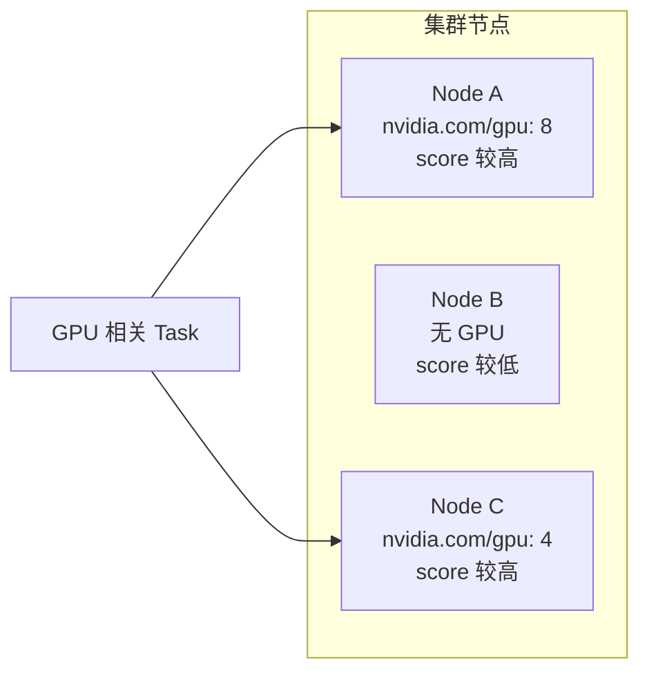

SRA 评分逻辑:
1. 检查节点是否具有指定的稀缺资源
2. 有该资源的节点获得加权分数
3. 最终得分: `(1 - weightedScore / totalWeight) * MaxNodeScore * sraWeight`

其中 `1 - score` 的设计使得 **没有** 稀缺资源的节点得到更高的 SRA 分数，这是为了在不需要该资源的 Task 调度时，将其引导远离稀缺资源节点，从而为真正需要的 Task 保留资源。

#### Proportional (资源比例) 子策略

Proportional 策略确保当节点具有特定的稀缺资源时，为每个稀缺资源单元预留对应比例的 CPU 和内存:

```go
// 例如: 每张 GPU 预留 4 核 CPU 和 8Gi 内存
// 配置: nvidia.com/gpu.cpu = 4, nvidia.com/gpu.memory = 8
// 节点有 2 张空闲 GPU，则预留: 8 CPU, 16Gi Memory
cpuReserved := idleGPU * 4     // 2 * 4 = 8 CPU
memReserved := idleGPU * 8 * 1M  // 2 * 8 * 1M = 16Gi Memory

// 如果调度后剩余 CPU/Memory 不足预留量，则拒绝调度
if node.Idle.CPU - task.CPU < cpuReserved {
    return Reject  // 会破坏 GPU:CPU 的比例约束
}
```

### 11.4 配置示例

完整配置:

```yaml
actions: "enqueue, allocate, backfill, reclaim, preempt"
tiers:
- plugins:
  - name: resource-strategy-fit
    arguments:
      resourceStrategyFitWeight: 10
      resources:
        nvidia.com/gpu:
          type: MostAllocated      # GPU 使用装箱策略
          weight: 2
        cpu:
          type: LeastAllocated     # CPU 使用分散策略
          weight: 1
        memory:
          type: LeastAllocated
          weight: 1
      sra:
        enable: true
        resources: nvidia.com/gpu
        weight: 10
        resourceWeight:
          nvidia.com/gpu: 1
      proportional:
        enable: true
        resources: nvidia.com/gpu
        resourceProportion:
          nvidia.com/gpu.cpu: 4       # 每张 GPU 预留 4 核 CPU
          nvidia.com/gpu.memory: 8    # 每张 GPU 预留 8Gi Memory
```

| 参数 | 默认值 | 说明 |
|------|--------|------|
| `resourceStrategyFitWeight` | 10 | 插件全局权重 |
| `resources.<name>.type` | LeastAllocated | MostAllocated 或 LeastAllocated |
| `resources.<name>.weight` | 1 | 资源维度权重 |
| `sra.enable` | false | 是否启用 SRA 子策略 |
| `sra.weight` | 1 | SRA 评分权重 |
| `proportional.enable` | false | 是否启用 Proportional 子策略 |
| `proportional.resourceProportion` | - | 资源比例配置 |

---

## 总结

### 插件对比与选型指南

| 场景 | 推荐插件 | 原因 |
|------|---------|------|
| 基础优先级调度 | Priority | 最简单的排序机制，几乎所有场景必备 |
| 保护系统组件 | Conformance | 防止系统关键 Pod 被驱逐，生产环境必备 |
| 提高集群利用率 | Overcommit | 适合资源波动大的场景，允许更多 Job 入队 |
| 服务高可用保护 | PDB | 配合 K8s PDB 使用，确保驱逐不破坏可用性 |
| 多租户资源隔离 | NodeGroup | 将不同租户的工作负载隔离到不同节点组 |
| 负载均衡调度 | Usage | 基于真实负载而非 Request 做调度决策 |
| Namespace 配额控制 | ResourceQuota | 在入队阶段即拦截超配额的 Job |
| 分布式训练优化 | Task-Topology | 控制 Task 间的拓扑放置关系 |
| 自定义调度逻辑 | Extender | 无需修改源码即可扩展调度能力 |
| 弹性训练稳定性 | CDP | 防止 Pod 被频繁抢占导致训练中断 |
| GPU 集群优化 | Resource-Strategy-Fit | GPU 装箱、CPU 分散、资源比例保护 |

### 常见插件组合

#### 基础生产环境

```yaml
tiers:
- plugins:
  - name: priority
  - name: gang
  - name: conformance
- plugins:
  - name: overcommit
  - name: drf
  - name: predicates
  - name: proportion
```

#### GPU 训练集群

```yaml
tiers:
- plugins:
  - name: priority
  - name: gang
  - name: conformance
  - name: pdb
  - name: cdp
- plugins:
  - name: overcommit
  - name: predicates
  - name: nodegroup
  - name: resource-strategy-fit
    arguments:
      resources:
        nvidia.com/gpu:
          type: MostAllocated
          weight: 5
      sra:
        enable: true
        resources: nvidia.com/gpu
        weight: 10
      proportional:
        enable: true
        resources: nvidia.com/gpu
        resourceProportion:
          nvidia.com/gpu.cpu: 8
          nvidia.com/gpu.memory: 32
  - name: task-topology
    arguments:
      task-topology.weight: 10
```

#### 混合负载集群 (含外部扩展)

```yaml
tiers:
- plugins:
  - name: priority
  - name: gang
  - name: conformance
  - name: pdb
- plugins:
  - name: overcommit
  - name: resourcequota
  - name: predicates
  - name: usage
    arguments:
      usage.weight: 5
      thresholds:
        cpu: 75
        mem: 80
  - name: nodegroup
  - name: extender
    arguments:
      extender.urlPrefix: http://custom-scheduler:8080
      extender.predicateVerb: filter
      extender.prioritizeVerb: score
      extender.ignorable: true
  - name: proportion
```
