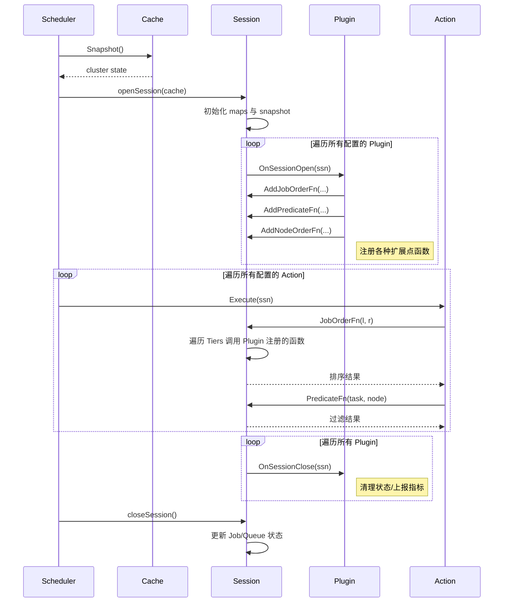
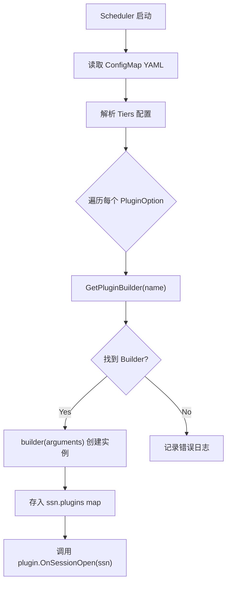
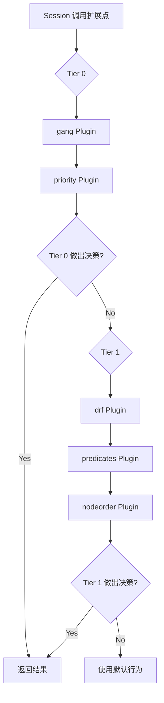
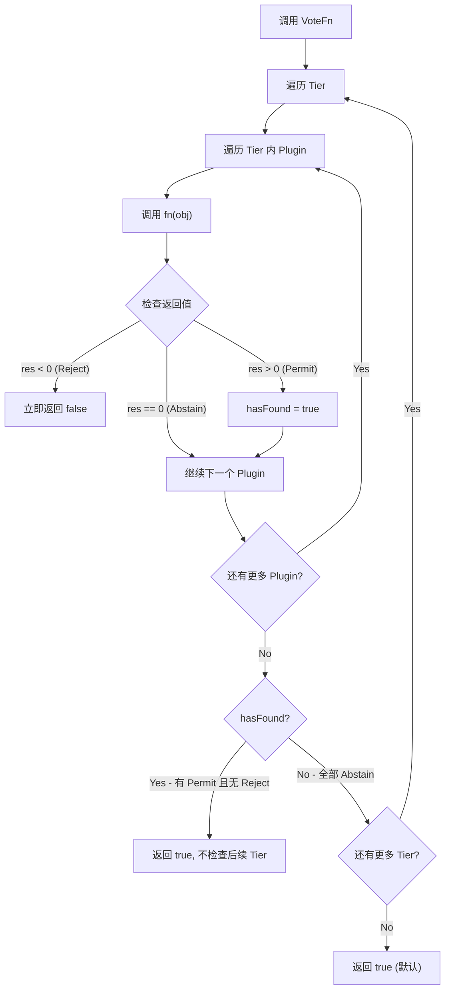
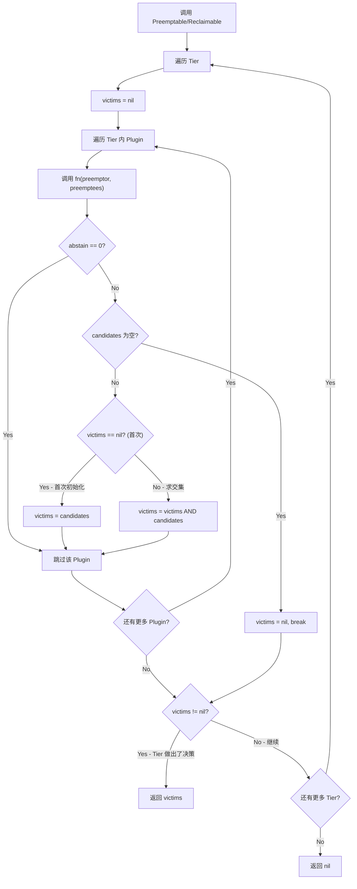
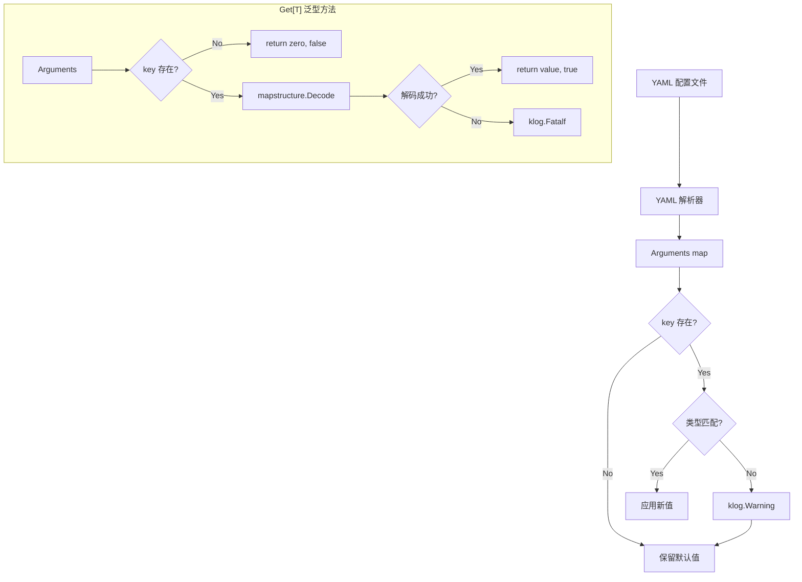
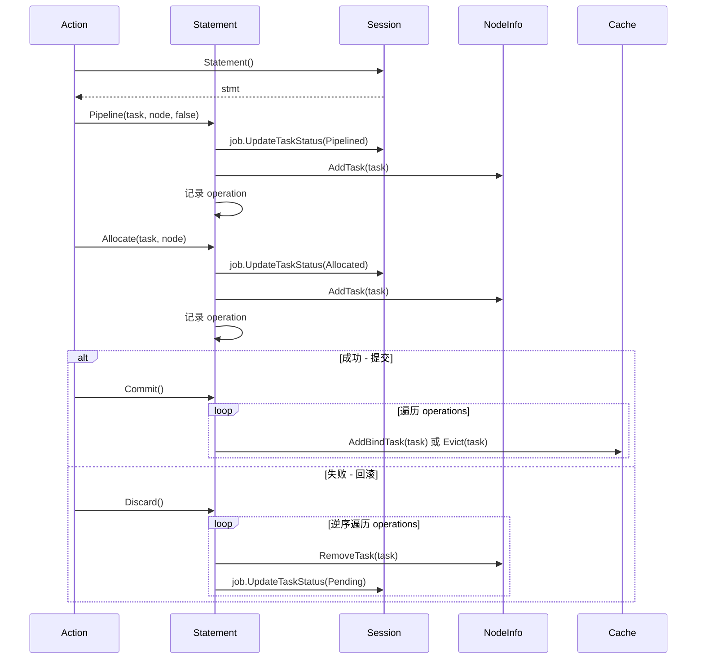

## 1. 概述

### 1.1 Plugin 在 Volcano 调度器中的角色

Volcano 调度器采用 **Action-Plugin** 双层架构。Action 定义调度的宏观流程（如 enqueue、allocate、preempt），而 Plugin 则通过注册扩展点函数（Extension Points）提供具体的调度策略。每个调度周期中，Action 调用 Session 上的扩展点方法，Session 遍历 Tier 中已注册的 Plugin 函数来做出决策。

Plugin 是 Volcano 调度器的策略核心，负责：

- **排序决策** - Job、Queue、Task 的调度优先级
- **过滤与评分** - 节点筛选（Predicate）和评分（NodeOrder）
- **抢占与回收** - 确定可被驱逐的 victim 集合
- **生命周期管理** - Job 入队、就绪判断、Pipeline 状态管理
- **资源管理** - Queue 的 Overused/Allocatable 判定

### 1.2 Plugin vs Action 的区别

| 维度 | Plugin | Action |
|------|--------|--------|
| 职责 | 提供调度策略（"怎么判断"） | 编排调度流程（"何时做什么"） |
| 接口 | `Plugin` interface（3 个方法） | `Action` interface（4 个方法） |
| 生命周期 | 每个 Session 周期调用 Open/Close | 在 Session 内按配置顺序执行 |
| 数量 | 当前 24 个内置 Plugin | 6 个内置 Action |
| 注册方式 | `RegisterPluginBuilder(name, builder)` | `RegisterAction(action)` |
| 配置方式 | 在 `tiers` 中配置，可按扩展点开关 | 在 `actions` 字符串中配置顺序 |

### 1.3 开发一个 Plugin 的完整流程


## 2. Plugin 接口与生命周期

### 2.1 Plugin Interface 详解

Plugin 接口定义在 `pkg/scheduler/framework/interface.go` 中，极其简洁：

```go
// Plugin is the interface of scheduler plugin
type Plugin interface {
    // The unique name of Plugin.
    Name() string

    OnSessionOpen(ssn *Session)
    OnSessionClose(ssn *Session)
}
```

| 方法 | 说明 |
|------|------|
| `Name()` | 返回插件唯一名称，用于注册、配置匹配和日志 |
| `OnSessionOpen(ssn)` | Session 打开时调用，在此注册所有扩展点函数 |
| `OnSessionClose(ssn)` | Session 关闭时调用，用于清理状态、上报指标等 |

此外还有一个可选接口 `BindContextHandler`，允许插件在绑定阶段设置扩展信息：

```go
type BindContextHandler interface {
    SetupBindContextExtension(state *k8sframework.CycleState, bindCtx *cache.BindContext)
}
```

### 2.2 PluginBuilder 工厂函数

每个 Plugin 需要提供一个 `PluginBuilder` 工厂函数：

```go
type PluginBuilder = func(Arguments) Plugin
```

该函数接收 `Arguments`（即 `map[string]interface{}`）作为配置参数，返回 Plugin 实例。例如：

```go
func New(arguments framework.Arguments) framework.Plugin {
    return &myPlugin{pluginArguments: arguments}
}
```

### 2.3 Session 与 Plugin 的交互模型

以下时序图展示了一个完整调度周期中 Plugin 的生命周期：



### 2.4 Plugin 实例化流程



## 3. 扩展点（Extension Points）详解

### 3.1 完整扩展点分类

Volcano 的扩展点可分为六大类。以下表格列出了所有扩展点及其签名和用途：

#### 排序类扩展点

| 扩展点 | 注册方法 | 函数签名 | 用途 | isEnabled 字段 |
|--------|---------|----------|------|----------------|
| JobOrder | `AddJobOrderFn` | `func(l, r interface{}) int` | Job 调度优先级排序 | `EnabledJobOrder` |
| QueueOrder | `AddQueueOrderFn` | `func(l, r interface{}) int` | Queue 调度顺序 | `EnabledQueueOrder` |
| TaskOrder | `AddTaskOrderFn` | `func(l, r interface{}) int` | Task 内部排序 | `EnabledTaskOrder` |
| ClusterOrder | `AddClusterOrderFn` | `func(l, r interface{}) int` | 多集群排序 | `EnabledClusterOrder` |
| SubJobOrder | `AddSubJobOrderFn` | `func(l, r interface{}) int` | SubJob 排序 | `EnabledSubJobOrder` |

排序函数返回值约定：返回 **负数** 表示 `l` 优先；返回 **正数** 表示 `r` 优先；返回 **0** 表示相等（交给下一个 Plugin 判断）。

#### 过滤与评分类扩展点

| 扩展点 | 注册方法 | 函数签名 | 用途 | isEnabled 字段 |
|--------|---------|----------|------|----------------|
| PrePredicate | `AddPrePredicateFn` | `func(task *TaskInfo) error` | 预过滤（不依赖节点） | `EnabledPredicate` |
| Predicate | `AddPredicateFn` | `func(task *TaskInfo, node *NodeInfo) error` | 节点过滤 | `EnabledPredicate` |
| BestNode | `AddBestNodeFn` | `func(task *TaskInfo, scores map[float64][]*NodeInfo) *NodeInfo` | 最优节点选择 | `EnabledBestNode` |
| NodeOrder | `AddNodeOrderFn` | `func(task *TaskInfo, node *NodeInfo) (float64, error)` | 节点评分 | `EnabledNodeOrder` |
| BatchNodeOrder | `AddBatchNodeOrderFn` | `func(task *TaskInfo, nodes []*NodeInfo) (map[string]float64, error)` | 批量节点评分 | `EnabledNodeOrder` |
| NodeMap | `AddNodeMapFn` | `func(task *TaskInfo, node *NodeInfo) (float64, error)` | Map 阶段节点评分 | `EnabledNodeOrder` |
| NodeReduce | `AddNodeReduceFn` | `func(task *TaskInfo, scores NodeScoreList) error` | Reduce 阶段评分归一化 | `EnabledNodeOrder` |
| HyperNodeOrder | `AddHyperNodeOrderFn` | `func(subJob *SubJobInfo, hyperNodes map[string][]*NodeInfo) (map[string]float64, error)` | HyperNode 评分 | `EnabledHyperNodeOrder` |

#### 抢占与回收类扩展点

| 扩展点 | 注册方法 | 函数签名 | 用途 | isEnabled 字段 |
|--------|---------|----------|------|----------------|
| Preemptable | `AddPreemptableFn` | `func(preemptor *TaskInfo, preemptees []*TaskInfo) ([]*TaskInfo, int)` | 选择抢占 victim | `EnabledPreemptable` |
| Reclaimable | `AddReclaimableFn` | `func(reclaimer *TaskInfo, reclaimees []*TaskInfo) ([]*TaskInfo, int)` | 选择回收 victim | `EnabledReclaimable` |
| VictimTasks | `AddVictimTasksFns` | `func(tasks []*TaskInfo) []*TaskInfo` | 从 Job 中选择 victim task | `EnabledVictim` |

#### Job 生命周期类扩展点

| 扩展点 | 注册方法 | 函数签名 | 用途 | isEnabled 字段 |
|--------|---------|----------|------|----------------|
| JobValid | `AddJobValidFn` | `func(obj interface{}) *ValidateResult` | 验证 Job 有效性 | 始终启用（无开关） |
| JobEnqueueable | `AddJobEnqueueableFn` | `func(obj interface{}) int` | 投票决定 Job 能否入队 | `EnabledJobEnqueued` |
| JobEnqueued | `AddJobEnqueuedFn` | `func(obj interface{})` | Job 入队后的回调通知 | `EnabledJobEnqueued` |
| JobReady | `AddJobReadyFn` | `func(obj interface{}) bool` | 判断 Job 是否就绪可调度 | `EnabledJobReady` |
| JobPipelined | `AddJobPipelinedFn` | `func(obj interface{}) int` | 投票决定 Job 是否 Pipelined | `EnabledJobPipelined` |
| JobStarving | `AddJobStarvingFns` | `func(obj interface{}) bool` | 判断 Job 是否缺少资源 | `EnabledJobStarving` |
| SubJobReady | `AddSubJobReadyFn` | `func(obj interface{}) bool` | SubJob 就绪判断 | `EnabledSubJobReady` |
| SubJobPipelined | `AddSubJobPipelinedFn` | `func(obj interface{}) int` | SubJob Pipelined 投票 | `EnabledSubJobPipelined` |

#### Queue 管理类扩展点

| 扩展点 | 注册方法 | 函数签名 | 用途 | isEnabled 字段 |
|--------|---------|----------|------|----------------|
| Overused | `AddOverusedFn` | `func(queue *QueueInfo) bool` | 判断 Queue 是否超额使用 | `EnabledOverused` |
| Preemptive | `AddPreemptiveFn` | `func(queue *QueueInfo, candidate *TaskInfo) bool` | 判断 Queue 能否向其他 Queue 抢占 | `EnablePreemptive` |
| Allocatable | `AddAllocatableFn` | `func(queue *QueueInfo, candidate *TaskInfo) bool` | 判断 Queue 能否继续分配 | `EnabledAllocatable` |

#### 资源与事件类扩展点

| 扩展点 | 注册方法 | 函数签名 | 用途 | isEnabled 字段 |
|--------|---------|----------|------|----------------|
| TargetJob | `AddTargetJobFn` | `func(jobs []*JobInfo) *JobInfo` | 选择回收目标 Job | `EnabledTargetJob` |
| ReservedNodes | `AddReservedNodesFn` | `func()` | 保留节点 | `EnabledReservedNodes` |
| EventHandler | `AddEventHandler` | `EventHandler{AllocateFunc, DeallocateFunc}` | 处理分配/释放事件 | 始终启用 |

### 3.2 扩展点全景架构图

```mermaid
graph TB
    subgraph ordering["排序类 Extension Points"]
        JO["JobOrderFn"]
        QO["QueueOrderFn"]
        TO["TaskOrderFn"]
        CO["ClusterOrderFn"]
        SJO["SubJobOrderFn"]
    end

    subgraph filtering["过滤与评分类 Extension Points"]
        PP["PrePredicateFn"]
        PF["PredicateFn"]
        BN["BestNodeFn"]
        NO["NodeOrderFn"]
        BNO["BatchNodeOrderFn"]
        HNO["HyperNodeOrderFn"]
    end

    subgraph preemption["抢占与回收类 Extension Points"]
        PRE["PreemptableFn"]
        REC["ReclaimableFn"]
        VT["VictimTasksFns"]
    end

    subgraph lifecycle["Job 生命周期类 Extension Points"]
        JV["JobValidFn"]
        JE["JobEnqueueableFn"]
        JED["JobEnqueuedFn"]
        JR["JobReadyFn"]
        JP["JobPipelinedFn"]
        JS["JobStarvingFns"]
    end

    subgraph queue["Queue 管理类 Extension Points"]
        OU["OverusedFn"]
        PTV["PreemptiveFn"]
        AL["AllocatableFn"]
    end

    subgraph events["事件类 Extension Points"]
        TJ["TargetJobFn"]
        RN["ReservedNodesFn"]
        EH["EventHandler"]
    end

    enqueue["Enqueue Action"] --> JV & JE & JED & OU
    allocate["Allocate Action"] --> JO & QO & TO & PP & PF & NO & BNO & BN & JP & JR & AL & EH
    preempt["Preempt Action"] --> PRE & VT & JS
    reclaim["Reclaim Action"] --> REC & TJ & OU & PTV
    backfill["Backfill Action"] --> PF & NO
```



### 3.3 Tier 机制与执行顺序

Tier 是 Plugin 的分组机制。同一个 Tier 内的 Plugin 协同工作，不同 Tier 之间具有优先级关系。调度器按 Tier 顺序遍历，同一 Tier 内的 Plugin 按配置顺序执行。

```yaml
tiers:
- plugins:           # Tier 0 - 最高优先级
  - name: gang
  - name: priority
- plugins:           # Tier 1
  - name: drf
  - name: predicates
  - name: nodeorder
```



不同扩展点的 Tier 决策逻辑不同：

- **排序类**：返回非零值即做出决策，跳过后续 Plugin（但不跳过 Tier）
- **过滤类**：任何一个 Plugin 返回 error 即拒绝
- **抢占/回收类**：同 Tier 内取交集（Intersection）
- **投票类**：使用 Permit/Reject/Abstain 投票机制

### 3.4 投票机制（Voting）

投票机制用于 `JobEnqueueable`、`JobPipelined`、`SubJobPipelined` 等扩展点。投票值定义在 `pkg/scheduler/plugins/util/util.go` 中：

```go
const (
    Permit  = 1    // 允许
    Abstain = 0    // 弃权
    Reject  = -1   // 拒绝
)
```



核心规则：
1. **任何一个 Reject 立即返回 false**（一票否决）
2. **有 Permit 且无 Reject，该 Tier 返回 true**，不检查后续 Tier
3. **全部 Abstain，检查下一个 Tier**
4. **所有 Tier 都 Abstain，返回 true**（默认允许）

### 3.5 交集机制（Intersection）

交集机制用于 `Preemptable` 和 `Reclaimable` 扩展点，确保只有所有 Plugin 都同意驱逐的 Task 才会成为最终 victim。



关键特性：
1. **同 Tier 内取交集**：只有被所有参与投票的 Plugin 认可的 Task 才会成为 victim
2. **任一 Plugin 返回空候选列表，整个 Tier 结果为空**
3. **abstain = 0 的 Plugin 不参与本轮投票**
4. **第一个 Tier 产生非 nil 结果即返回**，不检查后续 Tier

### 3.6 isEnabled 机制

插件的各个扩展点可以通过配置选择性启用或禁用。`isEnabled` 函数定义如下：

```go
func isEnabled(enabled *bool) bool {
    return enabled != nil && *enabled
}
```

这意味着：
- `nil`（未配置）= **禁用** - 扩展点不会被调用
- `true`（显式启用）= **启用**
- `false`（显式禁用）= **禁用**

**重要**：`JobValidFn` 和 `EventHandler` 不受 `isEnabled` 控制，始终生效。

配置示例：

```yaml
- name: gang
  enableJobOrder: true      # 显式启用 JobOrder
  enableJobReady: true      # 显式启用 JobReady
  enableJobPipelined: true  # 显式启用 JobPipelined
  # enablePredicate 未配置，PredicateFn 不会被调用
```

## 4. Arguments 配置解析

### 4.1 Arguments 类型

`Arguments` 定义在 `pkg/scheduler/framework/arguments.go`：

```go
type Arguments map[string]interface{}
```

对应 YAML 配置中 Plugin 的 `arguments` 字段，由 YAML 解析器自动将值转为 Go 原生类型。

### 4.2 类型安全的 Getter 方法

框架提供四个类型安全的 Getter 方法：

```go
// 获取 int 值，通过指针修改目标变量
func (a Arguments) GetInt(ptr *int, key string)

// 获取 float64 值
func (a Arguments) GetFloat64(ptr *float64, key string)

// 获取 bool 值
func (a Arguments) GetBool(ptr *bool, key string)

// 获取 string 值
func (a Arguments) GetString(ptr *string, key string)
```

使用模式 - "先设默认值，再尝试覆盖"：

```go
weight := 1                            // 默认值
args.GetInt(&weight, "myPlugin.weight") // key 存在则覆盖
```

特性：
- 如果 key 不存在，不修改 ptr 指向的值（保留默认值）
- 如果类型断言失败，打印 warning 日志，不修改值
- ptr 为 nil 时安全返回

### 4.3 泛型 Get[T]() 方法

Go 1.18+ 泛型方法，使用 `mapstructure.Decode` 进行自动类型转换：

```go
func Get[T any](a Arguments, key string) (T, bool)
```

用法：

```go
// 获取结构化配置
type MyConfig struct {
    Threshold float64 `mapstructure:"threshold"`
    Mode      string  `mapstructure:"mode"`
}

config, ok := framework.Get[MyConfig](args, "myPlugin.config")
if !ok {
    // key 不存在，使用默认配置
}
```

**注意**：如果 key 存在但转换失败，`Get[T]` 会调用 `klog.Fatalf` 终止程序。

### 4.4 Arguments 解析流程



### 4.5 完整的参数配置示例

```yaml
tiers:
- plugins:
  - name: binpack
    enableNodeOrder: true
    arguments:
      binpack.weight: 10
      binpack.cpu: 5
      binpack.memory: 1
      binpack.resources: nvidia.com/gpu, example.com/foo
      binpack.resources.nvidia.com/gpu: 2
      binpack.resources.example.com/foo: 3
```

对应的解析代码（摘自 binpack 插件）：

```go
func calculateWeight(args framework.Arguments) priorityWeight {
    weight := priorityWeight{
        BinPackingWeight:    1,  // 默认值
        BinPackingCPU:       1,
        BinPackingMemory:    1,
        BinPackingResources: make(map[v1.ResourceName]int),
    }

    args.GetInt(&weight.BinPackingWeight, BinpackWeight)
    args.GetInt(&weight.BinPackingCPU, BinpackCPU)
    args.GetInt(&weight.BinPackingMemory, BinpackMemory)
    // ... 解析扩展资源
    return weight
}
```

## 5. 开发实战 - 从零开发一个 Plugin

本节以开发一个 **costaware**（成本感知）Plugin 为例，完整演示开发流程。该插件的功能是：优先调度到成本较低的节点，同时优先调度高优先级的 Job。

### Step 1: 定义 Plugin 结构体

创建文件 `pkg/scheduler/plugins/costaware/costaware.go`：

```go
package costaware

import (
    "k8s.io/klog/v2"

    "volcano.sh/volcano/pkg/scheduler/api"
    "volcano.sh/volcano/pkg/scheduler/framework"
    "volcano.sh/volcano/pkg/scheduler/plugins/util"
)

const (
    // PluginName indicates name of volcano scheduler plugin.
    PluginName = "costaware"

    // 配置 key
    CostWeightKey = "costaware.weight"
)

type costAwarePlugin struct {
    pluginArguments framework.Arguments
    weight          float64
}
```

### Step 2: 实现 Plugin 接口

```go
// New 是 PluginBuilder 工厂函数
func New(arguments framework.Arguments) framework.Plugin {
    weight := 1.0
    arguments.GetFloat64(&weight, CostWeightKey)

    return &costAwarePlugin{
        pluginArguments: arguments,
        weight:          weight,
    }
}

func (cp *costAwarePlugin) Name() string {
    return PluginName
}

func (cp *costAwarePlugin) OnSessionOpen(ssn *framework.Session) {
    klog.V(5).Infof("Enter costaware plugin ...")
    // 在这里注册扩展点（见 Step 3）
}

func (cp *costAwarePlugin) OnSessionClose(ssn *framework.Session) {
    klog.V(5).Infof("Leaving costaware plugin ...")
}
```

### Step 3: 注册扩展点函数

在 `OnSessionOpen` 方法中注册需要的扩展点：

```go
func (cp *costAwarePlugin) OnSessionOpen(ssn *framework.Session) {
    klog.V(5).Infof("Enter costaware plugin ...")

    // 1. Job 排序 - 高优先级 Job 优先
    ssn.AddJobOrderFn(cp.Name(), func(l, r interface{}) int {
        lJob := l.(*api.JobInfo)
        rJob := r.(*api.JobInfo)

        klog.V(4).Infof("CostAware JobOrder: <%v/%v> priority=%d, <%v/%v> priority=%d",
            lJob.Namespace, lJob.Name, lJob.Priority,
            rJob.Namespace, rJob.Name, rJob.Priority)

        if lJob.Priority > rJob.Priority {
            return -1 // l 优先
        }
        if lJob.Priority < rJob.Priority {
            return 1  // r 优先
        }
        return 0 // 相等，交给下一个 Plugin
    })

    // 2. 节点评分 - 空闲资源越少的节点评分越高（binpack 风格，降低成本）
    ssn.AddNodeOrderFn(cp.Name(), func(task *api.TaskInfo, node *api.NodeInfo) (float64, error) {
        // 计算节点的资源使用率
        cpuUsageRatio := 0.0
        if node.Allocatable.MilliCPU > 0 {
            cpuUsageRatio = node.Used.MilliCPU / node.Allocatable.MilliCPU
        }
        memUsageRatio := 0.0
        if node.Allocatable.Memory > 0 {
            memUsageRatio = node.Used.Memory / node.Allocatable.Memory
        }

        // 使用率越高越好（减少碎片，降低成本）
        score := (cpuUsageRatio + memUsageRatio) / 2 * cp.weight * 100

        klog.V(4).Infof("CostAware score for task %s/%s on node %s: %.2f",
            task.Namespace, task.Name, node.Name, score)

        return score, nil
    })

    // 3. 抢占 - 只允许抢占比自己优先级低的 Job 的 Task
    ssn.AddPreemptableFn(cp.Name(), func(preemptor *api.TaskInfo, preemptees []*api.TaskInfo) ([]*api.TaskInfo, int) {
        preemptorJob := ssn.Jobs[preemptor.Job]
        var victims []*api.TaskInfo

        for _, preemptee := range preemptees {
            preempteeJob := ssn.Jobs[preemptee.Job]
            if preempteeJob.Priority < preemptorJob.Priority {
                victims = append(victims, preemptee)
            }
        }

        klog.V(4).Infof("CostAware preemptable: victims=%d", len(victims))
        return victims, util.Permit
    })
}
```

### Step 4: 在 factory.go 中注册

编辑 `pkg/scheduler/plugins/factory.go`，添加导入和注册：

```go
import (
    // ... 现有导入
    "volcano.sh/volcano/pkg/scheduler/plugins/costaware"
)

func init() {
    // ... 现有注册
    framework.RegisterPluginBuilder(costaware.PluginName, costaware.New)
}
```

### Step 5: 配置 scheduler YAML

在 Volcano 调度器的 ConfigMap 中启用插件：

```yaml
apiVersion: v1
kind: ConfigMap
metadata:
  name: volcano-scheduler-configmap
  namespace: volcano-system
data:
  volcano-scheduler.conf: |
    actions: "enqueue, allocate, backfill, preempt"
    tiers:
    - plugins:
      - name: gang
        enableJobOrder: true
        enableJobReady: true
        enableJobPipelined: true
      - name: costaware
        enableJobOrder: true
        enableNodeOrder: true
        enablePreemptable: true
        arguments:
          costaware.weight: 2.0
    - plugins:
      - name: predicates
        enablePredicate: true
      - name: proportion
        enabledOverused: true
        enabledAllocatable: true
        enabledJobEnqueued: true
```

### Step 6: 编写单元测试

创建 `pkg/scheduler/plugins/costaware/costaware_test.go`：

```go
package costaware

import (
    "testing"

    "volcano.sh/volcano/pkg/scheduler/api"
    "volcano.sh/volcano/pkg/scheduler/framework"
)

func TestCostAwareJobOrder(t *testing.T) {
    arguments := framework.Arguments{
        CostWeightKey: 1.5,
    }
    plugin := New(arguments)

    if plugin.Name() != PluginName {
        t.Errorf("expected plugin name %s, got %s", PluginName, plugin.Name())
    }

    // 验证 weight 解析
    cp := plugin.(*costAwarePlugin)
    if cp.weight != 1.5 {
        t.Errorf("expected weight 1.5, got %f", cp.weight)
    }
}

func TestCostAwareNodeOrder(t *testing.T) {
    tests := []struct {
        name           string
        allocatableCPU float64
        usedCPU        float64
        allocatableMem float64
        usedMem        float64
        wantHigher     bool // true if this node should score higher than a less utilized node
    }{
        {
            name:           "highly utilized node scores higher",
            allocatableCPU: 4000,
            usedCPU:        3600,
            allocatableMem: 8000,
            usedMem:        7200,
            wantHigher:     true,
        },
        {
            name:           "empty node scores lower",
            allocatableCPU: 4000,
            usedCPU:        0,
            allocatableMem: 8000,
            usedMem:        0,
            wantHigher:     false,
        },
    }

    for _, tt := range tests {
        t.Run(tt.name, func(t *testing.T) {
            // 构建测试节点并验证评分逻辑
            usageRatio := (tt.usedCPU/tt.allocatableCPU + tt.usedMem/tt.allocatableMem) / 2
            if tt.wantHigher && usageRatio <= 0.5 {
                t.Error("expected higher utilization for higher score")
            }
        })
    }
}
```

运行测试：

```bash
go test ./pkg/scheduler/plugins/costaware/...
```

### 完整代码结构

```
pkg/scheduler/plugins/costaware/
    costaware.go          # 插件主逻辑
    costaware_test.go     # 单元测试
```

## 6. Statement 与事件处理

### 6.1 Statement 事务机制

Statement 提供了类似数据库事务的机制，允许 Action 在做出一组调度决策后选择提交（Commit）或回滚（Discard）。定义在 `pkg/scheduler/framework/statement.go`。

```go
type Statement struct {
    operations []operation
    ssn        *Session
}

type operation struct {
    name   Operation  // Evict | Pipeline | Allocate
    task   *api.TaskInfo
    reason string
}
```

支持三种操作类型：

| 操作 | 说明 | Commit 行为 | Discard 行为 |
|------|------|------------|-------------|
| `Allocate` | 将 Task 分配到节点 | 执行绑定到 API Server | 调用 unallocate 恢复状态 |
| `Pipeline` | 预留 Task 到节点（等待 Gang 满足） | 保持 Pipeline 状态 | 调用 UnPipeline 恢复 |
| `Evict` | 驱逐正在运行的 Task | 执行驱逐到 API Server | 调用 unevict 恢复 |

### 6.2 Statement 生命周期



使用示例（典型 Action 中的用法）：

```go
stmt := ssn.Statement()

// 尝试一组调度操作
if err := stmt.Allocate(task, node); err != nil {
    // 分配失败，回滚所有操作
    stmt.Discard()
    return
}

// 检查 Job 是否就绪
if ssn.JobReady(job) {
    stmt.Commit()  // 提交所有操作
} else {
    stmt.Discard() // 回滚所有操作
}
```

Statement 还提供了 `SaveOperations` 和 `RecoverOperations` 方法，用于在复杂调度场景中保存和恢复操作历史。

### 6.3 EventHandler 注册与使用

EventHandler 在 Task 分配或释放时触发回调，允许 Plugin 实时跟踪资源变化。定义在 `pkg/scheduler/framework/event.go`：

```go
type Event struct {
    Task *api.TaskInfo
    Err  error
}

type EventHandler struct {
    AllocateFunc   func(event *Event)
    DeallocateFunc func(event *Event)
}
```

注册方式（在 OnSessionOpen 中）：

```go
func (p *myPlugin) OnSessionOpen(ssn *framework.Session) {
    ssn.AddEventHandler(&framework.EventHandler{
        AllocateFunc: func(event *framework.Event) {
            task := event.Task
            job := ssn.Jobs[task.Job]
            // 更新 Queue 已分配资源跟踪
            klog.V(4).Infof("Task <%s/%s> allocated to node %s",
                task.Namespace, task.Name, task.NodeName)
        },
        DeallocateFunc: func(event *framework.Event) {
            task := event.Task
            // 释放 Queue 已分配资源跟踪
            klog.V(4).Infof("Task <%s/%s> deallocated from node %s",
                task.Namespace, task.Name, task.NodeName)
        },
    })
}
```

EventHandler 不受 `isEnabled` 控制，注册后始终生效。它在以下时机被调用：
- `Session.Allocate()` / `Statement.Allocate()` 时触发 `AllocateFunc`
- `Session.Pipeline()` / `Statement.Pipeline()` 时触发 `AllocateFunc`
- `Session.Evict()` / `Statement.Evict()` 时触发 `DeallocateFunc`
- `Statement.UnPipeline()` / `Statement.unallocate()` 时触发 `DeallocateFunc`

## 7. 调试与测试

### 7.1 日志级别与 klog 使用

Volcano 使用 `k8s.io/klog/v2` 进行日志记录。建议遵循以下级别约定：

| 级别 | 用途 | 示例 |
|------|------|------|
| `klog.V(3)` | 关键调度决策 | "After allocated Task X to Node Y" |
| `klog.V(4)` | 插件具体决策细节 | "Priority JobOrder: job-a priority=10, job-b priority=5" |
| `klog.V(5)` | 入口/出口跟踪 | "Enter binpack plugin ..." |
| `klog.Errorf` | 错误（不应发生的异常） | "Failed to find Job in Session" |
| `klog.Warningf` | 警告（可恢复的问题） | "Could not parse argument" |

在插件代码中的使用模式：

```go
func (p *myPlugin) OnSessionOpen(ssn *framework.Session) {
    klog.V(5).Infof("Enter %s plugin ...", p.Name())
    defer klog.V(5).Infof("Leaving %s plugin ...", p.Name())

    ssn.AddNodeOrderFn(p.Name(), func(task *api.TaskInfo, node *api.NodeInfo) (float64, error) {
        score := calculateScore(task, node)
        klog.V(4).Infof("%s score for Task %s/%s on node %s: %.2f",
            p.Name(), task.Namespace, task.Name, node.Name, score)
        return score, nil
    })
}
```

调试时可通过启动参数调整日志级别：

```bash
vc-scheduler --v=4   # 显示插件决策细节
vc-scheduler --v=5   # 显示所有跟踪信息
```

### 7.2 单元测试框架

Plugin 的单元测试主要验证三个方面：

1. **参数解析正确性** - Arguments 是否正确解析为内部配置
2. **扩展点函数逻辑** - 排序/过滤/评分函数的行为是否符合预期
3. **边界条件处理** - 空值、零值、极端情况

测试模式：

```go
func TestMyPlugin(t *testing.T) {
    // 1. 构造 Arguments
    args := framework.Arguments{
        "myKey": 42,
    }

    // 2. 创建 Plugin 实例
    plugin := New(args)

    // 3. 验证 Name
    assert.Equal(t, "myPlugin", plugin.Name())

    // 4. 如需测试扩展点，构造 mock 数据
    task := &api.TaskInfo{
        Namespace: "default",
        Name:      "test-task",
        Resreq:    api.NewResource(api.ResourceList{"cpu": "1"}),
    }
    node := &api.NodeInfo{
        Name:        "node-1",
        Allocatable: api.NewResource(api.ResourceList{"cpu": "4"}),
        Used:        api.NewResource(api.ResourceList{"cpu": "2"}),
    }

    // 5. 直接测试评分函数
    // （可以直接调用导出的函数或通过创建 Session 测试）
}
```

### 7.3 E2E 测试集成

E2E 测试使用 Ginkgo v2 + Gomega 框架，运行在 KinD 集群上：

```bash
# 运行调度相关 E2E 测试
make e2e-test-schedulingbase

# 运行特定测试
go test -v ./test/e2e/schedulingbase/ -run "TestScheduling"
```

### 7.4 常见调试技巧

1. **查看调度器 ConfigMap**：确认 Plugin 是否正确加载
   ```bash
   kubectl get configmap volcano-scheduler-configmap -n volcano-system -o yaml
   ```

2. **查看调度器日志**：
   ```bash
   kubectl logs -n volcano-system -l app=volcano-scheduler --tail=100 -f
   ```

3. **查看 PodGroup 状态**：了解调度失败原因
   ```bash
   kubectl get podgroup -o wide
   kubectl describe podgroup <name>
   ```

4. **使用 pprof 性能分析**：识别 Plugin 性能瓶颈
   ```bash
   go tool pprof http://localhost:8080/debug/pprof/profile
   ```

## 8. 最佳实践

### 8.1 性能注意事项

- **避免在扩展点函数中进行 API 调用**：扩展点函数在每个调度周期中可能被调用成百上千次，外部 I/O 会严重影响调度吞吐量
- **预计算并缓存**：在 `OnSessionOpen` 中预计算需要的数据，存储在 Plugin 结构体或闭包上下文中
- **注意 NodeOrderFn 的复杂度**：该函数为每个 Task-Node 对调用一次，O(tasks * nodes)，确保单次执行时间极短
- **BatchNodeOrderFn 优于 NodeOrderFn**：如果评分逻辑可以批量计算，优先使用 `AddBatchNodeOrderFn` 减少函数调用开销

### 8.2 错误处理模式

```go
// PredicateFn - 返回 error 表示节点不可用
ssn.AddPredicateFn(p.Name(), func(task *api.TaskInfo, node *api.NodeInfo) error {
    if !checkCondition(task, node) {
        return fmt.Errorf("node %s does not meet requirement for task %s/%s",
            node.Name, task.Namespace, task.Name)
    }
    return nil // nil 表示通过
})

// NodeOrderFn - 返回 error 表示评分失败（会导致节点被跳过）
ssn.AddNodeOrderFn(p.Name(), func(task *api.TaskInfo, node *api.NodeInfo) (float64, error) {
    score, err := calculateScore(task, node)
    if err != nil {
        return 0, err // 返回 error, 该节点评分为 0
    }
    return score, nil
})

// VoteFn - 使用常量返回值
ssn.AddJobPipelinedFn(p.Name(), func(obj interface{}) int {
    job, ok := obj.(*api.JobInfo)
    if !ok {
        return util.Reject  // 类型断言失败，拒绝
    }
    if meetCondition(job) {
        return util.Permit   // 允许
    }
    return util.Reject       // 拒绝
})
```

### 8.3 配置验证

在 `New()` 函数中验证参数合法性：

```go
func New(arguments framework.Arguments) framework.Plugin {
    weight := 1.0
    arguments.GetFloat64(&weight, "myPlugin.weight")

    // 参数验证
    if weight < 0 {
        klog.Warningf("myPlugin.weight must be non-negative, got %f, using default 1.0", weight)
        weight = 1.0
    }
    if weight > 100 {
        klog.Warningf("myPlugin.weight too large: %f, clamping to 100", weight)
        weight = 100
    }

    return &myPlugin{weight: weight}
}
```

### 8.4 向后兼容性

- 新增配置项时始终提供合理的默认值
- 不要删除已有的配置 key，可以标记为 deprecated 并在日志中警告
- Plugin 的 `Name()` 返回值一旦发布就不应更改
- 新增扩展点时不要修改已有扩展点的语义

### 8.5 外部 Plugin（.so 动态加载）

Volcano 支持通过 Go plugin 机制加载外部 `.so` 文件：

```go
// 框架自动扫描 pluginsDir 目录下的 *.so 文件
func LoadCustomPlugins(pluginsDir string) error
```

外部 Plugin 需要导出一个 `New` 函数，签名必须为：

```go
func New(arguments framework.Arguments) framework.Plugin
```

编译方式：

```bash
go build -buildmode=plugin -o myplugin.so ./path/to/myplugin/
```

将生成的 `.so` 文件放到调度器的 plugins 目录下即可自动加载。

> **注意**：使用外部 Plugin 需要在构建调度器时添加 `SUPPORT_PLUGINS=yes` 参数（启用 CGO）。

## 9. 常见问题与陷阱

### Q1: 我的 Plugin 注册了扩展点函数但没有被调用

**原因**：扩展点受 `isEnabled` 控制，而 `isEnabled` 的判断是 `enabled != nil && *enabled`。这意味着未在 YAML 中显式设置为 `true` 的扩展点都不会被调用。

**解决**：在 scheduler YAML 的 PluginOption 中显式启用对应的扩展点：

```yaml
- name: myPlugin
  enableNodeOrder: true     # 必须显式设置
  enableJobOrder: true
```

### Q2: 排序函数的返回值该怎么理解？

`CompareFn` 的返回值约定：
- **负数**（通常 -1）：l 排在 r 前面（l 优先级更高）
- **正数**（通常 1）：r 排在 l 前面（r 优先级更高）
- **零**（0）：不做判断，交给同 Tier 的下一个 Plugin 或默认排序

框架代码 `if j := jof(l, r); j != 0 { return j < 0 }` 将其转换为 `sort.Less` 语义。

### Q3: Preemptable/Reclaimable 函数的第二个返回值是什么？

第二个返回值是 "abstain" 状态值。当返回 `0`（Abstain）时，该 Plugin 不参与本轮 victim 选择；当返回非零值（通常为 `util.Permit = 1`）时，Plugin 的 candidates 会参与交集运算。

### Q4: OnSessionClose 有什么典型用途？

- 上报调度指标（如 gang 插件统计未调度 Job 数量）
- 更新 PodGroup Condition
- 清理 Plugin 内部临时状态
- 记录调度周期的汇总日志

### Q5: 如何在多个扩展点之间共享状态？

两种推荐方式：
1. **Plugin 结构体字段**：在 `OnSessionOpen` 中初始化，通过闭包在各扩展点函数中访问
2. **Session.CycleState**：使用 `ssn.GetCycleState(taskUID)` 获取 per-Task 的状态存储，适合在 PrePredicate 和 Predicate 之间传递数据

### Q6: 为什么有些扩展点没有 isEnabled 控制？

`JobValidFn` 和 `EventHandler` 始终生效是设计决定：
- `JobValid` 确保无效 Job 在任何情况下都不会进入调度流程
- `EventHandler` 用于 Plugin 内部的资源跟踪（如 proportion 跟踪 Queue 已分配资源），必须始终保持同步

### Q7: 外部 .so Plugin 与内置 Plugin 有什么区别？

功能上完全相同，但有以下限制：
- 需要 CGO 支持（`SUPPORT_PLUGINS=yes`）
- Go 版本和依赖必须与主程序完全匹配
- 不支持跨平台分发
- 调试更困难

推荐在开发验证阶段使用 `.so` 方式快速迭代，稳定后合入主代码库。

### Q8: Statement 的 Commit 失败会怎样？

Commit 中每个 operation 独立执行。如果某个 `allocate` 操作失败（如 API Server 返回错误），框架会自动调用 `unallocate` 回滚该操作，并记录错误日志。其他已成功的 operation 不受影响。

## 10. 参考

### 10.1 核心源码文件

| 文件路径 | 说明 |
|---------|------|
| `pkg/scheduler/framework/interface.go` | Plugin / Action 接口定义 |
| `pkg/scheduler/framework/plugins.go` | PluginBuilder 注册、外部 Plugin 加载 |
| `pkg/scheduler/framework/session.go` | Session 结构体、openSession/closeSession |
| `pkg/scheduler/framework/session_plugins.go` | 所有扩展点的注册方法与调用逻辑 |
| `pkg/scheduler/framework/arguments.go` | Arguments 类型与解析方法 |
| `pkg/scheduler/framework/statement.go` | Statement 事务机制 |
| `pkg/scheduler/framework/event.go` | Event / EventHandler 定义 |
| `pkg/scheduler/plugins/factory.go` | 所有内置 Plugin 注册入口 |
| `pkg/scheduler/plugins/util/util.go` | Permit/Abstain/Reject 常量、NormalizeScore 等工具 |
| `pkg/scheduler/conf/scheduler_conf.go` | 调度器配置结构体定义 |

### 10.2 推荐参考的现有 Plugin

| Plugin | 复杂度 | 学习重点 |
|--------|--------|---------|
| **priority** | 低 | 最简入门 - JobOrder、TaskOrder、Preemptable |
| **gang** | 中 | 生命周期管理 - JobValid、JobReady、JobPipelined、OnSessionClose |
| **binpack** | 中 | 参数解析 - Arguments 使用、NodeOrderFn 评分 |
| **proportion** | 高 | Queue 管理 - Overused、Allocatable、EventHandler 资源跟踪 |
| **predicates** | 高 | K8s 兼容过滤 - PrePredicate、Predicate、CycleState |
| **nodeorder** | 高 | 评分体系 - BatchNodeOrder、NodeMap/NodeReduce |
| **capacity** | 高 | 层级队列 - 完整的 Queue 资源管理 |
| **network-topology-aware** | 高 | HyperNode 拓扑 - HyperNodeOrder、HyperNodeGradient |

### 10.3 当前内置 Plugin 列表（24 个）

**Job 调度类**：drf, gang, priority, conformance, sla, overcommit, rescheduling, pdb, cdp, usage

**节点选择类**：predicates, nodeorder, binpack, numaaware, deviceshare, task-topology, resource-strategy-fit

**Queue 管理类**：proportion, capacity, resourcequota

**网络与拓扑类**：network-topology-aware, nodegroup

**扩展类**：extender, tdm
