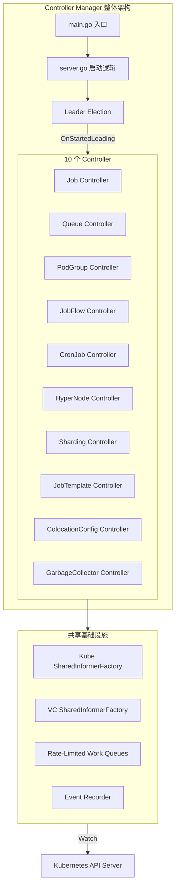
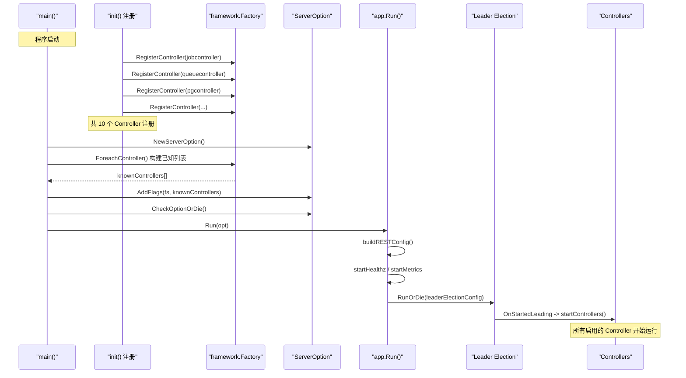
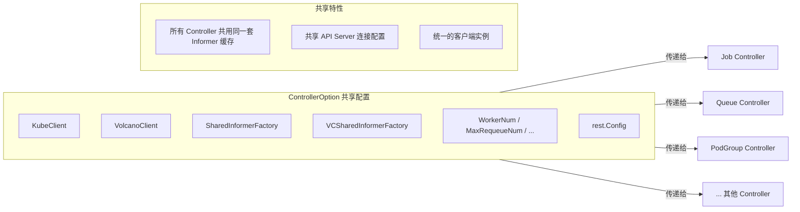
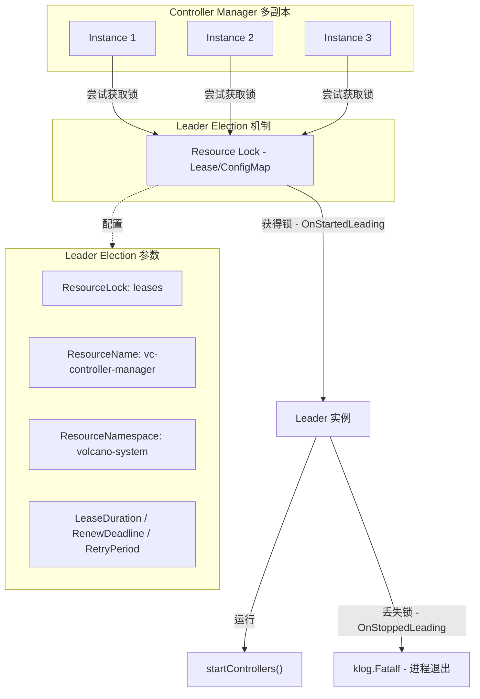
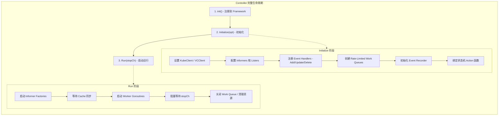
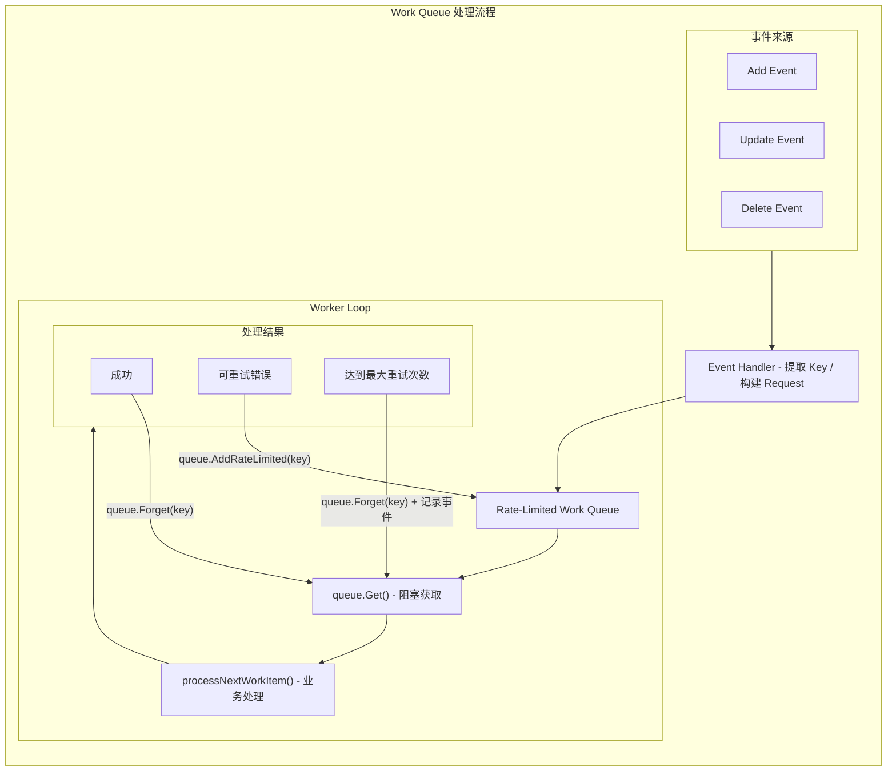
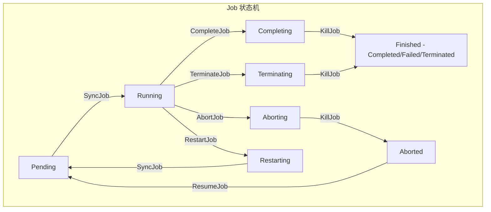
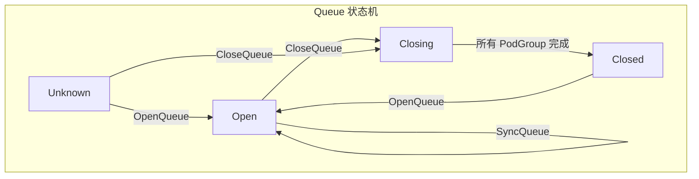

## 1. 概述

Volcano Controller Manager 是 Volcano 系统的核心组件之一，负责管理所有自定义资源 (CRD) 的生命周期。它采用经典的 Kubernetes Controller 模式，通过 **Informer 监听 + Work Queue 处理 + 状态机驱动** 的方式，实现了对 Job、Queue、PodGroup、JobFlow 等资源的自动化管理。

Controller Manager 内部包含 **10 个独立的 Controller**，每个 Controller 负责一类资源的协调逻辑。所有 Controller 通过统一的 **Controller Framework** 进行注册、初始化和生命周期管理，体现了良好的插件化设计思想。



---

## 2. Controller Manager 入口分析

### 2.1 main.go 入口

> 源文件: `cmd/controller-manager/main.go` (99 行)

Controller Manager 的入口文件承担三个核心职责:

1. **通过 blank import 触发所有 Controller 的 `init()` 注册**
2. **构建已知 Controller 列表用于命令行参数**
3. **启动 Controller Manager 服务**

```go
// 通过 blank import 强制触发 init() 注册
_ "volcano.sh/volcano/pkg/controllers/colocationconfig"
_ "volcano.sh/volcano/pkg/controllers/cronjob"
_ "volcano.sh/volcano/pkg/controllers/garbagecollector"
_ "volcano.sh/volcano/pkg/controllers/hypernode"
_ "volcano.sh/volcano/pkg/controllers/job"
_ "volcano.sh/volcano/pkg/controllers/jobflow"
_ "volcano.sh/volcano/pkg/controllers/jobtemplate"
_ "volcano.sh/volcano/pkg/controllers/podgroup"
_ "volcano.sh/volcano/pkg/controllers/queue"
_ "volcano.sh/volcano/pkg/controllers/sharding"
```

在 `main()` 函数中，通过 `framework.ForeachController()` 遍历所有已注册的 Controller，构建 `knownControllers` 列表，传递给命令行参数系统:

```go
var knownControllers = func() []string {
    controllerNames := []string{}
    fn := func(controller framework.Controller) {
        controllerNames = append(controllerNames, controller.Name())
    }
    framework.ForeachController(fn)
    sort.Strings(controllerNames)
    return controllerNames
}
s.AddFlags(fs, knownControllers())
```



### 2.2 默认配置

> 源文件: `cmd/controller-manager/app/options/options.go`

Controller Manager 提供了一系列默认配置参数:

| 参数 | 默认值 | 说明 |
|------|--------|------|
| `defaultWorkers` | 3 | Job Controller worker 数量 |
| `defaultCronJobWorkers` | 3 | CronJob Controller worker 数量 |
| `defaultPodGroupWorkers` | 5 | PodGroup Controller worker 数量 |
| `defaultQueueWorkers` | 5 | Queue Controller worker 数量 |
| `defaultGCWorkers` | 1 | GarbageCollector worker 数量 |
| `defaultMaxRequeueNum` | 15 | 最大重入队列次数 |
| `defaultControllers` | `*,-sharding-controller` | 默认启用除 Sharding 外的所有 Controller |
| `defaultQPS` | 50.0 | API Server 请求 QPS |
| `defaultBurst` | 100 | API Server 请求 Burst |

---

## 3. Controller Framework 框架

### 3.1 Controller 接口定义

> 源文件: `pkg/controllers/framework/interface.go` (55 行)

Controller Framework 定义了一个简洁而强大的三方法接口:

```go
type Controller interface {
    Name() string
    Initialize(opt *ControllerOption) error
    Run(stopCh <-chan struct{})
}
```

- **`Name()`**: 返回 Controller 唯一标识名称，用于注册、日志、启用/禁用控制
- **`Initialize(opt)`**: 接收共享配置进行初始化，设置 Informer、Work Queue、Event Handler 等
- **`Run(stopCh)`**: 启动 Controller 主循环，阻塞直到 stopCh 被关闭

### 3.2 ControllerOption 共享配置

`ControllerOption` 是所有 Controller 初始化时接收的共享上下文对象:

```go
type ControllerOption struct {
    KubeClient              kubernetes.Interface          // Kubernetes 原生客户端
    VolcanoClient           vcclientset.Interface          // Volcano CRD 客户端
    SharedInformerFactory   informers.SharedInformerFactory // Kube 资源 Informer 工厂
    VCSharedInformerFactory vcinformer.SharedInformerFactory // VC 资源 Informer 工厂
    SchedulerNames          []string                       // 关联的调度器名称列表
    WorkerNum               uint32                         // Job Controller worker 数
    CronJobWorkerNum        uint32                         // CronJob worker 数
    MaxRequeueNum           int                            // 最大重试次数
    InheritOwnerAnnotations bool                           // 是否继承 Owner 注解
    WorkerThreadsForPG      uint32                         // PodGroup worker 数
    WorkerThreadsForQueue   uint32                         // Queue worker 数
    WorkerThreadsForGC      uint32                         // GC worker 数
    Config                  *rest.Config                   // REST 客户端配置
}
```



### 3.3 Factory 注册模式

> 源文件: `pkg/controllers/framework/factory.go` (48 行)

Factory 模块实现了经典的注册工厂模式:

```go
var controllers = map[string]Controller{}

func RegisterController(ctrl Controller) error {
    if ctrl == nil {
        return fmt.Errorf("controller is nil")
    }
    if _, found := controllers[ctrl.Name()]; found {
        return fmt.Errorf("duplicated controller")
    }
    klog.V(3).Infof("Controller <%s> is registered.", ctrl.Name())
    controllers[ctrl.Name()] = ctrl
    return nil
}

func ForeachController(fn func(controller Controller)) {
    for _, ctrl := range controllers {
        fn(ctrl)
    }
}
```



```mermaid
graph TB
    subgraph reg["Controller 注册流程"]
        direction TB

        subgraph initfuncs["各 Controller 的 init() 函数"]
            I1["job/init() -> RegisterController(&jobcontroller{})"]
            I2["queue/init() -> RegisterController(&queuecontroller{})"]
            I3["podgroup/init() -> RegisterController(&pgcontroller{})"]
            I4["jobflow/init() -> RegisterController(&jobflowcontroller{})"]
            I5["cronjob/init() -> RegisterController(&cronjobcontroller{})"]
            I6["hypernode/init() -> RegisterController(&hyperNodeController{})"]
            I7["sharding/init() -> RegisterController(&ShardingController{})"]
            I8["jobtemplate/init() -> RegisterController(&jobtemplatecontroller{})"]
            I9["colocationconfig/init() -> RegisterController(&colocationConfigController{})"]
            I10["garbagecollector/init() -> RegisterController(&gccontroller{})"]
        end

        GlobalMap["controllers map - string -> Controller"]

        I1 --> GlobalMap
        I2 --> GlobalMap
        I3 --> GlobalMap
        I4 --> GlobalMap
        I5 --> GlobalMap
        I6 --> GlobalMap
        I7 --> GlobalMap
        I8 --> GlobalMap
        I9 --> GlobalMap
        I10 --> GlobalMap
    end

    subgraph usage["使用场景"]
        Foreach["ForeachController(fn)"]
        List["构建 knownControllers 列表"]
        Start["startControllers() 遍历启动"]
    end

    GlobalMap --> Foreach
    Foreach --> List
    Foreach --> Start
```

**注册机制的关键设计点:**

1. **Go `init()` 机制**: 每个 Controller 包的 `init()` 函数在 import 时自动执行，无需显式调用
2. **Blank Import 触发**: `main.go` 通过 `_ "volcano.sh/volcano/pkg/controllers/job"` 的方式触发注册
3. **去重保护**: `RegisterController` 检查是否有同名 Controller 已注册，防止冲突
4. **零耦合**: Framework 不依赖任何具体 Controller 的实现，仅通过接口交互

---

## 4. Server 启动流程

### 4.1 Run() 主函数

> 源文件: `cmd/controller-manager/app/server.go` (200 行)

`Run()` 函数是 Controller Manager 的核心启动入口，执行步骤如下:

```go
func Run(opt *options.ServerOption) error {
    // 1. 构建 REST 配置
    config, err := kube.BuildConfig(opt.KubeClientOptions)

    // 2. 启动健康检查 (可选)
    if opt.EnableHealthz {
        helpers.StartHealthz(opt.HealthzBindAddress, ...)
    }

    // 3. 启动 Metrics 服务 (可选)
    if opt.EnableMetrics {
        go func() { /* Prometheus HTTP Server on :8081 */ }()
    }

    // 4. 构建 startControllers 闭包
    run := startControllers(config, opt)

    // 5. Leader Election (或直接运行)
    if !opt.LeaderElection.LeaderElect {
        run(ctx)
        return ...
    }
    leaderelection.RunOrDie(ctx, leaderelection.LeaderElectionConfig{
        Callbacks: leaderelection.LeaderCallbacks{
            OnStartedLeading: run,
            OnStoppedLeading: func() { klog.Fatalf("leaderelection lost") },
        },
    })
}
```

### 4.2 startControllers() 启动所有 Controller

```go
func startControllers(config *rest.Config, opt *options.ServerOption) func(ctx context.Context) {
    controllerOpt := &framework.ControllerOption{}
    // 填充共享配置...
    controllerOpt.KubeClient = kubeclientset.NewForConfigOrDie(config)
    controllerOpt.VolcanoClient = vcclientset.NewForConfigOrDie(config)
    controllerOpt.SharedInformerFactory = informers.NewSharedInformerFactory(...)
    controllerOpt.VCSharedInformerFactory = informerfactory.NewSharedInformerFactory(...)
    // ...

    return func(ctx context.Context) {
        framework.ForeachController(func(c framework.Controller) {
            if !isControllerEnabled(c.Name(), opt.Controllers) {
                return  // 跳过未启用的 Controller
            }
            if err := c.Initialize(controllerOpt); err != nil {
                return  // 初始化失败则跳过
            }
            go c.Run(ctx.Done())  // 在独立 goroutine 中运行
        })
        <-ctx.Done()
    }
}
```

### 4.3 Controller 启用/禁用控制

`isControllerEnabled()` 函数支持灵活的 Controller 启用/禁用策略:

```go
func isControllerEnabled(name string, controllers []string) bool {
    // 空列表 -> 全部启用
    // "+name" 或 "name" -> 显式启用
    // "-name" -> 显式禁用
    // "*" -> 通配符启用所有
}
```

**配置示例:**

| 配置值 | 效果 |
|--------|------|
| `*` | 启用所有 Controller |
| `*,-sharding-controller` | 启用除 Sharding 外的所有 Controller (默认) |
| `job-controller,queue-controller` | 只启用 Job 和 Queue Controller |
| `*,-gc-controller,-cronjob-controller` | 禁用 GC 和 CronJob，其余全部启用 |

---

## 5. Leader Election 机制

Controller Manager 使用 Kubernetes 原生的 Leader Election 机制，确保在多副本部署时只有一个实例运行 Controller 逻辑。



**Leader Election 关键配置:**

- **ResourceName**: `vc-controller-manager`
- **ResourceNamespace**: `volcano-system` (默认)
- **唯一标识**: `hostname + "_" + uuid`，避免同一主机上的两个进程冲突
- **失去 Leader 的行为**: 直接调用 `klog.Fatalf("leaderelection lost")` 终止进程，由 Kubernetes 重新调度

---

## 6. 通用 Controller 模式

所有 10 个 Controller 遵循相同的编程模式。以下是各阶段的通用模板分析。

### 6.1 Controller 生命周期



### 6.2 Work Queue 处理模式

所有 Controller 使用 `client-go` 的 `TypedRateLimitingQueue` 实现限速重试的工作队列。



**限速重试策略 (指数退避):**

默认使用 `DefaultTypedControllerRateLimiter`，退避时间序列为:

```
5ms, 10ms, 20ms, 40ms, 80ms, 160ms, 320ms, 640ms, 1.3s, 2.6s, 5.1s, 10.2s, 20.4s, 41s, 82s
```

当重试次数达到 `MaxRequeueNum` (默认 15) 时，该 item 将被丢弃。

### 6.3 状态机模式

Job Controller 和 Queue Controller 采用了状态机 (State Machine) 模式来管理资源状态转换。



**状态机工厂:**

> 源文件: `pkg/controllers/job/state/factory.go`

```go
func NewState(jobInfo *apis.JobInfo) State {
    job := jobInfo.Job
    switch job.Status.State.Phase {
    case vcbatch.Pending:
        return &pendingState{job: jobInfo}
    case vcbatch.Running:
        return &runningState{job: jobInfo}
    case vcbatch.Restarting:
        return &restartingState{job: jobInfo}
    case vcbatch.Terminated, vcbatch.Completed, vcbatch.Failed:
        return &finishedState{job: jobInfo}
    case vcbatch.Terminating:
        return &terminatingState{job: jobInfo}
    case vcbatch.Aborting:
        return &abortingState{job: jobInfo}
    case vcbatch.Aborted:
        return &abortedState{job: jobInfo}
    case vcbatch.Completing:
        return &completingState{job: jobInfo}
    }
    return &pendingState{job: jobInfo}  // 默认为 Pending
}
```



> 源文件: `pkg/controllers/queue/state/factory.go`

Queue 状态机包含 4 种状态: Open、Closed、Closing、Unknown。每种状态对应一个实现了 `State` 接口的结构体，通过 `Execute(action)` 方法执行对应动作。

---

## 7. Job Controller 的 Hash 分片机制

Job Controller 是所有 Controller 中最复杂的一个，采用了独特的 **Hash-Based Worker 分片** 机制:

```go
// 创建多个 worker queue
cc.queueList = make([]workqueue.TypedRateLimitingInterface[any], workers)
for i = 0; i < workers; i++ {
    cc.queueList[i] = workqueue.NewTypedRateLimitingQueue(...)
}

// 通过 FNV hash 将 Job 分配到固定的 worker
func (cc *jobcontroller) getWorkerQueue(key string) workqueue.TypedRateLimitingInterface[any] {
    val := cc.genHash(key)
    queue := cc.queueList[val%cc.workers]
    return queue
}

func (cc *jobcontroller) genHash(key string) uint32 {
    hashVal := fnv.New32()
    hashVal.Write([]byte(key))
    return hashVal.Sum32()
}
```

**设计优势:**

- **避免并发冲突**: 同一个 Job 的所有事件总是路由到同一个 Worker，无需加锁
- **负载均衡**: FNV hash 提供了良好的散列分布
- **路由校验**: `belongsToThisRoutine()` 方法确保 Worker 只处理属于自己的任务

---

## 8. 全部 10 个 Controller 总览

### 8.1 Controller 总览表

| Controller | 注册名称 | 源码目录 | 监听资源 | Worker 策略 |
|-----------|---------|----------|----------|------------|
| **Job** | `job-controller` | `pkg/controllers/job/` | Jobs, Pods, PodGroups, PVCs, Services, Commands, PriorityClasses, Queues | 多个 (FNV Hash 分片) |
| **Queue** | `queue-controller` | `pkg/controllers/queue/` | Queues, PodGroups, Commands | 可配置 (默认 5) |
| **PodGroup** | `pg-controller` | `pkg/controllers/podgroup/` | Pods, PodGroups, ReplicaSets, StatefulSets | 可配置 (默认 5) |
| **JobFlow** | `jobflow-controller` | `pkg/controllers/jobflow/` | JobFlows, JobTemplates, Jobs | 1 |
| **CronJob** | `cronjob-controller` | `pkg/controllers/cronjob/` | CronJobs, Jobs | 可配置 (默认 3) |
| **HyperNode** | `hyperNode-controller` | `pkg/controllers/hypernode/` | HyperNodes, ConfigMaps, Nodes | 1 |
| **Sharding** | `sharding-controller` | `pkg/controllers/sharding/` | Nodes, Pods, NodeShards | 1 |
| **JobTemplate** | `jobtemplate-controller` | `pkg/controllers/jobtemplate/` | JobTemplates, Jobs | 1 |
| **ColocationConfig** | `colocation-config-controller` | `pkg/controllers/colocationconfig/` | Pods, ColocationConfigurations | 1 |
| **GarbageCollector** | `gc-controller` | `pkg/controllers/garbagecollector/` | Jobs | 可配置 (默认 1) |

### 8.2 Controller 关系图

```mermaid
graph TB
    subgraph core["核心 Controller"]
        JobCtrl["Job Controller"]
        QueueCtrl["Queue Controller"]
        PGCtrl["PodGroup Controller"]
    end

    subgraph workflow["工作流 Controller"]
        JFCtrl["JobFlow Controller"]
        JTCtrl["JobTemplate Controller"]
        CJCtrl["CronJob Controller"]
    end

    subgraph infra2["基础设施 Controller"]
        HNCtrl["HyperNode Controller"]
        ShardCtrl["Sharding Controller"]
        CCCtrl["ColocationConfig Controller"]
        GCCtrl["GarbageCollector Controller"]
    end

    subgraph resources["Kubernetes / Volcano 资源"]
        VCJob["Volcano Job"]
        VCQueue["Queue"]
        VCPG["PodGroup"]
        Pod["Pod"]
        JF["JobFlow"]
        JT["JobTemplate"]
        CJ["CronJob"]
        HN["HyperNode"]
        NS["NodeShard"]
        ColoConf["ColocationConfiguration"]
    end

    JobCtrl -->|"管理"| VCJob
    JobCtrl -->|"创建/删除"| Pod
    JobCtrl -->|"维护"| VCPG

    QueueCtrl -->|"管理"| VCQueue
    QueueCtrl -->|"统计"| VCPG

    PGCtrl -->|"自动创建"| VCPG
    PGCtrl -->|"监听"| Pod

    JFCtrl -->|"编排"| JF
    JFCtrl -->|"引用"| JT
    JFCtrl -->|"创建"| VCJob

    JTCtrl -->|"管理"| JT

    CJCtrl -->|"定时创建"| VCJob
    CJCtrl -->|"管理"| CJ

    HNCtrl -->|"管理"| HN
    ShardCtrl -->|"管理"| NS
    CCCtrl -->|"管理"| ColoConf
    GCCtrl -->|"TTL 清理"| VCJob
```



### 8.3 各 Controller 简要说明

**Job Controller** - 最核心的 Controller，管理 Volcano Job 的完整生命周期。实现了复杂的状态机 (Pending, Running, Restarting, Completing, Terminating, Aborting, Aborted, Finished 共 8 种状态)，支持延迟动作 (Delay Action)、策略匹配 (Policy Matching)、多 Worker Hash 分片等高级特性。

**Queue Controller** - 管理调度队列的生命周期和状态。实现了 Open/Closed/Closing/Unknown 四态状态机，负责聚合统计队列下所有 PodGroup 的资源使用情况。

**PodGroup Controller** - 为普通 Pod (非 Volcano Job 创建的) 自动创建 PodGroup，使其能够被 Volcano 调度器调度。支持通过 Feature Gate `WorkLoadSupport` 监听 ReplicaSet 和 StatefulSet。

**JobFlow Controller** - 工作流编排引擎，根据 JobFlow 定义的 DAG 依赖关系，按顺序创建和管理多个 Volcano Job。

**CronJob Controller** - 类似 Kubernetes 原生 CronJob，但创建的是 Volcano Job 而非 Kubernetes Job。支持 Cron 表达式定时调度。

**HyperNode Controller** - 管理网络拓扑感知的 HyperNode 资源。集成网络拓扑发现 (Label-based, UFM-based) 来自动维护节点拓扑关系。

**Sharding Controller** - 节点分片管理，将集群节点按策略划分为多个 Shard，供多调度器场景下使用。默认禁用 (`*,-sharding-controller`)。

**JobTemplate Controller** - 管理 Job 模板资源，跟踪基于模板创建的 Job 实例状态。

**ColocationConfig Controller** - 混合部署配置控制器，根据 ColocationConfiguration 资源为 Pod 配置混合部署相关参数。

**GarbageCollector Controller** - 基于 TTL 的 Job 清理机制。监听已完成 (Completed/Failed/Terminated) 且设置了 `TTLSecondsAfterFinished` 的 Job，在 TTL 过期后级联删除。

---

## 9. 共享基础设施

### 9.1 SharedInformerFactory

所有 Controller 共享两个 InformerFactory 实例:

```go
// Kubernetes 原生资源的 Informer 工厂
controllerOpt.SharedInformerFactory = informers.NewSharedInformerFactory(kubeClient, 0)

// Volcano CRD 资源的 Informer 工厂
controllerOpt.VCSharedInformerFactory = informerfactory.NewSharedInformerFactory(vcClient, 0)
```

**共享的核心优势:**

- **内存效率**: 同一类型资源只维护一份缓存，不同 Controller 监听同一资源时复用缓存
- **API Server 压力**: 减少对 API Server 的 List/Watch 请求数
- **数据一致性**: 所有 Controller 看到相同版本的数据

### 9.2 Event Recorder

各 Controller 独立创建 Event Recorder 实例，但统一以 `vc-controller-manager` 作为组件标识:

```go
eventBroadcaster := record.NewBroadcaster()
eventBroadcaster.StartLogging(klog.Infof)
eventBroadcaster.StartRecordingToSink(&corev1.EventSinkImpl{
    Interface: kubeClient.CoreV1().Events(""),
})
recorder := eventBroadcaster.NewRecorder(scheme, v1.EventSource{
    Component: "vc-controller-manager",
})
```

### 9.3 Feature Gates

Controller 的部分功能受 Feature Gate 控制:

| Feature Gate | 影响的 Controller | 作用 |
|-------------|-------------------|------|
| `VolcanoJobSupport` | Job, CronJob | 是否启用 Volcano Job 支持 |
| `QueueCommandSync` | Job, Queue | 是否启用 Command 同步 |
| `PriorityClass` | Job | 是否启用 PriorityClass 支持 |
| `WorkLoadSupport` | PodGroup | 是否为 ReplicaSet/StatefulSet 创建 PodGroup |

### 9.4 Rate-Limited Work Queue

所有 Controller 使用 `client-go` 提供的 `TypedRateLimitingQueue`:

```go
queue := workqueue.NewTypedRateLimitingQueue(
    workqueue.DefaultTypedControllerRateLimiter[string](),
)
```

队列提供的核心操作:

| 操作 | 说明 |
|------|------|
| `Add(item)` | 添加到队列 (去重) |
| `AddRateLimited(item)` | 按指数退避延迟添加 |
| `AddAfter(item, duration)` | 延迟指定时间后添加 |
| `Get()` | 阻塞获取下一个 item |
| `Done(item)` | 标记 item 处理完成 |
| `Forget(item)` | 重置 item 的重试计数 |
| `NumRequeues(item)` | 获取 item 的重试次数 |
| `ShutDown()` | 关闭队列 |

---

## 10. 关键源码文件索引

| 文件路径 | 行数 | 职责 |
|---------|------|------|
| `cmd/controller-manager/main.go` | 99 | 入口，blank import 注册，构建 known controllers |
| `cmd/controller-manager/app/server.go` | 200 | Run()，Leader Election，startControllers() |
| `cmd/controller-manager/app/options/options.go` | ~100 | 命令行参数定义和默认值 |
| `pkg/controllers/framework/interface.go` | 55 | Controller 接口 + ControllerOption 定义 |
| `pkg/controllers/framework/factory.go` | 48 | 全局注册表，RegisterController / ForeachController |
| `pkg/controllers/job/job_controller.go` | 573 | Job Controller 主逻辑，含 Hash 分片 Worker |
| `pkg/controllers/job/state/factory.go` | 111 | Job 状态机工厂，8 种状态映射 |
| `pkg/controllers/queue/queue_controller.go` | 329 | Queue Controller，双队列 (queue + commandQueue) |
| `pkg/controllers/queue/state/factory.go` | 60 | Queue 状态机工厂，4 种状态映射 |
| `pkg/controllers/podgroup/pg_controller.go` | 185 | PodGroup Controller，自动创建 PodGroup |
| `pkg/controllers/jobflow/jobflow_controller.go` | ~180 | JobFlow Controller，工作流编排 |
| `pkg/controllers/cronjob/cronjob_controller.go` | ~150 | CronJob Controller，定时任务 |
| `pkg/controllers/hypernode/hypernode_controller.go` | ~200 | HyperNode Controller，拓扑管理 |
| `pkg/controllers/sharding/sharding_controller.go` | ~150 | Sharding Controller，节点分片 |
| `pkg/controllers/garbagecollector/garbagecollector.go` | 310 | GC Controller，TTL 清理 |
| `pkg/controllers/colocationconfig/colocation_config_controller.go` | ~100 | ColocationConfig Controller |
| `pkg/controllers/jobtemplate/jobtemplate_controller.go` | ~130 | JobTemplate Controller |

---

## 11. 总结

Volcano Controller Manager 的架构设计体现了以下核心思想:

1. **统一框架**: 通过 `Controller` 接口和 `ControllerOption` 共享配置，实现了所有 Controller 的标准化管理
2. **注册工厂**: 利用 Go 的 `init()` 机制和 blank import，实现了零耦合的 Controller 自动注册
3. **灵活启停**: 支持通过 `+name/-name/*` 语法灵活控制每个 Controller 的启用/禁用
4. **状态机驱动**: Job 和 Queue Controller 采用状态机模式，使状态转换逻辑清晰可维护
5. **共享 Informer**: 所有 Controller 共享 InformerFactory，优化内存和 API Server 负载
6. **限速重试**: 统一使用 Rate-Limited Queue 的指数退避策略，避免错误风暴
7. **Leader Election**: 内置 Leader 选举，支持高可用部署
8. **Hash 分片**: Job Controller 采用 FNV Hash 将任务分配到固定 Worker，避免并发冲突
