## 1. 概述

Job Controller 是 Volcano 中最复杂、最核心的控制器，负责管理批处理任务（Volcano Job）的完整生命周期。它实现了一个完整的状态机来驱动 Job 在不同阶段之间的转换，并通过灵活的生命周期策略（Lifecycle Policy）机制支持丰富的故障处理和自动化运维场景。

### 1.1 核心特性

- **完整的状态机**: 8 个运行状态 + 3 个终态，覆盖 Job 从创建到完成/失败的所有阶段
- **并行 Worker 处理**: 基于 FNV-32 哈希的多 Worker 并行处理架构，同一 Job 始终由同一 Worker 处理
- **灵活的生命周期策略**: 支持事件驱动和退出码驱动的策略匹配，Task 级策略优先于 Job 级策略
- **延迟动作机制**: 基于 `context.WithTimeout` 的超时策略执行，支持取消和级联清理
- **插件系统**: 支持 env、svc、ssh、分布式训练框架等多种插件，在 Pod 创建和 Job 生命周期各阶段执行扩展逻辑
- **Task 依赖管理**: 支持 Task 间的启动依赖，确保上游 Task 就绪后再创建下游 Task 的 Pod
- **分区策略**: 将 Task 的 Pod 划分为分区组，支持分区粒度的重启操作

### 1.2 源码位置

| 模块 | 路径 | 说明 |
|------|------|------|
| 主控制器 | `pkg/controllers/job/job_controller.go` | 控制器核心结构体、初始化、Worker 循环 |
| 事件处理 | `pkg/controllers/job/job_controller_handler.go` | Informer 事件回调处理 |
| 核心动作 | `pkg/controllers/job/job_controller_actions.go` | syncJob、killJob、PodGroup 管理 |
| 工具函数 | `pkg/controllers/job/job_controller_util.go` | Pod 创建、策略匹配、哈希路由 |
| 插件管理 | `pkg/controllers/job/job_controller_plugins.go` | 插件钩子调用 |
| 错误重试 | `pkg/controllers/job/job_controller_resync.go` | 失败 Pod 重新同步 |
| 状态机 | `pkg/controllers/job/state/` | 8 个状态文件 + 工厂 + 工具 |
| Job 缓存 | `pkg/controllers/cache/` | Job 信息缓存接口与实现 |
| 数据结构 | `pkg/controllers/apis/` | JobInfo、Request 等核心结构体 |
| Helper | `pkg/controllers/job/helpers/` | Pod 命名、索引等辅助函数 |
| 插件实现 | `pkg/controllers/job/plugins/` | 各插件具体实现 |

---

## 2. 整体架构

### 2.1 架构总览

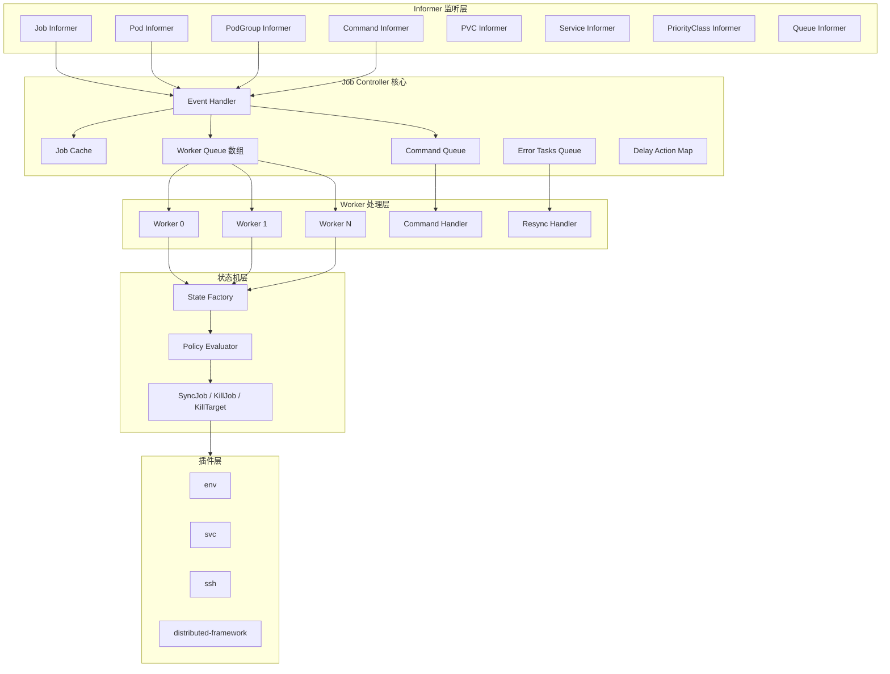

### 2.2 核心结构体

`jobcontroller` 结构体定义在 `pkg/controllers/job/job_controller.go` 中，包含以下关键字段：

| 字段 | 类型 | 说明 |
|------|------|------|
| `queueList[]` | `[]workqueue.TypedRateLimitingInterface` | Worker Queue 数组，FNV-32 哈希路由 |
| `commandQueue` | `workqueue.TypedRateLimitingInterface` | Command 独立处理队列 |
| `cache` | `jobcache.Cache` | Job 及 Pod 内存快照 |
| `errTasks` | `workqueue.TypedRateLimitingInterface` | 错误 Pod 重试队列（5ms-180s 指数退避） |
| `delayActionMap` | `map[string]map[string]*delayAction` | 延迟动作二级 Map: `jobKey -> podName -> action` |
| `workers` | `uint32` | Worker 并行度 |
| `maxRequeueNum` | `int` | 最大重排队次数（-1 表示无限） |

此外包含 8 个 Informer（Job、Pod、PVC、PodGroup、Service、Command、PriorityClass、Queue）及对应的 Lister 和 Synced 函数。

---

## 3. 状态机

Job Controller 的核心是一个精密的有限状态机，位于 `pkg/controllers/job/state/` 目录下。

### 3.1 状态定义

| 状态 | 类型 | 结构体 | 说明 |
|------|------|--------|------|
| `Pending` | 活跃态 | `pendingState` | 初始状态，等待 MinAvailable 个 Pod 就绪 |
| `Running` | 活跃态 | `runningState` | 已满足最小可用数，Job 正在运行 |
| `Restarting` | 过渡态 | `restartingState` | 正在重启，等待旧 Pod 被清理 |
| `Completing` | 过渡态 | `completingState` | 正在完成，等待所有存活 Pod 终止 |
| `Terminating` | 过渡态 | `terminatingState` | 正在终止，等待所有存活 Pod 终止 |
| `Aborting` | 过渡态 | `abortingState` | 正在中止，等待所有存活 Pod 终止 |
| `Aborted` | 终态(可恢复) | `abortedState` | 已中止，可通过 ResumeJob 恢复 |
| `Completed` | 终态 | `finishedState` | 成功完成 |
| `Terminated` | 终态 | `finishedState` | 被终止 |
| `Failed` | 终态 | `finishedState` | 运行失败（含超过 MaxRetry） |

> **注意**: `Completed`、`Terminated`、`Failed` 三个终态共享同一个 `finishedState` 实现，其 `Execute` 方法统一调用 `KillJob` 清理残余 Pod。

### 3.2 状态工厂

状态工厂定义在 `pkg/controllers/job/state/factory.go` 中。`NewState()` 函数根据 `job.Status.State.Phase` 通过 switch-case 创建对应的状态实例。若 Phase 未匹配任何已知状态，默认返回 `pendingState`。

### 3.3 完整状态转换图

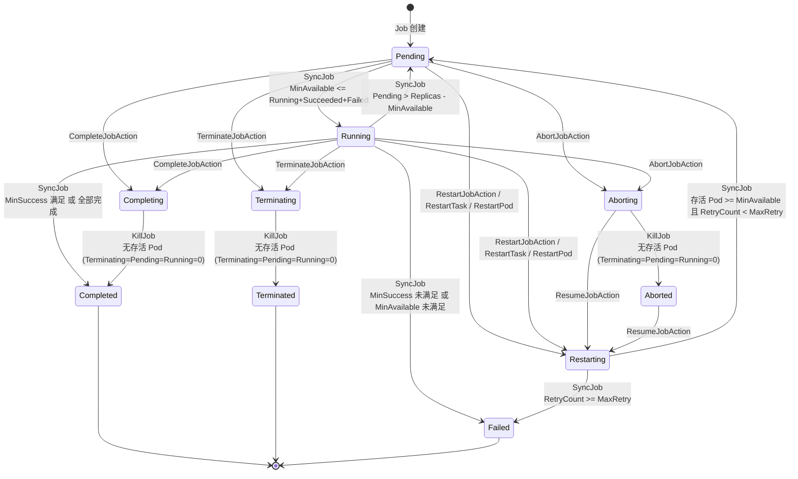

### 3.4 各状态 Execute 行为详解

#### Pending 状态 (`pkg/controllers/job/state/pending.go`)

- **RestartJobAction**: KillJob -> Restarting（RetryCount++）
- **RestartTask/Pod/Partition**: KillTarget -> Restarting（RetryCount++）
- **AbortJobAction**: KillJob -> Aborting
- **CompleteJobAction**: KillJob -> Completing
- **TerminateJobAction**: KillJob -> Terminating
- **默认 (SyncJob)**: 若 `MinAvailable <= Running+Succeeded+Failed` 则转为 Running

#### Running 状态 (`pkg/controllers/job/state/running.go`)

Running 状态的 SyncJob 逻辑最复杂，包含多层完成/失败判断：

1. **MinSuccess 满足**: 若 `Succeeded >= MinSuccess`，直接转为 `Completed`
2. **全部 Pod 结束**: 若 `Succeeded + Failed == TotalReplicas`，检查各 Task 的 MinAvailable 是否满足
3. **回退 Pending**: 若 `Pending > TotalReplicas - MinAvailable`，说明可用 Pod 不足

其他 Action（Restart/Abort/Terminate/Complete）行为与 Pending 状态一致。

#### Restarting 状态 (`pkg/controllers/job/state/restarting.go`)

核心逻辑在 `restartingUpdateStatus` 中：若 `RetryCount >= MaxRetry` 则转为 Failed；否则当存活 Pod 数 >= MinAvailable（旧 Pod 清理完毕）时转为 Pending。

---

## 4. Worker 并行处理机制

### 4.1 基于 FNV-32 的哈希路由

Job Controller 采用多 Worker 并行处理架构，通过 FNV-32 哈希算法确保同一 Job 的所有事件始终由同一个 Worker 处理，避免并发冲突。

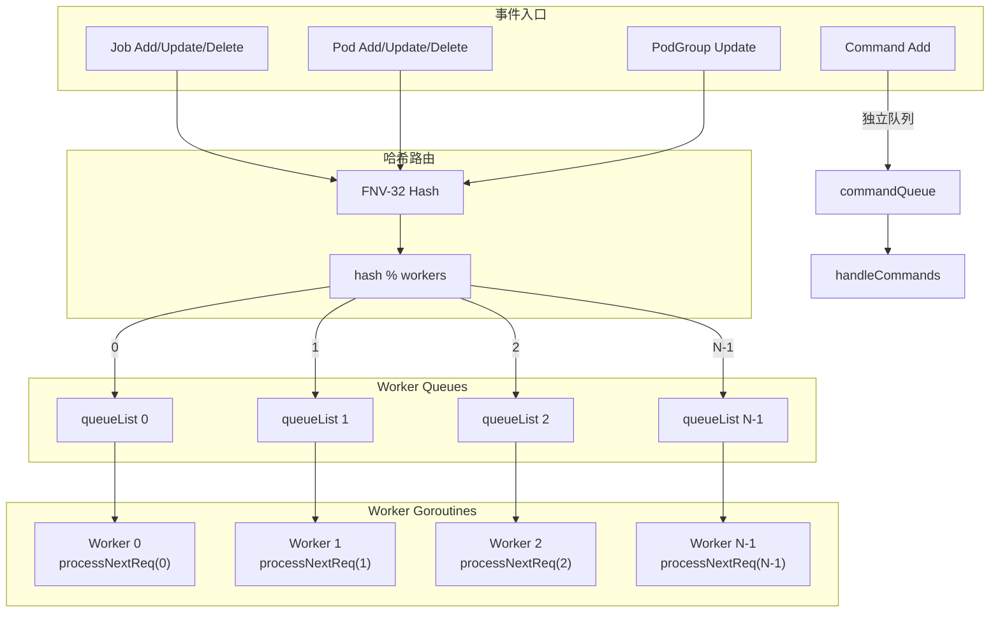

哈希路由核心：`genHash()` 使用 `fnv.New32()` 计算 `namespace/jobName` 的哈希值，`getWorkerQueue()` 通过 `hash % workers` 选择目标队列。

### 4.2 Worker 处理流程

每个 Worker 在 `processNextReq()` 中执行以下步骤：

1. 从队列取出 `Request`，验证 Job 属于当前 Worker（`belongsToThisRoutine`）
2. 清理 Pod 延迟动作（`CleanPodDelayActionsIfNeed`）
3. 从 Cache 获取 `JobInfo`，创建对应 State 实例（`state.NewState`）
4. 匹配生命周期策略（`applyPolicies`），得到要执行的 Action 和可能的延迟时间
5. 若有延迟，注册延迟动作（`AddDelayActionForJob`）并返回
6. 否则立即执行状态转换（`st.Execute(action)`）
7. 执行成功后 `queue.Forget(req)`，失败则进入 `handleJobError` 重试

---

## 5. 生命周期策略

### 5.1 策略结构

生命周期策略（LifecyclePolicy）定义了 Job 对特定事件的响应行为：

```yaml
spec:
  policies:
    - event: PodFailed
      action: RestartJob
    - event: PodPending
      action: AbortJob
      timeout: 300s
    - exitCode: 137
      action: TerminateJob
  tasks:
    - name: worker
      policies:
        - event: TaskCompleted
          action: CompleteJob
```

### 5.2 事件类型

| 事件 | 触发时机 | 是否需要 Timeout |
|------|---------|-----------------|
| `PodPending` | Pod 处于 Pending 状态 | 是（必须配置 Timeout） |
| `PodRunning` | Pod 进入 Running 状态 | 否（内部事件） |
| `PodFailed` | Pod 失败 | 否 |
| `PodEvicted` | Pod 被驱逐（删除） | 否 |
| `TaskCompleted` | Task 所有 Pod 成功 | 否 |
| `TaskFailed` | Task Pod 重启次数超限 | 否 |
| `JobUnknown` | PodGroup 进入 Unknown | 否 |
| `OutOfSync` | 内部同步事件 | 否（内部事件） |
| `CommandIssued` | 外部命令下发 | 否（内部事件） |
| `Any` | 匹配所有事件 | 否 |

### 5.3 动作类型

| 动作 | 级别 | 说明 |
|------|------|------|
| `SyncJob` | Job | 同步 Job 状态（默认动作） |
| `RestartJob` | Job | 重启整个 Job |
| `AbortJob` | Job | 中止 Job（可恢复） |
| `TerminateJob` | Job | 终止 Job（不可恢复） |
| `CompleteJob` | Job | 标记 Job 完成 |
| `ResumeJob` | Job | 恢复被中止的 Job |
| `RestartTask` | Task | 重启指定 Task 的所有 Pod |
| `RestartPod` | Pod | 重启指定 Pod |
| `RestartPartition` | Partition | 重启指定分区的 Pod |

### 5.4 策略匹配流程

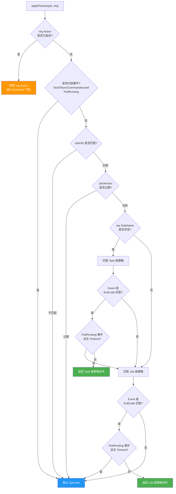

核心源码位于 `pkg/controllers/job/job_controller_util.go` 的 `applyPolicies()` 函数。

**关键设计点**: `PodPending` 事件特殊处理 -- 它 **必须配合 Timeout** 才会触发动作（由 `shouldConfigureTimeout()` 函数判断）。这是因为 Pod 处于 Pending 是正常的短暂状态，只有持续 Pending 超过阈值才应当触发故障处理（如 AbortJob）。

---

## 6. 延迟动作机制

### 6.1 延迟动作结构

当生命周期策略包含 `timeout` 配置时，动作不会立即执行，而是注册为延迟动作：

```go
type delayAction struct {
    jobKey    string       // Job 的 namespace/name
    taskName  string       // Task 名称
    podName   string       // Pod 名称
    podUID    types.UID    // Pod UID（用于防止重建 Pod 误取消）
    partition string       // 分区 ID
    event     bus.Event    // 触发事件
    action    bus.Action   // 要执行的动作
    delay     time.Duration // 延迟时间
    cancel    context.CancelFunc // 取消函数
}
```

### 6.2 延迟动作流程

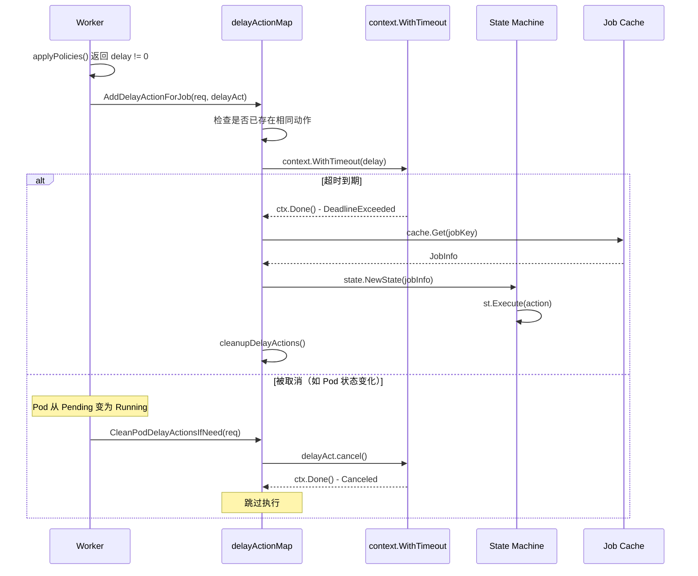

### 6.3 取消逻辑

`CleanPodDelayActionsIfNeed` 方法在每次处理请求时调用，根据 Pod 事件状态变化自动取消不再需要的延迟动作：

| 当前事件 | 取消的延迟动作 | 原因 |
|---------|--------------|------|
| 非 PodPending | PodPending 延迟动作（UID 匹配） | Pod 已不再 Pending |
| PodRunning | PodFailed / PodEvicted 延迟动作 | Pod 已恢复运行 |

**Pod UID 校验**: 取消 PodPending 延迟动作时会校验 Pod UID，防止删除后快速重建的新 Pod 触发旧 Pod 的取消逻辑。

### 6.4 清理策略

当一个延迟动作被执行后，`cleanupDelayActions()` 会取消同级别的其他延迟动作。清理范围取决于 `GetActionType()` 返回的动作级别：Job 级取消所有同级延迟、Task 级只取消同一 Task 的、Pod 级只取消同一 Pod 的、Partition 级只取消同一 Partition 的。

---

## 7. Pod 管理

### 7.1 Pod 创建流程

Pod 创建由 `syncJob()` 函数驱动（`pkg/controllers/job/job_controller_actions.go`），在 PodGroup 进入非 Pending 状态后开始：

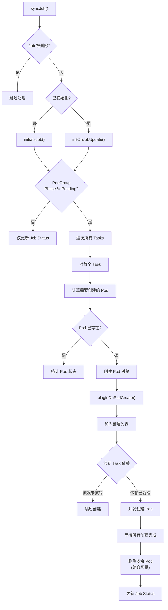

### 7.2 Pod 命名与注解

**命名格式**: `{jobName}-{taskName}-{index}`

```go
// pkg/controllers/job/helpers/helpers.go
const PodNameFmt = "%s-%s-%d"
```

例如 Job `train-resnet` 的 `worker` Task 的第 3 个 Pod 名为 `train-resnet-worker-2`。

**Pod 注解**:

| 注解 Key | 值 | 说明 |
|---------|-----|------|
| `volcano.sh/task-index` | `"2"` | Pod 在 Task 内的索引 |
| `volcano.sh/task-spec` | `"worker"` | 所属 Task 名称 |
| `volcano.sh/job-name` | `"train-resnet"` | 所属 Job 名称 |
| `volcano.sh/queue-name` | `"default"` | 所属 Queue 名称 |
| `volcano.sh/job-version` | `"3"` | Job 版本号 |
| `volcano.sh/job-retry-count` | `"1"` | 重试次数 |
| `scheduling.volcano.sh/group-name` | `"train-resnet-{UID}"` | PodGroup 名称 |
| `volcano.sh/pod-template-key` | `"train-resnet-worker"` | Pod 模板标识 |

**Pod 标签**:

| 标签 Key | 值 | 说明 |
|---------|-----|------|
| `volcano.sh/task-index` | `"2"` | Pod 索引 |
| `volcano.sh/job-name` | `"train-resnet"` | Job 名称 |
| `volcano.sh/task-spec` | `"worker"` | Task 名称 |
| `volcano.sh/job-namespace` | `"default"` | Job Namespace |
| `volcano.sh/queue-name` | `"default"` | Queue 名称 |
| `volcano.sh/task-partition-id` | `"1"` | 分区 ID（有 PartitionPolicy 时） |

### 7.3 Pod 删除流程

Pod 删除由 `killPods()` 函数实现，采用"先标记再删除"的两阶段策略：

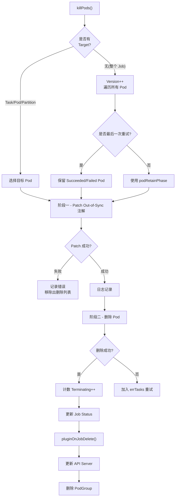

**Out-of-Sync 标记的作用**: 在删除 Pod 之前先打上 `volcano.sh/controller-out-of-sync` 注解，这样当 Pod 的删除事件触发 Informer 回调时，Controller 会识别到这是 Controller 主动删除的 Pod（而非异常驱逐），从而避免触发不必要的 PodEvicted 策略处理，防止重启循环。

### 7.4 Pod 保留策略

| 策略 | 保留的 Pod Phase | 使用场景 |
|------|-----------------|---------|
| `PodRetainPhaseNone` | 无（全部删除） | RestartJob（非最后一次重试） |
| `PodRetainPhaseSoft` | `Succeeded`, `Failed` | AbortJob、TerminateJob、CompleteJob、最后一次重试 |

在最后一次重试时（`RetryCount >= MaxRetry - 1`），无论策略配置如何，都会使用 `PodRetainPhaseSoft` 保留已完成/失败的 Pod，便于故障排查。

---

## 8. Job Cache

### 8.1 Cache 接口

定义在 `pkg/controllers/cache/interface.go`：

```go
type Cache interface {
    Run(stopCh <-chan struct{})

    Get(key string) (*apis.JobInfo, error)
    GetStatus(key string) (*v1alpha1.JobStatus, error)
    Add(obj *v1alpha1.Job) error
    Update(obj *v1alpha1.Job) error
    Delete(obj *v1alpha1.Job) error

    AddPod(pod *v1.Pod) error
    UpdatePod(pod *v1.Pod) error
    DeletePod(pod *v1.Pod) error
    HasPod(pod *v1.Pod) bool

    TaskCompleted(jobKey, taskName string) bool
    TaskFailed(jobKey, taskName string) bool
}
```

### 8.2 JobInfo 数据结构

`JobInfo`（`pkg/controllers/apis/job_info.go`）包含 Namespace、Name、Job 对象、`Pods map[taskName]map[podName]*Pod` 以及 `Partitions map[taskName]*PartitionInfo`。`PartitionInfo` 内部包含 `Partition map[partitionID]map[podName]*Pod` 和可选的 `NetworkTopology`。

### 8.3 Cache 实现要点

Cache 实现在 `pkg/controllers/cache/cache.go` 中：

1. **线程安全**: 使用 `sync.Mutex` 保护所有操作
2. **版本校验**: `Update()` 方法会比较 `ResourceVersion`，拒绝旧版本更新
3. **Clone 返回**: `Get()` 返回深拷贝的 `JobInfo`，避免外部修改影响缓存
4. **延迟清理**: 删除的 Job 不会立即从 map 中移除，而是放入 `deletedJobs` 队列异步清理，等待所有关联 Pod 清理完毕后才真正删除
5. **Task 完成判断**: `TaskCompleted()` 检查 Task 所有 Pod 是否都已 Succeeded；`TaskFailed()` 检查 Pod 的容器重启次数是否超过 Task 的 `MaxRetry`

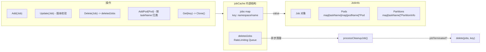

---

## 9. PodGroup 管理

### 9.1 PodGroup 创建

PodGroup 在 Job 初始化时自动创建，命名格式为 `{jobName}-{jobUID}`（兼容旧版 `{jobName}` 格式的查询）。

```go
// pkg/controllers/job/job_controller_actions.go
func (cc *jobcontroller) generateRelatedPodGroupName(job *batch.Job) string {
    return fmt.Sprintf("%s-%s", job.Name, string(job.UID))
}
```

PodGroup 的关键字段映射：

| PodGroup 字段 | 来源 |
|--------------|------|
| `MinMember` | `job.Spec.MinAvailable` |
| `MinTaskMember` | 每个 Task 的 `MinAvailable` 或 `Replicas` |
| `Queue` | `job.Spec.Queue` |
| `MinResources` | 按优先级计算的最小资源需求 |
| `PriorityClassName` | `job.Spec.PriorityClassName` |
| `NetworkTopology` | `job.Spec.NetworkTopology` |
| `SubGroupPolicy` | Task 的 `PartitionPolicy` |

### 9.2 PodGroup 管理流程

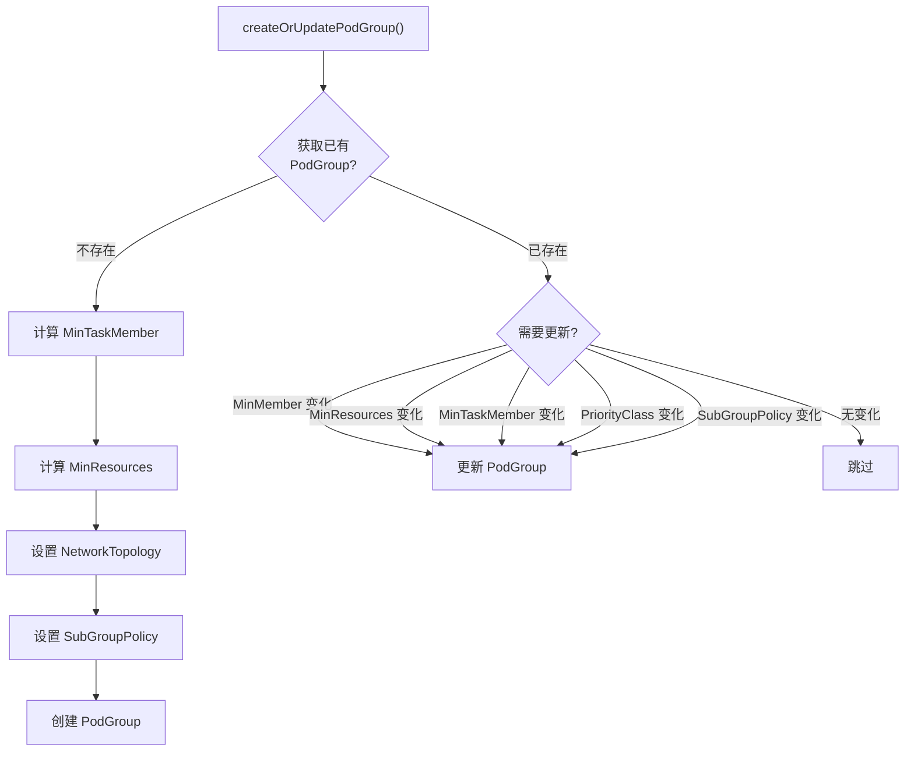

### 9.3 MinResources 计算

MinResources 的计算逻辑（`calcPGMinResources`）考虑了 Task 优先级：

1. 按 PriorityClass 对 Task 降序排列
2. 若 `job.MinAvailable < sum(task.MinAvailable)`: 按优先级从高到低累加前 `MinAvailable` 个 Pod 的资源
3. 若 `job.MinAvailable >= sum(task.MinAvailable)`: 先累加各 Task 的 MinAvailable 资源，不够再按优先级补齐

---

## 10. 插件系统

### 10.1 插件接口

`PluginInterface`（`pkg/controllers/job/plugins/interface/interface.go`）定义了 5 个方法：`Name()`、`OnPodCreate(pod, job)`、`OnJobAdd(job)`、`OnJobDelete(job)`、`OnJobUpdate(job)`。所有方法都要求幂等实现，因为可能被多次调用。

### 10.2 内置插件

| 插件 | 注册名 | 功能 |
|------|--------|------|
| `env` | `"env"` | 注入环境变量（Task 名称、Pod 列表等） |
| `svc` | `"svc"` | 创建 Headless Service 和 ConfigMap |
| `ssh` | `"ssh"` | 生成 SSH 密钥对，挂载到 Pod |
| `mpi` | `"mpi"` | MPI 分布式训练支持 |
| `pytorch` | `"pytorch"` | PyTorch 分布式训练支持 |
| `tensorflow` | `"tensorflow"` | TensorFlow 分布式训练支持 |
| `hcclrank` | `"hcclrank"` | 华为 HCCL Rank Table 生成 |
| `ray` | `"ray"` | Ray 分布式计算支持 |

### 10.3 插件执行时序

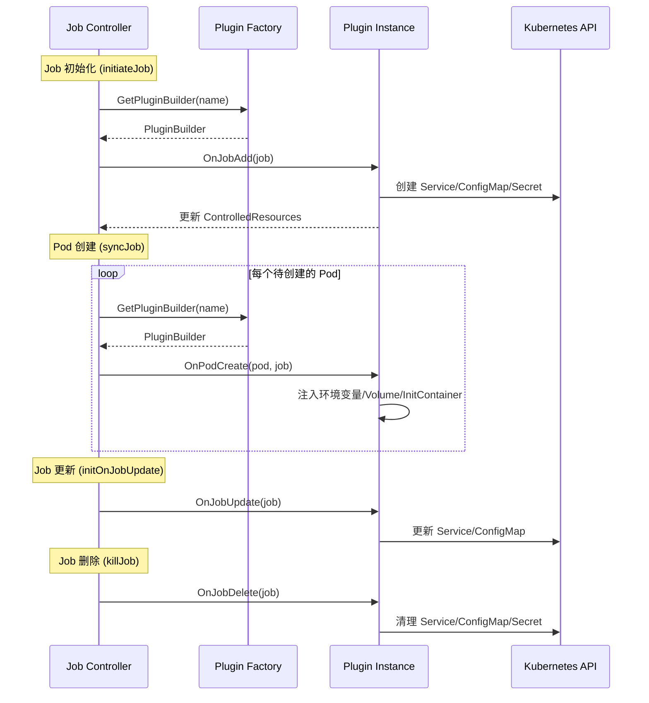

**关键设计**: 插件错误会阻塞 Job 的继续处理。如果任何插件的钩子返回错误，Job 的状态转换将失败并进入重试。每个插件通过 `ControlledResources` map 跟踪自己管理的资源。

---

## 11. 错误处理与重试

### 11.1 多层重试机制

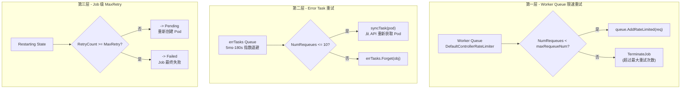

### 11.2 Error Task 重试

当 Pod 删除失败时，Pod 被加入 `errTasks` 队列（`pkg/controllers/job/job_controller_resync.go`），采用指数退避（5ms 到 180s，10 QPS 限速）。每个 Pod 最多重试 10 次，`syncTask()` 从 API Server 重新获取 Pod 状态，若 Pod 已不存在则清理缓存。

### 11.3 Worker Queue 错误处理

`handleJobError()` 检查重排队次数：若未超过 `maxRequeueNum`（-1 表示无限），调用 `queue.AddRateLimited(req)` 重试；否则强制执行 `TerminateJobAction` 终止 Job。

---

## 12. Task 依赖管理

### 12.1 依赖配置

```yaml
spec:
  tasks:
    - name: data-loader
      replicas: 1
    - name: worker
      replicas: 4
      dependsOn:
        name: ["data-loader"]
        iteration: IterationAll  # 或 IterationAny
```

### 12.2 依赖解析流程

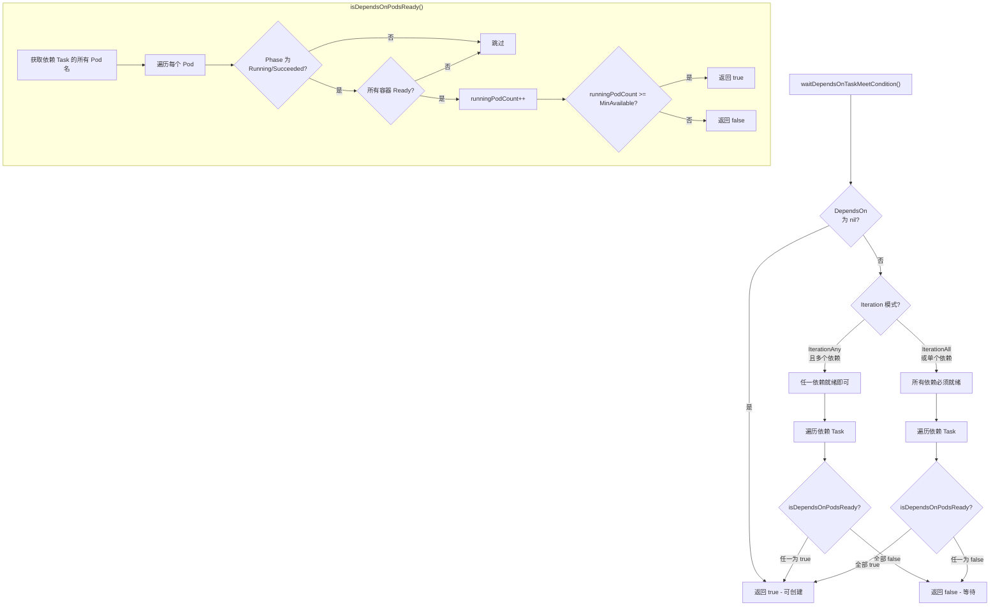

**关键点**:
- 依赖检查发生在 Pod 创建阶段（`syncJob` 中）
- 依赖未就绪时，该 Task 的 Pod 不会被创建，但不会报错，下次 Sync 时重新检查
- 依赖的判定标准是依赖 Task 有 `MinAvailable` 个 Pod 处于 Running/Succeeded 且所有容器 Ready

---

## 13. 分区策略

### 13.1 分区概念

分区策略（Partition Policy）将 Task 的 Pod 按索引划分为多个分区组，支持分区粒度的重启操作。

```yaml
spec:
  tasks:
    - name: worker
      replicas: 8
      partitionPolicy:
        partitionSize: 4     # 每个分区 4 个 Pod
        minPartitions: 1     # 最少 1 个分区
```

### 13.2 分区 ID 计算

```go
// pkg/controllers/job/job_controller_util.go - createJobPod()
if ts.PartitionPolicy != nil {
    partitionID = ix / int(ts.PartitionPolicy.PartitionSize)
    pod.Labels[batch.TaskPartitionID] = strconv.Itoa(partitionID)
}
```

例如 8 个 Pod、PartitionSize=4 的分区：
- Pod 0-3: Partition 0
- Pod 4-7: Partition 1

### 13.3 分区动作处理

当执行 `RestartPartitionAction` 时：

1. `GetStateAction()` 构建 `Target{Type: TargetTypePartition, PartitionName: "1"}`
2. `killTarget()` 调用 `killPods()` 并传入 Target
3. `killPods()` 从 `jobInfo.Partitions[taskName].Partition[partitionName]` 获取目标 Pod 列表
4. 只删除该分区内的 Pod，其他分区不受影响

---

## 14. 事件处理详解

### 14.1 Informer 事件分发

所有 Informer 的事件处理函数定义在 `pkg/controllers/job/job_controller_handler.go` 中。

#### Pod 事件映射

| Pod 状态变化 | 生成的事件 | 说明 |
|-------------|-----------|------|
| 新建（无状态） | `PodPendingEvent` | Pod 刚创建 |
| Phase: Pending -> Running | `PodRunningEvent` | Pod 开始运行 |
| Phase: Running -> Failed | `PodFailedEvent` | Pod 失败，提取 ExitCode |
| Phase: Running -> Succeeded | `TaskCompletedEvent`（若全部完成） | Task 所有 Pod 成功 |
| Pod 被删除 | `PodEvictedEvent` | Pod 被外部驱逐 |
| 带 out-of-sync 注解 | `OutOfSyncEvent` | Controller 主动删除的 Pod |
| 容器重启次数超限 | `TaskFailedEvent` | Task 级失败 |

#### PodGroup 事件映射

```go
func (cc *jobcontroller) updatePodGroup(oldObj, newObj interface{}) {
    if newPG.Status.Phase != oldPG.Status.Phase {
        switch newPG.Status.Phase {
        case scheduling.PodGroupUnknown:
            req.Event = bus.JobUnknownEvent
        }
    }
}
```

#### Command 处理

Command 通过独立的 `commandQueue` 处理。`processNextCommand()` 先删除 Command 对象（确保幂等），然后将 `CommandIssuedEvent` 加入对应 Worker Queue：

```go
func (cc *jobcontroller) processNextCommand() bool {
    // 1. 删除 Command 对象（防止重复执行）
    cc.vcClient.BusV1alpha1().Commands(cmd.Namespace).Delete(...)
    // 2. 生成 Request，Action 来自 Command
    req := apis.Request{
        Event:  bus.CommandIssuedEvent,
        Action: bus.Action(cmd.Action),
    }
    // 3. 路由到对应 Worker Queue
    queue.Add(req)
}
```

---

## 15. 初始化与启动流程

### 15.1 初始化（Initialize）

`Initialize()` 执行以下步骤：

1. 初始化 KubeClient 和 VCClient
2. 创建 N 个 Worker Queue（`queueList`）和 Command Queue
3. 创建 Job Cache 和 Error Task Queue（指数退避 5ms-180s）
4. 注册 Informer 事件处理（Job: add/update/delete, Pod: add/update/delete, PodGroup: update, Command: add with filter）
5. 注册状态机回调：`state.SyncJob = cc.syncJob`, `state.KillJob = cc.killJob`, `state.KillTarget = cc.killTarget`
6. 初始化延迟动作 Map

### 15.2 启动（Run）

`Run()` 按顺序启动：Informer Factory -> 等待缓存同步 -> Command Handler 协程 -> N 个 Worker 协程 -> Cache 后台清理协程 -> Error Task Resync 协程。

---

## 16. 关键设计模式总结

### 16.1 设计模式

| 模式 | 应用位置 | 说明 |
|------|---------|------|
| **State Pattern** | `pkg/controllers/job/state/` | 每个状态封装为独立的 struct，实现 `State` 接口 |
| **Factory Pattern** | `state.NewState()` | 根据 Phase 创建对应状态实例 |
| **Strategy Pattern** | `applyPolicies()` | 根据事件和策略动态选择执行动作 |
| **Observer Pattern** | Informer EventHandler | 监听资源变化并生成 Request |
| **Plugin Pattern** | `plugins/interface/` | 统一接口，可扩展的功能注入 |
| **Producer-Consumer** | Worker Queue + Worker | 事件生产与消费解耦 |
| **Hash-based Sharding** | FNV-32 Worker 路由 | 同一 Job 始终由同一 Worker 处理 |

### 16.2 并发安全保障

1. **单 Worker 处理同一 Job**: FNV-32 哈希保证，避免并发状态转换冲突
2. **Cache 互斥锁**: `jobCache` 使用 `sync.Mutex` 保护所有读写
3. **延迟动作锁**: `delayActionMapLock` (RWMutex) 保护延迟动作 Map
4. **原子计数**: Pod 统计使用 `atomic.AddInt32` 实现并发安全的计数
5. **深拷贝**: Cache Get 返回克隆对象，防止外部修改

### 16.3 容错设计

1. **Out-of-Sync 标记**: 先标记后删除，防止误触发事件策略
2. **版本校验**: Job Version 和 ResourceVersion 双重校验，防止过期事件处理
3. **JobUID 校验**: 防止同名 Job 快速重建时新旧 Pod 事件串扰
4. **Pod UID 校验**: 延迟动作取消时校验 UID，防止新建 Pod 误取消旧 Pod 的延迟
5. **幂等插件**: 插件接口要求所有操作幂等（`OnJobAdd` 可能被多次调用）
6. **指数退避**: 错误重试队列使用 5ms-180s 的指数退避策略

---

## 17. 源码文件索引

| 文件路径 | 核心内容 |
|---------|---------|
| `pkg/controllers/job/job_controller.go` | 控制器结构体、Initialize、Run、Worker 循环、延迟动作管理 |
| `pkg/controllers/job/job_controller_handler.go` | Informer 事件处理：Job/Pod/PodGroup/Command |
| `pkg/controllers/job/job_controller_actions.go` | syncJob、killJob、killPods、initiateJob、PodGroup/PVC 管理 |
| `pkg/controllers/job/job_controller_util.go` | createJobPod、applyPolicies、Pod 分类统计、Action 类型 |
| `pkg/controllers/job/job_controller_plugins.go` | 插件钩子调用 |
| `pkg/controllers/job/job_controller_resync.go` | 错误 Pod 指数退避重试 |
| `pkg/controllers/job/state/factory.go` | State 接口、NewState 工厂、ActionFn 类型 |
| `pkg/controllers/job/state/{pending,running,restarting,aborting,aborted,completing,terminating,finished}.go` | 各状态转换逻辑 |
| `pkg/controllers/cache/{interface,cache}.go` | Job Cache 接口与实现 |
| `pkg/controllers/apis/{job_info,request}.go` | JobInfo、Request 数据结构 |
| `pkg/controllers/job/helpers/helpers.go` | Pod 命名、索引、Out-of-Sync 标记 |
| `pkg/controllers/job/plugins/{factory,interface/interface}.go` | 插件注册与接口定义 |
