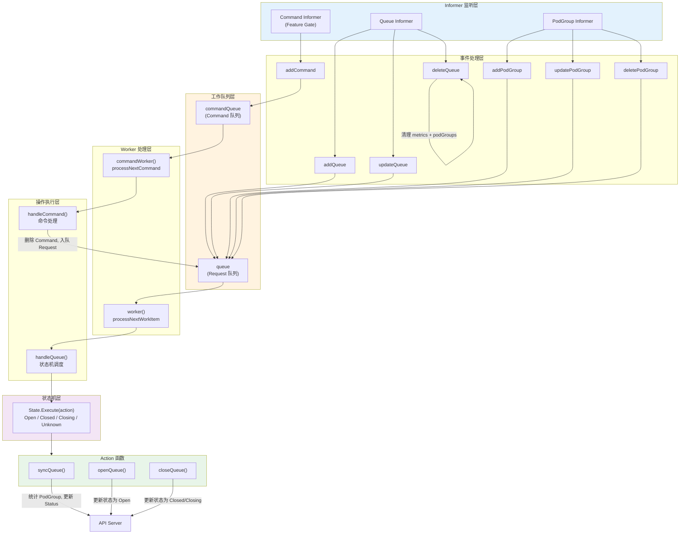
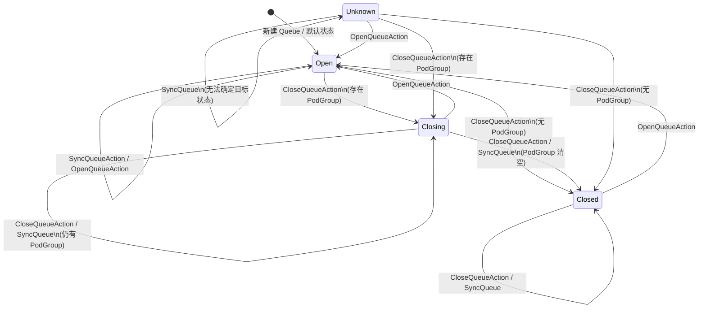
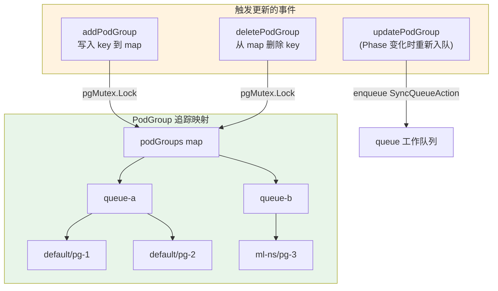
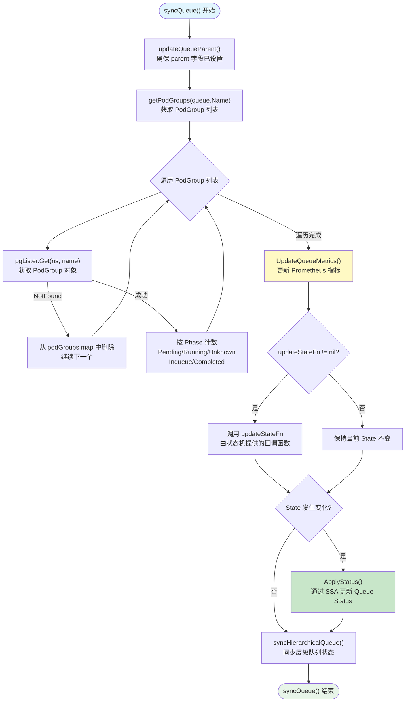
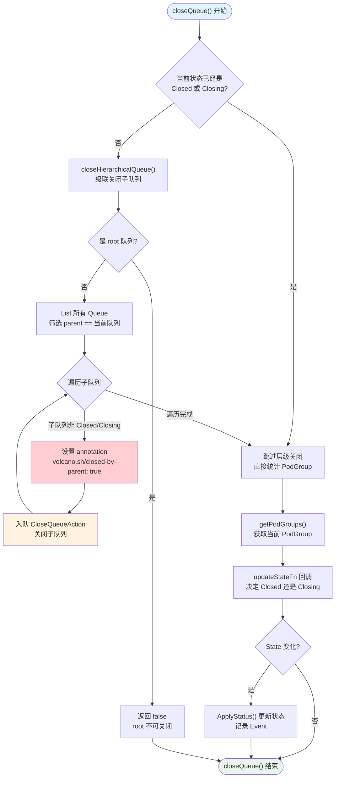
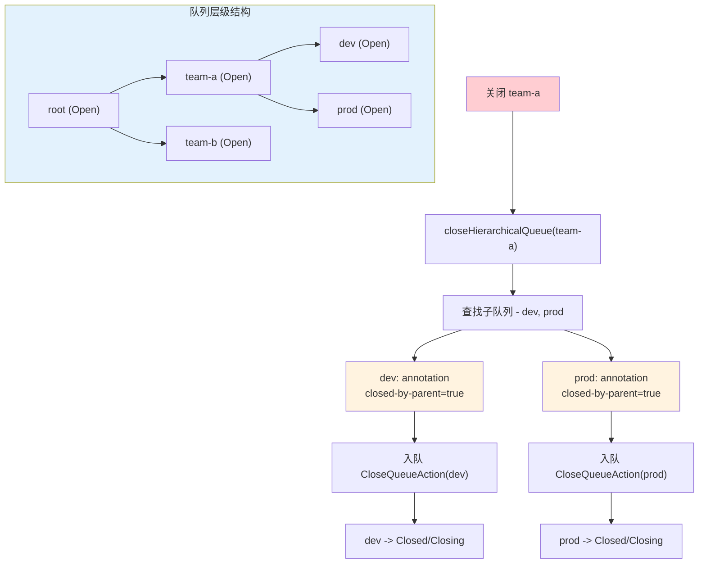
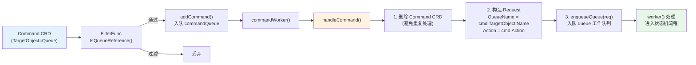
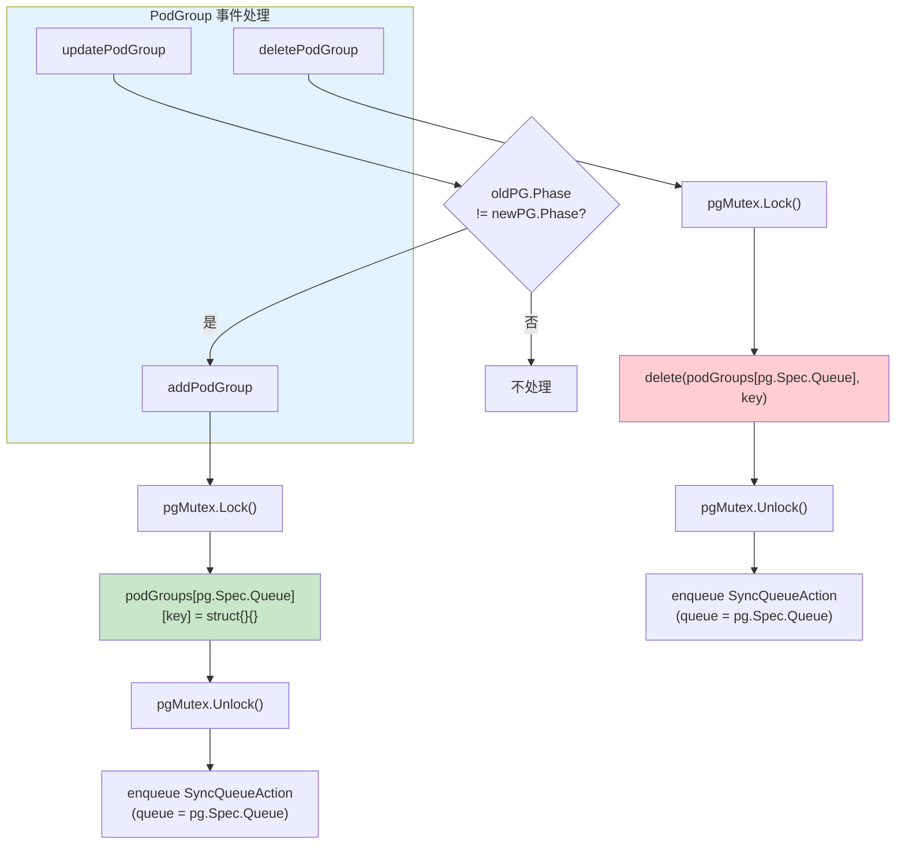

## 概述

Queue Controller 是 Volcano Controller Manager 中负责管理 Queue 生命周期的核心控制器。它维护 Queue 的状态机，追踪每个 Queue 下属 PodGroup 的阶段分布，并支持层级化队列（Hierarchical Queue）的父子关系管理。

> **源码位置**：`pkg/controllers/queue/`
>
> - `queue_controller.go` - 控制器主体结构与初始化逻辑
> - `queue_controller_handler.go` - 事件处理函数（Event Handlers）
> - `queue_controller_action.go` - 队列操作函数（syncQueue, openQueue, closeQueue）
> - `queue_controller_util.go` - 工具函数与常量定义
> - `state/` - 状态机实现（Open, Closed, Closing, Unknown）

---

## 控制器架构

Queue Controller 通过 `framework.RegisterController()` 在 `init()` 中自动注册，遵循 Volcano Controller Framework 的标准接口（`Name()`, `Initialize()`, `Run()`）。

### 核心结构体

```go
// pkg/controllers/queue/queue_controller.go
type queuecontroller struct {
    kubeClient kubernetes.Interface
    vcClient   vcclientset.Interface

    // Informer 与 Lister
    queueInformer schedulinginformer.QueueInformer
    pgInformer    schedulinginformer.PodGroupInformer
    cmdInformer   busv1alpha1informer.CommandInformer

    // 工作队列
    queue        workqueue.TypedRateLimitingInterface[*apis.Request]       // Queue 同步请求
    commandQueue workqueue.TypedRateLimitingInterface[*busv1alpha1.Command] // Command 处理请求

    // PodGroup 追踪
    pgMutex   sync.RWMutex
    podGroups map[string]map[string]struct{} // queue name -> podgroup namespace/name

    // Handler 函数
    syncHandler        func(req *apis.Request) error
    syncCommandHandler func(cmd *busv1alpha1.Command) error
    enqueueQueue       func(req *apis.Request)

    recorder      record.EventRecorder
    workers       uint32
    maxRequeueNum int
}
```

### 架构总览



### 初始化流程

`Initialize()` 方法完成以下关键配置：

1. **注册 Informer Event Handler**：Queue（Add/Update/Delete）、PodGroup（Add/Update/Delete）
2. **条件注册 Command Informer**：仅当 Feature Gate `QueueCommandSync` 开启时，注册 Command Informer 并通过 `FilterFunc` 过滤仅针对 Queue 的 Command
3. **绑定状态机 Action 函数**：将 `syncQueue`, `openQueue`, `closeQueue` 赋值给 `queuestate` 包级变量
4. **初始化工作队列**：创建带 RateLimiter 的 `queue` 和 `commandQueue`

---

## 状态机详解

Queue 拥有 4 种状态，由 `pkg/controllers/queue/state/` 包实现。每个状态是一个实现了 `State` 接口的结构体，通过 `Execute(action)` 方法接收 Action 并决定状态转换。

### 状态枚举

| 状态 | 常量 | 含义 |
|------|------|------|
| **Open** | `QueueStateOpen` | 队列正常运行，可接受新的 PodGroup |
| **Closed** | `QueueStateClosed` | 队列已关闭，不接受新 PodGroup，所有 PG 已完成 |
| **Closing** | `QueueStateClosing` | 正在关闭中，等待存量 PodGroup 运行完毕 |
| **Unknown** | `QueueStateUnknown` | 状态不一致，需通过动作恢复 |

### 状态机转换图



### 各状态 Execute 逻辑

#### Open State（`state/open.go`）

```go
func (os *openState) Execute(action v1alpha1.Action) error {
    switch action {
    case v1alpha1.OpenQueueAction:
        // 同步队列，保持 Open 状态
        return SyncQueue(os.queue, func(status, _) { status.State = QueueStateOpen })
    case v1alpha1.CloseQueueAction:
        // 调用 CloseQueue：根据 PodGroup 数量决定 Closed 还是 Closing
        return CloseQueue(os.queue, func(status, podGroupList) {
            if len(podGroupList) == 0 { status.State = QueueStateClosed }
            else                      { status.State = QueueStateClosing }
        })
    default: // SyncQueueAction 等
        return SyncQueue(os.queue, ...) // 根据当前 specState 计算目标状态
    }
}
```

#### Closed State（`state/closed.go`）

- `OpenQueueAction` --> 调用 `OpenQueue()`，转为 Open
- `CloseQueueAction` --> 调用 `SyncQueue()`，保持 Closed
- `default` --> `SyncQueue()`，根据 specState 恢复

#### Closing State（`state/closing.go`）

- `OpenQueueAction` --> 调用 `OpenQueue()`，转为 Open
- `CloseQueueAction` --> 调用 `SyncQueue()`，PodGroup 为空则 Closed，否则保持 Closing
- `default` --> `SyncQueue()`，若 Closing 中 PodGroup 清空则自动转 Closed

#### Unknown State（`state/unknown.go`）

- `OpenQueueAction` --> `OpenQueue()`，转为 Open
- `CloseQueueAction` --> `CloseQueue()`，根据 PodGroup 决定 Closed/Closing
- `default` --> `SyncQueue()`，尝试恢复到合理状态

### 状态工厂

```go
// pkg/controllers/queue/state/factory.go
func NewState(queue *v1beta1.Queue) State {
    switch queue.Status.State {
    case "", v1beta1.QueueStateOpen:    return &openState{queue: queue}
    case v1beta1.QueueStateClosed:      return &closedState{queue: queue}
    case v1beta1.QueueStateClosing:     return &closingState{queue: queue}
    case v1beta1.QueueStateUnknown:     return &unknownState{queue: queue}
    }
    return nil
}
```

空字符串（新创建的 Queue 未设置 State）被视为 Open 状态。

---

## 资源统计与 PodGroup 阶段追踪

Queue Controller 最核心的日常工作是追踪所属 PodGroup 的阶段分布，并将统计结果写入 QueueStatus。

### QueueStatus 结构

```go
// staging/src/volcano.sh/apis/pkg/apis/scheduling/v1beta1/types.go
type QueueStatus struct {
    State     QueueState        // Open, Closed, Closing, Unknown
    Unknown   int32             // Unknown 阶段的 PodGroup 数
    Pending   int32             // Pending 阶段的 PodGroup 数
    Running   int32             // Running 阶段的 PodGroup 数
    Inqueue   int32             // Inqueue 阶段的 PodGroup 数
    Completed int32             // Completed 阶段的 PodGroup 数
    Reservation Reservation     // 资源预留配置
    Allocated   ResourceList    // 已分配资源量
}
```

### PodGroup 追踪机制

控制器内部维护一个 `podGroups map[string]map[string]struct{}` 映射表，以 Queue 名称为 key，值为该 Queue 下所有 PodGroup 的 `namespace/name` 集合。该映射通过 `pgMutex`（`sync.RWMutex`）保护并发安全。



### syncQueue 资源统计流程

`syncQueue()` 是 Queue Controller 的核心统计函数，由状态机中的 `SyncQueue` 变量引用调用。



关键实现细节：

1. **Parent 自动设置**：每次 syncQueue 开始时调用 `updateQueueParent()`，若 Queue 非 "root" 且 `Spec.Parent` 为空，则通过 JSON Patch 自动设置为 "root"
2. **失效 PodGroup 清理**：若从 Lister 中找不到某个 PodGroup（已被删除），会从本地 `podGroups` 映射中移除该条目
3. **Server-Side Apply**：状态更新使用 `ApplyStatus()` 而非 `UpdateStatus()`，Field Manager 为 `"queue-controller"`
4. **层级同步**：状态更新后调用 `syncHierarchicalQueue()` 检查并传播父子队列状态

---

## 队列关闭与删除流程

### closeQueue 流程

`closeQueue()` 处理 `CloseQueueAction`，负责将队列从 Open 转为 Closed 或 Closing 状态，同时级联关闭子队列。



### deleteQueue 清理

当 Queue 资源被删除时，`deleteQueue` Handler 执行清理操作：

```go
func (c *queuecontroller) deleteQueue(obj interface{}) {
    // 1. 处理 Tombstone（延迟删除场景）
    // 2. 删除 Prometheus 指标
    metrics.DeleteQueueMetrics(queue.Name)
    // 3. 从 podGroups 映射中移除该队列的所有追踪数据
    c.pgMutex.Lock()
    delete(c.podGroups, queue.Name)
    c.pgMutex.Unlock()
}
```

`DeleteQueueMetrics` 会清除该队列在 Prometheus 中的所有 Gauge 指标（Inqueue, Pending, Running, Unknown, Completed）。

---

## 层级队列管理

Volcano 支持层级化队列，每个 Queue（除 "root" 外）都必须有一个 Parent 队列。Queue Controller 自动维护父子关系，并在状态变更时级联传播。

### 父队列自动设置

```go
// pkg/controllers/queue/queue_controller_action.go
func (c *queuecontroller) updateQueueParent(queue *v1beta1.Queue) (*v1beta1.Queue, error) {
    if queue.Name == "root" || len(queue.Spec.Parent) > 0 {
        return queue, nil  // root 或已设置 parent 的队列无需处理
    }
    // 通过 JSON Patch 自动设置 /spec/parent 为 "root"
    patch := []patchOperation{{Op: "add", Path: "/spec/parent", Value: "root"}}
    return c.vcClient.SchedulingV1beta1().Queues().Patch(...)
}
```

### 层级关闭传播

`closeHierarchicalQueue()` 在关闭队列时，查找所有以当前队列为 Parent 的子队列，为其添加 `volcano.sh/closed-by-parent: "true"` annotation 并入队 `CloseQueueAction`。



### 层级开启传播

`openHierarchicalQueue()` 在开启队列时执行两步操作：

1. **检查父队列状态**：如果父队列处于 Closed/Closing 状态，拒绝开启并返回错误（父队列可能正在被开启，需要重试）
2. **传播到子队列**：遍历所有队列，找出以当前队列为 Parent 且 annotation `closed-by-parent=true` 的子队列，为其入队 `OpenQueueAction`

### syncHierarchicalQueue 状态同步

在每次 `syncQueue()` 完成后，会调用 `syncHierarchicalQueue()` 检查父子状态一致性：

- **父队列为 Closed/Closing，子队列为 Open**：标记子队列 `closed-by-parent=true` 并入队 `CloseQueueAction`
- **父队列为 Open，子队列为 Closed/Closing 且 `closed-by-parent=true`**：入队 `OpenQueueAction` 恢复子队列

这保证了即使在 Queue Update 事件中父级发生变化，状态也能正确传播。

---

## Command 处理机制

Queue Controller 支持通过 Volcano 的 Command CRD 来触发队列操作，这一功能受 Feature Gate `QueueCommandSync` 控制（默认开启）。

### Command 处理流水线



### 关键实现细节

- **handleCommand**（`queue_controller.go`）：先删除 Command CRD 防止重复处理，再将 `cmd.TargetObject.Name` 和 `cmd.Action` 转换为 `apis.Request` 入队到 `queue` 工作队列
- **IsQueueReference**（`queue_controller_util.go`）：Command Informer 的 `FilterFunc`，验证 `TargetObject.APIVersion` 为 `scheduling.volcano.sh/v1beta1` 且 `Kind` 为 `"Queue"`
- **仅监听 Add 事件**：Command 作为一次性指令，只需处理创建事件

---

## 事件处理函数

### Queue 事件

| Handler | 触发条件 | 行为 |
|---------|---------|------|
| `addQueue` | Queue 创建 | 入队 `SyncQueueAction` |
| `updateQueue` | Queue 更新 | 仅当 `Spec.Parent` 发生变化时重新入队 `SyncQueueAction` |
| `deleteQueue` | Queue 删除 | 删除 Prometheus 指标，清理 `podGroups` 映射 |

`updateQueue` 的过滤条件值得注意：只有 Parent 字段变化才会触发重新同步，避免 Status 更新导致的无限循环。

### PodGroup 事件

| Handler | 触发条件 | 行为 |
|---------|---------|------|
| `addPodGroup` | PodGroup 创建 | 写入 `podGroups` 映射，入队父 Queue 的 `SyncQueueAction` |
| `updatePodGroup` | PodGroup 更新 | 仅当 `Status.Phase` 变化时，等同于 `addPodGroup` |
| `deletePodGroup` | PodGroup 删除 | 从 `podGroups` 映射移除，入队父 Queue 的 `SyncQueueAction` |



### Command 事件

仅监听 `Add` 事件，通过 `FilteringResourceEventHandler` 过滤非 Queue 目标的 Command。Command 被直接放入 `commandQueue`。

---

## 错误处理与重试

### handleQueue 主流程

`handleQueue()` 从 Lister 获取 Queue 对象，构造当前状态的 State 实例，委托给状态机执行。若 Queue 已被删除（`IsNotFound`），静默返回 nil。

### 重试策略

Queue 请求和 Command 请求各自有独立的错误处理函数（`handleQueueErr`, `handleCommandErr`），遵循相同的重试模式：

1. **成功**：调用 `Forget()` 清除重试计数
2. **失败且未达上限**：调用 `AddRateLimited()` 带速率限制地重新入队
3. **超过最大重试次数**：记录 Warning Event（仅 Queue 请求），调用 `Forget()` 丢弃

`maxRequeueNum == -1` 表示无限重试，由 Controller Manager 启动参数 `--max-requeue-num` 配置。

---

## Worker 并发模型

Queue Controller 支持可配置的 Worker 并发数（`workers` 字段），在 `Run()` 中启动：

```go
func (c *queuecontroller) Run(stopCh <-chan struct{}) {
    // 等待所有 Informer 缓存同步完成
    for informerType, ok := range c.vcInformerFactory.WaitForCacheSync(stopCh) {
        if !ok { return }
    }
    // 启动 workers 个 queue worker 和 command worker
    for i := 0; i < int(c.workers); i++ {
        go wait.Until(c.worker, 0, stopCh)
        go wait.Until(c.commandWorker, 0, stopCh)
    }
    <-stopCh
}
```

每个 Worker 独立运行，通过 `workqueue` 保证同一个 Queue 不会被并发处理。工作队列的 `TypedRateLimitingInterface` 提供了去重（同一 Request 不重复入队）和速率限制能力。

---

## 指标与可观测性

Queue Controller 通过 `pkg/controllers/metrics/queue.go` 暴露 Prometheus 指标：

| 指标 | 类型 | 说明 |
|------|------|------|
| `queue_pod_group_inqueue_count` | Gauge | 队列中 Inqueue 状态的 PodGroup 数 |
| `queue_pod_group_pending_count` | Gauge | 队列中 Pending 状态的 PodGroup 数 |
| `queue_pod_group_running_count` | Gauge | 队列中 Running 状态的 PodGroup 数 |
| `queue_pod_group_unknown_count` | Gauge | 队列中 Unknown 状态的 PodGroup 数 |
| `queue_pod_group_completed_count` | Gauge | 队列中 Completed 状态的 PodGroup 数 |

指标在每次 `syncQueue()` 中通过 `UpdateQueueMetrics()` 更新，在 `deleteQueue` 时通过 `DeleteQueueMetrics()` 清理。

---

## 关键设计总结

### 状态机模式的优势

Queue Controller 采用经典的状态机模式（State Pattern），将每种状态的转换逻辑封装在独立的结构体中，通过 `Execute(action)` 分发：

- **关注点分离**：每个状态文件只关心自身状态下的转换逻辑
- **可扩展性**：新增状态只需添加新的 State 实现并注册到工厂
- **Action 函数解耦**：`SyncQueue`, `OpenQueue`, `CloseQueue` 作为包级变量，由控制器在初始化时注入，状态机代码不直接依赖控制器

### 层级队列的最终一致性

层级队列状态传播是异步的，通过 `enqueue` 请求实现最终一致性：

1. 父队列关闭时，子队列被标记 annotation 并入队 `CloseQueueAction`
2. 子队列在自己的 Worker 中处理关闭请求
3. `syncHierarchicalQueue()` 在每次同步后检查一致性，修复不一致状态
4. 重试机制保证在暂时性错误下最终收敛

### 双工作队列设计

Queue 请求和 Command 请求使用独立的工作队列，这样设计的好处：

- Command 处理不会阻塞正常的 Queue 状态同步
- Command 被"消费后删除"（先删除 CRD 再入队 Request），避免重复处理
- 两类请求可以独立配置重试策略
