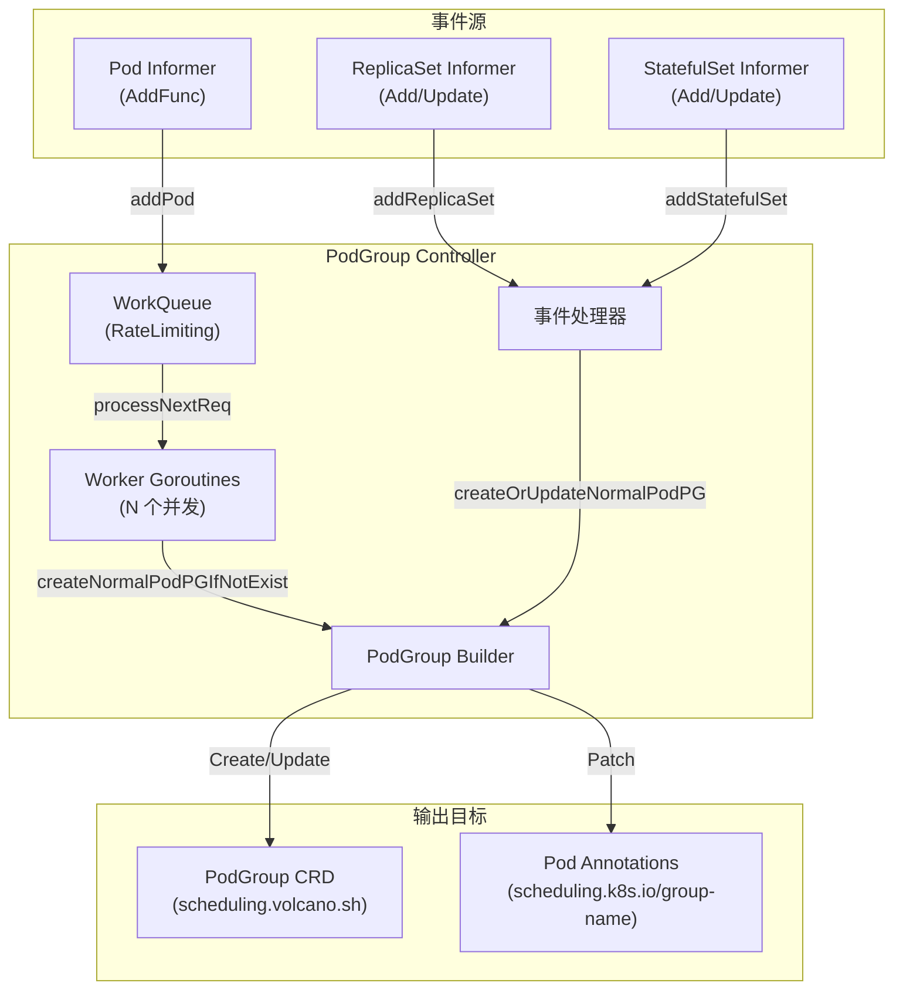
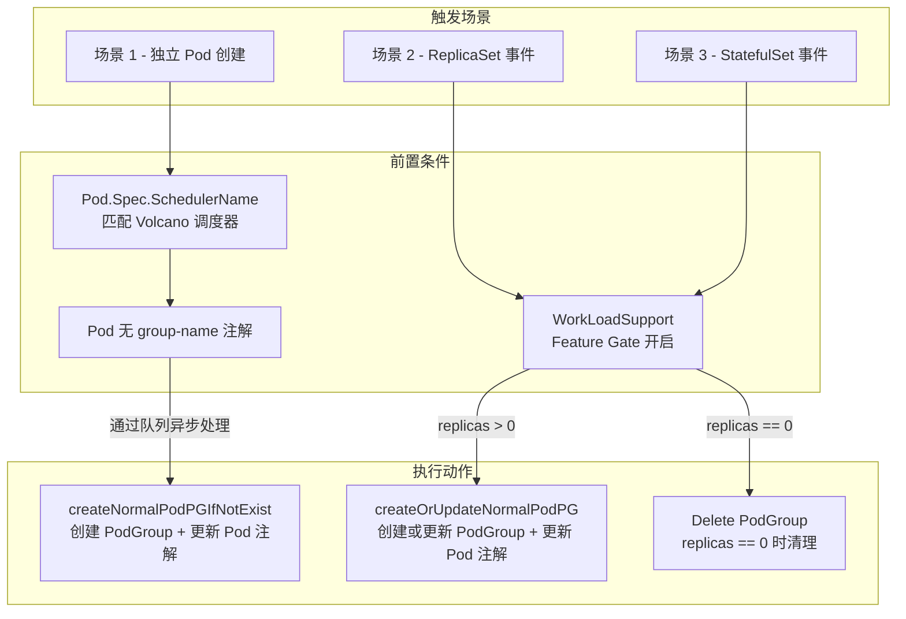
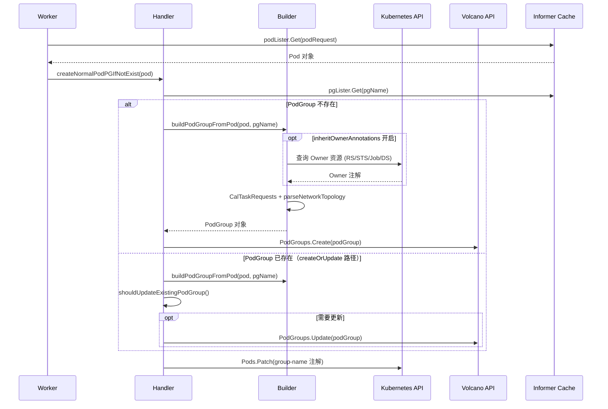
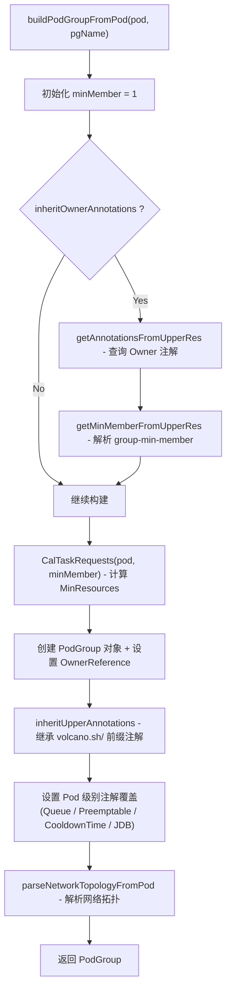
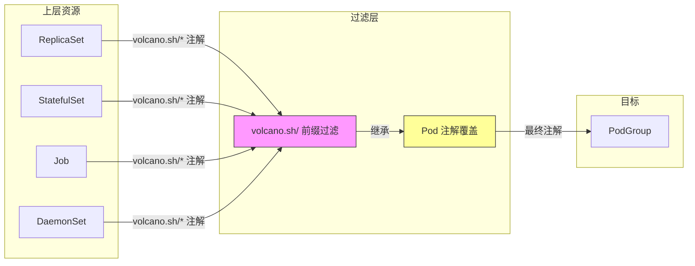
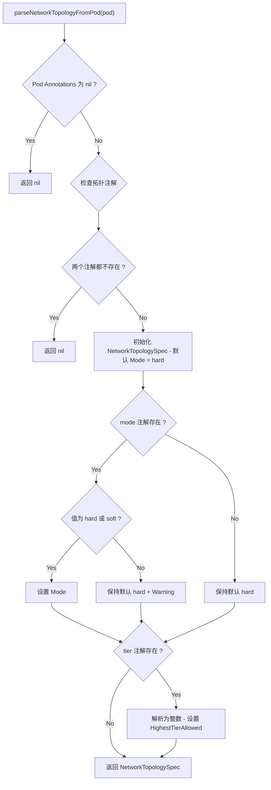
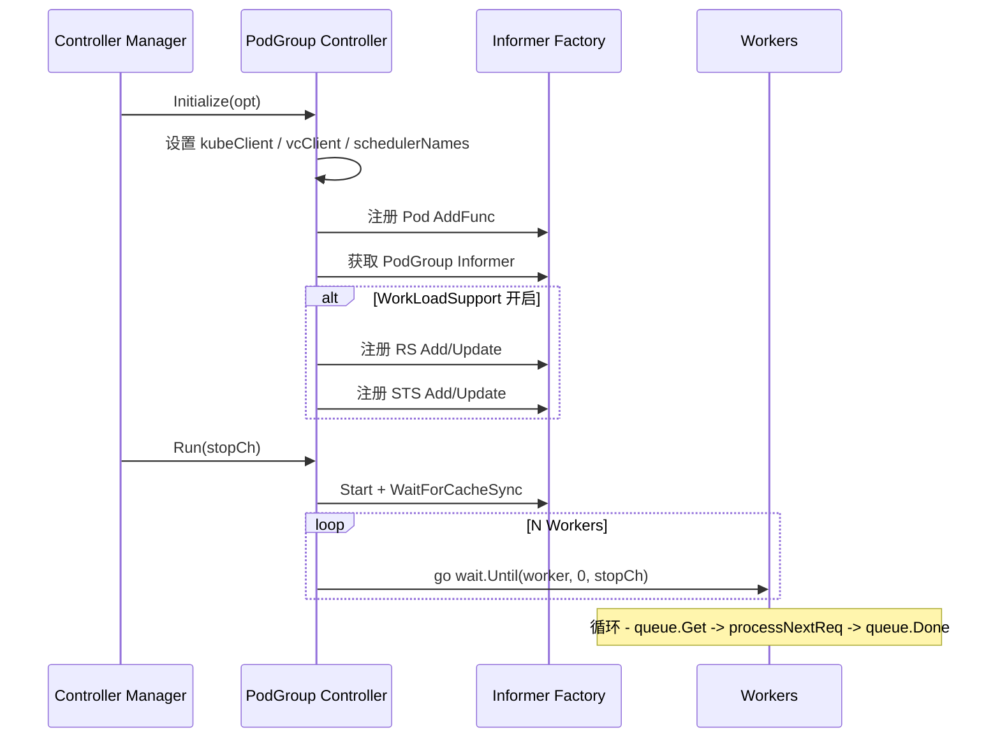
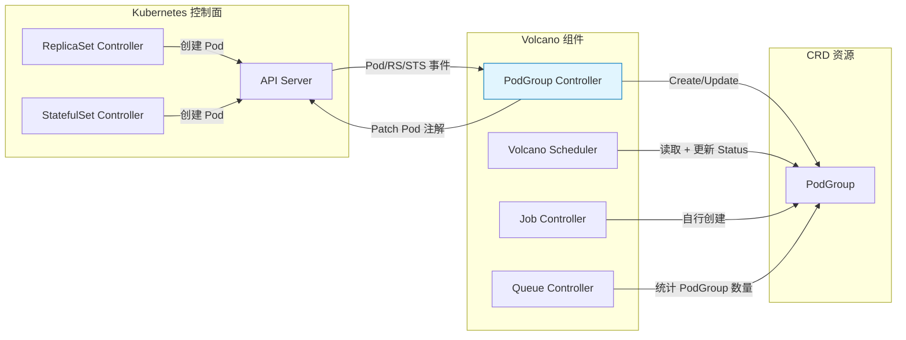

## 1. 概述与定位

PodGroup Controller 是 Volcano Controller Manager 中的核心控制器之一，负责为**独立 Pod**（即未通过 Volcano Job 创建的普通 Kubernetes 工作负载）自动创建和管理 PodGroup 资源。其核心使命是将普通 Kubernetes 工作负载（Deployment、StatefulSet、DaemonSet 管理的 Pod）纳入 Volcano 的 Gang Scheduling 体系。

> **设计理念**：PodGroup 是 Volcano 调度的基本单元。Volcano Job 会自动创建对应的 PodGroup，但对于直接使用 Kubernetes 原生控制器的用户而言，需要一个自动化机制来补齐 PodGroup 资源 -- 这正是 PodGroup Controller 的职责。

**源码位置**：`pkg/controllers/podgroup/`

| 文件 | 说明 |
|------|------|
| `pg_controller.go` | 主控制器结构体、初始化、运行循环、Worker 处理逻辑 |
| `pg_controller_handler.go` | 事件处理、PodGroup 构建、注解继承、NetworkTopology 解析 |
| `pg_controller_test.go` | 单元测试，覆盖多种场景 |

**核心职责**：

1. **Pod 事件处理** - 监听 Pod 创建事件，为使用 Volcano 调度器的独立 Pod 自动创建 PodGroup
2. **WorkLoad 事件处理** - 监听 ReplicaSet/StatefulSet 事件（WorkLoadSupport 特性门控），在副本数变化时同步创建或删除 PodGroup
3. **PodGroup 构建** - 组装 PodGroup Spec，包括 MinMember、MinResources、PriorityClassName、Queue 等字段
4. **注解继承** - 将上层资源（ReplicaSet/StatefulSet/Job/DaemonSet）的 `volcano.sh/` 前缀注解自动传播到 PodGroup
5. **NetworkTopology 集成** - 解析 Pod 注解中的网络拓扑配置并设置到 PodGroup Spec
6. **PodGroup 同步** - 当 Pod 模板或上层资源注解变化时，同步更新已存在的 PodGroup

---

## 2. 整体架构



控制器通过 `init()` 中的 `framework.RegisterController(&pgcontroller{})` 自动注册，实现 `framework.Controller` 接口（`Name()` / `Initialize()` / `Run()`）。

---

## 3. 核心数据结构

### 3.1 pgcontroller 结构体

```go
type pgcontroller struct {
    kubeClient kubernetes.Interface      // Kubernetes 原生 API 客户端
    vcClient   vcclientset.Interface     // Volcano CRD API 客户端
    podInformer coreinformers.PodInformer
    pgInformer  schedulinginformer.PodGroupInformer
    rsInformer  appinformers.ReplicaSetInformer     // WorkLoadSupport 启用时注册
    stsInformer appinformers.StatefulSetInformer    // WorkLoadSupport 启用时注册
    podLister corelisters.PodLister
    pgLister  schedulinglister.PodGroupLister
    queue workqueue.TypedRateLimitingInterface[podRequest]  // 带速率限制的工作队列
    schedulerNames          []string  // 需要处理的调度器名称列表
    workers                 uint32    // Worker 并发数
    inheritOwnerAnnotations bool      // 是否继承 Owner 的注解
}
```

### 3.2 PodGroup Spec 与 Status

```go
type PodGroupSpec struct {
    MinMember         int32                  // 最小成员数，Gang Scheduling 的核心参数
    Queue             string                 // 所属队列名称
    PriorityClassName string                 // 优先级类名
    MinResources      *v1.ResourceList       // 最小资源需求
    NetworkTopology   *NetworkTopologySpec   // 网络拓扑约束
}

type PodGroupStatus struct {
    Phase      PodGroupPhase  // Pending / Running / Unknown / Inqueue / Completed
    Running, Succeeded, Failed int32
}
```

### 3.3 关键注解常量

| 常量名 | 注解 Key | 说明 |
|--------|----------|------|
| `KubeGroupNameAnnotationKey` | `scheduling.k8s.io/group-name` | Pod 所属 PodGroup |
| `VolcanoGroupMinMemberAnnotationKey` | `scheduling.volcano.sh/group-min-member` | 最小成员数 |
| `QueueNameAnnotationKey` | `scheduling.volcano.sh/queue-name` | 队列名称 |
| `PodPreemptable` | `volcano.sh/preemptable` | 抢占策略 |
| `CooldownTime` | `volcano.sh/cooldown-time` | 冷却时间 |
| `RevocableZone` | `volcano.sh/revocable-zone` | 可回收区域 |
| `JDBMinAvailable` | `volcano.sh/jdb-min-available` | JDB 最小可用数 |
| `JDBMaxUnavailable` | `volcano.sh/jdb-max-unavailable` | JDB 最大不可用数 |
| `NetworkTopologyModeAnnotationKey` | `volcano.sh/network-topology-mode` | 拓扑模式 |
| `NetworkTopologyHighestTierAnnotationKey` | `volcano.sh/network-topology-highest-tier` | 最高层级 |

---

## 4. PodGroup 自动创建机制

### 4.1 触发场景全景图



### 4.2 场景 1 - 独立 Pod 创建

最基础的触发路径。`addPod()` 将 Pod 信息封装为 `podRequest{podName, podNamespace}` 放入工作队列：

```go
func (pg *pgcontroller) addPod(obj interface{}) {
    pod, ok := obj.(*v1.Pod)
    if !ok { return }
    req := podRequest{podName: pod.Name, podNamespace: pod.Namespace}
    pg.queue.Add(req)
}
```

Worker 从队列取出请求后经过三层过滤：

1. **调度器名称匹配** - `pod.Spec.SchedulerName` 必须在 `schedulerNames` 列表中（默认为 `"volcano"`）
2. **无已有 PodGroup 绑定** - Pod 的 `scheduling.k8s.io/group-name` 注解为空
3. **调用 `createNormalPodPGIfNotExist()`** 执行实际创建

### 4.3 场景 2 - ReplicaSet 事件

当 `WorkLoadSupport` Feature Gate 开启时（默认开启，Alpha 阶段），控制器监听 RS 的 Add 和 Update 事件：

- **replicas == 0**：删除对应 PodGroup（名称为 `podgroup-<RS.UID>`）
- **replicas > 0**：通过 Label Selector 查找关联 Pod，校验调度器名称和 `group-name` 注解，然后调用 `createOrUpdateNormalPodPG()`

`updateReplicaSet()` 直接委托给 `addReplicaSet(newObj)`，两者使用相同的处理逻辑。

> **滚动升级场景**：在 Rolling Update 过程中，可能出现 `addReplicaSet(replicas=0)` 事件先于 `updateReplicaSet(replicas=1)` 事件到达。这就是为什么 `addReplicaSet` 同时处理 replicas > 0 的逻辑。

### 4.4 场景 3 - StatefulSet 事件

处理流程与 ReplicaSet 类似，但有两个区别：

1. **精确 Pod 匹配**：查找 Pod 时额外匹配 `controller-revision-hash` Label（值为 `sts.Status.UpdateRevision`），确保只匹配当前版本 Pod，这在滚动更新场景下尤为重要
2. **LeaderWorkerSet 兼容**：如果 Pod 已由 LWS 自行创建了 PodGroup（即 `group-name` 注解已存在），则跳过创建

---

## 5. 构建 PodGroup 详解

### 5.1 构建流程时序图



### 5.2 PodGroup 名称生成

`helpers.GeneratePodgroupName()` 的命名策略：

- **有 Controller Owner 的 Pod**：`podgroup-<Controller OwnerReference UID>`（同一控制器的 Pod 共享 PodGroup）
- **无 Controller Owner 的 Pod**：`podgroup-<Pod UID>`（每个独立 Pod 独有 PodGroup）

这保证了同一控制器管理的所有 Pod 共享同一个 PodGroup，是 Gang Scheduling 正确工作的前提。

### 5.3 buildPodGroupFromPod 步骤



### 5.4 OwnerReference 设置

`newPGOwnerReferences()` 函数负责为 PodGroup 设置正确的 OwnerReference：

- **有 Controller Owner 的 Pod**：直接复用 Pod 的 OwnerReferences（指向 ReplicaSet、StatefulSet 等）
- **无 Controller Owner 的 Pod**：通过 `metav1.NewControllerRef(pod, gvk)` 创建指向 Pod 自身的 ControllerRef

这确保了当 Owner 资源被删除时，关联的 PodGroup 也会被 Kubernetes 垃圾回收机制（Garbage Collector）自动清理。

### 5.5 MinResources 计算

MinResources 通过 `util.CalTaskRequests()` 计算：

```go
func CalTaskRequests(pod *v1.Pod, validReplica int32) v1.ResourceList {
    minReq := v1.ResourceList{}
    usage := GetPodQuotaUsage(pod)  // quotacore.PodUsageFunc 计算单 Pod 资源用量
    for i := int32(0); i < validReplica; i++ {
        minReq = quotav1.Add(minReq, usage)
    }
    return minReq
}
```

`GetPodQuotaUsage()` 使用 Kubernetes 内置的 `quotacore.PodUsageFunc()` 计算 Pod 资源配额用量，涵盖所有容器的 Requests 和自定义资源（如 `nvidia.com/gpu`）。

---

## 6. 注解继承机制



继承流程由三个函数协作完成：

1. **`getAnnotationsFromUpperRes()`** - 遍历 Pod 的 OwnerReferences，按 Kind（ReplicaSet / DaemonSet / StatefulSet / Job）查询对应 API 资源，收集所有注解。同一 key 先出现的优先。
2. **`getMinMemberFromUpperRes()`** - 从上层注解解析 `scheduling.volcano.sh/group-min-member`，无效值或负数时默认 1。
3. **`inheritUpperAnnotations()`** - 仅当 `inheritOwnerAnnotations=true` 时执行，只继承 `volcano.sh/` 前缀的注解。

**优先级规则**：先执行继承写入，再逐一检查 Pod 注解进行覆盖。用户可在 Deployment 层设通用配置，在 Pod 层精细覆盖。

> `JDBMinAvailable` 和 `JDBMaxUnavailable` 互斥 -- 代码使用 `if-else if`，两者同时存在时仅 `JDBMinAvailable` 生效。

---

## 7. NetworkTopology 集成

NetworkTopology 是 Volcano 的网络拓扑感知调度特性，配合 HyperNode CRD 使用。



- **Hard Mode** - 严格约束，Pod 必须调度在满足拓扑要求的节点上
- **Soft Mode** - 柔性约束，允许在特定条件下跨越网络边界
- **HighestTierAllowed** - 指定允许跨越的最高网络层级

---

## 8. 更新检测与同步

### 8.1 shouldUpdateExistingPodGroup

该函数通过 `reflect.DeepEqual()` 对比三个维度判断 PodGroup 是否需要更新：

1. **Spec** - MinMember / MinResources / Queue / PriorityClassName / NetworkTopology
2. **Labels** - PodPreemptable / CooldownTime 等
3. **Annotations** - 所有 volcano.sh/ 前缀注解

具体实现是先调用 `buildPodGroupFromPod()` 构建期望状态的 PodGroup，再与已有 PodGroup 逐维度对比。有任一维度变化时更新已有 PodGroup 的对应字段并执行 `PodGroups.Update()` 同步。

### 8.2 Pod 注解回写

PodGroup 创建/更新后，控制器通过 Strategic Merge Patch 将 `scheduling.k8s.io/group-name` 注解写回 Pod。这一步至关重要 -- 它建立了 Pod 与 PodGroup 之间的双向关联：

- **PodGroup -> Pod**：通过 OwnerReference 关联
- **Pod -> PodGroup**：通过 `scheduling.k8s.io/group-name` 注解关联

Volcano Scheduler 正是通过读取 Pod 上的 `group-name` 注解来识别其所属的 PodGroup，从而执行 Gang Scheduling。如果 Pod 已有 `group-name` 注解且值与新 PodGroup 名称不同，控制器会记录错误日志但不覆盖，避免破坏已有的绑定关系。

---

## 9. 初始化与启动流程



**Worker 处理关键设计**：

- **速率限制重试**：失败时调用 `AddRateLimited()` 重新入队，速率限制器根据失败次数自动增加延迟（指数退避），避免短时间内大量重试冲击 API Server
- **幂等性保证**：先查本地缓存（`pgLister`），缓存中不存在时才调用 API Server 创建；即使 API 返回 `AlreadyExists` 错误也不报错，处理并发创建的竞态条件
- **缓存一致性**：本地缓存可能存在延迟导致重复创建请求，依赖 `AlreadyExists` 容忍机制保证最终一致性
- **成功后遗忘**：成功时调用 `queue.Forget(req)` 将请求从速率限制器中移除，重置退避计数

| 配置参数 | 来源 | 说明 |
|----------|------|------|
| `workers` | `opt.WorkerThreadsForPG` | Worker 并发数 |
| `schedulerNames` | `opt.SchedulerNames` | 处理的调度器名称列表 |
| `inheritOwnerAnnotations` | `opt.InheritOwnerAnnotations` | 是否继承 Owner 注解 |

---

## 10. 与其他组件的交互



- **Volcano Scheduler**：消费 PodGroup 进行 Gang Scheduling（Gang Plugin 检查 MinMember）、队列资源分配（Proportion Plugin 使用 Queue 字段），并更新 Phase 状态
- **Job Controller**：为 Volcano Job 自行创建 PodGroup，PodGroup Controller 通过 `group-name` 注解检测避免重复创建
- **Queue Controller**：统计各 Queue 中不同状态的 PodGroup 数量维护 Queue Status

---

## 11. 典型使用场景

### Deployment 使用 Volcano Gang Scheduling

```yaml
apiVersion: apps/v1
kind: Deployment
metadata:
  name: training-workers
  annotations:
    scheduling.volcano.sh/group-min-member: "4"
    volcano.sh/queue-name: "gpu-queue"
spec:
  replicas: 4
  template:
    spec:
      schedulerName: volcano
      containers:
      - name: worker
        resources:
          requests:
            nvidia.com/gpu: "1"
```

PodGroup Controller 会自动执行以下步骤：
1. 监听到 Pod 创建事件，通过 addPod 放入工作队列
2. Worker 查询 ReplicaSet 的注解，获取 `group-min-member: 4`
3. 创建 PodGroup，设置 `MinMember=4`、`MinResources=4*GPU`、`Queue=gpu-queue`
4. 在每个 Pod 上添加 `scheduling.k8s.io/group-name` 注解
5. Volcano Scheduler 读取 PodGroup，确保 4 个 Pod 同时满足资源后才开始调度

### StatefulSet 带网络拓扑约束

```yaml
apiVersion: apps/v1
kind: StatefulSet
metadata:
  name: gpu-workers
spec:
  replicas: 8
  template:
    metadata:
      annotations:
        volcano.sh/network-topology-mode: "hard"
        volcano.sh/network-topology-highest-tier: "2"
    spec:
      schedulerName: volcano
```

控制器解析拓扑注解，生成带 `NetworkTopology` 配置的 PodGroup，使 Scheduler 基于 HyperNode 层级结构做拓扑感知调度。

---

## 12. 源码文件索引

| 文件路径 | 主要内容 |
|----------|----------|
| `pkg/controllers/podgroup/pg_controller.go` | pgcontroller 定义、Initialize、Run、worker、processNextReq |
| `pkg/controllers/podgroup/pg_controller_handler.go` | 事件处理器、buildPodGroupFromPod、parseNetworkTopologyFromPod、shouldUpdateExistingPodGroup、注解继承函数 |
| `pkg/controllers/podgroup/pg_controller_test.go` | 单元测试（Pod 创建、StatefulSet 事件、注解继承、NetworkTopology、更新检测） |
| `pkg/controllers/framework/interface.go` | Controller 接口、ControllerOption 结构体 |
| `pkg/controllers/util/util.go` | GetPodQuotaUsage、CalTaskRequests |
| `pkg/features/volcano_features.go` | WorkLoadSupport Feature Gate |
| `staging/.../scheduling/v1beta1/labels.go` | 注解常量定义 |
| `staging/.../scheduling/v1beta1/types.go` | PodGroup / PodGroupSpec / PodGroupStatus / NetworkTopologySpec |
| `staging/.../topology/v1alpha1/labels.go` | NetworkTopology 注解常量 |
| `staging/.../helpers/helpers.go` | GeneratePodgroupName |
| `staging/.../batch/v1alpha1/labels.go` | PodgroupNamePrefix (`"podgroup-"`) |
