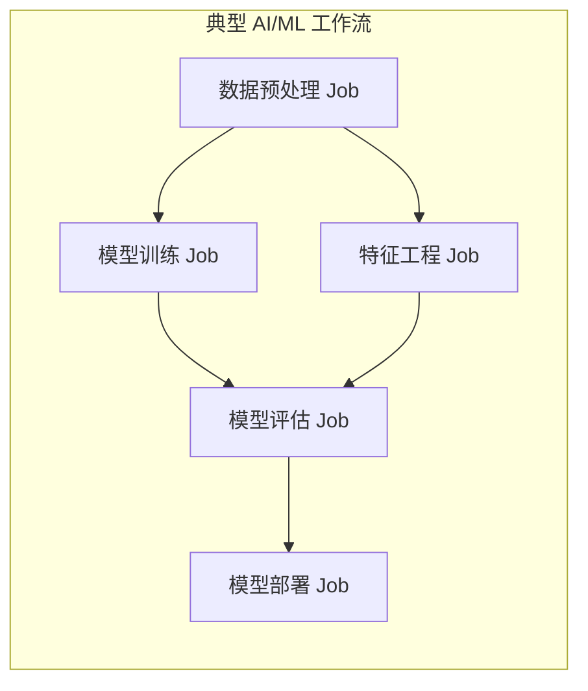
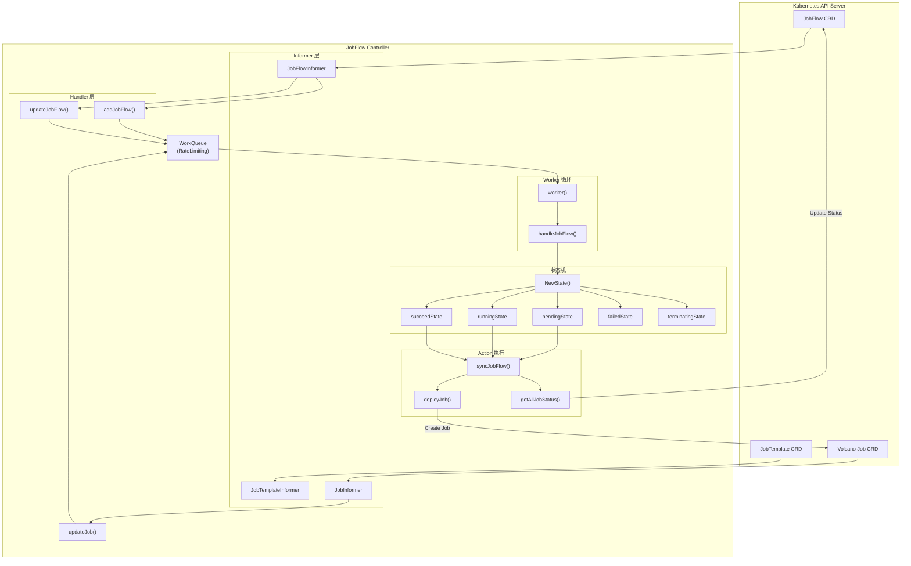
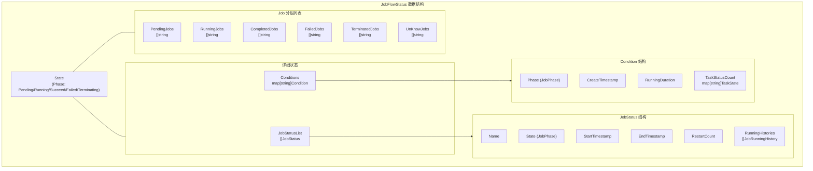
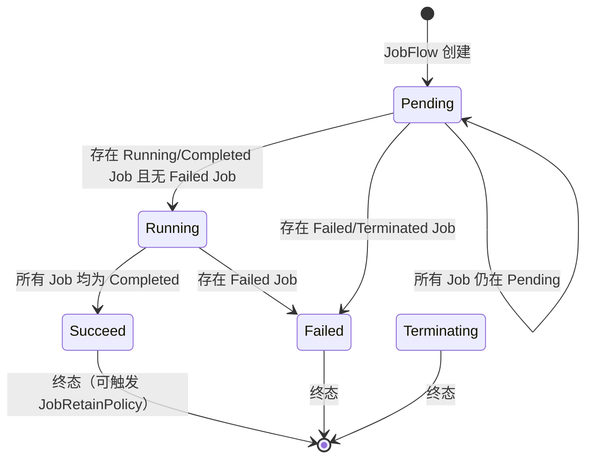
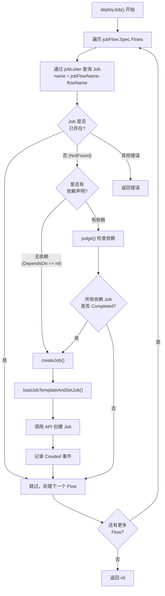
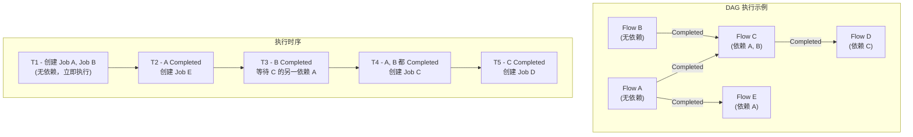
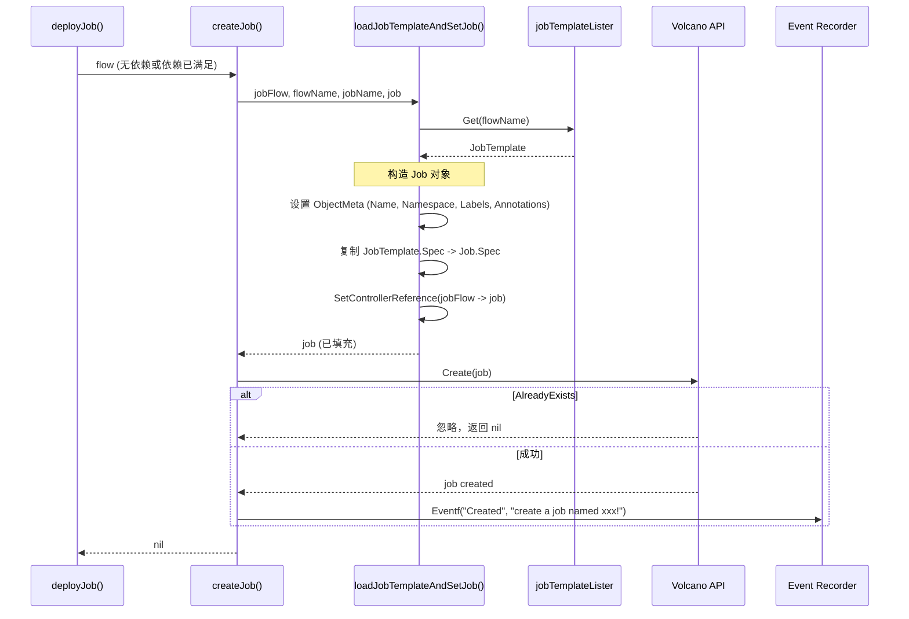
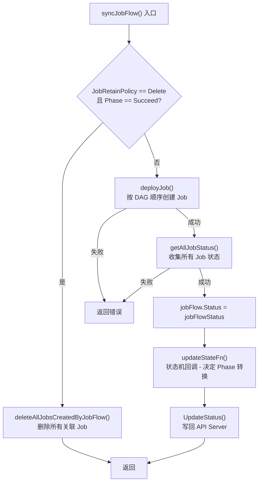
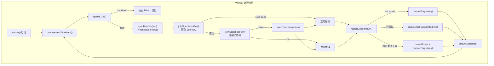
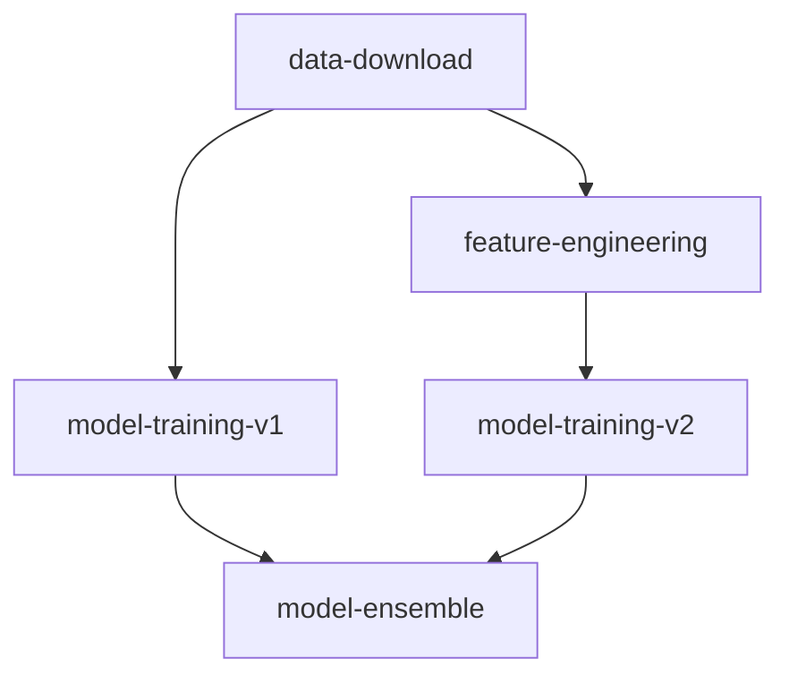

## 1. 概述与应用场景

### 1.1 什么是 JobFlow

JobFlow 是 Volcano 提供的**工作流编排控制器**，用于管理多个 Volcano Job 之间的依赖关系和执行顺序。它通过声明式的 DAG（有向无环图）定义，实现了复杂批处理工作流的自动化编排。

在 AI/ML 和大数据场景中，一个完整的计算任务往往由多个阶段组成：数据预处理、模型训练、模型评估、结果导出等。这些阶段之间存在明确的先后依赖关系。JobFlow Controller 正是为解决这类**多阶段依赖编排**问题而设计的。

### 1.2 核心能力

| 能力 | 说明 |
|------|------|
| DAG 依赖编排 | 通过 `DependsOn` 字段声明 Job 间的依赖关系，自动按拓扑顺序执行 |
| JobTemplate 复用 | 将 Job 定义抽象为 JobTemplate CRD，支持跨 JobFlow 复用 |
| 状态机管理 | 五状态流转（Pending / Running / Succeed / Failed / Terminating） |
| Job 保留策略 | 支持 `retain` 和 `delete` 两种策略，控制工作流完成后 Job 的生命周期 |
| 运行历史追踪 | 记录每个 Job 的状态转换时间线，便于回溯和调试 |
| Prometheus 指标 | 暴露 `jobflow_succeed_phase_count` 和 `jobflow_failed_phase_count` 监控指标 |

### 1.3 典型应用场景



在上述场景中，JobFlow 允许用户将整个 ML Pipeline 声明为一个 CRD 资源，Controller 会自动管理各阶段的执行时序：先运行数据预处理，预处理完成后并行启动模型训练和特征工程，二者都完成后执行模型评估，最终进行模型部署。

### 1.4 源码位置

| 文件 | 职责 |
|------|------|
| `pkg/controllers/jobflow/jobflow_controller.go` | Controller 初始化、Worker 循环、错误处理 |
| `pkg/controllers/jobflow/jobflow_controller_action.go` | DAG 执行逻辑、Job 创建、状态收集 |
| `pkg/controllers/jobflow/jobflow_controller_handler.go` | 事件处理器（JobFlow Add/Update、Job Update） |
| `pkg/controllers/jobflow/jobflow_controller_util.go` | 工具函数（Job 命名、OwnerReference 查询等） |
| `pkg/controllers/jobflow/constant.go` | 常量定义（标签、注解 Key） |
| `pkg/controllers/jobflow/state/` | 状态机实现（factory、pending、running、succeed、failed、terminating） |
| `pkg/controllers/jobflow/state/metrics.go` | Prometheus 指标上报 |
| `staging/src/volcano.sh/apis/pkg/apis/flow/v1alpha1/` | CRD 类型定义（JobFlow、JobTemplate、Action、Event） |

---

## 2. 整体架构

### 2.1 架构概览



### 2.2 Controller 结构体

`jobflowcontroller` 是 Controller 的核心结构体，实现了 `framework.Controller` 接口：

```go
type jobflowcontroller struct {
    kubeClient kubernetes.Interface     // Kubernetes 原生客户端
    vcClient   vcclientset.Interface    // Volcano CRD 客户端

    // Informers - 监听三种 CRD 资源
    jobFlowInformer     flowinformer.JobFlowInformer
    jobTemplateInformer flowinformer.JobTemplateInformer
    jobInformer         batchinformer.JobInformer

    // Listers - 本地缓存的资源查询接口
    jobFlowLister   flowlister.JobFlowLister
    jobTemplateLister flowlister.JobTemplateLister
    jobLister        batchlister.JobLister

    // Event recorder - 事件记录器
    recorder record.EventRecorder

    // Work Queue - 异步处理队列
    queue          workqueue.TypedRateLimitingInterface[apis.FlowRequest]
    enqueueJobFlow func(req apis.FlowRequest)
    syncHandler    func(req *apis.FlowRequest) error

    maxRequeueNum int  // 最大重入队列次数（-1 表示无限制）
}
```

### 2.3 FlowRequest 请求结构

Controller 使用 `FlowRequest` 作为 WorkQueue 的工作单元：

```go
type FlowRequest struct {
    Namespace       string                // JobFlow 所在 Namespace
    JobFlowName     string                // JobFlow 名称
    JobTemplateName string                // JobTemplate 名称（当前未使用）
    Action          flowv1alpha1.Action   // 操作类型：SyncJobFlow / SyncJobTemplate
    Event           flowv1alpha1.Event    // 事件类型：OutOfSync
}
```

当前版本中，所有请求统一使用 `SyncJobFlowAction` 和 `OutOfSyncEvent`，表示 JobFlow 需要重新同步。

---

## 3. 核心数据结构

### 3.1 JobFlow CRD

JobFlow 是 `flow.volcano.sh` API Group 下的核心 CRD，属于 `v1alpha1` 版本。

```yaml
apiVersion: flow.volcano.sh/v1alpha1
kind: JobFlow
metadata:
  name: ml-pipeline
  namespace: default
spec:
  # 工作流中的所有 Flow（每个 Flow 对应一个 JobTemplate）
  flows:
    - name: data-preprocess        # 对应同名 JobTemplate
      # 无依赖，首先执行
    - name: model-training
      dependsOn:
        targets:
          - data-preprocess        # 依赖 data-preprocess 完成
    - name: model-evaluation
      dependsOn:
        targets:
          - model-training         # 依赖 model-training 完成
  # Job 保留策略：retain（保留）或 delete（完成后删除）
  jobRetainPolicy: retain
status:
  state:
    phase: Running                 # 当前状态
  pendingJobs: []
  runningJobs: ["ml-pipeline-model-training"]
  completedJobs: ["ml-pipeline-data-preprocess"]
  failedJobs: []
  terminatedJobs: []
  jobStatusList: [...]             # 每个 Job 的详细状态
  conditions: {...}                # 每个 Job 的 Condition
```

### 3.2 Flow 定义

```go
type Flow struct {
    Name      string     `json:"name"`                // Flow 名称，同时也是 JobTemplate 名称
    DependsOn *DependsOn `json:"dependsOn,omitempty"` // 依赖声明
    Patch     *Patch     `json:"patch,omitempty"`     // Job Spec 覆写（预留能力）
}

type DependsOn struct {
    Targets []string `json:"targets,omitempty"` // 依赖的 Flow 名称列表
    Probe   *Probe   `json:"probe,omitempty"`   // 健康检查探针（预留能力）
}
```

其中 `DependsOn.Targets` 是 DAG 依赖图中的边，每个元素是另一个 Flow 的 `Name`。`Probe` 字段定义了更精细的依赖检查（HTTP/TCP/TaskStatus），当前版本中尚未在 Controller 逻辑中完全实现。

### 3.3 JobTemplate CRD

```go
type JobTemplate struct {
    metav1.TypeMeta   `json:",inline"`
    metav1.ObjectMeta `json:"metadata,omitempty"`
    Spec   v1alpha1.JobSpec  `json:"spec,omitempty"`   // 直接嵌入 Volcano JobSpec
    Status JobTemplateStatus `json:"status,omitempty"`
}
```

JobTemplate 本质上是对 Volcano Job Spec 的封装，使得同一个 Job 定义可以被多个 JobFlow 引用。

### 3.4 JobFlowStatus 结构

```go
type JobFlowStatus struct {
    PendingJobs    []string               // Pending 状态的 Job 名称列表
    RunningJobs    []string               // Running 状态的 Job 名称列表
    FailedJobs     []string               // Failed 状态的 Job 名称列表
    CompletedJobs  []string               // Completed 状态的 Job 名称列表
    TerminatedJobs []string               // Terminated 状态的 Job 名称列表
    UnKnowJobs     []string               // 未知状态的 Job 名称列表
    JobStatusList  []JobStatus            // 每个 Job 的详细状态
    Conditions     map[string]Condition   // Job 名称 -> Condition 映射
    State          State                  // JobFlow 整体状态
}
```



---

## 4. 状态机详解

### 4.1 状态定义

JobFlow 定义了五个 Phase 状态，通过 `state/factory.go` 中的 `NewState()` 工厂方法创建对应的状态对象：

| Phase | 含义 | State 实现 | Execute 行为 |
|-------|------|-----------|-------------|
| `Pending`（含空字符串） | 初始状态，等待 Job 开始执行 | `pendingState` | 同步 Job 状态，判断是否转为 Running 或 Failed |
| `Running` | Job 正在执行中 | `runningState` | 同步 Job 状态，判断是否所有 Job 完成或存在失败 |
| `Succeed` | 所有 Job 成功完成 | `succeedState` | 仅同步状态（处理 JobRetainPolicy） |
| `Failed` | 至少一个 Job 失败 | `failedState` | 不执行任何操作（终态） |
| `Terminating` | 正在被删除 | `terminatingState` | 不执行任何操作（终态） |

### 4.2 状态转换图



### 4.3 状态转换逻辑详解

#### Pending 状态

`pendingState.Execute()` 通过回调函数 `UpdateJobFlowStatusFn` 实现状态判断：

```go
func (p *pendingState) Execute(action Action) error {
    return SyncJobFlow(p.jobFlow, func(status *JobFlowStatus, allJobList int) {
        if (len(status.RunningJobs) > 0 || len(status.CompletedJobs) > 0) &&
            len(status.FailedJobs) <= 0 {
            // 条件1：有 Job 开始运行/已完成，且无失败 -> Running
            status.State.Phase = Running
        } else if len(status.FailedJobs) > 0 || len(status.TerminatedJobs) > 0 {
            // 条件2：有 Job 失败或被终止 -> Failed
            UpdateJobFlowFailed(p.jobFlow.Namespace) // 递增 Prometheus 计数器
            status.State.Phase = Failed
        } else {
            // 条件3：保持 Pending
            status.State.Phase = Pending
        }
    })
}
```

#### Running 状态

`runningState.Execute()` 关注所有 Job 是否完成：

```go
func (p *runningState) Execute(action Action) error {
    return SyncJobFlow(p.jobFlow, func(status *JobFlowStatus, allJobList int) {
        if len(status.CompletedJobs) == allJobList {
            // 所有 Job 完成 -> Succeed
            UpdateJobFlowSucceed(p.jobFlow.Namespace) // 递增 Prometheus 计数器
            status.State.Phase = Succeed
        } else if len(status.FailedJobs) > 0 {
            // 存在失败 -> Failed
            status.State.Phase = Failed
        }
        // 否则保持 Running（不修改 Phase）
    })
}
```

#### Succeed / Failed / Terminating 状态

这三个状态均为终态：

- **Succeed**：调用 `SyncJobFlow()` 但回调函数为空操作，主要目的是触发 `syncJobFlow()` 中的 `JobRetainPolicy` 判断逻辑
- **Failed / Terminating**：`Execute()` 直接返回 nil，不做任何处理

---

## 5. DAG 执行引擎

### 5.1 执行流程

`deployJob()` 方法实现了 DAG 的核心遍历和调度逻辑。



### 5.2 Job 命名规则

Controller 使用 `getJobName()` 函数生成实际 Job 名称：

```go
func getJobName(jobFlowName string, jobTemplateName string) string {
    return jobFlowName + "-" + jobTemplateName
}
```

例如 JobFlow 名为 `ml-pipeline`，Flow 名为 `data-preprocess`，生成的 Job 名称为 `ml-pipeline-data-preprocess`。

### 5.3 依赖检查 - judge()

`judge()` 方法遍历当前 Flow 的所有 `DependsOn.Targets`，逐一检查对应 Job 的状态：

```go
func (jf *jobflowcontroller) judge(jobFlow *JobFlow, flow Flow) (bool, error) {
    for _, targetName := range flow.DependsOn.Targets {
        targetJobName := getJobName(jobFlow.Name, targetName)
        job, err := jf.jobLister.Jobs(jobFlow.Namespace).Get(targetJobName)
        if err != nil {
            if errors.IsNotFound(err) {
                return false, nil  // 依赖 Job 尚未创建，不满足
            }
            return false, err
        }
        if job.Status.State.Phase != v1alpha1.Completed {
            return false, nil      // 依赖 Job 未完成，不满足
        }
    }
    return true, nil               // 所有依赖均已 Completed
}
```

关键特征：
- **严格完成检查**：只有当所有依赖 Job 的 Phase 为 `Completed` 时才满足
- **短路评估**：任一依赖未满足即返回 `false`，不再检查剩余依赖
- **容错处理**：依赖 Job 尚未创建（NotFound）视为不满足而非错误

### 5.4 DAG 依赖示例



---

## 6. JobTemplate 解析与 Job 创建

### 6.1 创建流程



### 6.2 Job 元数据设置

`loadJobTemplateAndSetJob()` 为创建的 Job 设置以下元数据：

**Labels 和 Annotations**（均设置相同的键值对）：

| Key | Value | 用途 |
|-----|-------|------|
| `volcano.sh/createdByJobTemplate` | `{namespace}.{templateName}` | 追踪 Job 的模板来源 |
| `volcano.sh/createdByJobFlow` | `{namespace}.{jobFlowName}` | 追踪 Job 所属的 JobFlow |

**OwnerReference**：

通过 `controllerutil.SetControllerReference()` 设置 JobFlow 为 Job 的 Owner。这确保：
1. Job 与 JobFlow 建立了从属关系
2. 当 JobFlow 被删除时，Kubernetes GC 会自动清理所属 Job
3. Controller 可通过 `metav1.GetControllerOf()` 反向查找 Owner

```go
// OwnerReference 示例
{
    APIVersion:         "flow.volcano.sh/v1alpha1",
    Kind:               "JobFlow",
    Name:               "ml-pipeline",
    Controller:         true,
    BlockOwnerDeletion: true,
}
```

### 6.3 Job 查询机制

Controller 使用 Label Selector 查询特定 JobFlow 创建的所有 Job：

```go
func (jf *jobflowcontroller) getAllJobsCreatedByJobFlow(jobFlow *JobFlow) ([]*Job, error) {
    selector := labels.NewSelector()
    r, _ := labels.NewRequirement(
        CreatedByJobFlow,
        selection.In,
        []string{GenerateObjectString(jobFlow.Namespace, jobFlow.Name)},
    )
    selector = selector.Add(*r)
    return jf.jobLister.Jobs(jobFlow.Namespace).List(selector)
}
```

这个查询基于 `volcano.sh/createdByJobFlow` 标签，确保在同一 Namespace 下多个 JobFlow 共用相同 JobTemplate 时，能正确区分各自创建的 Job。

---

## 7. syncJobFlow 主流程

### 7.1 流程分析

`syncJobFlow()` 是每次状态同步的入口函数，串联了 DAG 部署、状态收集和状态更新三个阶段：

```go
func (jf *jobflowcontroller) syncJobFlow(jobFlow *JobFlow, updateStateFn UpdateJobFlowStatusFn) error {
    // 阶段一：Job 保留策略检查
    if jobFlow.Spec.JobRetainPolicy == Delete &&
        jobFlow.Status.State.Phase == Succeed {
        return jf.deleteAllJobsCreatedByJobFlow(jobFlow)
    }

    // 阶段二：按 DAG 依赖顺序部署 Job
    if err := jf.deployJob(jobFlow); err != nil {
        return err
    }

    // 阶段三：收集所有 Job 状态
    jobFlowStatus, err := jf.getAllJobStatus(jobFlow)
    if err != nil {
        return err
    }

    // 阶段四：状态机转换（由各 State 的回调函数决定）
    jobFlow.Status = *jobFlowStatus
    updateStateFn(&jobFlow.Status, len(jobFlow.Spec.Flows))

    // 阶段五：更新 JobFlow Status 到 API Server
    _, err = jf.vcClient.FlowV1alpha1().JobFlows(jobFlow.Namespace).
        UpdateStatus(context.Background(), jobFlow, metav1.UpdateOptions{})
    return err
}
```



### 7.2 updateStateFn 回调机制

`updateStateFn` 是由各状态实现注入的回调函数。这种设计将**状态收集**与**状态判断**解耦：

- `syncJobFlow()` 负责部署 Job 和收集当前状态
- `updateStateFn` 负责根据收集到的状态决定 Phase 转换

以 `pendingState` 为例，它注入的回调逻辑为：

```
如果 (RunningJobs > 0 或 CompletedJobs > 0) 且 FailedJobs == 0 → Running
如果 FailedJobs > 0 或 TerminatedJobs > 0 → Failed
否则 → 保持 Pending
```

而 `runningState` 注入的回调逻辑为：

```
如果 CompletedJobs == allJobList → Succeed
如果 FailedJobs > 0 → Failed
否则 → 保持 Running（不修改 Phase）
```

---

## 8. 状态追踪与条件更新

### 8.1 getAllJobStatus 函数

`getAllJobStatus()` 负责从所有已创建的 Job 中收集完整的状态信息：

**步骤一：按 Phase 分组**

```go
statusListJobMap := map[JobPhase][]string{
    Pending:     make([]string, 0),
    Running:     make([]string, 0),
    Completing:  make([]string, 0),
    Completed:   make([]string, 0),
    Terminating: make([]string, 0),
    Terminated:  make([]string, 0),
    Failed:      make([]string, 0),
}
```

遍历所有 Job，将 Job 名称按当前 Phase 放入对应列表。如果 Phase 不在预定义集合中，归入 `UnKnowJobs`。

**步骤二：构建 Conditions Map**

```go
conditions[job.Name] = Condition{
    Phase:           job.Status.State.Phase,
    CreateTimestamp: job.CreationTimestamp,
    RunningDuration: job.Status.RunningDuration,
    TaskStatusCount: job.Status.TaskStatusCount,
}
```

**步骤三：更新 JobStatusList**

对每个 Job 构建 `JobStatus` 对象，包含名称、状态、时间戳、重启次数和运行历史。如果 Job 已存在于列表中，则更新；否则追加。

### 8.2 运行历史追踪

`getRunningHistories()` 函数实现了 Job 状态转换的时间线记录：

```go
func getRunningHistories(jobStatusList []JobStatus, job *Job) []JobRunningHistory {
    // 1. 查找已有历史记录
    for _, jobStatus := range jobStatusList {
        if jobStatus.Name == job.Name && jobStatus.RunningHistories != nil {
            histories := jobStatus.RunningHistories
            // 2. 检测状态变化
            if lastState != currentState {
                // 关闭上一条历史记录（设置 EndTimestamp）
                histories[last].EndTimestamp = now
                // 开启新的历史记录
                histories = append(histories, JobRunningHistory{
                    StartTimestamp: now,
                    State:         currentState,
                })
            }
            return histories
        }
    }
    // 3. 首次记录
    if job.Status.State.Phase != "" {
        return []JobRunningHistory{{
            StartTimestamp: now,
            State:         currentState,
        }}
    }
}
```

运行历史示例（一个 Job 经历 Pending -> Running -> Completed）：

```json
[
  {"state": "Pending",   "startTimestamp": "T1", "endTimestamp": "T2"},
  {"state": "Running",   "startTimestamp": "T2", "endTimestamp": "T3"},
  {"state": "Completed", "startTimestamp": "T3", "endTimestamp": ""}
]
```

---

## 9. Job 保留策略

### 9.1 策略类型

JobFlow 支持两种 `JobRetainPolicy`：

| 策略 | 值 | 行为 |
|------|-----|------|
| Retain | `"retain"` | 工作流完成后保留所有 Job（默认） |
| Delete | `"delete"` | 工作流成功（Succeed）后删除所有 Job |

### 9.2 Delete 策略执行

当 `JobRetainPolicy == Delete` 且 `Phase == Succeed` 时，`syncJobFlow()` 在入口处即触发清理：

```go
func (jf *jobflowcontroller) deleteAllJobsCreatedByJobFlow(jobFlow *JobFlow) error {
    // 通过 Label Selector 查询所有关联 Job
    jobList, err := jf.getAllJobsCreatedByJobFlow(jobFlow)
    if err != nil {
        return err
    }
    // 逐一删除
    for _, job := range jobList {
        err := jf.vcClient.BatchV1alpha1().Jobs(jobFlow.Namespace).
            Delete(context.Background(), job.Name, metav1.DeleteOptions{})
        if err != nil {
            return err  // 单个删除失败即中断
        }
    }
    return nil
}
```

### 9.3 Delete 策略的触发时机

Delete 策略不是在 Phase 首次变为 Succeed 时触发，而是通过 `updateJobFlow` Handler 实现：

```go
func (jf *jobflowcontroller) updateJobFlow(oldObj, newObj interface{}) {
    // ...
    // 仅当 Phase == Succeed 且 JobRetainPolicy == Delete 时才入队
    if newJobFlow.Status.State.Phase != Succeed ||
        newJobFlow.Spec.JobRetainPolicy != Delete {
        return
    }
    // 入队触发 syncJobFlow()
    jf.enqueueJobFlow(req)
}
```

这意味着：当 `runningState` 将 Phase 更新为 Succeed 后，`UpdateStatus()` 写回 API Server 触发 JobFlow Update 事件，Handler 检测到 `Succeed + Delete` 条件后入队，下一次 `syncJobFlow()` 执行时在入口处完成清理。

---

## 10. 事件处理与 Worker 循环

### 10.1 事件处理器

Controller 注册了三个事件处理器：

#### addJobFlow - JobFlow 创建事件

```go
func (jf *jobflowcontroller) addJobFlow(obj interface{}) {
    jobFlow := obj.(*JobFlow)
    req := apis.FlowRequest{
        Namespace:   jobFlow.Namespace,
        JobFlowName: jobFlow.Name,
        Action:      SyncJobFlowAction,
        Event:       OutOfSyncEvent,
    }
    jf.enqueueJobFlow(req)
}
```

所有新创建的 JobFlow 立即入队处理。

#### updateJobFlow - JobFlow 更新事件

仅在以下条件同时满足时入队：
1. `ResourceVersion` 发生变化（排除重复通知）
2. `Phase == Succeed` 且 `JobRetainPolicy == Delete`

当前版本中，JobFlow 的 Update 操作主要用于触发 Job 清理逻辑。源码中注释标注了 "Todo"，表明未来可能扩展更多 Update 场景。

#### updateJob - Job 更新事件

```go
func (jf *jobflowcontroller) updateJob(oldObj, newObj interface{}) {
    // 1. 过滤非 JobFlow 创建的 Job
    if !isControlledBy(newJob, helpers.JobFlowKind) {
        return
    }
    // 2. 排除重复通知
    if newJob.ResourceVersion == oldJob.ResourceVersion {
        return
    }
    // 3. 通过 OwnerReference 反查 JobFlow 名称
    jobFlowName := getJobFlowNameByJob(newJob)
    if jobFlowName == "" {
        return
    }
    // 4. 将关联的 JobFlow 入队
    jf.enqueueJobFlow(FlowRequest{...})
}
```

关键逻辑：
- 使用 `isControlledBy()` 检查 Job 的 OwnerReference 是否指向 JobFlow Kind
- 使用 `getJobFlowNameByJob()` 遍历 OwnerReferences 找到 JobFlow 名称
- 每当 Job 状态变化，对应的 JobFlow 会被重新同步，从而推动 DAG 执行

### 10.2 Worker 循环



### 10.3 错误重试机制

`handleJobFlowErr()` 实现了分级错误处理：

```go
func (jf *jobflowcontroller) handleJobFlowErr(err error, req FlowRequest) {
    if err == nil {
        jf.queue.Forget(req)  // 成功：清除重试计数
        return
    }
    if jf.maxRequeueNum == -1 || jf.queue.NumRequeues(req) < jf.maxRequeueNum {
        jf.queue.AddRateLimited(req)  // 未超限：按指数退避重入队列
        return
    }
    // 超过重试上限：记录 Warning 事件，丢弃请求
    jf.recordEventsForJobFlow(namespace, name, EventTypeWarning, action, message)
    jf.queue.Forget(req)
}
```

- `maxRequeueNum == -1`：无限重试
- `maxRequeueNum >= 0`：超过上限后丢弃并记录事件

### 10.4 Controller 生命周期

```go
func (jf *jobflowcontroller) Run(stopCh <-chan struct{}) {
    defer jf.queue.ShutDown()

    // 1. 启动 Informer 并等待缓存同步
    jf.vcInformerFactory.Start(stopCh)
    for informerType, ok := range jf.vcInformerFactory.WaitForCacheSync(stopCh) {
        if !ok {
            klog.Errorf("caches failed to sync: %v", informerType)
            return
        }
    }

    // 2. 启动单个 Worker goroutine（每秒一次轮询）
    go wait.Until(jf.worker, time.Second, stopCh)

    // 3. 阻塞直到 stopCh 关闭
    <-stopCh
}
```

注意：当前实现只启动了**单个 Worker**（`go wait.Until(jf.worker, ...)`），不同于其他 Controller 可能启动多个并发 Worker。这简化了并发控制，但也意味着 JobFlow 处理是串行的。

---

## 11. Prometheus 监控指标

### 11.1 指标定义

`state/metrics.go` 定义了两个 Counter 类型指标：

| 指标名 | 类型 | 标签 | 说明 |
|--------|------|------|------|
| `volcano_jobflow_succeed_phase_count` | Counter | `jobflow_namespace` | JobFlow 进入 Succeed 的累计次数 |
| `volcano_jobflow_failed_phase_count` | Counter | `jobflow_namespace` | JobFlow 进入 Failed 的累计次数 |

### 11.2 指标触发点

- `UpdateJobFlowSucceed(namespace)`：在 `runningState` 中，当所有 Job 完成时调用
- `UpdateJobFlowFailed(namespace)`：在 `pendingState` 中，当检测到 Failed/Terminated Job 时调用
- `DeleteJobFlowMetrics(namespace)`：清理指定 Namespace 的指标（当前代码中未被显式调用）

---

## 12. 使用示例

### 12.1 完整 YAML 配置示例

**Step 1：创建 JobTemplate 资源**

```yaml
# 数据预处理 JobTemplate
apiVersion: flow.volcano.sh/v1alpha1
kind: JobTemplate
metadata:
  name: data-preprocess
  namespace: default
spec:
  minAvailable: 1
  schedulerName: volcano
  tasks:
    - replicas: 1
      name: preprocess
      template:
        spec:
          containers:
            - name: preprocess
              image: myregistry/data-preprocess:latest
              command: ["python", "preprocess.py"]
              resources:
                requests:
                  cpu: "2"
                  memory: "4Gi"
          restartPolicy: OnFailure
---
# 模型训练 JobTemplate
apiVersion: flow.volcano.sh/v1alpha1
kind: JobTemplate
metadata:
  name: model-training
  namespace: default
spec:
  minAvailable: 2
  schedulerName: volcano
  tasks:
    - replicas: 2
      name: trainer
      template:
        spec:
          containers:
            - name: trainer
              image: myregistry/model-training:latest
              command: ["python", "train.py"]
              resources:
                requests:
                  cpu: "4"
                  memory: "8Gi"
                  nvidia.com/gpu: "1"
          restartPolicy: OnFailure
---
# 模型评估 JobTemplate
apiVersion: flow.volcano.sh/v1alpha1
kind: JobTemplate
metadata:
  name: model-evaluation
  namespace: default
spec:
  minAvailable: 1
  schedulerName: volcano
  tasks:
    - replicas: 1
      name: evaluator
      template:
        spec:
          containers:
            - name: evaluator
              image: myregistry/model-eval:latest
              command: ["python", "evaluate.py"]
              resources:
                requests:
                  cpu: "2"
                  memory: "4Gi"
          restartPolicy: OnFailure
```

**Step 2：创建 JobFlow 定义工作流**

```yaml
apiVersion: flow.volcano.sh/v1alpha1
kind: JobFlow
metadata:
  name: ml-pipeline
  namespace: default
spec:
  jobRetainPolicy: retain
  flows:
    # 第一阶段：数据预处理（无依赖，立即执行）
    - name: data-preprocess

    # 第二阶段：模型训练（依赖数据预处理完成）
    - name: model-training
      dependsOn:
        targets:
          - data-preprocess

    # 第三阶段：模型评估（依赖模型训练完成）
    - name: model-evaluation
      dependsOn:
        targets:
          - model-training
```

**Step 3：查看 JobFlow 状态**

```bash
# 查看 JobFlow 列表
kubectl get jobflow -n default
# NAME          STATUS    AGE
# ml-pipeline   Running   5m

# 查看详细状态
kubectl get jobflow ml-pipeline -n default -o yaml

# 查看关联的 Volcano Job
kubectl get vcjob -n default -l volcano.sh/createdByJobFlow=default.ml-pipeline
# NAME                            STATUS      AGE
# ml-pipeline-data-preprocess     Completed   5m
# ml-pipeline-model-training      Running     3m
```

### 12.2 带并行分支的工作流

```yaml
apiVersion: flow.volcano.sh/v1alpha1
kind: JobFlow
metadata:
  name: parallel-pipeline
  namespace: default
spec:
  jobRetainPolicy: delete   # 完成后自动清理 Job
  flows:
    - name: data-download           # 无依赖

    - name: feature-engineering     # 依赖 data-download
      dependsOn:
        targets: [data-download]

    - name: model-training-v1       # 依赖 data-download（与 feature-engineering 并行）
      dependsOn:
        targets: [data-download]

    - name: model-training-v2       # 依赖 feature-engineering
      dependsOn:
        targets: [feature-engineering]

    - name: model-ensemble          # 依赖两个训练任务都完成
      dependsOn:
        targets:
          - model-training-v1
          - model-training-v2
```

该工作流的 DAG 结构如下：



---

## 13. 源码文件索引

### 13.1 Controller 实现

| 文件路径 | 行数 | 核心内容 |
|----------|------|----------|
| `pkg/controllers/jobflow/jobflow_controller.go` | ~236 | Controller 结构体、Initialize、Run、Worker 循环、错误处理 |
| `pkg/controllers/jobflow/jobflow_controller_action.go` | ~307 | syncJobFlow、deployJob、judge、createJob、getAllJobStatus、loadJobTemplateAndSetJob、deleteAllJobsCreatedByJobFlow |
| `pkg/controllers/jobflow/jobflow_controller_handler.go` | ~120 | addJobFlow、updateJobFlow、updateJob 事件处理器 |
| `pkg/controllers/jobflow/jobflow_controller_util.go` | ~56 | getJobName、GenerateObjectString、isControlledBy、getJobFlowNameByJob |
| `pkg/controllers/jobflow/constant.go` | ~29 | 常量定义（标签 Key、Kind 名称） |

### 13.2 状态机实现

| 文件路径 | 核心内容 |
|----------|----------|
| `pkg/controllers/jobflow/state/factory.go` | State 接口定义、NewState 工厂方法、UpdateJobFlowStatusFn 类型 |
| `pkg/controllers/jobflow/state/pending.go` | pendingState - Pending/Running/Failed 转换逻辑 |
| `pkg/controllers/jobflow/state/running.go` | runningState - Running/Succeed/Failed 转换逻辑 |
| `pkg/controllers/jobflow/state/succeed.go` | succeedState - 空操作同步（触发 JobRetainPolicy） |
| `pkg/controllers/jobflow/state/failed.go` | failedState - 终态，不执行任何操作 |
| `pkg/controllers/jobflow/state/terminating.go` | terminatingState - 终态，不执行任何操作 |
| `pkg/controllers/jobflow/state/metrics.go` | Prometheus 指标定义与更新函数 |

### 13.3 API 类型定义

| 文件路径 | 核心内容 |
|----------|----------|
| `staging/src/volcano.sh/apis/pkg/apis/flow/v1alpha1/jobflow_types.go` | JobFlow、JobFlowSpec、Flow、DependsOn、JobFlowStatus 等类型定义 |
| `staging/src/volcano.sh/apis/pkg/apis/flow/v1alpha1/jobtemplate_types.go` | JobTemplate 类型定义 |
| `staging/src/volcano.sh/apis/pkg/apis/flow/v1alpha1/actions.go` | Action 类型（SyncJobFlowAction / SyncJobTemplateAction） |
| `staging/src/volcano.sh/apis/pkg/apis/flow/v1alpha1/events.go` | Event 类型（OutOfSyncEvent） |
| `staging/src/volcano.sh/apis/pkg/apis/flow/v1alpha1/register.go` | CRD 注册（flow.volcano.sh API Group） |

### 13.4 测试文件

| 文件路径 | 覆盖内容 |
|----------|----------|
| `pkg/controllers/jobflow/jobflow_controller_action_test.go` | TestSyncJobFlowFunc、TestDeployJobFunc、TestGetAllJobStatusFunc、TestLoadJobTemplateAndSetJobFunc、TestDeleteAllJobsCreateByJobFlowFunc、TestGetAllJobsCreatedByJobFlow、TestGetRunningHistoriesFunc |
| `pkg/controllers/jobflow/jobflow_controller_handler_test.go` | Handler 事件处理测试 |
| `pkg/controllers/jobflow/jobflow_controller_util_test.go` | 工具函数测试 |

### 13.5 CRD 定义

| 文件路径 | 说明 |
|----------|------|
| `config/crd/jobflow/bases/flow.volcano.sh_jobflows.yaml` | JobFlow CRD YAML 定义 |
| `config/crd/jobflow/bases/flow.volcano.sh_jobtemplates.yaml` | JobTemplate CRD YAML 定义 |

---

## 14. 设计要点与注意事项

### 14.1 DAG 遍历的非递归特性

`deployJob()` 的 DAG 遍历是**线性遍历 + 依赖检查**，而非递归的拓扑排序。这意味着：

- 每次 `syncJobFlow()` 调用时，Controller 按 `Spec.Flows` 数组顺序遍历所有 Flow
- 对于依赖未满足的 Flow，会被跳过而非阻塞
- 随着依赖 Job 完成，后续的 `syncJobFlow()` 调用会逐步推进 DAG 执行

这种设计的优势是简单可靠：即使部分 Job 的状态更新事件丢失，下一次同步也会重新检查所有依赖。

### 14.2 单 Worker 串行处理

当前实现使用单个 Worker goroutine 处理所有 JobFlow 请求。这避免了并发写入同一 JobFlow Status 的冲突，但在 JobFlow 数量较多时可能成为性能瓶颈。

### 14.3 Probe 机制（预留能力）

`DependsOn` 中定义了 `Probe` 字段，支持 HTTP、TCP 和 TaskStatus 三种探针类型。当前 Controller 的 `judge()` 函数仅检查 Job Phase 是否为 Completed，尚未实现 Probe 逻辑。这是一个预留的扩展点。

### 14.4 Patch 机制（预留能力）

`Flow` 中的 `Patch` 字段允许在创建 Job 时对 JobTemplate 的 Spec 进行覆写。当前 `createJob()` 实现中未应用 Patch 逻辑，直接使用 JobTemplate 的原始 Spec。

### 14.5 OwnerReference 与 GC

通过 `SetControllerReference()`，JobFlow 成为所有子 Job 的 Owner。当 JobFlow 被删除时：
- Kubernetes GC 会自动回收所有子 Job（级联删除）
- 这与 `JobRetainPolicy == Delete` 的主动清理是不同的机制
- 即使 `JobRetainPolicy == Retain`，删除 JobFlow 本身也会清理所有 Job
