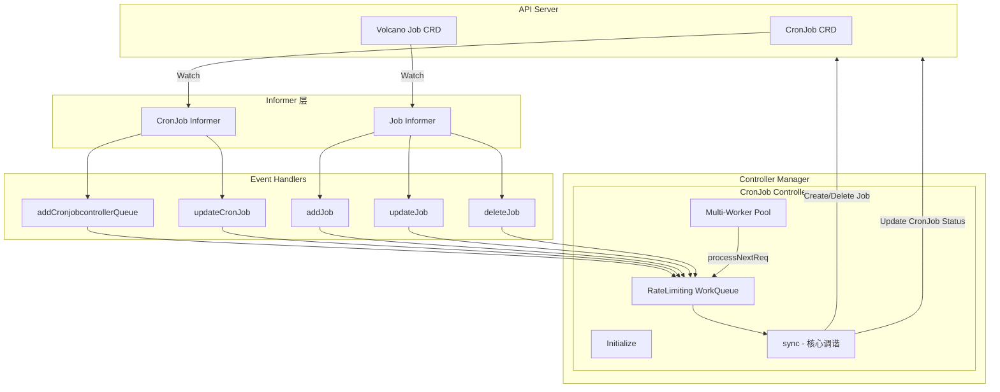
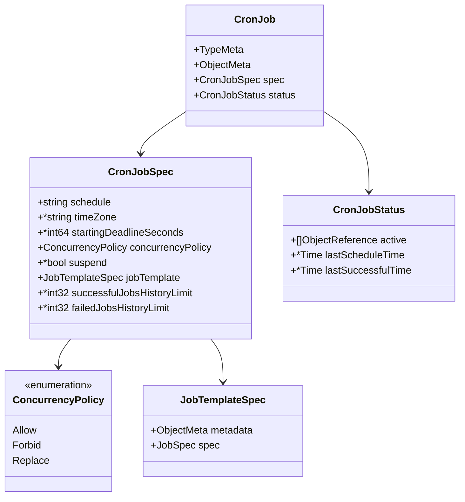
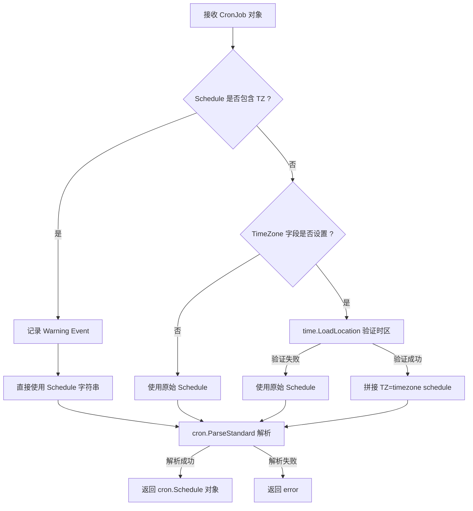
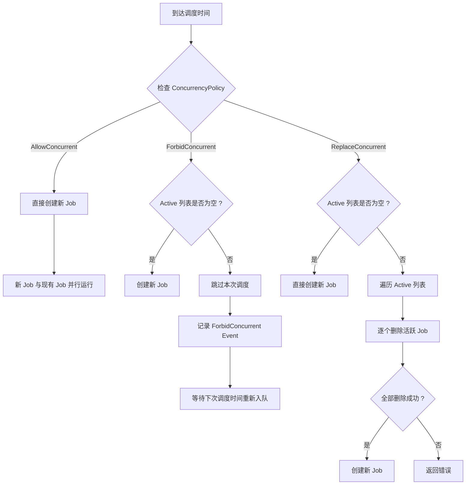
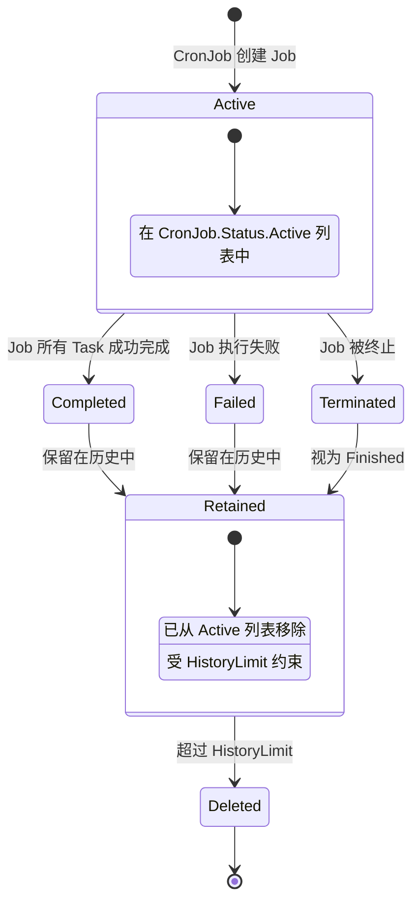
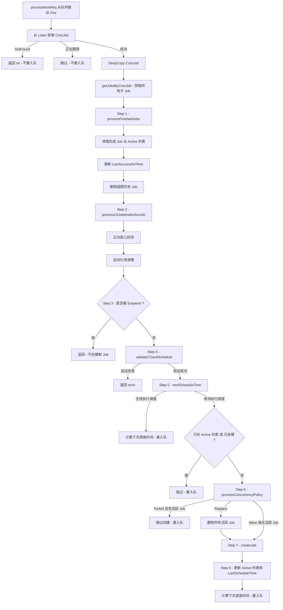
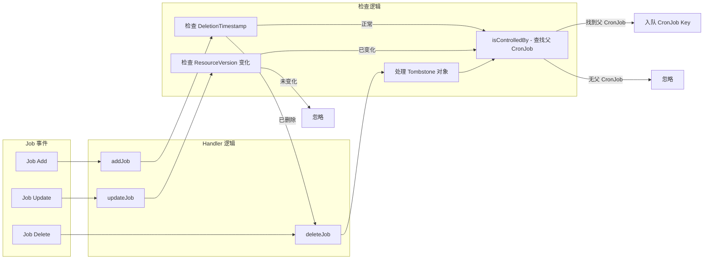

## 1. 概述与应用场景

### 1.1 什么是 CronJob Controller

CronJob Controller 是 Volcano 控制器管理器（controller-manager）中负责定时调度的核心控制器。它实现了类似于 Kubernetes 原生 CronJob 的定时任务调度能力，但专门针对 Volcano Job 进行了适配，使用户可以按照 Cron 表达式周期性地创建和管理 Volcano 批处理任务。

**源码位置**: `pkg/controllers/cronjob/`

| 文件 | 职责 |
|------|------|
| `cronjob_controller.go` | 主控制器结构体定义、初始化、Worker 循环、核心调谐逻辑 |
| `cronjob_controller_handler.go` | 事件处理函数（Job/CronJob 增删改）、Job 创建/删除、并发策略、历史管理 |
| `cronjob_controller_util.go` | 调度解析工具函数、时间计算、Active 列表操作、时区验证 |
| `injection.go` | 客户端抽象层（`cronjobClientInterface` / `jobClientInterface`），支持真实与 Fake 实现 |

### 1.2 典型应用场景

- **周期性模型训练**: 每天凌晨自动启动 AI 模型训练 Job，充分利用低峰期集群资源
- **定时数据处理**: 按小时/天/周粒度调度 Spark、Flink 等大数据批处理任务
- **定期模型评估**: 周期性运行模型推理基准测试，监控模型性能退化
- **集群维护任务**: 定时执行日志清理、数据备份等运维 Job
- **跨时区调度**: 支持 TimeZone 配置，适用于全球分布式团队的调度需求

### 1.3 与 Kubernetes CronJob 的关键差异

| 对比维度 | Kubernetes CronJob | Volcano CronJob |
|----------|-------------------|-----------------|
| 调度对象 | 原生 Pod/Job | Volcano Job（支持 Gang Scheduling） |
| 调度器 | kube-scheduler | Volcano Scheduler（支持 Fair-Share、Preemption） |
| 批处理能力 | 单 Pod 级别 | 多 Pod 协同（PodGroup） |
| Queue 支持 | 无 | 集成 Volcano Queue 体系 |
| Feature Gate | 无特殊要求 | 需启用 `CronVolcanoJobSupport` 和 `VolcanoJobSupport` |

---

## 2. 整体架构

### 2.1 架构全景



### 2.2 控制器注册机制

CronJob Controller 通过 `init()` 函数自动注册到 Volcano 控制器框架：

```go
func init() {
    framework.RegisterController(&cronjobcontroller{})
}
```

控制器实现了 `framework.Controller` 接口的三个方法：
- **`Name()`**: 返回 `"cronjob-controller"`
- **`Initialize(opt)`**: 初始化客户端、Informer、事件广播器、工作队列
- **`Run(stopCh)`**: 启动 Informer 缓存同步，随后启动多个 Worker 协程

### 2.3 Feature Gate 依赖

CronJob Controller 受两个 Feature Gate 控制：

| Feature Gate | 默认值 | 阶段 | 控制范围 |
|-------------|--------|------|---------|
| `VolcanoJobSupport` | `true` | Alpha | 注册 Job Informer，监听 Job 事件 |
| `CronVolcanoJobSupport` | `true` | Alpha | 注册 CronJob Informer，启用 CronJob 调度；在 Job 创建时附加调度时间戳注解 |

---

## 3. 核心数据结构

### 3.1 CronJob CRD 字段



### 3.2 Spec 字段详细说明

| 字段 | 类型 | 默认值 | 说明 |
|------|------|--------|------|
| `schedule` | `string` | 必填 | Cron 表达式，如 `"*/5 * * * *"` 表示每 5 分钟 |
| `timeZone` | `*string` | nil（使用控制器时区） | IANA 时区名称，如 `"Asia/Shanghai"` |
| `startingDeadlineSeconds` | `*int64` | nil | 启动截止时间（秒），超过此时间未启动的调度视为遗漏 |
| `concurrencyPolicy` | `ConcurrencyPolicy` | `"Allow"` | 并发策略：`Allow` / `Forbid` / `Replace` |
| `suspend` | `*bool` | `false` | 是否暂停后续调度（不影响已运行的 Job） |
| `jobTemplate` | `JobTemplateSpec` | 必填 | Volcano Job 模板，包含 Labels、Annotations 和 JobSpec |
| `successfulJobsHistoryLimit` | `*int32` | `3` | 保留的成功 Job 历史数量 |
| `failedJobsHistoryLimit` | `*int32` | `1` | 保留的失败 Job 历史数量 |

### 3.3 Status 字段说明

| 字段 | 类型 | 说明 |
|------|------|------|
| `active` | `[]ObjectReference` | 当前活跃（正在运行）的 Job 引用列表 |
| `lastScheduleTime` | `*metav1.Time` | 最后一次成功调度创建 Job 的时间 |
| `lastSuccessfulTime` | `*metav1.Time` | 最后一次 Job 成功完成的时间 |

### 3.4 Controller 结构体核心字段

| 字段 | 类型 | 说明 |
|------|------|------|
| `kubeClient` / `vcClient` | K8s/Volcano 客户端 | API 交互 |
| `cronjobClient` / `jobClient` | 抽象接口 | 支持 Fake 注入的 CronJob/Job 操作层 |
| `cronJobInformer` / `jobInformer` | Informer | Watch CronJob 和 Job 变更 |
| `cronJobList` / `jobLister` | Lister | 本地缓存查询 |
| `queue` | `TypedRateLimitingInterface[string]` | 限速工作队列 |
| `recorder` | `EventRecorder` | Kubernetes Event 记录 |
| `workers` | `uint32` | 并行 Worker 协程数 |
| `now` | `func() time.Time` | 可替换时间源（便于测试） |

---

## 4. Cron 调度引擎

### 4.1 调度解析流程

CronJob Controller 使用 `robfig/cron/v3` 库解析 Cron 表达式。调度解析涉及时区处理和表达式标准化两个关键步骤。



**关键设计细节**:

1. **TZ 优先级**: 如果 `Schedule` 字段已包含 `TZ=` 或 `CRON_TZ=` 前缀，则忽略 `TimeZone` 字段，同时记录 Warning 事件提醒用户这种用法非官方支持。

2. **时区验证**: `validateTZandSchedule()` 函数在调谐循环中执行双重验证 -- 先通过 `time.LoadLocation()` 验证时区有效性，再通过 `cron.ParseStandard()` 验证整体表达式。

3. **`formatSchedule()` 函数**负责将 TimeZone 和 Schedule 拼接为 `robfig/cron` 可识别的 `TZ=timezone schedule` 格式。

### 4.2 下次调度时间计算

下次调度时间的计算是 CronJob Controller 最复杂的逻辑之一，由 `mostRecentScheduleTime()` 和 `nextScheduleTime()` 两个函数协作完成。

**`mostRecentScheduleTime()` 核心算法**:

1. 确定 `earliestTime`：取 `LastScheduleTime`（如有）或 CronJob 创建时间
2. 如果设置了 `StartingDeadlineSeconds`，将 `earliestTime` 向前推进到截止窗口内
3. 计算 `t1 = schedule.Next(earliestTime)` 和 `t2 = schedule.Next(t1)`
4. 如果当前时间在 `t1` 之前，表示没有遗漏调度
5. 如果当前时间在 `t1` 和 `t2` 之间，返回 `t1` 作为应调度时间
6. 否则，计算遗漏次数并找到最近的调度时间点

**遗漏调度分级处理**:

| 遗漏类型 | 阈值 | 处理方式 |
|----------|------|---------|
| `noneMissed` | 0 | 正常调度 |
| `fewMissed` | 1-100 | 正常调度，执行最近一次遗漏的 |
| `manyMissed` | >100 | 记录 `TooManyMissedTimes` Warning Event，仍执行最近一次 |

### 4.3 重入队时间计算

`nextScheduleTimeDuration()` 计算 Worker 处理完当前调度后，应在多久后重新入队以触发下一次调度：

```
requeueDuration = schedule.Next(mostRecentTime) + 100ms - now
```

其中 `100ms` 是 NTP 时间偏移补偿（`nextScheduleDelta`），确保在网络时间协议导致的轻微时钟漂移下仍能准时触发。

---

## 5. Job 创建流程

### 5.1 完整创建序列

```mermaid
sequenceDiagram
    participant Sync as syncCronJob
    participant Create as createJob
    participant Tmpl as getJobFromTemplate
    participant Client as jobClient
    participant API as API Server

    Sync->>Sync: 计算 scheduledTime
    Sync->>Sync: 检查 Active 列表 - 防止重复
    Sync->>Sync: 检查 ConcurrencyPolicy
    Sync->>Create: createJob(cronJob, scheduledTime)
    Create->>Tmpl: getJobFromTemplate(cronJob, scheduledTime)
    Tmpl->>Tmpl: 生成确定性名称 cronJobName-timestampInMinutes
    Tmpl->>Tmpl: 复制 Labels 和 Annotations
    Tmpl->>Tmpl: 设置 OwnerReference
    Note over Tmpl: 如果 CronVolcanoJobSupport 启用<br/>附加 scheduled-timestamp 注解
    Tmpl-->>Create: 返回 Job 对象
    Create->>Client: CreateJobClient(vcClient, ns, job)
    Client->>API: POST /apis/batch.volcano.sh/v1alpha1/jobs

    alt 创建成功
        API-->>Client: 返回新 Job
        Client-->>Create: job, nil
        Create->>Create: 验证 OwnerReference
        Create-->>Sync: 返回 Job
        Sync->>Sync: 添加到 Active 列表
        Sync->>Sync: 更新 LastScheduleTime
    else AlreadyExists
        API-->>Client: 409 Conflict
        Client-->>Create: nil, AlreadyExists
        Create->>Client: GetJobClient - 获取已存在的 Job
        Create->>Create: 检查 Owner 是否匹配
        Create-->>Sync: 返回已存在的 Job 或 nil
    else 其他错误
        API-->>Client: error
        Client-->>Create: nil, err
        Create-->>Sync: nil, err
    end
```

### 5.2 确定性命名策略

Job 名称的生成采用确定性算法，确保同一调度时间点的 Job 名称唯一且可预测：

```go
func getJobName(cj *batchv1.CronJob, scheduleTime time.Time) string {
    return fmt.Sprintf("%s-%d", cj.Name, getTimeHashInMinutes(scheduleTime))
}

func getTimeHashInMinutes(scheduledTime time.Time) int64 {
    return scheduledTime.Unix() / 60
}
```

**命名示例**:
- CronJob 名称: `training-job`
- 调度时间: `2025-01-15T10:30:00Z`（Unix 时间戳 1736935800）
- 生成 Job 名称: `training-job-28948930`（即 1736935800 / 60）

这种确定性命名有两个重要作用：
1. **幂等性保护**: 如果控制器在创建 Job 后崩溃并重启，重新调谐时会生成相同名称，API Server 会返回 `AlreadyExists`，避免重复创建
2. **冲突检测**: 通过 `inActiveListByName()` 检查同名 Job 是否已在 Active 列表中

### 5.3 调度时间戳注解

当 `CronVolcanoJobSupport` Feature Gate 启用时，控制器会在创建的 Job 上附加调度时间戳注解：

```
volcano.sh/cronjob-scheduled-timestamp: "2025-01-15T18:30:00+08:00"
```

时间戳格式为 RFC3339，并根据 CronJob 的 TimeZone 设置进行时区转换。这为下游系统提供了精确的调度意图时间。

---

## 6. 并发策略详解

### 6.1 三种策略的决策流程



### 6.2 策略详解

**AllowConcurrent**（默认）: 不做任何并发限制，每个调度时间点都创建新 Job。`processConcurrencyPolicy()` 直接返回，不拦截。适用于各周期 Job 相互独立的场景。

**ForbidConcurrent**: 当 `Active` 列表非空时，跳过 Job 创建并记录 `ForbidConcurrent` Warning Event，等待下次调度重入队。适用于 Job 需要独占 GPU、数据集锁等资源的场景。

**ReplaceConcurrent**: 先遍历 Active 列表逐个删除运行中的 Job（通过 `deleteJobByClient()`），全部删除成功后创建新 Job；任一删除失败则返回错误，不创建新 Job。适用于只需最新调度结果的场景（如实时数据快照）。

---

## 7. 历史管理机制

### 7.1 Job 生命周期与状态转换



### 7.2 完成 Job 处理

`processFinishedJobs()` 是历史管理的核心函数，在每次调谐循环开始时执行。

**处理逻辑**:

1. **遍历所有子 Job**: 检查每个 Job 是否处于 `Completed`、`Failed` 或 `Terminated` 状态
2. **从 Active 列表移除**: 如果已完成的 Job 仍在 Active 列表中，将其移除并记录 `SawCompletedJob` Event
3. **更新 LastSuccessfulTime**: 对于成功完成的 Job，比较其完成时间与当前 `LastSuccessfulTime`，取更晚的值
4. **分类收集**: 将成功和失败的 Job 分别收集到 `successfulJobs` 和 `failedJobs` 列表
5. **清理超限历史**: 调用 `removeOldestJobs()` 按创建时间排序，删除超出限制的最老 Job

**Job 完成状态判定**: `isJobFinished()` 检查 Job Phase 是否为 `Completed`、`Failed` 或 `Terminated`。

### 7.3 历史清理算法

`removeOldestJobs()` 实现按时间排序的淘汰机制：

```
numToDelete = len(jobs) - maxJobs
if numToDelete > 0:
    sort(jobs, by CreationTimestamp ASC)
    delete jobs[0..numToDelete-1]
```

排序采用自定义比较器 `byJobCreationTimestamp`，规则为：
1. 零时间戳的 Job 排在非零时间戳之后（视为最新的）
2. 时间戳相同时按名称字典序排序
3. 否则按时间戳升序排序

**默认保留数量**:
- 成功 Job: `SuccessfulJobsHistoryLimit = 3`
- 失败 Job: `FailedJobsHistoryLimit = 1`

设置为 `0` 表示不保留任何历史 Job，完成后立即删除。

---

## 8. 孤儿检测与清理

在分布式系统中，控制器重启、API Server 延迟、UID 不匹配或外部手动删除都可能导致 Active 列表与实际 Job 状态不一致。

### 8.1 检测与处理流程

`processCtlJobAndActiveJob()` 执行双向一致性检查：

**正向检查 -- 受控 Job -> Active 列表**:

```
对于每个 OwnerReference 指向 CronJob 的 Job:
    如果 Job 不在 Active 列表中 且 未完成:
        从 API Server 获取最新 CronJob
        如果最新 CronJob 的 Active 列表包含该 Job:
            使用最新 CronJob 继续（缓存滞后）
        否则:
            记录 "OrphanedJob" Warning Event
```

**反向检查 -- Active 列表 -> 受控 Job**:

```
对于 Active 列表中的每个引用:
    如果该引用不在受控 Job 集合中:
        尝试通过 Lister 获取 Job:
            - NotFound: 记录 "StaleReference" Event，从 Active 列表移除
            - UID 不匹配: 记录 "StaleReference" Event，从 Active 列表移除
            - 其他错误: 返回错误
```

---

## 9. 核心调谐循环

### 9.1 完整调谐流程



### 9.2 入队与重入队机制

CronJob Controller 的入队策略根据场景不同而变化：

| 场景 | 入队方式 | 说明 |
|------|---------|------|
| CronJob Add/Delete | `queue.Add(key)` | 立即入队 |
| CronJob Update（Schedule 未变） | `queue.Add(key)` | 立即入队 |
| CronJob Update（Schedule 变更） | `queue.AddAfter(key, duration)` | 按新 Schedule 计算延迟入队 |
| Job Add/Update/Delete | `queue.Add(key)` | 对应 CronJob 立即入队 |
| 调谐成功 | `queue.AddAfter(key, requeueAfter)` | 延迟到下次调度时间入队 |
| 调谐失败 | `queue.AddRateLimited(key)` | 指数退避重试 |

### 9.3 Worker 处理循环

`processNextReq()` 从队列取出 Key 后调用 `sync()`。如果返回 error 则通过 `AddRateLimited` 指数退避重试；如果返回 `requeueAfter` 则先调用 `Forget(key)` 清除退避记录，再用 `AddAfter` 精确延迟重入队。

---

## 10. 事件处理与 Kubernetes Events

### 10.1 Job 事件处理



**`isControlledBy()` 方法**通过 OwnerReference 关联 Job 与 CronJob -- 验证 APIVersion/Kind 匹配 `batch.volcano.sh/v1alpha1 CronJob`，并通过 Lister 确认 UID 一致。

**CronJob 事件处理**: Add/Delete 立即入队；Update 时如果 Schedule 或 TimeZone 变化，按新 Schedule 计算延迟入队，否则立即入队。

### 10.2 Kubernetes Events 汇总

| Event Reason | 类型 | 触发条件 |
|-------------|------|---------|
| `SawCompletedJob` | Normal | 检测到 Active 列表中的 Job 已完成 |
| `SuccessfulCreate` / `SuccessfulDelete` | Normal | 成功创建/删除 Job |
| `FailedCreate` / `FailedDelete` / `FailedGet` | Warning | Job 操作失败 |
| `ForbidConcurrent` / `ReplaceConcurrent` | Warning | 并发策略生效 |
| `OrphanedJob` / `StaleReference` / `ForeignJob` | Warning | 孤儿检测相关 |
| `TooManyMissedTimes` | Warning | 遗漏调度超过 100 次 |
| `UnsupportedSchedule` / `UnParseableCronJobSchedule` | Warning | Schedule 问题 |
| `InvalidTimeZone` / `InvalidSchedule` | Warning | 时区或调度验证失败 |
| `NamespaceTerminating` | Warning | Namespace 正在删除 |

---

## 11. 使用示例

### 11.1 每小时 GPU 训练任务（Forbid 并发）

```yaml
apiVersion: batch.volcano.sh/v1alpha1
kind: CronJob
metadata:
  name: hourly-training
  namespace: ml-workloads
spec:
  schedule: "0 * * * *"
  concurrencyPolicy: Forbid
  successfulJobsHistoryLimit: 5
  failedJobsHistoryLimit: 3
  jobTemplate:
    spec:
      minAvailable: 2
      schedulerName: volcano
      queue: training-queue
      tasks:
        - replicas: 2
          name: trainer
          template:
            spec:
              containers:
                - name: pytorch-trainer
                  image: pytorch/pytorch:latest
                  command: ["python", "train.py"]
                  resources:
                    requests:
                      nvidia.com/gpu: 1
              restartPolicy: OnFailure
```

### 11.2 跨时区每日 ETL（Replace 并发 + StartingDeadline）

```yaml
apiVersion: batch.volcano.sh/v1alpha1
kind: CronJob
metadata:
  name: daily-etl
  namespace: data-pipeline
spec:
  schedule: "30 2 * * *"
  timeZone: "Asia/Shanghai"
  startingDeadlineSeconds: 3600
  concurrencyPolicy: Replace
  successfulJobsHistoryLimit: 7
  failedJobsHistoryLimit: 3
  jobTemplate:
    spec:
      minAvailable: 1
      schedulerName: volcano
      queue: etl-queue
      tasks:
        - replicas: 1
          name: spark-driver
          template:
            spec:
              containers:
                - name: spark
                  image: spark:3.5
                  command: ["spark-submit", "--master", "k8s://", "etl-job.py"]
              restartPolicy: Never
```

### 11.3 常用运维命令

```bash
kubectl get cronvcjob -n ml-workloads              # 列出 CronJob
kubectl describe cronvcjob hourly-training -n ml-workloads  # 查看详细状态
kubectl get events -n ml-workloads \
  --field-selector involvedObject.name=hourly-training      # 查看事件
```

暂停调度只需设置 `spec.suspend: true`，不影响已运行的 Job。

---

## 12. 源码文件索引

| 文件路径 | 核心内容 |
|----------|---------|
| `pkg/controllers/cronjob/cronjob_controller.go` | 控制器结构体、初始化、Worker 循环、`sync()`、`syncCronJob()` |
| `pkg/controllers/cronjob/cronjob_controller_handler.go` | 事件处理、Job CRUD、`processFinishedJobs()`、`processCtlJobAndActiveJob()`、`processConcurrencyPolicy()` |
| `pkg/controllers/cronjob/cronjob_controller_util.go` | `formatSchedule()`、`mostRecentScheduleTime()`、`nextScheduleTime()`、Active 列表操作、`getJobFromTemplate()` |
| `pkg/controllers/cronjob/injection.go` | `cronjobClientInterface` / `jobClientInterface` 抽象层及 Fake 实现 |
| `staging/src/volcano.sh/apis/pkg/apis/batch/v1alpha1/job.go` | `CronJob`、`CronJobSpec`、`CronJobStatus`、`ConcurrencyPolicy` 类型定义 |
| `staging/src/volcano.sh/apis/pkg/apis/batch/v1alpha1/labels.go` | `CronJobScheduledTimestampAnnotation` 注解常量 |
| `pkg/features/volcano_features.go` | `VolcanoJobSupport`、`CronVolcanoJobSupport` Feature Gate 定义 |
