## 1. 概述

### 1.1 HyperNode Controller 的职责与定位

HyperNode Controller 是 Volcano 控制器管理器中负责**网络拓扑发现与管理**的核心控制器。它的主要职责是自动发现集群中的网络拓扑结构，并将发现结果以 HyperNode CRD 的形式持久化到 Kubernetes API Server 中，供调度器在进行拓扑感知调度时使用。

HyperNode 是 Volcano 引入的一个关键抽象概念，它代表一组**共享相似网络拓扑或性能特征的节点集合**。通过 HyperNode 的层级结构（Tier），可以精确描述数据中心中从交换机到机架、从机架到集群的完整网络拓扑关系。

### 1.2 网络拓扑发现的重要性

在 AI/HPC 集群中，网络拓扑对计算性能有着决定性的影响：

- **分布式训练场景**：多 GPU 之间的通信延迟直接影响模型训练的吞吐量。同一 ToR（Top of Rack）交换机下的节点之间通信延迟远低于跨机架通信。
- **高性能计算场景**：MPI 等并行计算框架对节点间的带宽和延迟非常敏感，合理的拓扑感知调度可以显著提升计算效率。
- **InfiniBand/RoCE 网络**：在 RDMA 网络环境中，交换机层级关系直接决定了节点间的通信路径和性能。

HyperNode Controller 通过自动化的拓扑发现机制，消除了人工维护拓扑信息的运维负担，使调度器能够基于实时的网络拓扑信息做出最优调度决策。

### 1.3 Controller 在 Volcano 系统中的位置

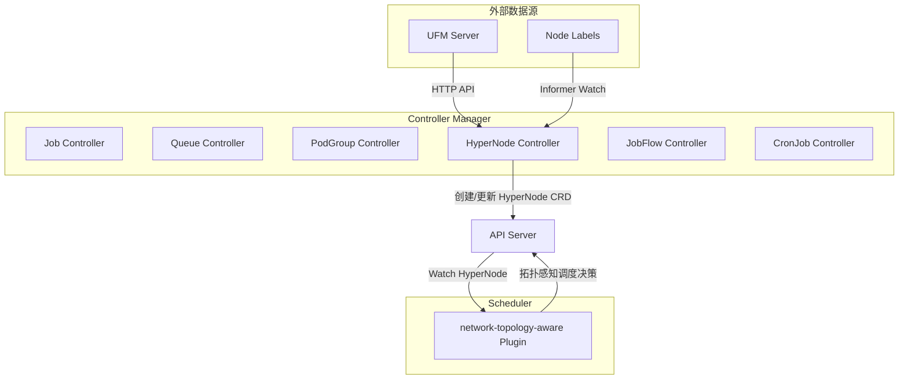

HyperNode Controller 作为 Controller Manager 的一个子控制器运行，与 Job Controller、Queue Controller 等平行。它生成的 HyperNode 资源被调度器的 `network-topology-aware` 插件消费，实现拓扑感知的 Pod 调度。

---

## 2. 核心架构

### 2.1 整体架构图

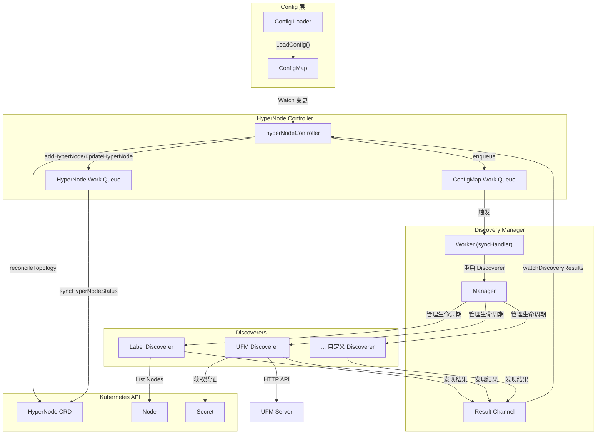

### 2.2 组件列表与职责

| 组件 | 源码路径 | 职责 |
|------|----------|------|
| `hyperNodeController` | `pkg/controllers/hypernode/hypernode_controller.go` | 主控制器，协调所有子组件的生命周期 |
| `Discovery Manager` | `pkg/controllers/hypernode/discovery/manager.go` | 管理所有 Discoverer 的启停和结果收集 |
| `Label Discoverer` | `pkg/controllers/hypernode/discovery/label/label.go` | 基于 Node Label 的拓扑发现 |
| `UFM Discoverer` | `pkg/controllers/hypernode/discovery/ufm/ufm.go` | 基于 UFM API 的 InfiniBand 拓扑发现 |
| `Config Loader` | `pkg/controllers/hypernode/config/loader.go` | 从 ConfigMap 加载拓扑发现配置 |
| `Discoverer Registry` | `pkg/controllers/hypernode/api/interface.go` | 可插拔的 Discoverer 注册表 |
| `Utils` | `pkg/controllers/hypernode/utils/utils.go` | HyperNode CRUD 工具函数 |

---

## 3. Controller 初始化与生命周期

### 3.1 注册方式

HyperNode Controller 通过 Go 的 `init()` 函数自动注册到 Volcano 的控制器框架中：

```go
// pkg/controllers/hypernode/hypernode_controller.go
func init() {
    framework.RegisterController(&hyperNodeController{})
}

const (
    name = "hyperNode-controller"
)
```

控制器名称为 `"hyperNode-controller"`，在 Controller Manager 启动时被自动发现并初始化。

### 3.2 Initialize 方法详解

`Initialize` 方法负责完成控制器的全部初始化工作，包括客户端设置、Informer 创建、Work Queue 初始化和事件处理器注册。

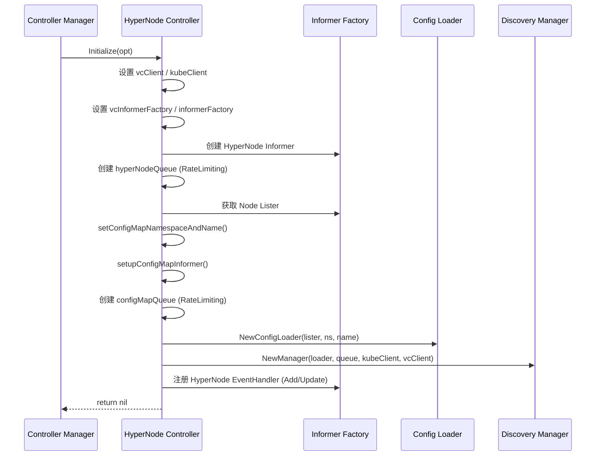

关键初始化步骤：

1. **客户端与 Informer 设置**：从 `ControllerOption` 获取 Volcano 客户端 (`vcClient`) 和 Kubernetes 客户端 (`kubeClient`) 以及对应的 SharedInformerFactory。
2. **HyperNode Informer**：创建 HyperNode 的 Informer 和 Lister，用于监听 HyperNode 资源变更。
3. **Work Queue**：创建两个 `TypedRateLimitingInterface[string]` 类型的队列 -- `hyperNodeQueue` 用于处理 HyperNode 状态同步，`configMapQueue` 用于处理配置变更。
4. **ConfigMap 监听**：通过 `setConfigMapNamespaceAndName()` 确定要监听的 ConfigMap 名称和命名空间，然后通过 `setupConfigMapInformer()` 创建带过滤器的 ConfigMap Informer。
5. **Discovery Manager 创建**：将 Config Loader、ConfigMap Queue、两个客户端传入 `NewManager()` 创建 Discovery Manager 实例。
6. **事件处理器**：为 HyperNode Informer 注册 `addHyperNode` 和 `updateHyperNode` 事件处理器。

### 3.3 Run 方法 - 控制器主循环

```go
// pkg/controllers/hypernode/hypernode_controller.go
func (hn *hyperNodeController) Run(stopCh <-chan struct{}) {
    hn.vcInformerFactory.Start(stopCh)
    hn.informerFactory.Start(stopCh)
    // 等待缓存同步...
    hn.discoveryManager.Start()
    go hn.watchDiscoveryResults()
    go hn.processHyperNodeQueue()
    <-stopCh
    hn.discoveryManager.Stop()
    hn.hyperNodeQueue.ShutDown()
}
```

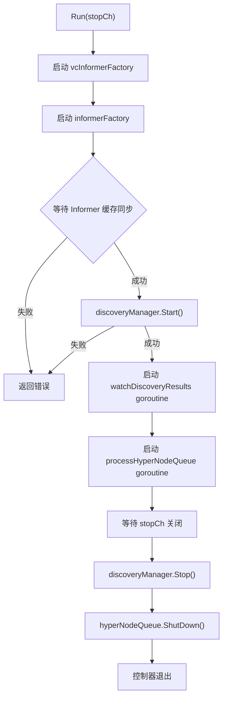

Run 方法的执行流程：

1. **启动 Informer Factories**：依次启动 Volcano 和 Kubernetes 的 SharedInformerFactory。
2. **等待缓存同步**：确保所有 Informer 的本地缓存与 API Server 同步完成。如果任何 Informer 同步失败，控制器会直接返回。
3. **启动 Discovery Manager**：初始化配置加载并启动内部 Worker。
4. **启动监听 goroutine**：`watchDiscoveryResults` 负责从 Discovery Manager 的结果通道中读取发现结果并执行拓扑协调。
5. **启动 HyperNode 队列处理**：`processHyperNodeQueue` 负责处理 HyperNode 状态同步事件。
6. **优雅退出**：当 `stopCh` 关闭时，依次停止 Discovery Manager 和关闭 Work Queue。

---

## 4. 网络拓扑发现机制

### 4.1 Discovery Manager

Discovery Manager 是拓扑发现机制的核心调度器，负责管理所有 Discoverer 的生命周期，并将发现结果统一汇聚到一个通道中。

**源码路径**：`pkg/controllers/hypernode/discovery/manager.go`

#### Manager 接口定义

```go
type Manager interface {
    Start() error
    Stop()
    ResultChannel() <-chan Result
    ResultSynced(source string)
}
```

| 方法 | 说明 |
|------|------|
| `Start()` | 初始化配置，启动内部 Worker goroutine |
| `Stop()` | 关闭 stopCh，停止所有 Discoverer |
| `ResultChannel()` | 返回只读的结果通道 |
| `ResultSynced(source)` | 通知指定 source 的 Discoverer 其结果已被处理 |

#### Result 结构体

```go
type Result struct {
    HyperNodes []*topologyv1alpha1.HyperNode
    Source     string
}
```

`Result` 包含发现到的 HyperNode 列表以及发现来源标识（如 `"label"` 或 `"ufm"`）。

#### Manager 工作流

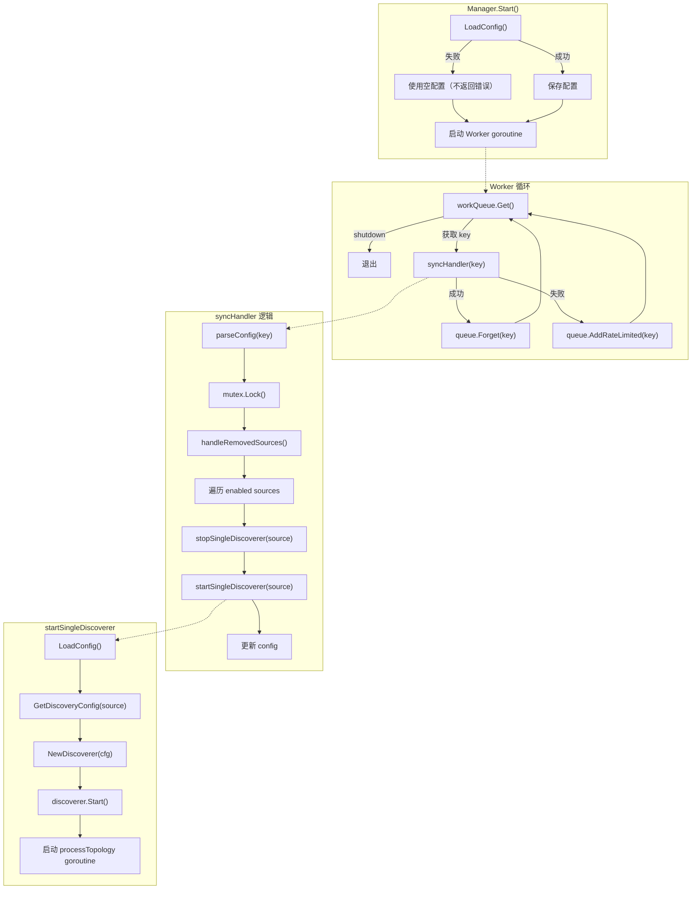

**关键设计决策**：

- **初始加载失败不阻塞**：`Start()` 中如果 ConfigMap 尚未创建，不会返回错误，而是使用空配置。这保证了 Controller 可以正常启动，等待后续 ConfigMap 被创建时再触发发现。
- **动态配置更新**：当 ConfigMap 变更时，通过 `configMapQueue` 触发 `syncHandler`，后者会对比新旧配置，停止已移除的 Discoverer，重启已变更的 Discoverer。
- **结果汇聚**：每个 Discoverer 有自己的输出通道，`processTopology` goroutine 将其转发到统一的 `resultCh`。

### 4.2 Label-Based Discovery (Label Discoverer)

**源码路径**：`pkg/controllers/hypernode/discovery/label/label.go`

Label Discoverer 是基于 Kubernetes Node Label 的拓扑发现器。它通过读取集群中节点的标签信息来推断网络拓扑层级关系。

#### 配置格式

```yaml
networkTopologyDiscovery:
  - source: label
    enabled: true
    config:
      networkTopologyTypes:
        topologyA2:
          - nodeLabel: "volcano.sh/tor"
          - nodeLabel: "kubernetes.io/hostname"
        topologyA3:
          - nodeLabel: "volcano.sh/hypercluster"
          - nodeLabel: "volcano.sh/hypernode"
          - nodeLabel: "kubernetes.io/hostname"
```

配置中，`networkTopologyTypes` 定义了多种拓扑类型。每种类型包含一个有序的 Label 列表，从最高层级到最低层级排列。最后一项 `kubernetes.io/hostname` 代表单个节点层级，在解析时被自动跳过（因为它对应 Tier 1 的单节点 HyperNode）。

#### 发现流程

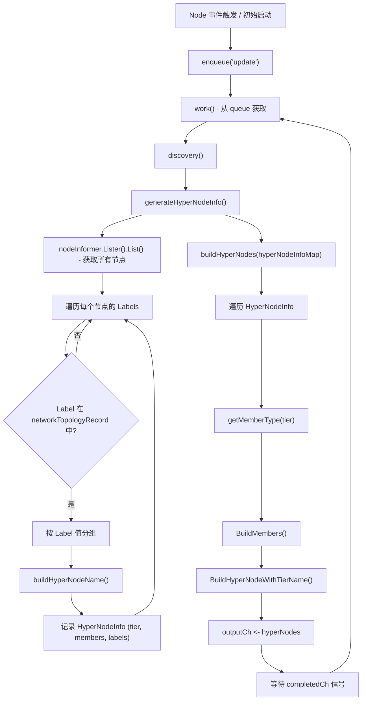

#### generateHyperNodeInfo() 核心逻辑

此函数是 Label Discoverer 的核心，负责从节点标签生成 HyperNode 层级信息：

1. **列出所有节点**：通过 Node Informer 的 Lister 获取集群中所有节点。
2. **遍历拓扑类型**：对每种配置的拓扑类型（如 `topologyA2`、`topologyA3`），检查节点上是否存在对应的 Label。
3. **按 Label 值分组**：具有相同 Label 值的节点被归入同一个 HyperNode。例如，所有 `volcano.sh/tor=switch-01` 的节点被归入一个 Tier 1 的 HyperNode。
4. **构建层级关系**：Tier 1 的 HyperNode 包含实际节点（`MemberTypeNode`），Tier N (N > 1) 的 HyperNode 包含低层级的 HyperNode（`MemberTypeHyperNode`）。

#### buildHyperNodeName() 命名策略

```go
func (l *labelDiscoverer) buildHyperNodeName(topologyTypeName, key, value string, tier int,
    hyperNodeInfoMap map[string]HyperNodeInfo) (string, error)
```

命名策略遵循以下优先级：

1. **复用现有名称**：首先查询 API Server 中是否存在具有相同 Label (`key=value`) 和 source (`label`) 的 HyperNode。如果找到前缀匹配 `hypernode-{type}-tier{N}` 的现有 HyperNode，直接复用其名称。
2. **生成新名称**：如果不存在匹配的 HyperNode，则生成格式为 `hypernode-{type}-tier{N}-{random5}` 的新名称。为避免名称冲突，最多尝试 20 次随机生成。

#### Tier 层级说明

| Tier | MemberType | 含义 |
|------|------------|------|
| Tier 1 | `Node` | 直接包含物理节点，对应最低层级的网络分组（如同一 ToR 交换机下的节点） |
| Tier 2 | `HyperNode` | 包含 Tier 1 的 HyperNode，对应更高层级的网络分组（如同一 Spine 交换机下的机架组） |
| Tier N | `HyperNode` | 更高层级的聚合 |

### 4.3 UFM Discovery (UFM Discoverer)

**源码路径**：`pkg/controllers/hypernode/discovery/ufm/ufm.go`

UFM (Unified Fabric Manager) Discoverer 通过调用 NVIDIA UFM 的 REST API 来自动发现 InfiniBand 网络中的拓扑结构。

#### UFM 概念

UFM 是 NVIDIA 提供的 InfiniBand 网络管理平台，能够管理和监控整个 InfiniBand Fabric。通过其 REST API，可以获取网络中所有端口的连接信息，包括交换机与计算节点之间的连接关系。

#### HTTP API 调用

```go
const ufmPortsPath = "/ufmRest/resources/ports"
```

UFM Discoverer 通过 `GET {endpoint}/ufmRest/resources/ports` 接口获取所有端口信息。请求使用 HTTP Basic Auth 进行身份验证。

#### Secret 凭证获取

UFM 的用户名和密码存储在 Kubernetes Secret 中，通过配置中的 `credentials.secretRef` 指定：

```go
func (u *ufmDiscoverer) getCredentialsFromSecret(name, namespace string) (string, string, error) {
    secret, err := u.kubeClient.CoreV1().Secrets(namespace).Get(
        context.TODO(), name, metav1.GetOptions{})
    // 从 secret.Data 中提取 "username" 和 "password"
}
```

#### UFMInterface 数据结构

```go
type UFMInterface struct {
    Description     string `json:"description"`
    Tier            int    `json:"tier"`
    SystemName      string `json:"system_name"`
    PeerNodeName    string `json:"peer_node_name"`
    NodeDescription string `json:"node_description"`
}
```

| 字段 | 含义 |
|------|------|
| `Description` | 端口描述，包含设备类型信息（如 "Computer"） |
| `Tier` | 交换机的层级 |
| `SystemName` | 连接到此端口的系统名称（计算节点名） |
| `PeerNodeName` | 对端交换机名称（叶交换机名） |

#### BFS 分组算法

UFM Discoverer 使用 BFS（广度优先搜索）算法来将共享计算节点的叶交换机分组为连通分量：

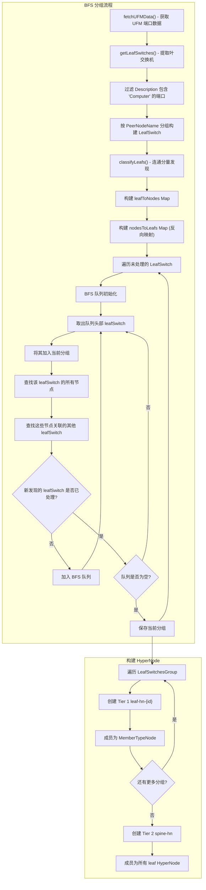

**连通分量发现算法详解** (`classifyLeafs`)：

该算法的核心思想是：如果两个叶交换机连接了同一个计算节点（即一个节点有多个 InfiniBand 端口分别连接到不同交换机），则这两个叶交换机属于同一个分组。

1. 构建**叶交换机到节点**的映射 (`leafToNodes`)
2. 构建**节点到叶交换机**的反向映射 (`nodesToLeafs`)
3. 对每个未处理的叶交换机，使用 BFS 遍历所有通过共享节点相互关联的叶交换机
4. 每一轮 BFS 得到一个连通分量，即一个 `LeafSwitchesGroup`

#### 定期发现

UFM Discoverer 支持配置化的定期发现间隔：

```go
func (u *ufmDiscoverer) periodicDiscovery(outputCh chan []*topologyv1alpha1.HyperNode) {
    u.discoverAndSend(outputCh)  // 立即执行一次
    ticker := time.NewTicker(u.discoveryInterval)
    defer ticker.Stop()
    for {
        select {
        case <-ticker.C:
            u.discoverAndSend(outputCh)
        case <-u.stopCh:
            close(outputCh)
            return
        }
    }
}
```

默认间隔为 `DefaultDiscoveryInterval`（1 小时），可通过配置 `interval` 字段自定义。

---

## 5. 可插拔发现器架构

### 5.1 Discoverer 接口

**源码路径**：`pkg/controllers/hypernode/api/interface.go`

```go
type Discoverer interface {
    Start() (chan []*topologyv1alpha1.HyperNode, error)
    Stop() error
    Name() string
    ResultSynced()
}
```

| 方法 | 说明 |
|------|------|
| `Start()` | 启动发现过程，返回一个输出通道用于发送发现结果 |
| `Stop()` | 停止发现过程，关闭输出通道 |
| `Name()` | 返回 Discoverer 的唯一标识，用于 HyperNode 的 source Label |
| `ResultSynced()` | Manager 在完成结果处理后调用此方法通知 Discoverer |

### 5.2 注册表模式

```go
type DiscovererConstructor func(cfg DiscoveryConfig, kubeClient clientset.Interface,
    vcClient vcclientset.Interface) Discoverer

var discovererRegistry = make(map[string]DiscovererConstructor)

func RegisterDiscoverer(source string, constructor DiscovererConstructor) {
    mutex.Lock()
    defer mutex.Unlock()
    discovererRegistry[source] = constructor
}

func NewDiscoverer(cfg DiscoveryConfig, kubeClient clientset.Interface,
    vcClient vcclientset.Interface) (Discoverer, error) {
    constructor, exists := discovererRegistry[cfg.Source]
    if !exists {
        return nil, fmt.Errorf("unsupported discoverer type: %s", cfg.Source)
    }
    return constructor(cfg, kubeClient, vcClient), nil
}
```

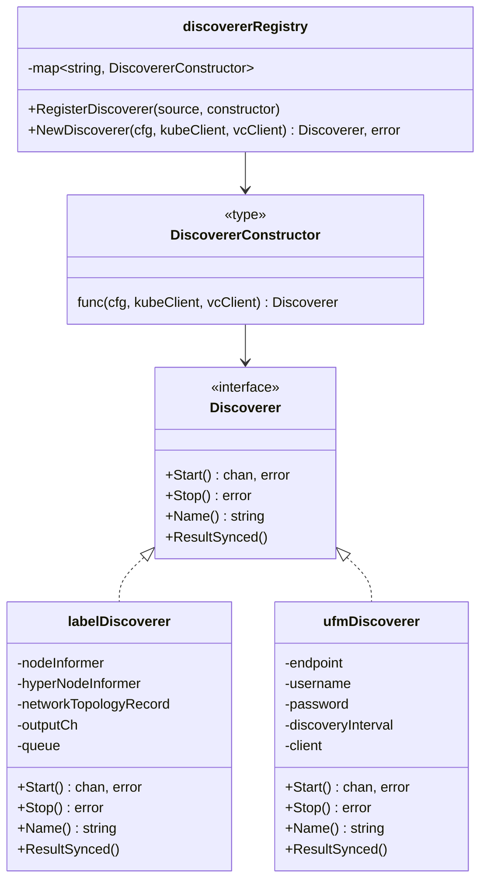

### 5.3 DiscoveryConfig 结构

```go
type DiscoveryConfig struct {
    Source      string                 `json:"source" yaml:"source"`
    Enabled     bool                   `json:"enabled" yaml:"enabled"`
    Interval    time.Duration          `json:"interval" yaml:"interval"`
    Credentials *Credentials           `json:"credentials" yaml:"credentials"`
    Config      map[string]interface{} `json:"config" yaml:"config"`
}
```

| 字段 | 类型 | 说明 |
|------|------|------|
| `Source` | `string` | 发现源标识，如 `"label"`、`"ufm"` |
| `Enabled` | `bool` | 是否启用此发现源 |
| `Interval` | `time.Duration` | 发现间隔，默认为 1 小时 |
| `Credentials` | `*Credentials` | 凭证信息，引用 Kubernetes Secret |
| `Config` | `map[string]interface{}` | 特定于发现源的自定义配置 |

### 5.4 如何添加自定义发现器

添加一个新的 Discoverer 需要以下步骤：

1. **创建新 package**：在 `pkg/controllers/hypernode/discovery/` 下创建新目录。
2. **实现 Discoverer 接口**：实现 `Start()`、`Stop()`、`Name()`、`ResultSynced()` 四个方法。
3. **注册 Discoverer**：在 `init()` 函数中调用 `api.RegisterDiscoverer()`。
4. **导入 package**：在 `pkg/controllers/hypernode/discovery/manager.go` 中添加匿名导入 (`_ "path/to/new/discoverer"`)。

示例代码结构：

```go
package custom

import "volcano.sh/volcano/pkg/controllers/hypernode/api"

func init() {
    api.RegisterDiscoverer("custom", NewCustomDiscoverer)
}

type customDiscoverer struct { /* ... */ }

func NewCustomDiscoverer(cfg api.DiscoveryConfig, kubeClient clientset.Interface,
    vcClient vcclientset.Interface) api.Discoverer {
    return &customDiscoverer{ /* ... */ }
}

func (c *customDiscoverer) Start() (chan []*topologyv1alpha1.HyperNode, error) { /* ... */ }
func (c *customDiscoverer) Stop() error { /* ... */ }
func (c *customDiscoverer) Name() string { return "custom" }
func (c *customDiscoverer) ResultSynced() { /* ... */ }
```

---

## 6. ConfigMap 配置管理

### 6.1 ConfigMap 命名约定

**源码路径**：`pkg/controllers/hypernode/configmap_handler.go`

ConfigMap 的命名空间和名称通过环境变量动态确定：

```go
func (hn *hyperNodeController) setConfigMapNamespaceAndName() {
    namespace := os.Getenv("KUBE_POD_NAMESPACE")     // 默认: "volcano-system"
    releaseName := os.Getenv("HELM_RELEASE_NAME")     // 默认: "volcano"
    hn.configMapNamespace = namespace
    hn.configMapName = releaseName + "-controller-configmap"
}
```

| 环境变量 | 默认值 | 说明 |
|----------|--------|------|
| `KUBE_POD_NAMESPACE` | `volcano-system` | Controller Manager 所在命名空间 |
| `HELM_RELEASE_NAME` | `volcano` | Helm Release 名称 |

最终 ConfigMap 名称格式为：`{releaseName}-controller-configmap`，如默认为 `volcano-controller-configmap`。

### 6.2 ConfigMap Informer 设置

```go
func (hn *hyperNodeController) setupConfigMapInformer() {
    filteredInformer := coreinformers.NewFilteredConfigMapInformer(
        hn.kubeClient,
        hn.configMapNamespace,
        0,
        cache.Indexers{cache.NamespaceIndex: cache.MetaNamespaceIndexFunc},
        func(options *metav1.ListOptions) {
            options.FieldSelector = fmt.Sprintf("metadata.name=%s", hn.configMapName)
        },
    )
    // ...
}
```

关键设计：使用 `NewFilteredConfigMapInformer` 并通过 `FieldSelector` 过滤，确保只 Watch 特定的 ConfigMap，避免不必要的网络和内存开销。

### 6.3 Config Loader

**源码路径**：`pkg/controllers/hypernode/config/loader.go`

```go
type Loader interface {
    LoadConfig() (*api.NetworkTopologyConfig, error)
}
```

`LoadConfig()` 的工作流程：

1. 通过 ConfigMap Lister 获取指定的 ConfigMap
2. 从 ConfigMap 的 `Data` 字段中读取 key 为 `volcano-controller.conf` 的 YAML 内容
3. 使用 `yaml.Unmarshal` 解析为 `NetworkTopologyConfig` 结构体

### 6.4 配置热更新机制

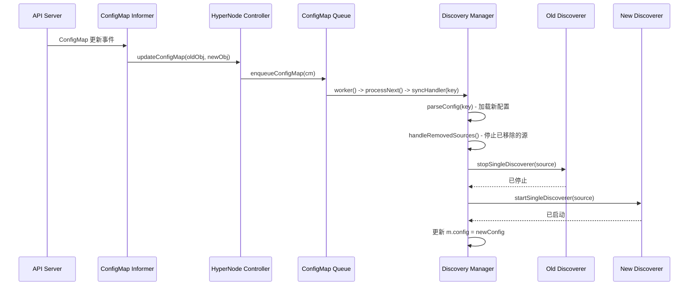

### 6.5 完整配置示例

```yaml
# volcano-controller-configmap 中的 volcano-controller.conf
networkTopologyDiscovery:
  - source: ufm
    enabled: true
    interval: 10m
    credentials:
      secretRef:
        name: ufm-credentials
        namespace: volcano-system
    config:
      endpoint: https://ufm-server:8080
      insecureSkipVerify: true
  - source: label
    enabled: true
    config:
      networkTopologyTypes:
        topologyA2:
          - nodeLabel: "volcano.sh/tor"
          - nodeLabel: "kubernetes.io/hostname"
        topologyA3:
          - nodeLabel: "volcano.sh/hypercluster"
          - nodeLabel: "volcano.sh/hypernode"
          - nodeLabel: "kubernetes.io/hostname"
```

---

## 7. HyperNode 状态同步

**源码路径**：`pkg/controllers/hypernode/hypernode_handler.go`

### 7.1 HyperNode 事件处理

当 HyperNode 资源被创建或更新时，事件处理器会将其 key 加入 `hyperNodeQueue`：

```go
func (hn *hyperNodeController) addHyperNode(obj interface{}) {
    hyperNode, ok := obj.(*topologyv1alpha1.HyperNode)
    if !ok { return }
    hn.enqueueHyperNode(hyperNode)
}

func (hn *hyperNodeController) updateHyperNode(oldObj, newObj interface{}) {
    hyperNode, ok := newObj.(*topologyv1alpha1.HyperNode)
    if !ok { return }
    hn.enqueueHyperNode(hyperNode)
}

func (hn *hyperNodeController) enqueueHyperNode(hyperNode *topologyv1alpha1.HyperNode) {
    key, err := cache.MetaNamespaceKeyFunc(hyperNode)
    if err != nil { return }
    hn.hyperNodeQueue.Add(key)
}
```

### 7.2 processHyperNodeQueue

```go
func (hn *hyperNodeController) processHyperNodeQueue() {
    for {
        key, shutdown := hn.hyperNodeQueue.Get()
        if shutdown { return }
        func() {
            defer hn.hyperNodeQueue.Done(key)
            err := hn.syncHyperNodeStatus(key)
            if err != nil {
                hn.hyperNodeQueue.AddRateLimited(key)
                return
            }
            hn.hyperNodeQueue.Forget(key)
        }()
    }
}
```

### 7.3 syncHyperNodeStatus

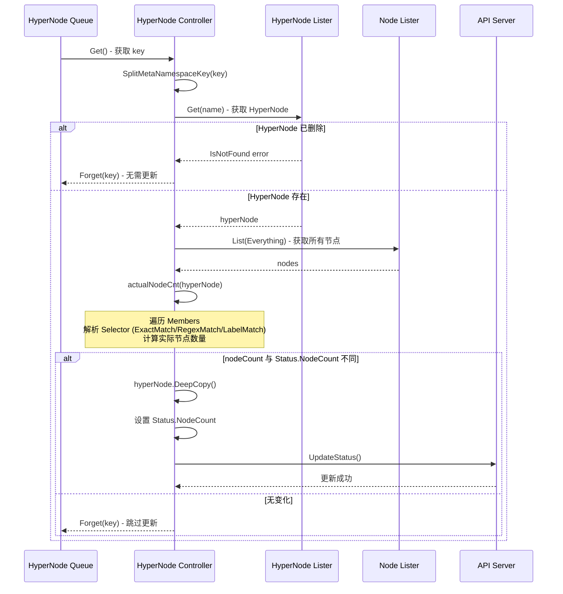

### 7.4 actualNodeCnt - 节点计数逻辑

```go
func (hn *hyperNodeController) actualNodeCnt(hyperNode *topologyv1alpha1.HyperNode) int {
    nodes, err := hn.nodeLister.List(labels.Everything())
    if err != nil { return 0 }
    members := sets.New[string]()
    for _, member := range hyperNode.Spec.Members {
        members.Insert(api.GetMembers(member.Selector, nodes).UnsortedList()...)
    }
    return len(members)
}
```

`actualNodeCnt` 调用了调度器侧的 `api.GetMembers()` 函数来解析三种 MemberSelector：

| Selector 类型 | 解析方式 |
|---------------|----------|
| `ExactMatch` | 直接将 `Name` 加入集合 |
| `RegexMatch` | 编译 `Pattern`，遍历所有节点，匹配节点名加入集合 |
| `LabelMatch` | 将 `LabelSelector` 转换为 `labels.Selector`，遍历所有节点，匹配标签的节点名加入集合 |

使用 `sets.Set[string]` 确保节点去重，最终返回唯一节点数量。

---

## 8. 拓扑协调 (Topology Reconciliation)

**源码路径**：`pkg/controllers/hypernode/hypernode_controller.go`

### 8.1 watchDiscoveryResults

```go
func (hn *hyperNodeController) watchDiscoveryResults() {
    resultCh := hn.discoveryManager.ResultChannel()
    for result := range resultCh {
        if result.HyperNodes != nil {
            hn.reconcileTopology(result.Source, result.HyperNodes)
            hn.discoveryManager.ResultSynced(result.Source)
        }
    }
}
```

此方法持续从 Discovery Manager 的结果通道中读取发现结果，并对每个结果执行拓扑协调。协调完成后通过 `ResultSynced` 通知 Discoverer。

### 8.2 reconcileTopology 详细流程

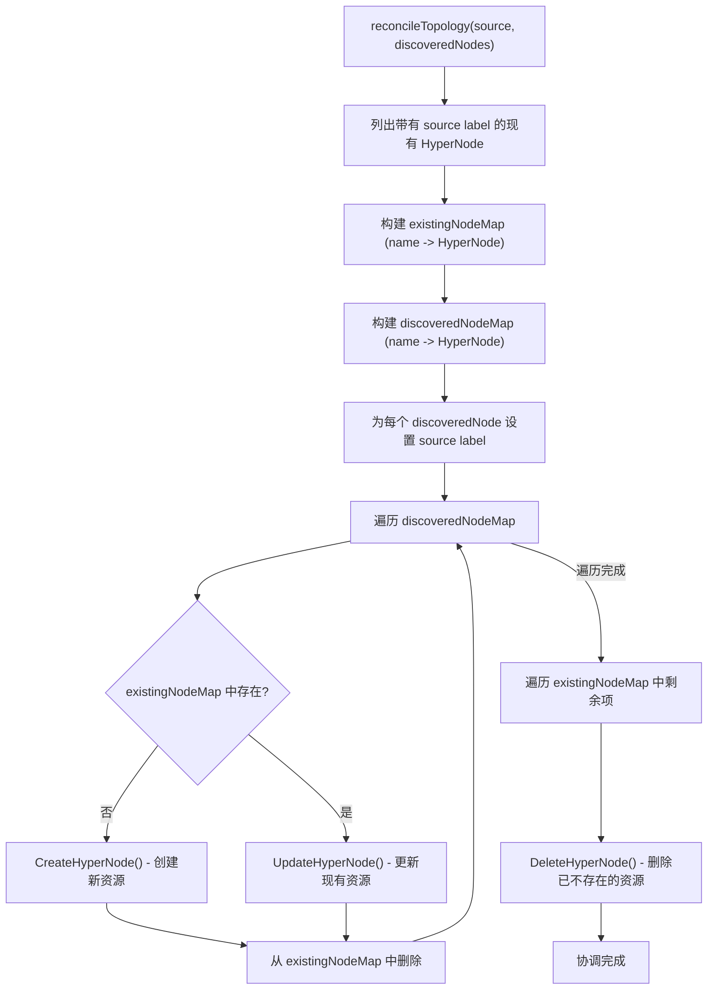

### 8.3 Source Label 管理

每个由 Discoverer 创建的 HyperNode 都会被打上 `volcano.sh/network-topology-source` Label，其值为对应的 Discoverer 名称（如 `"label"` 或 `"ufm"`）。

```go
const NetworkTopologySourceLabelKey = "volcano.sh/network-topology-source"
```

这个 Label 在协调时用于筛选特定 source 对应的 HyperNode，确保不同发现源管理各自的 HyperNode 集合，互不干扰。

### 8.4 创建/更新/删除流程

协调逻辑采用经典的**三路对比**策略：

| 场景 | 条件 | 操作 |
|------|------|------|
| **创建** | discoveredNodeMap 中存在，existingNodeMap 中不存在 | `utils.CreateHyperNode()` |
| **更新** | 两者都存在 | `utils.UpdateHyperNode()` |
| **删除** | existingNodeMap 中存在，discoveredNodeMap 中不存在 | `utils.DeleteHyperNode()` |

---

## 9. HyperNode API 类型

**源码路径**：`staging/src/volcano.sh/apis/pkg/apis/topology/v1alpha1/hypernode_types.go`

### 9.1 HyperNode CRD 结构

```go
// +genclient:nonNamespaced
// +kubebuilder:resource:path=hypernodes,shortName=hn,scope=Cluster
// +kubebuilder:subresource:status
type HyperNode struct {
    metav1.TypeMeta   `json:",inline"`
    metav1.ObjectMeta `json:"metadata,omitempty"`
    Spec              HyperNodeSpec   `json:"spec"`
    Status            HyperNodeStatus `json:"status,omitempty"`
}
```

HyperNode 是**集群级别**（非命名空间）的资源，支持 `status` 子资源。

### 9.2 HyperNodeSpec

```go
type HyperNodeSpec struct {
    Tier     int          `json:"tier,omitempty"`
    TierName string       `json:"tierName,omitempty"`
    Members  []MemberSpec `json:"members,omitempty"`
}
```

| 字段 | 类型 | 说明 |
|------|------|------|
| `Tier` | `int` | 层级编号，最小值为 0 |
| `TierName` | `string` | 层级名称，最大长度 253，如 Node Label 的 key |
| `Members` | `[]MemberSpec` | 成员列表，最少 1 个 |

### 9.3 MemberSpec 与 MemberSelector

```go
type MemberSpec struct {
    Type     MemberType     `json:"type,omitempty"`
    Selector MemberSelector `json:"selector,omitempty"`
}

type MemberSelector struct {
    ExactMatch *ExactMatch            `json:"exactMatch,omitempty"`
    RegexMatch *RegexMatch            `json:"regexMatch,omitempty"`
    LabelMatch *metav1.LabelSelector  `json:"labelMatch,omitempty"`
}
```

**MemberType 枚举**：

| 值 | 说明 |
|----|------|
| `Node` | 成员是 Kubernetes 节点 |
| `HyperNode` | 成员是另一个 HyperNode |

**MemberSelector 约束**（通过 CEL 验证规则实现）：

- 必须指定 `ExactMatch`、`RegexMatch` 或 `LabelMatch` 中的一个
- 最多只能指定其中一个（互斥）

**三种匹配模式**：

| 匹配模式 | 结构 | 示例 |
|----------|------|------|
| `ExactMatch` | `{Name: "node1"}` | 精确匹配名为 "node1" 的节点 |
| `RegexMatch` | `{Pattern: "^node-[0-9]+$"}` | 正则匹配名称符合模式的节点 |
| `LabelMatch` | `{MatchLabels: {"rack": "rack1"}}` | 标签匹配（仅对 Node 类型生效） |

### 9.4 HyperNodeStatus

```go
type HyperNodeStatus struct {
    Conditions []metav1.Condition `json:"conditions,omitempty"`
    NodeCount  int64              `json:"nodeCount,omitempty"`
}
```

| 字段 | 说明 |
|------|------|
| `Conditions` | 标准的 Kubernetes Condition 列表 |
| `NodeCount` | 当前 HyperNode 中的实际节点数量（由 Controller 计算并更新） |

---

## 10. 工具函数

**源码路径**：`pkg/controllers/hypernode/utils/utils.go`

### 10.1 CRUD 操作

```go
func CreateHyperNode(vcClient vcclientset.Interface, node *topologyv1alpha1.HyperNode) error
func UpdateHyperNode(vcClient vcclientset.Interface, lister v1alpha1.HyperNodeLister,
    updated *topologyv1alpha1.HyperNode) error
func DeleteHyperNode(vcClient vcclientset.Interface, name string) error
```

**CreateHyperNode**：使用 `retry.RetryOnConflict` 包装创建操作，在遇到冲突时自动重试。

**UpdateHyperNode**：更新流程更为复杂：
1. 通过 Lister 获取当前最新版本
2. 将 `updated` 的 Spec、Status 覆盖到当前版本
3. 合并 Labels 和 Annotations（新增/更新，不删除已有的）
4. 先调用 `Update()` 更新 Spec，再调用 `UpdateStatus()` 更新 Status
5. 整个过程在 `RetryOnConflict` 中执行

**DeleteHyperNode**：直接调用 API Server 的 Delete 接口。

### 10.2 构建函数

```go
func BuildHyperNode(name string, tier int, members []topologyv1alpha1.MemberSpec,
    labels map[string]string) *topologyv1alpha1.HyperNode

func BuildHyperNodeWithTierName(name string, tier int, tierName string,
    members []topologyv1alpha1.MemberSpec, labels map[string]string) *topologyv1alpha1.HyperNode
```

`BuildHyperNode` 创建基础的 HyperNode 对象，`BuildHyperNodeWithTierName` 在此基础上增加 `TierName` 字段。Label Discoverer 使用后者，因为它能关联 Tier 和 Node Label Key。

### 10.3 BuildMembers

```go
func BuildMembers(names []string, memberType topologyv1alpha1.MemberType) []topologyv1alpha1.MemberSpec {
    members := make([]topologyv1alpha1.MemberSpec, 0, len(names))
    sort.Strings(names)
    for _, name := range names {
        members = append(members, topologyv1alpha1.MemberSpec{
            Type:     memberType,
            Selector: topologyv1alpha1.MemberSelector{
                ExactMatch: &topologyv1alpha1.ExactMatch{Name: name},
            },
        })
    }
    return members
}
```

`BuildMembers` 将名称列表转换为 `MemberSpec` 列表。注意：

- 输入名称会被**排序**，确保生成结果的确定性
- 所有成员都使用 `ExactMatch` 模式

---

## 11. 错误处理与可靠性

### 11.1 Rate-Limited Work Queue 与指数退避

HyperNode Controller 使用两个 `TypedRateLimitingInterface[string]` 类型的 Work Queue：

```go
hn.hyperNodeQueue = workqueue.NewTypedRateLimitingQueue(
    workqueue.DefaultTypedControllerRateLimiter[string]())
hn.configMapQueue = workqueue.NewTypedRateLimitingQueue(
    workqueue.DefaultTypedControllerRateLimiter[string]())
```

`DefaultTypedControllerRateLimiter` 结合了：
- **ItemExponentialFailureRateLimiter**：指数退避，初始延迟 5ms，最大延迟 1000s
- **BucketRateLimiter**：全局速率限制，10 QPS，100 burst

当处理失败时，通过 `AddRateLimited(key)` 将项目重新入队，自动应用退避策略；成功时通过 `Forget(key)` 重置计数器。

### 11.2 Cache 同步失败处理

```go
for informerType, ok := range hn.informerFactory.WaitForCacheSync(stopCh) {
    if !ok {
        klog.ErrorS(nil, "Failed to sync informer cache: %v", informerType)
        return
    }
}
```

如果任何 Informer 缓存同步失败，控制器会直接返回，不会进入主循环。这确保了控制器不会基于过期的缓存数据做出错误决策。

### 11.3 ConfigMap 初始加载失败处理

```go
func (m *manager) Start() error {
    cfg, err := m.configLoader.LoadConfig()
    if err != nil {
        klog.ErrorS(err, "Failed to load config")
        m.config = &api.NetworkTopologyConfig{}
        // 不返回错误，继续运行
    }
    // ...
}
```

ConfigMap 初始加载失败被视为**非致命错误**。控制器使用空配置继续运行，等待 ConfigMap 后续被创建或更新时再触发发现。这种设计提高了系统的容错性，避免因临时的配置缺失导致整个控制器无法启动。

### 11.4 乐观并发控制

所有对 HyperNode 的写操作都使用 `retry.RetryOnConflict` 进行包装：

```go
func CreateHyperNode(vcClient vcclientset.Interface, node *topologyv1alpha1.HyperNode) error {
    return retry.RetryOnConflict(retry.DefaultRetry, func() error {
        _, err := vcClient.TopologyV1alpha1().HyperNodes().Create(
            context.Background(), node, metav1.CreateOptions{})
        return err
    })
}
```

`retry.DefaultRetry` 的默认参数：
- 最多重试 5 次
- 初始退避时间 1s
- 退避因子 2.0
- 随机抖动 0.5

这确保了在多个控制器副本或高并发场景下，HyperNode 的更新操作不会因为资源版本冲突而失败。

### 11.5 Label Discoverer 的背压机制

Label Discoverer 通过 `completedCh` 实现了背压控制：

```go
func (l *labelDiscoverer) work() {
    for {
        key, shutdown := l.queue.Get()
        if shutdown { return }
        func() {
            defer l.queue.Done(key)
            if err := l.discovery(); err != nil {
                l.queue.AddRateLimited(key)
                return
            }
            l.queue.Forget(key)
        }()
        <-l.completedCh  // 等待上一次结果被处理完成
    }
}
```

在每次发现完成后，Worker 会阻塞在 `<-l.completedCh` 上，直到 Manager 调用 `ResultSynced()` 向 `completedCh` 发送信号。这防止了发现结果积压，确保每次发现的结果都被完整处理后才开始下一轮。

---

## 12. 总结

### 12.1 关键设计模式

| 设计模式 | 应用场景 | 优势 |
|----------|----------|------|
| **Controller 模式** | 整体架构 | 标准的 Kubernetes 控制器模式，声明式管理 HyperNode 状态 |
| **注册表模式** | Discoverer 管理 | 可插拔架构，新增发现源只需实现接口并注册 |
| **Work Queue + Rate Limiting** | 事件处理 | 去重、速率限制、指数退避，保证系统稳定性 |
| **三路对比协调** | 拓扑同步 | 经典的 Reconciliation 模式，确保期望状态与实际状态一致 |
| **背压控制** | Label 发现 | 通过 completedCh 避免结果积压，保证处理顺序 |
| **乐观并发** | API 写操作 | RetryOnConflict 处理版本冲突，适应分布式环境 |
| **配置热更新** | ConfigMap 管理 | 监听 ConfigMap 变更，动态重启 Discoverer |
| **匿名导入注册** | 插件加载 | Go init() 机制实现零配置的插件自动注册 |

### 12.2 与调度器的协作

HyperNode Controller 生成的 HyperNode CRD 资源是调度器 `network-topology-aware` 插件的数据来源。协作流程如下：

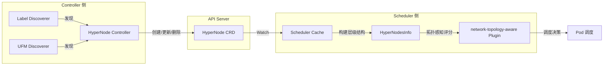

调度器通过 Watch HyperNode 资源构建内存中的 `HyperNodesInfo` 结构，该结构维护了完整的层级关系（包括每个 HyperNode 的实际节点集合 `realNodesSet` 和按 Tier 分组的 `hyperNodesSetByTier`）。`network-topology-aware` 插件在打分阶段利用这些信息来评估候选节点之间的网络拓扑亲和性，优先将同一 Job 的 Pod 调度到网络拓扑距离更近的节点上，从而优化分布式训练和高性能计算的通信性能。

### 12.3 完整数据流总结

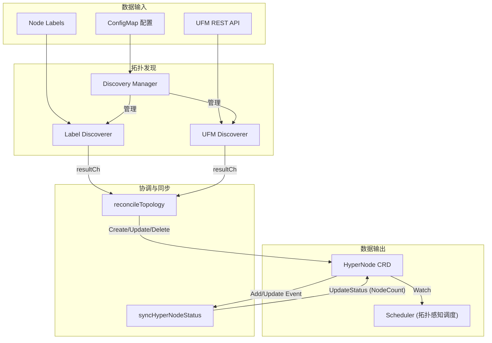

HyperNode Controller 通过清晰的职责分离和可扩展的架构设计，实现了从多种数据源自动发现网络拓扑、持久化拓扑信息、并保持状态一致性的完整工作流。其可插拔的 Discoverer 机制使得未来添加新的拓扑发现源（如 RoCE、Slingshot 等）变得简单直接，只需实现 `Discoverer` 接口并通过 `init()` 注册即可。
