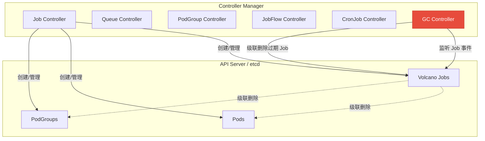
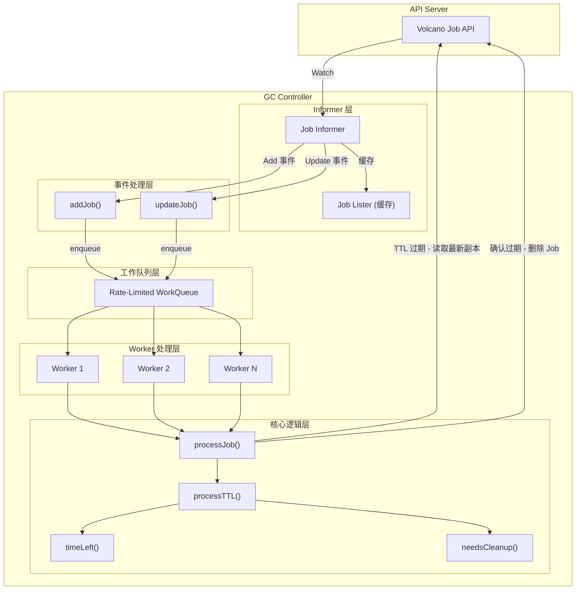
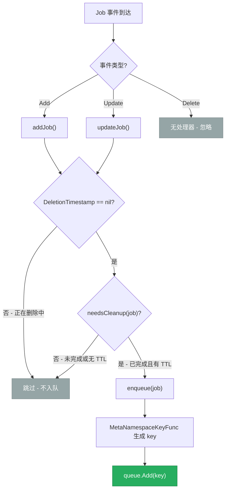
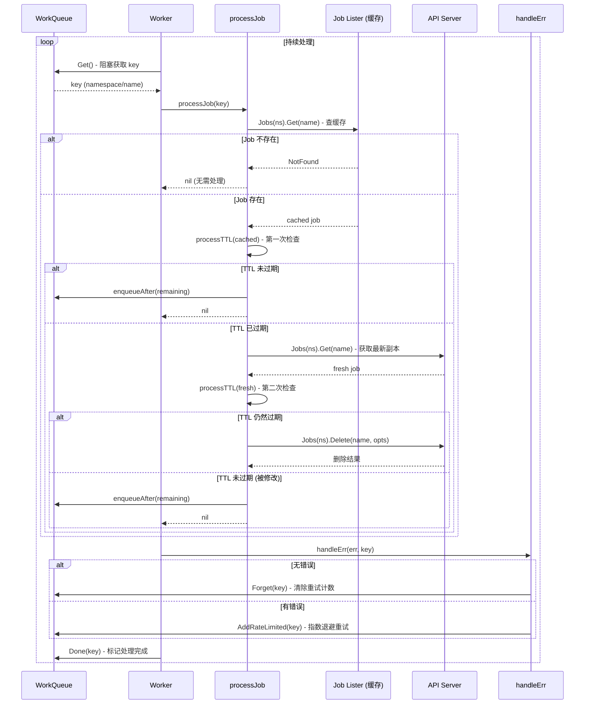
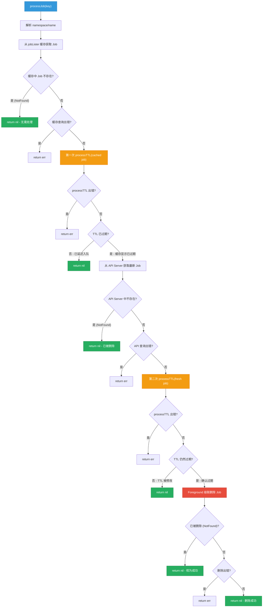
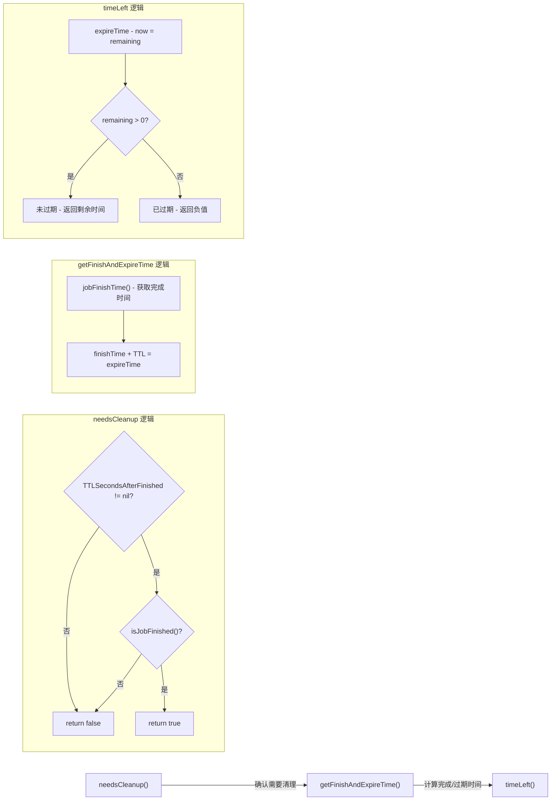
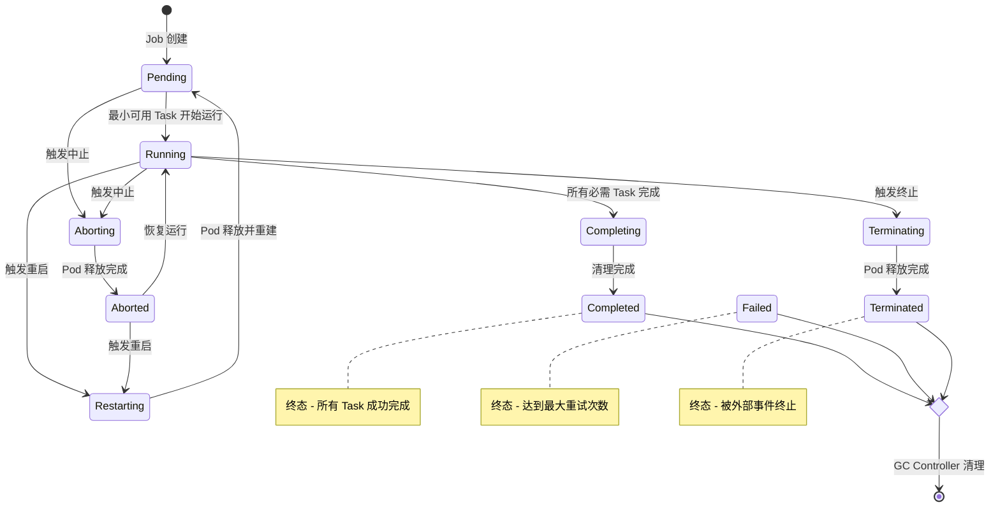
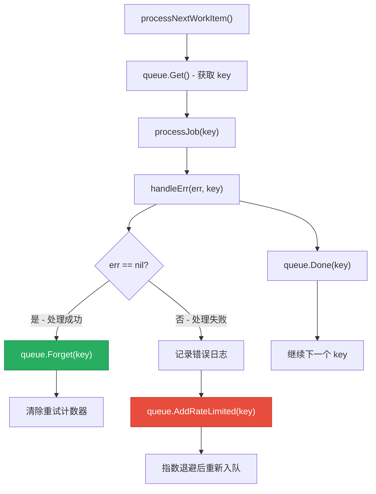

## 1. 概述

Garbage Collector Controller（以下简称 GC Controller）是 Volcano Controller Manager 中负责**自动清理已完成生命周期的 Job 资源**的专用控制器。在大规模批处理场景下，集群中会产生大量已完成、失败或被终止的 Job 对象，如果不及时清理，这些残留资源将持续占用 etcd 存储空间和 API Server 的内存，最终影响集群性能。

GC Controller 通过 **TTL (Time-To-Live)** 机制实现了优雅的资源回收策略。用户可以在 Job 的 Spec 中设置 `ttlSecondsAfterFinished` 字段，指定 Job 在进入终态（Completed、Failed、Terminated）后存活的秒数。一旦 TTL 到期，GC Controller 会自动级联删除该 Job 及其关联的子资源（如 Pod、PodGroup 等）。

### 1.1 核心职责

| 职责 | 说明 |
|------|------|
| 监听 Job 事件 | 通过 Informer 监听 Job 的创建和更新事件 |
| TTL 计算 | 根据 Job 完成时间和配置的 TTL 计算过期时间 |
| 延迟入队 | 对未过期的 Job 设置延迟重新检查 |
| 安全删除 | 通过双重检查模式确保删除操作的正确性 |
| 级联清理 | 使用 Foreground 级联删除策略清理 Job 及其子资源 |

### 1.2 在 Volcano 系统中的位置



GC Controller 独立于 Job Controller 运行，遵循**关注点分离**的设计原则。Job Controller 负责 Job 的全生命周期管理（创建、调度、运行、状态更新），而 GC Controller 专注于已完成 Job 的清理回收。这种分离使得两个控制器可以独立演进，降低了代码耦合度。

### 1.3 源码位置

| 文件 | 说明 |
|------|------|
| `pkg/controllers/garbagecollector/garbagecollector.go` | GC Controller 核心实现 |
| `pkg/controllers/garbagecollector/garbagecollector_test.go` | 单元测试 |
| `cmd/controller-manager/app/options/options.go` | 命令行参数定义 |
| `pkg/controllers/framework/interface.go` | Controller 框架接口定义 |

---

## 2. 核心架构

### 2.1 架构总览



### 2.2 gccontroller 结构体

```go
// 源码: pkg/controllers/garbagecollector/garbagecollector.go

type gccontroller struct {
    vcClient    vcclientset.Interface                          // Volcano API 客户端，用于直接访问 API Server
    jobInformer batchinformers.JobInformer                     // Job Informer，监听 Job 事件
    vcInformerFactory vcinformer.SharedInformerFactory          // Informer 工厂，管理 Informer 生命周期
    jobLister   batchlisters.JobLister                         // Job Lister，从本地缓存读取 Job
    jobSynced   func() bool                                    // 缓存同步状态检查函数
    queue       workqueue.TypedRateLimitingInterface[string]   // 带速率限制的工作队列
    workers     uint32                                         // Worker goroutine 数量
}
```

各字段的职责如下：

| 字段 | 类型 | 职责 |
|------|------|------|
| `vcClient` | `vcclientset.Interface` | 与 API Server 直接通信，用于获取最新 Job 副本和执行删除操作 |
| `jobInformer` | `batchinformers.JobInformer` | 注册事件处理函数，监听 Job 的创建和更新 |
| `vcInformerFactory` | `vcinformer.SharedInformerFactory` | 管理所有 Informer 的启动和缓存同步 |
| `jobLister` | `batchlisters.JobLister` | 从本地 Informer 缓存中读取 Job，避免直接访问 API Server |
| `jobSynced` | `func() bool` | 检查 Informer 缓存是否已完成初始同步 |
| `queue` | `workqueue.TypedRateLimitingInterface[string]` | 存储待处理的 Job key，支持延迟入队和速率限制 |
| `workers` | `uint32` | 并发 Worker 数量，默认为 1，可通过 `--worker-threads-for-gc` 配置 |

---

## 3. Controller 注册与初始化

### 3.1 注册流程

GC Controller 采用 Volcano Controller 框架的标准注册模式，通过 `init()` 函数在包加载时自动注册：

```go
// 源码: pkg/controllers/garbagecollector/garbagecollector.go

func init() {
    framework.RegisterController(&gccontroller{})
}
```

Controller 的名称通过 `Name()` 方法返回：

```go
func (gc *gccontroller) Name() string {
    return "gc-controller"
}
```

### 3.2 初始化流程

`Initialize()` 方法负责设置所有依赖组件：

```go
func (gc *gccontroller) Initialize(opt *framework.ControllerOption) error {
    gc.vcClient = opt.VolcanoClient

    factory := opt.VCSharedInformerFactory
    jobInformer := factory.Batch().V1alpha1().Jobs()

    gc.vcInformerFactory = factory
    gc.jobInformer = jobInformer
    gc.jobLister = jobInformer.Lister()
    gc.jobSynced = jobInformer.Informer().HasSynced
    gc.queue = workqueue.NewTypedRateLimitingQueue(
        workqueue.DefaultTypedControllerRateLimiter[string](),
    )
    gc.workers = opt.WorkerThreadsForGC

    jobInformer.Informer().AddEventHandler(cache.ResourceEventHandlerFuncs{
        AddFunc:    gc.addJob,
        UpdateFunc: gc.updateJob,
        // 注意: 没有 DeleteFunc，GC Controller 不关心删除事件
    })

    return nil
}
```

```mermaid
sequenceDiagram
    participant CM as Controller Manager
    participant GC as GC Controller
    participant Opt as ControllerOption
    participant IF as InformerFactory
    participant JI as Job Informer
    participant WQ as WorkQueue

    CM->>GC: Initialize(opt)
    GC->>Opt: 获取 VolcanoClient
    GC->>IF: factory.Batch().V1alpha1().Jobs()
    IF-->>GC: jobInformer
    GC->>JI: Lister() - 获取缓存查询接口
    GC->>JI: Informer().HasSynced - 获取同步检查函数
    GC->>WQ: NewTypedRateLimitingQueue()
    GC->>Opt: 获取 WorkerThreadsForGC
    GC->>JI: AddEventHandler(Add + Update)
    GC-->>CM: 初始化完成

    CM->>GC: Run(stopCh)
    GC->>IF: Start(stopCh) - 启动 Informer
    GC->>IF: WaitForCacheSync(stopCh)
    IF-->>GC: 缓存同步完成

    loop 每个 Worker (i = 0 到 N-1)
        GC->>GC: go wait.Until(worker, 1s, stopCh)
    end

    Note over GC: 阻塞等待 stopCh 关闭
```

### 3.3 启动流程 - Run()

`Run()` 方法是 Controller 的主入口，负责启动 Informer 并创建 Worker goroutine：

```go
func (gc *gccontroller) Run(stopCh <-chan struct{}) {
    defer gc.queue.ShutDown()

    klog.Infof("Starting garbage collector")
    defer klog.Infof("Shutting down garbage collector")

    // 1. 启动 Informer
    gc.vcInformerFactory.Start(stopCh)

    // 2. 等待缓存同步
    for informerType, ok := range gc.vcInformerFactory.WaitForCacheSync(stopCh) {
        if !ok {
            klog.Errorf("caches failed to sync: %v", informerType)
            return
        }
    }

    // 3. 启动 N 个 Worker goroutine
    for i := 0; i < int(gc.workers); i++ {
        go wait.Until(gc.worker, time.Second, stopCh)
    }

    // 4. 阻塞直到收到停止信号
    <-stopCh
}
```

**关键设计点**：

- `wait.Until` 确保 Worker 在 panic 后自动重启（每秒重试一次）
- `defer gc.queue.ShutDown()` 确保所有 Worker 在 Controller 退出时优雅终止
- 缓存同步失败时直接返回，不会启动 Worker

---

## 4. Job 事件处理

### 4.1 事件处理器注册

GC Controller 仅注册了 `AddFunc` 和 `UpdateFunc` 两个事件处理器，**没有注册 `DeleteFunc`**。这是因为 GC Controller 的职责是删除 Job，而非响应 Job 的删除事件。已删除的 Job 无需再进行清理处理。

### 4.2 addJob 与 updateJob

这两个方法的逻辑完全相同：

```go
func (gc *gccontroller) addJob(obj interface{}) {
    job := obj.(*v1alpha1.Job)
    klog.V(4).Infof("Adding job %s/%s", job.Namespace, job.Name)

    if job.DeletionTimestamp == nil && needsCleanup(job) {
        gc.enqueue(job)
    }
}

func (gc *gccontroller) updateJob(old, cur interface{}) {
    job := cur.(*v1alpha1.Job)
    klog.V(4).Infof("Updating job %s/%s", job.Namespace, job.Name)

    if job.DeletionTimestamp == nil && needsCleanup(job) {
        gc.enqueue(job)
    }
}
```

**入队前置条件**（两个条件必须同时满足）：

1. **`DeletionTimestamp == nil`** - Job 未被标记为删除（正在被其他控制器删除的 Job 无需重复处理）
2. **`needsCleanup(job)`** - Job 已完成且配置了 TTL



### 4.3 enqueue 与 enqueueAfter

```go
// 立即入队
func (gc *gccontroller) enqueue(job *v1alpha1.Job) {
    key, err := cache.MetaNamespaceKeyFunc(job)
    if err != nil {
        klog.Errorf("couldn't get key for object %#v: %v", job, err)
        return
    }
    gc.queue.Add(key)
}

// 延迟入队 - 用于 TTL 尚未到期的场景
func (gc *gccontroller) enqueueAfter(job *v1alpha1.Job, after time.Duration) {
    key, err := cache.MetaNamespaceKeyFunc(job)
    if err != nil {
        klog.Errorf("couldn't get key for object %#v: %v", job, err)
        return
    }
    gc.queue.AddAfter(key, after)
}
```

`MetaNamespaceKeyFunc` 生成的 key 格式为 `namespace/name`（例如 `default/my-job`），对于集群级别的资源则只有 `name`。

`enqueueAfter` 是 GC Controller 实现**精确定时清理**的关键方法。当发现一个 Job 的 TTL 尚未到期时，不是简单地丢弃它，而是计算出精确的剩余时间，然后延迟重新入队。这样可以在 TTL 到期的瞬间触发清理，既不会过早删除也不会延迟太久。

---

## 5. TTL 清理核心算法

这是 GC Controller 最核心的部分，包含了双重检查、时间计算、安全删除等关键逻辑。

### 5.1 Worker 处理流程

Worker 的执行链路如下：

```
worker() → processNextWorkItem() → processJob() → handleErr()
```

```go
func (gc *gccontroller) worker() {
    for gc.processNextWorkItem() {
    }
}

func (gc *gccontroller) processNextWorkItem() bool {
    key, quit := gc.queue.Get()  // 阻塞获取下一个待处理的 key
    if quit {
        return false             // 队列已关闭，退出 Worker
    }
    defer gc.queue.Done(key)     // 标记 key 处理完成

    err := gc.processJob(key)    // 处理 Job
    gc.handleErr(err, key)       // 处理错误

    return true                  // 继续处理下一个
}
```



### 5.2 processJob - 双重检查模式

`processJob` 是 GC Controller 中最重要的方法，实现了**双重检查模式 (Double-Check Pattern)**来确保删除操作的安全性：

```go
func (gc *gccontroller) processJob(key string) error {
    namespace, name, err := cache.SplitMetaNamespaceKey(key)
    if err != nil {
        return err
    }

    // ============ 第一阶段: 缓存检查 ============
    // 从本地 Informer 缓存获取 Job，避免给 API Server 施加压力
    job, err := gc.jobLister.Jobs(namespace).Get(name)
    if apierrors.IsNotFound(err) {
        return nil  // Job 已不存在，无需处理
    }
    if err != nil {
        return err
    }

    // 第一次 TTL 检查 (基于缓存数据)
    if expired, err := gc.processTTL(job); err != nil {
        return err
    } else if !expired {
        return nil  // TTL 未过期，已通过 enqueueAfter 延迟重新入队
    }

    // ============ 第二阶段: API Server 确认 ============
    // TTL 看起来已过期，但缓存数据可能是过时的
    // 从 API Server 获取最新副本进行最终确认
    fresh, err := gc.vcClient.BatchV1alpha1().Jobs(namespace).Get(
        context.TODO(), name, metav1.GetOptions{},
    )
    if apierrors.IsNotFound(err) {
        return nil  // Job 在此期间已被删除
    }
    if err != nil {
        return err
    }

    // 第二次 TTL 检查 (基于最新数据)
    if expired, err := gc.processTTL(fresh); err != nil {
        return err
    } else if !expired {
        return nil  // TTL 被修改，实际上未过期
    }

    // ============ 第三阶段: 安全删除 ============
    policy := metav1.DeletePropagationForeground
    options := metav1.DeleteOptions{
        PropagationPolicy: &policy,
        Preconditions:     &metav1.Preconditions{UID: &fresh.UID},
    }
    err = gc.vcClient.BatchV1alpha1().Jobs(fresh.Namespace).Delete(
        context.TODO(), fresh.Name, options,
    )
    if apierrors.IsNotFound(err) {
        return nil  // 已被删除，视为成功
    }
    return err
}
```

**双重检查的详细流程图**：



**为什么需要双重检查？**

在分布式系统中，Informer 缓存与 API Server 之间存在**数据延迟**。考虑以下竞态场景：

1. Informer 缓存中的 Job TTL 显示已过期
2. 用户在 GC Controller 检查缓存之后、删除之前修改了 Job 的 `ttlSecondsAfterFinished` 字段
3. 如果不从 API Server 获取最新数据进行二次确认，可能会错误删除一个 TTL 被延长的 Job

双重检查模式通过两次独立的 TTL 验证有效解决了这个问题。

### 5.3 processTTL 逻辑

```go
func (gc *gccontroller) processTTL(job *v1alpha1.Job) (expired bool, err error) {
    // 前置检查: 正在删除中或不需要清理的 Job 直接跳过
    if job.DeletionTimestamp != nil || !needsCleanup(job) {
        return false, nil
    }

    now := time.Now()
    t, err := timeLeft(job, &now)
    if err != nil {
        return false, err
    }

    // TTL 已过期 (剩余时间 <= 0)
    if *t <= 0 {
        return true, nil
    }

    // TTL 未过期，延迟入队，在 TTL 到期时重新检查
    gc.enqueueAfter(job, *t)
    return false, nil
}
```

`processTTL` 的返回值语义：

| expired | err | 含义 |
|---------|-----|------|
| `false` | `nil` | 不需要清理（未完成/无 TTL/未过期/正在删除中） |
| `true` | `nil` | TTL 已过期，应该删除 |
| `false` | `non-nil` | 处理过程中发生错误 |

### 5.4 TTL 时间计算

TTL 时间计算涉及四个关联函数，形成完整的计算链路：



#### needsCleanup()

```go
func needsCleanup(j *v1alpha1.Job) bool {
    return j.Spec.TTLSecondsAfterFinished != nil && isJobFinished(j)
}
```

两个条件缺一不可：
- `TTLSecondsAfterFinished` 必须被设置（非 nil 指针）
- Job 必须已经进入终态

#### isJobFinished()

```go
func isJobFinished(job *v1alpha1.Job) bool {
    return job.Status.State.Phase == v1alpha1.Completed ||
        job.Status.State.Phase == v1alpha1.Failed ||
        job.Status.State.Phase == v1alpha1.Terminated
}
```

只有三种 Phase 被视为 Job 的终态：`Completed`、`Failed`、`Terminated`。

#### jobFinishTime()

```go
func jobFinishTime(finishedJob *v1alpha1.Job) (metav1.Time, error) {
    if finishedJob.Status.State.LastTransitionTime.IsZero() {
        return metav1.Time{}, fmt.Errorf(
            "unable to find the time when the Job %s/%s finished",
            finishedJob.Namespace, finishedJob.Name,
        )
    }
    return finishedJob.Status.State.LastTransitionTime, nil
}
```

使用 `Status.State.LastTransitionTime` 作为 Job 的完成时间。这是 Job 状态最后一次发生变迁的时间戳，当 Job 进入终态时，该字段记录的就是进入终态的精确时间。

#### getFinishAndExpireTime()

```go
func getFinishAndExpireTime(j *v1alpha1.Job) (*time.Time, *time.Time, error) {
    if !needsCleanup(j) {
        return nil, nil, fmt.Errorf("job %s/%s should not be cleaned up", j.Namespace, j.Name)
    }
    finishAt, err := jobFinishTime(j)
    if err != nil {
        return nil, nil, err
    }
    finishAtUTC := finishAt.UTC()
    expireAtUTC := finishAtUTC.Add(
        time.Duration(*j.Spec.TTLSecondsAfterFinished) * time.Second,
    )
    return &finishAtUTC, &expireAtUTC, nil
}
```

**计算公式**: `过期时间 = 完成时间 + TTLSecondsAfterFinished`

#### timeLeft()

```go
func timeLeft(j *v1alpha1.Job, since *time.Time) (*time.Duration, error) {
    finishAt, expireAt, err := getFinishAndExpireTime(j)
    if err != nil {
        return nil, err
    }
    // 时钟偏移检测
    if finishAt.UTC().After(since.UTC()) {
        klog.Warningf("Warning: Found Job %s/%s finished in the future. "+
            "This is likely due to time skew in the cluster. "+
            "Job cleanup will be deferred.", j.Namespace, j.Name)
    }
    remaining := expireAt.UTC().Sub(since.UTC())
    return &remaining, nil
}
```

**计算公式**: `剩余时间 = 过期时间 - 当前时间`

**时钟偏移处理**: 如果检测到 Job 的完成时间在当前时间之后（未来时间），会输出警告日志。这种情况通常由集群中节点间的时钟不同步造成。此时清理操作会被自然延迟，因为计算出的剩余时间会大于实际 TTL 值。

**完整时间线示意**：

```
完成时间                  当前时间              过期时间
   |________________________|____________________|
   |                        |                    |
   |<----- 已经过去 ------->|<--- remaining --->|
   |                                             |
   |<----------- TTLSecondsAfterFinished ------->|
```

---

## 6. Job 终态定义

Volcano Job 有 10 种状态（Phase），其中只有 3 种被视为终态（GC Controller 可以清理的状态）。

### 6.1 状态图



### 6.2 状态详解

#### 终态（GC Controller 处理的状态）

| Phase | 含义 | 触发条件 |
|-------|------|----------|
| `Completed` | 所有 Task 成功完成 | 所有必需 Task 运行成功并完成清理 |
| `Failed` | Job 达到最大重试次数后失败 | 重试次数耗尽，无法恢复 |
| `Terminated` | Job 被外部事件异常终止 | 外部干预或不可恢复错误 |

#### 非终态（GC Controller 忽略的状态）

| Phase | 含义 |
|-------|------|
| `Pending` | Job 在队列中等待调度 |
| `Running` | 最小可用 Task 正在运行 |
| `Aborting` | Job 正在中止，等待释放 Pod |
| `Aborted` | Job 已被中止（可恢复） |
| `Restarting` | Job 正在重启，等待 Pod 释放和重建 |
| `Completing` | 必需 Task 已完成，正在清理 |
| `Terminating` | Job 正在终止，等待释放 Pod |

> **注意**: `Aborted` 虽然看起来像终态，但它是可恢复的（可以重启或恢复运行），因此不被 GC Controller 视为终态。同理，`Completing` 和 `Terminating` 是过渡态，分别会转为 `Completed` 和 `Terminated`。

---

## 7. 删除策略

### 7.1 Foreground 级联删除

GC Controller 使用 `DeletePropagationForeground` 策略删除 Job：

```go
policy := metav1.DeletePropagationForeground
options := metav1.DeleteOptions{
    PropagationPolicy: &policy,
    Preconditions:     &metav1.Preconditions{UID: &fresh.UID},
}
```

Kubernetes 提供三种级联删除策略：

| 策略 | 行为 | GC Controller 选择 |
|------|------|---------------------|
| `Orphan` | 只删除父资源，子资源变为孤儿 | 否 |
| `Background` | 立即删除父资源，后台异步删除子资源 | 否 |
| `Foreground` | 先删除子资源，再删除父资源 | **是** |

选择 Foreground 策略的原因：

1. **确保子资源先被清理**: Pod、PodGroup 等子资源在 Job 删除前被清理，避免孤儿资源
2. **删除顺序可预测**: 管理员可以观察到清晰的删除过程
3. **避免资源泄漏**: 如果使用 Background 策略，子资源的异步删除可能因 Controller 重启而中断

### 7.2 UID Precondition 安全机制

```go
Preconditions: &metav1.Preconditions{UID: &fresh.UID}
```

UID Precondition 是一种**乐观并发控制**机制。它确保删除请求的目标 Job 的 UID 与 GC Controller 检查过的 Job UID 一致。

**防止误删场景**：

```
时间线:
T1: GC Controller 确认 Job "my-job" (UID=abc123) TTL 已过期
T2: 另一个进程删除了旧的 "my-job"
T3: 用户创建了新的 "my-job" (UID=def456)
T4: GC Controller 发送删除请求 (带 UID=abc123 precondition)
T5: API Server 拒绝删除，因为当前 "my-job" 的 UID=def456 != abc123
```

没有 UID Precondition 的话，T4 步骤会错误删除用户新创建的同名 Job。

### 7.3 IsNotFound 处理

```go
err = gc.vcClient.BatchV1alpha1().Jobs(fresh.Namespace).Delete(
    context.TODO(), fresh.Name, options,
)
if apierrors.IsNotFound(err) {
    return nil  // 已被删除，视为成功
}
return err
```

如果在发送删除请求时 Job 已经不存在（可能被用户手动删除或其他 Controller 删除），GC Controller 将 `NotFound` 错误视为成功，因为最终目标（Job 被清理）已经达成。这种幂等性设计避免了不必要的错误重试。

---

## 8. 错误处理与重试

### 8.1 handleErr 机制

```go
func (gc *gccontroller) handleErr(err error, key string) {
    if err == nil {
        gc.queue.Forget(key)  // 处理成功，清除重试计数器
        return
    }

    klog.Errorf("error cleaning up Job %v, will retry: %v", key, err)
    gc.queue.AddRateLimited(key)  // 处理失败，指数退避重试
}
```

### 8.2 重试策略

GC Controller 使用 `workqueue.DefaultTypedControllerRateLimiter` 创建的速率限制器，其行为基于两个内置限制器的组合：

| 限制器 | 参数 | 行为 |
|--------|------|------|
| `BucketRateLimiter` | 10 QPS, Burst 100 | 全局速率限制，防止短时间内产生过多 API 请求 |
| `ItemExponentialFailureRateLimiter` | baseDelay=5ms, maxDelay=1000s | 对单个 key 的指数退避 |

指数退避的重试间隔：

| 重试次数 | 延迟时间 |
|----------|----------|
| 第 1 次 | 5ms |
| 第 2 次 | 10ms |
| 第 3 次 | 20ms |
| 第 4 次 | 40ms |
| 第 5 次 | 80ms |
| ... | ... |
| 第 N 次 | min(5ms * 2^(N-1), 1000s) |



### 8.3 边界情况处理

| 场景 | 处理方式 |
|------|----------|
| Job 在缓存中不存在 | 返回 `nil`，从队列中移除 |
| Job 在 API Server 中不存在 | 返回 `nil`，视为已清理 |
| 删除时 Job 已不存在 | 返回 `nil`，幂等处理 |
| API Server 请求失败 | 返回 `err`，触发指数退避重试 |
| `LastTransitionTime` 为零值 | 返回错误信息，触发重试 |
| 时钟偏移（完成时间在未来） | 输出警告日志，延迟清理（剩余时间自然增大） |
| TTL 在双重检查之间被修改 | 第二次 processTTL 检测到变更，取消删除 |
| 同名 Job 被重建 | UID Precondition 阻止误删 |

---

## 9. 配置参数

### 9.1 命令行参数

GC Controller 通过 Controller Manager 的命令行参数进行配置：

```bash
# 源码: cmd/controller-manager/app/options/options.go

--worker-threads-for-gc uint32    # GC Worker 线程数 (默认: 1)
```

参数定义：

```go
// 源码: cmd/controller-manager/app/options/options.go

const (
    defaultGCWorkers = 1
)

// ServerOption 中的字段
type ServerOption struct {
    // ...
    WorkerThreadsForGC uint32
    // ...
}

// 注册命令行参数
fs.Uint32Var(&s.WorkerThreadsForGC, "worker-threads-for-gc",
    defaultGCWorkers,
    "The number of threads for recycling jobs. "+
    "The larger the number, the faster the job recycling, "+
    "but requires more CPU load.")
```

**调优建议**：

| 集群规模 | 推荐 Worker 数 | 说明 |
|----------|---------------|------|
| 小型 (< 100 Job/天) | 1 (默认) | 默认值即可满足需求 |
| 中型 (100-1000 Job/天) | 2-3 | 适度增加以加快清理速度 |
| 大型 (> 1000 Job/天) | 3-5 | 需要更多 Worker 处理积压 |

### 9.2 Job Spec 字段

```go
// 源码: staging/src/volcano.sh/apis/pkg/apis/batch/v1alpha1/job.go

type JobSpec struct {
    // ...

    // ttlSecondsAfterFinished limits the lifetime of a Job that has finished
    // execution (either Completed or Failed). If this field is set,
    // ttlSecondsAfterFinished after the Job finishes, it is eligible to be
    // deleted immediately after it finishes.
    // +kubebuilder:validation:Minimum=0
    // +optional
    TTLSecondsAfterFinished *int32 `json:"ttlSecondsAfterFinished,omitempty"`

    // ...
}
```

**字段特性**：

| 特性 | 说明 |
|------|------|
| 类型 | `*int32` (指针类型) |
| 默认值 | `nil` (不自动清理) |
| 最小值 | `0` (Job 完成后立即清理) |
| 单位 | 秒 |
| 可选性 | Optional，不设置则 GC Controller 不会处理该 Job |

**常用 TTL 值参考**：

| TTL 值 | 持续时间 | 适用场景 |
|--------|----------|----------|
| `0` | 立即删除 | 不需要保留记录的临时 Job |
| `300` | 5 分钟 | 调试结束后快速清理 |
| `3600` | 1 小时 | 允许短暂回顾 |
| `86400` | 1 天 | 标准日志保留 |
| `604800` | 1 周 | 较长的审计保留期 |
| `nil` | 永不删除 | 需要手动清理或永久保留 |

---

## 10. 使用示例

### 10.1 基本用法 - 完成后 1 小时自动清理

```yaml
apiVersion: batch.volcano.sh/v1alpha1
kind: Job
metadata:
  name: training-job
  namespace: default
spec:
  ttlSecondsAfterFinished: 3600  # 完成后 1 小时自动清理
  minAvailable: 1
  schedulerName: volcano
  queue: default
  tasks:
    - replicas: 1
      name: trainer
      template:
        spec:
          containers:
            - name: tensorflow
              image: tensorflow/tensorflow:2.12.0-gpu
              command: ["python", "train.py"]
              resources:
                limits:
                  nvidia.com/gpu: 1
          restartPolicy: Never
```

### 10.2 立即清理 - TTL 设为 0

```yaml
apiVersion: batch.volcano.sh/v1alpha1
kind: Job
metadata:
  name: data-preprocessing
  namespace: default
spec:
  ttlSecondsAfterFinished: 0  # 完成后立即清理
  minAvailable: 3
  schedulerName: volcano
  tasks:
    - replicas: 3
      name: preprocessor
      template:
        spec:
          containers:
            - name: spark
              image: apache/spark:3.4.0
              command: ["spark-submit", "--class", "Main", "app.jar"]
          restartPolicy: Never
```

### 10.3 不设置 TTL - 手动管理

```yaml
apiVersion: batch.volcano.sh/v1alpha1
kind: Job
metadata:
  name: critical-job
  namespace: production
spec:
  # 不设置 ttlSecondsAfterFinished，GC Controller 不会自动清理
  # 需要管理员手动删除或通过外部脚本清理
  minAvailable: 2
  schedulerName: volcano
  tasks:
    - replicas: 2
      name: worker
      template:
        spec:
          containers:
            - name: app
              image: my-app:latest
              command: ["./run.sh"]
          restartPolicy: OnFailure
```

### 10.4 配置 Controller Manager

```bash
# 启动 Controller Manager 时配置 GC Worker 数量
volcano-controller-manager \
  --worker-threads-for-gc=3 \
  --worker-threads-for-podgroup=5 \
  --worker-threads-for-queue=5
```

---

## 11. 与 Kubernetes TTL Controller 的对比

Kubernetes 原生也提供了类似的 TTL 清理机制，即 `TTLAfterFinished` Controller（从 K8s 1.23 开始 GA）。Volcano GC Controller 在设计上与其高度相似，但专门处理 Volcano Job 资源。

### 11.1 对比表

| 维度 | K8s TTLAfterFinished Controller | Volcano GC Controller |
|------|--------------------------------|----------------------|
| 处理的资源类型 | Kubernetes batch/v1 Job | Volcano batch.volcano.sh/v1alpha1 Job |
| TTL 字段 | `spec.ttlSecondsAfterFinished` | `spec.ttlSecondsAfterFinished` |
| 终态判定 | Complete / Failed | Completed / Failed / Terminated |
| 完成时间来源 | Job Conditions 中的 Complete/Failed Condition | `Status.State.LastTransitionTime` |
| 双重检查 | 是 (cache + API Server) | 是 (cache + API Server) |
| 级联删除策略 | Background | **Foreground** |
| UID Precondition | 是 | 是 |
| 延迟入队 | 是 | 是 |
| Worker 可配置 | 是 | 是 (`--worker-threads-for-gc`) |

### 11.2 关键差异

**1. 终态定义**

Volcano Job 比 K8s Job 多了一个 `Terminated` 终态。这是因为 Volcano 支持更丰富的 Job 生命周期管理，包括外部中止、重启等操作，`Terminated` 表示 Job 被外部事件异常终止。

**2. 完成时间来源**

- K8s Job 使用 Conditions 数组中的 `Complete` 或 `Failed` Condition 的时间戳
- Volcano Job 使用 `Status.State.LastTransitionTime`，这是一个更简洁的设计

**3. 级联删除策略**

- K8s TTL Controller 使用 `Background` 策略，父资源立即删除，子资源异步清理
- Volcano GC Controller 使用 `Foreground` 策略，确保子资源先被清理。这对于包含 PodGroup 等调度资源的 Volcano Job 更为安全，可以避免调度器因为孤儿 PodGroup 而做出错误的调度决策

**4. 独立 Controller vs 内置逻辑**

两者都采用了独立 Controller 的设计，而非将清理逻辑嵌入 Job Controller。这种设计：
- 保持了 Job Controller 的职责单一
- 允许独立配置 Worker 数量
- 便于未来扩展到其他可完成的资源类型

---

## 12. 总结

### 12.1 设计模式总结

GC Controller 虽然代码量不大（约 310 行），但体现了多个优秀的分布式系统设计模式：

| 设计模式 | 在 GC Controller 中的应用 |
|----------|--------------------------|
| **Work Queue 模式** | 使用 Rate-Limited WorkQueue 解耦事件接收与处理 |
| **双重检查模式** | 缓存检查 + API Server 确认，防止基于过时数据做出错误决策 |
| **乐观并发控制** | UID Precondition 防止 ABA 问题导致的误删 |
| **幂等性设计** | NotFound 错误视为成功，支持安全重试 |
| **指数退避** | 失败时通过指数退避重试，避免雪崩效应 |
| **延迟入队** | 精确计算 TTL 剩余时间，避免不必要的轮询 |
| **关注点分离** | 独立于 Job Controller，专注于清理职责 |
| **级联删除** | Foreground 策略确保子资源被完整清理 |

### 12.2 最佳实践建议

**对于 Job 用户**：

1. **始终设置 TTL**: 除非有明确的保留需求，否则应为所有 Job 设置合理的 `ttlSecondsAfterFinished`，避免资源堆积
2. **根据需求选择 TTL 值**: 调试环境可以设短（如 300 秒），生产环境根据审计需求设置（如 86400 秒）
3. **TTL=0 谨慎使用**: 虽然可以实现立即清理，但 Job 完成后将无法查看其状态和日志
4. **配合日志系统**: 设置 TTL 前确保 Pod 日志已被外部日志系统采集，避免因 Job 清理导致日志丢失

**对于集群管理员**：

1. **监控 etcd 大小**: 定期检查 etcd 中 Volcano Job 资源的数量，评估 TTL 配置的合理性
2. **适当增加 Worker 数**: 大规模集群中，如果发现清理延迟，可适度增加 `--worker-threads-for-gc`
3. **制定 TTL 策略**: 通过 Admission Webhook 或 Policy 强制要求用户设置 TTL，或设置默认值
4. **关注时钟同步**: 确保集群中所有节点的时钟同步（NTP），避免因时钟偏移导致清理行为异常

### 12.3 代码调用链路总结

```
init()
  └── framework.RegisterController(&gccontroller{})

Initialize(opt)
  ├── 设置 vcClient、jobInformer、jobLister、jobSynced
  ├── 创建 Rate-Limited WorkQueue
  ├── 设置 workers 数量
  └── 注册 AddFunc(addJob) + UpdateFunc(updateJob)

Run(stopCh)
  ├── 启动 InformerFactory
  ├── 等待缓存同步
  ├── 启动 N 个 Worker goroutine
  └── 阻塞等待停止信号

addJob(obj) / updateJob(old, cur)
  ├── 检查 DeletionTimestamp == nil
  ├── 检查 needsCleanup(job)
  └── enqueue(job) → queue.Add(key)

worker()
  └── processNextWorkItem()
        ├── queue.Get()
        ├── processJob(key)
        │     ├── jobLister.Get() ─── 缓存查询
        │     ├── processTTL(cached)
        │     │     ├── needsCleanup() → isJobFinished()
        │     │     ├── timeLeft() → getFinishAndExpireTime() → jobFinishTime()
        │     │     └── enqueueAfter() (TTL 未过期时)
        │     ├── vcClient.Get() ─── API Server 查询 (双重检查)
        │     ├── processTTL(fresh)
        │     └── vcClient.Delete() ─── Foreground 级联删除
        ├── handleErr(err, key)
        │     ├── queue.Forget(key)        (成功)
        │     └── queue.AddRateLimited(key) (失败)
        └── queue.Done(key)
```

GC Controller 以简洁而健壮的设计，解决了批处理系统中已完成 Job 的自动清理问题。它的双重检查模式和多层安全机制确保了在分布式环境下的正确性，而延迟入队和指数退避策略则兼顾了效率与稳定性。
