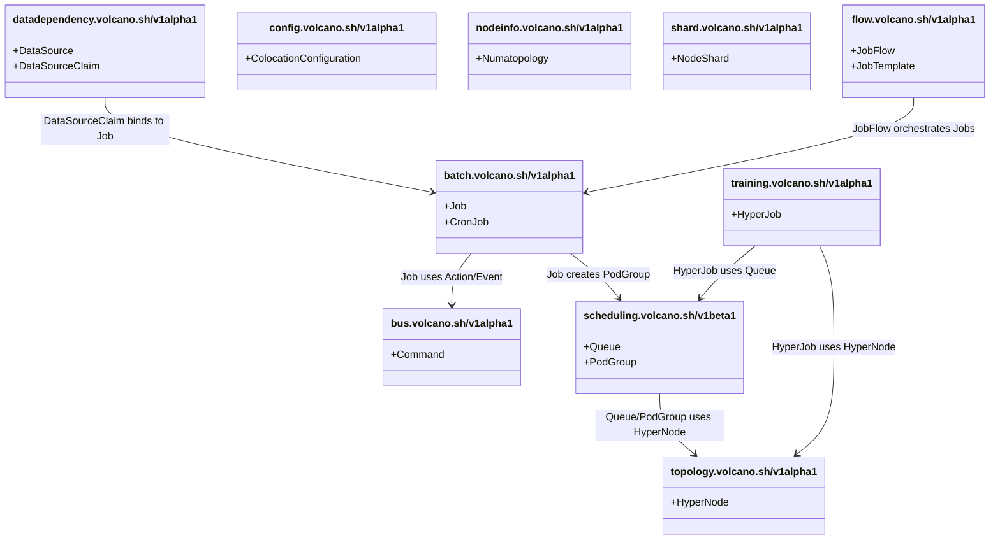
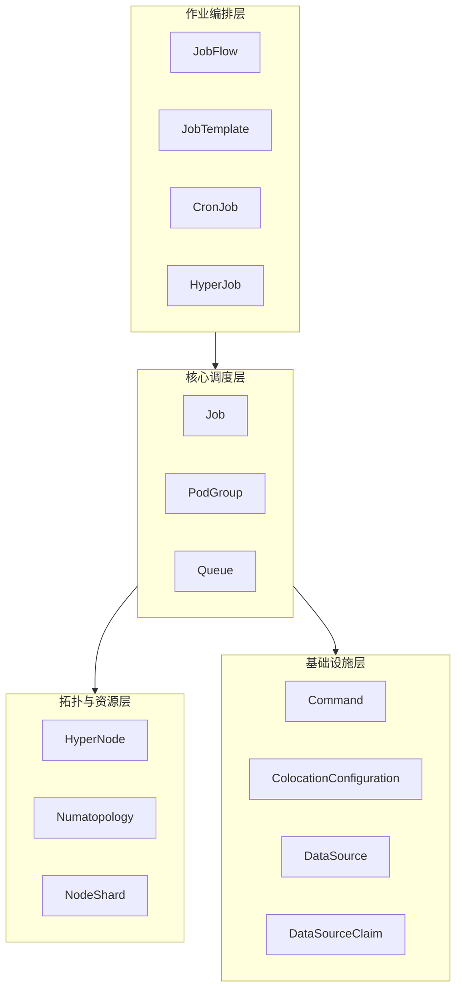
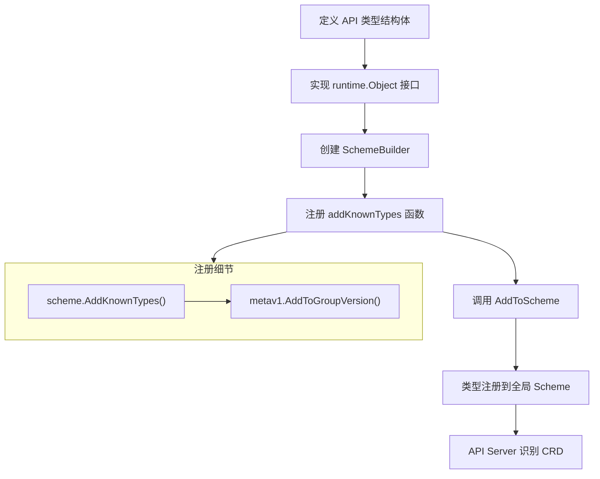
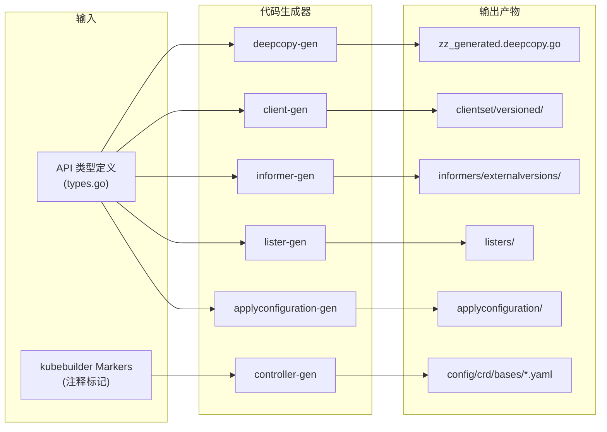
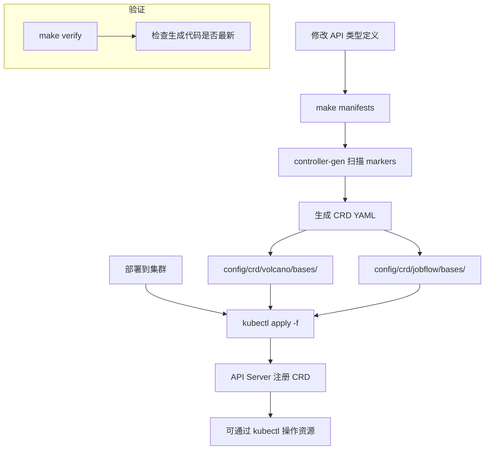
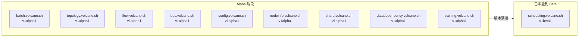
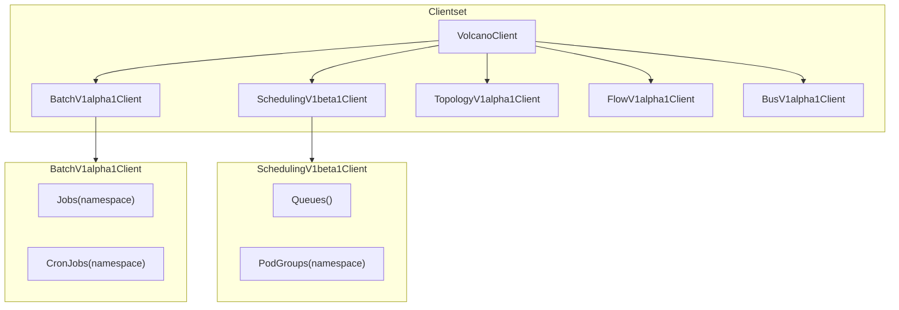
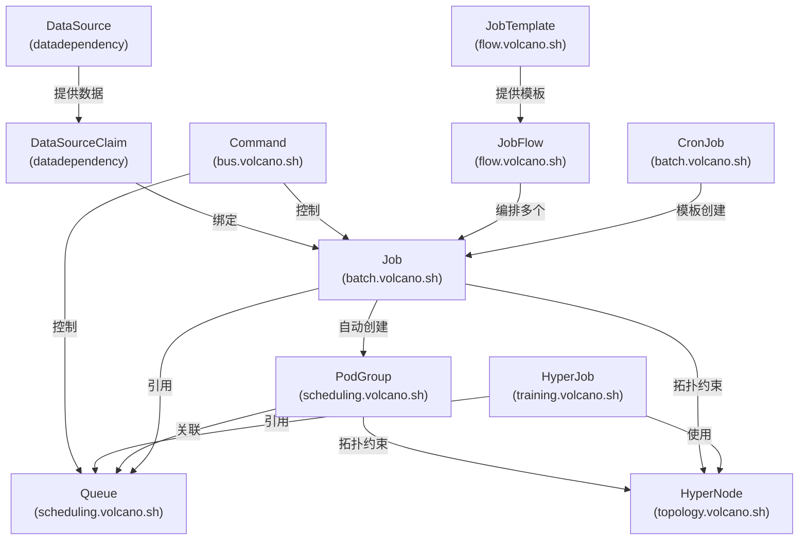
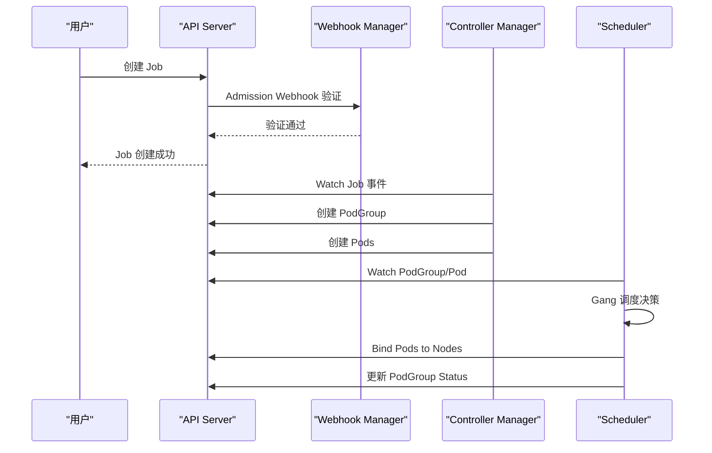

## 1. 概述

Volcano 作为 Kubernetes 原生的批量调度系统，通过 Custom Resource Definitions (CRDs) 扩展了 Kubernetes 的 API 体系，为 AI/ML 训练、大数据处理、HPC 等高性能计算场景提供了丰富的资源抽象。本文档全面介绍 Volcano 的 API 组织结构、CRD 注册机制、代码生成流程以及版本演进策略。

Volcano 的 API 体系围绕以下核心概念构建：

- **Job** - 批量计算任务的抽象，支持多任务、Gang 调度、生命周期管理
- **Queue** - 资源队列，支持层级化资源管理、公平调度
- **PodGroup** - Pod 分组，是 Gang 调度的基本单元
- **HyperNode** - 网络拓扑节点，用于拓扑感知调度
- **JobFlow** - 作业编排，支持 DAG 工作流

## 2. API 组织结构

Volcano 共定义了 **10 个 API Group**，每个 Group 负责不同的功能领域。所有 API 类型定义位于 staging 目录下：

```
staging/src/volcano.sh/apis/pkg/apis/
├── batch/v1alpha1/          # Job, CronJob
├── scheduling/v1beta1/      # Queue, PodGroup
├── topology/v1alpha1/       # HyperNode
├── flow/v1alpha1/           # JobFlow, JobTemplate
├── bus/v1alpha1/            # Command
├── config/v1alpha1/         # ColocationConfiguration
├── nodeinfo/v1alpha1/       # Numatopology
├── shard/v1alpha1/          # NodeShard
├── datadependency/v1alpha1/ # DataSource, DataSourceClaim
└── training/v1alpha1/       # HyperJob
```

### 2.1 完整 API Group 一览

| 序号 | API Group | Version | CRD 类型 | 作用域 | 说明 |
|------|-----------|---------|----------|--------|------|
| 1 | `batch.volcano.sh` | `v1alpha1` | Job, CronJob | Namespaced | 批量作业管理 |
| 2 | `scheduling.volcano.sh` | `v1beta1` | Queue, PodGroup | Queue: Cluster / PodGroup: Namespaced | 调度资源管理 |
| 3 | `topology.volcano.sh` | `v1alpha1` | HyperNode | Cluster | 网络拓扑定义 |
| 4 | `flow.volcano.sh` | `v1alpha1` | JobFlow, JobTemplate | Namespaced | 作业编排与模板 |
| 5 | `bus.volcano.sh` | `v1alpha1` | Command | Namespaced | 命令总线 |
| 6 | `config.volcano.sh` | `v1alpha1` | ColocationConfiguration | Namespaced | 混部配置 |
| 7 | `nodeinfo.volcano.sh` | `v1alpha1` | Numatopology | Cluster | NUMA 拓扑信息 |
| 8 | `shard.volcano.sh` | `v1alpha1` | NodeShard | Cluster | 节点分片 |
| 9 | `datadependency.volcano.sh` | `v1alpha1` | DataSource, DataSourceClaim | Namespaced | 数据依赖管理 |
| 10 | `training.volcano.sh` | `v1alpha1` | HyperJob | Namespaced | 超大规模训练作业 |

### 2.2 API Group 关系全景图



### 2.3 CRD 类型分组架构图



## 3. CRD 注册机制

### 3.1 API Group 注册模式

Volcano 的每个 API Group 都遵循 Kubernetes 标准的注册模式。以 `batch.volcano.sh/v1alpha1` 为例：

```go
package v1alpha1

import (
    metav1 "k8s.io/apimachinery/pkg/apis/meta/v1"
    "k8s.io/apimachinery/pkg/runtime"
    "k8s.io/apimachinery/pkg/runtime/schema"
)

// GroupName 是该 API Group 的名称
const GroupName = "batch.volcano.sh"

// SchemeGroupVersion 是用于注册类型的 Group Version
var SchemeGroupVersion = schema.GroupVersion{
    Group:   GroupName,
    Version: "v1alpha1",
}

var (
    // SchemeBuilder 用于将类型添加到 Scheme
    SchemeBuilder = runtime.NewSchemeBuilder(addKnownTypes)
    // AddToScheme 将所有存储的函数应用到 Scheme
    AddToScheme = SchemeBuilder.AddToScheme
)

// addKnownTypes 将本包定义的类型添加到 Scheme
func addKnownTypes(scheme *runtime.Scheme) error {
    scheme.AddKnownTypes(SchemeGroupVersion,
        &Job{},
        &JobList{},
        &CronJob{},
        &CronJobList{},
    )
    metav1.AddToGroupVersion(scheme, SchemeGroupVersion)
    return nil
}
```

### 3.2 注册流程



### 3.3 各 API Group 注册的类型汇总

| API Group | 注册类型 | List 类型 |
|-----------|---------|-----------|
| `batch.volcano.sh` | `Job`, `CronJob` | `JobList`, `CronJobList` |
| `scheduling.volcano.sh` | `PodGroup`, `Queue` | `PodGroupList`, `QueueList` |
| `topology.volcano.sh` | `HyperNode` | `HyperNodeList` |
| `flow.volcano.sh` | `JobFlow`, `JobTemplate` | `JobFlowList`, `JobTemplateList` |
| `bus.volcano.sh` | `Command` | `CommandList` |
| `config.volcano.sh` | `ColocationConfiguration` | `ColocationConfigurationList` |
| `nodeinfo.volcano.sh` | `Numatopology` | `NumatopologyList` |
| `shard.volcano.sh` | `NodeShard` | `NodeShardList` |
| `datadependency.volcano.sh` | `DataSource`, `DataSourceClaim` | `DataSourceList`, `DataSourceClaimList` |
| `training.volcano.sh` | `HyperJob` | `HyperJobList` |

### 3.4 Staging 目录结构与 go.mod Replace

Volcano 的 API 类型定义采用 Kubernetes 社区推荐的 **staging 目录** 模式。API 定义独立存放在 `staging/src/volcano.sh/apis/` 下，通过 `go.mod` 中的 `replace` 指令引用：

```go
// go.mod
module volcano.sh/volcano

go 1.24.0

require (
    volcano.sh/apis v0.0.0
    // ...
)

replace (
    volcano.sh/apis => ./staging/src/volcano.sh/apis
    // ...
)
```

这种模式的优势：

1. **独立版本管理** - API 模块可以独立发布和版本管理
2. **依赖隔离** - 外部项目可以只引用 API 模块，不需要引入整个 Volcano
3. **代码生成友好** - staging 目录结构与 Kubernetes 代码生成工具链兼容
4. **清晰的边界** - API 定义与实现代码分离，职责清晰

完整的 staging 目录结构：

```
staging/src/volcano.sh/apis/
├── pkg/
│   ├── apis/                    # API 类型定义
│   │   ├── batch/v1alpha1/      # Job, CronJob 类型
│   │   ├── scheduling/v1beta1/  # Queue, PodGroup 类型
│   │   ├── topology/v1alpha1/   # HyperNode 类型
│   │   ├── flow/v1alpha1/       # JobFlow, JobTemplate 类型
│   │   ├── bus/v1alpha1/        # Command, Action, Event 类型
│   │   ├── config/v1alpha1/     # ColocationConfiguration 类型
│   │   ├── nodeinfo/v1alpha1/   # Numatopology 类型
│   │   ├── shard/v1alpha1/      # NodeShard 类型
│   │   ├── datadependency/v1alpha1/ # DataSource 类型
│   │   └── training/v1alpha1/   # HyperJob 类型
│   └── client/                  # 自动生成的客户端代码
│       ├── clientset/           # Typed clientset
│       ├── informers/           # SharedInformer 工厂
│       ├── listers/             # Lister 接口
│       └── applyconfiguration/  # Apply configuration 类型
└── go.mod                       # 独立的 Go module 定义
```

## 4. 代码生成

### 4.1 代码生成工具链

Volcano 使用 Kubernetes 标准的代码生成工具链，自动生成大量样板代码：

| 工具 | 作用 | 生成产物 |
|------|------|---------|
| `deepcopy-gen` | 生成 DeepCopy 方法 | `zz_generated.deepcopy.go` |
| `client-gen` | 生成 Typed Client | `clientset/versioned/` |
| `informer-gen` | 生成 SharedInformer | `informers/externalversions/` |
| `lister-gen` | 生成 Lister 接口 | `listers/` |
| `controller-gen` | 生成 CRD YAML 定义 | `config/crd/` |
| `applyconfiguration-gen` | 生成 Apply Configuration | `applyconfiguration/` |

### 4.2 代码生成流程



### 4.3 生成命令

```bash
# 生成 DeepCopy, Client, Informer, Lister 代码
make generate-code
# 内部调用: hack/update-gencode.sh

# 生成 CRD YAML 定义 (使用 controller-gen)
make manifests

# 生成部署 YAML 清单
make generate-yaml

# 验证生成代码是否最新
make verify
# 内部调用: hack/verify-gencode.sh + hack/verify-gofmt.sh
```

### 4.4 kubebuilder Markers 说明

API 类型定义中使用 kubebuilder markers 来控制代码生成行为：

```go
// +genclient                    - 生成 typed client
// +genclient:nonNamespaced      - 生成 cluster-scoped client
// +k8s:deepcopy-gen:interfaces  - 生成 DeepCopy 接口实现
// +kubebuilder:object:root=true - 标记为根对象
// +kubebuilder:resource:path=   - 指定资源路径和 shortName
// +kubebuilder:subresource:status - 启用 status 子资源
// +kubebuilder:printcolumn:     - 定义 kubectl get 输出列
// +kubebuilder:validation:      - 字段验证规则
// +kubebuilder:default:         - 字段默认值
```

### 4.5 Markers 使用示例

以 Job CRD 为例，展示 markers 的完整用法：

```go
// +genclient
// +k8s:deepcopy-gen:interfaces=k8s.io/apimachinery/pkg/runtime.Object
// +kubebuilder:object:root=true
// +kubebuilder:resource:path=jobs,shortName=vcjob;vj
// +kubebuilder:subresource:status
// +kubebuilder:printcolumn:name="STATUS",type=string,JSONPath=`.status.state.phase`
// +kubebuilder:printcolumn:name="minAvailable",type=integer,JSONPath=`.status.minAvailable`
// +kubebuilder:printcolumn:name="RUNNINGS",type=integer,JSONPath=`.status.running`
// +kubebuilder:printcolumn:name="AGE",type=date,JSONPath=`.metadata.creationTimestamp`
// +kubebuilder:printcolumn:name="QUEUE",type=string,priority=1,JSONPath=`.spec.queue`
type Job struct {
    metav1.TypeMeta   `json:",inline"`
    metav1.ObjectMeta `json:"metadata,omitempty"`
    Spec   JobSpec    `json:"spec,omitempty"`
    Status JobStatus  `json:"status,omitempty"`
}
```

## 5. CRD YAML 定义

### 5.1 CRD YAML 文件位置

生成的 CRD YAML 文件存储在两个目录下：

**主 CRD 目录** (`config/crd/volcano/bases/`)：

| 文件 | 对应 CRD |
|------|---------|
| `batch.volcano.sh_jobs.yaml` | Job |
| `batch.volcano.sh_cronjobs.yaml` | CronJob |
| `scheduling.volcano.sh_queues.yaml` | Queue |
| `scheduling.volcano.sh_podgroups.yaml` | PodGroup |
| `bus.volcano.sh_commands.yaml` | Command |
| `topology.volcano.sh_hypernodes.yaml` | HyperNode |
| `config.volcano.sh_colocationconfigurations.yaml` | ColocationConfiguration |
| `nodeinfo.volcano.sh_numatopologies.yaml` | Numatopology |
| `shard.volcano.sh_nodeshards.yaml` | NodeShard |

**JobFlow CRD 目录** (`config/crd/jobflow/bases/`)：

| 文件 | 对应 CRD |
|------|---------|
| `flow.volcano.sh_jobflows.yaml` | JobFlow |
| `flow.volcano.sh_jobtemplates.yaml` | JobTemplate |

### 5.2 CRD 生成与安装流程



### 5.3 shortName 快速访问

Volcano CRD 提供了简短名称，方便 `kubectl` 操作：

```bash
# Job 快捷方式
kubectl get vcjob          # 等价于 kubectl get jobs.batch.volcano.sh
kubectl get vj             # 同上

# CronJob 快捷方式
kubectl get cronvcjob      # 等价于 kubectl get cronjobs.batch.volcano.sh
kubectl get cronvj         # 同上

# Queue 快捷方式
kubectl get q              # 等价于 kubectl get queues.scheduling.volcano.sh
kubectl get queue-v1beta1  # 同上

# PodGroup 快捷方式
kubectl get pg             # 等价于 kubectl get podgroups.scheduling.volcano.sh
kubectl get podgroup-v1beta1  # 同上
```

## 6. API 版本策略

### 6.1 版本成熟度定义

Volcano API 遵循 Kubernetes API 版本约定：

| 阶段 | 含义 | 稳定性保证 |
|------|------|-----------|
| `v1alpha1` | Alpha 版本 | 可能随时变更，不保证向后兼容 |
| `v1beta1` | Beta 版本 | 功能基本稳定，API 可能微调 |
| `v1` | GA (稳定版本) | 向后兼容，长期支持 |

### 6.2 各 API Group 版本现状



### 6.3 版本演进说明

| API Group | 当前版本 | 演进说明 |
|-----------|---------|---------|
| `scheduling.volcano.sh` | **v1beta1** | 最成熟的 API，Queue 和 PodGroup 已毕业到 Beta |
| `batch.volcano.sh` | v1alpha1 | 核心 Job API，字段较多但仍在 Alpha 阶段，持续添加新功能 |
| `topology.volcano.sh` | v1alpha1 | 网络拓扑功能较新，仍在快速迭代 |
| `flow.volcano.sh` | v1alpha1 | 作业编排功能，持续演进 |
| `bus.volcano.sh` | v1alpha1 | 内部命令总线，主要用于控制器间通信 |
| `config.volcano.sh` | v1alpha1 | 混部配置，新增 API Group |
| `nodeinfo.volcano.sh` | v1alpha1 | NUMA 拓扑信息，辅助调度决策 |
| `shard.volcano.sh` | v1alpha1 | 节点分片，用于大规模集群优化 |
| `datadependency.volcano.sh` | v1alpha1 | 数据依赖管理，新功能 |
| `training.volcano.sh` | v1alpha1 | 超大规模训练作业管理，最新 API Group |

### 6.4 关键演进里程碑

- `scheduling.volcano.sh` 从 `v1alpha1` 毕业到 `v1beta1`，是唯一进入 Beta 的 API Group
- `batch.volcano.sh` 虽然仍为 `v1alpha1`，但功能最为丰富，涵盖 Job 生命周期管理、分区策略、网络拓扑等
- `training.volcano.sh` 是最新添加的 API Group，专为超大规模分布式训练场景设计

## 7. 客户端代码生成产物

### 7.1 生成的客户端结构



### 7.2 客户端使用示例

```go
import (
    volcanoClient "volcano.sh/apis/pkg/client/clientset/versioned"
)

// 创建 Volcano Clientset
client, err := volcanoClient.NewForConfig(config)

// 操作 Job 资源
job, err := client.BatchV1alpha1().Jobs("default").Get(ctx, "my-job", metav1.GetOptions{})

// 操作 Queue 资源 (cluster-scoped)
queue, err := client.SchedulingV1beta1().Queues().List(ctx, metav1.ListOptions{})

// 操作 PodGroup 资源
pg, err := client.SchedulingV1beta1().PodGroups("default").Get(ctx, "my-pg", metav1.GetOptions{})
```

### 7.3 Informer 与 Lister

```go
import (
    informers "volcano.sh/apis/pkg/client/informers/externalversions"
)

// 创建 SharedInformerFactory
factory := informers.NewSharedInformerFactory(client, 0)

// 获取 Job Informer
jobInformer := factory.Batch().V1alpha1().Jobs()

// 获取 Queue Lister
queueLister := factory.Scheduling().V1beta1().Queues().Lister()

// 启动 Informer
factory.Start(stopCh)
factory.WaitForCacheSync(stopCh)
```

## 8. API 类型间的依赖关系

### 8.1 核心依赖图



### 8.2 Job 创建时的 API 交互流程



## 9. 总结

Volcano 的 API 体系设计遵循了 Kubernetes 社区的最佳实践：

1. **模块化设计** - 10 个 API Group 各司其职，职责清晰
2. **Staging 模式** - API 定义独立于实现代码，支持独立发布
3. **自动化代码生成** - 利用 Kubernetes 代码生成工具链，减少样板代码
4. **渐进式版本策略** - 从 v1alpha1 到 v1beta1 逐步稳定
5. **丰富的 Markers** - 通过 kubebuilder markers 声明式定义验证、默认值、输出列
6. **完整的客户端支持** - 自动生成 Clientset、Informer、Lister，降低开发门槛

这套 API 体系为 Volcano 的批量调度、资源管理、作业编排等核心功能提供了坚实的基础。
