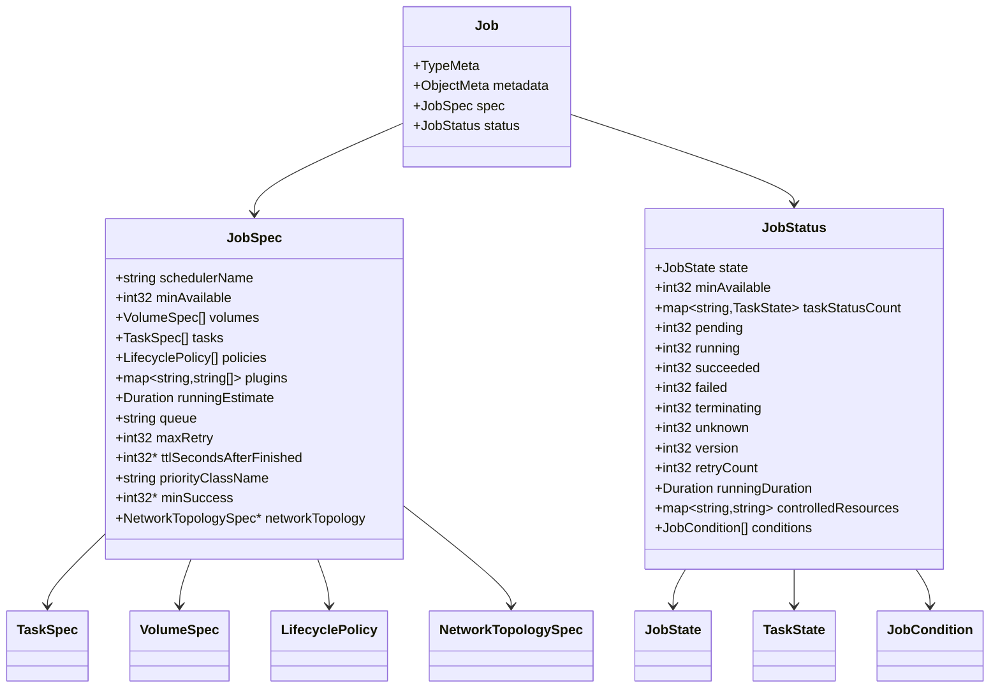
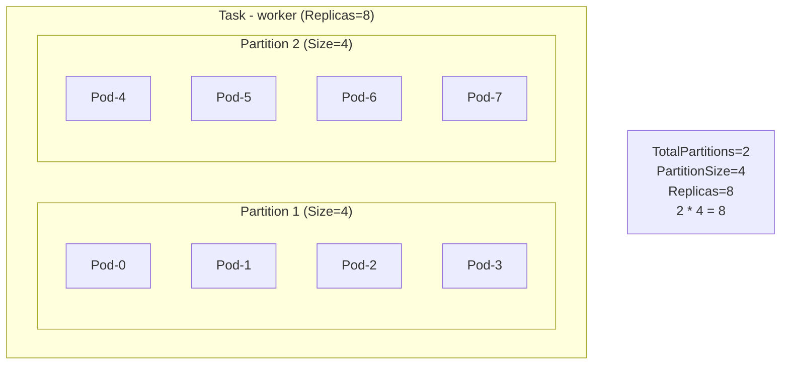
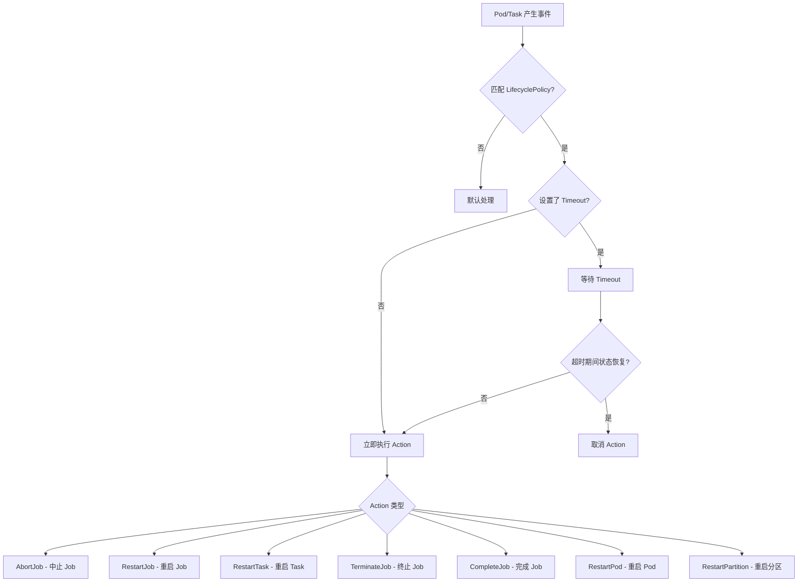
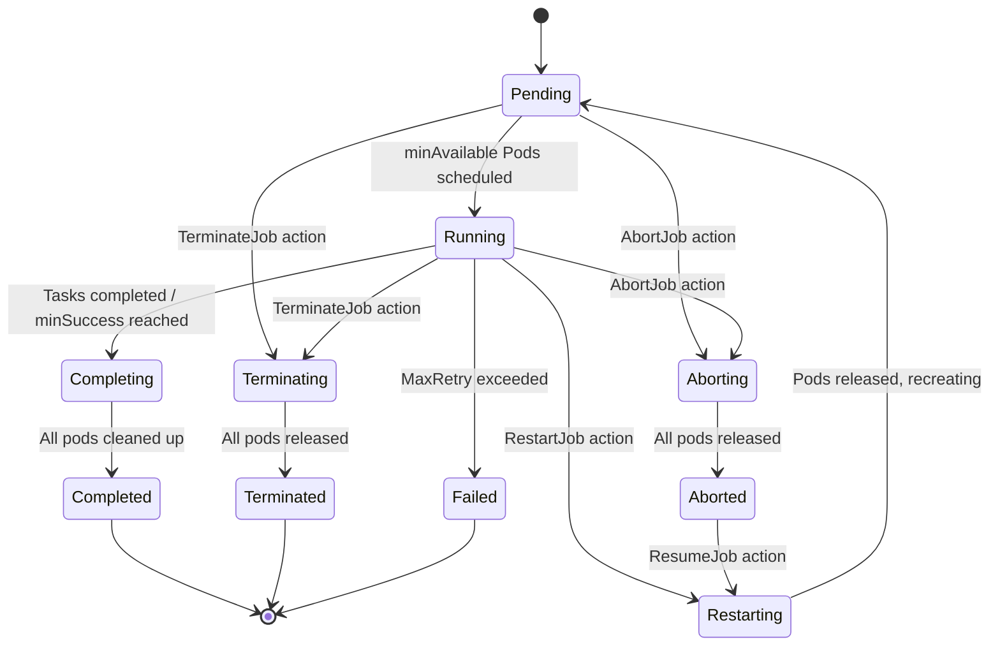
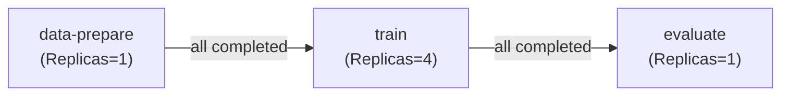

## 1. 概述

Volcano Job 是 Volcano 批量调度系统的核心 CRD，定义在 `batch.volcano.sh/v1alpha1` API Group 中。它扩展了 Kubernetes 原生 Job 的能力，提供了多任务（Multi-Task）、Gang 调度、生命周期策略、分区调度、网络拓扑感知等高级特性。

**源码位置**：`staging/src/volcano.sh/apis/pkg/apis/batch/v1alpha1/job.go`

### 1.1 CRD 注册信息

| 属性 | 值 |
|------|-----|
| API Group | `batch.volcano.sh` |
| API Version | `v1alpha1` |
| Kind | `Job` |
| Resource Path | `jobs` |
| Short Names | `vcjob`, `vj` |
| Scope | Namespaced |
| Subresource | `status` |

### 1.2 kubebuilder Markers

```go
// +genclient
// +k8s:deepcopy-gen:interfaces=k8s.io/apimachinery/pkg/runtime.Object
// +kubebuilder:object:root=true
// +kubebuilder:resource:path=jobs,shortName=vcjob;vj
// +kubebuilder:subresource:status
// +kubebuilder:printcolumn:name="STATUS",type=string,JSONPath=`.status.state.phase`
// +kubebuilder:printcolumn:name="minAvailable",type=integer,JSONPath=`.status.minAvailable`
// +kubebuilder:printcolumn:name="RUNNINGS",type=integer,JSONPath=`.status.running`
// +kubebuilder:printcolumn:name="AGE",type=date,JSONPath=`.metadata.creationTimestamp`
// +kubebuilder:printcolumn:name="QUEUE",type=string,priority=1,JSONPath=`.spec.queue`
```

### 1.3 kubectl 输出列

执行 `kubectl get vcjob` 时显示的列：

| 列名 | 类型 | JSONPath | 优先级 |
|------|------|---------|--------|
| STATUS | string | `.status.state.phase` | 默认 |
| minAvailable | integer | `.status.minAvailable` | 默认 |
| RUNNINGS | integer | `.status.running` | 默认 |
| AGE | date | `.metadata.creationTimestamp` | 默认 |
| QUEUE | string | `.spec.queue` | 1 (扩展) |

## 2. Job 顶层结构

```go
type Job struct {
    metav1.TypeMeta   `json:",inline"`
    metav1.ObjectMeta `json:"metadata,omitempty"`
    Spec   JobSpec    `json:"spec,omitempty"`
    Status JobStatus  `json:"status,omitempty"`
}
```



## 3. JobSpec 完整字段参考

### 3.1 字段总览

| 字段 | 类型 | 必填 | 默认值 | 验证规则 | 说明 |
|------|------|------|--------|---------|------|
| `schedulerName` | `string` | 否 | - | MaxLength=63 | 调度器名称，作为 tasks.template.spec.schedulerName 默认值 |
| `minAvailable` | `int32` | 否 | tasks replicas 之和 | Minimum=0 | Gang 调度最小可用 Pod 数 |
| `volumes` | `[]VolumeSpec` | 否 | - | - | Job 级别的卷挂载定义 |
| `tasks` | `[]TaskSpec` | 否 | - | MinItems=1 | 任务规格定义列表 |
| `policies` | `[]LifecyclePolicy` | 否 | - | - | 默认生命周期策略 |
| `plugins` | `map[string][]string` | 否 | - | - | 插件配置，Key=插件名，Value=参数列表 |
| `runningEstimate` | `*metav1.Duration` | 否 | nil | - | 用户预估的运行时长 |
| `queue` | `string` | 否 | `"default"` | MaxLength=253, DNS label pattern | 所属队列名称 |
| `maxRetry` | `int32` | 否 | `3` | Minimum=0 | 最大重试次数 |
| `ttlSecondsAfterFinished` | `*int32` | 否 | nil | Minimum=0 | 完成后自动清理等待秒数 |
| `priorityClassName` | `string` | 否 | - | MaxLength=253, DNS label pattern | 优先级类名称 |
| `minSuccess` | `*int32` | 否 | nil | Minimum=1 | 最小成功 Pod 数，达到即视为 Job 完成 |
| `networkTopology` | `*NetworkTopologySpec` | 否 | nil | - | 网络拓扑约束 |

### 3.2 schedulerName

指定调度器名称。该值会作为 `tasks[*].template.spec.schedulerName` 的默认值。当使用 Volcano Scheduler 时通常设置为 `"volcano"`。

```yaml
spec:
  schedulerName: volcano
```

### 3.3 minAvailable

定义 Gang 调度的最小可用 Pod 数。只有当集群能同时满足 `minAvailable` 个 Pod 的资源需求时，调度器才会开始调度该 Job 的 Pod。

- 若未设置，默认为所有 tasks 的 replicas 之和
- 设置为 0 表示不启用 Gang 调度

```yaml
spec:
  minAvailable: 4  # 至少 4 个 Pod 才能启动
  tasks:
    - name: worker
      replicas: 8
```

### 3.4 queue

指定 Job 所属的资源队列。调度器根据队列进行资源分配和公平调度。

- 默认值为 `"default"`
- 队列名称必须符合 DNS label 命名规范：`^[a-z0-9]([-a-z0-9]*[a-z0-9])?(\.[a-z0-9]([-a-z0-9]*[a-z0-9])?)*$`
- 最大长度 253 字符

### 3.5 maxRetry

Job 级别的最大重试次数。当 Job 因错误重启时，超过此次数将标记为 Failed。

- 默认值为 `3`
- 设置为 `0` 表示不重试

### 3.6 ttlSecondsAfterFinished

Job 完成（Completed 或 Failed）后，等待指定秒数自动删除：

- `nil` - 不自动删除
- `0` - 立即删除
- `N` - 等待 N 秒后删除

### 3.7 minSuccess

定义 Job 成功所需的最少 Pod 完成数。当成功完成的 Pod 数达到该值时，Job 即被视为成功完成。

- 未设置时需所有 Pod 成功
- Minimum=1

## 4. TaskSpec 详解

### 4.1 TaskSpec 结构

```go
type TaskSpec struct {
    Name            string              `json:"name,omitempty"`
    Replicas        int32               `json:"replicas,omitempty"`
    MinAvailable    *int32              `json:"minAvailable,omitempty"`
    Template        v1.PodTemplateSpec  `json:"template,omitempty"`
    Policies        []LifecyclePolicy   `json:"policies,omitempty"`
    TopologyPolicy  NumaPolicy          `json:"topologyPolicy,omitempty"`
    MaxRetry        int32               `json:"maxRetry,omitempty"`
    DependsOn       *DependsOn          `json:"dependsOn,omitempty"`
    PartitionPolicy *PartitionPolicySpec `json:"partitionPolicy,omitempty"`
}
```

### 4.2 字段说明

| 字段 | 类型 | 必填 | 默认值 | 验证规则 | 说明 |
|------|------|------|--------|---------|------|
| `name` | `string` | 否 | - | MaxLength=63, DNS label pattern | Task 名称 |
| `replicas` | `int32` | 否 | - | Minimum=0 | 该 Task 的 Pod 副本数 |
| `minAvailable` | `*int32` | 否 | 等于 replicas | Minimum=0 | Task 级 Gang 调度最小 Pod 数 |
| `template` | `v1.PodTemplateSpec` | 否 | - | - | Pod 模板定义 |
| `policies` | `[]LifecyclePolicy` | 否 | - | - | Task 级生命周期策略 |
| `topologyPolicy` | `NumaPolicy` | 否 | - | Enum: none/best-effort/restricted/single-numa-node | NUMA 拓扑策略 |
| `maxRetry` | `int32` | 否 | - | Minimum=0 | Task 级最大重试次数 |
| `dependsOn` | `*DependsOn` | 否 | - | - | Task 依赖定义 |
| `partitionPolicy` | `*PartitionPolicySpec` | 否 | - | - | 分区策略 |

### 4.3 NumaPolicy 枚举

`TopologyPolicy` 控制 NUMA 拓扑感知调度策略：

| 值 | 说明 |
|-----|------|
| `none` | 不启用 NUMA 拓扑感知 |
| `best-effort` | 尽力满足 NUMA 亲和性，不强制 |
| `restricted` | 严格遵守 NUMA 策略，但允许跨多个 NUMA 节点 |
| `single-numa-node` | 所有资源必须分配在同一个 NUMA 节点上 |

### 4.4 多 Task 示例

```yaml
spec:
  minAvailable: 3
  tasks:
    - name: ps
      replicas: 1
      template:
        spec:
          containers:
            - name: ps
              image: tensorflow/tensorflow:latest
    - name: worker
      replicas: 4
      minAvailable: 2
      template:
        spec:
          containers:
            - name: worker
              image: tensorflow/tensorflow:latest-gpu
              resources:
                limits:
                  nvidia.com/gpu: 1
```

## 5. PartitionPolicySpec 详解

### 5.1 结构定义

```go
type PartitionPolicySpec struct {
    TotalPartitions int32               `json:"totalPartitions"`
    PartitionSize   int32               `json:"partitionSize"`
    NetworkTopology *NetworkTopologySpec `json:"networkTopology,omitempty"`
    MinPartitions   int32               `json:"minPartitions,omitempty"`
}
```

### 5.2 字段说明

| 字段 | 类型 | 必填 | 默认值 | 验证规则 | 说明 |
|------|------|------|--------|---------|------|
| `totalPartitions` | `int32` | 是 | - | Minimum=1 | 总分区数 |
| `partitionSize` | `int32` | 是 | - | Minimum=1 | 每个分区包含的 Pod 数量 |
| `networkTopology` | `*NetworkTopologySpec` | 否 | - | - | 分区级网络拓扑约束 |
| `minPartitions` | `int32` | 否 | `0` | Minimum=0 | 最小分区数 |

### 5.3 核心约束规则

> **TotalPartitions * PartitionSize == Replicas**

分区策略将一个 Task 下的所有 Pod 分为多个组，每组内的 Pod 遵循相同的网络拓扑约束。



### 5.4 MinPartitions 的作用

`MinPartitions` 定义了最少需要调度成功的分区数。当集群资源不足以满足所有分区时，只要满足 `MinPartitions` 个分区的资源需求即可开始调度。

```yaml
spec:
  tasks:
    - name: worker
      replicas: 32
      partitionPolicy:
        totalPartitions: 4
        partitionSize: 8
        minPartitions: 2          # 至少 2 个分区(16 Pods)才能调度
        networkTopology:
          mode: hard
          highestTierAllowed: 2
```

## 6. VolumeSpec 详解

### 6.1 结构定义

```go
type VolumeSpec struct {
    MountPath       string                        `json:"mountPath"`
    VolumeClaimName string                        `json:"volumeClaimName,omitempty"`
    VolumeClaim     *v1.PersistentVolumeClaimSpec `json:"volumeClaim,omitempty"`
}
```

### 6.2 字段说明

| 字段 | 类型 | 必填 | 验证规则 | 说明 |
|------|------|------|---------|------|
| `mountPath` | `string` | 是 | MinLength=1, 不含 `:` | 容器内挂载路径 |
| `volumeClaimName` | `string` | 否 | MaxLength=253 | 引用已有 PVC 名称 |
| `volumeClaim` | `*PersistentVolumeClaimSpec` | 否 | - | 内联定义 PVC 规格 |

使用方式二选一：引用已有 PVC（`volumeClaimName`）或内联创建新 PVC（`volumeClaim`）。

```yaml
spec:
  volumes:
    - mountPath: /data
      volumeClaimName: shared-data
    - mountPath: /output
      volumeClaim:
        accessModes: [ "ReadWriteOnce" ]
        resources:
          requests:
            storage: 10Gi
```

## 7. LifecyclePolicy 详解

### 7.1 结构定义

```go
type LifecyclePolicy struct {
    Action   v1alpha1.Action   `json:"action,omitempty"`
    Event    v1alpha1.Event    `json:"event,omitempty"`
    Events   []v1alpha1.Event  `json:"events,omitempty"`
    ExitCode *int32            `json:"exitCode,omitempty"`
    Timeout  *metav1.Duration  `json:"timeout,omitempty"`
}
```

### 7.2 XOR 规则

> **Event/Events 和 ExitCode 是互斥的，只能设置其中之一。**

- 设置 `Event`/`Events`：根据 Pod 事件触发 Action
- 设置 `ExitCode`：根据容器退出码触发 Action

### 7.3 Action 枚举

| Action | 说明 | 适用级别 |
|--------|------|---------|
| `AbortJob` | 中止整个 Job，驱逐所有 Pod，不再重建 | Job/Task |
| `RestartJob` | 重启整个 Job | Job/Task |
| `RestartTask` | 仅重启对应 Task 的所有 Pod | Task |
| `RestartPod` | 仅重启触发事件的单个 Pod | Task (Pod 级事件) |
| `RestartPartition` | 重启整个分区组的 Pod | Task (分区场景) |
| `TerminateJob` | 终止 Job，不可恢复 | Job/Task |
| `CompleteJob` | 标记 Job 完成，清理未完成 Pod | Job/Task |
| `ResumeJob` | 恢复被中止的 Job | Job |

### 7.4 Event 枚举

| Event | 说明 |
|-------|------|
| `*` | 匹配所有事件 |
| `PodPending` | Pod 处于 Pending 状态 |
| `PodRunning` | Pod 处于 Running 状态 |
| `PodFailed` | Pod 失败 |
| `PodEvicted` | Pod 被驱逐 |
| `Unknown` | 任务不可调度（部分 Pod 调度成功但整体无法满足） |
| `TaskCompleted` | Task 内所有 Replicas 的 Pod 成功完成 |
| `TaskFailed` | Task 异常结束 |

### 7.5 生命周期策略流程



### 7.6 策略配置示例

```yaml
spec:
  # Job 级策略
  policies:
    - event: PodEvicted
      action: RestartJob
    - event: PodFailed
      action: AbortJob
      timeout: 30s
  tasks:
    - name: worker
      replicas: 4
      # Task 级策略（覆盖 Job 级策略）
      policies:
        - event: PodFailed
          action: RestartTask
        - exitCode: 137        # OOMKilled
          action: RestartPod
```

## 8. JobStatus 详解

### 8.1 结构定义

```go
type JobStatus struct {
    State               JobState                `json:"state,omitempty"`
    MinAvailable        int32                   `json:"minAvailable,omitempty"`
    TaskStatusCount     map[string]TaskState    `json:"taskStatusCount,omitempty"`
    Pending             int32                   `json:"pending,omitempty"`
    Running             int32                   `json:"running,omitempty"`
    Succeeded           int32                   `json:"succeeded,omitempty"`
    Failed              int32                   `json:"failed,omitempty"`
    Terminating         int32                   `json:"terminating,omitempty"`
    Unknown             int32                   `json:"unknown,omitempty"`
    Version             int32                   `json:"version,omitempty"`
    RetryCount          int32                   `json:"retryCount,omitempty"`
    RunningDuration     *metav1.Duration        `json:"runningDuration,omitempty"`
    ControlledResources map[string]string       `json:"controlledResources,omitempty"`
    Conditions          []JobCondition          `json:"conditions,omitempty"`
}
```

### 8.2 字段说明

| 字段 | 类型 | 说明 |
|------|------|------|
| `state` | `JobState` | 当前 Job 状态（Phase/Reason/Message/LastTransitionTime） |
| `minAvailable` | `int32` | 生效的最小可用 Pod 数 |
| `taskStatusCount` | `map[string]TaskState` | 每个 Task 的 Pod 状态分布 |
| `pending` | `int32` | Pending 状态 Pod 数 |
| `running` | `int32` | Running 状态 Pod 数 |
| `succeeded` | `int32` | Succeeded 状态 Pod 数 |
| `failed` | `int32` | Failed 状态 Pod 数 |
| `terminating` | `int32` | Terminating 状态 Pod 数 |
| `unknown` | `int32` | Unknown 状态 Pod 数 |
| `version` | `int32` | Job 当前版本号 |
| `retryCount` | `int32` | 已重试次数 |
| `runningDuration` | `*metav1.Duration` | 从 Running 到完成的运行时长 |
| `controlledResources` | `map[string]string` | Job 控制的资源（如 Service, ConfigMap） |
| `conditions` | `[]JobCondition` | Job 条件历史记录 |

### 8.3 JobState 结构

```go
type JobState struct {
    Phase             JobPhase    `json:"phase,omitempty"`
    Reason            string      `json:"reason,omitempty"`
    Message           string      `json:"message,omitempty"`
    LastTransitionTime metav1.Time `json:"lastTransitionTime,omitempty"`
}
```

### 8.4 TaskState 结构

```go
type TaskState struct {
    Phase map[v1.PodPhase]int32 `json:"phase,omitempty"`
}
```

`TaskState` 记录了每个 Task 下各 PodPhase 的 Pod 数量。例如：

```json
{
  "taskStatusCount": {
    "worker": {
      "phase": {
        "Running": 3,
        "Pending": 1
      }
    }
  }
}
```

## 9. JobPhase 枚举与状态流转

### 9.1 所有 JobPhase

| Phase | 值 | 说明 |
|-------|-----|------|
| Pending | `"Pending"` | Job 在队列中等待调度 |
| Aborting | `"Aborting"` | Job 正在中止，等待释放 Pod |
| Aborted | `"Aborted"` | Job 已被中止（可通过 ResumeJob 恢复） |
| Running | `"Running"` | 满足 minAvailable 的 Pod 已运行 |
| Restarting | `"Restarting"` | Job 正在重启，等待 Pod 释放和重建 |
| Completing | `"Completing"` | 所需 Task 已完成，Job 开始清理 |
| Completed | `"Completed"` | 所有 Task 成功完成 |
| Terminating | `"Terminating"` | Job 正在终止，等待释放 Pod |
| Terminated | `"Terminated"` | Job 异常结束（如事件触发） |
| Failed | `"Failed"` | Job 达到最大重试次数后失败 |

### 9.2 状态流转图



### 9.3 JobCondition

```go
type JobCondition struct {
    Status             JobPhase     `json:"status"`
    LastTransitionTime *metav1.Time `json:"lastTransitionTime,omitempty"`
}
```

`Conditions` 记录了 Job 的状态转换历史，每次 Phase 变化都会追加一条记录。

## 10. NetworkTopologySpec 详解

### 10.1 结构定义

```go
type NetworkTopologySpec struct {
    Mode               NetworkTopologyMode `json:"mode,omitempty"`
    HighestTierAllowed *int                `json:"highestTierAllowed,omitempty"`
    HighestTierName    string              `json:"highestTierName,omitempty"`
}
```

### 10.2 字段说明

| 字段 | 类型 | 默认值 | 说明 |
|------|------|--------|------|
| `mode` | `NetworkTopologyMode` | `"hard"` | 拓扑约束模式 |
| `highestTierAllowed` | `*int` | nil | 允许跨越的最高层级（数字） |
| `highestTierName` | `string` | - | 允许跨越的最高层级名称 |

### 10.3 互斥规则

> **HighestTierAllowed 和 HighestTierName 不能同时设置。**

- `HighestTierAllowed` 按层级编号指定
- `HighestTierName` 按层级名称指定

### 10.4 Mode 说明

| Mode | 说明 |
|------|------|
| `hard` | 严格模式 - Job 的所有 Pod 必须在指定拓扑范围内，否则不调度 |
| `soft` | 柔性模式 - 尽力将 Pod 调度到同一拓扑范围，允许跨边界 |

### 10.5 配置示例

```yaml
spec:
  networkTopology:
    mode: hard
    highestTierAllowed: 2
  tasks:
    - name: worker
      replicas: 8
      # 使用 partitionPolicy 结合拓扑约束
      partitionPolicy:
        totalPartitions: 2
        partitionSize: 4
        networkTopology:
          mode: hard
          highestTierAllowed: 1   # 分区内更严格
```

## 11. DependsOn 与 Iteration

### 11.1 结构定义

```go
type DependsOn struct {
    Name      []string  `json:"name,omitempty"`
    Iteration Iteration `json:"iteration,omitempty"`
}
```

### 11.2 Iteration 模式

| 值 | 说明 |
|-----|------|
| `any` | 任意一个依赖 Task 达到指定状态即触发调度 |
| `all` | 所有依赖 Task 必须达到指定状态才触发调度 |

### 11.3 Task 依赖示例

```yaml
spec:
  tasks:
    - name: data-prepare
      replicas: 1
      template: ...

    - name: train
      replicas: 4
      dependsOn:
        name: ["data-prepare"]
        iteration: all     # 等待 data-prepare 完全完成
      template: ...

    - name: evaluate
      replicas: 1
      dependsOn:
        name: ["train"]
        iteration: all
      template: ...
```

### 11.4 依赖调度流程



## 12. CronJob API

CronJob 定义在同一 API Group 下，Short Names 为 `cronvcjob` / `cronvj`，Namespaced 作用域。核心字段包括 `schedule`（Cron 表达式）、`jobTemplate`（Job 模板）、`concurrencyPolicy`（`Allow`/`Forbid`/`Replace`）、`suspend`（暂停调度）、`successfulJobsHistoryLimit`（默认 3）和 `failedJobsHistoryLimit`（默认 1）。

## 13. 总结

Volcano Job API 提供了丰富的功能来支持复杂的批量计算场景：

| 特性 | 对应字段/机制 |
|------|-------------|
| Gang 调度 | `minAvailable` (Job/Task 级) |
| 多任务编排 | `tasks[]`, `dependsOn` |
| 生命周期管理 | `policies[]`, Action/Event 机制 |
| 分区调度 | `partitionPolicy` |
| 网络拓扑感知 | `networkTopology` |
| NUMA 亲和 | `topologyPolicy` |
| 自动清理 | `ttlSecondsAfterFinished` |
| 定时调度 | CronJob |
| 容错重试 | `maxRetry` (Job/Task 级) |
| 资源队列 | `queue` |
