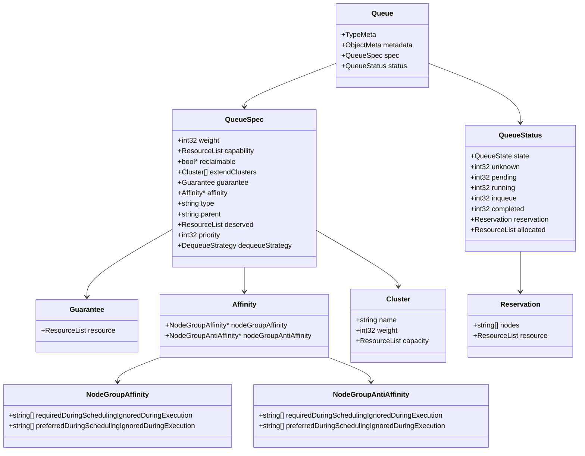
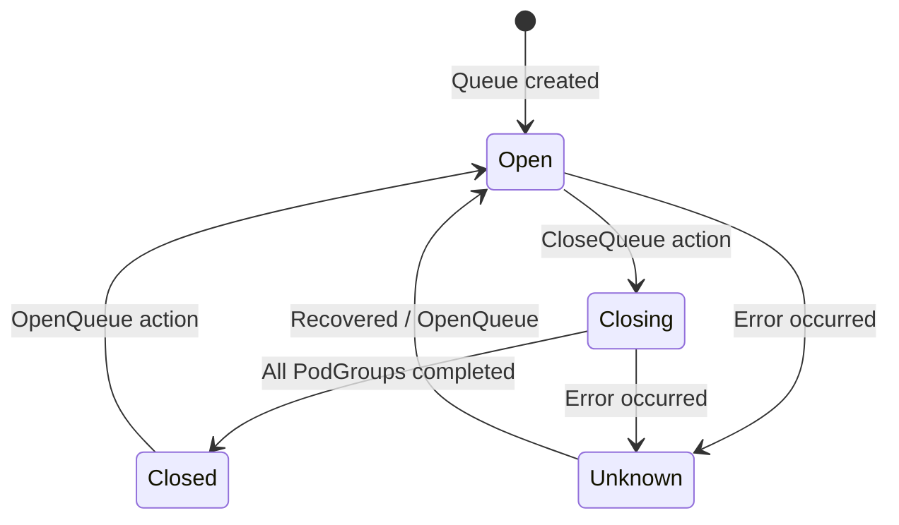
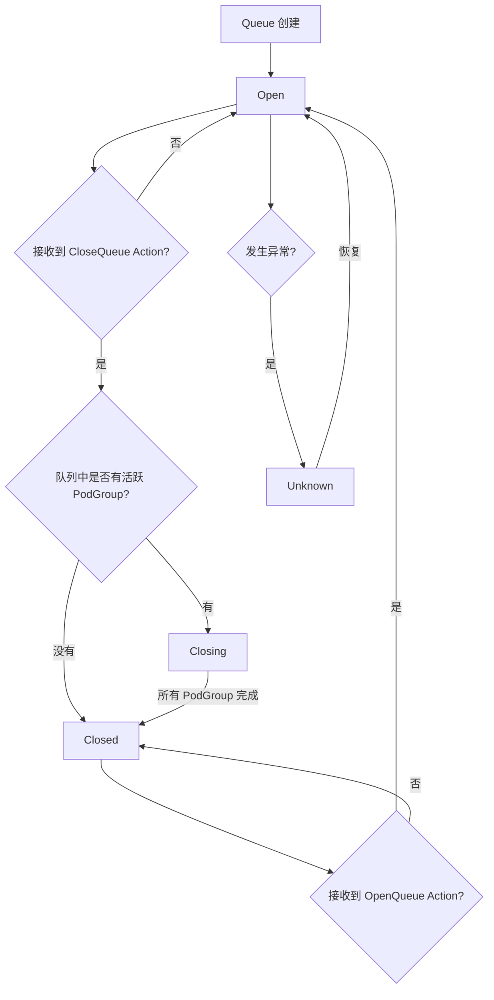
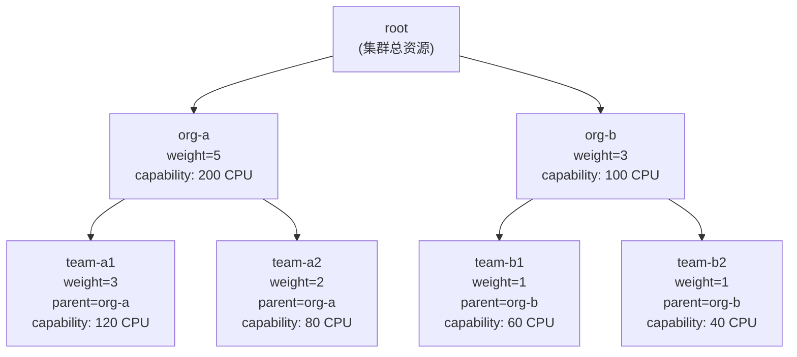
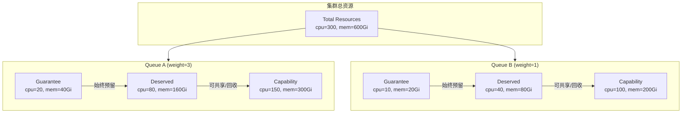
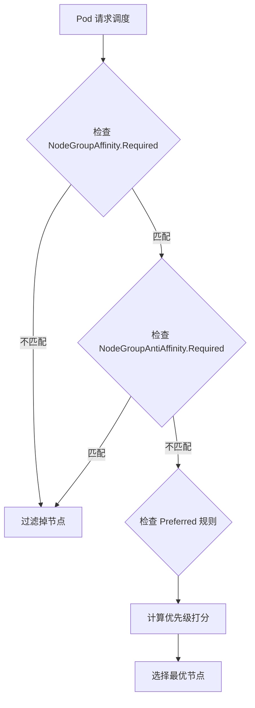
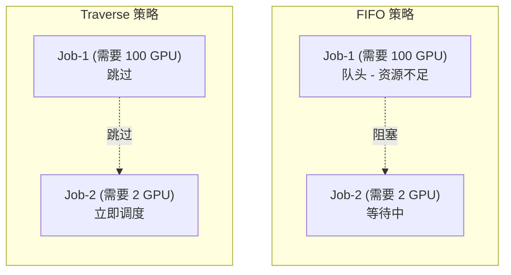
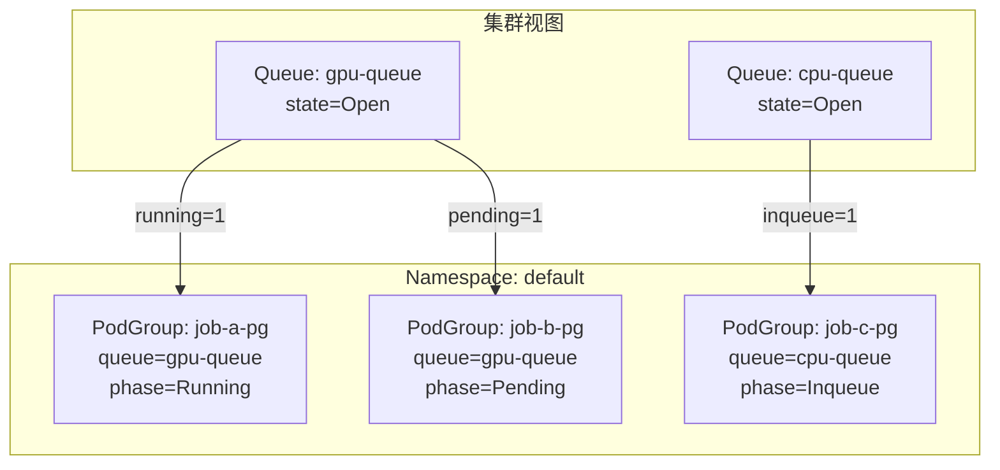

## 1. 概述

Queue 是 Volcano 调度系统中资源管理和公平调度的核心 CRD，定义在 `scheduling.volcano.sh/v1beta1` API Group 中。Queue 是 **Cluster-scoped** 的资源，它将集群的计算资源划分为多个逻辑分区，为不同团队或项目提供资源配额、优先级控制和公平共享机制。

**源码位置**：`staging/src/volcano.sh/apis/pkg/apis/scheduling/v1beta1/types.go`

### 1.1 CRD 注册信息

| 属性 | 值 |
|------|-----|
| API Group | `scheduling.volcano.sh` |
| API Version | `v1beta1` |
| Kind | `Queue` |
| Resource Path | `queues` |
| Short Names | `q`, `queue-v1beta1` |
| Scope | **Cluster** |
| Subresource | `status` |

### 1.2 kubebuilder Markers

```go
// +genclient
// +genclient:nonNamespaced
// +k8s:deepcopy-gen:interfaces=k8s.io/apimachinery/pkg/runtime.Object
// +kubebuilder:object:root=true
// +kubebuilder:resource:path=queues,scope=Cluster,shortName=q;queue-v1beta1
// +kubebuilder:subresource:status
// +kubebuilder:printcolumn:name="PARENT",type=string,JSONPath=`.spec.parent`
```

注意与 Job 的关键区别：
- `+genclient:nonNamespaced` - 表明 Queue 是 Cluster 级别资源
- `scope=Cluster` - 明确声明集群作用域
- 输出列包含 `PARENT` 用于展示层级队列关系

### 1.3 kubectl 输出列

执行 `kubectl get queue` 时显示的列：

| 列名 | 类型 | JSONPath | 说明 |
|------|------|---------|------|
| PARENT | string | `.spec.parent` | 父队列名称 |

## 2. Queue 顶层结构

```go
type Queue struct {
    metav1.TypeMeta   `json:",inline"`
    metav1.ObjectMeta `json:"metadata,omitempty"`
    Spec   QueueSpec   `json:"spec,omitempty"`
    Status QueueStatus `json:"status,omitempty"`
}
```



## 3. QueueSpec 完整字段参考

### 3.1 字段总览

| 字段 | 类型 | 必填 | 默认值 | 验证规则 | 说明 |
|------|------|------|--------|---------|------|
| `weight` | `int32` | 否 | `1` | Minimum=1, Maximum=65535 | 队列权重，用于公平调度 |
| `capability` | `v1.ResourceList` | 否 | - | - | 队列资源上限 |
| `reclaimable` | `*bool` | 否 | - | - | 是否允许其他队列回收资源 |
| `extendClusters` | `[]Cluster` | 否 | - | - | 多集群分发配置 |
| `guarantee` | `Guarantee` | 否 | - | - | 资源预留保证 |
| `affinity` | `*Affinity` | 否 | - | - | 节点组亲和/反亲和规则 |
| `type` | `string` | 否 | - | MaxLength=253 | 队列类型 |
| `parent` | `string` | 否 | - | MaxLength=253, DNS label pattern | 父队列名称（层级队列） |
| `deserved` | `v1.ResourceList` | 否 | - | - | 应得资源量 |
| `priority` | `int32` | 否 | - | Minimum=0 | 队列优先级 |
| `dequeueStrategy` | `DequeueStrategy` | 否 | `"traverse"` | Enum: fifo/traverse | 出队策略 |

### 3.2 weight - 队列权重

`weight` 是 Volcano 公平调度（Fair-Share）算法的核心参数，决定了多个队列之间的资源分配比例。

```yaml
# 假设集群有 100 GPU
apiVersion: scheduling.volcano.sh/v1beta1
kind: Queue
metadata:
  name: team-a
spec:
  weight: 3    # 获得 3/(3+1) = 75% 的资源
---
apiVersion: scheduling.volcano.sh/v1beta1
kind: Queue
metadata:
  name: team-b
spec:
  weight: 1    # 获得 1/(3+1) = 25% 的资源
```

**资源分配公式**：

```
队列份额 = 队列权重 / 所有活跃队列权重之和 * 集群总资源
```

### 3.3 capability - 资源上限

`capability` 定义了队列可使用的最大资源量。即使集群有空闲资源，队列的总消耗也不会超过此上限。

```yaml
spec:
  capability:
    cpu: "100"
    memory: "200Gi"
    nvidia.com/gpu: "16"
```

### 3.4 reclaimable - 可回收性

控制队列是否允许被其他队列回收超额使用的资源：

| 值 | 说明 |
|-----|------|
| `true` | 允许回收 - 当其他队列需要资源时，超额部分可被回收 |
| `false` | 不允许回收 - 即使超额使用，资源也不会被回收 |
| `nil` (未设置) | 由全局策略决定 |

```yaml
spec:
  reclaimable: true
```

### 3.5 guarantee - 资源保证

`guarantee` 定义了队列的最低资源保证量。即使队列中没有活跃作业，系统也会为该队列预留这些资源。

```go
type Guarantee struct {
    Resource v1.ResourceList `json:"resource,omitempty"`
}
```

```yaml
spec:
  guarantee:
    resource:
      cpu: "10"
      memory: "20Gi"
      nvidia.com/gpu: "4"
```

### 3.6 deserved - 应得资源

`deserved` 表示用户配置的应得资源量。这部分资源可以与其他队列共享，也可以被回收。

```yaml
spec:
  deserved:
    cpu: "50"
    memory: "100Gi"
```

### 3.7 priority - 队列优先级

`priority` 控制队列的调度优先级和回收顺序：

- **调度时** - 优先级高的队列优先获得资源分配
- **回收时** - 优先级低的队列先被回收资源
- 最小值为 0

```yaml
spec:
  priority: 100    # 优先级更高
```

### 3.8 extendClusters - 多集群扩展

`extendClusters` 用于多集群联邦调度场景，定义 Job 可以分发到哪些集群。

```go
type Cluster struct {
    Name     string          `json:"name,omitempty"`
    Weight   int32           `json:"weight,omitempty"`
    Capacity v1.ResourceList `json:"capacity,omitempty"`
}
```

```yaml
spec:
  extendClusters:
    - name: cluster-beijing
      weight: 3
      capacity:
        cpu: "1000"
        memory: "2000Gi"
    - name: cluster-shanghai
      weight: 1
      capacity:
        cpu: "500"
        memory: "1000Gi"
```

## 4. QueueStatus 详解

### 4.1 结构定义

```go
type QueueStatus struct {
    State       QueueState    `json:"state,omitempty"`
    Unknown     int32         `json:"unknown,omitempty"`
    Pending     int32         `json:"pending,omitempty"`
    Running     int32         `json:"running,omitempty"`
    Inqueue     int32         `json:"inqueue,omitempty"`
    Completed   int32         `json:"completed,omitempty"`
    Reservation Reservation   `json:"reservation,omitempty"`
    Allocated   v1.ResourceList `json:"allocated"`
}
```

### 4.2 字段说明

| 字段 | 类型 | 说明 |
|------|------|------|
| `state` | `QueueState` | 队列当前状态 |
| `unknown` | `int32` | Unknown 状态的 PodGroup 数量 |
| `pending` | `int32` | Pending 状态的 PodGroup 数量 |
| `running` | `int32` | Running 状态的 PodGroup 数量 |
| `inqueue` | `int32` | Inqueue 状态的 PodGroup 数量 |
| `completed` | `int32` | Completed 状态的 PodGroup 数量 |
| `reservation` | `Reservation` | 资源预留状态 |
| `allocated` | `v1.ResourceList` | 已分配资源总量 |

### 4.3 Reservation 结构

```go
type Reservation struct {
    Nodes    []string        `json:"nodes,omitempty"`
    Resource v1.ResourceList `json:"resource,omitempty"`
}
```

| 字段 | 类型 | 说明 |
|------|------|------|
| `nodes` | `[]string` | 为队列锁定的节点列表 |
| `resource` | `v1.ResourceList` | 锁定节点上的空闲资源总量 |

### 4.4 Status 示例

```json
{
  "status": {
    "state": "Open",
    "pending": 2,
    "running": 5,
    "inqueue": 3,
    "completed": 10,
    "unknown": 0,
    "allocated": {
      "cpu": "40",
      "memory": "80Gi",
      "nvidia.com/gpu": "8"
    },
    "reservation": {
      "nodes": ["node-1", "node-2"],
      "resource": {
        "cpu": "10",
        "memory": "20Gi"
      }
    }
  }
}
```

## 5. QueueState 枚举与状态流转

### 5.1 状态定义

| State | 值 | 说明 |
|-------|-----|------|
| Open | `"Open"` | 队列已开启，可以接收和调度 Job |
| Closed | `"Closed"` | 队列已关闭，不接收新 Job |
| Closing | `"Closing"` | 队列正在关闭中，等待现有 Job 完成 |
| Unknown | `"Unknown"` | 队列状态未知 |

### 5.2 状态流转图



### 5.3 状态转换触发条件



### 5.4 QueueAction 与 QueueEvent

Queue 控制器通过以下 Action 和 Event 驱动状态转换：

**QueueAction**：

| Action | 说明 |
|--------|------|
| `SyncQueue` | 同步队列状态 |
| `OpenQueue` | 打开队列 |
| `CloseQueue` | 关闭队列 |

**QueueEvent**：

| Event | 说明 |
|-------|------|
| `OutOfSync` | PodGroup 或 Queue 被更新时触发 |
| `CommandIssued` | 用户发出命令时触发 |

## 6. 层级队列

### 6.1 Parent 字段

通过 `parent` 字段实现队列层级化管理。子队列的资源受父队列约束。

```yaml
# 根队列
apiVersion: scheduling.volcano.sh/v1beta1
kind: Queue
metadata:
  name: org-a
spec:
  weight: 5
  capability:
    cpu: "200"
    memory: "400Gi"
---
# 子队列 1
apiVersion: scheduling.volcano.sh/v1beta1
kind: Queue
metadata:
  name: team-a1
spec:
  weight: 3
  parent: org-a
  capability:
    cpu: "120"
    memory: "240Gi"
---
# 子队列 2
apiVersion: scheduling.volcano.sh/v1beta1
kind: Queue
metadata:
  name: team-a2
spec:
  weight: 2
  parent: org-a
  capability:
    cpu: "80"
    memory: "160Gi"
```

### 6.2 层级队列结构图



### 6.3 层级 Annotations

除了 `parent` 字段外，还可以使用注解定义更复杂的层级关系：

| Annotation | 说明 | 示例 |
|------------|------|------|
| `volcano.sh/hierarchy-annotation` | 队列层级路径 | `"root/org-a/team-a1"` |
| `volcano.sh/hierarchy-weight-annotation` | 层级权重路径 | `"1/5/3"` |

```yaml
apiVersion: scheduling.volcano.sh/v1beta1
kind: Queue
metadata:
  name: team-a1
  annotations:
    volcano.sh/hierarchy-annotation: "root/org-a/team-a1"
    volcano.sh/hierarchy-weight-annotation: "1/5/3"
spec:
  weight: 3
```

### 6.4 层级约束规则

层级队列中，资源分配遵循以下约束：

1. **子队列 capability 之和** 不应超过父队列 capability
2. **子队列 weight** 用于在同级队列之间进行公平调度
3. **资源继承** - 子队列的最大可用资源受限于父队列

## 7. 资源约束关系

### 7.1 三层资源模型

Queue 的资源管理涉及三个层次的资源量：

```
Guarantee <= Deserved <= Capability
```

| 层次 | 字段 | 含义 |
|------|------|------|
| 最低保证 | `guarantee.resource` | 不论是否有活跃作业，始终为队列预留的资源 |
| 应得资源 | `deserved` | 用户期望获得的资源量，可共享和回收 |
| 资源上限 | `capability` | 队列可使用的最大资源量 |

### 7.2 资源借用与回收机制

当 Queue A 空闲时，Queue B 可以借用其资源（前提 `reclaimable=true`）。当 Queue A 提交新 Job 时，调度器回收借出的资源。在层级队列模型中，子队列的 `guarantee`/`capability`/`deserved` 之和不应超过父队列对应值。



## 8. Affinity 模型

Affinity 包含 `NodeGroupAffinity` 和 `NodeGroupAntiAffinity`，各有 `RequiredDuringSchedulingIgnoredDuringExecution`（硬约束）和 `PreferredDuringSchedulingIgnoredDuringExecution`（软约束）两种规则。

| 规则类型 | 含义 | 强度 |
|---------|------|------|
| `NodeGroupAffinity.Required` | 队列 Pod 必须调度到指定节点组 | 硬约束 |
| `NodeGroupAffinity.Preferred` | 队列 Pod 优先调度到指定节点组 | 软约束 |
| `NodeGroupAntiAffinity.Required` | 队列 Pod 必须不调度到指定节点组 | 硬约束 |
| `NodeGroupAntiAffinity.Preferred` | 队列 Pod 尽量不调度到指定节点组 | 软约束 |



## 9. DequeueStrategy - 出队策略

| 特性 | FIFO (`fifo`) | Traverse (`traverse`, 默认) |
|------|------|----------|
| 行为 | 严格先进先出 | 遍历跳过不可调度的 Job |
| 队头阻塞 | 有 - 大 Job 阻塞后续所有 Job | 无 - 跳过无法调度的 Job |
| 适用场景 | 对顺序有严格要求 | 通用场景，避免饥饿 |



## 10. PodGroup 关联

PodGroup 是与 Queue 紧密关联的资源（Short Names: `pg`/`podgroup-v1beta1`，Namespaced），每个 Volcano Job 自动创建对应 PodGroup。Queue Status 中统计各 PodGroup Phase 的数量：`Pending`（资源不足）、`Inqueue`（可创建 Pod）、`Running`（minMember 满足）、`Unknown`（部分调度成功）、`Completed`（全部完成）。



## 11. 默认队列

Volcano 内置名为 `default` 的队列（`const DefaultQueue = "default"`），所有未指定 `spec.queue` 的 Job 和 PodGroup 默认分配到该队列。该队列在 Volcano 部署时自动创建。

## 12. 完整 YAML 示例

```yaml
apiVersion: scheduling.volcano.sh/v1beta1
kind: Queue
metadata:
  name: research-queue
spec:
  weight: 5
  capability:
    cpu: "200"
    memory: "400Gi"
    nvidia.com/gpu: "32"
  reclaimable: true
  guarantee:
    resource:
      cpu: "50"
      memory: "100Gi"
      nvidia.com/gpu: "8"
  deserved:
    cpu: "150"
    memory: "300Gi"
    nvidia.com/gpu: "24"
  priority: 50
  dequeueStrategy: traverse
  affinity:
    nodeGroupAffinity:
      requiredDuringSchedulingIgnoredDuringExecution:
        - gpu-node-group
---
# 层级队列示例
apiVersion: scheduling.volcano.sh/v1beta1
kind: Queue
metadata:
  name: team-nlp
spec:
  weight: 3
  parent: org-ai
  capability:
    cpu: "200"
    memory: "400Gi"
    nvidia.com/gpu: "64"
  guarantee:
    resource:
      cpu: "40"
      memory: "80Gi"
  reclaimable: true
  priority: 80
```

## 13. 总结

Queue API 是 Volcano 资源管理体系的核心，提供了从简单队列到复杂层级资源管理的完整解决方案：

| 能力 | 对应机制 |
|------|---------|
| 公平调度 | `weight` 权重分配 |
| 资源上限 | `capability` 上限控制 |
| 资源保证 | `guarantee` 最低预留 |
| 资源共享 | `reclaimable` + `deserved` |
| 层级管理 | `parent` + hierarchy annotations |
| 优先级控制 | `priority` 调度/回收优先级 |
| 节点亲和 | `affinity` 节点组规则 |
| 出队策略 | `dequeueStrategy` FIFO/Traverse |
| 多集群 | `extendClusters` 联邦调度 |
| 状态管理 | Open/Closed/Closing 状态机 |

Queue 作为 `scheduling.volcano.sh/v1beta1` 中已毕业到 Beta 版本的 API，其核心功能已经过大量生产验证，是 Volcano 中最稳定的 API 之一。
