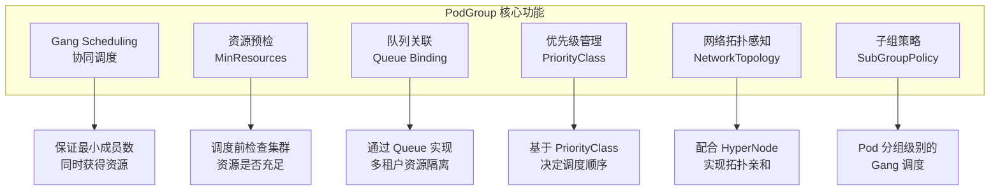
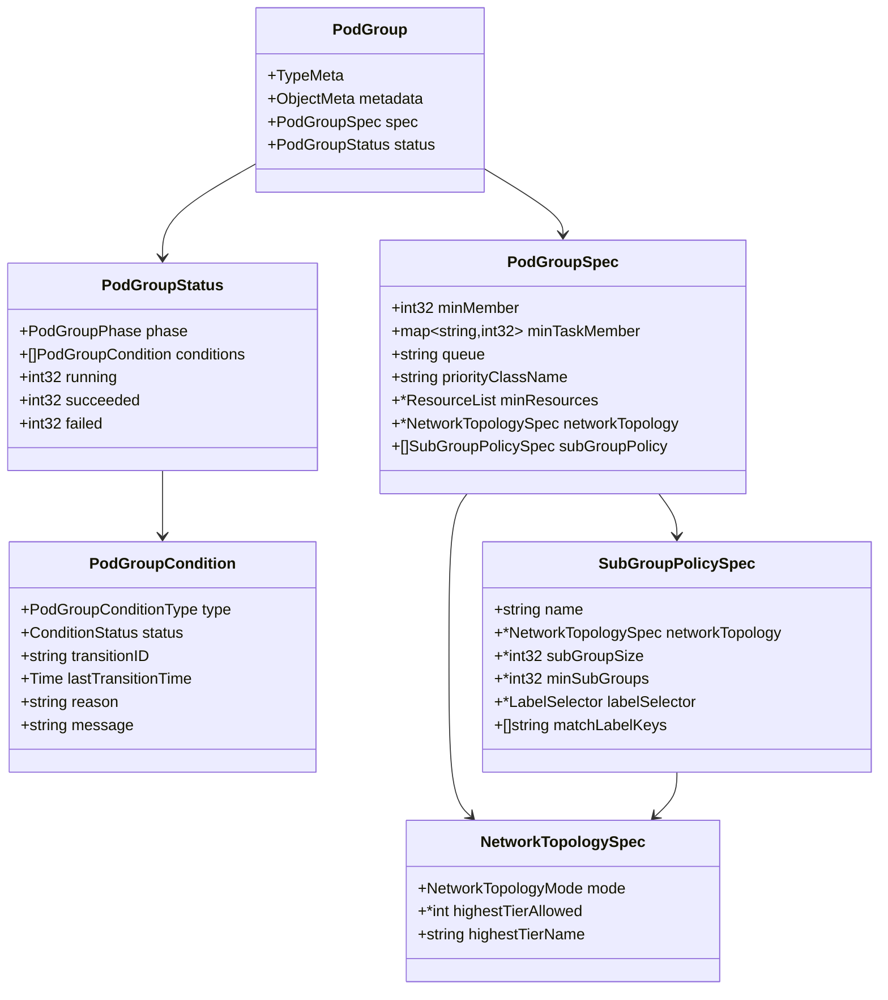
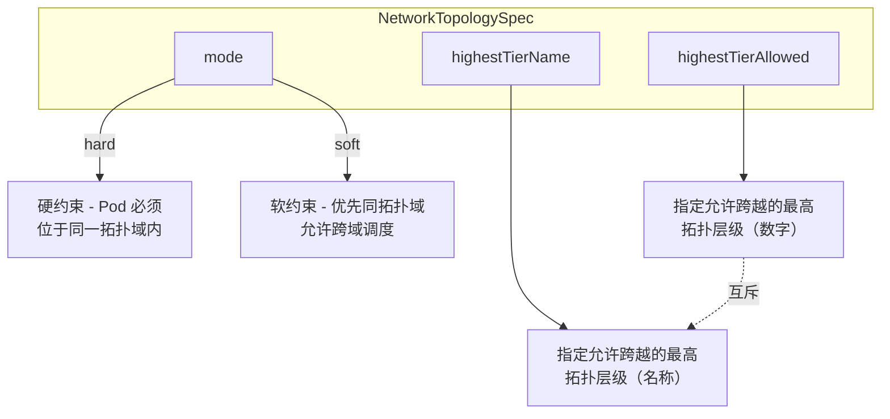
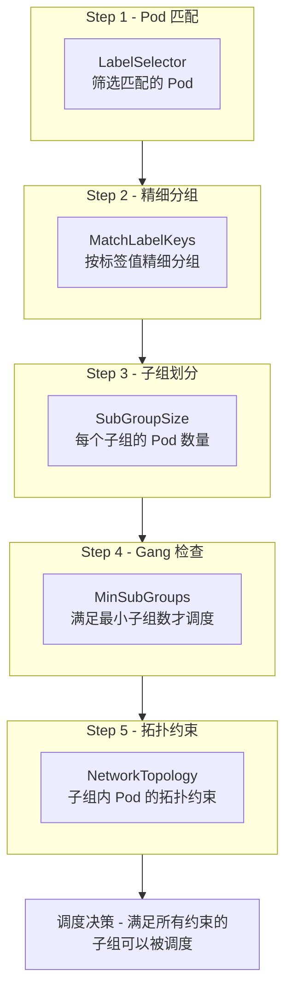
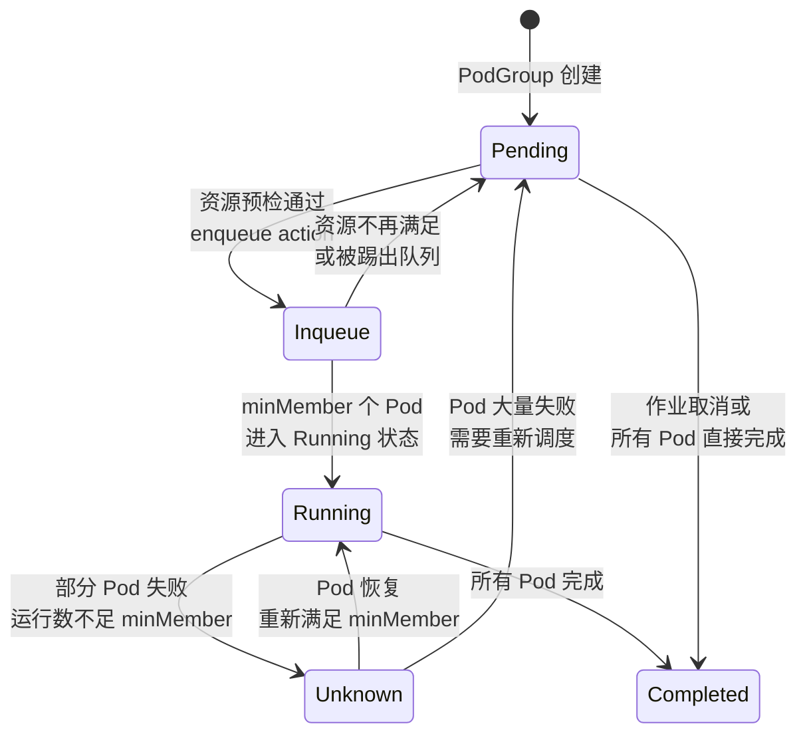
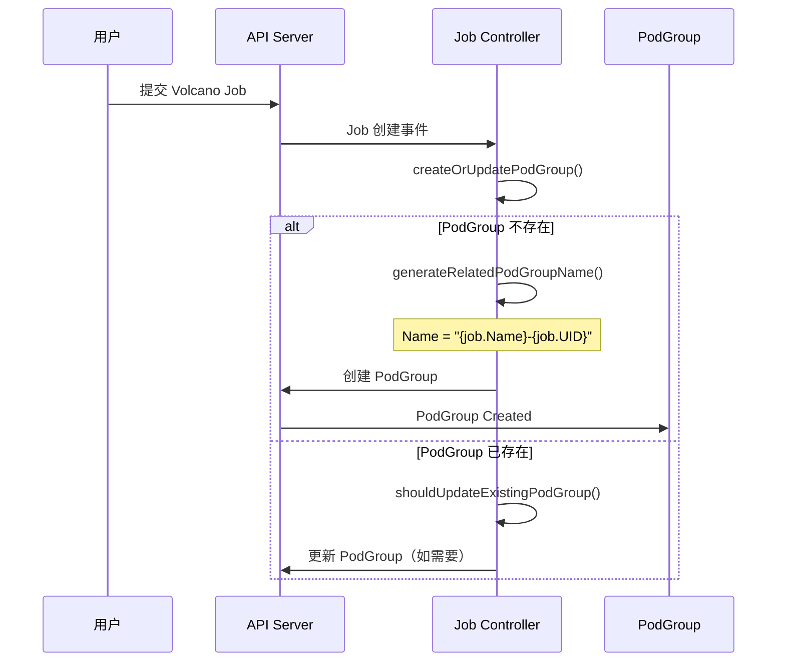
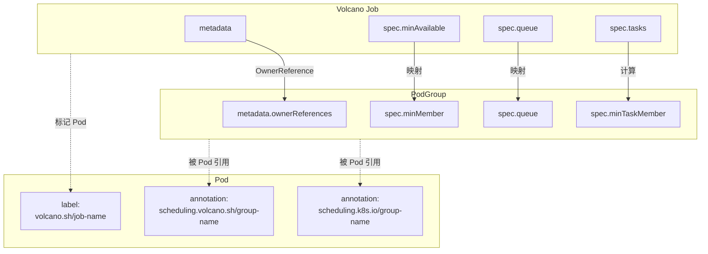
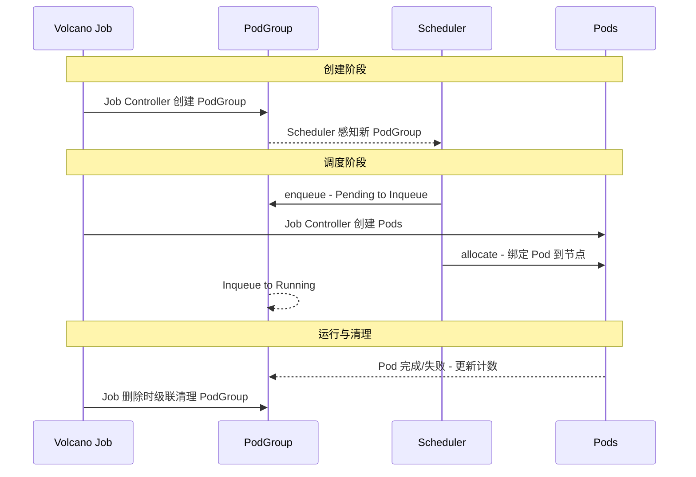
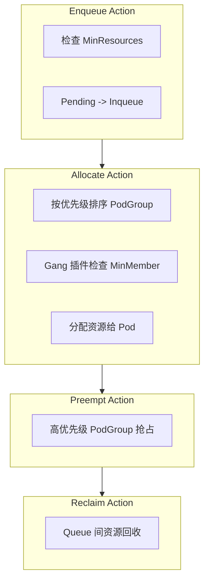

> 基于 `scheduling.volcano.sh/v1beta1` 版本的 PodGroup CRD 完整 API 参考文档。
>
> 源码路径: `staging/src/volcano.sh/apis/pkg/apis/scheduling/v1beta1/types.go`

---

## 1. 概述

PodGroup 是 Volcano 调度系统中的核心资源对象，用于将一组相关联的 Pod 组织在一起，实现 **Gang Scheduling**（协同调度）语义。PodGroup 确保要么所有必需的 Pod 同时获得资源开始运行，要么全部不启动，避免资源死锁和浪费。

### 1.1 CRD 基本信息

| 属性 | 值 |
|------|------|
| **API Group** | `scheduling.volcano.sh` |
| **API Version** | `v1beta1` |
| **Kind** | `PodGroup` |
| **Scope** | Namespaced |
| **Short Names** | `pg`, `podgroup-v1beta1` |
| **Subresource** | `status` |
| **PrintColumns** | STATUS, minMember, RUNNINGS, AGE, QUEUE(priority=1) |

### 1.2 核心功能定位



---

## 2. PodGroup 资源结构



---

## 3. PodGroupSpec 完整字段

### 3.1 MinMember

| 属性 | 值 |
|------|------|
| **类型** | `int32` |
| **必填** | 否 |
| **验证规则** | `minimum=0` |

定义 PodGroup 中的最小成员数。调度器在 Gang Scheduling 时，只有当集群资源足以同时启动至少 `minMember` 个 Pod 时，才会开始调度。典型场景：一个分布式训练任务需要 4 Worker + 1 PS，则 `minMember` 设为 5。

### 3.2 MinTaskMember

| 属性 | 值 |
|------|------|
| **类型** | `map[string]int32` |
| **必填** | 否 |
| **说明** | 建议使用 SubGroupPolicy 替代 |

定义每个 Task 类型的最小 Pod 数量。key 为 Task 名称，value 为最小 Pod 数。`SubGroupPolicy` 覆盖了其所有能力，官方推荐使用 `SubGroupPolicy`，不建议并用。

### 3.3 Queue

| 属性 | 值 |
|------|------|
| **类型** | `string` |
| **默认值** | `"default"` |
| **验证规则** | `maxLength=253`，Pattern: `^[a-z0-9]([-a-z0-9]*[a-z0-9])?(\.[a-z0-9]([-a-z0-9]*[a-z0-9])?)*$` |

指定 PodGroup 所属的 Queue，用于多租户资源隔离和公平共享。如果 Queue 不存在，PodGroup 不会被调度。

### 3.4 PriorityClassName

| 属性 | 值 |
|------|------|
| **类型** | `string` |
| **验证规则** | `maxLength=253` |

指定优先级，支持 `system-node-critical` 和 `system-cluster-critical` 内置关键字，或自定义 PriorityClass 名称。影响调度顺序和抢占决策。

### 3.5 MinResources

| 属性 | 值 |
|------|------|
| **类型** | `*v1.ResourceList` |
| **必填** | 否 |

PodGroup 运行所需的最小资源总量。调度器在 `enqueue` 阶段检查集群可用资源是否满足，只有满足时才从 Pending 转入 Inqueue，起到资源预检作用。

### 3.6 NetworkTopology

| 属性 | 值 |
|------|------|
| **类型** | `*NetworkTopologySpec` |
| **必填** | 否 |

PodGroup 级别的网络拓扑约束，需配合 HyperNode CRD 使用。



| 字段 | 类型 | 默认值 | 验证规则 |
|------|------|--------|----------|
| `mode` | `NetworkTopologyMode` | `hard` | Enum: `hard`, `soft` |
| `highestTierAllowed` | `*int` | 无 | `minimum=0` |
| `highestTierName` | `string` | 无 | `maxLength=253` |

> `highestTierAllowed` 和 `highestTierName` 不能同时设置。

### 3.7 SubGroupPolicy

| 属性 | 值 |
|------|------|
| **类型** | `[]SubGroupPolicySpec` |
| **必填** | 否 |

为 PodGroup 内的 Pod 提供二级分组能力，支持子组级别的 Gang Scheduling 和网络拓扑亲和。详见 [第 4 节](#4-subgrouppolicyspec-详解)。

---

## 4. SubGroupPolicySpec 详解

### 4.1 字段定义

| 字段 | 类型 | 默认值 | 验证规则 | 说明 |
|------|------|--------|----------|------|
| `name` | `string` | 无 | `maxLength=253` | 子组策略名称 |
| `networkTopology` | `*NetworkTopologySpec` | 无 | - | 子组级别网络拓扑约束 |
| `subGroupSize` | `*int32` | `1` | `minimum=1` | 每个子亲和组的 Pod 数量 |
| `minSubGroups` | `*int32` | `0` | `minimum=0` | 触发调度所需的最小子组数 |
| `labelSelector` | `*metav1.LabelSelector` | 无 | - | Pod 匹配标签选择器 |
| `matchLabelKeys` | `[]string` | 无 | `listType=atomic` | 标签键分组过滤规则 |

### 4.2 工作原理



### 4.3 与 MinTaskMember 对比

| 能力 | MinTaskMember | SubGroupPolicy |
|------|:---:|:---:|
| 按 Task 设定最小 Pod 数 | 支持 | 支持 |
| 子组级别 Gang Scheduling | 不支持 | 支持 |
| 子组级别网络拓扑约束 | 不支持 | 支持 |
| 灵活的 Pod 分组规则 | 不支持 | 支持 |

---

## 5. PodGroupStatus

### 5.1 字段定义

| 字段 | 类型 | 验证规则 | 说明 |
|------|------|----------|------|
| `phase` | `PodGroupPhase` | Enum: Pending, Running, Unknown, Inqueue, Completed | 当前阶段 |
| `conditions` | `[]PodGroupCondition` | - | 状态条件列表 |
| `running` | `int32` | `minimum=0` | 正在运行的 Pod 数量 |
| `succeeded` | `int32` | `minimum=0` | 已成功完成的 Pod 数量 |
| `failed` | `int32` | `minimum=0` | 已失败的 Pod 数量 |

### 5.2 PodGroupCondition

| 字段 | 类型 | 说明 |
|------|------|------|
| `type` | `PodGroupConditionType` | `Unschedulable` 或 `Scheduled` |
| `status` | `v1.ConditionStatus` | True / False / Unknown |
| `transitionID` | `string` | 状态转换标识 |
| `lastTransitionTime` | `metav1.Time` | 最近转换时间 |
| `reason` | `string` | 变更原因（CamelCase） |
| `message` | `string` | 人类可读详细信息 |

### 5.3 常见 Reason 值

| Reason | 常量 | 触发场景 |
|--------|------|----------|
| `PodFailed` | `PodFailedReason` | PodGroup 中有 Pod 失败 |
| `PodDeleted` | `PodDeletedReason` | PodGroup 中有 Pod 被删除 |
| `NotEnoughResources` | `NotEnoughResourcesReason` | 集群资源不足 |
| `NotEnoughTasks` | `NotEnoughPodsReason` | Pod 总数不满足 `minMember` |
| `NotEnoughPodsOfTask` | `NotEnoughPodsOfTaskReason` | Task 的 Pod 数不满足 `minTaskMember` |

---

## 6. PodGroupPhase 枚举

### 6.1 阶段定义

| Phase | 值 | 说明 |
|-------|------|------|
| **Pending** | `"Pending"` | 系统已接受，但资源不足 |
| **Inqueue** | `"Inqueue"` | 资源预检通过，控制器可创建 Pod（Pending 与 Running 间的过渡态） |
| **Running** | `"Running"` | 至少 `minMember` 个 Pod 进入运行状态 |
| **Unknown** | `"Unknown"` | 部分 Pod 运行但其余无法调度，等待恢复 |
| **Completed** | `"Completed"` | 所有 Pod 都已完成 |

### 6.2 状态转换图



---

## 7. PodGroup 自动创建

用户提交 Volcano Job 时，Job Controller 自动创建对应的 PodGroup。

### 7.1 创建流程



### 7.2 命名规则

PodGroup 命名格式：`{job.Name}-{job.UID}`。例如 Job 名为 `training-job`，UID 为 `a1b2c3d4-...`，则 PodGroup 名为 `training-job-a1b2c3d4-...`。

> 兼容性：1.5 版本前 PodGroup 名称直接使用 Job 名称，Controller 查找时先尝试新格式，再回退旧格式。

### 7.3 字段映射

| PodGroup 字段 | 来源 |
|--------------|------|
| `metadata.namespace` | `job.Namespace` |
| `metadata.name` | `{job.Name}-{job.UID}` |
| `metadata.annotations` / `labels` | 继承 Job 注解和标签 |
| `metadata.ownerReferences` | Job 作为 Controller Owner |
| `spec.minMember` | `job.Spec.MinAvailable` |
| `spec.minTaskMember` | 遍历 `job.Spec.Tasks` 计算 |
| `spec.queue` | `job.Spec.Queue` |
| `spec.minResources` | 从 Job Tasks 计算资源总量 |
| `spec.priorityClassName` | `job.Spec.PriorityClassName` |
| `spec.networkTopology` | `job.Spec.NetworkTopology` |
| `spec.subGroupPolicy` | 从 `job.Spec.Tasks` 构建 |

---

## 8. 与 Job 的关系

### 8.1 关联机制



### 8.2 OwnerReferences

Job Controller 创建 PodGroup 时设置 OwnerReferences 指向 Job（`controller: true`），确保 Job 删除时 PodGroup 被自动清理。

### 8.3 关键注解和标签

**Pod 关联 PodGroup 的注解**：

| 注解 Key | 常量 |
|----------|------|
| `scheduling.k8s.io/group-name` | `KubeGroupNameAnnotationKey` |
| `scheduling.volcano.sh/group-name` | `VolcanoGroupNameAnnotationKey` |

**Pod 关联 Job 的标签**：

| 标签 Key | 常量 |
|----------|------|
| `volcano.sh/job-name` | `JobNameKey` |
| `volcano.sh/queue-name` | `QueueNameKey` |
| `volcano.sh/task-spec` | `TaskSpecKey` |

### 8.4 生命周期联动



---

## 9. 独立创建场景与非 Volcano 工作负载

对于 Deployment、StatefulSet 等非 Volcano 原生工作负载，用户可手动创建 PodGroup 并通过注解关联 Pod：

```yaml
apiVersion: scheduling.volcano.sh/v1beta1
kind: PodGroup
metadata:
  name: my-deployment-pg
spec:
  minMember: 3
  queue: default
---
apiVersion: apps/v1
kind: Deployment
metadata:
  name: my-app
spec:
  replicas: 3
  template:
    metadata:
      annotations:
        scheduling.volcano.sh/group-name: my-deployment-pg
    spec:
      schedulerName: volcano
      containers:
        - name: app
          image: my-app:latest
```

Volcano Webhook 也支持通过注解自动创建 PodGroup：

| 注解 Key | 说明 |
|----------|------|
| `scheduling.volcano.sh/group-min-member` | PodGroup 最小成员数 |
| `scheduling.volcano.sh/group-min-resources` | PodGroup 最小资源量 |
| `scheduling.volcano.sh/queue-name` | 所属 Queue 名称 |

---

## 10. 完整 YAML 示例

### 10.1 通过 Volcano Job 自动创建

```yaml
apiVersion: batch.volcano.sh/v1alpha1
kind: Job
metadata:
  name: distributed-training
spec:
  minAvailable: 5
  schedulerName: volcano
  queue: gpu-queue
  tasks:
    - name: ps
      replicas: 1
      template:
        spec:
          containers:
            - name: ps
              image: tensorflow/tensorflow:latest
              resources:
                requests:
                  cpu: "2"
                  memory: "4Gi"
    - name: worker
      replicas: 4
      template:
        spec:
          containers:
            - name: worker
              image: tensorflow/tensorflow:latest-gpu
              resources:
                requests:
                  cpu: "4"
                  memory: "8Gi"
                  nvidia.com/gpu: "1"
```

Job Controller 自动创建的 PodGroup：

```yaml
apiVersion: scheduling.volcano.sh/v1beta1
kind: PodGroup
metadata:
  name: distributed-training-<job-uid>
  ownerReferences:
    - apiVersion: batch.volcano.sh/v1alpha1
      kind: Job
      name: distributed-training
      controller: true
spec:
  minMember: 5
  minTaskMember:
    ps: 1
    worker: 4
  queue: gpu-queue
  minResources:
    cpu: "18"
    memory: "36Gi"
    nvidia.com/gpu: "4"
```

### 10.2 带 SubGroupPolicy 的 PodGroup

```yaml
apiVersion: scheduling.volcano.sh/v1beta1
kind: PodGroup
metadata:
  name: training-pg
  namespace: ml-team
spec:
  minMember: 32
  queue: gpu-queue
  minResources:
    cpu: "64"
    memory: "256Gi"
    nvidia.com/gpu: "32"
  subGroupPolicy:
    - name: "trainer-group"
      subGroupSize: 8
      minSubGroups: 3
      networkTopology:
        mode: hard
        highestTierAllowed: 1
      labelSelector:
        matchLabels:
          task: trainer
      matchLabelKeys:
        - "ring-id"
    - name: "evaluator-group"
      subGroupSize: 4
      minSubGroups: 1
      labelSelector:
        matchLabels:
          task: evaluator
```

---

## 11. 调度器集成



| 插件 | 与 PodGroup 的交互 |
|------|-------------------|
| `gang` | 检查 `minMember` / `minTaskMember` / `subGroupPolicy`，实现 Gang Scheduling |
| `proportion` | 基于 PodGroup 所属 Queue 的权重分配资源份额 |
| `priority` | 基于 `priorityClassName` 对 PodGroup 排序 |
| `sla` | 检查 `sla-waiting-time` 注解，超时降级 |
| `predicates` | 对 PodGroup 中每个 Pod 进行节点过滤 |

---

## 12. 常用操作命令

```bash
# 查看所有 PodGroup
kubectl get podgroup -A

# 查看特定 PodGroup 详情
kubectl describe podgroup <name> -n <namespace>

# 使用简写
kubectl get pg -A

# 查看带 QUEUE 列的详细输出
kubectl get pg -A -o wide

# 以 YAML 格式查看完整定义
kubectl get pg <name> -n <namespace> -o yaml
```
