> 基于 `flow.volcano.sh/v1alpha1` 版本的 JobFlow 和 JobTemplate CRD 完整 API 参考文档。
>
> 源码路径: `staging/src/volcano.sh/apis/pkg/apis/flow/v1alpha1/`

---

## 1. 概述

JobFlow 和 JobTemplate 是 Volcano 提供的 **DAG 工作流编排** 资源，用于定义多个 Volcano Job 之间的依赖关系和执行顺序。JobFlow 通过声明式的 DAG（有向无环图）定义实现阶段间的依赖管理和自动触发。

### 1.1 核心概念

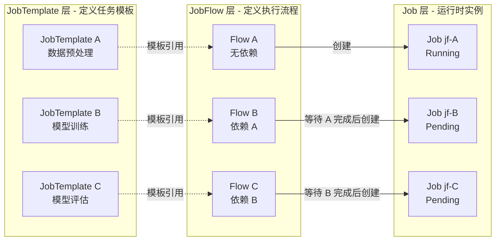

### 1.2 设计理念

| 设计原则 | 说明 |
|----------|------|
| **模板复用** | JobTemplate 定义可复用的任务模板，多个 JobFlow 可引用同一模板 |
| **声明式 DAG** | 通过 Flow 的 `dependsOn` 字段声明依赖关系，形成 DAG 图 |
| **条件触发** | 支持 HTTP Probe、TCP Probe、Task Status 三种依赖判定方式 |
| **自动清理** | 通过 `jobRetainPolicy` 控制工作流完成后是否自动清理 Job |
| **状态追踪** | 完整的 JobFlow 状态机和每个 Job 的运行历史记录 |

---

## 2. JobFlow CRD 定义

| 属性 | 值 |
|------|------|
| **API Group** | `flow.volcano.sh` |
| **API Version** | `v1alpha1` |
| **Kind** | `JobFlow` |
| **Scope** | Namespaced |
| **Short Names** | `jf` |
| **Subresource** | `status` |
| **PrintColumns** | Status (`.status.state.phase`), Age (`.metadata.creationTimestamp`) |

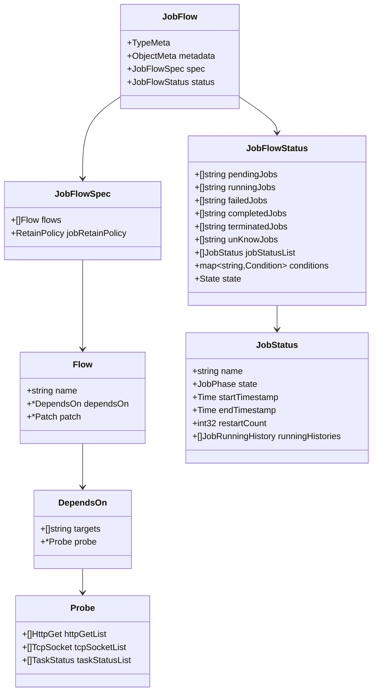

---

## 3. JobFlowSpec

| 字段 | 类型 | 必填 | 说明 |
|------|------|------|------|
| `flows` | `[]Flow` | 否 | DAG 流程定义列表 |
| `jobRetainPolicy` | `RetainPolicy` | 否 | Job 保留策略 |

### 3.1 RetainPolicy 枚举

| 值 | 常量 | 说明 |
|------|------|------|
| `retain` | `Retain` | 工作流完成后保留所有创建的 Job（默认行为） |
| `delete` | `Delete` | 工作流成功完成（Succeed）后自动删除所有 Job |

验证规则：Enum 约束，仅允许 `retain` 和 `delete`。

---

## 4. Flow 结构详解

每个 `Flow` 代表 DAG 中的一个节点，对应一个 Volcano Job 的执行单元。

| 字段 | 类型 | 必填 | 验证规则 | 说明 |
|------|------|------|----------|------|
| `name` | `string` | 是 | `minLength=1` | Flow 名称，同时作为 JobTemplate 引用名 |
| `dependsOn` | `*DependsOn` | 否 | - | 依赖配置 |
| `patch` | `*Patch` | 否 | - | JobSpec 覆盖配置 |

### 4.1 name 字段

`name` 具有双重含义：(1) DAG 中的唯一节点标识；(2) Controller 据此从同 Namespace 查找 JobTemplate。创建的 Job 名称格式为 `{jobFlowName}-{flowName}`。

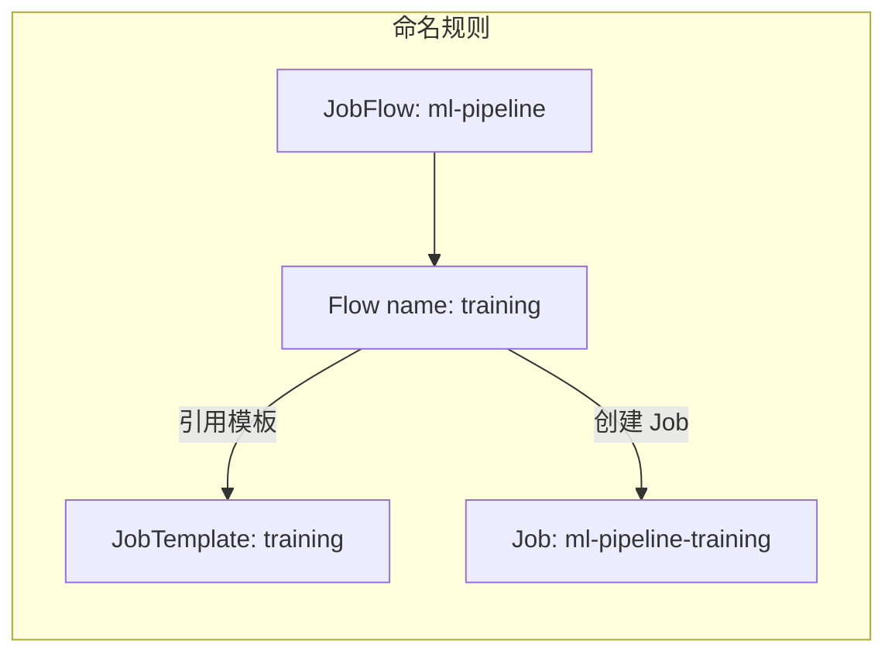

### 4.2 DependsOn 结构

| 字段 | 类型 | 说明 |
|------|------|------|
| `targets` | `[]string` | 依赖的 Flow 名称列表 |
| `probe` | `*Probe` | 依赖满足的探测条件 |

**依赖判定逻辑**：

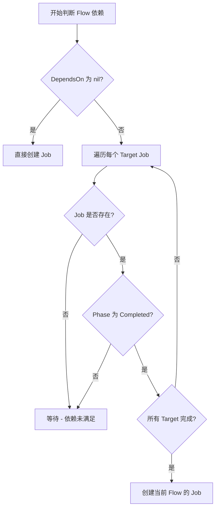

### 4.3 Patch 结构

`Patch` 包含 `jobSpec` 字段（类型为 `v1alpha1.JobSpec`），允许在运行时覆盖 JobTemplate 中的 JobSpec 字段。

---

## 5. Probe 类型详解

`Probe` 定义依赖满足的探测条件，支持三种方式。

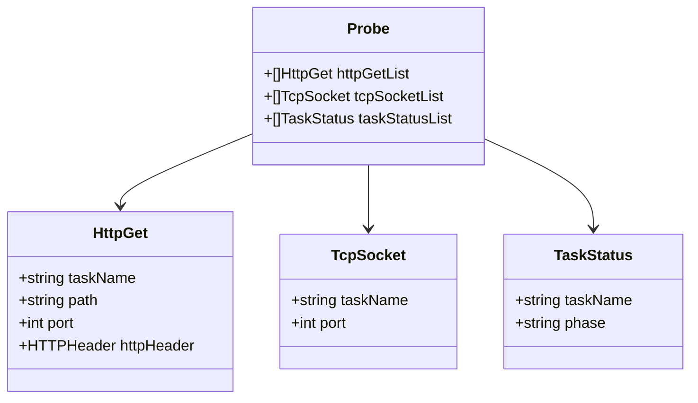

### 5.1 HttpGet Probe

通过 HTTP GET 请求探测 Task 服务是否就绪。

| 字段 | 类型 | 验证规则 | 说明 |
|------|------|----------|------|
| `taskName` | `string` | `maxLength=253` | 目标 Task 名称 |
| `path` | `string` | - | HTTP 请求路径 |
| `port` | `int` | `0-65535` | HTTP 端口号 |
| `httpHeader` | `v1.HTTPHeader` | - | HTTP 请求头 |

### 5.2 TcpSocket Probe

通过 TCP 连接探测 Task 服务端口是否可达。

| 字段 | 类型 | 必填 | 验证规则 |
|------|------|------|----------|
| `taskName` | `string` | 否 | `maxLength=253` |
| `port` | `int` | 是 | `0-65535` |

### 5.3 TaskStatus Probe

通过检查 Task 运行阶段判定依赖是否满足。

| 字段 | 类型 | 验证规则 |
|------|------|----------|
| `taskName` | `string` | `maxLength=253` |
| `phase` | `string` | `maxLength=63` |

### 5.4 三种 Probe 对比

| 特性 | HttpGet | TcpSocket | TaskStatus |
|------|---------|-----------|------------|
| **探测方式** | HTTP GET 请求 | TCP 连接 | 状态检查 |
| **适用场景** | REST API 健康检查 | 端口可达性检查 | Task 生命周期检查 |
| **需要运行中的服务** | 是 | 是 | 否 |

---

## 6. JobFlowStatus

### 6.1 字段定义

| 字段 | 类型 | 说明 |
|------|------|------|
| `pendingJobs` | `[]string` | Pending 状态的 Job 名称 |
| `runningJobs` | `[]string` | Running 状态的 Job 名称 |
| `failedJobs` | `[]string` | Failed 状态的 Job 名称 |
| `completedJobs` | `[]string` | Completed 状态的 Job 名称 |
| `terminatedJobs` | `[]string` | Terminated 状态的 Job 名称 |
| `unKnowJobs` | `[]string` | 状态未知的 Job 名称 |
| `jobStatusList` | `[]JobStatus` | 所有 Job 的详细状态 |
| `conditions` | `map[string]Condition` | 各 Job 条件信息（key 为 Job 名称） |
| `state` | `State` | JobFlow 整体状态 |

### 6.2 JobStatus 结构

| 字段 | 类型 | 说明 |
|------|------|------|
| `name` | `string` | Job 名称 |
| `state` | `v1alpha1.JobPhase` | Job 当前阶段 |
| `startTimestamp` | `metav1.Time` | Job 创建时间 |
| `endTimestamp` | `metav1.Time` | Job 结束时间 |
| `restartCount` | `int32` | 重启次数 |
| `runningHistories` | `[]JobRunningHistory` | 运行历史记录 |

### 6.3 JobRunningHistory

记录 Job 每次状态变更的时间跨度（`startTimestamp`、`endTimestamp`、`state`）。

### 6.4 Condition 结构

| 字段 | 类型 | 说明 |
|------|------|------|
| `phase` | `v1alpha1.JobPhase` | Job 当前 Phase |
| `createTimestamp` | `metav1.Time` | Job 创建时间 |
| `runningDuration` | `*metav1.Duration` | 运行持续时间 |
| `taskStatusCount` | `map[string]v1alpha1.TaskState` | 各 Task 状态计数 |

### 6.5 Phase 枚举

| Phase | 值 | 说明 |
|-------|------|------|
| **Pending** | `"Pending"` | 尚未有 Job 开始运行 |
| **Running** | `"Running"` | 有 Job 正在运行 |
| **Succeed** | `"Succeed"` | 所有 Job 都已成功完成 |
| **Failed** | `"Failed"` | 存在失败的 Job |
| **Terminating** | `"Terminating"` | 工作流正在终止 |

---

## 7. JobFlow Phase 状态转换

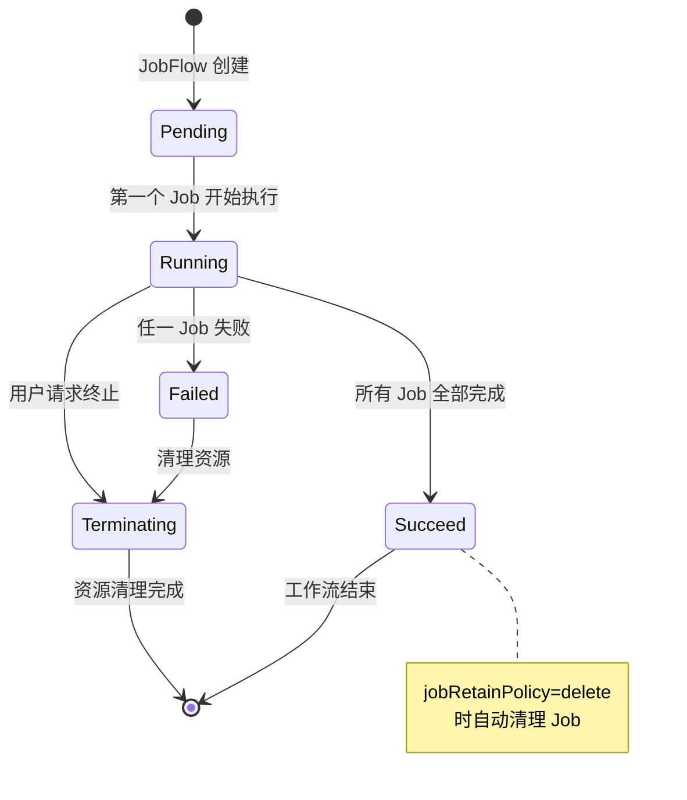

状态判定逻辑：

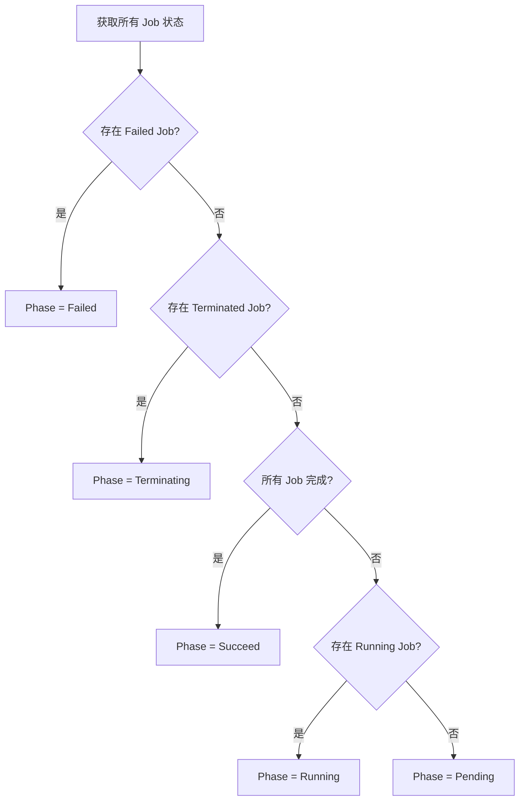

---

## 8. JobTemplate CRD 定义

| 属性 | 值 |
|------|------|
| **API Group** | `flow.volcano.sh` |
| **API Version** | `v1alpha1` |
| **Kind** | `JobTemplate` |
| **Scope** | Namespaced |
| **Short Names** | `jt` |
| **Subresource** | `status` |

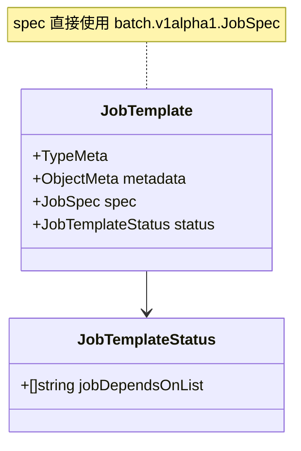

| 字段 | 类型 | 说明 |
|------|------|------|
| `spec` | `v1alpha1.JobSpec` | Volcano Job 的完整 Spec |
| `status.jobDependsOnList` | `[]string` | 该模板对应 Job 的依赖列表 |

---

## 9. DAG 编排模型

### 9.1 编排原理

每个 Flow 是 DAG 的一个节点，`dependsOn.targets` 定义有向边。无依赖 Flow 可并行执行，有依赖 Flow 需等待所有 Target 完成。

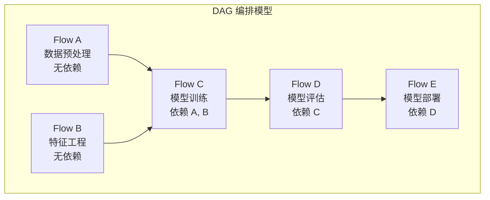

### 9.2 执行时序

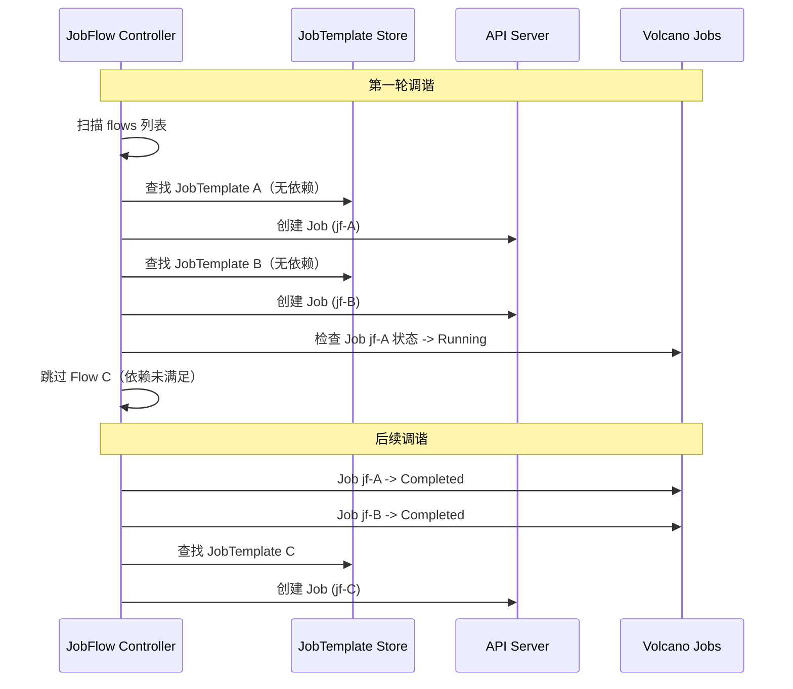

### 9.3 Job 标签与 OwnerReference

Controller 创建 Job 时设置以下标签/注解（值格式 `{namespace}.{name}`），并通过 `controllerutil.SetControllerReference` 建立 OwnerReference：

| Key | 常量 | 说明 |
|-----|------|------|
| `volcano.sh/createdByJobTemplate` | `CreatedByJobTemplate` | 标记来源 JobTemplate |
| `volcano.sh/createdByJobFlow` | `CreatedByJobFlow` | 标记来源 JobFlow |

---

## 10. 完整 YAML 示例 - 多阶段 ML Pipeline

### 10.1 Pipeline 架构

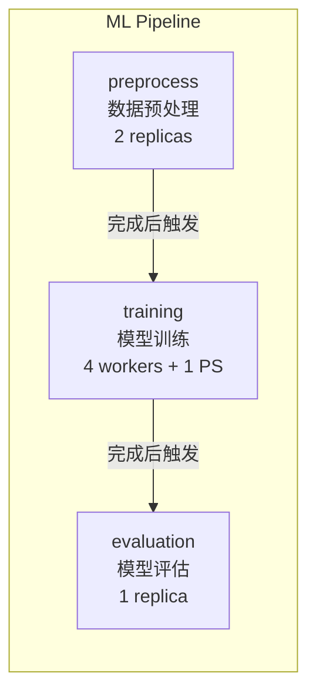

### 10.2 JobTemplate 定义

**数据预处理**：

```yaml
apiVersion: flow.volcano.sh/v1alpha1
kind: JobTemplate
metadata:
  name: preprocess
  namespace: ml-team
spec:
  minAvailable: 2
  schedulerName: volcano
  queue: ml-queue
  tasks:
    - name: preprocess
      replicas: 2
      template:
        spec:
          containers:
            - name: preprocess
              image: ml-pipeline/preprocess:v2.1
              command: ["python", "preprocess.py", "--input=/data/raw", "--output=/data/processed"]
              resources:
                requests:
                  cpu: "4"
                  memory: "8Gi"
          restartPolicy: OnFailure
```

**模型训练**：

```yaml
apiVersion: flow.volcano.sh/v1alpha1
kind: JobTemplate
metadata:
  name: training
  namespace: ml-team
spec:
  minAvailable: 5
  schedulerName: volcano
  queue: ml-queue
  tasks:
    - name: ps
      replicas: 1
      template:
        spec:
          containers:
            - name: ps
              image: ml-pipeline/training:v2.1
              command: ["python", "train.py", "--role=ps"]
              resources:
                requests:
                  cpu: "4"
                  memory: "8Gi"
          restartPolicy: OnFailure
    - name: worker
      replicas: 4
      template:
        spec:
          containers:
            - name: worker
              image: ml-pipeline/training:v2.1
              command: ["python", "train.py", "--role=worker"]
              resources:
                requests:
                  cpu: "8"
                  memory: "16Gi"
                  nvidia.com/gpu: "1"
          restartPolicy: OnFailure
```

**模型评估**：

```yaml
apiVersion: flow.volcano.sh/v1alpha1
kind: JobTemplate
metadata:
  name: evaluation
  namespace: ml-team
spec:
  minAvailable: 1
  schedulerName: volcano
  queue: ml-queue
  tasks:
    - name: eval
      replicas: 1
      template:
        spec:
          containers:
            - name: eval
              image: ml-pipeline/evaluation:v2.1
              command: ["python", "evaluate.py", "--model=/models/latest"]
              resources:
                requests:
                  cpu: "4"
                  memory: "8Gi"
                  nvidia.com/gpu: "1"
          restartPolicy: Never
```

### 10.3 JobFlow 定义

```yaml
apiVersion: flow.volcano.sh/v1alpha1
kind: JobFlow
metadata:
  name: ml-pipeline-v1
  namespace: ml-team
spec:
  jobRetainPolicy: retain
  flows:
    - name: preprocess
    - name: training
      dependsOn:
        targets:
          - preprocess
    - name: evaluation
      dependsOn:
        targets:
          - training
```

### 10.4 带 Probe 的高级 JobFlow

```yaml
apiVersion: flow.volcano.sh/v1alpha1
kind: JobFlow
metadata:
  name: ml-pipeline-advanced
  namespace: ml-team
spec:
  jobRetainPolicy: delete
  flows:
    - name: preprocess
    - name: training
      dependsOn:
        targets:
          - preprocess
        probe:
          taskStatusList:
            - taskName: "preprocess"
              phase: "Completed"
    - name: evaluation
      dependsOn:
        targets:
          - training
        probe:
          httpGetList:
            - taskName: "worker"
              path: "/model/ready"
              port: 8080
          taskStatusList:
            - taskName: "ps"
              phase: "Completed"
```

---

## 11. 常用操作命令

```bash
# 查看所有 JobFlow / JobTemplate
kubectl get jf -A
kubectl get jt -A

# 查看详情
kubectl describe jf <name> -n <namespace>
kubectl get jf <name> -n <namespace> -o yaml

# 查看 JobFlow 创建的所有 Job
kubectl get job.batch.volcano.sh -n <namespace> \
  -l "volcano.sh/createdByJobFlow=<namespace>.<jobflow-name>"

# 删除 JobFlow（级联删除关联 Job）
kubectl delete jf <name> -n <namespace>
```

---

## 12. 最佳实践

### 12.1 模板复用

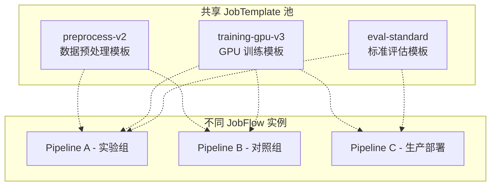

### 12.2 清理策略选择

| 场景 | 推荐 RetainPolicy | 原因 |
|------|-------------------|------|
| 开发调试 | `retain` | 保留 Job 方便排查 |
| CI/CD Pipeline | `delete` | 避免资源堆积 |
| 生产训练 | `retain` | 保留训练历史 |
| 定期批处理 | `delete` | 自动回收资源 |

### 12.3 DAG 设计原则

1. **最小化依赖**：只声明真正需要的依赖关系，最大化并行度
2. **合理粒度**：每个 Flow 对应一个独立计算阶段
3. **幂等设计**：Task 应支持重试，设计为幂等操作
4. **资源估算**：提前评估各阶段资源需求，确保 Queue 配额充足
