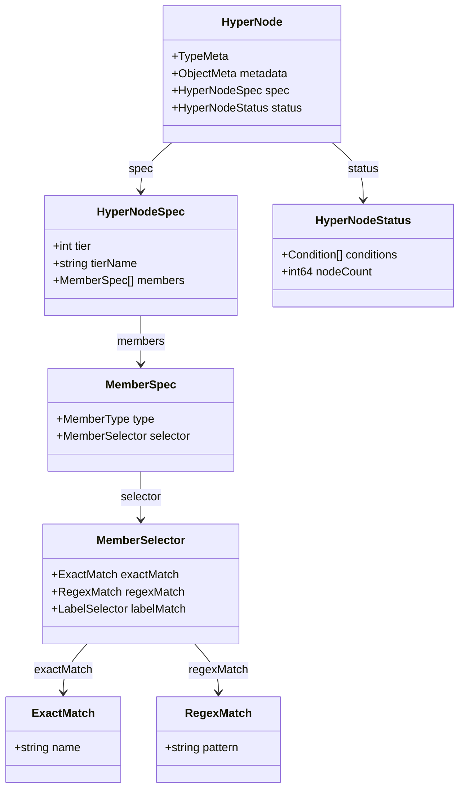
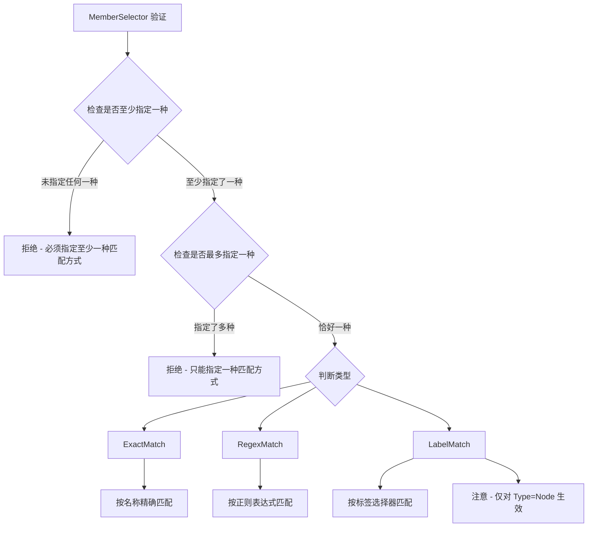
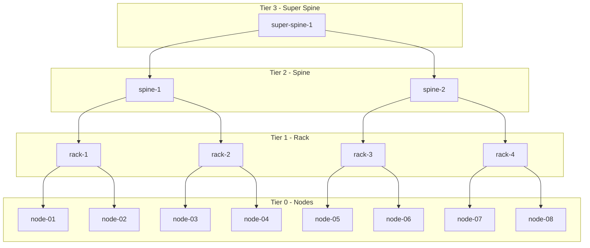
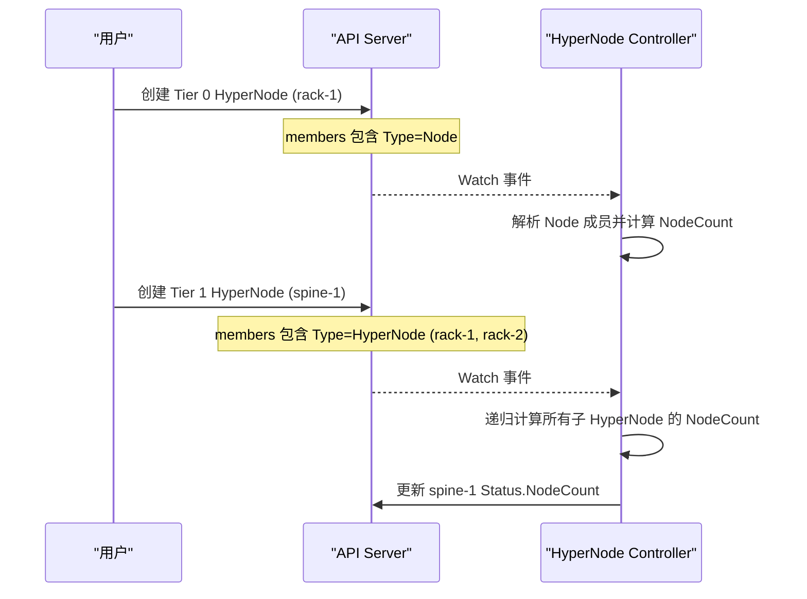
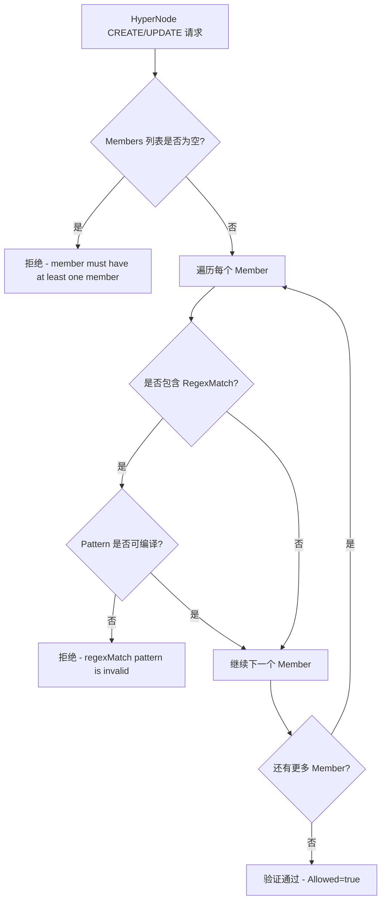
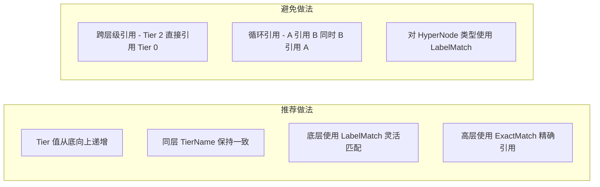

> 基于 `topology.volcano.sh/v1alpha1` API Group 的 HyperNode CRD 完整技术参考文档。
> 源码路径: `staging/src/volcano.sh/apis/pkg/apis/topology/v1alpha1/hypernode_types.go`

---

## 1. 概述

HyperNode 是 Volcano 项目中用于描述集群网络拓扑层级关系的 Custom Resource Definition (CRD)。它允许用户将物理节点 (Node) 按照网络拓扑结构组织为层级化的逻辑分组，从而实现拓扑感知的调度决策。

### 1.1 核心设计目标

- **拓扑建模**: 将数据中心的网络拓扑结构 (如 Rack、Spine、Super Spine) 映射到 Kubernetes 集群中
- **层级调度**: 通过 Tier 机制支持多层级拓扑感知调度，确保高性能工作负载的网络亲和性
- **灵活匹配**: 提供 ExactMatch、RegexMatch、LabelMatch 三种成员选择策略
- **动态感知**: 通过 Status 子资源实时反映 HyperNode 下属节点数量

### 1.2 CRD 注册信息

| 属性 | 值 |
|------|-----|
| API Group | `topology.volcano.sh` |
| API Version | `v1alpha1` |
| Kind | `HyperNode` |
| Scope | `Cluster` (nonNamespaced) |
| Short Name | `hn` |
| Subresource | `status` |
| 源码位置 | `staging/src/volcano.sh/apis/pkg/apis/topology/v1alpha1/` |

### 1.3 PrintColumns 定义

kubectl get 命令默认展示以下列:

| 列名 | 类型 | JSONPath |
|------|------|----------|
| Tier | string | `.spec.tier` |
| TierName | string | `.spec.tierName` |
| NodeCount | integer | `.status.nodeCount` |
| Age | date | `.metadata.creationTimestamp` |

```bash
# 示例输出
$ kubectl get hypernodes
NAME          TIER   TIERNAME   NODECOUNT   AGE
rack-1        1      rack       4           2d
rack-2        1      rack       3           2d
spine-1       2      spine      7           2d
```

---

## 2. HyperNode 顶层结构

```go
type HyperNode struct {
    metav1.TypeMeta   `json:",inline"`
    metav1.ObjectMeta `json:"metadata,omitempty"`
    Spec              HyperNodeSpec   `json:"spec"`
    Status            HyperNodeStatus `json:"status,omitempty"`
}
```



---

## 3. HyperNodeSpec 完整字段

`HyperNodeSpec` 定义了 HyperNode 的期望状态。

```go
type HyperNodeSpec struct {
    Tier     int          `json:"tier,omitempty"`
    TierName string       `json:"tierName,omitempty"`
    Members  []MemberSpec `json:"members,omitempty"`
}
```

### 3.1 Tier 字段

| 属性 | 说明 |
|------|------|
| 类型 | `int` |
| 必填 | 是 (`+required`) |
| 验证规则 | `minimum=0` |
| JSON 标签 | `tier,omitempty` |
| 语义 | 定义该 HyperNode 在层级拓扑中的层级编号 |

Tier 值的含义:
- `Tier 0`: 最底层，直接关联物理节点 (Node)
- `Tier 1`: 通常表示机架级别 (Rack)
- `Tier 2`: 通常表示脊交换机级别 (Spine)
- `Tier N`: 更高层级的网络拓扑聚合

### 3.2 TierName 字段

| 属性 | 说明 |
|------|------|
| 类型 | `string` |
| 必填 | 否 (`+optional`) |
| 验证规则 | `maxLength=253` |
| JSON 标签 | `tierName,omitempty` |
| 语义 | 层级的人类可读名称，如 "rack"、"spine"、"super-spine" |

### 3.3 Members 字段

| 属性 | 说明 |
|------|------|
| 类型 | `[]MemberSpec` |
| 必填 | 否 (`+optional`)，但推荐至少包含一个成员 |
| 验证规则 | `minItems=1` |
| JSON 标签 | `members,omitempty` |
| 语义 | 定义该 HyperNode 包含的成员列表 |

---

## 4. MemberSpec 结构

`MemberSpec` 描述 HyperNode 中的一个成员条目，可以是一个 Node 也可以是一个子 HyperNode。

```go
type MemberSpec struct {
    Type     MemberType     `json:"type,omitempty"`
    Selector MemberSelector `json:"selector,omitempty"`
}
```

### 4.1 Type 字段

| 属性 | 说明 |
|------|------|
| 类型 | `MemberType` (string) |
| 必填 | 是 (`+required`) |
| 枚举值 | `Node`, `HyperNode` |
| JSON 标签 | `type,omitempty` |

```go
type MemberType string

const (
    MemberTypeNode      MemberType = "Node"
    MemberTypeHyperNode MemberType = "HyperNode"
)
```

- `Node`: 成员为 Kubernetes 物理节点
- `HyperNode`: 成员为另一个 HyperNode 资源（用于构建层级结构）

### 4.2 Selector 字段

| 属性 | 说明 |
|------|------|
| 类型 | `MemberSelector` |
| 必填 | 否 (`+optional`) |
| JSON 标签 | `selector,omitempty` |
| 语义 | 定义成员的选择规则 |

---

## 5. MemberSelector 详解

`MemberSelector` 提供三种互斥的成员选择方式。通过 CEL (Common Expression Language) 验证规则确保三选一的互斥语义。

```go
type MemberSelector struct {
    ExactMatch *ExactMatch          `json:"exactMatch,omitempty"`
    RegexMatch *RegexMatch          `json:"regexMatch,omitempty"`
    LabelMatch *metav1.LabelSelector `json:"labelMatch,omitempty"`
}
```

### 5.1 XValidation 规则

MemberSelector 上定义了两条 CEL 验证规则:

**规则 1 - 至少指定一个**:
```
rule: "has(self.exactMatch) || has(self.regexMatch) || has(self.labelMatch)"
message: "Either ExactMatch or RegexMatch or LabelMatch must be specified"
```

**规则 2 - 最多指定一个**:
```
rule: "(has(self.exactMatch) ? 1 : 0) + (has(self.regexMatch) ? 1 : 0) + (has(self.labelMatch) ? 1 : 0) <= 1"
message: "Only one of ExactMatch, RegexMatch, or LabelMatch can be specified"
```



### 5.2 ExactMatch 精确匹配

```go
type ExactMatch struct {
    Name string `json:"name"`
}
```

| 字段 | 约束 |
|------|------|
| `name` | `+required`, `minLength=1`, `maxLength=253` |
| Pattern | `^[a-z0-9]([-a-z0-9]*[a-z0-9])?(\.[a-z0-9]([-a-z0-9]*[a-z0-9])?)*$` |

Name 字段必须符合 DNS 子域名格式 (RFC 1123)，适用于精确指定某个 Node 或 HyperNode 的名称。

### 5.3 RegexMatch 正则匹配

```go
type RegexMatch struct {
    Pattern string `json:"pattern"`
}
```

| 字段 | 约束 |
|------|------|
| `pattern` | `+required`, `minLength=1` |

Webhook 层面还会验证 Pattern 是否为合法的 Go 正则表达式 (通过 `regexp.Compile` 检查)。

### 5.4 LabelMatch 标签匹配

```go
LabelMatch *metav1.LabelSelector `json:"labelMatch,omitempty"`
```

使用 Kubernetes 标准的 `metav1.LabelSelector`，支持 `matchLabels` 和 `matchExpressions` 两种语法。

> **重要**: `LabelMatch` 仅在 Member Type 为 `Node` 时生效，对 Type 为 `HyperNode` 的成员无效。

---

## 6. HyperNodeStatus

`HyperNodeStatus` 记录 HyperNode 的观测状态，由 Controller 自动更新。

```go
type HyperNodeStatus struct {
    Conditions []metav1.Condition `json:"conditions,omitempty"`
    NodeCount  int64              `json:"nodeCount,omitempty"`
}
```

### 6.1 Conditions 字段

| 属性 | 说明 |
|------|------|
| 类型 | `[]metav1.Condition` |
| 必填 | 否 |
| 语义 | 遵循 Kubernetes 标准 Condition 模式 |

每个 Condition 包含:
- `type`: 条件类型
- `status`: True/False/Unknown
- `reason`: 原因编码
- `message`: 人类可读消息
- `lastTransitionTime`: 最后状态变更时间

### 6.2 NodeCount 字段

| 属性 | 说明 |
|------|------|
| 类型 | `int64` |
| 验证规则 | `minimum=0` |
| 语义 | 由 Controller 计算得出的该 HyperNode 下属实际节点总数 |

对于 Tier 0 的 HyperNode，NodeCount 等于其直接匹配的 Node 数量。对于更高 Tier 的 HyperNode，NodeCount 为其所有子 HyperNode 的 NodeCount 之和。

---

## 7. 层级拓扑模型

### 7.1 Tier 层级体系

HyperNode 通过 `Tier` 字段和 `Members` 中的 `Type=HyperNode` 引用来构建层级拓扑树:

```
Tier 3: super-spine (超级脊交换机)
  |
Tier 2: spine (脊交换机)
  |
Tier 1: rack (机架交换机)
  |
Tier 0: node (物理节点)
```



### 7.2 父子关系建立机制

父 HyperNode 通过在 `Members` 列表中声明 `Type=HyperNode` 的条目来引用子 HyperNode:



### 7.3 拓扑感知调度

调度器通过 HyperNode 的层级结构来做出拓扑感知的放置决策。当 Job 或 PodGroup 指定了 `networkTopology.highestTierAllowed` 或 `networkTopology.highestTierName` 时，调度器会确保 Pod 被放置在满足拓扑约束的节点上。

---

## 8. YAML 示例集

### 8.1 ExactMatch 示例

精确指定节点名称创建一个 Rack 级别的 HyperNode:

```yaml
apiVersion: topology.volcano.sh/v1alpha1
kind: HyperNode
metadata:
  name: rack-1
spec:
  tier: 1
  tierName: rack
  members:
    - type: Node
      selector:
        exactMatch:
          name: "node-01"
    - type: Node
      selector:
        exactMatch:
          name: "node-02"
    - type: Node
      selector:
        exactMatch:
          name: "node-03"
```

### 8.2 RegexMatch 示例

使用正则表达式批量匹配节点:

```yaml
apiVersion: topology.volcano.sh/v1alpha1
kind: HyperNode
metadata:
  name: rack-gpu
spec:
  tier: 1
  tierName: rack
  members:
    - type: Node
      selector:
        regexMatch:
          pattern: "^gpu-node-[0-9]+$"
```

### 8.3 LabelMatch 示例

通过标签选择器匹配节点:

```yaml
apiVersion: topology.volcano.sh/v1alpha1
kind: HyperNode
metadata:
  name: rack-high-bandwidth
spec:
  tier: 1
  tierName: rack
  members:
    - type: Node
      selector:
        labelMatch:
          matchLabels:
            topology.kubernetes.io/rack: "rack-a"
            network.volcano.sh/bandwidth: "100g"
```

### 8.4 多层级拓扑示例

构建完整的三层拓扑结构:

```yaml
# Tier 1: Rack 级别 HyperNode
apiVersion: topology.volcano.sh/v1alpha1
kind: HyperNode
metadata:
  name: rack-1
spec:
  tier: 1
  tierName: rack
  members:
    - type: Node
      selector:
        labelMatch:
          matchLabels:
            topology.kubernetes.io/rack: "rack-1"
---
apiVersion: topology.volcano.sh/v1alpha1
kind: HyperNode
metadata:
  name: rack-2
spec:
  tier: 1
  tierName: rack
  members:
    - type: Node
      selector:
        labelMatch:
          matchLabels:
            topology.kubernetes.io/rack: "rack-2"
---
# Tier 2: Spine 级别 HyperNode
apiVersion: topology.volcano.sh/v1alpha1
kind: HyperNode
metadata:
  name: spine-1
spec:
  tier: 2
  tierName: spine
  members:
    - type: HyperNode
      selector:
        exactMatch:
          name: "rack-1"
    - type: HyperNode
      selector:
        exactMatch:
          name: "rack-2"
---
# Tier 3: Super Spine 级别 HyperNode
apiVersion: topology.volcano.sh/v1alpha1
kind: HyperNode
metadata:
  name: super-spine-1
spec:
  tier: 3
  tierName: super-spine
  members:
    - type: HyperNode
      selector:
        exactMatch:
          name: "spine-1"
    - type: HyperNode
      selector:
        exactMatch:
          name: "spine-2"
```

---

## 9. Webhook 验证规则

HyperNode 在创建和更新时会经过 Admission Webhook 的验证。Webhook 路径为 `/hypernodes/validate`，源码位于 `pkg/webhooks/admission/hypernodes/validate/admit_hypernode.go`。

### 9.1 验证逻辑



### 9.2 与 CRD Schema 验证的分工

| 验证项 | CRD Schema / CEL | Webhook |
|--------|-------------------|---------|
| Tier >= 0 | kubebuilder:validation:Minimum=0 | - |
| TierName maxLength=253 | kubebuilder:validation:MaxLength=253 | - |
| Members minItems=1 | kubebuilder:validation:MinItems=1 | 双重检查 |
| Selector 三选一互斥 | XValidation (CEL) | - |
| ExactMatch.Name 格式 | Pattern + MinLength + MaxLength | - |
| RegexMatch.Pattern 编译 | - | regexp.Compile 检查 |
| MemberType 枚举 | kubebuilder:validation:Enum | - |

---

## 10. 相关 Annotation 常量

HyperNode 相关的 Annotation 定义在 `labels.go` 中:

```go
// 源码: staging/src/volcano.sh/apis/pkg/apis/topology/v1alpha1/labels.go

// 网络拓扑模式 Annotation Key
// 值为 "hard" 或 "soft"
const NetworkTopologyModeAnnotationKey = "volcano.sh/network-topology-mode"

// 网络拓扑最高层级 Annotation Key
// 值为整数，表示允许的最高 Tier 层级
const NetworkTopologyHighestTierAnnotationKey = "volcano.sh/network-topology-highest-tier"
```

---

## 11. 最佳实践

### 11.1 命名规范

- 使用有语义的命名格式: `{tierName}-{identifier}`，如 `rack-1`、`spine-east`
- 保持命名的一致性和可读性

### 11.2 拓扑设计建议



### 11.3 典型使用场景

| 场景 | 配置方式 |
|------|----------|
| GPU 训练任务亲和性 | 通过 HyperNode 将同机架 GPU 节点分组，Job 指定 highestTierAllowed=1 |
| 大规模分布式训练 | 构建 3 层拓扑，Job 指定 highestTierAllowed=2 允许跨 Rack |
| 高带宽网络隔离 | 使用 LabelMatch 按网络带宽标签分组 |
| 混合集群管理 | 不同 TierName 区分不同拓扑域 (如 network-rack vs storage-rack) |

---

## 12. API 版本演进

| 版本 | 状态 | 说明 |
|------|------|------|
| `v1alpha1` | 当前版本 | 初始 API 版本，包含完整的层级拓扑建模能力 |

该 API 目前处于 `v1alpha1` 阶段，字段和语义可能在后续版本中发生变更。生产环境使用时请关注版本升级指南。
