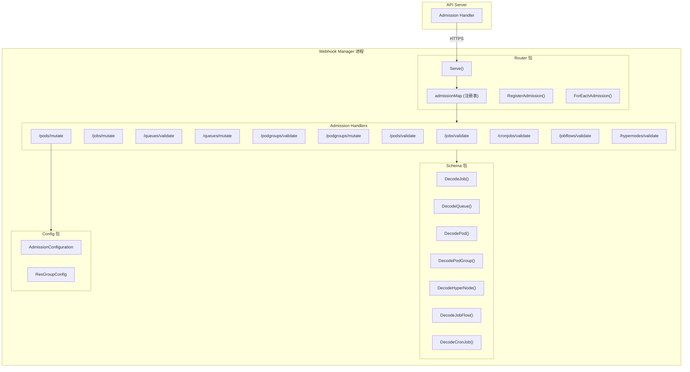
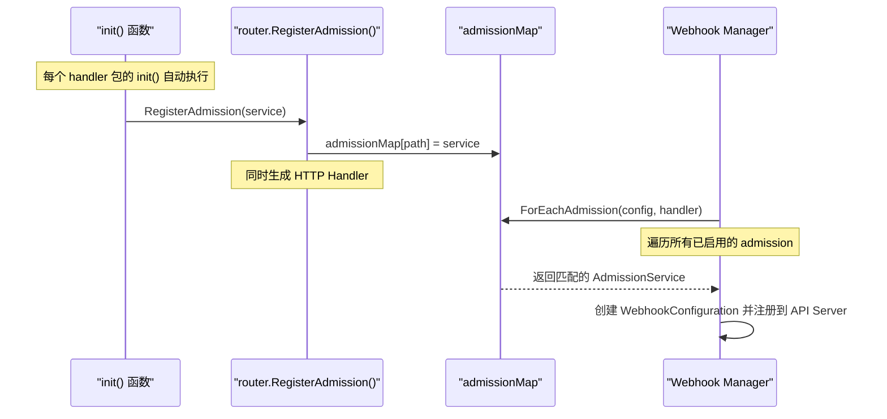
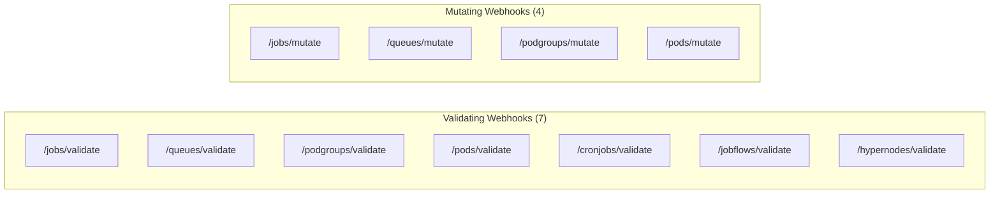
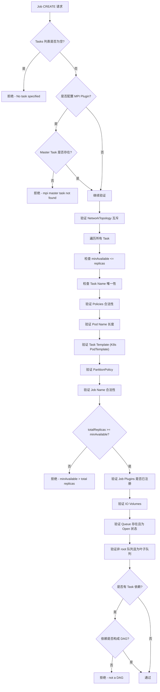
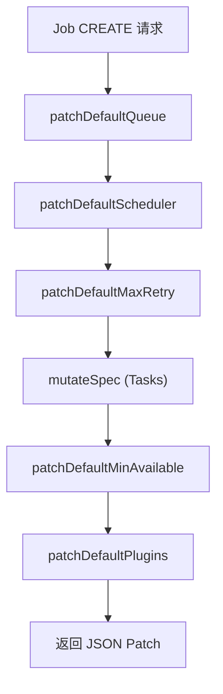
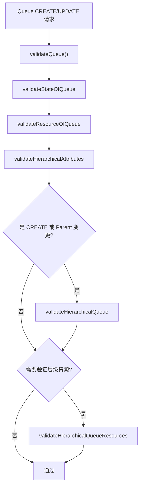
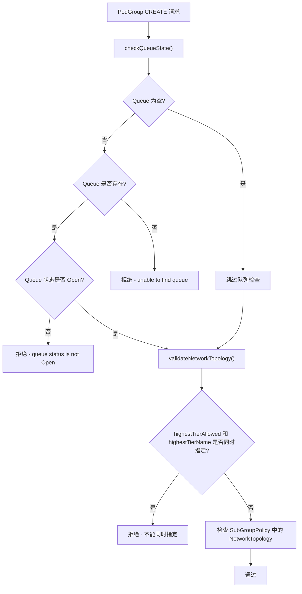
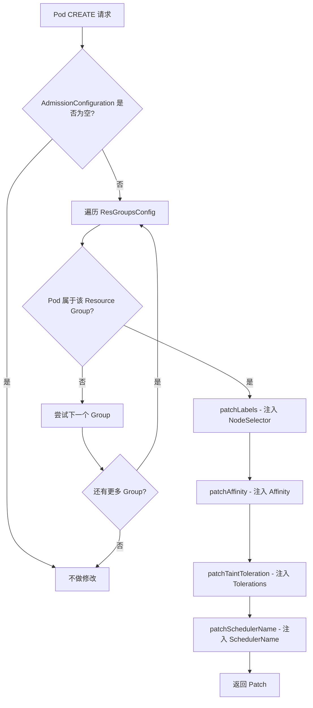
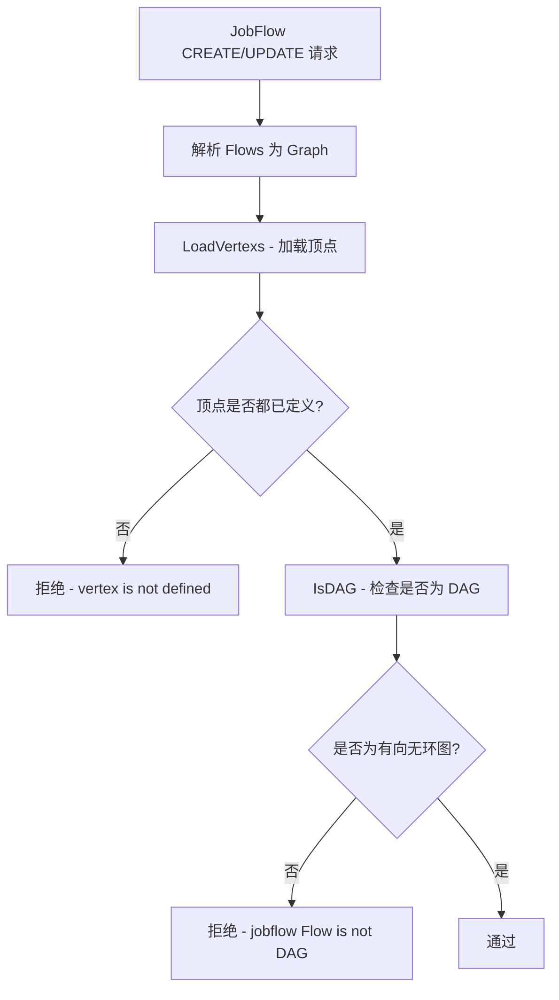
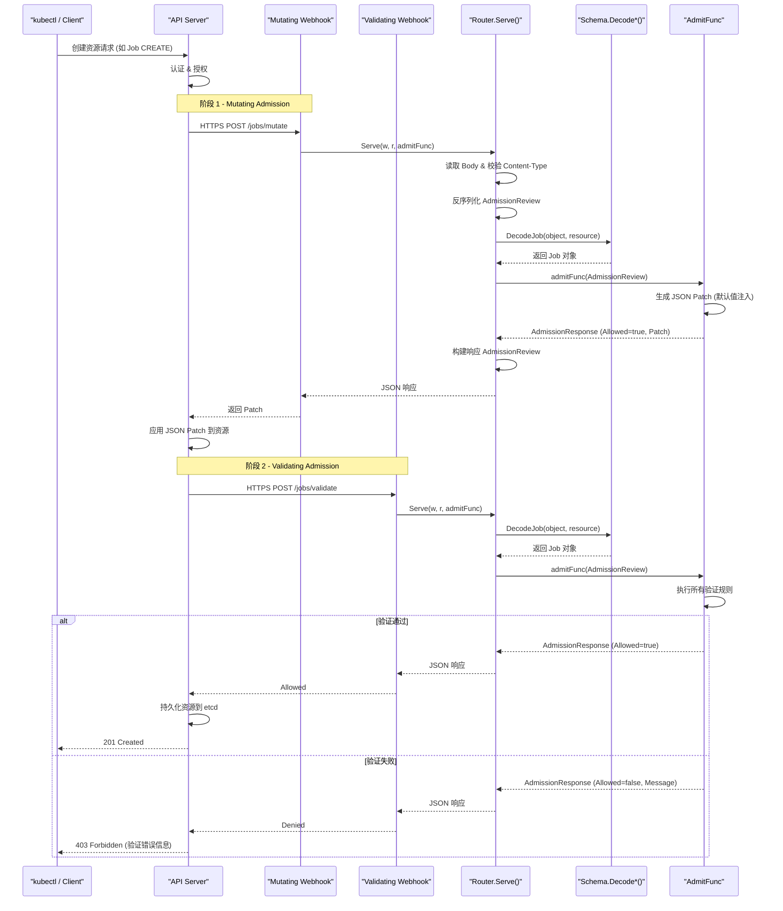

> Volcano Admission Webhook 系统的完整技术参考文档。
> 核心源码路径: `pkg/webhooks/`

---

## 1. 概述

Volcano Webhook 准入控制系统基于 Kubernetes Admission Webhook 机制，对 Volcano CRD 资源 (Job, Queue, PodGroup, CronJob, JobFlow, HyperNode) 以及原生 Pod 资源执行准入验证 (Validating) 和变更注入 (Mutating)。系统由 `vc-webhook-manager` 组件运行，通过 `ValidatingWebhookConfiguration` 和 `MutatingWebhookConfiguration` 向 API Server 注册。

### 1.1 核心能力

- **资源验证**: 在 CREATE / UPDATE / DELETE 操作前验证资源的合法性
- **默认值注入**: 在 CREATE 操作时自动填充缺省字段
- **策略约束**: 确保资源配置符合集群管理策略
- **层级队列管理**: 验证队列的父子关系和资源约束
- **DAG 验证**: 验证 Job 和 JobFlow 的依赖关系是否构成有向无环图
- **拓扑验证**: 验证 HyperNode 的成员配置合法性

### 1.2 Webhook 类型

| 类型 | Kubernetes 资源 | 作用 |
|------|----------------|------|
| ValidatingWebhookConfiguration | `ValidatingWebhook` | 验证请求，返回 Allow/Deny |
| MutatingWebhookConfiguration | `MutatingWebhook` | 修改请求内容 (JSON Patch) |

---

## 2. Webhook 架构

### 2.1 核心组件



### 2.2 Router 核心接口

**AdmitFunc** - 所有 Admission Handler 的统一函数签名:

```go
// 源码: pkg/webhooks/router/interface.go
type AdmitFunc func(admissionv1.AdmissionReview) *admissionv1.AdmissionResponse
```

**AdmissionService** - 描述一个 Admission Webhook 服务:

```go
type AdmissionService struct {
    Path    string                // HTTP 路径，如 "/jobs/validate"
    Func    AdmitFunc             // 处理函数
    Handler AdmissionHandler      // HTTP Handler (由 RegisterAdmission 自动生成)

    ValidatingConfig *whv1.ValidatingWebhookConfiguration  // Validating 配置
    MutatingConfig   *whv1.MutatingWebhookConfiguration    // Mutating 配置

    Config *AdmissionServiceConfig  // 运行时配置 (客户端、Lister 等)
}
```

**AdmissionServiceConfig** - 运行时依赖注入，包含 SchedulerNames、KubeClient、VolcanoClient、QueueLister、QueueInformer、Recorder 和 ConfigData 等运行时配置。

### 2.3 注册机制

每个 Webhook Handler 通过 `init()` 函数 + blank import 的方式自动注册:



### 2.4 HTTP 请求处理流程

```go
// 源码: pkg/webhooks/router/server.go
func Serve(w io.Writer, r *http.Request, admit AdmitFunc) {
    // 1. 读取请求 Body
    // 2. 校验 Content-Type 为 application/json
    // 3. 反序列化为 AdmissionReview
    // 4. 调用 admit(ar) 获取 AdmissionResponse
    // 5. 构建响应并写回
}
```

---

## 3. Webhook 注册表

以下是 Volcano 中所有 11 个 Webhook 的完整注册信息:

| 资源 | 路径 | 类型 | 操作 | 注册名称 |
|------|------|------|------|----------|
| Job | `/jobs/validate` | Validating | CREATE, UPDATE | `validatejob.volcano.sh` |
| Job | `/jobs/mutate` | Mutating | CREATE | `mutatejob.volcano.sh` |
| Queue | `/queues/validate` | Validating | CREATE, UPDATE, DELETE | `validatequeue.volcano.sh` |
| Queue | `/queues/mutate` | Mutating | CREATE | `mutatequeue.volcano.sh` |
| PodGroup | `/podgroups/validate` | Validating | CREATE | `validatepodgroup.volcano.sh` |
| PodGroup | `/podgroups/mutate` | Mutating | CREATE | `mutatepodgroup.volcano.sh` |
| Pod | `/pods/validate` | Validating | CREATE | `validatepod.volcano.sh` |
| Pod | `/pods/mutate` | Mutating | CREATE | `mutatepod.volcano.sh` |
| CronJob | `/cronjobs/validate` | Validating | CREATE, UPDATE | `validatecronjob.volcano.sh` |
| JobFlow | `/jobflows/validate` | Validating | CREATE, UPDATE | `validatejobflow.volcano.sh` |
| HyperNode | `/hypernodes/validate` | Validating | CREATE, UPDATE | `validatehypernode.volcano.sh` |



---

## 4. Job Validation 规则

**源码**: `pkg/webhooks/admission/jobs/validate/admit_job.go`

### 4.1 CREATE 验证



### 4.2 UPDATE 验证

UPDATE 操作的验证规则:

- Task 数量不能增减 (`len(old.Tasks) != len(new.Tasks)`)
- 仅允许修改 `minAvailable`、`tasks[*].replicas` 和 `PriorityClassName`
- 各 Task 的 `replicas >= 0`、`minAvailable <= replicas`
- 全局 `minAvailable <= totalReplicas`
- NetworkTopology 的 `highestTierAllowed` 和 `highestTierName` 互斥
- PartitionPolicy 约束检查

### 4.3 关键验证项汇总

| 验证项 | 操作 | 拒绝条件 |
|--------|------|----------|
| Task 列表 | CREATE | `len(tasks) == 0` |
| MPI Master | CREATE | MPI Plugin 指定但 Master Task 不存在 |
| Task Name | CREATE | 重复的 Task 名称 |
| minAvailable | CREATE/UPDATE | `minAvailable > replicas` 或 `minAvailable > totalReplicas` |
| Policies | CREATE | 无效的 Event 或 Action |
| Pod Name | CREATE | 不符合 DNS1123 格式或超长 |
| Task Template | CREATE | 不符合 K8s PodTemplate 验证 |
| PartitionPolicy | CREATE/UPDATE | `TotalPartitions <= 0` 或 `Replicas != TotalPartitions * PartitionSize` |
| Queue | CREATE | Queue 不存在、非 Open 状态、root 队列、非叶子队列 |
| DAG | CREATE | Task 依赖存在环路 |
| Plugin | CREATE | 引用了未注册的 Plugin |
| 字段变更 | UPDATE | 修改了不允许变更的字段 |

---

## 5. Job Mutation 规则

**源码**: `pkg/webhooks/admission/jobs/mutate/mutate_job.go`

Job Mutation 仅在 CREATE 操作时触发，通过 JSON Patch 机制注入默认值:



### 5.1 默认值注入规则

| Patch 项 | 条件 | 默认值 |
|----------|------|--------|
| `spec.queue` | Queue 为空 | `"default"` |
| `spec.schedulerName` | SchedulerName 为空 | 从配置的 SchedulerNames 生成 |
| `spec.maxRetry` | MaxRetry == 0 | `3` |
| `spec.minAvailable` | MinAvailable == 0 | 所有 Task 的 MinAvailable 之和 |
| `tasks[i].name` | Task Name 为空 | `"default-task{i}"` |
| `tasks[i].template.spec.dnsPolicy` | HostNetwork=true 且 DNSPolicy 为空 | `ClusterFirstWithHostNet` |
| `tasks[i].minAvailable` | MinAvailable 为 nil | 等于 `replicas`，或 `minPartitions * partitionSize` |
| `tasks[i].maxRetry` | MaxRetry == 0 | `3` |

### 5.2 Plugin 自动添加

当 Job 配置了特定分布式框架 Plugin 时，自动添加依赖的 Plugin:

| 配置的 Plugin | 自动添加 |
|--------------|----------|
| `tensorflow` | `svc` |
| `mpi` | `svc`, `ssh` |
| `pytorch` | `svc` |
| `ray` | `svc` |

---

## 6. Queue Validation 规则

**源码**: `pkg/webhooks/admission/queues/validate/validate_queue.go`

### 6.1 CREATE/UPDATE 验证



### 6.2 State 验证

合法的 Queue 状态值:
- `Open` - 队列开放，接受作业提交
- `Closed` - 队列关闭

### 6.3 资源约束验证

资源字段的约束关系:

```
Guarantee <= Deserved <= Capability
```

具体验证逻辑:

| 验证项 | 规则 |
|--------|------|
| Capability | 各资源量必须非负 |
| Deserved | 各资源量必须非负，且 `Deserved <= Capability` |
| Guarantee | 各资源量必须非负，且 `Guarantee <= Capability` 且 `Guarantee <= Deserved` |

### 6.4 层级队列验证

| 验证项 | 说明 |
|--------|------|
| 自引用 | `queue.Parent != queue.Name` |
| 父队列存在 | 父队列必须存在于集群中 |
| 父队列无分配 Pod | 新建子队列时，父队列不能有已分配的 Pod |
| 子队列 Capability <= 父队列 Capability | 子队列资源不超过父队列 |
| 兄弟队列 Guarantee 之和 <= 父队列限制 | 所有子队列的 Guarantee 之和不超过父队列 |
| 兄弟队列 Deserved 之和 <= 父队列限制 | 所有子队列的 Deserved 之和不超过父队列 |

### 6.5 DELETE 验证

| 验证项 | 规则 |
|--------|------|
| `default` 队列 | 不允许删除 |
| `root` 队列 | 不允许删除 |
| 子队列 | 存在子队列时不允许删除 |

---

## 7. Queue Mutation 规则

**源码**: `pkg/webhooks/admission/queues/mutate/mutate_queue.go`

Queue Mutation 仅在 CREATE 操作时触发:

| Patch 项 | 条件 | 默认值 |
|----------|------|--------|
| Hierarchy Annotation | hierarchy 非空且不以 "root" 开头 | 自动添加 "root/" 前缀 |
| Hierarchy Weight | 同上 | 自动添加 "1/" 前缀 |
| `spec.reclaimable` | 为 nil | `true` |
| `spec.weight` | 为 0 | `1` |

---

## 8. PodGroup Validation

**源码**: `pkg/webhooks/admission/podgroups/validate/validate_podgroup.go`

PodGroup Validation 仅在 CREATE 操作时触发:



---

## 9. PodGroup Mutation

**源码**: `pkg/webhooks/admission/podgroups/mutate/mutate_podgroup.go`

PodGroup Mutation 仅在 CREATE 操作时触发，处理 Namespace 级别的队列覆盖:

| 条件 | 行为 |
|------|------|
| PodGroup 的 Queue == "default" 且 Namespace 有 `scheduling.volcano.sh/queue-name` Annotation | 将 Queue 替换为 Namespace Annotation 指定的队列名 |
| 其他情况 | 不做修改 |

---

## 10. Pod Validation

**源码**: `pkg/webhooks/admission/pods/validate/admit_pod.go`

Pod Validation 仅在 CREATE 操作时触发:

### 10.1 调度器过滤

仅对 `schedulerName` 在配置的 Volcano 调度器名称列表中的 Pod 生效，非 Volcano 调度的 Pod 直接放行。

### 10.2 PDB Annotation 验证

验证 Pod 上的 PodDisruptionBudget 相关 Annotation:

| Annotation Key | 验证规则 |
|---------------|----------|
| `scheduling.volcano.sh/job-disruption-budget-min-available` | 正整数或 1%-99% 的百分比字符串 |
| `scheduling.volcano.sh/job-disruption-budget-max-unavailable` | 正整数或 1%-99% 的百分比字符串 |

**互斥约束**: 上述两个 Annotation 不能同时配置。

---

## 11. Pod Mutation

**源码**: `pkg/webhooks/admission/pods/mutate/mutate_pod.go`

Pod Mutation 基于 `AdmissionConfiguration` 文件中定义的 Resource Group 规则进行 Pod 注入:



### 11.1 Resource Group 匹配机制

支持两种 Resource Group 匹配方式:

| 匹配类型 | Object.Key | 匹配逻辑 |
|----------|------------|----------|
| Namespace | `"namespace"` | Pod 的 Namespace 在 Object.Value 列表中 |
| Annotation | `"annotation"` 或为空 | Pod 的 Annotation 匹配 Object.Value 中的键值对，或 `volcano.sh/resource-group` Annotation 匹配 ResourceGroup 名称 |

### 11.2 注入内容

| 注入项 | 条件 | 行为 |
|--------|------|------|
| NodeSelector | Labels 配置非空 | 合并到 Pod 的 NodeSelector |
| Affinity | Affinity 配置非空且 Pod 无 Affinity | 设置 Pod Affinity |
| Tolerations | Tolerations 配置非空 | 追加到 Pod 的 Tolerations 列表 |
| SchedulerName | SchedulerName 配置非空 | 覆盖 Pod 的 SchedulerName |

---

## 12. CronJob Validation

**源码**: `pkg/webhooks/admission/cronjobs/validate/admit_cronjob.go`

CronJob Validation 在 CREATE 和 UPDATE 操作时触发:

### 12.1 验证规则

| 验证项 | 规则 |
|--------|------|
| Schedule | 不能为空 |
| Schedule 格式 | 必须是合法的 Cron 表达式 (标准 5 字段格式) |
| Schedule TZ | 不允许在 Schedule 中包含 TZ 或 CRON_TZ |
| TimeZone 格式 | 非空字符串，符合 IANA 时区数据库 |
| TimeZone 值 | 不能为 "Local"，必须能被 `time.LoadLocation()` 解析 |
| CronJob Name 长度 | 最大 52 字符 (63 - 11 后缀) |
| CronJob Name 格式 | 符合 Kubernetes Qualified Name 规范 |

### 12.2 Name 长度限制说明

CronJob 创建 Job 时会自动添加时间戳后缀 (最多 11 字符)，Kubernetes 资源名最大为 63 字符，因此 CronJob Name 限制为 `63 - 11 = 52` 字符。

---

## 13. JobFlow Validation

**源码**: `pkg/webhooks/admission/jobflows/validate/validate_jobflow.go`

JobFlow Validation 在 CREATE 和 UPDATE 操作时触发:



验证规则:
- 所有 Flow 中引用的依赖目标 (DependsOn.Targets) 必须在 Flows 列表中定义
- 依赖关系图必须构成 DAG (有向无环图)，不允许存在循环依赖

---

## 14. HyperNode Validation

**源码**: `pkg/webhooks/admission/hypernodes/validate/admit_hypernode.go`

HyperNode Validation 在 CREATE 和 UPDATE 操作时触发:

| 验证项 | 规则 | 说明 |
|--------|------|------|
| Members 非空 | `len(members) > 0` | 至少包含一个成员 |
| RegexMatch Pattern | `regexp.Compile(pattern)` 不报错 | 验证正则表达式可编译 |

> **注意**: Selector 互斥性、字段格式等验证由 CRD Schema (kubebuilder validation) 和 CEL XValidation 规则处理，Webhook 仅负责 CRD 层面无法覆盖的运行时验证。

---

## 15. Admission 处理流程

以下序列图展示了从 API Server 到 Webhook Handler 的完整请求处理链路:



---

## 16. 配置管理

### 16.1 Enabled Admission 配置

Webhook Manager 通过 `--enabled-admission` 参数控制启用哪些 Webhook。`ForEachAdmission()` 函数解析该配置并遍历已启用的 Admission:

```go
// 源码: pkg/webhooks/router/admission.go
func ForEachAdmission(config *options.Config, handler func(*AdmissionService) error) error {
    admissions := strings.Split(strings.TrimSpace(config.EnabledAdmission), ",")
    for _, admission := range admissions {
        if service, found := admissionMap[admission]; found {
            if err := handler(service); err != nil {
                return err
            }
        }
    }
    return nil
}
```

### 16.2 AdmissionConfiguration 文件

`AdmissionConfiguration` 用于 Pod Mutation Webhook 的 Resource Group 配置:

```go
// 源码: pkg/webhooks/config/config.go
type AdmissionConfiguration struct {
    sync.Mutex
    ResGroupsConfig []ResGroupConfig `yaml:"resourceGroups"`
}

type ResGroupConfig struct {
    ResourceGroup string            `yaml:"resourceGroup"`
    Object        Object            `yaml:"object"`
    SchedulerName string            `yaml:"schedulerName"`
    Tolerations   []v1.Toleration   `yaml:"tolerations"`
    Labels        map[string]string `yaml:"labels"`
    Affinity      string            `yaml:"affinity"`
}

type Object struct {
    Key   string   `yaml:"key"`
    Value []string `yaml:"value"`
}
```

### 16.3 配置文件示例

```yaml
# admission-configuration.yaml
resourceGroups:
  - resourceGroup: "gpu-group"
    object:
      key: "namespace"
      value: ["gpu-workloads", "ml-training"]
    schedulerName: "volcano"
    labels:
      accelerator: "nvidia-gpu"
    tolerations:
      - key: "nvidia.com/gpu"
        operator: "Exists"
        effect: "NoSchedule"
  - resourceGroup: "cpu-group"
    object:
      key: "annotation"
      value: ["volcano.sh/resource-group: cpu-intensive"]
    schedulerName: "volcano"
    labels:
      workload-type: "cpu"
```

### 16.4 配置热加载

`AdmissionConfiguration` 支持通过文件系统监控 (fsnotify) 实现热加载。`WatchAdmissionConf()` 函数监控配置文件目录，在 Write 或 Create 事件时自动重新解析并更新 `admissionConf` 全局配置。

---

## 17. Schema 解码器

`pkg/webhooks/schema/schema.go` 提供了各种 CRD 资源的解码函数:

| 函数 | 输入 Resource | 输出类型 |
|------|--------------|----------|
| `DecodeJob()` | `batch.volcano.sh/v1alpha1/jobs` | `*batchv1alpha1.Job` |
| `DecodeCronJob()` | `batch.volcano.sh/v1alpha1/cronjobs` | `*batchv1alpha1.CronJob` |
| `DecodePod()` | `v1/pods` | `*v1.Pod` |
| `DecodeQueue()` | `scheduling.volcano.sh/v1beta1/queues` | `*schedulingv1beta1.Queue` |
| `DecodePodGroup()` | `scheduling.volcano.sh/v1beta1/podgroups` | `*schedulingv1beta1.PodGroup` |
| `DecodeHyperNode()` | `topology.volcano.sh/v1alpha1/hypernodes` | `*hypernodev1alpha1.HyperNode` |
| `DecodeJobFlow()` | `flow.volcano.sh/v1alpha1/jobflows` | `*flowv1alpha1.JobFlow` |

每个解码函数验证 `resource` 与期望的 `GroupVersionResource` 匹配后，使用 `Codecs.UniversalDeserializer()` 反序列化原始字节并返回类型化对象。

