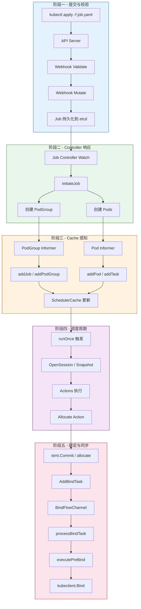
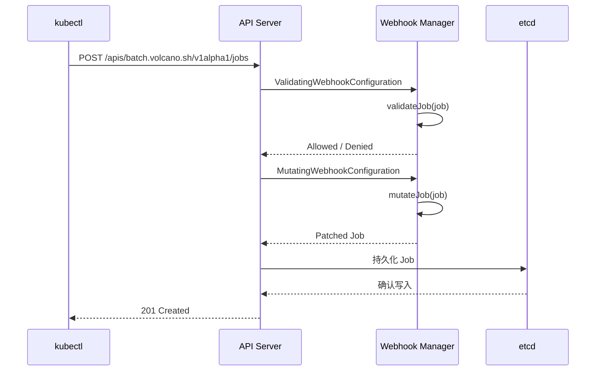
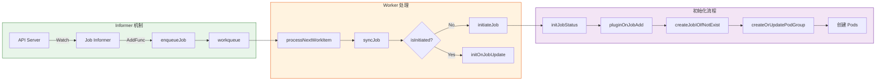
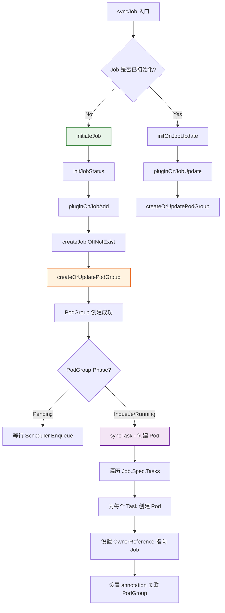
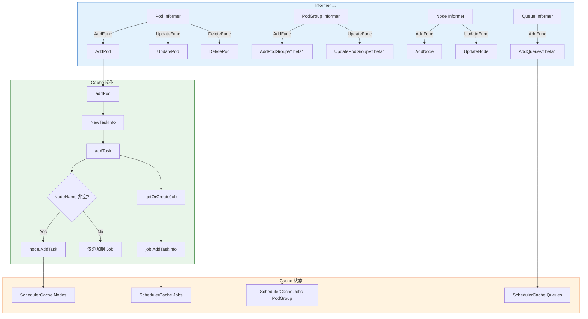
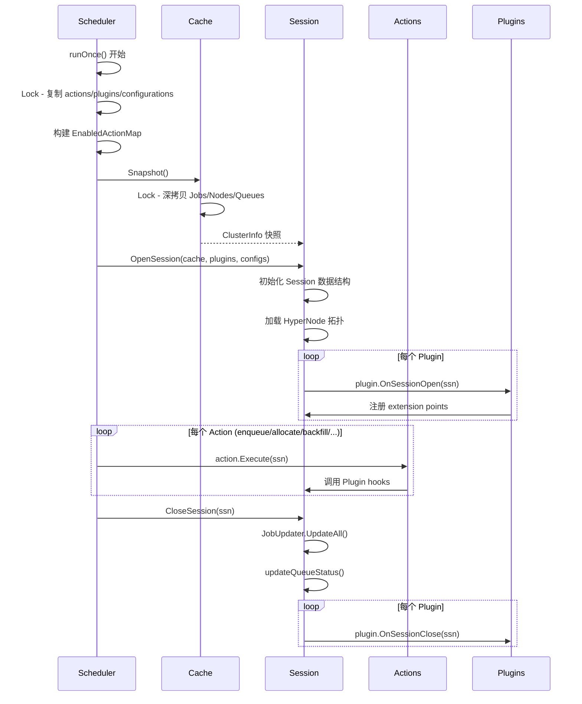
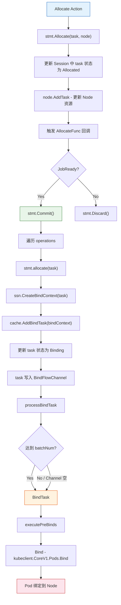
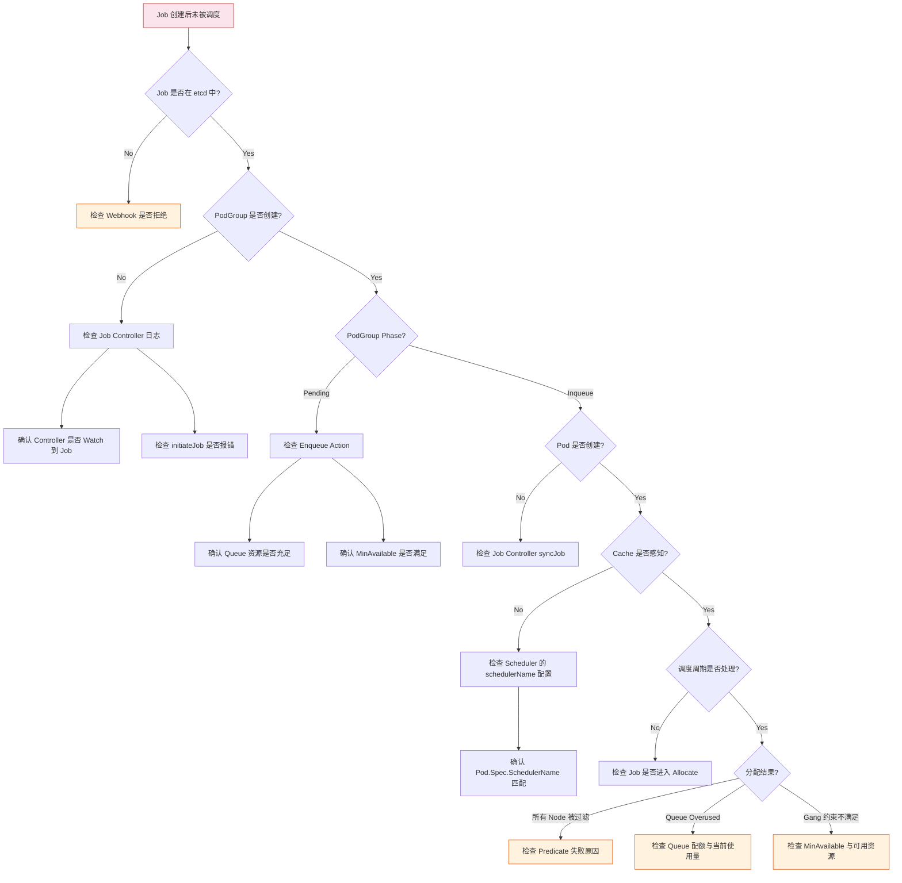

## 1. 概述

本文档从 DEBUG 视角完整追踪一个 Volcano Job 从 `kubectl apply` 提交到最终 Pod 被 Bind 到 Node 的全链路过程。理解这条链路对于定位 Job 卡住、调度失败、Pod 无法绑定等问题至关重要。

### 1.1 端到端链路总览



### 1.2 关键时间节点

| 阶段 | 关键事件 | 预期耗时 | 超时预警 |
|------|---------|---------|---------|
| Webhook | Validate + Mutate | < 100ms | > 500ms |
| Controller | initiateJob + createPodGroup | < 1s | > 5s |
| Cache | Informer 同步 | < 2s | > 10s |
| 调度 | runOnce 一个周期 | < 5s | > 30s |
| 绑定 | processBindTask | < 1s | > 5s |

---

## 2. 阶段一 - kubectl 提交与 Webhook 校验

### 2.1 提交流程

当用户执行 `kubectl apply -f job.yaml` 时，请求首先到达 Kubernetes API Server。API Server 在持久化之前，会调用 Volcano 注册的 Admission Webhook 进行校验和变更。



### 2.2 Webhook 校验源码

Webhook 的入口在 `pkg/webhooks/` 目录下。Job 相关的 Webhook Handler 包括 Validate 和 Mutate 两类。

**关键校验逻辑：**

- Job 名称合法性检查
- Task 模板校验（至少一个 Task）
- MinAvailable 合理性（不能超过总 replicas）
- Queue 是否存在
- Plugin 配置合法性

### 2.3 调试断点建议

| 断点位置 | 用途 |
|---------|------|
| Webhook validateJob 入口 | 查看收到的 Job 对象完整字段 |
| Webhook mutateJob 入口 | 查看 Mutate 前的原始 Job |
| Webhook mutateJob 出口 | 对比 Mutate 后的变更内容 |

**klog 日志过滤模式：**

```bash
# 查看 Webhook 相关日志
kubectl logs -n volcano-system <webhook-pod> | grep -E "validate|mutate|admission"
```

---

## 3. 阶段二 - Controller 响应

### 3.1 Job Controller Watch 机制

Job Controller 通过 Informer 机制 Watch `batch.volcano.sh/v1alpha1` 的 Job 资源。当新 Job 被创建时，Controller 的 AddFunc 回调被触发。



### 3.2 initiateJob 核心逻辑

源码位于 `pkg/controllers/job/job_controller_actions.go` 第 285-314 行：

```go
// pkg/controllers/job/job_controller_actions.go:285
func (cc *jobcontroller) initiateJob(job *batch.Job) (*batch.Job, error) {
    klog.V(3).Infof("Starting to initiate Job <%s/%s>", job.Namespace, job.Name)
    jobInstance, err := cc.initJobStatus(job)
    if err != nil {
        cc.recorder.Event(job, v1.EventTypeWarning, string(batch.JobStatusError),
            fmt.Sprintf("Failed to initialize job status, err: %v", err))
        return nil, err
    }

    if err := cc.pluginOnJobAdd(jobInstance); err != nil {
        // ...
    }

    newJob, err := cc.createJobIOIfNotExist(jobInstance)
    // ...

    if err := cc.createOrUpdatePodGroup(newJob); err != nil {
        // ...
    }

    return newJob, nil
}
```

### 3.3 syncJob - 创建 Pod 的核心逻辑

源码位于 `pkg/controllers/job/job_controller_actions.go` 第 343 行：

```go
// pkg/controllers/job/job_controller_actions.go:343
func (cc *jobcontroller) syncJob(jobInfo *apis.JobInfo, updateStatus state.UpdateStatusFn) error {
    job := jobInfo.Job
    klog.V(3).Infof("Starting to sync up Job <%s/%s>, current version %d",
        job.Namespace, job.Name, job.Status.Version)

    // ... 初始化检查 ...

    if !isInitiated(job) {
        if job, err = cc.initiateJob(job); err != nil {
            return err
        }
    }
    // ... 创建 Pod 并同步状态 ...
}
```

### 3.4 PodGroup 创建与 Pod 创建的关系



### 3.5 调试断点建议

| 断点位置 | 文件路径 | 用途 |
|---------|---------|------|
| `syncJob` 入口 | `pkg/controllers/job/job_controller_actions.go:343` | 追踪 Job 处理的完整流程 |
| `initiateJob` 入口 | `pkg/controllers/job/job_controller_actions.go:285` | 追踪首次初始化 |
| `createOrUpdatePodGroup` | `pkg/controllers/job/job_controller_actions.go` | 确认 PodGroup 创建 |

**klog 日志过滤模式：**

```bash
# 查看 Job Controller 日志
kubectl logs -n volcano-system <controller-pod> | grep -E "Starting to sync|initiate|PodGroup"
```

---

## 4. 阶段三 - Cache 感知

### 4.1 Informer 事件处理流程

Scheduler Cache 通过多个 Informer 监听 Kubernetes 资源变化，并维护内部状态。



### 4.2 addTask 核心逻辑

源码位于 `pkg/scheduler/cache/event_handlers.go` 第 220-243 行：

```go
// pkg/scheduler/cache/event_handlers.go:220
func (sc *SchedulerCache) addTask(pi *schedulingapi.TaskInfo) error {
    if len(pi.NodeName) != 0 {
        if _, found := sc.Nodes[pi.NodeName]; !found {
            sc.Nodes[pi.NodeName] = schedulingapi.NewNodeInfo(nil)
            sc.Nodes[pi.NodeName].Name = pi.NodeName
        }

        node := sc.Nodes[pi.NodeName]
        if !isTerminated(pi.Status) {
            if err := node.AddTask(pi); err != nil {
                return err
            }
        }
    }

    job := sc.getOrCreateJob(pi)
    if job != nil {
        job.AddTaskInfo(pi)
    }

    return nil
}
```

### 4.3 AddPod 事件处理

源码位于 `pkg/scheduler/cache/event_handlers.go` 第 391-408 行：

```go
// pkg/scheduler/cache/event_handlers.go:391
func (sc *SchedulerCache) AddPod(obj interface{}) {
    pod, ok := obj.(*v1.Pod)
    if !ok {
        klog.Errorf("Cannot convert to *v1.Pod: %v", obj)
        return
    }

    sc.Mutex.Lock()
    defer sc.Mutex.Unlock()

    err := sc.addPod(pod)
    if err != nil {
        klog.Errorf("Failed to add pod <%s/%s> into cache: %v",
            pod.Namespace, pod.Name, err)
        return
    }
    klog.V(3).Infof("Added pod <%s/%v> into cache.", pod.Namespace, pod.Name)
}
```

### 4.4 getOrCreateJob - Job 与 Task 的关联

源码位于 `pkg/scheduler/cache/event_handlers.go` 第 70-84 行：

```go
// pkg/scheduler/cache/event_handlers.go:70
func (sc *SchedulerCache) getOrCreateJob(pi *schedulingapi.TaskInfo) *schedulingapi.JobInfo {
    if len(pi.Job) == 0 {
        if !slices.Contains(sc.schedulerNames, pi.Pod.Spec.SchedulerName) {
            klog.V(4).Infof("Pod %s/%s is not scheduled by %s, skip creating PodGroup and Job for it in cache.",
                pi.Pod.Namespace, pi.Pod.Name, strings.Join(sc.schedulerNames, ","))
        }
        return nil
    }

    if _, found := sc.Jobs[pi.Job]; !found {
        sc.Jobs[pi.Job] = schedulingapi.NewJobInfo(pi.Job)
    }

    return sc.Jobs[pi.Job]
}
```

### 4.5 调试断点建议

| 断点位置 | 文件路径 | 用途 |
|---------|---------|------|
| `AddPod` | `pkg/scheduler/cache/event_handlers.go:391` | 确认 Pod 被 Cache 捕获 |
| `addTask` | `pkg/scheduler/cache/event_handlers.go:220` | 追踪 Task 添加到 Node/Job |
| `getOrCreateJob` | `pkg/scheduler/cache/event_handlers.go:70` | 确认 Job 在 Cache 中创建 |

**klog 日志过滤模式：**

```bash
# 查看 Cache 事件（V3 级别）
kubectl logs -n volcano-system <scheduler-pod> -v 3 | grep -E "Added pod|Added node|addPodGroup"
```

---

## 5. 阶段四 - 调度周期

### 5.1 调度循环入口

Scheduler 的核心循环位于 `pkg/scheduler/scheduler.go`。`Run()` 方法启动后，会按 `schedulePeriod` 周期性调用 `runOnce()` 方法。

源码 `pkg/scheduler/scheduler.go` 第 91-103 行：

```go
// pkg/scheduler/scheduler.go:91
func (pc *Scheduler) Run(stopCh <-chan struct{}) {
    pc.loadSchedulerConf()
    go pc.watchSchedulerConf(stopCh)
    pc.cache.SetMetricsConf(pc.metricsConf)
    pc.cache.Run(stopCh)
    klog.V(2).Infof("Scheduler completes Initialization and start to run")
    go wait.Until(pc.runOnce, pc.schedulePeriod, stopCh)
    // ...
}
```

### 5.2 runOnce 核心流程

源码 `pkg/scheduler/scheduler.go` 第 107-135 行：

```go
// pkg/scheduler/scheduler.go:107
func (pc *Scheduler) runOnce() {
    klog.V(4).Infof("Start scheduling ...")
    scheduleStartTime := time.Now()
    defer klog.V(4).Infof("End scheduling ...")

    pc.mutex.Lock()
    actions := pc.actions
    plugins := pc.plugins
    configurations := pc.configurations
    pc.mutex.Unlock()

    conf.EnabledActionMap = make(map[string]bool)
    for _, action := range actions {
        conf.EnabledActionMap[action.Name()] = true
    }

    ssn := framework.OpenSession(pc.cache, plugins, configurations)
    defer func() {
        framework.CloseSession(ssn)
        metrics.UpdateE2eDuration(metrics.Duration(scheduleStartTime))
    }()

    for _, action := range actions {
        actionStartTime := time.Now()
        action.Execute(ssn)
        metrics.UpdateActionDuration(action.Name(), metrics.Duration(actionStartTime))
    }
}
```

### 5.3 调度周期时序图



### 5.4 Action 执行顺序

默认的 Action 执行顺序在 `pkg/scheduler/actions/factory.go` 中注册：

```go
// pkg/scheduler/actions/factory.go:33
func init() {
    framework.RegisterAction(reclaim.New())
    framework.RegisterAction(allocate.New())
    framework.RegisterAction(backfill.New())
    framework.RegisterAction(preempt.New())
    framework.RegisterAction(enqueue.New())
    framework.RegisterAction(shuffle.New())
}
```

实际执行顺序由配置文件决定，默认为：`enqueue` -> `allocate` -> `backfill` -> `reclaim` -> `preempt` -> `shuffle`。

### 5.5 调试断点建议

| 断点位置 | 文件路径 | 用途 |
|---------|---------|------|
| `runOnce` | `pkg/scheduler/scheduler.go:107` | 调度周期入口 |
| `OpenSession` | `pkg/scheduler/framework/framework.go:34` | Session 创建 |
| `Snapshot` | `pkg/scheduler/cache/cache.go:1424` | 快照创建 |
| `action.Execute` | `pkg/scheduler/scheduler.go:132` | 每个 Action 执行 |

---

## 6. 阶段五 - 绑定与状态同步

### 6.1 从 Allocate 到 Bind 的完整链路



### 6.2 Statement Commit 逻辑

源码位于 `pkg/scheduler/framework/statement.go` 第 418-439 行：

```go
// pkg/scheduler/framework/statement.go:418
func (s *Statement) Commit() {
    klog.V(3).Info("Committing operations ...")
    for _, op := range s.operations {
        op.task.ClearLastTxContext()
        switch op.name {
        case Evict:
            err := s.evict(op.task, op.reason)
            // ...
        case Pipeline:
            s.pipeline(op.task)
        case Allocate:
            err := s.allocate(op.task)
            if err != nil {
                if e := s.unallocate(op.task); e != nil {
                    klog.Errorf("Failed to unallocate task <%v/%v>: %v.",
                        op.task.Namespace, op.task.Name, e)
                }
            }
        }
    }
}
```

### 6.3 AddBindTask 逻辑

源码位于 `pkg/scheduler/cache/cache.go` 第 1286-1328 行：

```go
// pkg/scheduler/cache/cache.go:1286
func (sc *SchedulerCache) AddBindTask(bindContext *BindContext) error {
    klog.V(5).Infof("add bind task %v/%v",
        bindContext.TaskInfo.Namespace, bindContext.TaskInfo.Name)
    sc.Mutex.Lock()
    defer sc.Mutex.Unlock()
    job, task, err := sc.findJobAndTask(bindContext.TaskInfo)
    // ...
    originalStatus := task.Status
    if err := job.UpdateTaskStatus(task, schedulingapi.Binding); err != nil {
        return err
    }
    // ...
    if err := node.AddTask(task); err != nil {
        // rollback ...
    }
    sc.BindFlowChannel <- bindContext
    return nil
}
```

### 6.4 processBindTask 批量绑定

源码位于 `pkg/scheduler/cache/cache.go` 第 1330-1354 行：

```go
// pkg/scheduler/cache/cache.go:1330
func (sc *SchedulerCache) processBindTask() {
    for {
        select {
        case bindContext, ok := <-sc.BindFlowChannel:
            if !ok {
                return
            }
            sc.bindCache = append(sc.bindCache, bindContext)
            if len(sc.bindCache) == sc.batchNum {
                sc.BindTask()
            }
        default:
        }
        if len(sc.BindFlowChannel) == 0 {
            break
        }
    }
    if len(sc.bindCache) == 0 {
        return
    }
    sc.BindTask()
}
```

### 6.5 DefaultBinder.Bind

源码位于 `pkg/scheduler/cache/cache.go` 第 218-239 行：

```go
// pkg/scheduler/cache/cache.go:218
func (db *DefaultBinder) Bind(kubeClient kubernetes.Interface, tasks []*schedulingapi.TaskInfo) map[schedulingapi.TaskID]string {
    errMsg := make(map[schedulingapi.TaskID]string)
    for _, task := range tasks {
        p := task.Pod
        if err := db.kubeclient.CoreV1().Pods(p.Namespace).Bind(context.TODO(),
            &v1.Binding{
                ObjectMeta: metav1.ObjectMeta{
                    Namespace: p.Namespace, Name: p.Name, UID: p.UID,
                    Annotations: p.Annotations,
                },
                Target: v1.ObjectReference{Kind: "Node", Name: task.NodeName},
            },
            metav1.CreateOptions{}); err != nil {
            klog.Errorf("Failed to bind pod <%v/%v> to node %s : %#v",
                p.Namespace, p.Name, task.NodeName, err)
            errMsg[task.UID] = err.Error()
        } else {
            metrics.UpdateTaskScheduleDuration(metrics.Duration(p.CreationTimestamp.Time))
        }
    }
    return errMsg
}
```

### 6.6 调试断点建议

| 断点位置 | 文件路径 | 用途 |
|---------|---------|------|
| `Statement.Commit` | `pkg/scheduler/framework/statement.go:418` | 确认 Commit 触发 |
| `Statement.allocate` | `pkg/scheduler/framework/statement.go:334` | 追踪 Bind 上下文创建 |
| `AddBindTask` | `pkg/scheduler/cache/cache.go:1286` | 追踪 BindFlowChannel 写入 |
| `processBindTask` | `pkg/scheduler/cache/cache.go:1330` | 追踪批量绑定 |
| `DefaultBinder.Bind` | `pkg/scheduler/cache/cache.go:218` | 确认 kubeclient.Bind 调用 |

---

## 7. 调试技巧

### 7.1 klog 日志级别说明

Volcano 使用 klog 进行日志记录，不同级别的日志提供不同粒度的信息：

| klog 级别 | 内容类型 | 使用场景 |
|----------|---------|---------|
| V(2) | 组件启动、配置加载 | 确认启动状态 |
| V(3) | 核心操作日志（Pod 添加、Job 同步、Session 开关） | 日常调试 |
| V(4) | 详细操作日志（调度周期开始/结束、跳过原因） | 定位卡住问题 |
| V(5) | 极详细日志（每个 Node 的资源、HyperNode 详情） | 深度排查 |

### 7.2 推荐的日志级别设置

```yaml
# volcano-scheduler deployment
spec:
  containers:
  - name: volcano-scheduler
    args:
    - --logtostderr
    - --v=4                    # 推荐 debug 时使用 V4
    - -2>&1
```

### 7.3 关键日志模式

```bash
# 1. 追踪某个 Job 的完整生命周期
kubectl logs -n volcano-system <scheduler-pod> | grep "job-name"

# 2. 查看调度周期
kubectl logs -n volcano-system <scheduler-pod> | grep -E "Start scheduling|End scheduling"

# 3. 查看 Session 开关
kubectl logs -n volcano-system <scheduler-pod> | grep -E "Open Session|Close Session"

# 4. 查看 Pod 绑定
kubectl logs -n volcano-system <scheduler-pod> | grep -E "Bindqing Task|bind task"

# 5. 查看 Allocate 决策
kubectl logs -n volcano-system <scheduler-pod> | grep -E "Allocate|allocat"
```

### 7.4 Delve 远程调试配置

```bash
# 1. 使用 dlv 启动 scheduler
dlv exec ./vc-scheduler -- \
  --scheduler-conf=/etc/volcano/scheduler.conf \
  --logtostderr --v=4

# 2. 关键断点设置
break pkg/scheduler/scheduler.go:107        # runOnce 入口
break pkg/scheduler/framework/framework.go:34  # OpenSession
break pkg/scheduler/actions/allocate/allocate.go:119  # Allocate.Execute
break pkg/scheduler/framework/statement.go:418  # Commit
break pkg/scheduler/cache/cache.go:1286     # AddBindTask
```

---

## 8. 常见问题定位

### 8.1 问题定位决策树



### 8.2 各阶段卡住的排查方法

#### Job 卡在 Pending

```bash
# 检查 PodGroup 状态
kubectl get podgroup -n <namespace> | grep <job-name>

# 检查 Queue 资源
kubectl get queue <queue-name> -o yaml

# 查看 Enqueue Action 日志
kubectl logs -n volcano-system <scheduler-pod> | grep -E "enqueue|Enqueue"
```

#### Job 卡在 Inqueue 但 Pod 未调度

```bash
# 检查 Pod 是否已创建
kubectl get pods -n <namespace> -l volcano.sh/job-name=<job-name>

# 检查 Scheduler Cache 是否感知
kubectl logs -n volcano-system <scheduler-pod> -v 3 | grep "Added pod"

# 检查 Allocate 是否处理该 Job
kubectl logs -n volcano-system <scheduler-pod> -v 3 | grep "Try to allocate"
```

#### Pod 分配了但未绑定

```bash
# 检查 Bind 相关日志
kubectl logs -n volcano-system <scheduler-pod> | grep -E "bind task|Bind|processBindTask"

# 检查 PreBind 是否失败
kubectl logs -n volcano-system <scheduler-pod> | grep "execute preBind"

# 检查 API Server 连通性
kubectl logs -n volcano-system <scheduler-pod> | grep "Failed to bind pod"
```

### 8.3 Cache Dumper 使用

当需要查看 Scheduler Cache 内部完整状态时，可以使用 Cache Dumper：

```bash
# 发送 SIGUSR2 信号触发 Cache Dump
kill -USR2 <scheduler-pid>

# Dump 文件位置由 --cache-dump-file-dir 参数指定
# 默认在 /tmp/ 目录下
```

### 8.4 Prometheus Metrics 关键指标

| Metric 名称 | 类型 | 说明 |
|------------|------|------|
| `e2e_scheduling_duration_seconds` | Histogram | 单次调度周期总耗时 |
| `action_duration_seconds` | Histogram | 每个 Action 的执行耗时 |
| `plugin_scheduling_duration_seconds` | Histogram | 每个 Plugin 的执行耗时 |
| `task_schedule_duration_seconds` | Histogram | Task 从创建到调度的延迟 |
| `e2e_job_scheduling_duration_seconds` | Gauge | Job 端到端调度延迟 |

```bash
# 查看 Prometheus metrics
kubectl port-forward -n volcano-system <scheduler-pod> 8080:8080
curl http://localhost:8080/metrics | grep -E "e2e_scheduling|action_duration"
```

---

## 9. 总结

Job 从提交到调度完成的端到端链路涉及 5 个核心阶段：

1. **Webhook 校验** - 确保 Job 定义合法
2. **Controller 响应** - 创建 PodGroup 和 Pods
3. **Cache 感知** - Informer 将资源变化同步到 Scheduler Cache
4. **调度周期** - runOnce 执行 Action Pipeline，Allocate 分配资源
5. **绑定同步** - 通过 BindFlowChannel 异步批量绑定 Pod 到 Node

理解这条完整链路，结合 klog 日志级别和断点设置，可以高效定位各阶段可能出现的问题。
