## 1. 概述

`runOnce()` 是 Volcano Scheduler 的心跳方法。每个调度周期由 `wait.Until` 按 `schedulePeriod` 间隔触发一次 `runOnce()`，完成一轮完整的调度决策。理解 `runOnce()` 的每个子阶段对于性能调优和故障排查至关重要。

本文档从 DEBUG 视角逐步拆解 `runOnce()` 的执行过程，包括锁获取、快照创建、Session 打开、Action 执行、Session 关闭等核心阶段。

### 1.1 runOnce 生命周期概览

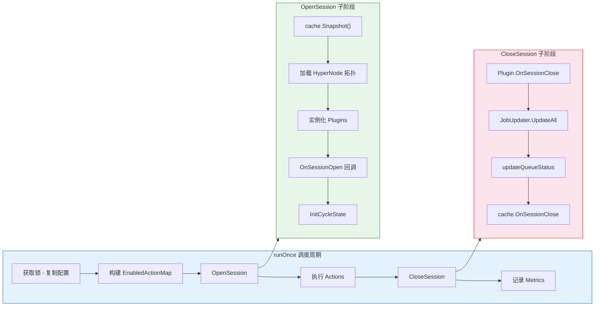

---

## 2. 调度周期全景图

### 2.1 完整时序图

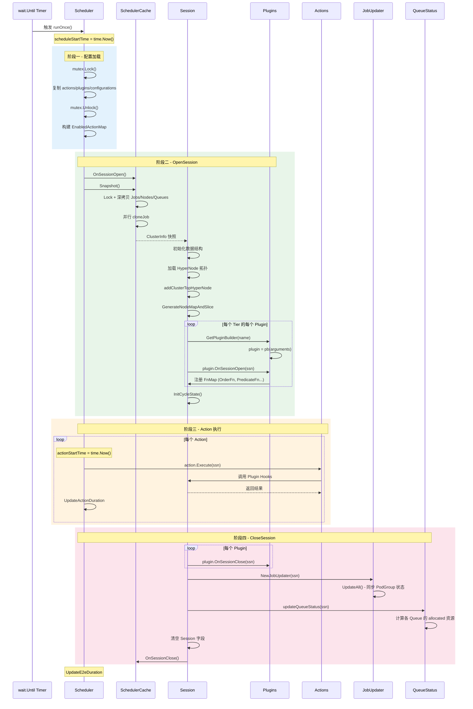

### 2.2 各阶段耗时分布

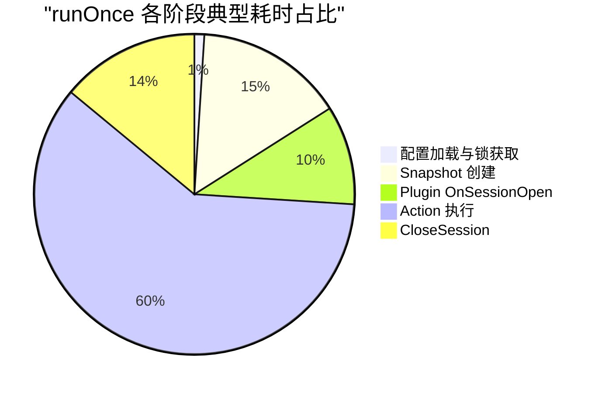

---

## 3. 阶段一 - 配置加载与锁获取

### 3.1 源码分析

源码位于 `pkg/scheduler/scheduler.go` 第 107-122 行：

```go
// pkg/scheduler/scheduler.go:107
func (pc *Scheduler) runOnce() {
    klog.V(4).Infof("Start scheduling ...")
    scheduleStartTime := time.Now()
    defer klog.V(4).Infof("End scheduling ...")

    pc.mutex.Lock()
    actions := pc.actions
    plugins := pc.plugins
    configurations := pc.configurations
    pc.mutex.Unlock()

    // Load ConfigMap to check which action is enabled.
    conf.EnabledActionMap = make(map[string]bool)
    for _, action := range actions {
        conf.EnabledActionMap[action.Name()] = true
    }
    // ...
}
```

### 3.2 关键细节

**为什么需要复制配置？**

Scheduler 支持配置文件热加载（通过 `fsnotify` 文件监听）。`watchSchedulerConf` 在后台 goroutine 中运行，当配置文件变更时会调用 `loadSchedulerConf()` 更新 `pc.actions/plugins/configurations`。为了避免在调度周期中配置被修改，这里通过 mutex 做了快照拷贝。

**EnabledActionMap 的作用：**

`conf.EnabledActionMap` 是一个全局 Map，用于让某些 Plugin/Action 知道当前哪些 Action 被启用。例如，Allocate Action 的 `buildAllocateContext` 中会检查 enqueue Action 是否启用：

```go
// pkg/scheduler/actions/allocate/allocate.go:152
if conf.EnabledActionMap["enqueue"] {
    klog.V(4).Infof("Job <%s/%s> Queue <%s> skip allocate, reason: job status is pending.",
        job.Namespace, job.Name, job.Queue)
    continue
}
```

### 3.3 调试建议

| 检查项 | 方法 |
|-------|------|
| 配置是否正确加载 | 查看 V(2) 日志 `Finished loading scheduler config` |
| 热加载是否生效 | 修改配置后查看 `watch event` 日志 |
| 锁竞争 | 分析 pprof mutex profile |

---

## 4. 阶段二 - OpenSession 详解

### 4.1 OpenSession 入口

源码位于 `pkg/scheduler/framework/framework.go` 第 34-58 行：

```go
// pkg/scheduler/framework/framework.go:34
func OpenSession(cache cache.Cache, tiers []conf.Tier, configurations []conf.Configuration) *Session {
    ssn := openSession(cache)
    ssn.Tiers = tiers
    ssn.Configurations = configurations
    ssn.NodeMap = GenerateNodeMapAndSlice(ssn.Nodes)
    ssn.PodLister = NewPodLister(ssn)

    for _, tier := range tiers {
        for _, plugin := range tier.Plugins {
            if pb, found := GetPluginBuilder(plugin.Name); !found {
                klog.Errorf("Failed to get plugin %s.", plugin.Name)
            } else {
                plugin := pb(plugin.Arguments)
                ssn.plugins[plugin.Name()] = plugin
                onSessionOpenStart := time.Now()
                plugin.OnSessionOpen(ssn)
                metrics.UpdatePluginDuration(plugin.Name(), metrics.OnSessionOpen,
                    metrics.Duration(onSessionOpenStart))
            }
        }
    }

    ssn.InitCycleState()
    return ssn
}
```

### 4.2 openSession - 核心初始化

源码位于 `pkg/scheduler/framework/session.go` 第 165-282 行。该函数完成以下关键步骤：

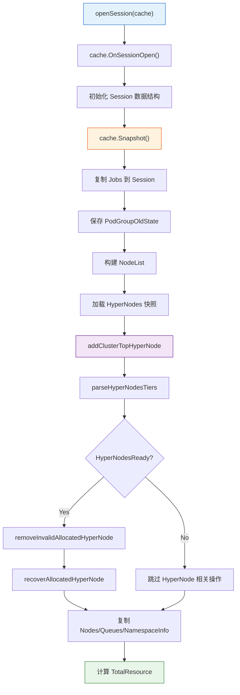

### 4.3 Snapshot 深度分析

Snapshot 是整个调度周期最关键的操作之一 - 它为调度器创建一个一致的集群状态视图。

源码位于 `pkg/scheduler/cache/cache.go` 第 1423-1533 行：

```go
// pkg/scheduler/cache/cache.go:1423
func (sc *SchedulerCache) Snapshot() *schedulingapi.ClusterInfo {
    sc.Mutex.Lock()
    defer sc.Mutex.Unlock()

    snapshot := &schedulingapi.ClusterInfo{
        Nodes:   make(map[string]*schedulingapi.NodeInfo),
        Jobs:    make(map[schedulingapi.JobID]*schedulingapi.JobInfo),
        Queues:  make(map[schedulingapi.QueueID]*schedulingapi.QueueInfo),
        // ... 其他字段初始化 ...
    }

    // 1. 复制 NodeList
    copy(snapshot.NodeList, sc.NodeList)

    // 2. 复制 Nodes（仅 Ready 节点）
    for _, value := range sc.Nodes {
        if !value.Ready() { continue }
        snapshot.Nodes[value.Name] = value.Clone()
    }

    // 3. 快照 HyperNodes（单独加锁）
    sc.HyperNodesInfo.Lock()
    snapshot.HyperNodes = sc.HyperNodesInfo.HyperNodes()
    // ...
    sc.HyperNodesInfo.Unlock()

    // 4. 复制 Queues
    for _, value := range sc.Queues {
        snapshot.Queues[value.UID] = value.Clone()
    }

    // 5. 并行克隆 Jobs
    var cloneJobLock sync.Mutex
    var wg sync.WaitGroup
    cloneJob := func(value *schedulingapi.JobInfo) {
        defer wg.Done()
        clonedJob := value.Clone()
        cloneJobLock.Lock()
        snapshot.Jobs[value.UID] = clonedJob
        cloneJobLock.Unlock()
    }
    for _, value := range sc.Jobs {
        if value.PodGroup == nil { continue }
        if _, found := snapshot.Queues[value.Queue]; !found { continue }
        wg.Add(1)
        go cloneJob(value)
    }
    wg.Wait()

    return snapshot
}
```

### 4.4 Snapshot 关键调试点

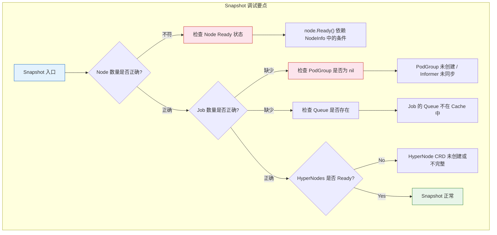

**Snapshot 日志关键模式：**

```bash
# V(3) - 查看 Snapshot 汇总
kubectl logs <scheduler> | grep "SnapShot for scheduling"
# 输出: SnapShot for scheduling jobNum=15, QueueNum=3, NodeNum=10

# V(4) - 查看 HyperNode 详情
kubectl logs <scheduler> -v 4 | grep "HyperNode snapShot"

# V(4) - 查看 Job 优先级
kubectl logs <scheduler> -v 4 | grep "The priority of job"
```

### 4.5 Plugin 实例化与 OnSessionOpen

Plugin 实例化发生在 `OpenSession` 中，按 Tier 顺序遍历。每个 Plugin 的 `OnSessionOpen` 方法会向 Session 注册各种 Hook 函数。

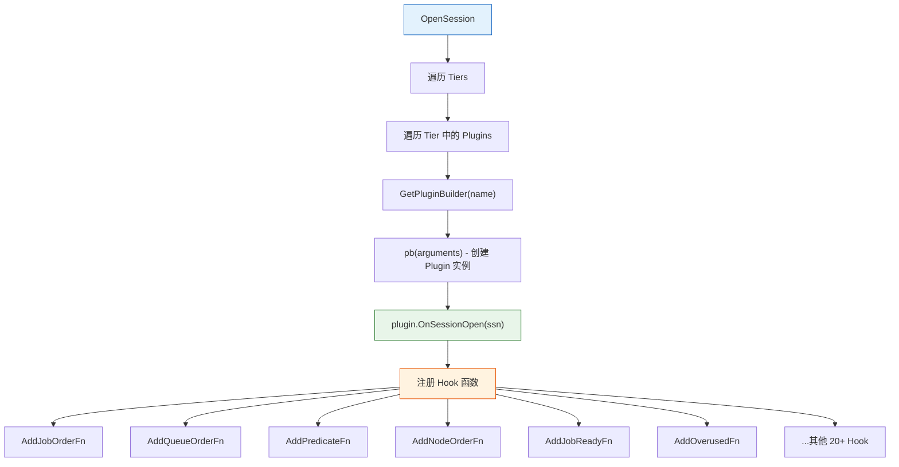

**常见 Plugin 注册的 Hook：**

| Plugin | 注册的 Hook | 用途 |
|--------|-----------|------|
| `gang` | JobOrderFn, JobReadyFn, JobPipelinedFn, JobValidFn | Gang Scheduling 约束 |
| `drf` | JobOrderFn, EventHandler, PreemptableFn | DRF 公平调度 |
| `proportion` | QueueOrderFn, OverusedFn, AllocatableFn, JobEnqueueableFn | Queue 配额管理 |
| `predicates` | PredicateFn, PrePredicateFn | K8s 兼容性过滤 |
| `nodeorder` | BatchNodeOrderFn | Node 评分 |
| `binpack` | NodeOrderFn | 资源紧凑分配 |

### 4.6 调试断点建议

| 断点位置 | 文件路径 | 用途 |
|---------|---------|------|
| `openSession` | `pkg/scheduler/framework/session.go:165` | Session 初始化 |
| `cache.Snapshot()` | `pkg/scheduler/cache/cache.go:1424` | 快照创建 |
| `plugin.OnSessionOpen` | `pkg/scheduler/framework/framework.go:49` | Plugin 初始化 |
| `AddPredicateFn` | `pkg/scheduler/framework/session_plugins.go` | 确认 Hook 注册 |

---

## 5. 阶段三 - Action 流水线执行

### 5.1 Action 执行循环

源码位于 `pkg/scheduler/scheduler.go` 第 130-134 行：

```go
// pkg/scheduler/scheduler.go:130
for _, action := range actions {
    actionStartTime := time.Now()
    action.Execute(ssn)
    metrics.UpdateActionDuration(action.Name(), metrics.Duration(actionStartTime))
}
```

### 5.2 默认 Action 流水线

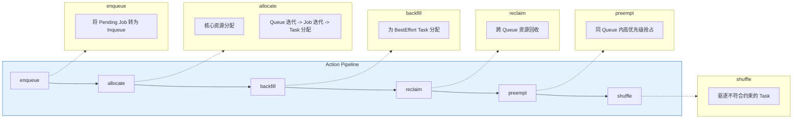

### 5.3 各 Action 的数据流

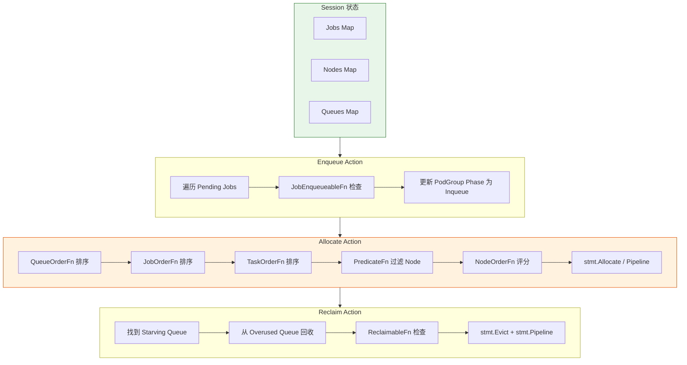

### 5.4 Action 执行耗时监控

每个 Action 执行后都会记录 Prometheus Metric：

```go
metrics.UpdateActionDuration(action.Name(), metrics.Duration(actionStartTime))
```

**关键 Metric：**

| Metric | 标签 | 说明 |
|--------|------|------|
| `action_duration_seconds` | `action=enqueue` | Enqueue 耗时 |
| `action_duration_seconds` | `action=allocate` | Allocate 耗时（通常最长） |
| `action_duration_seconds` | `action=preempt` | Preempt 耗时 |

**调试建议：**

```bash
# 查看各 Action 耗时
curl http://localhost:8080/metrics | grep action_duration

# 对比各 Action 占比
curl http://localhost:8080/metrics | grep action_duration_seconds_sum
```

---

## 6. 阶段四 - CloseSession 详解

### 6.1 CloseSession 入口

源码位于 `pkg/scheduler/framework/framework.go` 第 61-70 行：

```go
// pkg/scheduler/framework/framework.go:61
func CloseSession(ssn *Session) {
    for _, plugin := range ssn.plugins {
        onSessionCloseStart := time.Now()
        plugin.OnSessionClose(ssn)
        metrics.UpdatePluginDuration(plugin.Name(), metrics.OnSessionClose,
            metrics.Duration(onSessionCloseStart))
    }

    closeSession(ssn)
    ssn.cache.OnSessionClose()
}
```

### 6.2 closeSession 核心逻辑

源码位于 `pkg/scheduler/framework/session.go` 第 597-617 行：

```go
// pkg/scheduler/framework/session.go:597
func closeSession(ssn *Session) {
    ju := NewJobUpdater(ssn)
    ju.UpdateAll()

    updateQueueStatus(ssn)

    ssn.Jobs = nil
    ssn.Nodes = nil
    ssn.RevocableNodes = nil
    ssn.plugins = nil
    ssn.eventHandlers = nil
    ssn.jobOrderFns = nil
    ssn.queueOrderFns = nil
    ssn.clusterOrderFns = nil
    ssn.NodeList = nil
    ssn.TotalResource = nil

    ssn.cache.OnSessionClose()

    klog.V(3).Infof("Close Session %v", ssn.UID)
}
```

### 6.3 CloseSession 流程图

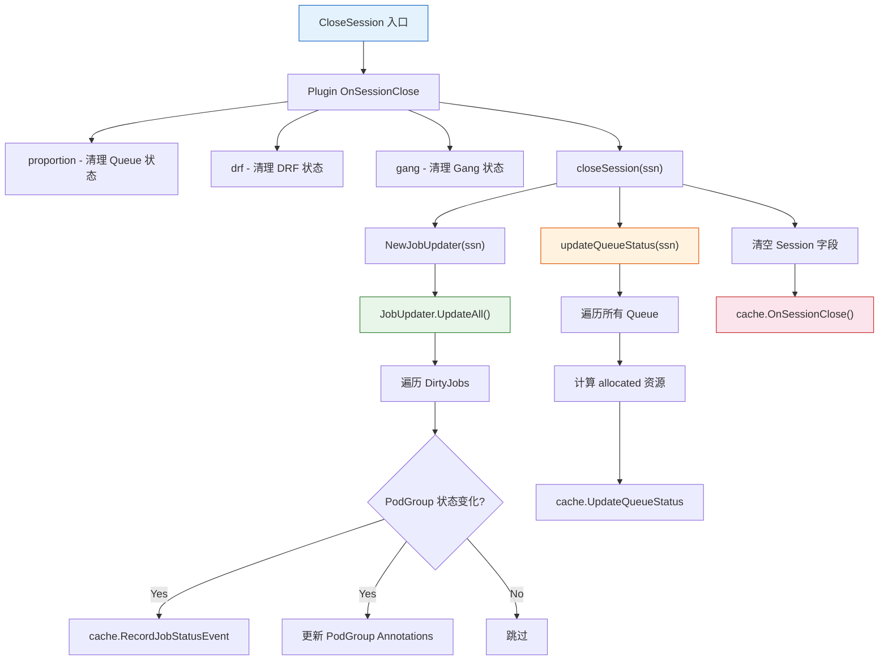

### 6.4 JobUpdater 详解

JobUpdater 负责将调度周期内的 Job 状态变化同步到 API Server。

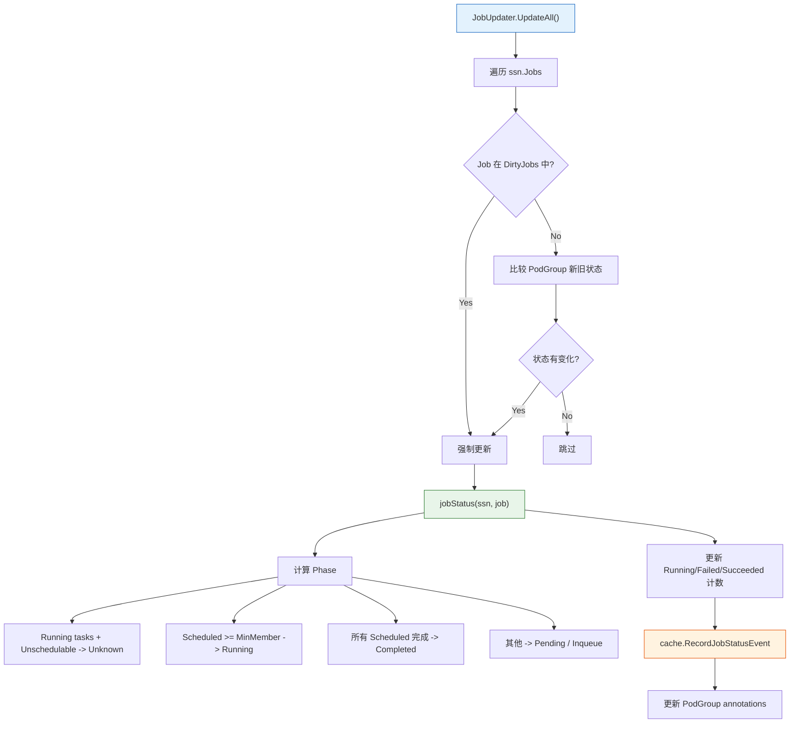

### 6.5 updateQueueStatus 详解

```go
// 伪代码 - updateQueueStatus 核心逻辑
func updateQueueStatus(ssn *Session) {
    for _, queue := range ssn.Queues {
        allocated := api.EmptyResource()
        for _, job := range ssn.Jobs {
            if job.Queue != queue.UID { continue }
            for status, tasks := range job.TaskStatusIndex {
                if api.AllocatedStatus(status) {
                    for _, task := range tasks {
                        allocated.Add(task.Resreq)
                    }
                }
            }
        }
        // 更新 Queue 的 allocated 字段
        ssn.cache.UpdateQueueStatus(queue, allocated)
    }
}
```

### 6.6 调试断点建议

| 断点位置 | 文件路径 | 用途 |
|---------|---------|------|
| `CloseSession` | `pkg/scheduler/framework/framework.go:61` | CloseSession 入口 |
| `closeSession` | `pkg/scheduler/framework/session.go:597` | 核心清理逻辑 |
| `JobUpdater.UpdateAll` | `pkg/scheduler/framework/session.go` | Job 状态同步 |
| `updateQueueStatus` | `pkg/scheduler/framework/session.go` | Queue 状态更新 |

---

## 7. 性能分析

### 7.1 各阶段耗时瓶颈

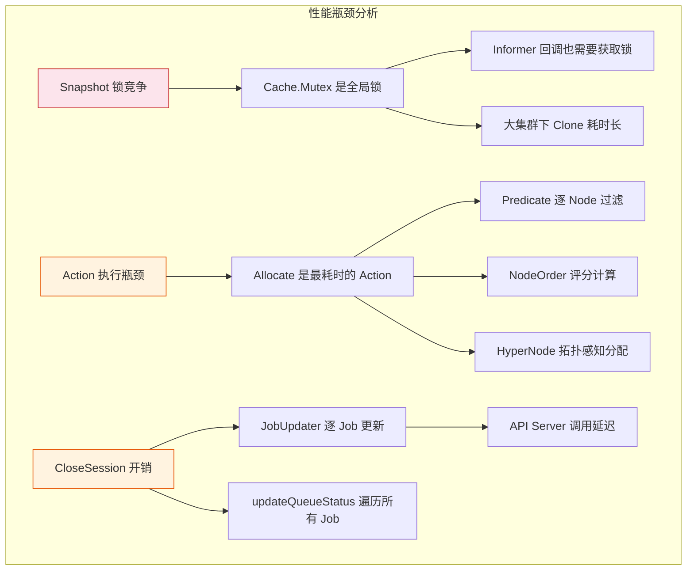

### 7.2 Snapshot 锁竞争分析

Snapshot 期间需要持有 `SchedulerCache.Mutex` 全局锁，这意味着在 Snapshot 执行过程中，所有 Informer 的 Add/Update/Delete 回调都会被阻塞。

**优化建议：**

1. **并行 Job Clone**: 源码中已实现（`go cloneJob(value)`），但 `cloneJobLock` 仍是序列化点
2. **减少 Clone 深度**: 对于不变的字段考虑浅拷贝
3. **增加 schedulePeriod**: 减少 Snapshot 频率以降低锁竞争

**监控方法：**

```bash
# 查看 Snapshot 日志中 Job/Node/Queue 数量
kubectl logs <scheduler> -v 3 | grep "SnapShot for scheduling"

# 使用 pprof 分析锁竞争
go tool pprof http://localhost:8080/debug/pprof/mutex
```

### 7.3 Action 执行性能分析

```bash
# 获取各 Action 耗时的 Prometheus 数据
curl -s http://localhost:8080/metrics | grep action_duration_seconds

# 示例输出
# action_duration_seconds_sum{action="enqueue"} 0.001
# action_duration_seconds_sum{action="allocate"} 2.345
# action_duration_seconds_sum{action="backfill"} 0.012
# action_duration_seconds_sum{action="reclaim"} 0.089
# action_duration_seconds_sum{action="preempt"} 0.156
```

### 7.4 Plugin 耗时分析

每个 Plugin 的 `OnSessionOpen` 和 `OnSessionClose` 都有独立的 Metric：

```bash
# 查看 Plugin 耗时
curl -s http://localhost:8080/metrics | grep plugin_scheduling_duration_seconds

# 关注以下 Plugin
# - proportion (OnSessionOpen 中计算 Queue 资源)
# - predicates (可能涉及 API 调用)
# - capacity (层级 Queue 资源计算)
```

---

## 8. 调试工具

### 8.1 Prometheus Metrics 完整列表

| Metric | 类型 | 说明 |
|--------|------|------|
| `e2e_scheduling_duration_seconds` | Histogram | runOnce 总耗时 |
| `action_duration_seconds` | Histogram | 单个 Action 耗时 |
| `plugin_scheduling_duration_seconds` | Histogram | Plugin OnSessionOpen/Close 耗时 |
| `task_schedule_duration_seconds` | Histogram | Task 从创建到 Bind 的延迟 |
| `schedule_attempts_total` | Counter | 调度尝试次数 |

### 8.2 klog V Level 建议

| 场景 | 推荐 V Level | 输出内容 |
|------|-------------|---------|
| 生产环境 | V(2) | 组件启动、配置变更 |
| 日常监控 | V(3) | Session 开关、Pod 增删、Queue 状态 |
| 问题排查 | V(4) | 调度周期详情、Job 跳过原因、优先级信息 |
| 深度调试 | V(5) | 每个 Node 的资源详情、HyperNode 拓扑、Predicate 详细结果 |

### 8.3 Cache Dumper 使用

```bash
# 启用 Cache Dumper
volcano-scheduler --enable-cache-dumper --cache-dump-file-dir=/tmp/volcano-dump

# 触发 Dump（发送 SIGUSR2 信号）
kill -USR2 $(pidof vc-scheduler)

# 查看 Dump 文件
ls /tmp/volcano-dump/
cat /tmp/volcano-dump/cache-dump-*.json
```

Cache Dumper 会输出 SchedulerCache 的完整状态，包括：

- 所有 Node 的资源使用情况（idle, used, allocatable）
- 所有 Job 的状态和 Task 分布
- 所有 Queue 的配额和使用量
- Namespace 信息

### 8.4 Delve 调试配置

```bash
# 设置调度周期相关断点
break pkg/scheduler/scheduler.go:107           # runOnce 入口
break pkg/scheduler/scheduler.go:124           # OpenSession 调用
break pkg/scheduler/scheduler.go:132           # Action 执行
break pkg/scheduler/framework/framework.go:34  # OpenSession 定义
break pkg/scheduler/framework/framework.go:61  # CloseSession 定义
break pkg/scheduler/cache/cache.go:1424        # Snapshot 入口

# 条件断点 - 仅在特定 Action 执行时停住
condition 3 action.Name() == "allocate"

# 查看 Session 中的 Job 数量
print len(ssn.Jobs)

# 查看 Session 中的 Node 数量
print len(ssn.Nodes)
```

### 8.5 常见问题排查表

| 症状 | 可能原因 | 排查方法 |
|------|---------|---------|
| 调度周期耗时过长 | Allocate Action 中 Node 过多 | 查看 `action_duration_seconds{action="allocate"}` |
| Snapshot 耗时异常 | Job 数量过多导致 Clone 慢 | 查看 `SnapShot for scheduling` 日志中的 jobNum |
| Session 中 Job 数量为 0 | PodGroup 为 nil 或 Queue 不存在 | 检查 V(4) 日志中的 skip 原因 |
| Plugin OnSessionOpen 超时 | Plugin 实现有性能问题 | 查看 `plugin_scheduling_duration_seconds` |
| 配置热加载不生效 | 文件监听未触发 | 查看 `watch event` 日志 |

---

## 9. 总结

`runOnce()` 的完整调度周期包含四个核心阶段：

1. **配置加载** - 通过 mutex 获取当前生效的 actions/plugins/configurations 的快照
2. **OpenSession** - 创建 Cache Snapshot，初始化 HyperNode 拓扑，实例化 Plugins 并注册 Hook 函数
3. **Action 执行** - 按序执行 enqueue/allocate/backfill/reclaim/preempt/shuffle，每个 Action 都有独立耗时记录
4. **CloseSession** - Plugin 清理，JobUpdater 同步 PodGroup 状态，updateQueueStatus 更新 Queue 资源

通过合理设置 klog 级别、监控 Prometheus Metrics、使用 Cache Dumper 和 Delve 调试，可以深入分析每个阶段的行为并快速定位性能瓶颈。
