## 1. 概述

Allocate 是 Volcano Scheduler 中最核心、最复杂的 Action。它负责将 Pending 状态的 Task 分配到合适的 Node 上。理解 Allocate Action 的完整执行流程对于调试调度失败、资源分配异常等问题至关重要。

本文档从 DEBUG 角度详细剖析 Allocate Action 的内部工作原理，包括队列迭代、Job 迭代、Task 分配、Node 过滤/评分以及 Statement Commit/Discard 等关键步骤。

### 1.1 Allocate 核心设计原则

- **公平调度**: 按 Queue 优先级轮转分配，避免单个 Queue 独占资源
- **Gang Scheduling**: 通过 Statement 模式实现"全有或全无"的分配语义
- **拓扑感知**: 支持 HyperNode 网络拓扑约束
- **两级资源梯度**: 优先使用 Idle 资源，其次使用 FutureIdle（即将释放的资源）

---

## 2. 执行流程总览

### 2.1 Allocate Action 完整流程

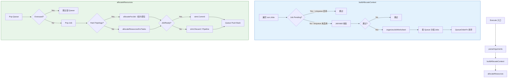

### 2.2 Execute 入口

源码位于 `pkg/scheduler/actions/allocate/allocate.go` 第 119-137 行：

```go
// pkg/scheduler/actions/allocate/allocate.go:119
func (alloc *Action) Execute(ssn *framework.Session) {
    klog.V(5).Infof("Enter Allocate ...")
    defer klog.V(5).Infof("Leaving Allocate ...")

    alloc.parseArguments(ssn)

    // 注释说明了分配的 5 个步骤:
    // 1. pick a queue named Q (using ssn.QueueOrderFn)
    // 2. pick a job named J from Q (using ssn.JobOrderFn)
    // 3. pick a task T from J (using ssn.TaskOrderFn)
    // 4. use predicateFn to filter out node that T can not be allocated on.
    // 5. use ssn.NodeOrderFn to judge the best node and assign it to T

    alloc.session = ssn
    alloc.recorder = NewRecorder()
    actx := alloc.buildAllocateContext()
    klog.V(3).Infof("Try to allocate resource to %d Queues", actx.queues.Len())
    alloc.allocateResources(actx)
}
```

---

## 3. 队列迭代

### 3.1 Queue 排序与过滤

Allocate Action 使用 `ssn.QueueOrderFn` 对队列进行优先级排序。该排序函数由 `proportion` Plugin 提供，基于 Queue 的 share（已用资源占配额的比例）进行排序，share 越小优先级越高。

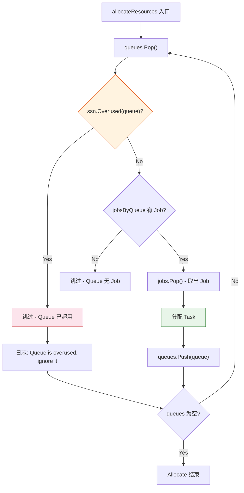

### 3.2 Overused 检查

`ssn.Overused(queue)` 由 `proportion` Plugin 提供的 `OverusedFn` 实现。当 Queue 的已分配资源达到或超过其 Deserved 资源时，返回 `true`。

源码位于 `pkg/scheduler/actions/allocate/allocate.go` 第 288-291 行：

```go
// pkg/scheduler/actions/allocate/allocate.go:288
if ssn.Overused(queue) {
    klog.V(3).Infof("Queue <%s> is overused, ignore it.", queue.Name)
    continue
}
```

### 3.3 Queue 轮转机制

每次从 Queue 中 Pop 出一个 Job 并处理后，该 Queue 会被 Push 回优先队列。由于 Queue 的 share 已经变化（分配了新资源），下次 Pop 时排序可能不同，从而实现公平轮转。

```go
// pkg/scheduler/actions/allocate/allocate.go:339
// Put back the queue to priority queue after job's resource allocating finished
queues.Push(queue)
```

### 3.4 调试要点

```bash
# 查看 Queue Overused 状态
kubectl logs <scheduler> -v 3 | grep "overused"

# 查看 Queue 分配顺序
kubectl logs <scheduler> -v 3 | grep "Try to allocate resource"
```

---

## 4. Job 迭代

### 4.1 buildAllocateContext - Job 过滤与组织

源码位于 `pkg/scheduler/actions/allocate/allocate.go` 第 139-203 行：

```go
// pkg/scheduler/actions/allocate/allocate.go:139
func (alloc *Action) buildAllocateContext() *allocateContext {
    ssn := alloc.session
    actx := &allocateContext{
        queues:      util.NewPriorityQueue(ssn.QueueOrderFn),
        jobsByQueue: make(map[api.QueueID]*util.PriorityQueue),
        // ...
    }

    for _, job := range ssn.Jobs {
        // 过滤 Pending Job（如果 enqueue 启用）
        if job.IsPending() {
            if conf.EnabledActionMap["enqueue"] {
                continue
            } else {
                job.PodGroup.Status.Phase = scheduling.PodGroupInqueue
            }
        }

        // JobValid 校验
        if vr := ssn.JobValid(job); vr != nil && !vr.Pass {
            continue
        }

        // Queue 存在性检查
        if _, found := ssn.Queues[job.Queue]; !found {
            continue
        }

        // HyperNode 就绪检查
        if !ssn.HyperNodesReadyToSchedule && job.ContainsNetworkTopology() {
            continue
        }

        // 组织 Job Worksheet
        worksheet := alloc.organizeJobWorksheet(job)
        if worksheet.Empty() { continue }

        // 加入 Queue 对应的 Job 优先队列
        actx.jobsByQueue[job.Queue].Push(job)
    }
    return actx
}
```

### 4.2 Job 过滤决策树

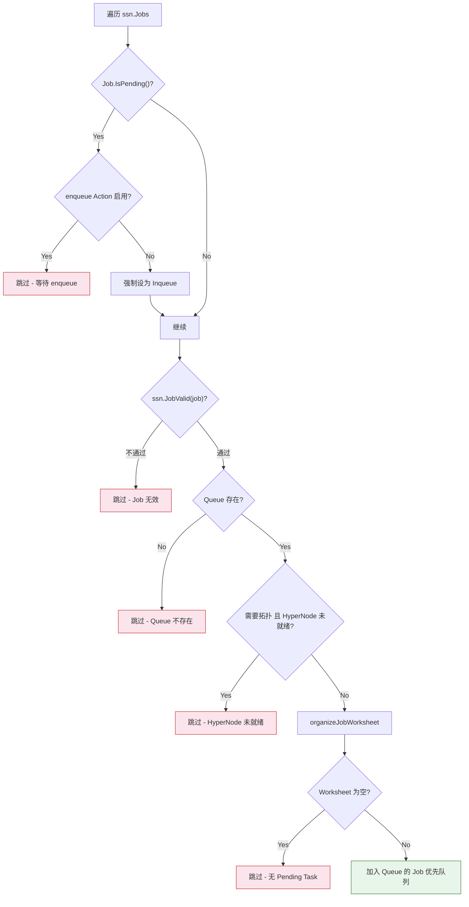

### 4.3 JobValid 校验

`ssn.JobValid(job)` 由 `gang` Plugin 提供。它检查 Job 是否满足 Gang 约束（例如 MinAvailable 是否合理）。

### 4.4 organizeJobWorksheet

源码位于 `pkg/scheduler/actions/allocate/allocate.go` 第 205-275 行。该函数将 Job 中的 Pending Task 组织成可调度的工作表：

```go
// pkg/scheduler/actions/allocate/allocate.go:205
func (alloc *Action) organizeJobWorksheet(job *api.JobInfo) *JobWorksheet {
    // 1. 过滤已 Ready 的 SubJob
    // 2. 按 SubJobOrderFn 排序
    // 3. 找出满足最小要求的 SubJob 集合
    // 4. 将 Pending Task 加入 SubJobWorksheet
    //    - 跳过 SchGated 的 Task
    //    - 跳过 BestEffort Task (资源请求为空)
}
```

### 4.5 调试要点

```bash
# 查看 Job 被跳过的原因
kubectl logs <scheduler> -v 4 | grep "skip allocate"

# 查看 Job 加入队列
kubectl logs <scheduler> -v 4 | grep "Added Job"

# 查看 Job Valid 结果
kubectl logs <scheduler> -v 4 | grep "JobValid"
```

---

## 5. Task 分配流程

### 5.1 allocateResourcesForTasks 核心逻辑

源码位于 `pkg/scheduler/actions/allocate/allocate.go` 第 551-669 行。这是 Allocate Action 最核心的函数：

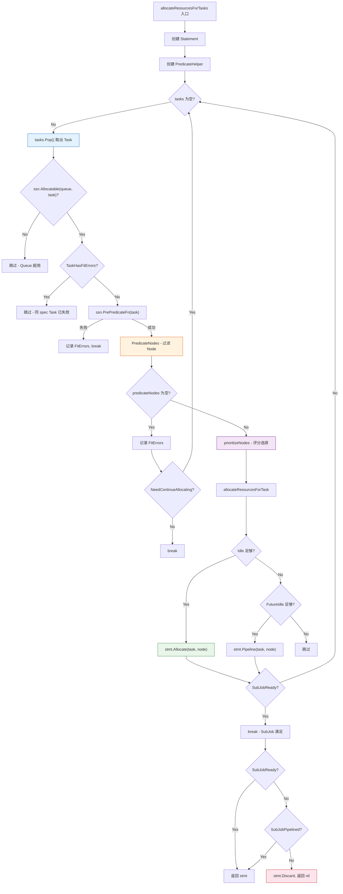

### 5.2 PrePredicateFn - 预过滤

`ssn.PrePredicateFn(task)` 在遍历 Node 之前执行一次性检查。如果 PrePredicate 失败，则该 Task 无法调度到任何 Node，直接 break 退出循环。

```go
// pkg/scheduler/actions/allocate/allocate.go:586
if err := ssn.PrePredicateFn(task); err != nil {
    klog.V(3).Infof("PrePredicate for task %s/%s failed for: %v",
        task.Namespace, task.Name, err)
    fitErrors := api.NewFitErrors()
    for _, ni := range nodes {
        fitErrors.SetNodeError(ni.Name, err)
    }
    job.NodesFitErrors[task.UID] = fitErrors
    break
}
```

**PrePredicateFn 的典型实现：** `predicates` Plugin 在 PrePredicate 中执行 K8s 的 PreFilter 扩展点（如 PodAffinity 预计算、资源请求合法性检查等）。

### 5.3 Node 过滤 - PredicateNodes

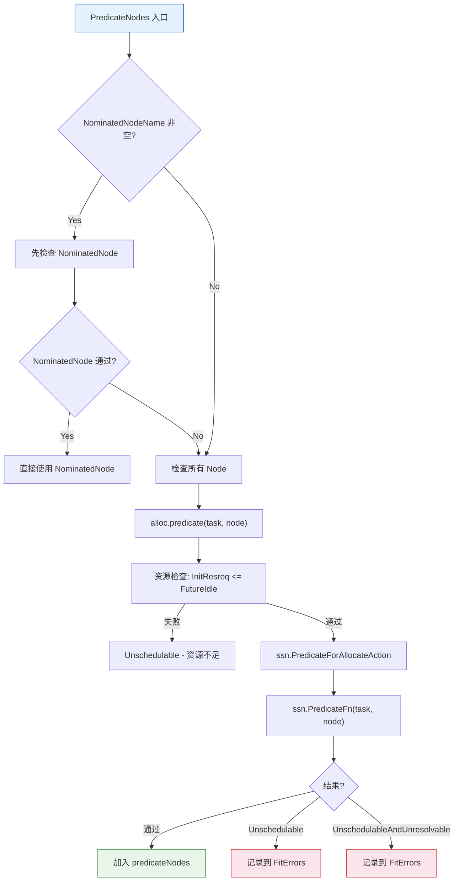

**alloc.predicate 函数：**

源码位于 `pkg/scheduler/actions/allocate/allocate.go` 第 815-823 行：

```go
// pkg/scheduler/actions/allocate/allocate.go:815
func (alloc *Action) predicate(task *api.TaskInfo, node *api.NodeInfo) error {
    // 资源检查
    var statusSets api.StatusSets
    if ok, resources := task.InitResreq.LessEqualWithResourcesName(
        node.FutureIdle(), api.Zero); !ok {
        statusSets = append(statusSets,
            &api.Status{Code: api.Unschedulable,
                Reason: api.WrapInsufficientResourceReason(resources)})
        return api.NewFitErrWithStatus(task, node, statusSets...)
    }
    return alloc.session.PredicateForAllocateAction(task, node)
}
```

**PredicateForAllocateAction：**

源码位于 `pkg/scheduler/framework/session.go` 第 698-719 行：

```go
// pkg/scheduler/framework/session.go:698
func (ssn *Session) PredicateForAllocateAction(task *api.TaskInfo, node *api.NodeInfo) error {
    err := ssn.PredicateFn(task, node)
    if err == nil {
        return nil
    }

    fitError, ok := err.(*api.FitError)
    if !ok {
        return api.NewFitError(task, node, err.Error())
    }

    statusSets := fitError.Status
    if statusSets.ContainsUnschedulable() ||
       statusSets.ContainsUnschedulableAndUnresolvable() ||
       statusSets.ContainsErrorSkipOrWait() {
        return fitError
    }
    return nil
}
```

### 5.4 Node 评分 - prioritizeNodes

源码位于 `pkg/scheduler/actions/allocate/allocate.go` 第 708-777 行：

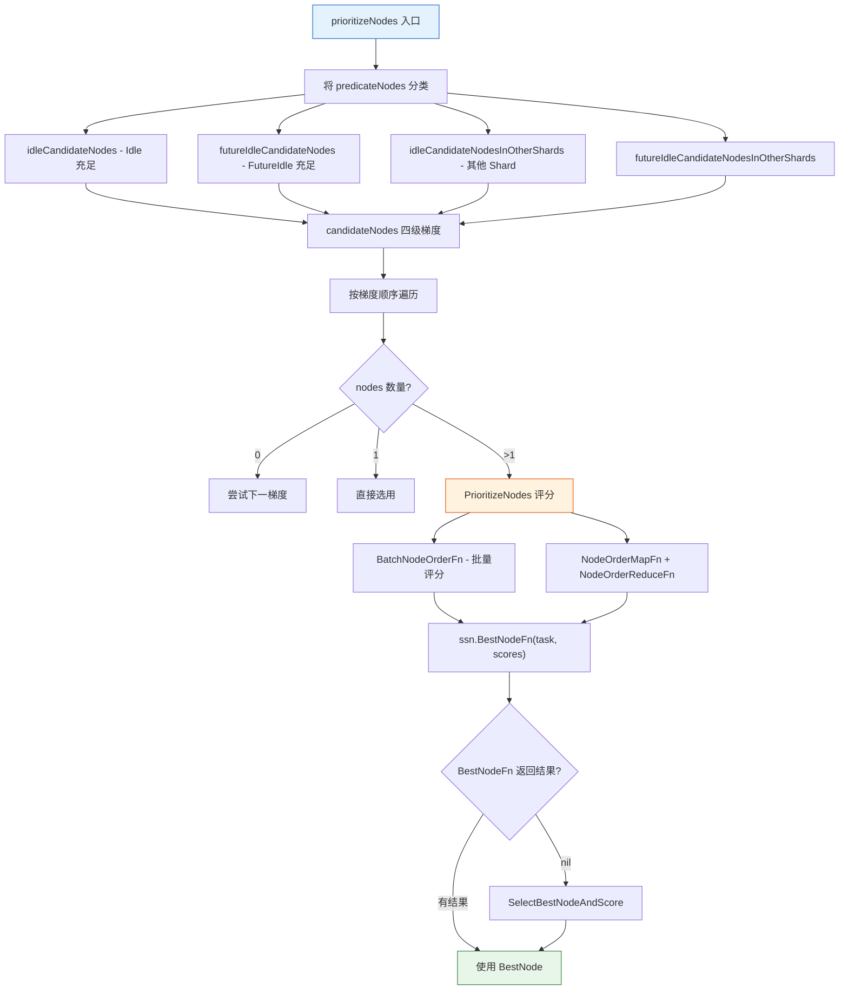

**四级 Node 梯度（含 Sharding 模式）：**

| 优先级 | 梯度 | 说明 |
|--------|------|------|
| 1 | idleCandidateNodes | 当前 Shard 中 Idle 资源充足的 Node |
| 2 | idleCandidateNodesInOtherShards | 其他 Shard 中 Idle 资源充足的 Node |
| 3 | futureIdleCandidateNodes | 当前 Shard 中 FutureIdle 充足的 Node |
| 4 | futureIdleCandidateNodesInOtherShards | 其他 Shard 中 FutureIdle 充足的 Node |

### 5.5 调试要点

```bash
# 查看每个 Task 的分配过程
kubectl logs <scheduler> -v 3 | grep "Binding Task"

# 查看 Predicate 失败
kubectl logs <scheduler> -v 3 | grep "PrePredicate\|Predicates failed"

# 查看 Node 数量
kubectl logs <scheduler> -v 3 | grep "There are .* nodes for Job"

# 查看 Pipeline 情况
kubectl logs <scheduler> -v 3 | grep "Pipelining Task"
```

---

## 6. Statement Commit/Discard

### 6.1 Statement 模式概述

Statement 是 Allocate Action 实现 Gang Scheduling 的核心抽象。它收集一系列分配操作（Allocate/Pipeline/Evict），在所有条件满足后一次性 Commit，否则全部 Discard 回滚。

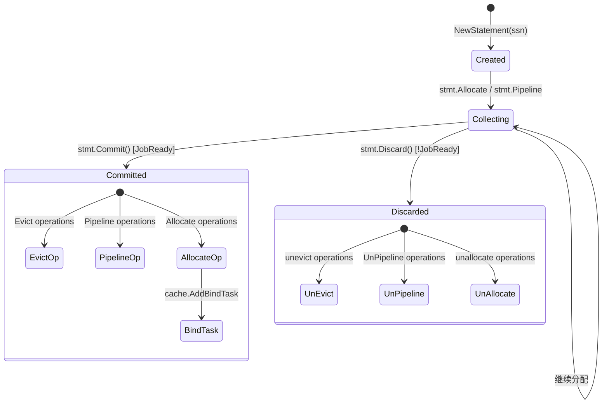

### 6.2 Statement.Allocate

源码位于 `pkg/scheduler/framework/statement.go` 第 262-327 行：

```go
// pkg/scheduler/framework/statement.go:262
func (s *Statement) Allocate(task *api.TaskInfo, nodeInfo *api.NodeInfo) (err error) {
    hostname := nodeInfo.Name
    task.Pod.Spec.NodeName = hostname

    // 1. 更新 Session 中 task 状态为 Allocated
    job, found := s.ssn.Jobs[task.Job]
    if found {
        if err := job.UpdateTaskStatus(task, api.Allocated); err != nil {
            // ...
        }
    }

    // 2. 将 task 添加到 Node
    task.NodeName = hostname
    if node, found := s.ssn.Nodes[hostname]; found {
        if err := node.AddTask(task); err != nil {
            // ...
        }
    }

    // 3. 触发 AllocateFunc 回调
    for _, eh := range s.ssn.eventHandlers {
        if eh.AllocateFunc != nil {
            eh.AllocateFunc(&Event{Task: task})
        }
    }

    // 4. 记录 operation
    s.operations = append(s.operations, operation{
        name: Allocate,
        task: task,
    })
    return nil
}
```

### 6.3 Statement.Commit

源码位于 `pkg/scheduler/framework/statement.go` 第 418-439 行：

```go
// pkg/scheduler/framework/statement.go:418
func (s *Statement) Commit() {
    klog.V(3).Info("Committing operations ...")
    for _, op := range s.operations {
        op.task.ClearLastTxContext()
        switch op.name {
        case Evict:
            err := s.evict(op.task, op.reason)
        case Pipeline:
            s.pipeline(op.task)
        case Allocate:
            err := s.allocate(op.task)
            if err != nil {
                // 失败则回滚
                s.unallocate(op.task)
            }
        }
    }
}
```

### 6.4 Statement.Discard

源码位于 `pkg/scheduler/framework/statement.go` 第 392-415 行：

```go
// pkg/scheduler/framework/statement.go:392
func (s *Statement) Discard() {
    klog.V(3).Info("Discarding operations ...")
    // 逆序回滚所有操作
    for i := len(s.operations) - 1; i >= 0; i-- {
        op := s.operations[i]
        op.task.GenerateLastTxContext()
        switch op.name {
        case Evict:
            s.unevict(op.task)
        case Pipeline:
            s.UnPipeline(op.task)
        case Allocate:
            s.unallocate(op.task)
        }
    }
}
```

### 6.5 Commit vs Discard 决策

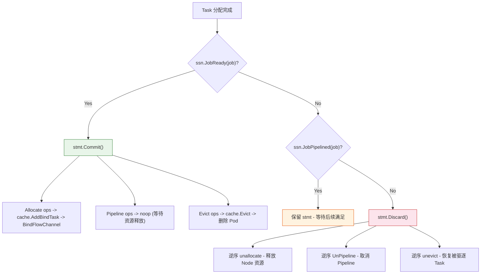

### 6.6 调试要点

```bash
# 查看 Commit 操作
kubectl logs <scheduler> -v 3 | grep "Committing operations"

# 查看 Discard 操作
kubectl logs <scheduler> -v 3 | grep "Discarding operations"

# 查看 Allocate 后的 Node 资源变化
kubectl logs <scheduler> -v 3 | grep "After allocated Task"
```

---

## 7. 调试技巧

### 7.1 追踪 Task 未被分配的原因

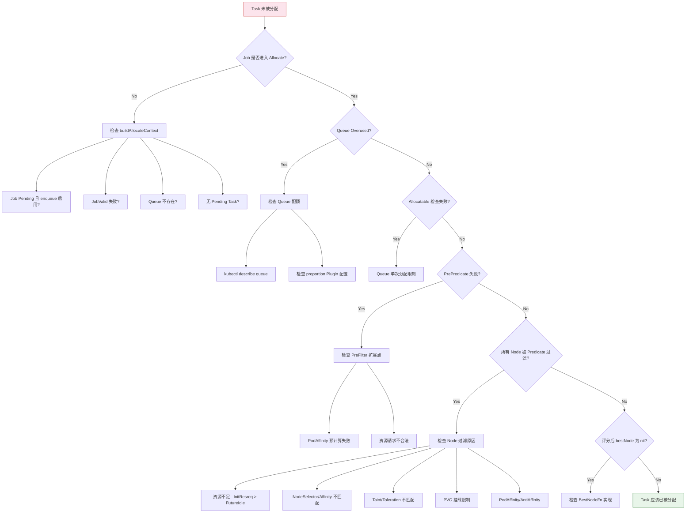

### 7.2 Predicate 失败排查

当所有 Node 都被 Predicate 过滤时，可以通过以下方式排查：

```bash
# 1. 查看 FitErrors 日志（V5 级别）
kubectl logs <scheduler> -v 5 | grep "FitError\|Insufficient\|predicate"

# 2. 查看特定 Task 的 Predicate 结果
kubectl logs <scheduler> -v 5 | grep "<task-name>"

# 3. 查看 Node 资源状态
kubectl logs <scheduler> -v 5 | grep "node.*idle.*used.*releasing"

# 4. 检查资源对比
kubectl logs <scheduler> -v 5 | grep "Insufficient"
```

### 7.3 Node 评分异常排查

```bash
# 查看 Node 评分详情（需要 V5 级别）
kubectl logs <scheduler> -v 5 | grep "Score\|score\|priority"

# 查看 BatchNodeOrder 结果
kubectl logs <scheduler> -v 5 | grep "BatchNodeOrder"

# 查看 BestNode 选择
kubectl logs <scheduler> -v 5 | grep "BestNode\|SelectBest"
```

### 7.4 Statement 事务追踪

```bash
# 查看 Statement 操作记录
kubectl logs <scheduler> -v 3 | grep -E "Committing|Discarding|Allocating operations"

# 查看 Task 状态转换
kubectl logs <scheduler> -v 3 | grep "After allocated Task\|After pipelined Task"

# 查看 JobReady 判断
kubectl logs <scheduler> -v 3 | grep "JobReady\|SubJob ready"
```

### 7.5 Delve 调试断点推荐

```bash
# Allocate Action 核心断点
break pkg/scheduler/actions/allocate/allocate.go:119   # Execute 入口
break pkg/scheduler/actions/allocate/allocate.go:139   # buildAllocateContext
break pkg/scheduler/actions/allocate/allocate.go:277   # allocateResources
break pkg/scheduler/actions/allocate/allocate.go:551   # allocateResourcesForTasks
break pkg/scheduler/actions/allocate/allocate.go:708   # prioritizeNodes
break pkg/scheduler/actions/allocate/allocate.go:779   # allocateResourcesForTask
break pkg/scheduler/actions/allocate/allocate.go:815   # predicate

# Statement 断点
break pkg/scheduler/framework/statement.go:262    # Allocate
break pkg/scheduler/framework/statement.go:392    # Discard
break pkg/scheduler/framework/statement.go:418    # Commit
break pkg/scheduler/framework/statement.go:334    # allocate (真正绑定)

# Session 断点
break pkg/scheduler/framework/session.go:698      # PredicateForAllocateAction
break pkg/scheduler/framework/session.go:672      # FilterOutUnschedulable

# 条件断点 - 仅在特定 Job 时停住
condition 1 job.Name == "my-job"
# 条件断点 - 仅在 Queue Overused 时停住
condition 2 ssn.Overused(queue) == true
```

---

## 8. 常见问题

### 8.1 所有 Node 都被过滤

**症状：** Task 的 `predicateNodes` 为空，日志中出现 `FitErrors`。

**排查步骤：**

| 步骤 | 操作 | 说明 |
|------|------|------|
| 1 | 检查 Task 资源请求 | `kubectl get pod <pod> -o yaml` 查看 resources |
| 2 | 检查 Node 可用资源 | `kubectl describe node <node>` 或 Cache Dump |
| 3 | 检查 FitErrors | V(5) 日志中的 Insufficient 信息 |
| 4 | 检查 NodeSelector | Pod 的 nodeSelector 是否匹配 |
| 5 | 检查 Taint/Toleration | Node 的 Taint 是否被 Pod Tolerate |
| 6 | 检查 PodAffinity | 反亲和性是否阻止了调度 |

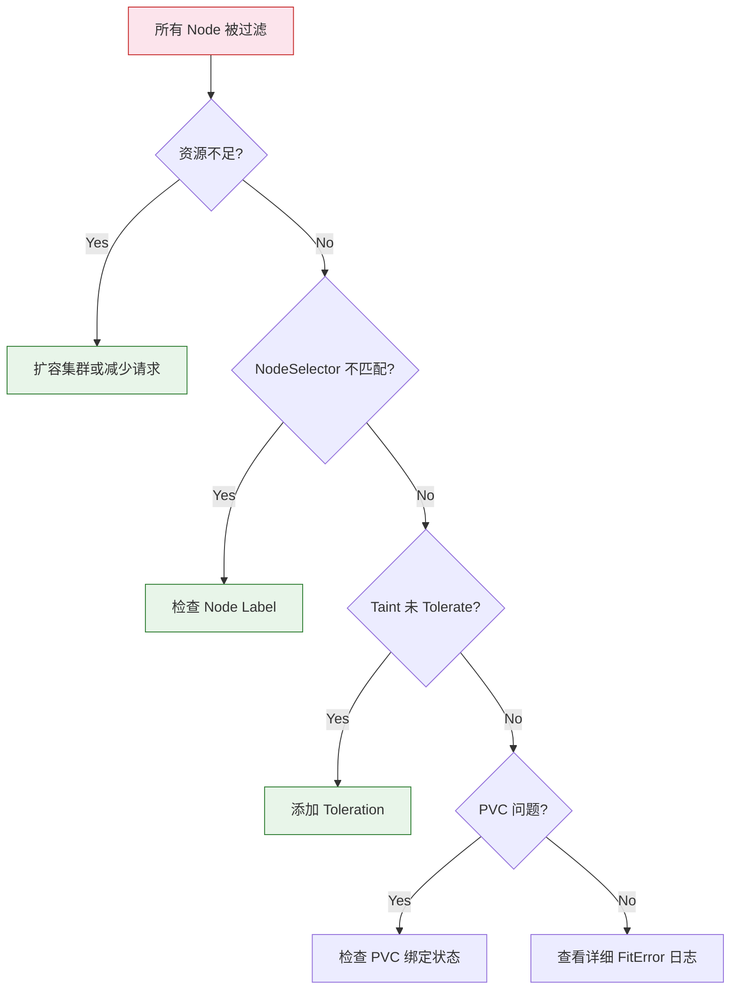

### 8.2 队列 Overused 导致无法分配

**症状：** 日志中出现 `Queue <name> is overused, ignore it`。

**排查步骤：**

```bash
# 1. 查看 Queue 状态
kubectl get queue <name> -o yaml

# 2. 查看 Queue 的 deserved/allocated 资源
# 在 proportion Plugin 的日志中
kubectl logs <scheduler> -v 4 | grep "proportion\|deserved\|allocated"

# 3. 检查是否有其他 Queue 抢占了资源
kubectl get queue -o wide
```

**可能原因：**

- Queue weight 设置过低，导致 deserved 资源不足
- 其他 Queue 的 Job 占用了大量资源
- Queue 配置了 capability 上限

### 8.3 Gang 约束导致 Discard

**症状：** 日志中出现 `Discarding operations`，Job 始终无法进入 Running 状态。

**排查步骤：**

```bash
# 1. 查看 MinAvailable 设置
kubectl get podgroup <pg-name> -o yaml | grep minMember

# 2. 查看实际分配了多少 Task
kubectl logs <scheduler> -v 3 | grep "SubJob ready\|JobReady"

# 3. 查看被 Discard 的原因
kubectl logs <scheduler> -v 3 | grep "Discarding"
```

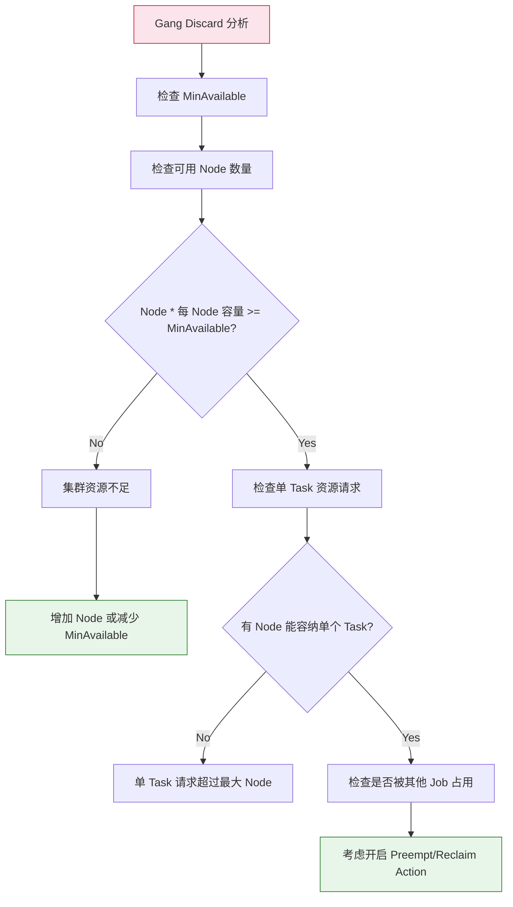

### 8.4 HyperNode 拓扑分配失败

**症状：** 含有 NetworkTopology 的 Job 无法调度。

```bash
# 1. 检查 HyperNode 是否 Ready
kubectl logs <scheduler> -v 3 | grep "HyperNodesReadyToSchedule"

# 2. 检查 HyperNode 层级
kubectl logs <scheduler> -v 5 | grep "hyperNode in session"

# 3. 检查拓扑分配结果
kubectl logs <scheduler> -v 3 | grep "Allocate.*hyperNode"

# 4. 查看 HyperNode CRD
kubectl get hypernode -o wide
```

### 8.5 Predicate Error Cache 问题

Allocate Action 默认启用 Predicate Error Cache（`enablePredicateErrorCache`），它会缓存 Task 的 Predicate 失败信息，避免重复计算。但在某些场景下可能导致误判。

```bash
# 检查 Error Cache 是否跳过了 Task
kubectl logs <scheduler> -v 5 | grep "TaskHasFitErrors\|has already predicated failed"

# 禁用 Error Cache 进行对比测试
# 在 scheduler 配置中设置:
# actions: "enqueue, allocate, ..."
# configurations:
# - name: allocate
#   arguments:
#     enablePredicateErrorCache: false
```

---

## 9. 附录 - Allocate 数据结构关系

### 9.1 核心数据结构

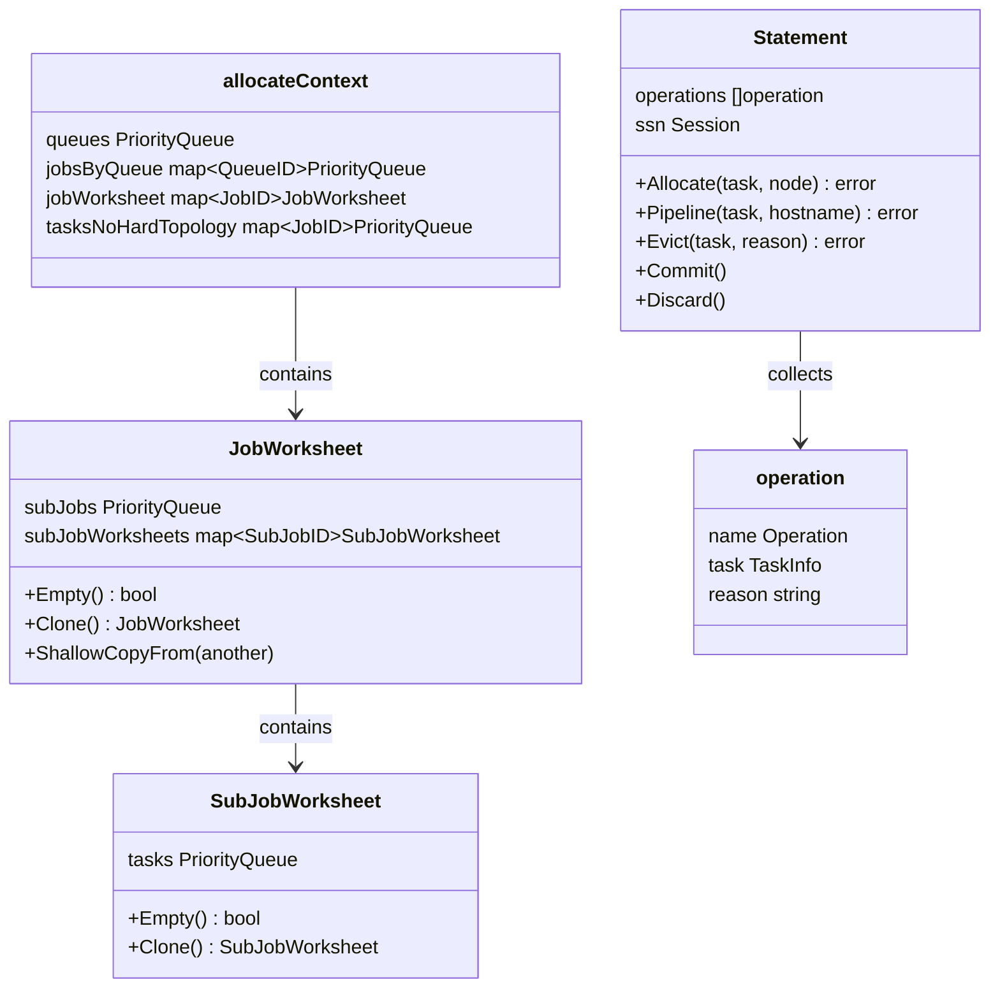

### 9.2 Plugin Hook 调用链

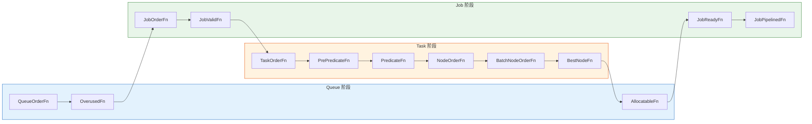

| Hook | 提供 Plugin | 调用时机 |
|------|-----------|---------|
| QueueOrderFn | proportion | Queue 优先级排序 |
| OverusedFn | proportion | Queue 是否超用 |
| JobOrderFn | gang, drf, priority | Job 优先级排序 |
| JobValidFn | gang | Job 有效性校验 |
| TaskOrderFn | priority | Task 优先级排序 |
| PrePredicateFn | predicates | Node 过滤前预检查 |
| PredicateFn | predicates, nodeorder, numaaware | Node 过滤 |
| NodeOrderFn | binpack, nodeorder | Node 评分 |
| BatchNodeOrderFn | nodeorder | 批量 Node 评分 |
| BestNodeFn | (默认实现) | 最优 Node 选择 |
| AllocatableFn | proportion | 分配后 Queue 检查 |
| JobReadyFn | gang | Gang 约束检查 |
| JobPipelinedFn | gang | Pipeline 约束检查 |

---

## 10. 总结

Allocate Action 是 Volcano Scheduler 的核心资源分配引擎，其执行流程可以概括为：

1. **buildAllocateContext** - 遍历所有 Job，过滤无效/Pending Job，按 Queue 分组排序
2. **Queue 轮转** - 按 QueueOrderFn 排序，检查 Overused 状态
3. **Job 迭代** - 按 JobOrderFn 排序，组织 Task Worksheet
4. **Task 分配** - PrePredicate -> Predicate Node 过滤 -> NodeOrder 评分 -> BestNode 选择
5. **Statement 管理** - 收集操作，JobReady 时 Commit（触发 Bind），否则 Discard（回滚）

调试 Allocate 问题的核心方法：

- 使用 V(3) 日志追踪分配流程
- 使用 V(5) 日志查看详细的 Predicate 失败原因
- 通过 Prometheus Metrics 监控 Action 耗时
- 使用 Delve 在关键函数设置断点进行单步追踪
