## 1. 概述

Volcano 调度器中的资源抢占机制包含两个核心 Action - **Preempt** 和 **Reclaim**，它们虽然都涉及驱逐已运行的 Pod 来释放资源，但触发场景和适用范围有本质区别。

### 1.1 Preempt vs Reclaim 对比

| 维度 | Preempt | Reclaim |
|------|---------|---------|
| **作用范围** | 队列内部 (intra-queue) | 跨队列 (inter-queue) |
| **触发条件** | 高优先级 Job 抢占低优先级 Job | 资源不足的队列从超用队列回收资源 |
| **目标** | 同一队列内的低优先级 Task | 其他队列中超出 deserved 配额的 Task |
| **源码位置** | `pkg/scheduler/actions/preempt/preempt.go` | `pkg/scheduler/actions/reclaim/reclaim.go` |
| **Plugin 钩子** | `PreemptableFn` | `ReclaimableFn` |
| **配额检查** | `Allocatable` (队列内配额) | `Overused` + `Preemptive` |

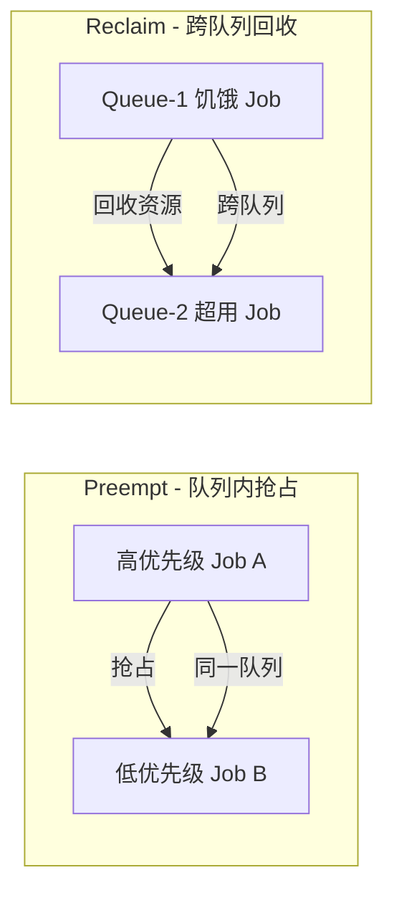

### 1.2 关键数据结构

在调试抢占流程前，需要理解以下核心概念：

- **Preemptor** - 发起抢占的 Task（Pending 状态，需要资源）
- **Preemptee / Victim** - 被抢占的 Task（Running 状态，将被驱逐）
- **Statement** - 事务对象，记录一系列操作（Evict、Pipeline），支持 Commit 和 Discard
- **Starving** - Job 处于饥饿状态，即 `WaitingTaskNum + ReadyTaskNum < MinAvailable`

---

## 2. Preempt Action 完整流程

### 2.1 Execute 方法入口

> 源码: `pkg/scheduler/actions/preempt/preempt.go` 第 103-280 行

Preempt Action 的 `Execute()` 方法是整个抢占流程的入口。它分为两个阶段：

1. **Phase 1** - 队列间 Job 抢占（同一队列内，高优先级 Job 抢占低优先级 Job）
2. **Phase 2** - Job 内部 Task 抢占（同一 Job 内，高优先级 Task 抢占低优先级 Task）

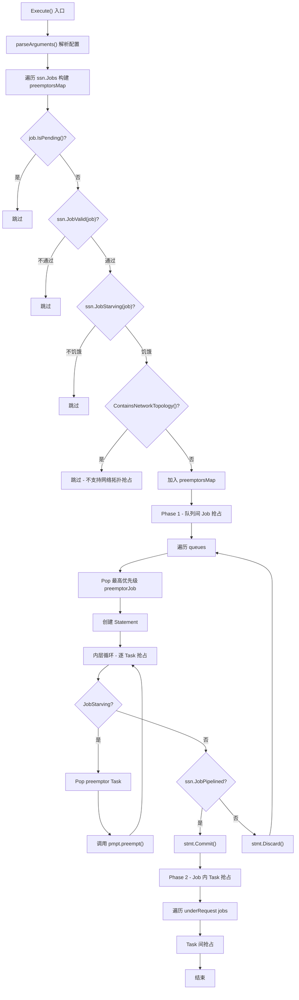

### 2.2 关键代码片段

**Phase 1 核心逻辑 - 队列间 Job 抢占：**

```go
// pkg/scheduler/actions/preempt/preempt.go 第 161-227 行
for _, queue := range queues {
    for {
        preemptors := preemptorsMap[queue.UID]
        if preemptors == nil || preemptors.Empty() {
            break
        }
        preemptorJob := preemptors.Pop().(*api.JobInfo)
        stmt := framework.NewStatement(ssn)

        for {
            if !ssn.JobStarving(preemptorJob) {
                break  // Job 不再饥饿，停止抢占
            }
            preemptor := preemptorTasks[preemptorJob.UID].Pop().(*api.TaskInfo)
            assigned, err = pmpt.preempt(ssn, stmt, preemptor, filter, ph)
        }

        // 关键决策点：Commit 还是 Discard
        if ssn.JobPipelined(preemptorJob) {
            stmt.Commit()    // Job 已获得足够资源，提交操作
        } else {
            stmt.Discard()   // Job 未获得足够资源，回滚所有操作
            continue
        }
    }
}
```

**Phase 1 的过滤函数 - 只抢占同队列内的其他 Job 的 Task：**

```go
// pkg/scheduler/actions/preempt/preempt.go 第 191-209 行
filter := func(task *api.TaskInfo) bool {
    if !api.PreemptableStatus(task.Status) { return false }      // 只抢占运行中的 Task
    if preemptor.BestEffort && !task.BestEffort { return false }  // BestEffort 不能抢占非 BestEffort
    if !task.Preemptable { return false }                         // 跳过不可抢占的 Pod
    job, found := ssn.Jobs[task.Job]
    if !found { return false }
    return job.Queue == preemptorJob.Queue && preemptor.Job != task.Job  // 同队列、不同 Job
}
```

**Phase 2 的过滤函数 - 只抢占同 Job 内的 Task：**

```go
// pkg/scheduler/actions/preempt/preempt.go 第 251-267 行
filter := func(task *api.TaskInfo) bool {
    if !api.PreemptableStatus(task.Status) { return false }
    if preemptor.BestEffort && !task.BestEffort { return false }
    if !task.Preemptable { return false }
    return preemptor.Job == task.Job  // 同 Job
}
```

### 2.3 调试断点建议

| 断点位置 | 文件与行号 | 调试目的 |
|----------|-----------|---------|
| Job 饥饿检测 | `preempt.go:134` | 确认 Job 是否被识别为饥饿 |
| preempt 方法入口 | `preempt.go:284` | 追踪单个 Task 的抢占过程 |
| Commit/Discard 决策 | `preempt.go:216-221` | 确认 Pipeline 判断结果 |
| normalPreempt 节点选择 | `preempt.go:340` | 追踪节点遍历和 Victim 选择 |

---

## 3. 抢占触发条件检测

### 3.1 JobStarvingFns - 判断 Job 是否饥饿

> 源码: `pkg/scheduler/plugins/gang/gang.go` 第 207-212 行

Gang Plugin 注册了 `jobStarvingFn`，用于判断 Job 是否处于饥饿状态。饥饿的定义是：当前已就绪和等待中的 Task 数量不足以满足 MinAvailable 要求。

```go
// pkg/scheduler/plugins/gang/gang.go 第 207-212 行
jobStarvingFn := func(obj interface{}) bool {
    ji := obj.(*api.JobInfo)
    return ji.IsStarving()
}

// pkg/scheduler/api/job_info.go 第 1180-1182 行
func (ji *JobInfo) IsStarving() bool {
    return ji.WaitingTaskNum()+ji.ReadyTaskNum() < ji.MinAvailable
}
```

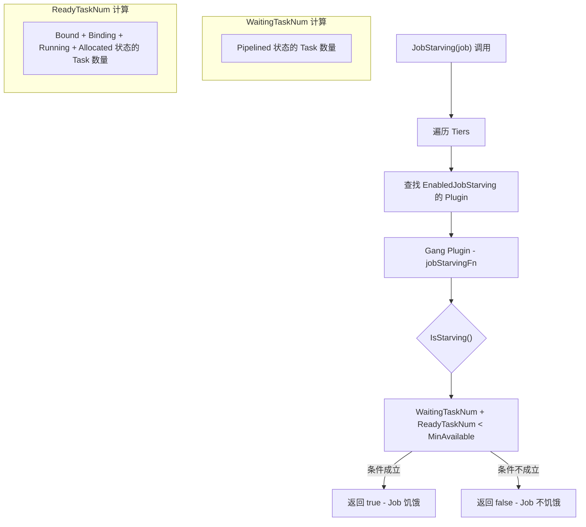

### 3.2 Session.JobStarving 的 Tier 遍历机制

> 源码: `pkg/scheduler/framework/session_plugins.go` 第 483-507 行

```go
func (ssn *Session) JobStarving(obj interface{}) bool {
    var hasFound bool
    for _, tier := range ssn.Tiers {
        for _, plugin := range tier.Plugins {
            if !isEnabled(plugin.EnabledJobStarving) { continue }
            jrf, found := ssn.jobStarvingFns[plugin.Name]
            if !found { continue }
            hasFound = true
            if !jrf(obj) {
                return false  // 任何一个 plugin 说不饥饿，就不饥饿
            }
        }
        if hasFound {
            return true  // 当前 tier 有 plugin 且全部说饥饿，返回 true
        }
    }
    return false  // 没有任何 plugin 注册，默认不饥饿
}
```

### 3.3 PreemptiveFn - 判断 Queue 是否有权回收资源

> 源码: `pkg/scheduler/plugins/proportion/proportion.go` 第 357-361 行

在 Reclaim Action 中，还需要通过 `Preemptive` 检查确认当前队列是否有权执行回收操作。Proportion Plugin 的实现实际上检查的是队列资源分配是否未超过 deserved 配额。

```go
// proportion.go 第 357-361 行
ssn.AddPreemptiveFn(pp.Name(), func(obj interface{}, candidate interface{}) bool {
    queue := obj.(*api.QueueInfo)
    task := candidate.(*api.TaskInfo)
    return queueAllocatable(queue, task)  // 检查 allocated + task.Resreq <= deserved
})
```

### 3.4 调试技巧 - 追踪饥饿判断

设置日志级别 `-v=4` 可以观察到以下关键日志：

```bash
# 确认 Job 是否被判断为饥饿
klog.V(4).Infof("Job <%s/%s> Queue <%s> skip preemption, reason: ...")  # 被跳过的 Job
klog.V(3).Infof("No preemptors in Queue <%s>, break.", queue.Name)       # 没有饥饿 Job 的队列
```

**断点调试方法：**

```
// 在 Delve 中设置断点
dlv debug volcano.sh/volcano/cmd/scheduler
(dlv) break pkg/scheduler/api/job_info.go:1180   // IsStarving
(dlv) break pkg/scheduler/actions/preempt/preempt.go:134  // JobStarving 检查点
(dlv) condition 2 job.Name == "target-job"   // 条件断点
```

---

## 4. Victim 选择流程

### 4.1 整体 Victim 选择架构

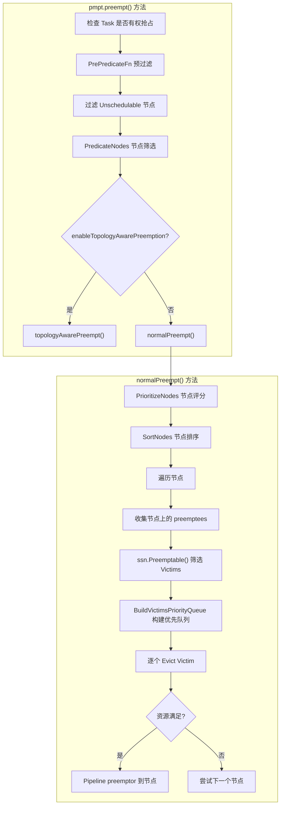

### 4.2 PreemptableFn 调用 - Tiered Intersection 模式

> 源码: `pkg/scheduler/framework/session_plugins.go` 第 261-308 行

`Session.Preemptable()` 方法使用了 **Tiered Intersection** 模式来聚合多个 Plugin 的 Victim 选择结果：

```go
func (ssn *Session) Preemptable(preemptor *api.TaskInfo, preemptees []*api.TaskInfo) []*api.TaskInfo {
    var victims []*api.TaskInfo
    for _, tier := range ssn.Tiers {
        for _, plugin := range tier.Plugins {
            candidates, abstain := pf(preemptor, preemptees)
            if abstain == 0 { continue }          // Plugin 弃权
            if len(candidates) == 0 {
                victims = nil; break              // Plugin 明确拒绝所有候选
            }
            if victims == nil {
                victims = candidates              // 第一个投票的 plugin，初始化 victims
            } else {
                // 取交集
                intersection := intersect(victims, candidates)
                victims = intersection
            }
        }
        if victims != nil { return victims }      // 当前 tier 有结果，立即返回
    }
    return victims
}
```

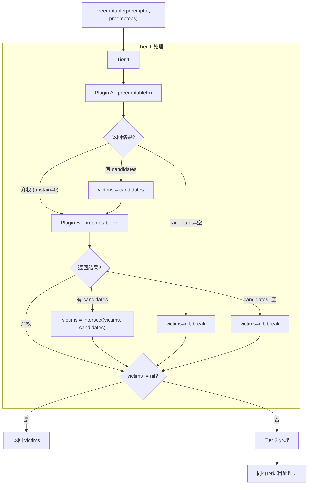

### 4.3 各 Plugin 的 PreemptableFn 实现

#### Gang Plugin

> 源码: `pkg/scheduler/plugins/gang/gang.go` 第 97-119 行

Gang Plugin 保护满足 MinAvailable 的 Job 不被抢占：

```go
preemptableFn := func(preemptor *api.TaskInfo, preemptees []*api.TaskInfo) ([]*api.TaskInfo, int) {
    var victims []*api.TaskInfo
    jobOccupiedMap := map[api.JobID]int32{}

    for _, preemptee := range preemptees {
        job := ssn.Jobs[preemptee.Job]
        if _, found := jobOccupiedMap[job.UID]; !found {
            jobOccupiedMap[job.UID] = job.ReadyTaskNum()
        }
        if jobOccupiedMap[job.UID] > job.MinAvailable {
            jobOccupiedMap[job.UID]--
            victims = append(victims, preemptee)    // 可以被抢占
        }
        // 否则跳过 - 不能破坏 Gang 约束
    }
    return victims, util.Permit
}
```

#### DRF Plugin

> 源码: `pkg/scheduler/plugins/drf/drf.go` 第 222-253 行

DRF Plugin 基于 Dominant Resource Fairness 份额比较：

```go
preemptableFn := func(preemptor *api.TaskInfo, preemptees []*api.TaskInfo) ([]*api.TaskInfo, int) {
    latt := drf.jobAttrs[preemptor.Job]
    lalloc := latt.allocated.Clone().Add(preemptor.Resreq)
    _, ls := drf.calculateShare(lalloc, drf.totalResource)  // preemptor 的 DRF 份额

    for _, preemptee := range preemptees {
        ralloc := allocations[preemptee.Job].Sub(preemptee.Resreq)
        _, rs := drf.calculateShare(ralloc, drf.totalResource)  // preemptee 移除后的 DRF 份额

        if ls < rs || math.Abs(ls-rs) <= shareDelta {
            victims = append(victims, preemptee)  // preemptor 份额 <= preemptee，允许抢占
        }
    }
    return victims, util.Permit
}
```

### 4.4 BuildVictimsPriorityQueue - Victim 排序

> 源码: `pkg/scheduler/framework/session_plugins.go` 第 1093-1138 行

Victim 排序优先队列确保先驱逐低优先级的 Task：

```go
victimsQueue := util.NewPriorityQueue(func(l, r interface{}) bool {
    lv := l.(*api.TaskInfo)
    rv := r.(*api.TaskInfo)
    if lv.Job == rv.Job {
        return !ssn.TaskOrderFn(l, r)        // 同 Job：反向 TaskOrder（低优先级在前）
    }
    // 不同 Job：反向 JobOrder
    if lvJob.Queue != rvJob.Queue {
        return ssn.VictimQueueOrderFn(...)    // 不同队列：使用 VictimQueueOrder
    }
    return !ssn.JobOrderFn(lvJob, rvJob)      // 同队列：反向 JobOrder
})
```

---

## 5. 模拟执行与验证（拓扑感知抢占）

### 5.1 拓扑感知抢占流程

> 源码: `pkg/scheduler/actions/preempt/preempt.go` 第 458-497 行

当启用 `enableTopologyAwarePreemption` 时，抢占使用更精细的模拟执行流程：

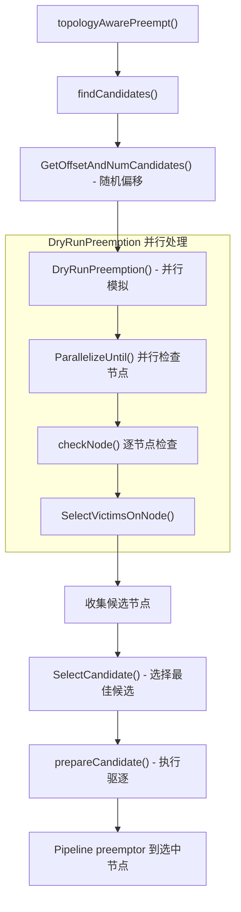

### 5.2 SelectVictimsOnNode 详细流程

> 源码: `pkg/scheduler/actions/preempt/preempt.go` 第 691-825 行

这是拓扑感知抢占的核心方法，使用模拟函数进行验证：

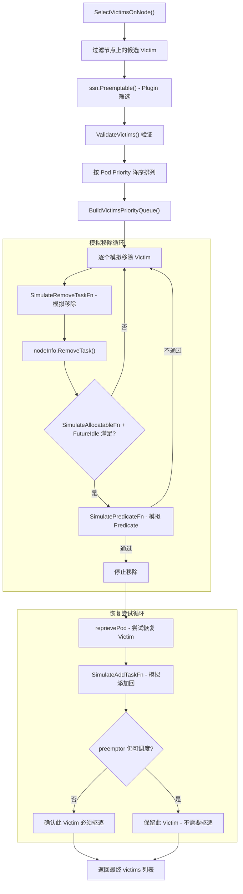

### 5.3 四个模拟函数说明

| 函数 | 用途 | 注册 Plugin |
|------|------|------------|
| `SimulateRemoveTaskFn` | 模拟从节点移除一个 Victim，更新模拟状态 | proportion, predicates |
| `SimulatePredicateFn` | 在模拟状态上运行 Predicate 检查 | predicates |
| `SimulateAllocatableFn` | 在模拟状态上检查队列配额是否可分配 | proportion |
| `SimulateAddTaskFn` | 模拟将 Victim 添加回节点（reprieve 阶段） | proportion, predicates |

```go
// 模拟移除 - proportion plugin 的实现
// pkg/scheduler/plugins/proportion/proportion.go 第 433-447 行
ssn.AddSimulateRemoveTaskFn(pp.Name(), func(ctx context.Context, cycleState fwk.CycleState,
    taskToSchedule *api.TaskInfo, taskToRemove *api.TaskInfo, nodeInfo *api.NodeInfo) error {
    state, _ := getProportionState(cycleState)
    job := ssn.Jobs[taskToRemove.Job]
    attr := state.queueAttrs[job.Queue]
    attr.allocated.Sub(taskToRemove.Resreq)   // 模拟减少队列已分配资源
    updateQueueAttrShare(attr)
    return nil
})
```

### 5.4 SelectCandidate - 最佳候选选择

> 源码: `pkg/scheduler/actions/preempt/preempt.go` 第 829-854 行

当存在多个候选节点时，按以下优先级选择：

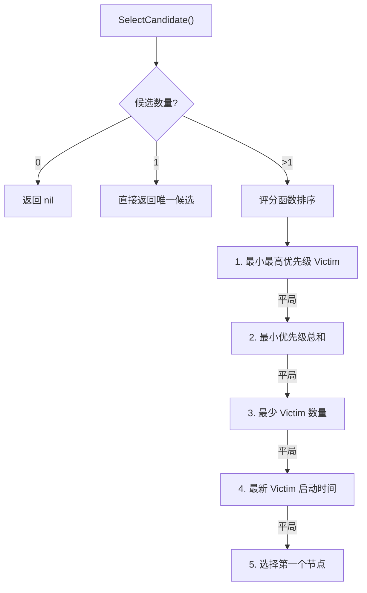

---

## 6. Reclaim Action 流程

### 6.1 Reclaim 整体流程

> 源码: `pkg/scheduler/actions/reclaim/reclaim.go` 第 56-173 行

Reclaim Action 的目标是从超用队列回收资源给不足队列。

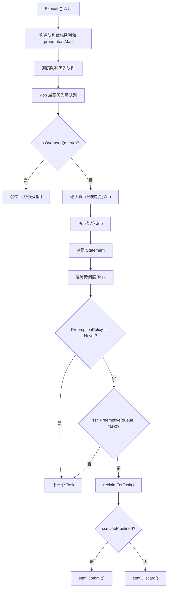

### 6.2 reclaimForTask 详细流程

> 源码: `pkg/scheduler/actions/reclaim/reclaim.go` 第 175-254 行

```go
func (ra *Action) reclaimForTask(ssn *framework.Session, stmt *framework.Statement,
    task *api.TaskInfo, job *api.JobInfo) {
    // 1. 筛选候选节点
    totalNodes := ssn.FilterOutUnschedulableAndUnresolvableNodesForTask(task)
    predicateNodes, _ := predicateHelper.PredicateNodes(task, totalNodes,
        ssn.PredicateForPreemptAction, ...)   // 注意：使用 PreemptAction 的 Predicate（更宽松）

    for _, n := range predicateNodes {
        // 2. 收集该节点上其他队列的 Running Task 作为候选 reclaimee
        var reclaimees []*api.TaskInfo
        for _, taskOnNode := range n.Tasks {
            if taskOnNode.Status != api.Running { continue }
            j := ssn.Jobs[taskOnNode.Job]
            if j.Queue != job.Queue {              // 必须是不同队列
                q := ssn.Queues[j.Queue]
                if q.Reclaimable() {               // 队列允许被回收
                    reclaimees = append(reclaimees, taskOnNode.Clone())
                }
            }
        }

        // 3. 调用 Plugin 筛选 Victims
        victims := ssn.Reclaimable(task, reclaimees)

        // 4. 逐个驱逐 Victim 直到资源满足
        for !victimsQueue.Empty() {
            reclaimee := victimsQueue.Pop().(*api.TaskInfo)
            stmt.Evict(reclaimee, "reclaim")
            availableResources.Add(reclaimee.Resreq)
            if resreq.LessEqual(availableResources, api.Zero) {
                break   // 资源已足够
            }
        }

        // 5. Pipeline Task 到节点
        if task.InitResreq.LessEqual(availableResources, api.Zero) {
            stmt.Pipeline(task, n.Name, evictionOccurred)
            break
        }
    }
}
```

### 6.3 Overused 判断

> 源码: `pkg/scheduler/plugins/proportion/proportion.go` 第 300-312 行

Proportion Plugin 的 `overusedFn` 通过比较 allocated 和 deserved 来判断队列是否超用：

```go
ssn.AddOverusedFn(pp.Name(), func(obj interface{}) bool {
    queue := obj.(*api.QueueInfo)
    attr := pp.queueOpts[queue.UID]
    overused := attr.deserved.LessEqual(attr.allocated, api.Zero)
    // overused = true 当 deserved <= allocated（队列已超用）
    return overused
})
```

### 6.4 ReclaimableFn - Proportion Plugin

> 源码: `pkg/scheduler/plugins/proportion/proportion.go` 第 278-298 行

```go
ssn.AddReclaimableFn(pp.Name(), func(reclaimer *api.TaskInfo, reclaimees []*api.TaskInfo) ([]*api.TaskInfo, int) {
    var victims []*api.TaskInfo
    allocations := map[api.QueueID]*api.Resource{}

    for _, reclaimee := range reclaimees {
        job := ssn.Jobs[reclaimee.Job]
        attr := pp.queueOpts[job.Queue]
        allocated := allocations[job.Queue]

        // 只有当队列 allocated > deserved 时才回收
        if !allocated.LessEqual(attr.deserved, api.Zero) {
            allocated.Sub(reclaimee.Resreq)
            victims = append(victims, reclaimee)
        }
    }
    return victims, util.Permit
})
```

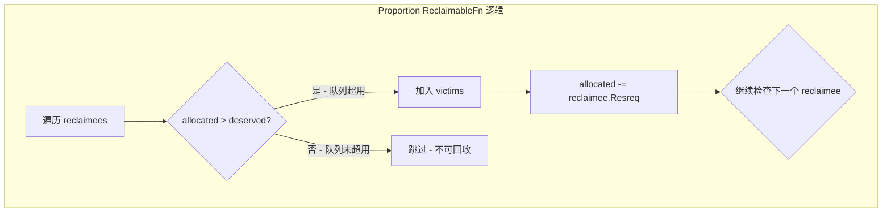

---

## 7. 拓扑感知抢占

### 7.1 HyperNode 层级抢占

当启用 `enableTopologyAwarePreemption=true` 时，Preempt Action 使用拓扑感知的抢占策略。

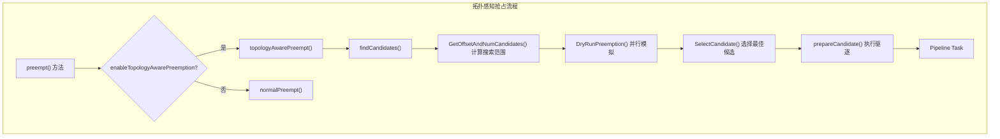

### 7.2 候选节点数量控制

> 源码: `pkg/scheduler/actions/preempt/preempt.go` 第 564-590 行

```go
func (pmpt *Action) calculateNumCandidates(numNodes int) int {
    n := (numNodes * pmpt.minCandidateNodesPercentage) / 100  // 默认 10%
    if n < pmpt.minCandidateNodesAbsolute { n = pmpt.minCandidateNodesAbsolute }  // 最小 1
    if n > pmpt.maxCandidateNodesAbsolute { n = pmpt.maxCandidateNodesAbsolute }  // 最大 100
    if n > numNodes { n = numNodes }
    return n
}
```

配置参数：

| 参数 | 默认值 | 说明 |
|------|--------|------|
| `minCandidateNodesPercentage` | 10 | 候选节点百分比 |
| `minCandidateNodesAbsolute` | 1 | 最小候选节点数 |
| `maxCandidateNodesAbsolute` | 100 | 最大候选节点数 |
| `topologyAwarePreemptWorkerNum` | 16 | 并行 worker 数量 |

### 7.3 DryRunPreemption 并行执行

> 源码: `pkg/scheduler/actions/preempt/preempt.go` 第 592-638 行

```go
func (pmpt *Action) DryRunPreemption(...) ([]*candidate, map[string]api.Status, error) {
    candidates := newCandidateList(numCandidates)
    ctx, cancel := context.WithCancel(context.Background())

    checkNode := func(i int) {
        nodeInfoCopy := potentialNodes[(offset+i)%len(potentialNodes)].Clone()
        stateCopy := state.Clone()

        victims, status := SelectVictimsOnNode(ctx, stateCopy, preemptor, ...)
        if status.IsSuccess() && len(victims) != 0 {
            candidates.add(&candidate{victims: victims, name: nodeInfoCopy.Name})
            if candidates.size() >= numCandidates {
                cancel()  // 找到足够候选，取消剩余检查
            }
        }
    }

    // 并行检查所有潜在节点
    workqueue.ParallelizeUntil(ctx, pmpt.topologyAwarePreemptWorkerNum,
        len(potentialNodes), checkNode)
    return candidates.get(), nodeStatuses, errs
}
```

---

## 8. 调试技巧

### 8.1 判断抢占是否触发

**检查日志级别 `-v=5`：**

```bash
# Preempt Action 入口和退出日志
"Enter Preempt ..."
"Leaving Preempt ..."

# Reclaim Action 入口和退出日志
"Enter Reclaim ..."
"Leaving Reclaim ..."
```

**确认饥饿 Job 检测：**

```bash
# 如果没有饥饿 Job，会看到：
"No preemptors in Queue <queue-name>, break."

# 如果 Job 被 Valid 检查拦截：
"Job <ns/name> Queue <queue> skip preemption, reason: ..."
```

### 8.2 追踪 Victim 选择过程

设置 `-v=3` 查看 Victim 选择细节：

```bash
# 节点遍历
"Considering Task <ns/name> on Node <node-name>."

# 抢占尝试
"Try to preempt Task <victim-ns/victim-name> for Task <preemptor-ns/preemptor-name>"

# 抢占结果
"Preempted <resource> for Task <ns/name> requested <resource>."
```

### 8.3 Delve 调试方法

```bash
# 编译 scheduler（禁用优化以便调试）
go build -gcflags="all=-N -l" -o _output/bin/vc-scheduler ./cmd/scheduler

# 启动 Delve
dlv exec _output/bin/vc-scheduler -- --scheduler-conf=/path/to/config

# 关键断点
break pkg/scheduler/actions/preempt/preempt.go:103     # Execute 入口
break pkg/scheduler/actions/preempt/preempt.go:284     # preempt 方法
break pkg/scheduler/actions/preempt/preempt.go:352     # Preemptable 调用
break pkg/scheduler/actions/preempt/preempt.go:375     # Allocatable 检查
break pkg/scheduler/actions/reclaim/reclaim.go:56      # Reclaim Execute 入口
break pkg/scheduler/actions/reclaim/reclaim.go:209     # Reclaimable 调用
break pkg/scheduler/framework/statement.go:418         # Commit
break pkg/scheduler/framework/statement.go:392         # Discard
```

### 8.4 常见抢占失败原因

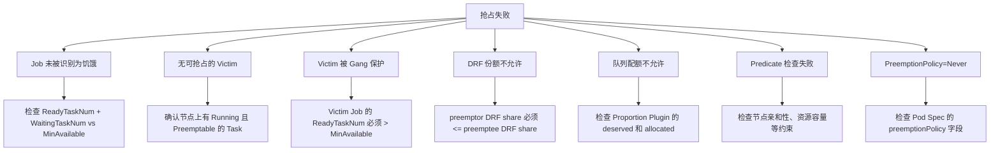

### 8.5 Preempt vs Allocate 的 Predicate 差异

Preempt Action 使用 `PredicateForPreemptAction` 而非 `PredicateFn`，关键区别在于对 `Unschedulable` 节点的处理更宽松：

```go
// preempt.go 第 302 行
predicateNodes, _ := predicateHelper.PredicateNodes(
    preemptor, allNodes,
    ssn.PredicateForPreemptAction,  // 更宽松：允许 Unschedulable 节点
    pmpt.enablePredicateErrorCache, ssn.NodesInShard)
```

在 Allocate Action 中使用的是 `ssn.PredicateFn`，它会拒绝标记为 `Unschedulable` 的节点。而在 Preempt 中，这些节点的 `Unschedulable` 状态可能是因为已有 Pod 占用了资源，驱逐后即可变为可调度状态。

### 8.6 Statement 事务追踪

Statement 的 Commit/Discard 是抢占流程中最关键的决策点。当调试时需要特别关注：

```go
// Commit 时执行的操作（statement.go 第 418-440 行）
func (s *Statement) Commit() {
    for _, op := range s.operations {
        switch op.name {
        case Evict:    s.evict(op.task, op.reason)   // 真正执行 Pod 驱逐
        case Pipeline: s.pipeline(op.task)            // 标记 Task 为 Pipelined
        case Allocate: s.allocate(op.task)            // 绑定 Task 到节点
        }
    }
}

// Discard 时执行的回滚操作（statement.go 第 392-415 行）
func (s *Statement) Discard() {
    for i := len(s.operations) - 1; i >= 0; i-- {   // 逆序回滚
        switch op.name {
        case Evict:    s.unevict(op.task)             // 恢复被驱逐的 Task
        case Pipeline: s.UnPipeline(op.task)           // 取消 Pipeline
        case Allocate: s.unallocate(op.task)           // 取消分配
        }
    }
}
```

---

## 9. 端到端调试案例

### 9.1 案例 - 为什么高优先级 Job 没有抢占成功

**场景描述：** Job-A（priority=100）在 Queue-1 中 Pending，Job-B（priority=1）在 Queue-1 中 Running，但 Job-A 始终无法抢占 Job-B。

**调试步骤：**

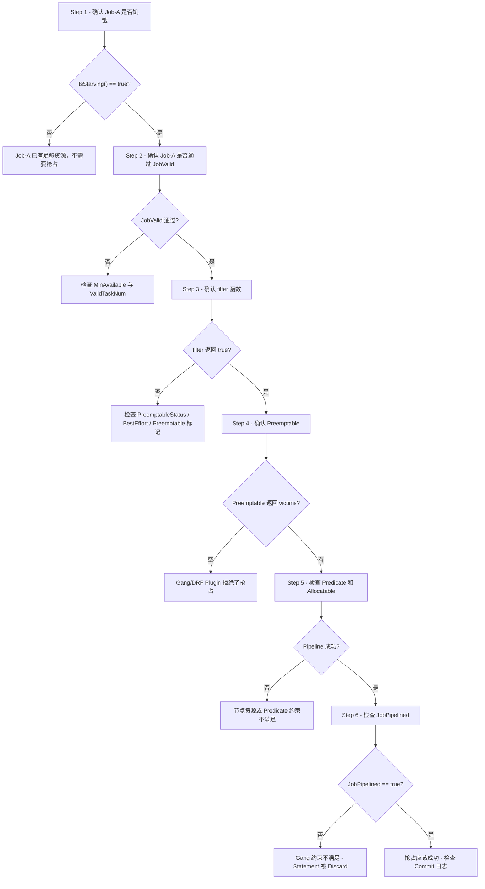

### 9.2 关键日志关键词

| 关键词 | 含义 |
|--------|------|
| `skip preemption, reason:` | Job 被跳过，不参与抢占 |
| `No preemptors in Queue` | 队列中没有饥饿的 Job |
| `No preemptor task in job` | Job 没有 Pending 的 Task |
| `Try to preempt Task` | 正在尝试抢占特定 Task |
| `Failed to preempt Task` | 抢占执行失败 |
| `Preempted <resource> for Task` | 成功驱逐了 Victim |
| `Committing operations` | Statement 正在提交 |
| `Discarding operations` | Statement 正在回滚 |
| `Queue is overused` | 队列已超用（Reclaim 中） |
| `cannot reclaim for task` | Preemptive 检查不通过 |
