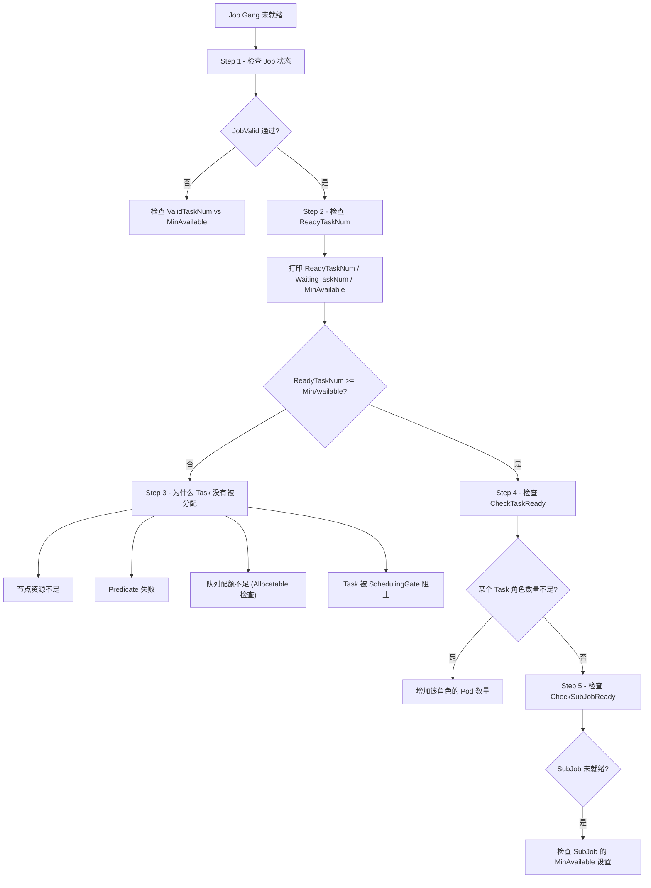

## 1. 概述

Gang 调度（也称 All-or-Nothing 调度）是 Volcano 调度器的核心特性之一。它确保一个 Job 的所有（或至少 MinAvailable 个）Task 要么全部被调度，要么全部不被调度。这种语义对于 MPI、分布式训练等需要所有 Worker 同时就绪才能启动的场景至关重要。

### 1.1 核心思想


### 1.2 关键概念

| 概念 | 说明 | 来源 |
|------|------|------|
| **MinAvailable** | Job 需要的最小 Task 数量 | `PodGroup.Spec.MinMember` |
| **ReadyTaskNum** | 已就绪的 Task 数量（Bound + Binding + Running + Allocated） | `job_info.go:847` |
| **WaitingTaskNum** | 等待中的 Task 数量（Pipelined 状态） | `job_info.go:859` |
| **IsReady** | `ReadyTaskNum + PendingBestEffortTaskNum >= MinAvailable` | `job_info.go:1172` |
| **IsPipelined** | `WaitingTaskNum + ReadyTaskNum + PendingBestEffortTaskNum >= MinAvailable` | `job_info.go:1176` |
| **IsStarving** | `WaitingTaskNum + ReadyTaskNum < MinAvailable` | `job_info.go:1180` |

---

## 2. Gang Plugin 架构

### 2.1 Plugin 注册的钩子函数

> 源码: `pkg/scheduler/plugins/gang/gang.go` 第 57-213 行

Gang Plugin 在 `OnSessionOpen` 中注册了以下钩子函数：


### 2.2 Plugin 注册代码

```go
// pkg/scheduler/plugins/gang/gang.go 第 57 行
func (gp *gangPlugin) OnSessionOpen(ssn *framework.Session) {
    ssn.AddJobValidFn(gp.Name(), validJobFn)           // 第 95 行
    ssn.AddReclaimableFn(gp.Name(), preemptableFn)      // 第 122 行
    ssn.AddPreemptableFn(gp.Name(), preemptableFn)      // 第 123 行
    ssn.AddJobOrderFn(gp.Name(), jobOrderFn)             // 第 149 行
    ssn.AddSubJobOrderFn(gp.Name(), subJobOrderFn)       // 第 175 行
    ssn.AddJobReadyFn(gp.Name(), jobReadyFn)             // 第 177 行
    ssn.AddSubJobReadyFn(gp.Name(), subJobReadyFn)       // 第 185 行
    ssn.AddJobPipelinedFn(gp.Name(), pipelinedFn)        // 第 197 行
    ssn.AddSubJobPipelinedFn(gp.Name(), subJobPipelinedFn)  // 第 199 行
    ssn.AddJobStarvingFns(gp.Name(), jobStarvingFn)      // 第 212 行
}
```

---

## 3. MinAvailable 验证链路

### 3.1 从 PodGroup 到 Job 的 MinAvailable 传递


### 3.2 validJobFn 详细流程

> 源码: `pkg/scheduler/plugins/gang/gang.go` 第 58-93 行

`validJobFn` 是 Gang Plugin 注册的 Job 合法性验证函数，在 Preempt 和 Allocate Action 的入口处被调用。

```go
// gang.go 第 58-93 行
validJobFn := func(obj interface{}) *api.ValidateResult {
    job := obj.(*api.JobInfo)

    // 检查 1: 每个 Task 规格的有效 Pod 数量是否满足 Task 级别的 minAvailable
    if valid := job.CheckTaskValid(); !valid {
        return &api.ValidateResult{
            Pass:    false,
            Reason:  v1beta1.NotEnoughPodsOfTaskReason,
            Message: "Not enough valid pods of each task for gang-scheduling",
        }
    }

    // 检查 2: SubGroup 策略下，每个 SubGroup 的有效 Pod 数量
    if valid := job.CheckSubJobValid(); !valid {
        return &api.ValidateResult{
            Pass:    false,
            Reason:  v1beta1.NotEnoughPodsOfTaskReason,
            Message: "Not enough valid subGroups of each task for gang-scheduling",
        }
    }

    // 检查 3: 整体有效 Task 数量是否满足 Job 级别的 MinAvailable
    vtn := job.ValidTaskNum()
    if vtn < job.MinAvailable {
        return &api.ValidateResult{
            Pass:   false,
            Reason: v1beta1.NotEnoughPodsReason,
            Message: fmt.Sprintf("Not enough valid tasks for gang-scheduling, valid: %d, min: %d",
                vtn, job.MinAvailable),
        }
    }
    return nil
}
```


### 3.3 CheckTaskValid 详解

> 源码: `pkg/scheduler/api/job_info.go` 第 995-1024 行

```go
func (ji *JobInfo) CheckTaskValid() bool {
    // 如果 MinAvailable < TaskMinAvailableTotal，跳过此检查
    if ji.MinAvailable < ji.TaskMinAvailableTotal {
        return true
    }
    // 检查每个 Task 规格
    for taskSpec, minNum := range ji.TaskMinAvailable {
        validNum := int32(0)
        for _, task := range ji.Tasks {
            if task.Role == taskSpec {
                // 有效状态: AllocatedStatus || Succeeded || Pipelined || Pending || Waiting
                if AllocatedStatus(task.Status) || task.Status == Succeeded ||
                    task.Status == Pipelined || task.Status == Pending || task.Status == Waiting {
                    validNum++
                }
            }
        }
        if validNum < minNum {
            return false   // 该 Task 规格的有效 Pod 不足
        }
    }
    return true
}
```

### 3.4 ValidTaskNum 详解

> 源码: `pkg/scheduler/api/job_info.go` 第 1100-1112 行

```go
func (ji *JobInfo) ValidTaskNum() int32 {
    occupied := 0
    for status, tasks := range ji.TaskStatusIndex {
        if AllocatedStatus(status) ||
            status == Succeeded ||
            status == Pipelined ||
            status == Pending ||
            status == Waiting {
            occupied += len(tasks)
        }
    }
    return int32(occupied)
}
```

### 3.5 调试方法 - MinAvailable 验证

```bash
# 设置 Delve 断点
break pkg/scheduler/plugins/gang/gang.go:67   # CheckTaskValid
break pkg/scheduler/plugins/gang/gang.go:75   # CheckSubJobValid
break pkg/scheduler/plugins/gang/gang.go:83   # ValidTaskNum 比较

# 条件断点 - 仅命中特定 Job
condition 1 job.Name == "my-training-job"

# 打印关键信息
print job.MinAvailable
print job.ValidTaskNum()
print job.TaskMinAvailable
print job.TaskMinAvailableTotal
```

---

## 4. Job 就绪判断

### 4.1 jobReadyFn

> 源码: `pkg/scheduler/plugins/gang/gang.go` 第 177-183 行

```go
ssn.AddJobReadyFn(gp.Name(), func(obj interface{}) bool {
    ji := obj.(*api.JobInfo)
    if ji.CheckTaskReady() && ji.CheckSubJobReady() && ji.IsReady() {
        return true
    }
    return false
})
```


### 4.2 CheckTaskReady 详解

> 源码: `pkg/scheduler/api/job_info.go` 第 1027-1039 行

```go
func (ji *JobInfo) CheckTaskReady() bool {
    if ji.MinAvailable < ji.TaskMinAvailableTotal {
        return true  // 当 Job MinAvailable 小于所有 Task MinAvailable 之和时跳过
    }
    occupiedMap := ji.getJobAllocatedRoles()  // 获取每个 Role 的已分配数量
    for taskSpec, minNum := range ji.TaskMinAvailable {
        if occupiedMap[taskSpec] < minNum {
            return false  // 该 Role 的已分配数量不足
        }
    }
    return true
}
```

### 4.3 IsReady 详解

> 源码: `pkg/scheduler/api/job_info.go` 第 1172-1174 行

```go
func (ji *JobInfo) IsReady() bool {
    return ji.ReadyTaskNum()+ji.PendingBestEffortTaskNum() >= ji.MinAvailable
}
```

**ReadyTaskNum 统计的状态：**


### 4.4 Session.JobReady 的调用链

> 源码: `pkg/scheduler/framework/session_plugins.go` 第 429-447 行

```go
func (ssn *Session) JobReady(obj interface{}) bool {
    for _, tier := range ssn.Tiers {
        for _, plugin := range tier.Plugins {
            if !isEnabled(plugin.EnabledJobReady) { continue }
            jrf, found := ssn.jobReadyFns[plugin.Name]
            if !found { continue }
            if !jrf(obj) {
                return false  // 任何一个 plugin 说不就绪，就不就绪
            }
        }
    }
    return true  // 所有注册的 plugin 都说就绪（或没有 plugin 注册）
}
```

---

## 5. Pipelined 机制

### 5.1 Pipelined 状态的含义

Pipelined 是一个中间状态，表示 Task 已经被"预分配"到节点但尚未真正绑定。这个状态在 Preempt Action 中特别重要，因为抢占需要先驱逐 Victim 才能释放资源。

### 5.2 pipelinedFn

> 源码: `pkg/scheduler/plugins/gang/gang.go` 第 190-197 行

```go
pipelinedFn := func(obj interface{}) int {
    ji := obj.(*api.JobInfo)
    if ji.CheckTaskPipelined() && ji.CheckSubJobPipelined() && ji.IsPipelined() {
        return util.Permit   // 返回正值表示 Pipelined
    }
    return util.Reject       // 返回负值表示未 Pipelined
}
```

### 5.3 Pipelined vs Ready 的区别


| 维度 | IsPipelined | IsReady |
|------|------------|---------|
| **计入 Pipelined 状态** | 是 | 否 |
| **计入 Allocated 状态** | 是 | 是 |
| **计入 Running 状态** | 是 | 是 |
| **使用场景** | Preempt/Reclaim 中的 Commit/Discard 决策 | Allocate Action 中的 Commit/Discard 决策 |
| **宽松程度** | 更宽松 | 更严格 |

### 5.4 CheckTaskPipelined 详解

> 源码: `pkg/scheduler/api/job_info.go` 第 1042-1070 行

```go
func (ji *JobInfo) CheckTaskPipelined() bool {
    if ji.MinAvailable < ji.TaskMinAvailableTotal {
        return true
    }
    occupiedMap := map[string]int32{}
    for status, tasks := range ji.TaskStatusIndex {
        if AllocatedStatus(status) || status == Pipelined {  // 关键：包含 Pipelined
            for _, task := range tasks {
                occupiedMap[task.Role]++
            }
        }
    }
    for taskSpec, minNum := range ji.TaskMinAvailable {
        if occupiedMap[taskSpec] < minNum {
            return false
        }
    }
    return true
}
```

### 5.5 调用时机


---

## 6. Commit/Discard 决策

### 6.1 Statement 模式

> 源码: `pkg/scheduler/framework/statement.go`

Statement 是 Volcano 调度器的事务抽象，在 Allocate、Preempt、Reclaim 等 Action 中用于实现原子性操作。


### 6.2 Commit 实现

> 源码: `pkg/scheduler/framework/statement.go` 第 418-440 行

```go
func (s *Statement) Commit() {
    klog.V(3).Info("Committing operations ...")
    for _, op := range s.operations {
        op.task.ClearLastTxContext()
        switch op.name {
        case Evict:
            err := s.evict(op.task, op.reason)    // 调用 cache.Evict -> 删除 Pod
        case Pipeline:
            s.pipeline(op.task)                    // 空操作 - Pipeline 状态已在记录时更新
        case Allocate:
            err := s.allocate(op.task)             // 调用 cache.AddBindTask -> 绑定 Pod
            if err != nil {
                s.unallocate(op.task)              // 失败时回滚
            }
        }
    }
}
```

### 6.3 Discard 实现

> 源码: `pkg/scheduler/framework/statement.go` 第 392-415 行

```go
func (s *Statement) Discard() {
    klog.V(3).Info("Discarding operations ...")
    for i := len(s.operations) - 1; i >= 0; i-- {   // 关键：逆序回滚
        op := s.operations[i]
        op.task.GenerateLastTxContext()
        switch op.name {
        case Evict:
            s.unevict(op.task)       // 恢复 Task 状态为 Running
        case Pipeline:
            s.UnPipeline(op.task)    // 恢复 Task 状态为 Pending，从节点移除
        case Allocate:
            s.unallocate(op.task)    // 恢复 Task 状态为 Pending，从节点移除
        }
    }
}
```

### 6.4 关键调试点


---

## 7. Job 排序逻辑

### 7.1 jobOrderFn

> 源码: `pkg/scheduler/plugins/gang/gang.go` 第 125-148 行

Gang Plugin 的 Job 排序逻辑的核心设计思想是：**让未就绪的 Job 优先被调度**。

```go
jobOrderFn := func(l, r interface{}) int {
    lv := l.(*api.JobInfo)
    rv := r.(*api.JobInfo)

    lReady := lv.IsReady()
    rReady := rv.IsReady()

    if lReady && rReady { return 0 }  // 两个都就绪，不区分
    if lReady { return 1 }             // l 就绪，r 未就绪 -> r 优先（返回正值 = l 排后）
    if rReady { return -1 }            // r 就绪，l 未就绪 -> l 优先（返回负值 = l 排前）
    return 0                           // 两个都未就绪，不区分
}
```


### 7.2 设计原理

为什么未就绪的 Job 要优先调度？

1. **资源利用效率** - 已就绪的 Job 已经获得了足够资源，不需要额外资源
2. **避免饥饿** - 优先分配给未就绪的 Job，有助于其尽快满足 MinAvailable
3. **Gang 语义保障** - 集中资源让未就绪 Job 尽快凑齐 Task，而不是分散资源

### 7.3 subJobOrderFn

> 源码: `pkg/scheduler/plugins/gang/gang.go` 第 151-174 行

SubJob 排序逻辑与 Job 排序完全一致：

```go
subJobOrderFn := func(l, r interface{}) int {
    lv := l.(*api.SubJobInfo)
    rv := r.(*api.SubJobInfo)
    lReady := lv.IsReady()
    rReady := rv.IsReady()
    // 同样的逻辑：未就绪的优先
    if lReady && rReady { return 0 }
    if lReady { return 1 }
    if rReady { return -1 }
    return 0
}
```

### 7.4 JobOrderFn 在 Session 中的调用

> 源码: `pkg/scheduler/framework/session_plugins.go` 第 661-684 行

```go
func (ssn *Session) JobOrderFn(l, r interface{}) bool {
    for _, tier := range ssn.Tiers {
        for _, plugin := range tier.Plugins {
            if !isEnabled(plugin.EnabledJobOrder) { continue }
            jof, found := ssn.jobOrderFns[plugin.Name]
            if !found { continue }
            if j := jof(l, r); j != 0 {
                return j < 0  // 负值 = l 排前 = 优先级更高
            }
        }
    }
    // 没有 plugin 决定的情况下，按创建时间排序
    lv := l.(*api.JobInfo)
    rv := r.(*api.JobInfo)
    if lv.CreationTimestamp.Equal(&rv.CreationTimestamp) {
        return lv.UID < rv.UID
    }
    return lv.CreationTimestamp.Before(&rv.CreationTimestamp)
}
```

---

## 8. SubGroup 策略

### 8.1 SubGroupPolicy 概述

SubGroup 策略允许将 Job 的 Task 分组，每个组可以有独立的 MinAvailable 要求。这在混合 Worker 类型（如 GPU Worker + CPU Worker）的场景中非常有用。

### 8.2 SubJob 就绪检查

> 源码: `pkg/scheduler/api/sub_job_info.go` 第 216-222 行

```go
func (sji *SubJobInfo) IsReady() bool {
    return sji.ReadyTaskNum()+sji.PendingBestEffortTaskNum() >= sji.MinAvailable
}

func (sji *SubJobInfo) IsPipelined() bool {
    return sji.WaitingTaskNum()+sji.ReadyTaskNum()+sji.PendingBestEffortTaskNum() >= sji.MinAvailable
}
```

### 8.3 CheckSubJobValid 和 CheckSubJobReady

> 源码: `pkg/scheduler/api/job_info.go` 第 1114-1160 行

```go
func (ji *JobInfo) CheckSubJobValid() bool {
    subJobs := map[SubJobGID]int32{}
    for _, subJob := range ji.SubJobs {
        if _, ok := subJobs[subJob.GID]; !ok {
            subJobs[subJob.GID] = 0
        }
        // 统计每个 SubGroup 中有效的 SubJob 数量
        if subJob.ValidTaskNum() >= subJob.MinAvailable {
            subJobs[subJob.GID]++
        }
    }
    // 检查每个 SubGroup 是否满足 MinSubJobs
    // ...
}

func (ji *JobInfo) CheckSubJobReady() bool {
    if err := ji.checkSubJobCondition(func(subJob *SubJobInfo) bool {
        return subJob.IsReady()
    }); err != nil {
        return false
    }
    return true
}
```

### 8.4 Session 级 SubJobReady 和 SubJobPipelined

> 源码: `pkg/scheduler/framework/session_plugins.go` 第 370-426 行

```go
func (ssn *Session) SubJobReady(job *api.JobInfo, subJob *api.SubJobInfo) bool {
    if !job.ContainsSubJobPolicy() {
        return ssn.JobReady(job)  // 无 SubJob 策略时退化为 JobReady
    }
    for _, tier := range ssn.Tiers {
        for _, plugin := range tier.Plugins {
            if !isEnabled(plugin.EnabledSubJobReady) { continue }
            fn, found := ssn.subJobReadyFns[plugin.Name]
            if !found { continue }
            if !fn(subJob) { return false }
        }
    }
    return true
}
```


---

## 9. OnSessionClose 状态更新

### 9.1 Session 关闭时的处理

> 源码: `pkg/scheduler/plugins/gang/gang.go` 第 215-283 行

当调度周期结束时，Gang Plugin 的 `OnSessionClose` 会更新不满足 MinAvailable 的 Job 的 PodGroup 状态。

```go
func (gp *gangPlugin) OnSessionClose(ssn *framework.Session) {
    var unreadyTaskCount int32
    var unScheduleJobCount int

    for _, job := range ssn.Jobs {
        if len(job.Tasks) == 0 { continue }

        if !job.IsReady() {
            // 计算不可调度的 Task 数量
            schedulableTaskNum := func() (num int32) {
                for _, task := range job.TaskStatusIndex[api.Pending] {
                    ctx := task.GetTransactionContext()
                    if task.LastTransaction != nil {
                        ctx = *task.LastTransaction
                    }
                    if api.AllocatedStatus(ctx.Status) {
                        num++
                    }
                }
                return num + job.ReadyTaskNum()
            }
            unreadyTaskCount = job.MinAvailable - schedulableTaskNum()

            msg := fmt.Sprintf("%v/%v tasks in gang unschedulable: %v",
                unreadyTaskCount, len(job.Tasks), job.FitError())

            // 更新 PodGroupCondition 为 Unschedulable
            jc := &scheduling.PodGroupCondition{
                Type:               scheduling.PodGroupUnschedulableType,
                Status:             v1.ConditionTrue,
                LastTransitionTime: metav1.Now(),
                TransitionID:       string(ssn.UID),
                Reason:             v1beta1.NotEnoughResourcesReason,
                Message:            msg,
            }
            ssn.UpdatePodGroupCondition(job, jc)
        } else {
            // Job 就绪 - 更新为 Scheduled
            jc := &scheduling.PodGroupCondition{
                Type:               scheduling.PodGroupScheduled,
                Status:             v1.ConditionTrue,
                Reason:             "tasks in gang are ready to be scheduled",
            }
            ssn.UpdatePodGroupCondition(job, jc)
        }
    }
}
```


### 9.2 schedulableTaskNum 的计算逻辑

这个内部函数计算的是"可调度的 Task 数量"，它不仅统计当前已分配的 Task，还考虑了**上一次事务上下文**中的状态：

```go
schedulableTaskNum := func() (num int32) {
    for _, task := range job.TaskStatusIndex[api.Pending] {
        ctx := task.GetTransactionContext()
        if task.LastTransaction != nil {
            ctx = *task.LastTransaction      // 使用上一次事务的状态
        }
        if api.AllocatedStatus(ctx.Status) {
            num++                            // Pending 但上次事务中被 Allocated 的 Task
        }
    }
    return num + job.ReadyTaskNum()
}
```

这种计算方式考虑了 Discard 回滚的情况：某些 Task 在本次调度周期中曾被分配但因为 Gang 不满足而被回滚。

---

## 10. 调试技巧

### 10.1 判断 Gang 为什么没有就绪



### 10.2 MinAvailable 不满足的排查

**使用 kubectl 检查 PodGroup 状态：**

```bash
# 查看 PodGroup 状态
kubectl get podgroup -n <namespace> <podgroup-name> -o yaml

# 关注字段
spec:
  minMember: 4        # 需要的最小 Task 数
status:
  phase: Pending       # 当前阶段
  conditions:
  - type: Unschedulable
    status: "True"
    reason: NotEnoughResources
    message: "2/4 tasks in gang unschedulable: ..."

# 查看 Job 的 Pod 分布
kubectl get pods -n <namespace> -l volcano.sh/job-name=<job-name> -o wide
```

**使用 Delve 断点调试：**

```bash
# Gang 就绪检查
break pkg/scheduler/plugins/gang/gang.go:178   # jobReadyFn
break pkg/scheduler/api/job_info.go:1172        # IsReady
break pkg/scheduler/api/job_info.go:847         # ReadyTaskNum

# Pipeline 检查
break pkg/scheduler/plugins/gang/gang.go:191   # pipelinedFn
break pkg/scheduler/api/job_info.go:1176        # IsPipelined

# OnSessionClose 状态更新
break pkg/scheduler/plugins/gang/gang.go:223   # !job.IsReady() 分支
```

### 10.3 Commit/Discard 决策追踪

**关键日志：**

```bash
# 日志级别 -v=3

# Commit 成功
"Committing operations ..."

# Discard 回滚
"Discarding operations ..."

# Allocate Action 中
"After allocated Task <ns/name> to Node <node>: idle <...>, used <...>, releasing <...>"

# Pipeline 操作
"After pipelined Task <ns/name> to Node <node>: idle <...>, used <...>, releasing <...>"

# UnPipeline 回滚
"After unpipelined Task <ns/name> to Node <node>: idle <...>, used <...>, releasing <...>"
```

**Delve 调试 Statement 操作：**

```bash
break pkg/scheduler/framework/statement.go:418   # Commit
break pkg/scheduler/framework/statement.go:392   # Discard
break pkg/scheduler/framework/statement.go:72    # Evict
break pkg/scheduler/framework/statement.go:157   # Pipeline
break pkg/scheduler/framework/statement.go:263   # Allocate

# 在 Commit/Discard 断点处检查操作列表
print len(s.operations)
print s.operations[0].name
print s.operations[0].task.Name
```

### 10.4 常见 Gang 调度问题

| 问题 | 可能原因 | 排查方法 |
|------|---------|---------|
| Job 始终 Pending | MinAvailable 设置过高 | 检查 `PodGroup.Spec.MinMember` 与实际可用资源 |
| 部分 Task Pending | 单个 Task Role 的 MinAvailable 不满足 | 检查 `CheckTaskReady` 中每个 Role 的分配情况 |
| Job 反复 Allocate/Discard | 资源刚好在边界 | 查看 `-v=3` 日志中的 Commit/Discard 循环 |
| SubJob 策略不生效 | SubGroupPolicy 配置问题 | 检查 `ContainsSubJobPolicy()` 返回值 |
| 抢占后 Gang 仍不满足 | Victim 数量不足以释放所需资源 | 检查 `Preemptable` 返回的 Victim 列表 |
| PodGroup 状态不更新 | `OnSessionClose` 未执行 | 确认 Gang Plugin 是否在配置中启用 |

### 10.5 完整调试案例

**场景：** 一个 TensorFlow 分布式训练 Job（minMember=8，包含 1 个 PS 和 7 个 Worker）始终无法就绪。


**解决方案选择：**

1. 增加集群节点资源
2. 降低 `minMember` 为 6（允许 5 个 Worker 即可启动）
3. 减小 Worker Pod 的资源请求
4. 使用 Preempt Action 抢占低优先级 Job 释放资源

---

## 11. Gang 调度与其他 Action 的交互

### 11.1 与 Allocate Action 的交互


### 11.2 与 Preempt Action 的交互


### 11.3 与 Enqueue Action 的交互

Gang Plugin 本身不直接参与 Enqueue，但 `validJobFn` 会在后续 Action 中拦截不合法的 Job。如果一个 Job 的 `ValidTaskNum < MinAvailable`，它在 Allocate 和 Preempt 中都会被跳过。

### 11.4 调试日志级别建议

| 日志级别 | 信息内容 | 适用场景 |
|----------|---------|---------|
| `-v=3` | Commit/Discard 操作、Task 分配/Pipeline 结果 | 日常调试 |
| `-v=4` | Gang jobOrderFn 排序详情、PreemptableFn 结果 | Gang 行为分析 |
| `-v=5` | 进入/离开 Action 的标记日志 | 确认 Action 执行顺序 |

```bash
# 推荐的调试命令
./vc-scheduler \
    --scheduler-conf=/etc/volcano/scheduler.conf \
    --logtostderr \
    -v=4 \
    2>&1 | grep -E "(Gang|IsReady|IsPipelined|Commit|Discard|Starving)"
```
