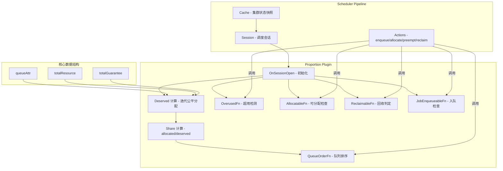
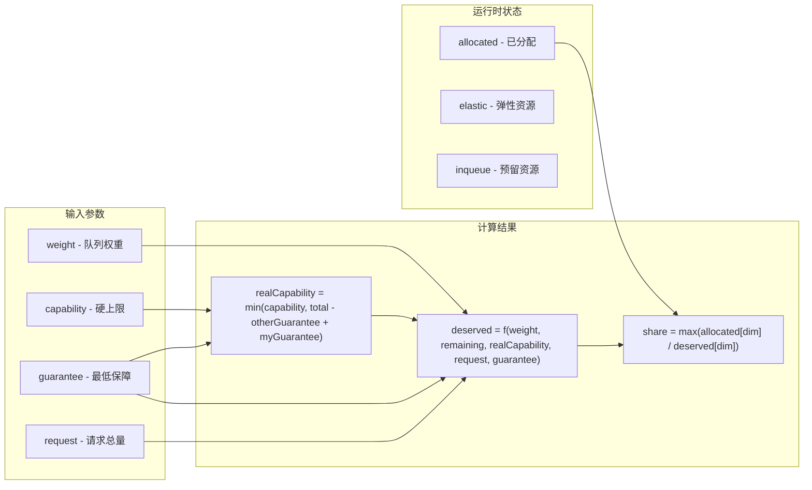
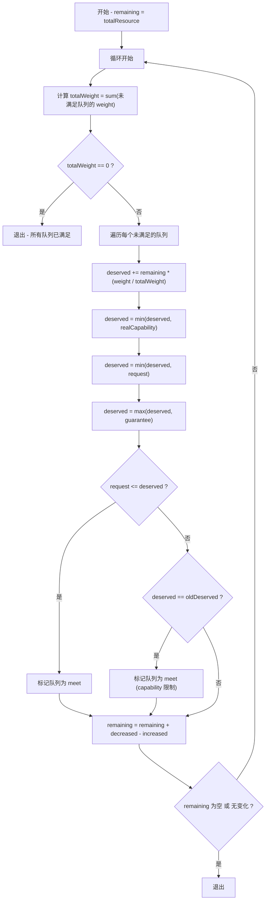
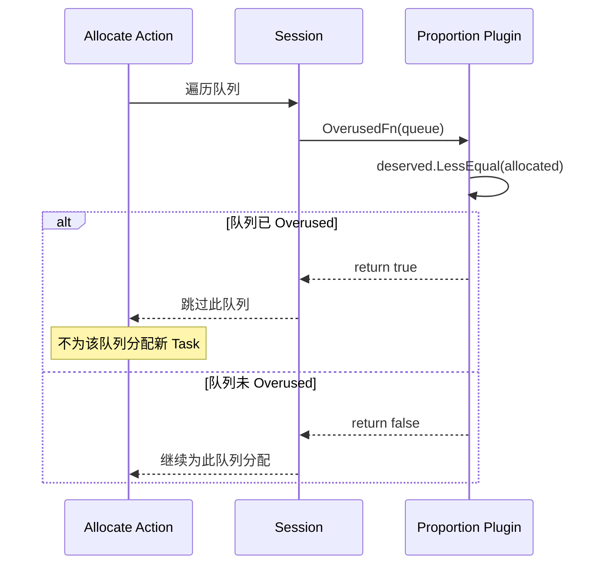
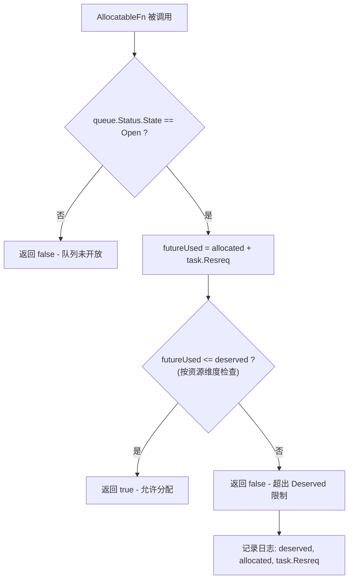
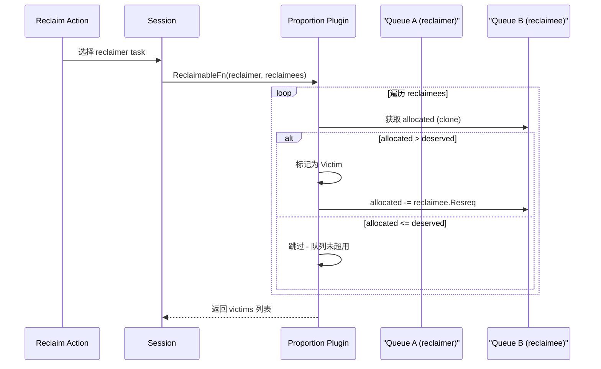
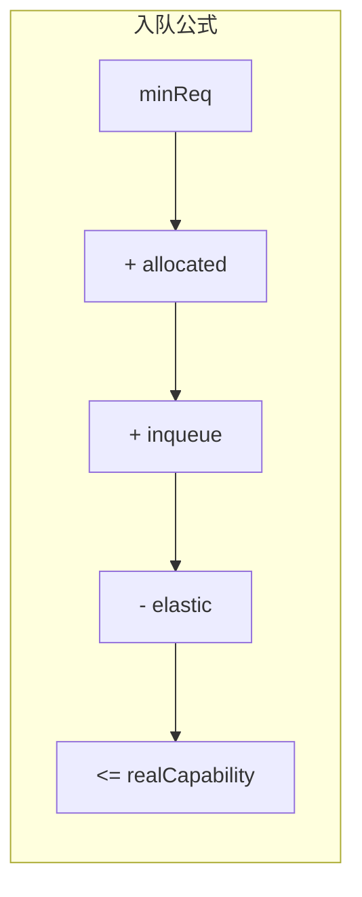
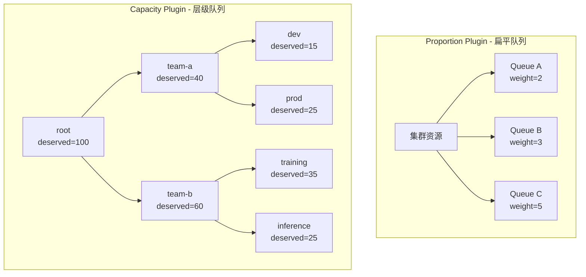
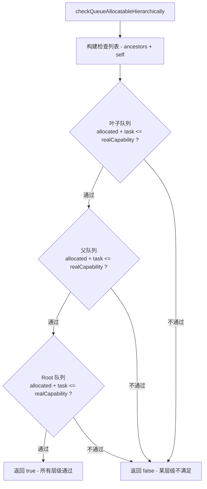

## 1. 概述

Volcano 调度器通过 **Proportion Plugin** 实现队列级别的公平资源分享机制。该插件是调度系统中最核心的资源管理组件之一，负责：

- 根据队列权重（Weight）计算每个队列的 **Deserved** 资源量（公平份额）
- 基于 `allocated / deserved` 比率计算队列的 **Share** 值，用于队列排序
- 提供 **Overused** 检测，防止队列过度占用资源
- 提供 **Allocatable** 检查，确保分配不超过 Deserved 限制
- 提供 **Reclaim** 逻辑，从超用队列回收资源
- 提供 **JobEnqueueable** 检查，基于队列容量限制控制 Job 入队

此外，**Capacity Plugin** 作为 Proportion 的增强版本，提供层级队列（Hierarchical Queue）支持，在每一层级都执行 Allocatable 检查。

> **源码入口**: `pkg/scheduler/plugins/proportion/proportion.go`
> **Capacity Plugin 源码**: `pkg/scheduler/plugins/capacity/capacity.go`

---

## 2. 架构总览



---

## 3. 核心数据结构

在深入代码链路之前，首先理解 Proportion Plugin 的核心数据结构 `queueAttr`：

```go
// 源码: pkg/scheduler/plugins/proportion/proportion.go Line 57-74
type queueAttr struct {
    queueID api.QueueID
    name    string
    weight  int32          // 队列权重，决定公平分配比例
    share   float64        // allocated/deserved 比率，用于排序

    deserved  *api.Resource  // 公平分配目标（计算得出）
    allocated *api.Resource  // 当前已分配资源
    request   *api.Resource  // 队列中所有 Job 的资源请求总和
    elastic   *api.Resource  // 可回收部分 (allocated - minAvailable)
    inqueue   *api.Resource  // 已入队 Job 预留的资源
    capability     *api.Resource  // 用户配置的硬上限
    realCapability *api.Resource  // 实际可用上限 (考虑 guarantee)
    guarantee      *api.Resource  // 最低保障资源
}
```

各字段之间的关系如下：



---

## 4. Deserved 资源计算调试

Deserved 计算是 Proportion Plugin 最核心的算法，采用**迭代式公平分配**策略。该算法位于 `OnSessionOpen` 方法中。

### 4.1 算法流程



### 4.2 源码详解

以下是 Deserved 计算的核心代码，位于 `pkg/scheduler/plugins/proportion/proportion.go` Line 189-256：

```go
// Line 189: 初始化 remaining 为集群总资源
remaining := pp.totalResource.Clone()
meet := map[api.QueueID]struct{}{}

for {
    // Line 192-198: 计算未满足队列的总权重
    totalWeight := int32(0)
    for _, attr := range pp.queueOpts {
        if _, found := meet[attr.queueID]; found {
            continue
        }
        totalWeight += attr.weight
    }

    // Line 201-204: 所有队列都满足或无队列，退出
    if totalWeight == 0 {
        break
    }

    oldRemaining := remaining.Clone()
    increasedDeserved := api.EmptyResource()
    decreasedDeserved := api.EmptyResource()

    for _, attr := range pp.queueOpts {
        if _, found := meet[attr.queueID]; found {
            continue
        }

        oldDeserved := attr.deserved.Clone()

        // Line 220: 按权重比例分配 remaining 资源
        attr.deserved.Add(remaining.Clone().Multi(float64(attr.weight) / float64(totalWeight)))

        // Line 222-224: 应用 realCapability 上限
        if attr.realCapability != nil {
            attr.deserved.MinDimensionResource(attr.realCapability, api.Infinity)
        }

        // Line 225: 应用 request 上限（不超过实际需求）
        attr.deserved.MinDimensionResource(attr.request, api.Zero)

        // Line 227: 应用 guarantee 下限（不低于保障值）
        attr.deserved = helpers.Max(attr.deserved, attr.guarantee)

        // Line 231-237: 检查是否满足
        if attr.request.LessEqual(attr.deserved, api.Zero) {
            meet[attr.queueID] = struct{}{}
        } else if equality.Semantic.DeepEqual(attr.deserved, oldDeserved) {
            meet[attr.queueID] = struct{}{}  // capability 限制导致无法继续增长
        }

        // Line 242-244: 计算本轮增减
        increased, decreased := attr.deserved.Diff(oldDeserved, api.Zero)
        increasedDeserved.Add(increased)
        decreasedDeserved.Add(decreased)
    }

    // Line 250: 更新 remaining
    remaining = api.ExceededPart(remaining.Clone().Add(decreasedDeserved), increasedDeserved)

    // Line 252-255: 检查终止条件
    if remaining.IsEmpty() || equality.Semantic.DeepEqual(remaining, oldRemaining) {
        break
    }
}
```

### 4.3 调试断点设置

| 断点位置 | 行号 | 调试目的 |
|---------|------|---------|
| `remaining := pp.totalResource.Clone()` | 189 | 检查集群总资源是否正确 |
| `attr.deserved.Add(remaining.Clone().Multi(...))` | 220 | 检查权重分配比例 |
| `attr.deserved.MinDimensionResource(attr.realCapability, ...)` | 223 | 检查 capability 裁剪 |
| `attr.deserved.MinDimensionResource(attr.request, ...)` | 225 | 检查 request 裁剪 |
| `attr.deserved = helpers.Max(attr.deserved, attr.guarantee)` | 227 | 检查 guarantee 保底 |
| `remaining = api.ExceededPart(...)` | 250 | 检查 remaining 更新 |

### 4.4 关键日志

启用 V(4) 级别日志可以观察完整的 Deserved 计算过程：

```
klog.V(4).Infof("The total resource is <%v>", pp.totalResource)                    // Line 94
klog.V(4).Infof("Considering Queue <%s>: weight <%d>, total weight <%d>.", ...)     // Line 213-214
klog.V(4).Infof("Format queue <%s> deserved resource to <%v>", attr.name, ...)     // Line 229
klog.V(4).Infof("queue <%s> is meet", attr.name)                                   // Line 233
klog.V(4).Infof("Remaining resource is <%s>", remaining)                            // Line 251
```

---

## 5. Share 计算与队列排序

### 5.1 Share 计算

Share 值是队列排序的核心指标，计算公式为**所有资源维度中 allocated/deserved 比率的最大值**：

```go
// 源码: pkg/scheduler/plugins/proportion/proportion.go Line 545-557
func updateQueueAttrShare(attr *queueAttr) {
    res := float64(0)
    for _, rn := range attr.deserved.ResourceNames() {
        share := helpers.Share(attr.allocated.Get(rn), attr.deserved.Get(rn))
        if share > res {
            res = share
        }
    }
    attr.share = res
}
```

`helpers.Share` 函数的逻辑（`pkg/scheduler/api/helpers/helpers.go` Line 80-90）：

```go
func Share(l, r float64) float64 {
    var share float64
    if r == 0 {
        if l == 0 {
            share = 0   // 无 deserved 且无 allocated -> 0
        } else {
            share = 1   // 无 deserved 但有 allocated -> 1（已超用）
        }
    } else {
        share = l / r   // 正常计算比率
    }
    return share
}
```


### 5.2 QueueOrderFn

队列排序函数注册在 `OnSessionOpen` 中（Line 258-276），排序规则：

1. **优先级排序**: 高 Priority 队列优先
2. **Share 排序**: 低 share 队列优先（更"饥饿"的队列先得到资源）

```go
// Line 258-276
ssn.AddQueueOrderFn(pp.Name(), func(l, r interface{}) int {
    lv := l.(*api.QueueInfo)
    rv := r.(*api.QueueInfo)

    // 优先级不同时，高优先级排前面
    if lv.Queue.Spec.Priority != rv.Queue.Spec.Priority {
        return int(rv.Queue.Spec.Priority) - int(lv.Queue.Spec.Priority)
    }

    // 优先级相同时，低 share 排前面
    if pp.queueOpts[lv.UID].share == pp.queueOpts[rv.UID].share {
        return 0
    }
    if pp.queueOpts[lv.UID].share < pp.queueOpts[rv.UID].share {
        return -1
    }
    return 1
})
```

### 5.3 调试技巧 - Share 计算验证

设置断点在 `updateQueueAttrShare` 函数（Line 545），检查：

- `attr.deserved.ResourceNames()` 返回哪些资源维度
- 每个维度的 `allocated.Get(rn)` 和 `deserved.Get(rn)` 值
- 最终 `attr.share` 是否合理

---

## 6. Overused 检测

### 6.1 检测逻辑

Overused 判定决定了队列在 Allocate Action 中是否会被跳过。

```go
// 源码: pkg/scheduler/plugins/proportion/proportion.go Line 300-312
ssn.AddOverusedFn(pp.Name(), func(obj interface{}) bool {
    queue := obj.(*api.QueueInfo)
    attr := pp.queueOpts[queue.UID]

    // 判定: allocated >= deserved（所有维度）
    overused := attr.deserved.LessEqual(attr.allocated, api.Zero)
    metrics.UpdateQueueOverused(attr.name, overused)

    if overused {
        klog.V(3).Infof("Queue <%v> is overused: deserved <%v>, allocated <%v>, share <%v>",
            queue.Name, attr.deserved, attr.allocated, attr.share)
    }
    return overused
})
```

### 6.2 Overused 影响链路



### 6.3 调试技巧

当发现某队列无法获得资源时，检查 V(3) 日志中是否出现 `"Queue <xxx> is overused"` 消息。如果出现，对比 `deserved` 和 `allocated` 的每个资源维度：

```bash
# 搜索 Overused 相关日志
grep "is overused" /var/log/volcano-scheduler.log
```

---

## 7. Allocatable 检查

### 7.1 检查逻辑

Allocatable 检查在每次尝试分配 Task 时执行，确保分配后 allocated 不超过 deserved：

```go
// 源码: pkg/scheduler/plugins/proportion/proportion.go Line 314-333
queueAllocatable := func(queue *api.QueueInfo, candidate *api.TaskInfo) bool {
    if queue.Queue.Status.State != scheduling.QueueStateOpen {
        klog.V(3).Infof("Queue <%s> current state: %s, is not in open state", ...)
        return false
    }

    attr := pp.queueOpts[queue.UID]
    // 模拟分配后的资源使用量
    futureUsed := attr.allocated.Clone().Add(candidate.Resreq)
    // 检查: allocated + task.Resreq <= deserved
    allocatable, _ := futureUsed.LessEqualWithDimensionAndResourcesName(attr.deserved, candidate.Resreq)
    if !allocatable {
        klog.V(3).Infof("Queue <%v>: deserved <%v>, allocated <%v>; Candidate <%v>: resource request <%v>",
            queue.Name, attr.deserved, attr.allocated, candidate.Name, candidate.Resreq)
    }
    return allocatable
}
```

### 7.2 Allocatable 检查流程



### 7.3 调试断点设置

在 Line 321 设置断点，检查：
- `attr.allocated` 当前已分配量
- `candidate.Resreq` 待分配 Task 的资源请求
- `attr.deserved` 队列的 Deserved 值
- `futureUsed` 模拟分配后的使用量

---

## 8. Reclaim 逻辑

### 8.1 ReclaimableFn

当一个队列需要回收资源时，Proportion Plugin 会从**超过 Deserved 的队列**中选择 Victim：

```go
// 源码: pkg/scheduler/plugins/proportion/proportion.go Line 278-298
ssn.AddReclaimableFn(pp.Name(), func(reclaimer *api.TaskInfo, reclaimees []*api.TaskInfo) ([]*api.TaskInfo, int) {
    var victims []*api.TaskInfo
    allocations := map[api.QueueID]*api.Resource{}

    for _, reclaimee := range reclaimees {
        job := ssn.Jobs[reclaimee.Job]
        attr := pp.queueOpts[job.Queue]

        if _, found := allocations[job.Queue]; !found {
            allocations[job.Queue] = attr.allocated.Clone()
        }
        allocated := allocations[job.Queue]

        // 关键判定: allocated > deserved 时，该 Task 可被回收
        if !allocated.LessEqual(attr.deserved, api.Zero) {
            allocated.Sub(reclaimee.Resreq)
            victims = append(victims, reclaimee)
        }
    }
    return victims, util.Permit
})
```

### 8.2 Reclaim 决策流程



### 8.3 调试技巧

检查日志输出 `"Victims from proportion plugins are %+v"`（Line 296），如果 victims 为空，说明所有候选 reclaimee 所在的队列的 allocated 都没有超过 deserved。

---

## 9. Job Enqueue 检查

### 9.1 JobEnqueueableFn

Job 从 Pending 进入 Inqueue 状态前，需要通过入队检查：

```go
// 源码: pkg/scheduler/plugins/proportion/proportion.go Line 377-415
ssn.AddJobEnqueueableFn(pp.Name(), func(obj interface{}) int {
    job := obj.(*api.JobInfo)
    attr := pp.queueOpts[job.Queue]
    queue := ssn.Queues[job.Queue]

    // 检查 1: 队列是否 Open
    if queue.Queue.Status.State != scheduling.QueueStateOpen {
        return util.Reject
    }

    // 检查 2: 无 capability 限制时直接放行
    if attr.realCapability == nil {
        return util.Permit
    }

    // 检查 3: 无 MinResources 时直接放行
    if job.PodGroup.Spec.MinResources == nil {
        return util.Permit
    }

    // 检查 4: minReq + allocated + inqueue - elastic <= realCapability
    minReq := job.GetMinResources()
    r := minReq.Clone().Add(attr.allocated).Add(attr.inqueue).Sub(attr.elastic)
    inqueue, resourceNames := r.LessEqualWithDimensionAndResourcesName(attr.realCapability, minReq)

    if inqueue {
        attr.inqueue.Add(job.DeductSchGatedResources(minReq))
        return util.Permit
    }
    // 记录事件: 队列资源配额不足
    ssn.RecordPodGroupEvent(job.PodGroup, ...)
    return util.Reject
})
```

### 9.2 入队公式

核心公式为：

```
minReq + allocated + inqueue - elastic <= realCapability
```

其中：
- `minReq`: Job 的最小资源需求（MinResources）
- `allocated`: 队列当前已分配资源
- `inqueue`: 已入队但未分配的 Job 预留资源
- `elastic`: 可弹性回收的资源（allocated - minAvailable 部分）
- `realCapability`: 队列实际可用上限



### 9.3 调试断点设置

| 断点位置 | 行号 | 检查内容 |
|---------|------|---------|
| `queue.Queue.Status.State != scheduling.QueueStateOpen` | 383 | 队列是否处于 Open 状态 |
| `attr.realCapability == nil` | 388 | 是否设置了 capability |
| `r := minReq.Clone().Add(attr.allocated)...` | 403 | 各分量的实际值 |
| `inqueue, resourceNames := r.LessEqualWithDimension...` | 405 | 哪些资源维度不满足 |

---

## 10. Capacity Plugin 对比 - 层级队列支持

### 10.1 架构差异

Capacity Plugin 在 Proportion Plugin 基础上增加了**层级队列**（Hierarchical Queue）支持：



### 10.2 层级 Allocatable 检查

Capacity Plugin 的 `checkQueueAllocatableHierarchically` 方法从叶子队列向上逐层检查：

```go
// 源码: pkg/scheduler/plugins/capacity/capacity.go Line 901-917
func (cp *capacityPlugin) checkQueueAllocatableHierarchically(
    ssn *framework.Session, queue *api.QueueInfo, candidate *api.TaskInfo) bool {

    // 构建检查列表: [root, ..., parent, queue]
    list := append(cp.queueOpts[queue.UID].ancestors, queue.UID)

    // 从叶子向上逐层检查
    for i := len(list) - 1; i >= 0; i-- {
        if !cp.queueAllocatable(ssn.Queues[list[i]], candidate) {
            // V(5) 时打印所有层级信息
            if klog.V(5).Enabled() {
                for j := i - 1; j >= 0; j-- {
                    cp.queueAllocatable(ssn.Queues[list[j]], candidate)
                }
            }
            return false
        }
    }
    return true
}
```

### 10.3 层级检查流程



### 10.4 Capacity vs Proportion 关键差异

| 特性 | Proportion Plugin | Capacity Plugin |
|------|------------------|-----------------|
| 队列模型 | 扁平队列 | 层级队列 |
| Deserved 来源 | 迭代计算（基于 weight） | 用户直接配置（`queue.spec.deserved`） |
| Allocatable 检查 | 仅当前队列 | 逐层向上检查（叶子到 root） |
| Job Enqueue 检查 | 仅当前队列 | 逐层向上检查 |
| Share 计算（无 Deserved 时） | `share = 0`（分母为 0 时） | `share = 1`（best-effort 队列） |
| 祖先资源更新 | 不涉及 | Allocate/Deallocate 时更新所有祖先 |

### 10.5 Capacity Plugin Share 计算

Capacity Plugin 的 Share 计算增加了 **best-effort 队列**处理（Line 1032-1059）：

```go
// 源码: pkg/scheduler/plugins/capacity/capacity.go Line 1032-1059
func updateQueueAttrShare(attr *queueAttr) {
    res := float64(0)

    // best-effort 队列: 无 deserved -> share = 1
    // 确保 best-effort 队列总是排在有 deserved 的队列之后
    if attr.deserved.IsEmpty() {
        attr.share = 1
        return
    }

    for _, rn := range attr.deserved.ResourceNames() {
        res = max(res, helpers.Share(attr.allocated.Get(rn), attr.deserved.Get(rn)))
    }
    attr.share = res
}
```

---

## 11. Event Handler - 实时资源追踪

Proportion Plugin 注册了 EventHandler 来实时追踪资源分配变化：

```go
// 源码: pkg/scheduler/plugins/proportion/proportion.go Line 450-473
ssn.AddEventHandler(&framework.EventHandler{
    AllocateFunc: func(event *framework.Event) {
        job := ssn.Jobs[event.Task.Job]
        attr := pp.queueOpts[job.Queue]
        attr.allocated.Add(event.Task.Resreq)       // 分配时增加
        pp.updateShare(attr)                          // 重新计算 share
    },
    DeallocateFunc: func(event *framework.Event) {
        job := ssn.Jobs[event.Task.Job]
        attr := pp.queueOpts[job.Queue]
        attr.allocated.Sub(event.Task.Resreq)        // 回收时减少
        pp.updateShare(attr)                          // 重新计算 share
    },
})
```

这意味着在一个调度周期内，每次 Task 被分配或回收，对应队列的 `allocated` 和 `share` 都会被实时更新，确保后续决策基于最新状态。

---

## 12. Preempt 模拟支持

Proportion Plugin 还提供了 Preempt 模拟相关的函数，用于在 Preempt Action 中模拟资源变化：

```go
// SimulateAllocatableFn (Line 335-355): 使用 CycleState 中的快照进行检查
// SimulateAddTaskFn (Line 417-431): 模拟添加 Task
// SimulateRemoveTaskFn (Line 433-447): 模拟移除 Task
```

这些函数使用 `proportionState`（`CycleState` 中的快照）而非直接修改 `queueOpts`，避免模拟操作影响实际状态。

---

## 13. 完整 Plugin 注册一览

```mermaid
graph TD
    subgraph registration["Proportion Plugin 注册的扩展点"]
        QOF["QueueOrderFn - Line 258"]
        RF["ReclaimableFn - Line 278"]
        OF["OverusedFn - Line 300"]
        AF["AllocatableFn - Line 331"]
        SAF["SimulateAllocatableFn - Line 335"]
        PF["PreemptiveFn - Line 357"]
        PPF["PrePredicateFn - Line 363"]
        JEF["JobEnqueueableFn - Line 377"]
        SATF["SimulateAddTaskFn - Line 417"]
        SRTF["SimulateRemoveTaskFn - Line 433"]
        EH["EventHandler - Line 450"]
    end

    subgraph callers["调用者 (Actions)"]
        Enqueue["Enqueue Action"]
        Allocate["Allocate Action"]
        Preempt["Preempt Action"]
        ReclaimA["Reclaim Action"]
    end

    Enqueue --> JEF
    Allocate --> QOF
    Allocate --> OF
    Allocate --> AF
    Allocate --> EH
    Preempt --> PF
    Preempt --> PPF
    Preempt --> SAF
    Preempt --> SATF
    Preempt --> SRTF
    ReclaimA --> RF
```



---

## 14. 调试技巧总结

### 14.1 如何检查 Deserved 计算是否正确

1. **设置日志级别 V(4)**: 观察每轮迭代的 `remaining`、`totalWeight`、每个队列的 `deserved` 变化
2. **手动验证**: 使用以下公式验证第一轮分配
   ```
   deserved_q = totalResource * (weight_q / sum(all_weights))
   deserved_q = min(deserved_q, realCapability_q)
   deserved_q = min(deserved_q, request_q)
   deserved_q = max(deserved_q, guarantee_q)
   ```
3. **检查 realCapability**: `realCapability = min(capability, totalResource - totalGuarantee + myGuarantee)`

### 14.2 如何诊断队列 Overused

1. 检查 `attr.deserved` 和 `attr.allocated` 的每个维度
2. `Overused` 条件: `deserved <= allocated`（所有维度都满足）
3. 常见原因: 队列的 weight 太低、capability 限制了 deserved、其他队列 guarantee 占用了资源

### 14.3 如何追踪 Allocatable 失败

1. 搜索日志: `"Queue <xxx>: deserved <...>, allocated <...>; Candidate <...>: resource request <...>"`
2. 比较 `allocated + task.Resreq` 与 `deserved` 的各维度
3. 注意 `LessEqualWithDimensionAndResourcesName` 只检查 Task 请求的资源维度

### 14.4 常见公平分享问题

| 问题 | 可能原因 | 排查方法 |
|------|---------|---------|
| 队列始终拿不到资源 | Deserved 为 0 或极小 | 检查 weight、capability、guarantee 配置 |
| 队列 Overused 但 share < 1 | 不应出现，检查代码逻辑 | 设断点在 OverusedFn |
| Allocatable 失败但队列未 Overused | 某维度超出但总体未超 | 检查各维度的 allocated vs deserved |
| Job 无法入队 | realCapability 不足 | 检查 `minReq + allocated + inqueue - elastic <= realCapability` |
| Reclaim 无 Victim | 候选队列未超过 Deserved | 检查候选队列的 allocated vs deserved |
| 层级队列某层不通过 | 父队列 realCapability 不足 | 开启 V(5) 查看逐层检查结果 |

### 14.5 Metrics 监控

Proportion Plugin 会上报以下 Prometheus 指标：

```
volcano_queue_allocated_milli_cpu
volcano_queue_allocated_memory
volcano_queue_request_milli_cpu
volcano_queue_request_memory
volcano_queue_deserved_milli_cpu
volcano_queue_deserved_memory
volcano_queue_weight
volcano_queue_overused
volcano_queue_share
```

通过 Grafana 面板观察这些指标的变化，可以快速定位公平分享问题。

---

## 15. 端到端调试示例

### 场景: 三个队列竞争 100 CPU 的集群

假设集群总资源 100 CPU，三个队列配置如下：

| 队列 | Weight | Capability | Guarantee | Request |
|------|--------|------------|-----------|---------|
| A | 2 | 50 CPU | 10 CPU | 80 CPU |
| B | 3 | - | - | 60 CPU |
| C | 5 | - | 20 CPU | 30 CPU |

**第一轮迭代**:
- totalWeight = 2 + 3 + 5 = 10, remaining = 100
- A: deserved = 100 * 2/10 = 20 -> min(20, 50) = 20 -> min(20, 80) = 20 -> max(20, 10) = 20
- B: deserved = 100 * 3/10 = 30 -> min(30, INF) = 30 -> min(30, 60) = 30 -> max(30, 0) = 30
- C: deserved = 100 * 5/10 = 50 -> min(50, INF) = 50 -> min(50, 30) = 30 -> max(30, 20) = 30
- C meet (request 30 <= deserved 30)
- increased = 20 + 30 + 30 = 80, decreased = 0, remaining = 100 - 80 = 20

**第二轮迭代**:
- totalWeight = 2 + 3 = 5, remaining = 20
- A: deserved = 20 + 20 * 2/5 = 28 -> min(28, 50) = 28 -> min(28, 80) = 28 -> max(28, 10) = 28
- B: deserved = 30 + 20 * 3/5 = 42 -> min(42, INF) = 42 -> min(42, 60) = 42 -> max(42, 0) = 42
- increased = 8 + 12 = 20, decreased = 0, remaining = 20 - 20 = 0

**最终结果**: A=28, B=42, C=30

```bash
# 使用以下命令验证日志
kubectl logs -n volcano-system volcano-scheduler-xxx | grep "Format queue"
```
