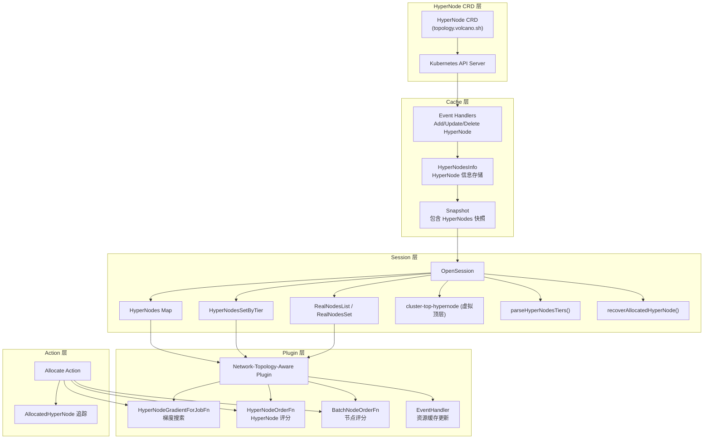
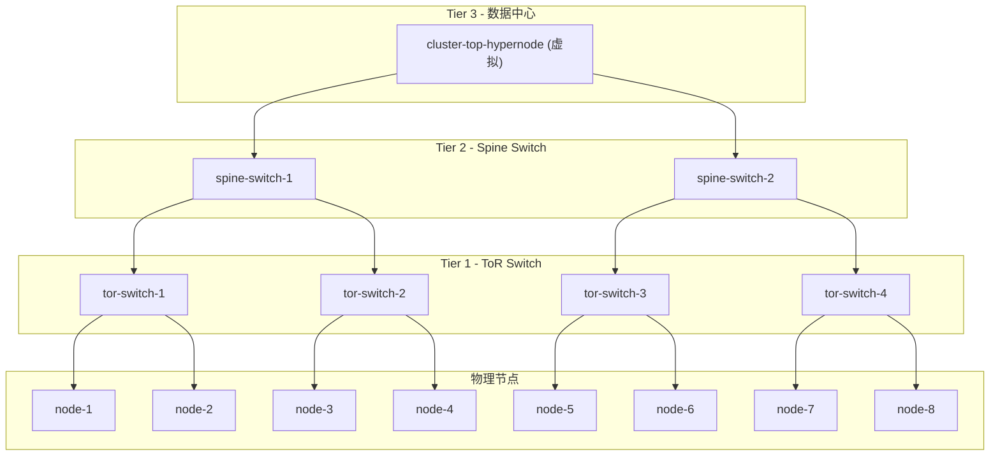
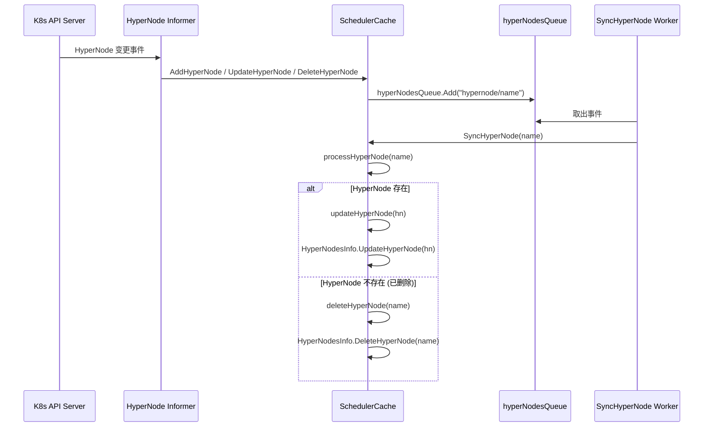
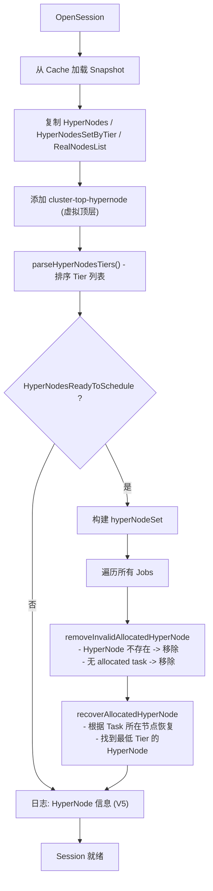
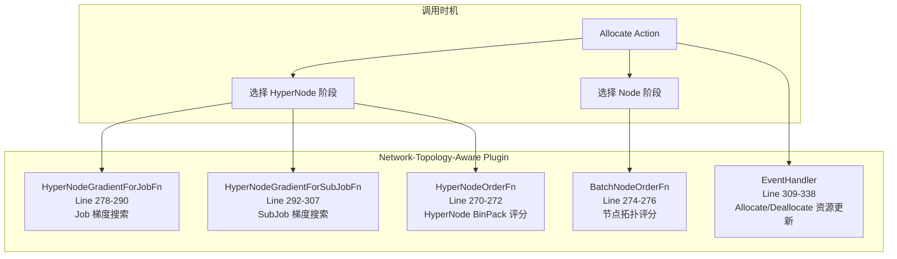
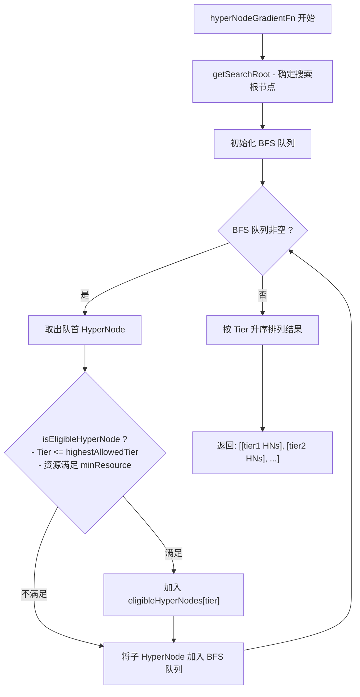
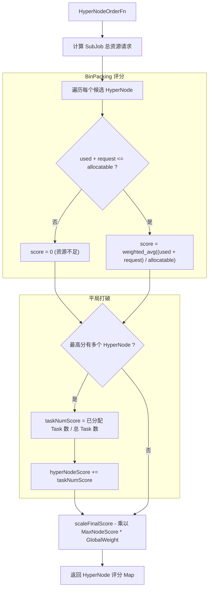
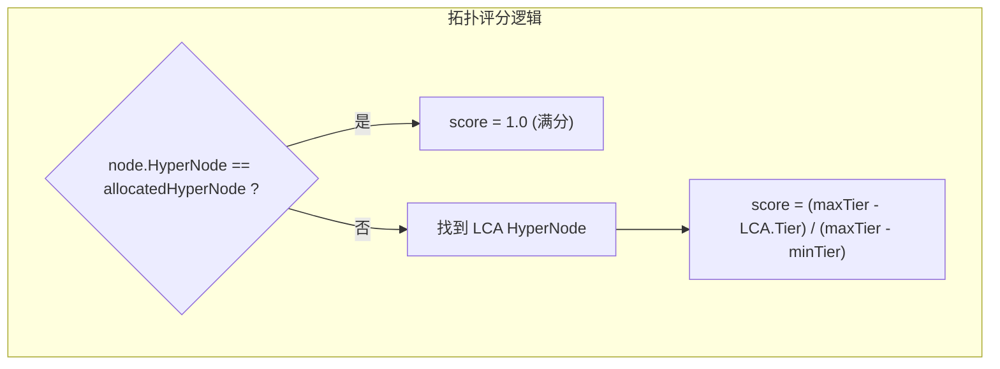
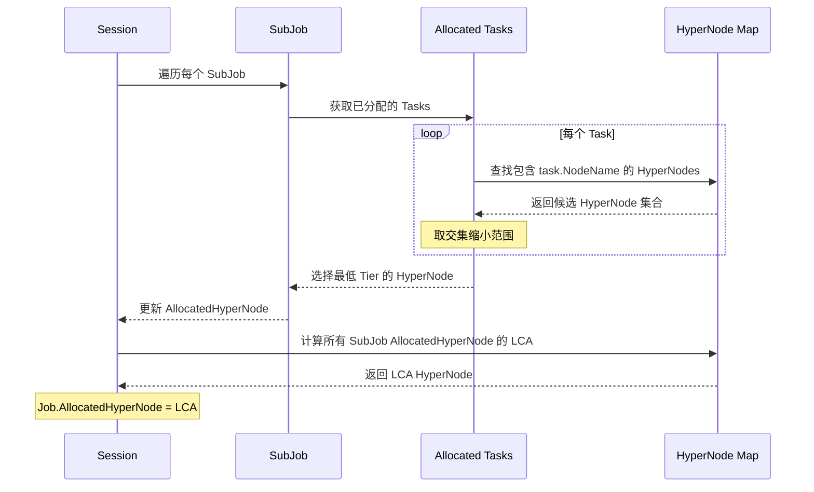

## 1. 概述

在大规模 AI/ML 训练场景中，同一 Job 的多个 Pod 之间需要频繁进行高带宽、低延迟的网络通信（如 AllReduce 操作）。如果这些 Pod 被调度到网络拓扑距离较远的节点上，通信延迟会显著增加，严重影响训练效率。

Volcano 的**拓扑感知调度**功能通过 **HyperNode** 层级模型和 **Network-Topology-Aware Plugin** 实现以下目标：

- 将同一 Job/SubJob 的 Pod 尽量放置在网络拓扑距离最近的节点上
- 从最低 Tier（网络距离最近）开始梯度搜索，找到能容纳 Job 所有 Task 的最小 HyperNode
- 对候选 HyperNode 和节点进行 BinPacking 评分，优化资源利用率
- 支持 Hard Mode（强制拓扑约束）和 Soft Mode（尽力而为）

> **核心源码**: `pkg/scheduler/plugins/network-topology-aware/network_topology_aware.go`
> **Session 管理**: `pkg/scheduler/framework/session.go`
> **Cache 事件处理**: `pkg/scheduler/cache/event_handlers.go`

---

## 2. 架构总览



---

## 3. HyperNode 层级模型

### 3.1 概念模型

HyperNode 是一种树形层级结构，每一层（Tier）代表一个网络拓扑域。Tier 值越低，表示节点之间的网络距离越近。



### 3.2 核心数据结构

Session 中与 HyperNode 相关的字段：

```go
// 源码: pkg/scheduler/framework/session.go Line 101-112
type Session struct {
    // ...
    // HyperNodes 存储每个 HyperNode 的信息
    HyperNodes           api.HyperNodeInfoMap          // map[string]*HyperNodeInfo
    HyperNodeTierNameMap api.HyperNodeTierNameMap
    // HyperNodesSetByTier 按 Tier 分组的 HyperNode 集合（从低到高）
    HyperNodesSetByTier  map[int]sets.Set[string]
    HyperNodesTiers      []int                          // 排序后的 Tier 列表
    // RealNodesList 每个 HyperNode 下的真实节点列表
    RealNodesList        map[string][]*api.NodeInfo
    RealNodesSet         map[string]sets.Set[string]
    // HyperNodesReadyToSchedule HyperNode 是否就绪
    HyperNodesReadyToSchedule bool
}
```

Plugin 内部的数据结构：

```go
// 源码: pkg/scheduler/plugins/network-topology-aware/network_topology_aware.go Line 64-96
type networkTopologyAwarePlugin struct {
    pluginArguments        framework.Arguments
    weight                 *priorityWeight       // 评分权重配置
    *normalPodConfig                              // 普通 Pod BinPack 配置
    *hyperNodesTier                               // Tier 范围 (min/max)
    hyperNodeResourceCache map[string]*resourceStatus  // HyperNode 资源缓存
}

type resourceStatus struct {
    allocatable *api.Resource   // HyperNode 可分配资源总量
    used        *api.Resource   // HyperNode 已使用资源
    idle        *api.Resource   // HyperNode 空闲资源
    futureIdle  *api.Resource   // HyperNode 未来可用资源
}
```

---

## 4. HyperNode 信息如何进入 Cache

### 4.1 Event Handlers

Cache 通过 Informer 监听 HyperNode CRD 的变化事件：

```go
// 源码: pkg/scheduler/cache/event_handlers.go Line 1356-1394
// AddHyperNode 将 HyperNode 名称加入处理队列
func (sc *SchedulerCache) AddHyperNode(obj interface{}) {
    hn, ok := obj.(*topologyv1alpha1.HyperNode)
    if !ok {
        klog.ErrorS(nil, "Cannot convert to *topologyv1alpha1.HyperNode", ...)
        return
    }
    sc.hyperNodesQueue.Add(string(hyperNodeEventSourceHyperNode) + "/" + hn.Name)
}

// UpdateHyperNode 处理 HyperNode 更新事件
func (sc *SchedulerCache) UpdateHyperNode(oldObj, newObj interface{}) {
    newHyperNode, ok := newObj.(*topologyv1alpha1.HyperNode)
    // ...
    sc.hyperNodesQueue.Add(string(hyperNodeEventSourceHyperNode) + "/" + newHyperNode.Name)
}

// DeleteHyperNode 处理 HyperNode 删除事件
func (sc *SchedulerCache) DeleteHyperNode(obj interface{}) {
    // ...
    sc.hyperNodesQueue.Add(string(hyperNodeEventSourceHyperNode) + "/" + hn.Name)
}
```

### 4.2 事件处理流程



### 4.3 processHyperNode 详解

```go
// 源码: pkg/scheduler/cache/event_handlers.go Line 770-782
func (sc *SchedulerCache) processHyperNode(name string) error {
    sc.HyperNodesInfo.Lock()
    defer sc.HyperNodesInfo.Unlock()

    hn, err := sc.hyperNodeInformer.Lister().Get(name)
    if err != nil {
        if !errors.IsNotFound(err) {
            return fmt.Errorf("failed to get hyperNode <%s>: %v", name, err)
        }
        return sc.deleteHyperNode(name)  // 已删除，从缓存移除
    }
    return sc.updateHyperNode(hn)  // 更新缓存
}
```

### 4.4 Node 变化触发 HyperNode 更新

当节点发生变化时，如果有使用 regex 或 label 匹配的叶子 HyperNode，也会触发更新：

```go
// 源码: pkg/scheduler/cache/event_handlers.go Line 737-768
func (sc *SchedulerCache) triggerUpdateHyperNode(name string) error {
    sc.HyperNodesInfo.Lock()
    defer sc.HyperNodesInfo.Unlock()

    leafNodes := sc.HyperNodesInfo.GetRegexOrLabelMatchLeafHyperNodes()
    for leafNode := range leafNodes {
        match, err := sc.HyperNodesInfo.NodeRegexOrLabelMatchLeafHyperNode(name, hn.Name)
        if match {
            // 更新匹配的叶子 HyperNode 及其祖先
            sc.updateHyperNode(hn)
        }
    }
    return nil
}
```

### 4.5 调试断点

| 断点位置 | 文件 | 行号 | 调试目的 |
|---------|------|------|---------|
| `AddHyperNode` | event_handlers.go | 1357 | 验证 HyperNode 创建事件是否被捕获 |
| `processHyperNode` | event_handlers.go | 770 | 验证 HyperNode 处理流程 |
| `updateHyperNode` | event_handlers.go | 1399 | 验证 HyperNode 缓存更新 |
| `triggerUpdateHyperNode` | event_handlers.go | 737 | 验证节点变更是否触发 HyperNode 更新 |

---

## 5. Session 加载 HyperNode

### 5.1 OpenSession 中的 HyperNode 初始化

每个调度周期开始时，`OpenSession` 从 Cache Snapshot 加载 HyperNode 信息：

```go
// 源码: pkg/scheduler/framework/session.go Line 240-258
ssn.HyperNodes = snapshot.HyperNodes
ssn.HyperNodesSetByTier = snapshot.HyperNodesSetByTier
ssn.HyperNodeTierNameMap = snapshot.HyperNodeTierNameMap
ssn.RealNodesList, ssn.RealNodesSet = util.GetRealNodesByHyperNode(snapshot.RealNodesSet, snapshot.Nodes)
ssn.HyperNodesReadyToSchedule = snapshot.HyperNodesReadyToSchedule

// 添加虚拟顶层 HyperNode
ssn.addClusterTopHyperNode(ssn.NodeList)
// 解析 Tier 层级顺序
ssn.parseHyperNodesTiers()

if ssn.HyperNodesReadyToSchedule {
    hyperNodeSet := sets.New[string]()
    for hn := range ssn.HyperNodes {
        hyperNodeSet.Insert(hn)
    }
    for _, job := range ssn.Jobs {
        // 移除无效的 AllocatedHyperNode
        ssn.removeInvalidAllocatedHyperNode(job, ssn.HyperNodes)
        // 恢复 AllocatedHyperNode（调度器重启恢复）
        ssn.recoverAllocatedHyperNode(job, hyperNodeSet, ssn.HyperNodes, ssn.RealNodesSet)
    }
}
```

### 5.2 虚拟顶层 HyperNode

`addClusterTopHyperNode` 在所有真实 HyperNode 之上创建一个虚拟的 `cluster-top-hypernode`：

```go
// 源码: pkg/scheduler/framework/session.go Line 284-312
func (ssn *Session) addClusterTopHyperNode(nodes []*api.NodeInfo) {
    topTier := 1
    for tier := range ssn.HyperNodesSetByTier {
        if tier >= topTier {
            topTier = tier + 1  // 比最高真实 Tier 大 1
        }
    }

    topHn := &topologyv1alpha1.HyperNode{}
    topHn.Name = ClusterTopHyperNode  // "<cluster-top-hypernode>"
    topHn.Spec.Tier = topTier
    topHni := api.NewHyperNodeInfo(topHn)

    // 将所有无父节点的 HyperNode 作为 children
    for _, hni := range ssn.HyperNodes {
        if hni.Parent != "" {
            continue
        }
        topHni.Children.Insert(hni.Name)
    }

    // 注册到 Session
    ssn.HyperNodes[topHni.Name] = topHni
    ssn.HyperNodesSetByTier[topHni.Tier()] = sets.New(topHni.Name)
    ssn.RealNodesList[topHni.Name] = nodes  // 包含所有节点
}
```

### 5.3 Session 初始化完整流程



### 5.4 调试断点

| 断点位置 | 文件 | 行号 | 调试目的 |
|---------|------|------|---------|
| `ssn.HyperNodes = snapshot.HyperNodes` | session.go | 240 | 检查快照中 HyperNode 数量 |
| `ssn.addClusterTopHyperNode(...)` | session.go | 245 | 验证虚拟顶层创建 |
| `ssn.removeInvalidAllocatedHyperNode(...)` | session.go | 255 | 检查无效 AllocatedHyperNode |
| `ssn.recoverAllocatedHyperNode(...)` | session.go | 256 | 检查恢复逻辑 |

---

## 6. Network-Topology-Aware Plugin

### 6.1 Plugin 初始化

```go
// 源码: pkg/scheduler/plugins/network-topology-aware/network_topology_aware.go Line 144-154
func New(arguments framework.Arguments) framework.Plugin {
    plugin := networkTopologyAwarePlugin{
        pluginArguments:        arguments,
        weight:                 getPriorityWeight(arguments),    // 解析评分权重
        normalPodConfig:        getNormalPodConfig(arguments),   // 普通 Pod 配置
        hyperNodesTier:         &hyperNodesTier{},
        hyperNodeResourceCache: make(map[string]*resourceStatus),
    }
    return &plugin
}
```

### 6.2 OnSessionOpen 注册

```go
// 源码: network_topology_aware.go Line 262-339
func (nta *networkTopologyAwarePlugin) OnSessionOpen(ssn *framework.Session) {
    // 初始化 Tier 范围
    nta.hyperNodesTier.init(ssn.HyperNodesTiers)
    // 初始化 HyperNode 资源缓存
    nta.initHyperNodeResourceCache(ssn)

    // 注册 HyperNodeOrderFn: HyperNode 评分
    ssn.AddHyperNodeOrderFn(nta.Name(), ...)

    // 注册 BatchNodeOrderFn: 节点评分
    ssn.AddBatchNodeOrderFn(nta.Name(), ...)

    // 注册 HyperNodeGradientForJobFn: Job 级梯度搜索
    ssn.AddHyperNodeGradientForJobFn(nta.Name(), ...)

    // 注册 HyperNodeGradientForSubJobFn: SubJob 级梯度搜索
    ssn.AddHyperNodeGradientForSubJobFn(nta.Name(), ...)

    // 注册 EventHandler: 资源缓存更新
    ssn.AddEventHandler(...)
}
```

### 6.3 Plugin 注册的扩展点一览



---

## 7. 梯度搜索算法

### 7.1 算法概述

梯度搜索（Gradient Search）是拓扑感知调度的核心算法。其目标是为一个 Job/SubJob 找到**能容纳所有 Task 且网络距离最近的 HyperNode 层级**。

### 7.2 HyperNodeGradientForJobFn

```go
// 源码: network_topology_aware.go Line 278-290
ssn.AddHyperNodeGradientForJobFn(nta.Name(), func(job *api.JobInfo, hyperNode *api.HyperNodeInfo) [][]*api.HyperNodeInfo {
    if hardMode, highestAllowedTier := job.IsHardTopologyMode(); hardMode {
        jobMinResource := job.GetMinResources()
        result, err := nta.hyperNodeGradientFn(ssn, hyperNode, highestAllowedTier,
            job.AllocatedHyperNode, jobMinResource)
        if err != nil {
            klog.ErrorS(err, "build hyperNode gradient fail", "job", job.UID, ...)
            return nil
        }
        return result
    }
    // Soft Mode: 直接返回输入的 HyperNode
    return [][]*api.HyperNodeInfo{{hyperNode}}
})
```

### 7.3 hyperNodeGradientFn 详解

核心梯度搜索函数使用 **BFS 遍历** HyperNode 树：

```go
// 源码: network_topology_aware.go Line 564-609
func (nta *networkTopologyAwarePlugin) hyperNodeGradientFn(
    ssn *framework.Session,
    hyperNode *api.HyperNodeInfo,
    highestAllowedTier int,
    allocatedHyperNode string,
    minResource *api.Resource,
) ([][]*api.HyperNodeInfo, error) {

    enqueued := set.New[string]()
    var processQueue []*api.HyperNodeInfo

    // 确定搜索根节点
    searchRoot, err := getSearchRoot(ssn.HyperNodes, hyperNode,
        highestAllowedTier, allocatedHyperNode)
    processQueue = append(processQueue, searchRoot)
    enqueued.Insert(searchRoot.Name)

    eligibleHyperNodes := make(map[int][]*api.HyperNodeInfo)

    // BFS 遍历
    for len(processQueue) > 0 {
        current := processQueue[0]
        processQueue = processQueue[1:]

        // 检查 HyperNode 是否满足条件
        if nta.isEligibleHyperNode(current, highestAllowedTier,
            allocatedHyperNode, minResource) {
            eligibleHyperNodes[current.Tier()] = append(
                eligibleHyperNodes[current.Tier()], current)
        }

        // 将子 HyperNode 加入队列
        for child := range current.Children {
            if enqueued.Has(child) {
                continue
            }
            processQueue = append(processQueue, ssn.HyperNodes[child])
            enqueued.Insert(child)
        }
    }

    // 按 Tier 升序组织结果
    var tiers []int
    for tier := range eligibleHyperNodes {
        tiers = append(tiers, tier)
    }
    sort.Ints(tiers)

    var result [][]*api.HyperNodeInfo
    for _, tier := range tiers {
        result = append(result, eligibleHyperNodes[tier])
    }
    return result, nil
}
```

### 7.4 梯度搜索流程图



### 7.5 isEligibleHyperNode

```go
// 源码: network_topology_aware.go Line 611-629
func (nta *networkTopologyAwarePlugin) isEligibleHyperNode(
    hn *api.HyperNodeInfo, highestAllowedTier int,
    allocatedHyperNode string, minResource *api.Resource) bool {

    // 条件 1: Tier 不超过允许的最高层级
    if hn.Tier() > highestAllowedTier {
        return false
    }

    // 条件 2: 部分运行场景跳过资源预检
    if allocatedHyperNode != "" {
        return true
    }

    // 条件 3: 资源满足检查
    hnResourceStatus, found := nta.hyperNodeResourceCache[hn.Name]
    if !found {
        return true  // 缓存不存在时跳过预检
    }

    // idle 或 futureIdle 满足 minResource 即可
    if minResource.LessEqual(hnResourceStatus.idle, api.Zero) ||
       minResource.LessEqual(hnResourceStatus.futureIdle, api.Zero) {
        return true
    }
    return false
}
```

### 7.6 getSearchRoot

搜索根节点的确定考虑了两个约束的交集：

```go
// 源码: network_topology_aware.go Line 635-660
func getSearchRoot(hyperNodes api.HyperNodeInfoMap,
    hyperNodeAvailable *api.HyperNodeInfo,
    highestAllowedTier int,
    allocatedHyperNode string) (*api.HyperNodeInfo, error) {

    if allocatedHyperNode == "" {
        return hyperNodeAvailable, nil  // 初次调度，直接使用可用 HyperNode
    }

    // 找到 allocatedHyperNode 在 highestAllowedTier 范围内的最高祖先
    hyperNodeHighestAllowed, err := getHighestAllowedHyperNode(
        hyperNodes, highestAllowedTier, allocatedHyperNode)

    // 计算 hyperNodeAvailable 和 hyperNodeHighestAllowed 的交集
    lca := hyperNodes.GetLCAHyperNode(hyperNodeAvailable.Name, hyperNodeHighestAllowed)
    // ... 返回交集根节点
}
```

### 7.7 调试断点

| 断点位置 | 行号 | 调试目的 |
|---------|------|---------|
| `searchRoot, err := getSearchRoot(...)` | 568 | 检查搜索根节点是否正确 |
| `if nta.isEligibleHyperNode(...)` | 582 | 检查 HyperNode 资格判定 |
| `eligibleHyperNodes[current.Tier()]` | 583 | 检查合格 HyperNode 分布 |
| `sort.Ints(tiers)` | 601 | 检查最终 Tier 排序 |

---

## 8. HyperNode 评分

### 8.1 HyperNodeOrderFn

HyperNode 评分综合考虑 **BinPacking 得分**和**已分配 Task 数量**：

```go
// 源码: network_topology_aware.go Line 341-365
func (nta *networkTopologyAwarePlugin) HyperNodeOrderFn(
    ssn *framework.Session,
    subJob *api.SubJobInfo,
    hyperNodes map[string][]*api.NodeInfo) (map[string]float64, error) {

    // Step 1: BinPacking 评分
    hyperNodeScores := nta.getSubJobHyperNodeBinPackingScore(subJob, hyperNodes)

    // Step 2: 如果最高分有多个候选，用 Task 数量打破平局
    scoreToHyperNodes := map[float64][]string{}
    var maxScore float64 = -1
    for hyperNode, score := range hyperNodeScores {
        if score >= maxScore {
            maxScore = score
            scoreToHyperNodes[maxScore] = append(scoreToHyperNodes[maxScore], hyperNode)
        }
    }

    if len(scoreToHyperNodes[maxScore]) > 1 {
        candidateHyperNodes := scoreToHyperNodes[maxScore]
        for _, hyperNode := range candidateHyperNodes {
            taskNumScore := nta.scoreWithTaskNum(hyperNode, subJob.Tasks, ssn.RealNodesList)
            hyperNodeScores[hyperNode] += taskNumScore
        }
    }

    // Step 3: 缩放分数到最终范围
    hyperNodeScores = nta.scaleFinalScore(hyperNodeScores)
    return hyperNodeScores, nil
}
```

### 8.2 BinPacking 评分

```go
// 源码: network_topology_aware.go Line 367-420
func (nta *networkTopologyAwarePlugin) getSubJobHyperNodeBinPackingScore(
    subJob *api.SubJobInfo,
    hyperNodes map[string][]*api.NodeInfo) map[string]float64 {

    // 计算 SubJob 的总资源请求
    tasksRequest := make(map[corev1.ResourceName]float64)
    for _, task := range subJob.Tasks {
        for _, resourceName := range task.Resreq.ResourceNames() {
            if _, ok := nta.weight.getBinPackWeight(resourceName); !ok {
                continue
            }
            tasksRequest[resourceName] += task.Resreq.Get(resourceName)
        }
    }

    // 对每个 HyperNode 计算 BinPacking 分数
    for hyperNode := range hyperNodes {
        for resourceName, request := range tasksRequest {
            status := nta.hyperNodeResourceCache[hyperNode]
            allocatable := status.allocatable.Get(resourceName)
            used := status.used.Get(resourceName)

            if used+request > allocatable {
                // 资源不足，得分为 0
                overused = true
                break
            }
            // BinPacking 核心: (used + request) / allocatable
            score := (used + request) / allocatable
            totalScore += float64(weight) * score
            totalWeight += weight
        }
        // 加权平均
        hyperNodeBinPackingScores[hyperNode] = totalScore / float64(totalWeight)
    }
}
```

### 8.3 评分流程



---

## 9. 节点评分

### 9.1 BatchNodeOrderFn

节点评分根据 Pod 是否有网络拓扑需求分为两种模式：

```go
// 源码: network_topology_aware.go Line 422-440
func (nta *networkTopologyAwarePlugin) batchNodeOrderFn(
    ssn *framework.Session, task *api.TaskInfo, nodes []*api.NodeInfo) (map[string]float64, error) {

    job := ssn.Jobs[task.Job]
    subJob := job.SubJobs[job.TaskToSubJob[task.UID]]

    if subJob.WithNetworkTopology() {
        // 有拓扑需求: 基于 LCA Tier 评分
        nodeScores, err = nta.batchNodeOrderFnForNetworkAwarePods(ssn, task, subJob, nodes)
    } else {
        // 无拓扑需求: 按 Tier 衰减的 BinPacking 评分
        nodeScores, err = nta.batchNodeOrderFnForNormalPods(ssn, task, nodes)
    }

    nodeScores = nta.scaleFinalScore(nodeScores)
    return nodeScores, nil
}
```

### 9.2 网络感知 Pod 的节点评分

```go
// 源码: network_topology_aware.go Line 522-552
func (nta *networkTopologyAwarePlugin) batchNodeOrderFnForNetworkAwarePods(
    ssn *framework.Session, task *api.TaskInfo, subJob *api.SubJobInfo,
    nodes []*api.NodeInfo) (map[string]float64, error) {

    allocatedHyperNode := task.JobAllocatedHyperNode
    if allocatedHyperNode == "" {
        return nodeScores, nil
    }

    for _, node := range nodes {
        // 找到节点所属的 HyperNode
        hyperNode := util.FindHyperNodeForNode(node.Name, ...)
        // 计算拓扑评分: LCA Tier 越低 -> 分数越高
        score := nta.networkTopologyAwareScore(hyperNode, allocatedHyperNode, ssn.HyperNodes)
        nodeScores[node.Name] = score
    }

    // 平局打破: 已分配 Task 数
    if len(scoreToNodes[maxScore]) > 1 {
        for _, node := range candidateNodes {
            hyperNode := util.FindHyperNodeForNode(node, ...)
            taskNumScore := nta.scoreWithTaskNum(hyperNode, subJob.Tasks, ssn.RealNodesList)
            nodeScores[node] += taskNumScore
        }
    }
    return nodeScores, nil
}
```

### 9.3 拓扑评分公式

```go
// 源码: network_topology_aware.go Line 691-706
func (nta *networkTopologyAwarePlugin) networkTopologyAwareScore(
    hyperNodeName, jobAllocatedHyperNode string,
    hyperNodeMap api.HyperNodeInfoMap) float64 {

    if hyperNodeName == jobAllocatedHyperNode {
        return FullScore  // 1.0 - 同一 HyperNode
    }

    // 找到两个 HyperNode 的最近公共祖先 (LCA)
    LCAHyperNode := hyperNodeMap.GetLCAHyperNode(hyperNodeName, jobAllocatedHyperNode)
    hyperNodeInfo := hyperNodeMap[LCAHyperNode]

    // 评分: (maxTier - LCA.Tier) / (maxTier - minTier)
    // LCA Tier 越低 -> 网络距离越近 -> 分数越高
    return nta.scoreHyperNodeWithTier(hyperNodeInfo.Tier())
}
```



### 9.4 普通 Pod 的节点评分

对于不需要网络拓扑的 Pod，使用**按 Tier 衰减的 BinPacking 评分**：

```go
// 源码: network_topology_aware.go Line 442-479
func (nta *networkTopologyAwarePlugin) batchNodeOrderFnForNormalPods(
    ssn *framework.Session, task *api.TaskInfo, nodes []*api.NodeInfo) (map[string]float64, error) {

    // 计算每个 Tier 的权重 (衰减因子: fading^(tier-1))
    for tier := nta.minTier; tier <= nta.maxTier; tier++ {
        tierWeight := math.Pow(nta.hyperNodeBinPackingFading, float64(tier-1))
        tierWeights[tier] = tierWeight
    }

    for _, node := range nodes {
        totalScore := 0.0
        for tier := nta.minTier; tier <= nta.maxTier; tier++ {
            tierScore := FullScore  // 默认满分（不属于任何 HyperNode）
            for hyperNodeName := range ssn.HyperNodesSetByTier[tier] {
                if ssn.RealNodesSet[hyperNodeName].Has(node.Name) {
                    tierScore = nta.getPodHyperNodeBinPackingScore(task, hyperNodeName)
                    break
                }
            }
            totalScore += tierWeights[tier] * tierScore
        }
        nodeScores[node.Name] = totalScore / totalTierWeight
    }
}
```

---

## 10. 资源缓存管理

### 10.1 initHyperNodeResourceCache

Plugin 初始化时构建每个 HyperNode 的资源状态缓存：

```go
// 源码: network_topology_aware.go Line 106-125
func (nta *networkTopologyAwarePlugin) initHyperNodeResourceCache(ssn *framework.Session) {
    nta.hyperNodeResourceCache = make(map[string]*resourceStatus)

    for hyperNode := range ssn.HyperNodes {
        nta.hyperNodeResourceCache[hyperNode] = &resourceStatus{
            allocatable: api.EmptyResource(),
            used:        api.EmptyResource(),
            idle:        api.EmptyResource(),
            futureIdle:  api.EmptyResource(),
        }
        // 聚合该 HyperNode 下所有真实节点的资源
        for node := range ssn.RealNodesSet[hyperNode] {
            nta.hyperNodeResourceCache[hyperNode].allocatable.Add(ssn.Nodes[node].Allocatable)
            nta.hyperNodeResourceCache[hyperNode].used.Add(ssn.Nodes[node].Used)
            nta.hyperNodeResourceCache[hyperNode].idle.Add(ssn.Nodes[node].Idle)
            nta.hyperNodeResourceCache[hyperNode].futureIdle.Add(ssn.Nodes[node].FutureIdle())
        }
    }
}
```

### 10.2 EventHandler 资源更新

分配和回收 Task 时实时更新资源缓存：

```go
// 源码: network_topology_aware.go Line 309-338
ssn.AddEventHandler(&framework.EventHandler{
    AllocateFunc: func(event *framework.Event) {
        task := event.Task
        node := task.NodeName
        for hyperNode := range ssn.HyperNodes {
            if ssn.RealNodesSet[hyperNode].Has(node) {
                status := nta.hyperNodeResourceCache[hyperNode]
                status.used.Add(task.Resreq)  // 增加使用量
            }
        }
    },
    DeallocateFunc: func(event *framework.Event) {
        task := event.Task
        node := task.NodeName
        for hyperNode := range ssn.HyperNodes {
            if ssn.RealNodesSet[hyperNode].Has(node) {
                status := nta.hyperNodeResourceCache[hyperNode]
                status.used.Sub(task.Resreq)  // 减少使用量
            }
        }
    },
})
```

---

## 11. AllocatedHyperNode 追踪

### 11.1 追踪机制

每个 Job 和 SubJob 都有一个 `AllocatedHyperNode` 字段，记录其 Task 被分配到的 HyperNode。这个信息用于：

- 后续 Task 的拓扑评分（倾向于放在同一 HyperNode）
- 梯度搜索的搜索范围限定
- 调度器重启后的状态恢复

### 11.2 恢复机制

当调度器重启时，`AllocatedHyperNode` 信息会丢失。Session 在 OpenSession 时通过以下逻辑恢复：

```go
// 源码: pkg/scheduler/framework/session.go Line 362-445
func (ssn *Session) recoverAllocatedHyperNode(
    job *api.JobInfo, hyperNodeSet sets.Set[string],
    hyperNodes api.HyperNodeInfoMap,
    nodesByHyperNode map[string]sets.Set[string]) {

    // Step 1: 遍历每个 SubJob 的已分配 Task
    for _, subJob := range job.SubJobs {
        // Step 2: 根据 Task 所在节点找到 HyperNode 交集
        var subJobAllocatedHyperNode sets.Set[string]
        for _, task := range allocatedTasks {
            taskAllocatedHyperNode := sets.New[string]()
            for hn := range search {
                if nodes.Has(task.NodeName) {
                    taskAllocatedHyperNode.Insert(hn)
                }
            }
            subJobAllocatedHyperNode = taskAllocatedHyperNode
        }
        // Step 3: 选择最低 Tier 的 HyperNode
        minimumHyperNode := getLowestTierHyperNode(subJobAllocatedHyperNode, hyperNodes)
        subJob.AllocatedHyperNode = minimumHyperNode
    }

    // Step 4: 根据 SubJob 的 AllocatedHyperNode 计算 Job 的 LCA
    var lca string
    for _, subJob := range job.SubJobs {
        lca = hyperNodes.GetLCAHyperNode(lca, subJob.AllocatedHyperNode)
    }
    job.AllocatedHyperNode = lca
}
```

### 11.3 恢复流程



---

## 12. Plugin 配置参数

Network-Topology-Aware Plugin 支持以下配置参数：

```yaml
tiers:
- plugins:
  - name: network-topology-aware
    arguments:
      weight: 10                              # 全局评分权重
      hypernode.binpack.cpu: 5                # CPU BinPack 权重
      hypernode.binpack.memory: 1             # Memory BinPack 权重
      hypernode.binpack.resources: nvidia.com/gpu, example.com/foo  # 额外资源
      hypernode.binpack.resources.nvidia.com/gpu: 2                 # GPU 权重
      hypernode.binpack.resources.example.com/foo: 3                # 自定义资源权重
      hypernode.binpack.normal-pod.enable: true                     # 普通 Pod BinPack
      hypernode.binpack.normal-pod.fading: 0.8                      # Tier 衰减因子
```

| 参数 | 默认值 | 说明 |
|------|--------|------|
| `weight` | 1 | 全局评分权重乘数 |
| `hypernode.binpack.cpu` | 1 | CPU 维度的 BinPack 权重 |
| `hypernode.binpack.memory` | 1 | Memory 维度的 BinPack 权重 |
| `hypernode.binpack.resources` | "" | 额外参与 BinPack 的资源名称列表 |
| `hypernode.binpack.normal-pod.enable` | true | 是否对普通 Pod 启用 HyperNode BinPack |
| `hypernode.binpack.normal-pod.fading` | 0.8 | 普通 Pod 的 Tier 衰减因子 |

---

## 13. 调试技巧总结

### 13.1 如何验证 HyperNode 是否正确加载

1. **检查 HyperNode CRD**:
   ```bash
   kubectl get hypernodes -o wide
   ```

2. **检查日志**（V5 级别）:
   ```bash
   # 查找 Session 中的 HyperNode 信息
   grep "hyperNode in session" /var/log/volcano-scheduler.log
   ```
   日志格式: `hyperNode in session, name=xxx, tier=N, parent=yyy, children=[...]`

3. **检查 HyperNodesReadyToSchedule**:
   ```bash
   grep "HyperNodesReadyToSchedule" /var/log/volcano-scheduler.log
   ```
   如果为 `false`，说明 HyperNode 缓存未就绪，拓扑调度不会生效。

4. **断点设置**: 在 `session.go` Line 240 检查 `snapshot.HyperNodes` 的内容。

### 13.2 如何追踪梯度搜索过程

1. **设置断点**: 在 `hyperNodeGradientFn`（Line 564）设置断点
2. **检查搜索根节点**: `searchRoot` 是否正确
3. **检查 BFS 过程**: 观察 `processQueue` 的变化
4. **检查资格判定**: `isEligibleHyperNode` 的返回值
5. **检查最终结果**: `eligibleHyperNodes` 按 Tier 分组的内容

关键日志:
```bash
# 搜索梯度搜索失败日志
grep "build hyperNode gradient fail" /var/log/volcano-scheduler.log
```

### 13.3 如何诊断拓扑评分异常

1. **检查 HyperNode 评分日志**（V4）:
   ```bash
   grep "networkTopologyAware hyperNode score" /var/log/volcano-scheduler.log
   ```

2. **检查节点评分日志**（V4）:
   ```bash
   grep "networkTopologyAware node score" /var/log/volcano-scheduler.log
   ```

3. **检查 BinPacking 计算**（V5）:
   ```bash
   grep "hyperNode binpacking score calculation" /var/log/volcano-scheduler.log
   ```

4. **检查 AllocatedHyperNode**:
   ```bash
   grep "AllocatedHyperNode" /var/log/volcano-scheduler.log
   ```

### 13.4 HyperNode 配置问题排查

| 问题 | 可能原因 | 排查方法 |
|------|---------|---------|
| HyperNode 未被发现 | CRD 未正确创建 | `kubectl get hypernodes` 检查 |
| HyperNodesReadyToSchedule=false | HyperNode 缓存构建失败 | 检查 Cache 日志中的 Error |
| 拓扑搜索返回 nil | Tier 超限或搜索根错误 | 检查 `highestAllowedTier` 配置 |
| Pod 没有按拓扑放置 | Job 未配置拓扑约束 | 检查 `job.IsHardTopologyMode()` |
| BinPacking 分数全为 0 | HyperNode 资源不足 | 检查 `hyperNodeResourceCache` |
| AllocatedHyperNode 为空 | 调度器重启未恢复 | 检查 `recoverAllocatedHyperNode` 日志 |
| LCA Tier 过高 | SubJob 分散在不同分支 | 检查 SubJob 的 AllocatedHyperNode |

---

## 14. 常见问题深度分析

### 14.1 HyperNode 未被发现

**症状**: `kubectl get hypernodes` 返回资源但调度器日志不显示。

**排查步骤**:
1. 确认 CRD 已安装: `kubectl get crd hypernodes.topology.volcano.sh`
2. 检查 Informer 是否启动: 在 `AddHyperNode`（event_handlers.go Line 1357）设置断点
3. 检查 `hyperNodesQueue` 是否有积压事件
4. 确认 RBAC 权限允许调度器读取 HyperNode 资源

### 14.2 拓扑搜索返回错误层级

**症状**: Job 的 Task 被分配到网络距离较远的节点。

**排查步骤**:
1. 检查 Job 的 `NetworkTopology` 配置:
   ```bash
   kubectl get vcjob <name> -o yaml | grep -A5 networkTopology
   ```
2. 检查 `highestAllowedTier` 是否设置正确
3. 在 `hyperNodeGradientFn` 设置断点，观察 `eligibleHyperNodes` 在各 Tier 的分布
4. 检查低 Tier HyperNode 的资源是否充足（`isEligibleHyperNode` 中的资源检查）

### 14.3 Pod 没有按拓扑放置

**症状**: 同一 Job 的 Pod 分布在不同的高层 HyperNode 下。

**排查步骤**:
1. 确认 Job 使用了 Hard 拓扑模式:
   ```go
   // 检查 job.IsHardTopologyMode() 返回值
   ```
2. 检查 `AllocatedHyperNode` 是否在每次分配后正确更新
3. 检查 `networkTopologyAwareScore` 的计算结果
4. 确认 `cluster-top-hypernode` 是否正确创建

---

## 15. 端到端调试示例

### 场景: 8-GPU 训练任务的拓扑调度

假设有以下集群拓扑：

```
cluster-top-hypernode (Tier 3)
  |- spine-1 (Tier 2)
  |    |- tor-1 (Tier 1): node-1(4GPU), node-2(4GPU)
  |    |- tor-2 (Tier 1): node-3(4GPU), node-4(4GPU)
  |- spine-2 (Tier 2)
       |- tor-3 (Tier 1): node-5(4GPU), node-6(4GPU)
       |- tor-4 (Tier 1): node-7(4GPU), node-8(4GPU)
```

Job 配置: 8 个 Task，每个需要 1 GPU，Hard Mode，highestAllowedTier=2。

**调试流程**:

1. **Session 初始化**:
   - HyperNodes Map 包含 9 个 HyperNode（8 真实 + 1 虚拟顶层）
   - HyperNodesTiers = [1, 2, 3]
   - HyperNodesReadyToSchedule = true

2. **梯度搜索** (`hyperNodeGradientFn`):
   - 搜索根: cluster-top-hypernode（因为 allocatedHyperNode 为空）
   - BFS 遍历: cluster-top -> spine-1, spine-2 -> tor-1, tor-2, tor-3, tor-4
   - isEligibleHyperNode 检查:
     - tor-1: Tier=1 <= 2, idle=8GPU >= 8GPU? 否（只有 8GPU，但 idle 可能小于 8）
     - tor-2: 同上
     - spine-1: Tier=2 <= 2, idle=16GPU >= 8GPU? 是 -> eligible
     - spine-2: Tier=2 <= 2, idle=16GPU >= 8GPU? 是 -> eligible
   - 结果: `[[tor-1, tor-2, tor-3, tor-4], [spine-1, spine-2]]`（如果 tor 也满足）

3. **HyperNode 评分** (`HyperNodeOrderFn`):
   - Tier 1 HyperNode 优先尝试
   - BinPacking 评分: 选择资源利用率最高的 HyperNode
   - Task 数量打破平局

4. **节点评分** (`batchNodeOrderFn`):
   - 第一个 Task 分配后，AllocatedHyperNode 被设置
   - 后续 Task 基于 LCA Tier 评分，倾向于同一 HyperNode

```bash
# 验证调度结果
kubectl get pods -l volcano.sh/job-name=<job> -o wide
# 检查所有 Pod 是否在同一 HyperNode 下
```

---

## 16. 日志级别参考

| 日志级别 | 内容 | 用途 |
|---------|------|------|
| V(3) | HyperNode 加载/恢复信息、AllocatedHyperNode 更新 | 基本状态追踪 |
| V(4) | HyperNode/Node 评分结果、BinPacking 不可行信息 | 评分问题排查 |
| V(5) | 详细的 BinPacking 计算过程、HyperNode 树结构、资源状态 | 深入代码级调试 |

推荐在生产环境使用 V(3)，在调试拓扑问题时临时启用 V(5)：

```bash
# 临时调整日志级别
kubectl -n volcano-system edit configmap volcano-scheduler-configmap
# 在 scheduler 启动参数中添加: --v=5
```
