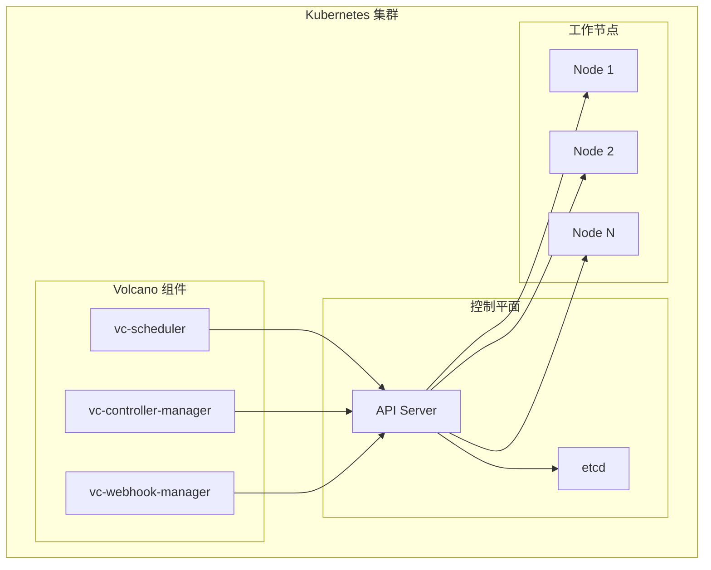
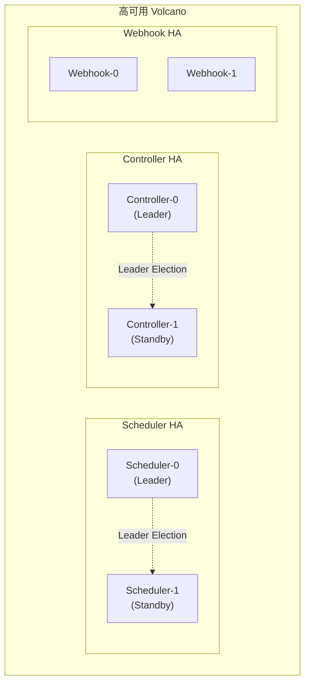
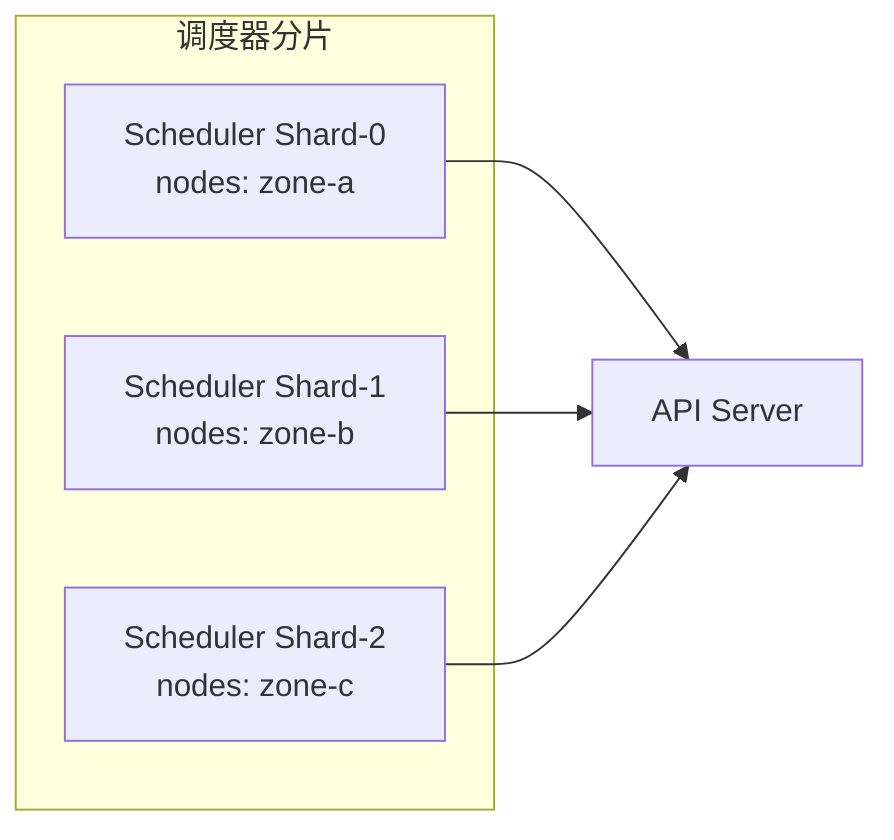
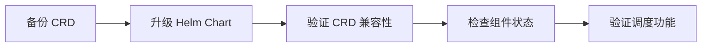

## 概述

本文档提供 Volcano 的完整安装、部署和升级指南，涵盖 Helm Chart 安装、YAML Manifest 安装、高可用部署、多调度器 Shard 配置以及版本升级等场景。

---

## 整体架构



Volcano 由三个核心组件组成：

| 组件 | 功能 | 默认副本数 |
|------|------|-----------|
| `vc-scheduler` | 批量调度器，执行 Action/Plugin 调度流水线 | 1 |
| `vc-controller-manager` | 管理 Job、Queue、PodGroup 等 CRD 的生命周期 | 1 |
| `vc-webhook-manager` | Admission Webhook，校验和变更资源 | 1 |

---

## 安装前提

### 环境要求

| 项目 | 要求 |
|------|------|
| Kubernetes 版本 | >= 1.24 |
| Helm 版本 | >= 3.0（Helm 安装方式） |
| kubectl | 已配置集群访问权限 |
| 网络 | 能访问镜像仓库 `docker.io/volcanosh/` |

### 镜像列表

```
docker.io/volcanosh/vc-controller-manager:<version>
docker.io/volcanosh/vc-scheduler:<version>
docker.io/volcanosh/vc-webhook-manager:<version>
```

---

## 方式一：Helm Chart 安装（推荐）

### 1. 添加 Helm 仓库

```bash
helm repo add volcano-sh https://volcano-sh.github.io/helm-charts
helm repo update
```

### 2. 安装 Volcano

```bash
# 创建命名空间并安装
helm install volcano volcano-sh/volcano \
  --namespace volcano-system \
  --create-namespace
```

### 3. 验证安装

```bash
# 检查 Pod 状态
kubectl get pods -n volcano-system

# 预期输出
NAME                                        READY   STATUS    RESTARTS   AGE
volcano-admission-xxxxx                     1/1     Running   0          1m
volcano-controllers-xxxxx                   1/1     Running   0          1m
volcano-scheduler-xxxxx                     1/1     Running   0          1m
```

### 4. 检查 CRD

```bash
kubectl get crd | grep volcano

# 预期输出
jobs.batch.volcano.sh                       2024-xx-xx
podgroups.scheduling.volcano.sh             2024-xx-xx
queues.scheduling.volcano.sh                2024-xx-xx
hypernodes.topology.volcano.sh              2024-xx-xx
jobflows.flow.volcano.sh                    2024-xx-xx
jobtemplates.flow.volcano.sh                2024-xx-xx
```

---

## 方式二：YAML Manifest 安装

```bash
# 下载并应用部署 YAML
kubectl apply -f https://raw.githubusercontent.com/volcano-sh/volcano/master/installer/volcano-development.yaml
```

或者使用特定版本：

```bash
# 替换 <version> 为具体版本号
kubectl apply -f https://github.com/volcano-sh/volcano/releases/download/<version>/volcano-<version>.yaml
```

---

## Helm Chart 配置详解

### values.yaml 核心参数

Helm Chart 的配置文件位于 `installer/helm/chart/volcano/values.yaml`。

#### 镜像配置

```yaml
basic:
  image_registry: "docker.io"              # 镜像仓库
  image_tag_version: "latest"              # 镜像版本
  image_pull_policy: "Always"              # 镜像拉取策略
  image_pull_secret: ""                    # 私有仓库密钥
  controller_image_name: "volcanosh/vc-controller-manager"
  scheduler_image_name: "volcanosh/vc-scheduler"
  admission_image_name: "volcanosh/vc-webhook-manager"
```

#### 组件副本与性能配置

```yaml
custom:
  # 副本数
  scheduler_replicas: 1                    # 调度器副本
  controller_replicas: 1                   # 控制器副本
  admission_replicas: 1                    # Webhook 副本

  # 调度器性能
  scheduler_schedule_period: 1s            # 调度周期
  scheduler_kube_api_qps: 2000            # API QPS 限制
  scheduler_kube_api_burst: 2000          # API Burst 限制
  scheduler_node_worker_threads: 20        # Node Worker 线程数

  # 控制器性能
  controller_kube_api_qps: 50             # 控制器 API QPS
  controller_kube_api_burst: 100          # 控制器 API Burst
  controller_worker_threads: 3             # 控制器 Worker 线程
  controller_worker_threads_for_gc: 5      # GC Worker 线程
  controller_worker_threads_for_podgroup: 5  # PodGroup Worker 线程
```

#### 功能开关

```yaml
custom:
  metrics_enable: false                    # 全局 Metrics 开关
  scheduler_metrics_enable: true           # 调度器 Metrics
  controller_metrics_enable: true          # 控制器 Metrics
  scheduler_pprof_enable: false            # pprof 性能分析
  leader_elect_enable: false               # Leader 选举（HA 需开启）
  colocation_enable: false                 # 混部功能
  go_memlimit_enable: false                # Go 内存限制
```

#### Webhook 配置

```yaml
custom:
  admission_enable: true
  enabled_admissions: >-
    /jobs/mutate,
    /jobs/validate,
    /podgroups/validate,
    /queues/mutate,
    /queues/validate,
    /hypernodes/validate,
    /cronjobs/validate
```

---

## 自定义调度器配置

### 覆盖默认配置

通过 `scheduler_config_override` 覆盖调度器配置：

```yaml
custom:
  scheduler_config_override: |
    actions: "enqueue, allocate, backfill"
    tiers:
    - plugins:
      - name: priority
      - name: gang
        enablePreemptable: false
      - name: conformance
    - plugins:
      - name: overcommit
      - name: drf
        enablePreemptable: false
      - name: predicates
      - name: proportion
      - name: nodeorder
      - name: binpack
```

### 启用抢占和回收

```yaml
custom:
  scheduler_config_override: |
    actions: "enqueue, allocate, preempt, reclaim, backfill"
    tiers:
    - plugins:
      - name: priority
      - name: gang
      - name: conformance
    - plugins:
      - name: overcommit
      - name: drf
      - name: predicates
      - name: proportion
      - name: nodeorder
      - name: binpack
```

### 启用拓扑感知调度

```yaml
custom:
  scheduler_config_override: |
    actions: "enqueue, allocate, backfill"
    tiers:
    - plugins:
      - name: priority
      - name: gang
      - name: conformance
    - plugins:
      - name: overcommit
      - name: predicates
      - name: proportion
      - name: nodeorder
      - name: binpack
      - name: network-topology-aware
        arguments:
          weight: 10
          hypernode.binpack.cpu: 1
          hypernode.binpack.memory: 1
```

---

## 高可用部署

### 架构



### 配置 HA

```yaml
custom:
  # 启用 Leader 选举
  leader_elect_enable: true

  # 多副本
  scheduler_replicas: 2
  controller_replicas: 2
  admission_replicas: 2
```

> **注意**：Scheduler 和 Controller 通过 Kubernetes Leader Election 机制实现高可用，同一时间只有一个 Leader 实例处理请求。Webhook 因为是无状态的，可以直接多副本负载均衡。

---

## 多调度器 Shard 部署

当集群规模较大（数千节点）时，可以将调度器按节点分片部署：



每个 Shard 独立负责一部分节点的调度，通过 NodeSelector 或 Label 划分职责区域。具体分片配置取决于集群拓扑和业务需求。

---

## 离线安装

### 1. 导出镜像

```bash
# 在有网络的环境导出镜像
VERSION="latest"
docker pull docker.io/volcanosh/vc-controller-manager:${VERSION}
docker pull docker.io/volcanosh/vc-scheduler:${VERSION}
docker pull docker.io/volcanosh/vc-webhook-manager:${VERSION}

docker save -o volcano-images.tar \
  volcanosh/vc-controller-manager:${VERSION} \
  volcanosh/vc-scheduler:${VERSION} \
  volcanosh/vc-webhook-manager:${VERSION}
```

### 2. 导入镜像

```bash
# 在目标集群的每个节点导入
docker load -i volcano-images.tar
```

### 3. 安装（使用私有仓库）

```bash
helm install volcano volcano-sh/volcano \
  --namespace volcano-system \
  --create-namespace \
  --set basic.image_registry=my-registry.example.com \
  --set basic.image_tag_version=${VERSION} \
  --set basic.image_pull_policy=IfNotPresent
```

---

## 版本升级

### Helm 升级

```bash
# 更新 Helm 仓库
helm repo update

# 升级到新版本
helm upgrade volcano volcano-sh/volcano \
  --namespace volcano-system \
  --set basic.image_tag_version=<new-version>
```

### 升级流程



### 升级注意事项

1. **CRD 兼容性**：升级前备份现有 CRD，确认新版本 CRD 向后兼容
2. **滚动更新**：Helm 默认使用 RollingUpdate 策略，不影响正在运行的 Job
3. **配置迁移**：检查 `values.yaml` 变更日志，确认配置参数是否有变化
4. **回滚准备**：保留上一个版本的 Helm Release，以便快速回滚

```bash
# 回滚到上一版本
helm rollback volcano -n volcano-system
```

---

## 卸载

```bash
# Helm 卸载
helm uninstall volcano -n volcano-system

# 清理 CRD（可选，会删除所有 Volcano 资源）
kubectl delete crd \
  jobs.batch.volcano.sh \
  podgroups.scheduling.volcano.sh \
  queues.scheduling.volcano.sh \
  hypernodes.topology.volcano.sh \
  jobflows.flow.volcano.sh \
  jobtemplates.flow.volcano.sh

# 删除命名空间
kubectl delete namespace volcano-system
```

---

## 快速验证

安装完成后，创建一个简单的 Job 验证 Volcano 是否正常工作：

```yaml
apiVersion: batch.volcano.sh/v1alpha1
kind: Job
metadata:
  name: test-job
spec:
  minAvailable: 1
  schedulerName: volcano
  queue: default
  tasks:
    - replicas: 1
      name: test
      template:
        spec:
          containers:
            - name: test
              image: busybox
              command: ["echo", "Volcano is working!"]
          restartPolicy: Never
```

```bash
# 创建测试 Job
kubectl apply -f test-job.yaml

# 检查 Job 状态
kubectl get vcjob test-job

# 查看 Pod 日志
kubectl logs -l volcano.sh/job-name=test-job
```

---

## 常见安装问题

| 问题 | 原因 | 解决方案 |
|------|------|---------|
| Webhook Pod 启动失败 | 证书生成失败 | 检查 `volcano-admission-secret`，确认 cert-manager 或内置证书生成正常 |
| CRD 创建失败 | 权限不足 | 确认安装账号有 cluster-admin 权限 |
| 调度器无法连接 API Server | RBAC 配置缺失 | 检查 ClusterRole/ClusterRoleBinding |
| 镜像拉取失败 | 网络不通或私有仓库认证 | 配置 `image_pull_secret` 或使用离线安装 |
| Pod 一直 Pending | 未指定 `schedulerName: volcano` | Job Spec 中添加 `schedulerName: volcano` |

---

## 参考文件

| 文件 | 说明 |
|------|------|
| `installer/helm/chart/volcano/values.yaml` | Helm 配置默认值 |
| `installer/helm/chart/volcano/config/volcano-scheduler.conf` | 调度器默认配置 |
| `installer/helm/chart/volcano/config/volcano-admission.conf` | Webhook 默认配置 |
| `installer/helm/chart/volcano/crd/bases/` | CRD 定义文件 |
